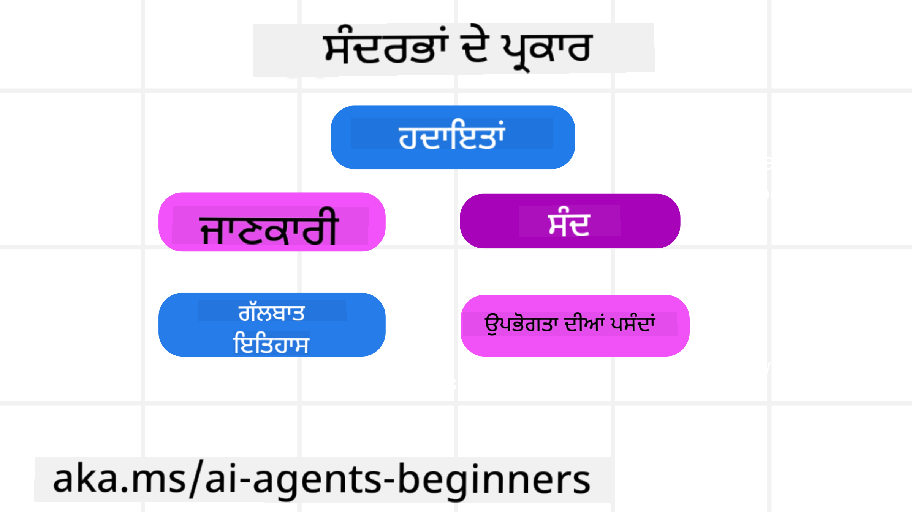
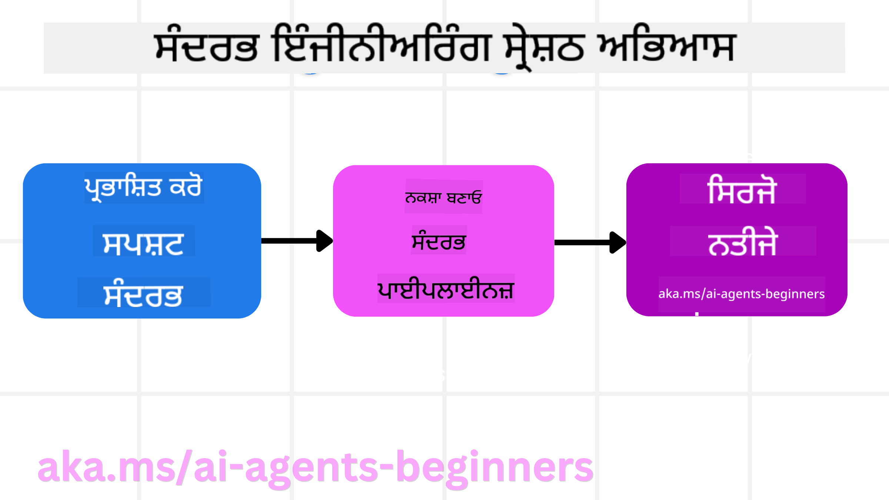

<!--
CO_OP_TRANSLATOR_METADATA:
{
  "original_hash": "cb7e50f471905ce6fdb92a30269a7a98",
  "translation_date": "2025-09-04T09:59:10+00:00",
  "source_file": "12-context-engineering/README.md",
  "language_code": "pa"
}
-->
# ਏਆਈ ਏਜੰਟਾਂ ਲਈ ਕੌਂਟੈਕਸਟ ਇੰਜੀਨੀਅਰਿੰਗ

> _(ਉਪਰ ਦਿੱਤੀ ਤਸਵੀਰ 'ਤੇ ਕਲਿੱਕ ਕਰਕੇ ਇਸ ਪਾਠ ਦਾ ਵੀਡੀਓ ਵੇਖੋ)_

ਤੁਹਾਡੇ ਦੁਆਰਾ ਬਣਾਏ ਜਾ ਰਹੇ ਏਆਈ ਏਜੰਟ ਲਈ ਐਪਲੀਕੇਸ਼ਨ ਦੀ ਜਟਿਲਤਾ ਨੂੰ ਸਮਝਣਾ ਇੱਕ ਭਰੋਸੇਯੋਗ ਏਜੰਟ ਬਣਾਉਣ ਲਈ ਮਹੱਤਵਪੂਰਨ ਹੈ। ਸਾਨੂੰ ਅਜਿਹੇ ਏਆਈ ਏਜੰਟ ਬਣਾਉਣ ਦੀ ਲੋੜ ਹੈ ਜੋ ਜਾਣਕਾਰੀ ਨੂੰ ਪ੍ਰਭਾਵਸ਼ਾਲੀ ਢੰਗ ਨਾਲ ਪ੍ਰਬੰਧਿਤ ਕਰ ਸਕਣ ਤਾਂ ਜੋ ਸਿਰਫ ਪ੍ਰੌੰਪਟ ਇੰਜੀਨੀਅਰਿੰਗ ਤੋਂ ਪਰੇ ਜਟਿਲ ਲੋੜਾਂ ਨੂੰ ਪੂਰਾ ਕੀਤਾ ਜਾ ਸਕੇ।

ਇਸ ਪਾਠ ਵਿੱਚ, ਅਸੀਂ ਦੇਖਾਂਗੇ ਕਿ ਕੌਂਟੈਕਸਟ ਇੰਜੀਨੀਅਰਿੰਗ ਕੀ ਹੈ ਅਤੇ ਏਆਈ ਏਜੰਟ ਬਣਾਉਣ ਵਿੱਚ ਇਸ ਦੀ ਕੀ ਭੂਮਿਕਾ ਹੈ।

## ਪਰਿਚਯ

ਇਸ ਪਾਠ ਵਿੱਚ ਅਸੀਂ ਕਵਰ ਕਰਾਂਗੇ:

• **ਕੌਂਟੈਕਸਟ ਇੰਜੀਨੀਅਰਿੰਗ ਕੀ ਹੈ** ਅਤੇ ਇਹ ਪ੍ਰੌੰਪਟ ਇੰਜੀਨੀਅਰਿੰਗ ਤੋਂ ਕਿਵੇਂ ਵੱਖਰਾ ਹੈ।

• **ਪ੍ਰਭਾਵਸ਼ਾਲੀ ਕੌਂਟੈਕਸਟ ਇੰਜੀਨੀਅਰਿੰਗ ਲਈ ਰਣਨੀਤੀਆਂ**, ਜਿਸ ਵਿੱਚ ਜਾਣਕਾਰੀ ਨੂੰ ਲਿਖਣ, ਚੁਣਨ, ਸੰਕੋਚਿਤ ਕਰਨ ਅਤੇ ਅਲੱਗ ਕਰਨ ਦੇ ਤਰੀਕੇ ਸ਼ਾਮਲ ਹਨ।

• **ਆਮ ਕੌਂਟੈਕਸਟ ਫੇਲਯਰਜ਼**, ਜੋ ਤੁਹਾਡੇ ਏਆਈ ਏਜੰਟ ਨੂੰ ਪਟੜੀ ਤੋਂ ਉਤਾਰ ਸਕਦੇ ਹਨ, ਅਤੇ ਉਨ੍ਹਾਂ ਨੂੰ ਠੀਕ ਕਰਨ ਦੇ ਤਰੀਕੇ।

## ਸਿੱਖਣ ਦੇ ਲਕਸ਼

ਇਸ ਪਾਠ ਨੂੰ ਪੂਰਾ ਕਰਨ ਤੋਂ ਬਾਅਦ, ਤੁਸੀਂ ਇਹ ਸਮਝ ਸਕੋਗੇ ਕਿ:

• **ਕੌਂਟੈਕਸਟ ਇੰਜੀਨੀਅਰਿੰਗ ਨੂੰ ਪਰਿਭਾਸ਼ਿਤ ਕਰੋ** ਅਤੇ ਇਸਨੂੰ ਪ੍ਰੌੰਪਟ ਇੰਜੀਨੀਅਰਿੰਗ ਤੋਂ ਵੱਖਰਾ ਕਰੋ।

• **ਵੱਡੇ ਭਾਸ਼ਾ ਮਾਡਲ (LLM) ਐਪਲੀਕੇਸ਼ਨ ਵਿੱਚ ਕੌਂਟੈਕਸਟ ਦੇ ਮੁੱਖ ਹਿੱਸਿਆਂ ਦੀ ਪਛਾਣ ਕਰੋ।**

• **ਏਜੰਟ ਦੇ ਪ੍ਰਦਰਸ਼ਨ ਨੂੰ ਸੁਧਾਰਣ ਲਈ ਕੌਂਟੈਕਸਟ ਲਿਖਣ, ਚੁਣਨ, ਸੰਕੋਚਿਤ ਕਰਨ ਅਤੇ ਅਲੱਗ ਕਰਨ ਦੀ ਰਣਨੀਤੀਆਂ ਲਾਗੂ ਕਰੋ।**

• **ਆਮ ਕੌਂਟੈਕਸਟ ਫੇਲਯਰਜ਼ ਦੀ ਪਛਾਣ ਕਰੋ** ਜਿਵੇਂ ਕਿ ਪੌਇਜ਼ਨਿੰਗ, ਡਿਸਟ੍ਰੈਕਸ਼ਨ, ਕਨਫਿਊਜ਼ਨ ਅਤੇ ਕਲੈਸ਼, ਅਤੇ ਉਨ੍ਹਾਂ ਨੂੰ ਦੂਰ ਕਰਨ ਦੇ ਤਰੀਕੇ ਲਾਗੂ ਕਰੋ।

## ਕੌਂਟੈਕਸਟ ਇੰਜੀਨੀਅਰਿੰਗ ਕੀ ਹੈ?

ਏਆਈ ਏਜੰਟਾਂ ਲਈ, ਕੌਂਟੈਕਸਟ ਉਹ ਹੈ ਜੋ ਏਆਈ ਏਜੰਟ ਨੂੰ ਕੁਝ ਕਾਰਵਾਈ ਕਰਨ ਦੀ ਯੋਜਨਾ ਬਣਾਉਣ ਲਈ ਪ੍ਰੇਰਿਤ ਕਰਦਾ ਹੈ। ਕੌਂਟੈਕਸਟ ਇੰਜੀਨੀਅਰਿੰਗ ਇਹ ਯਕੀਨੀ ਬਣਾਉਣ ਦੀ ਪ੍ਰਕਿਰਿਆ ਹੈ ਕਿ ਏਆਈ ਏਜੰਟ ਕੋਲ ਕੰਮ ਦੇ ਅਗਲੇ ਕਦਮ ਨੂੰ ਪੂਰਾ ਕਰਨ ਲਈ ਸਹੀ ਜਾਣਕਾਰੀ ਹੈ। ਕੌਂਟੈਕਸਟ ਵਿੰਡੋ ਦਾ ਆਕਾਰ ਸੀਮਿਤ ਹੁੰਦਾ ਹੈ, ਇਸ ਲਈ ਏਜੰਟ ਬਣਾਉਣ ਵਾਲਿਆਂ ਵਜੋਂ ਸਾਨੂੰ ਸਿਸਟਮ ਅਤੇ ਪ੍ਰਕਿਰਿਆਵਾਂ ਬਣਾਉਣ ਦੀ ਲੋੜ ਹੈ ਜੋ ਕੌਂਟੈਕਸਟ ਵਿੰਡੋ ਵਿੱਚ ਜਾਣਕਾਰੀ ਨੂੰ ਸ਼ਾਮਲ ਕਰਨ, ਹਟਾਉਣ ਅਤੇ ਸੰਕੋਚਿਤ ਕਰਨ ਦਾ ਪ੍ਰਬੰਧ ਕਰ ਸਕਣ।

### ਪ੍ਰੌੰਪਟ ਇੰਜੀਨੀਅਰਿੰਗ ਵਸੋਂ ਕੌਂਟੈਕਸਟ ਇੰਜੀਨੀਅਰਿੰਗ

ਪ੍ਰੌੰਪਟ ਇੰਜੀਨੀਅਰਿੰਗ ਇੱਕ ਸਥਿਰ ਨਿਰਦੇਸ਼ਾਂ ਦੇ ਸੈੱਟ 'ਤੇ ਕੇਂਦਰਿਤ ਹੁੰਦੀ ਹੈ ਜੋ ਏਆਈ ਏਜੰਟਾਂ ਨੂੰ ਨਿਯਮਾਂ ਦੇ ਸੈੱਟ ਨਾਲ ਪ੍ਰਭਾਵਸ਼ਾਲੀ ਢੰਗ ਨਾਲ ਗਾਈਡ ਕਰਦੀ ਹੈ। ਕੌਂਟੈਕਸਟ ਇੰਜੀਨੀਅਰਿੰਗ ਇਹ ਹੈ ਕਿ ਸ਼ੁਰੂਆਤੀ ਪ੍ਰੌੰਪਟ ਸਮੇਤ ਜਾਣਕਾਰੀ ਦੇ ਗਤੀਸ਼ੀਲ ਸੈੱਟ ਦਾ ਪ੍ਰਬੰਧਨ ਕਿਵੇਂ ਕਰਨਾ ਹੈ, ਇਹ ਯਕੀਨੀ ਬਣਾਉਣ ਲਈ ਕਿ ਏਆਈ ਏਜੰਟ ਕੋਲ ਸਮੇਂ ਦੇ ਨਾਲ ਜੋ ਲੋੜੀਂਦਾ ਹੈ ਉਹ ਹੈ। ਕੌਂਟੈਕਸਟ ਇੰਜੀਨੀਅਰਿੰਗ ਦੇ ਆਸਪਾਸ ਦਾ ਮੁੱਖ ਵਿਚਾਰ ਇਸ ਪ੍ਰਕਿਰਿਆ ਨੂੰ ਦੁਹਰਾਉਣਯੋਗ ਅਤੇ ਭਰੋਸੇਯੋਗ ਬਣਾਉਣਾ ਹੈ।

### ਕੌਂਟੈਕਸਟ ਦੇ ਪ੍ਰਕਾਰ

ਇਹ ਯਾਦ ਰੱਖਣਾ ਮਹੱਤਵਪੂਰਨ ਹੈ ਕਿ ਕੌਂਟੈਕਸਟ ਸਿਰਫ ਇੱਕ ਚੀਜ਼ ਨਹੀਂ ਹੈ। ਉਹ ਜਾਣਕਾਰੀ ਜੋ ਏਆਈ ਏਜੰਟ ਨੂੰ ਲੋੜੀਂਦੀ ਹੈ ਵੱਖ-ਵੱਖ ਸਰੋਤਾਂ ਤੋਂ ਆ ਸਕਦੀ ਹੈ, ਅਤੇ ਇਹ ਸਾਡੀ ਜ਼ਿੰਮੇਵਾਰੀ ਹੈ ਕਿ ਇਹ ਯਕੀਨੀ ਬਣਾਇਆ ਜਾਵੇ ਕਿ ਏਜੰਟ ਨੂੰ ਇਹਨਾਂ ਸਰੋਤਾਂ ਤੱਕ ਪਹੁੰਚ ਹੈ:

ਏਆਈ ਏਜੰਟ ਨੂੰ ਪ੍ਰਬੰਧਿਤ ਕਰਨ ਦੀ ਲੋੜ ਹੋ ਸਕਦੀ ਕੌਂਟੈਕਸਟ ਦੇ ਪ੍ਰਕਾਰ ਸ਼ਾਮਲ ਹਨ:

• **ਨਿਰਦੇਸ਼:** ਇਹ ਏਜੰਟ ਦੇ "ਨਿਯਮਾਂ" ਵਾਂਗ ਹਨ – ਪ੍ਰੌੰਪਟ, ਸਿਸਟਮ ਸੁਨੇਹੇ, ਕੁਝ ਉਦਾਹਰਣ (ਏਆਈ ਨੂੰ ਕੁਝ ਕਰਨ ਦਾ ਤਰੀਕਾ ਦਿਖਾਉਣਾ), ਅਤੇ ਉਹ ਸੰਦਾਂ ਦੇ ਵੇਰਵੇ ਜੋ ਇਹ ਵਰਤ ਸਕਦਾ ਹੈ। ਇਹ ਉਹ ਜਗ੍ਹਾ ਹੈ ਜਿੱਥੇ ਪ੍ਰੌੰਪਟ ਇੰਜੀਨੀਅਰਿੰਗ ਕੌਂਟੈਕਸਟ ਇੰਜੀਨੀਅਰਿੰਗ ਨਾਲ ਮਿਲਦੀ ਹੈ।

• **ਗਿਆਨ:** ਇਹ ਤੱਥਾਂ, ਡਾਟਾਬੇਸ ਤੋਂ ਪ੍ਰਾਪਤ ਜਾਣਕਾਰੀ, ਜਾਂ ਲੰਬੇ ਸਮੇਂ ਦੀਆਂ ਯਾਦਾਂ ਨੂੰ ਕਵਰ ਕਰਦਾ ਹੈ ਜੋ ਏਜੰਟ ਨੇ ਇਕੱਠੀਆਂ ਕੀਤੀਆਂ ਹਨ। ਇਸ ਵਿੱਚ ਇੱਕ ਰੀਟਰੀਵਲ ਆਗਮੈਂਟਡ ਜਨਰੇਸ਼ਨ (RAG) ਸਿਸਟਮ ਨੂੰ ਸ਼ਾਮਲ ਕਰਨਾ ਸ਼ਾਮਲ ਹੈ ਜੇਕਰ ਇੱਕ ਏਜੰਟ ਨੂੰ ਵੱਖ-ਵੱਖ ਗਿਆਨ ਸਟੋਰਾਂ ਅਤੇ ਡਾਟਾਬੇਸਾਂ ਤੱਕ ਪਹੁੰਚ ਦੀ ਲੋੜ ਹੈ।

• **ਸੰਦ:** ਇਹ ਬਾਹਰੀ ਫੰਕਸ਼ਨਾਂ, APIs ਅਤੇ MCP ਸਰਵਰਾਂ ਦੇ ਵੇਰਵੇ ਹਨ ਜਿਨ੍ਹਾਂ ਨੂੰ ਏਜੰਟ ਕਾਲ ਕਰ ਸਕਦਾ ਹੈ, ਨਾਲ ਹੀ ਉਨ੍ਹਾਂ ਦੇ ਫੀਡਬੈਕ (ਨਤੀਜੇ) ਜੋ ਇਹਨਾਂ ਨੂੰ ਵਰਤਣ ਤੋਂ ਮਿਲਦੇ ਹਨ।

• **ਗੱਲਬਾਤ ਦਾ ਇਤਿਹਾਸ:** ਉਪਭੋਗਤਾ ਨਾਲ ਚੱਲ ਰਹੀ ਗੱਲਬਾਤ। ਸਮੇਂ ਦੇ ਨਾਲ, ਇਹ ਗੱਲਬਾਤਾਂ ਲੰਬੀਆਂ ਅਤੇ ਜਟਿਲ ਹੋ ਜਾਂਦੀਆਂ ਹਨ ਜਿਸਦਾ ਮਤਲਬ ਹੈ ਕਿ ਇਹ ਕੌਂਟੈਕਸਟ ਵਿੰਡੋ ਵਿੱਚ ਜਗ੍ਹਾ ਘੇਰ ਲੈਂਦੀਆਂ ਹਨ।

• **ਉਪਭੋਗਤਾ ਦੀਆਂ ਪਸੰਦਾਂ:** ਸਮੇਂ ਦੇ ਨਾਲ ਉਪਭੋਗਤਾ ਦੀਆਂ ਪਸੰਦਾਂ ਜਾਂ ਨਾਪਸੰਦਾਂ ਬਾਰੇ ਸਿੱਖੀ ਜਾਣਕਾਰੀ। ਇਹਨਾਂ ਨੂੰ ਸਟੋਰ ਕੀਤਾ ਜਾ ਸਕਦਾ ਹੈ ਅਤੇ ਉਪਭੋਗਤਾ ਦੀ ਮਦਦ ਕਰਨ ਲਈ ਮੁੱਖ ਫੈਸਲੇ ਲੈਂਦੇ ਸਮੇਂ ਕਾਲ ਕੀਤਾ ਜਾ ਸਕਦਾ ਹੈ।

## ਪ੍ਰਭਾਵਸ਼ਾਲੀ ਕੌਂਟੈਕਸਟ ਇੰਜੀਨੀਅਰਿੰਗ ਲਈ ਰਣਨੀਤੀਆਂ

### ਯੋਜਨਾ ਬਣਾਉਣ ਦੀਆਂ ਰਣਨੀਤੀਆਂ

ਚੰਗੀ ਕੌਂਟੈਕਸਟ ਇੰਜੀਨੀਅਰਿੰਗ ਚੰਗੀ ਯੋਜਨਾ ਨਾਲ ਸ਼ੁਰੂ ਹੁੰਦੀ ਹੈ। ਇੱਥੇ ਇੱਕ ਪਹੁੰਚ ਹੈ ਜੋ ਤੁਹਾਨੂੰ ਕੌਂਟੈਕਸਟ ਇੰਜੀਨੀਅਰਿੰਗ ਦੇ ਸਿਧਾਂਤ ਨੂੰ ਲਾਗੂ ਕਰਨ ਬਾਰੇ ਸੋਚਣ ਵਿੱਚ ਮਦਦ ਕਰੇਗੀ:

1. **ਸਪਸ਼ਟ ਨਤੀਜੇ ਪਰਿਭਾਸ਼ਿਤ ਕਰੋ** - ਉਹ ਨਤੀਜੇ ਜੋ ਏਆਈ ਏਜੰਟਾਂ ਨੂੰ ਸੌਂਪੇ ਜਾਣ ਵਾਲੇ ਕੰਮਾਂ ਦੇ ਹੋਣੇ ਚਾਹੀਦੇ ਹਨ ਸਪਸ਼ਟ ਤੌਰ 'ਤੇ ਪਰਿਭਾਸ਼ਿਤ ਕੀਤੇ ਜਾਣੇ ਚਾਹੀਦੇ ਹਨ। ਸਵਾਲ ਦਾ ਜਵਾਬ ਦਿਓ - "ਜਦੋਂ ਏਆਈ ਏਜੰਟ ਆਪਣਾ ਕੰਮ ਪੂਰਾ ਕਰ ਲਵੇਗਾ ਤਾਂ ਦੁਨੀਆ ਕਿਵੇਂ ਲੱਗੇਗੀ?" ਦੂਜੇ ਸ਼ਬਦਾਂ ਵਿੱਚ, ਉਪਭੋਗਤਾ ਕੋਲ ਕੀ ਬਦਲਾਅ, ਜਾਣਕਾਰੀ ਜਾਂ ਜਵਾਬ ਹੋਣਾ ਚਾਹੀਦਾ ਹੈ ਜਦੋਂ ਉਹ ਏਆਈ ਏਜੰਟ ਨਾਲ ਸੰਪਰਕ ਕਰਦਾ ਹੈ।

2. **ਕੌਂਟੈਕਸਟ ਦਾ ਨਕਸ਼ਾ ਬਣਾਓ** - ਜਦੋਂ ਤੁਸੀਂ ਏਆਈ ਏਜੰਟ ਦੇ ਨਤੀਜਿਆਂ ਨੂੰ ਪਰਿਭਾਸ਼ਿਤ ਕਰ ਲੈਂਦੇ ਹੋ, ਤਾਂ ਤੁਹਾਨੂੰ ਸਵਾਲ ਦਾ ਜਵਾਬ ਦੇਣਾ ਪਵੇਗਾ "ਏਆਈ ਏਜੰਟ ਨੂੰ ਇਹ ਕੰਮ ਪੂਰਾ ਕਰਨ ਲਈ ਕਿਹੜੀ ਜਾਣਕਾਰੀ ਦੀ ਲੋੜ ਹੈ?" ਇਸ ਤਰੀਕੇ ਨਾਲ ਤੁਸੀਂ ਸ਼ੁਰੂ ਕਰ ਸਕਦੇ ਹੋ ਕਿ ਉਹ ਜਾਣਕਾਰੀ ਕਿੱਥੇ ਮਿਲ ਸਕਦੀ ਹੈ।

3. **ਕੌਂਟੈਕਸਟ ਪਾਈਪਲਾਈਨ ਬਣਾਓ** - ਹੁਣ ਜਦੋਂ ਤੁਹਾਨੂੰ ਪਤਾ ਹੈ ਕਿ ਜਾਣਕਾਰੀ ਕਿੱਥੇ ਹੈ, ਤੁਹਾਨੂੰ ਸਵਾਲ ਦਾ ਜਵਾਬ ਦੇਣਾ ਪਵੇਗਾ "ਏਜੰਟ ਇਹ ਜਾਣਕਾਰੀ ਕਿਵੇਂ ਪ੍ਰਾਪਤ ਕਰੇਗਾ?" ਇਹ ਵੱਖ-ਵੱਖ ਤਰੀਕਿਆਂ ਨਾਲ ਕੀਤਾ ਜਾ ਸਕਦਾ ਹੈ ਜਿਸ ਵਿੱਚ RAG, MCP ਸਰਵਰਾਂ ਅਤੇ ਹੋਰ ਸੰਦਾਂ ਦੀ ਵਰਤੋਂ ਸ਼ਾਮਲ ਹੈ।

### ਵਿਹਾਰਕ ਰਣਨੀਤੀਆਂ

ਯੋਜਨਾ ਬਣਾਉਣਾ ਮਹੱਤਵਪੂਰਨ ਹੈ ਪਰ ਜਦੋਂ ਜਾਣਕਾਰੀ ਸਾਡੇ ਏਜੰਟ ਦੇ ਕੌਂਟੈਕਸਟ ਵਿੰਡੋ ਵਿੱਚ ਆਉਣ ਲੱਗਦੀ ਹੈ, ਤਾਂ ਸਾਨੂੰ ਇਸਨੂੰ ਪ੍ਰਬੰਧਿਤ ਕਰਨ ਲਈ ਵਿਹਾਰਕ ਰਣਨੀਤੀਆਂ ਦੀ ਲੋੜ ਹੁੰਦੀ ਹੈ:

#### ਕੌਂਟੈਕਸਟ ਦਾ ਪ੍ਰਬੰਧਨ

ਜਦੋਂ ਕੁਝ ਜਾਣਕਾਰੀ ਕੌਂਟੈਕਸਟ ਵਿੰਡੋ ਵਿੱਚ ਆਟੋਮੈਟਿਕ ਤੌਰ 'ਤੇ ਸ਼ਾਮਲ ਕੀਤੀ ਜਾਂਦੀ ਹੈ, ਕੌਂਟੈਕਸਟ ਇੰਜੀਨੀਅਰਿੰਗ ਇਸ ਜਾਣਕਾਰੀ ਦੀ ਇੱਕ ਜ਼ਿਆਦਾ ਸਰਗਰਮ ਭੂਮਿਕਾ ਲੈਣ ਬਾਰੇ ਹੈ ਜੋ ਕੁਝ ਰਣਨੀਤੀਆਂ ਦੁਆਰਾ ਕੀਤਾ ਜਾ ਸਕਦਾ ਹੈ:

1. **ਏਜੰਟ ਸਕ੍ਰੈਚਪੈਡ**  
ਇਹ ਏਆਈ ਏਜੰਟ ਨੂੰ ਇੱਕ ਸਿੰਗਲ ਸੈਸ਼ਨ ਦੌਰਾਨ ਮੌਜੂਦਾ ਕੰਮਾਂ ਅਤੇ ਉਪਭੋਗਤਾ ਗੱਲਬਾਤਾਂ ਬਾਰੇ ਸਬੰਧਤ ਜਾਣਕਾਰੀ ਦੇ ਨੋਟਸ ਲੈਣ ਦੀ ਆਗਿਆ ਦਿੰਦਾ ਹੈ। ਇਹ ਕੌਂਟੈਕਸਟ ਵਿੰਡੋ ਤੋਂ ਬਾਹਰ ਇੱਕ ਫਾਈਲ ਜਾਂ ਰਨਟਾਈਮ ਆਬਜੈਕਟ ਵਿੱਚ ਮੌਜੂਦ ਹੋਣਾ ਚਾਹੀਦਾ ਹੈ ਜਿਸਨੂੰ ਏਜੰਟ ਇਸ ਸੈਸ਼ਨ ਦੌਰਾਨ ਜ਼ਰੂਰਤ ਪੈਣ 'ਤੇ ਬਾਅਦ ਵਿੱਚ ਪ੍ਰਾਪਤ ਕਰ ਸਕਦਾ ਹੈ।

2. **ਯਾਦਾਂ**  
ਸਕ੍ਰੈਚਪੈਡ ਇੱਕ ਸਿੰਗਲ ਸੈਸ਼ਨ ਦੀ ਕੌਂਟੈਕਸਟ ਵਿੰਡੋ ਤੋਂ ਬਾਹਰ ਜਾਣਕਾਰੀ ਪ੍ਰਬੰਧਿਤ ਕਰਨ ਲਈ ਚੰਗੇ ਹਨ। ਯਾਦਾਂ ਏਜੰਟਾਂ ਨੂੰ ਕਈ ਸੈਸ਼ਨਾਂ ਵਿੱਚ ਸਬੰਧਤ ਜਾਣਕਾਰੀ ਸਟੋਰ ਅਤੇ ਪ੍ਰਾਪਤ ਕਰਨ ਦੀ ਆਗਿਆ ਦਿੰਦੀਆਂ ਹਨ। ਇਸ ਵਿੱਚ ਸੰਖੇਪ, ਉਪਭੋਗਤਾ ਦੀਆਂ ਪਸੰਦਾਂ ਅਤੇ ਭਵਿੱਖ ਵਿੱਚ ਸੁਧਾਰਾਂ ਲਈ ਫੀਡਬੈਕ ਸ਼ਾਮਲ ਹੋ ਸਕਦੇ ਹਨ।

3. **ਕੌਂਟੈਕਸਟ ਨੂੰ ਸੰਕੋਚਿਤ ਕਰਨਾ**  
ਜਦੋਂ ਕੌਂਟੈਕਸਟ ਵਿੰਡੋ ਵਧਦੀ ਹੈ ਅਤੇ ਆਪਣੀ ਸੀਮਾ ਦੇ ਨੇੜੇ ਪਹੁੰਚਦੀ ਹੈ, ਤਾਂ ਸੰਖੇਪ ਅਤੇ ਕੱਟਣ ਵਰਗੀਆਂ ਤਕਨੀਕਾਂ ਦੀ ਵਰਤੋਂ ਕੀਤੀ ਜਾ ਸਕਦੀ ਹੈ। ਇਸ ਵਿੱਚ ਸਿਰਫ ਸਭ ਤੋਂ ਸਬੰਧਤ ਜਾਣਕਾਰੀ ਰੱਖਣਾ ਜਾਂ ਪੁਰਾਣੇ ਸੁਨੇਹੇ ਹਟਾਉਣਾ ਸ਼ਾਮਲ ਹੈ।

4. **ਮਲਟੀ-ਏਜੰਟ ਸਿਸਟਮ**  
ਮਲਟੀ-ਏਜੰਟ ਸਿਸਟਮ ਵਿਕਸਿਤ ਕਰਨਾ ਕੌਂਟੈਕਸਟ ਇੰਜੀਨੀਅਰਿੰਗ ਦਾ ਇੱਕ ਰੂਪ ਹੈ ਕਿਉਂਕਿ ਹਰ ਏਜੰਟ ਦੀ ਆਪਣੀ ਕੌਂਟੈਕਸਟ ਵਿੰਡੋ ਹੁੰਦੀ ਹੈ। ਇਹ ਯੋਜਨਾ ਬਣਾਉਣਾ ਕਿ ਇਹ ਕੌਂਟੈਕਸਟ ਕਿਵੇਂ ਸਾਂਝਾ ਕੀਤਾ ਜਾਂਦਾ ਹੈ ਅਤੇ ਵੱਖ-ਵੱਖ ਏਜੰਟਾਂ ਨੂੰ ਪਾਸ ਕੀਤਾ ਜਾਂਦਾ ਹੈ, ਇਹਨਾਂ ਸਿਸਟਮਾਂ ਨੂੰ ਬਣਾਉਣ ਸਮੇਂ ਇੱਕ ਹੋਰ ਗੱਲ ਹੈ।

5. **ਸੈਂਡਬਾਕਸ ਵਾਤਾਵਰਣ**  
ਜੇਕਰ ਇੱਕ ਏਜੰਟ ਨੂੰ ਕੁਝ ਕੋਡ ਚਲਾਉਣ ਜਾਂ ਦਸਤਾਵੇਜ਼ ਵਿੱਚ ਵੱਡੀ ਮਾਤਰਾ ਵਿੱਚ ਜਾਣਕਾਰੀ ਪ੍ਰਕਿਰਿਆ ਕਰਨ ਦੀ ਲੋੜ ਹੈ, ਤਾਂ ਇਸਦੇ ਨਤੀਜੇ ਪ੍ਰਕਿਰਿਆ ਕਰਨ ਲਈ ਬਹੁਤ ਸਾਰੇ ਟੋਕਨ ਲੈ ਸਕਦੇ ਹਨ। ਇਸਦੇ ਸਾਰੇ ਨਤੀਜੇ ਕੌਂਟੈਕਸਟ ਵਿੰਡੋ ਵਿੱਚ ਸਟੋਰ ਕਰਨ ਦੀ ਬਜਾਏ, ਏਜੰਟ ਇੱਕ ਐਸਾ ਸੈਂਡਬਾਕਸ ਵਾਤਾਵਰਣ ਵਰਤ ਸਕਦਾ ਹੈ ਜੋ ਇਹ ਕੋਡ ਚਲਾ ਸਕੇ ਅਤੇ ਸਿਰਫ ਨਤੀਜੇ ਅਤੇ ਹੋਰ ਸਬੰਧਤ ਜਾਣਕਾਰੀ ਪੜ੍ਹ ਸਕੇ।

6. **ਰਨਟਾਈਮ ਸਟੇਟ ਆਬਜੈਕਟਸ**  
ਇਹ ਉਹ ਸਥਿਤੀਆਂ ਪ੍ਰਬੰਧਿਤ ਕਰਨ ਲਈ ਜਾਣਕਾਰੀ ਦੇ ਕੰਟੇਨਰ ਬਣਾਉਣ ਦੁਆਰਾ ਕੀਤਾ ਜਾਂਦਾ ਹੈ ਜਦੋਂ ਏਜੰਟ ਨੂੰ ਕੁਝ ਜਾਣਕਾਰੀ ਤੱਕ ਪਹੁੰਚ ਦੀ ਲੋੜ ਹੁੰਦੀ ਹੈ। ਇੱਕ ਜਟਿਲ ਕੰਮ ਲਈ, ਇਹ ਇੱਕ ਏਜੰਟ ਨੂੰ ਹਰ ਸਬਟਾਸਕ ਦੇ ਨਤੀਜਿਆਂ ਨੂੰ ਕਦਮ ਦਰ ਕਦਮ ਸਟੋਰ ਕਰਨ ਦੀ ਆਗਿਆ ਦੇਵੇਗਾ, ਜਿਸ ਨਾਲ ਕੌਂਟੈਕਸਟ ਸਿਰਫ ਉਸ ਖਾਸ ਸਬਟਾਸਕ ਨਾਲ ਜੁੜਿਆ ਰਹੇ।

### ਕੌਂਟੈਕਸਟ ਇੰਜੀਨੀਅਰਿੰਗ ਦਾ ਉਦਾਹਰਣ

ਮੰਨੋ ਕਿ ਅਸੀਂ ਇੱਕ ਏਆਈ ਏਜੰਟ ਨੂੰ **"ਮੇਰੇ ਲਈ ਪੈਰਿਸ ਦਾ ਟ੍ਰਿਪ ਬੁੱਕ ਕਰੋ।"** ਕਹਿੰਦੇ ਹਾਂ।

• ਸਿਰਫ ਪ੍ਰੌੰਪਟ ਇੰਜੀਨੀਅਰਿੰਗ ਵਰਤਣ ਵਾਲਾ ਇੱਕ ਸਧਾਰਨ ਏਜੰਟ ਸਿਰਫ ਇਹ ਜਵਾਬ ਦੇ ਸਕਦਾ ਹੈ: **"ਠੀਕ ਹੈ, ਤੁਸੀਂ ਕਦੋਂ ਪੈਰਿਸ ਜਾਣਾ ਚਾਹੁੰਦੇ ਹੋ?"**। ਇਸਨੇ ਸਿਰਫ ਤੁਹਾਡੇ ਸਵਾਲ ਨੂੰ ਉਸ ਸਮੇਂ ਪ੍ਰਕਿਰਿਆ ਕੀਤੀ ਜਦੋਂ ਉਪਭੋਗਤਾ ਨੇ ਪੁੱਛਿਆ।

• ਕੌਂਟੈਕਸਟ ਇੰਜੀਨੀਅਰਿੰਗ ਦੀਆਂ ਰਣਨੀਤੀਆਂ ਵਰਤਣ ਵਾਲਾ ਇੱਕ ਏਜੰਟ ਇਸ ਤੋਂ ਕਾਫ਼ੀ ਵੱਧ ਕਰੇਗਾ। ਜਵਾਬ ਦੇਣ ਤੋਂ ਪਹਿਲਾਂ, ਇਸਦਾ ਸਿਸਟਮ ਸ਼ਾਇਦ ਇਹ ਕਰੇਗਾ:

  ◦ **ਤੁਹਾਡੇ ਕੈਲੰਡਰ ਦੀ ਜਾਂਚ ਕਰੋ** ਖਾਲੀ ਮਿਤੀਆਂ ਲਈ (ਰੀਅਲ-ਟਾਈਮ ਡਾਟਾ ਪ੍ਰਾਪਤ ਕਰਨਾ)।  
  ◦ **ਪਿਛਲੀਆਂ ਯਾਤਰਾ ਪਸੰਦਾਂ ਨੂੰ ਯਾਦ ਕਰੋ** (ਲੰਬੇ ਸਮੇਂ ਦੀ ਯਾਦ ਤੋਂ) ਜਿਵੇਂ ਕਿ ਤੁਹਾਡੀ ਪਸੰਦੀਦਾ ਏਅਰਲਾਈਨ, ਬਜਟ, ਜਾਂ ਕੀ ਤੁਸੀਂ ਸਿੱਧੀਆਂ ਉਡਾਣਾਂ ਨੂੰ ਤਰਜੀਹ ਦਿੰਦੇ ਹੋ।  
  ◦ **ਉਪਲਬਧ ਸੰਦਾਂ ਦੀ ਪਛਾਣ ਕਰੋ** ਉਡਾਣ ਅਤੇ ਹੋਟਲ ਬੁੱਕਿੰਗ ਲਈ।  

- ਫਿਰ, ਇੱਕ ਉਦਾਹਰਣ ਜਵਾਬ ਹੋ ਸਕਦਾ ਹੈ: "ਹੈਲੋ [ਤੁਹਾਡਾ ਨਾਮ]! ਮੈਂ ਵੇਖ ਰਿਹਾ ਹਾਂ ਕਿ ਤੁਸੀਂ ਅਕਤੂਬਰ ਦੇ ਪਹਿਲੇ ਹਫ਼ਤੇ ਵਿੱਚ ਖਾਲੀ ਹੋ। ਕੀ ਮੈਂ [ਪਸੰਦੀਦਾ ਏਅਰਲਾਈਨ] 'ਤੇ ਸਿੱਧੀਆਂ ਉਡਾਣਾਂ ਨੂੰ ਤੁਹਾਡੇ ਆਮ ਬਜਟ [ਬਜਟ] ਦੇ ਅੰਦਰ ਲੱਭਾਂ?"। ਇਹ ਜ਼ਿਆਦਾ ਕੌਂਟੈਕਸਟ-ਅਵੇਅਰ ਜਵਾਬ ਕੌਂਟੈਕਸਟ ਇੰਜੀਨੀਅਰਿੰਗ ਦੀ ਸ਼ਕਤੀ

---

**ਅਸਵੀਕਰਤੀ**:  
ਇਹ ਦਸਤਾਵੇਜ਼ AI ਅਨੁਵਾਦ ਸੇਵਾ [Co-op Translator](https://github.com/Azure/co-op-translator) ਦੀ ਵਰਤੋਂ ਕਰਕੇ ਅਨੁਵਾਦ ਕੀਤਾ ਗਿਆ ਹੈ। ਜਦੋਂ ਕਿ ਅਸੀਂ ਸਹੀਤਾ ਲਈ ਯਤਨਸ਼ੀਲ ਹਾਂ, ਕਿਰਪਾ ਕਰਕੇ ਧਿਆਨ ਦਿਓ ਕਿ ਸਵੈਚਾਲਿਤ ਅਨੁਵਾਦਾਂ ਵਿੱਚ ਗਲਤੀਆਂ ਜਾਂ ਅਸੁੱਤੀਆਂ ਹੋ ਸਕਦੀਆਂ ਹਨ। ਮੂਲ ਦਸਤਾਵੇਜ਼ ਨੂੰ ਇਸਦੀ ਮੂਲ ਭਾਸ਼ਾ ਵਿੱਚ ਅਧਿਕਾਰਤ ਸਰੋਤ ਮੰਨਿਆ ਜਾਣਾ ਚਾਹੀਦਾ ਹੈ। ਮਹੱਤਵਪੂਰਨ ਜਾਣਕਾਰੀ ਲਈ, ਪੇਸ਼ੇਵਰ ਮਨੁੱਖੀ ਅਨੁਵਾਦ ਦੀ ਸਿਫਾਰਸ਼ ਕੀਤੀ ਜਾਂਦੀ ਹੈ। ਇਸ ਅਨੁਵਾਦ ਦੀ ਵਰਤੋਂ ਤੋਂ ਪੈਦਾ ਹੋਣ ਵਾਲੇ ਕਿਸੇ ਵੀ ਗਲਤ ਫਹਿਮੀ ਜਾਂ ਗਲਤ ਵਿਆਖਿਆ ਲਈ ਅਸੀਂ ਜ਼ਿੰਮੇਵਾਰ ਨਹੀਂ ਹਾਂ।