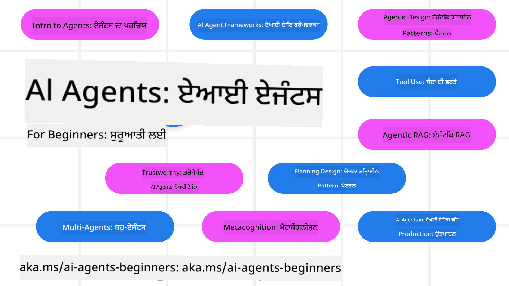

<!--
CO_OP_TRANSLATOR_METADATA:
{
  "original_hash": "6b07046397366e6f6f4524c9ddeba1e1",
  "translation_date": "2025-07-12T14:48:11+00:00",
  "source_file": "README.md",
  "language_code": "pa"
}
-->
# AI ਏਜੰਟਸ ਬਿਗਿਨਰਜ਼ ਲਈ - ਇੱਕ ਕੋਰਸ

## 11 ਪਾਠ ਜੋ ਤੁਹਾਨੂੰ AI ਏਜੰਟਸ ਬਣਾਉਣ ਲਈ ਸਾਰੀ ਜ਼ਰੂਰੀ ਜਾਣਕਾਰੀ ਸਿਖਾਉਂਦੇ ਹਨ

### 🌐 ਬਹੁ-ਭਾਸ਼ਾਈ ਸਹਾਇਤਾ

#### GitHub Action ਰਾਹੀਂ ਸਹਾਇਤਾ (ਆਟੋਮੈਟਿਕ ਅਤੇ ਹਮੇਸ਼ਾ ਅਪ-ਟੂ-ਡੇਟ)

[French](../fr/README.md) | [Spanish](../es/README.md) | [German](../de/README.md) | [Russian](../ru/README.md) | [Arabic](../ar/README.md) | [Persian (Farsi)](../fa/README.md) | [Urdu](../ur/README.md) | [Chinese (Simplified)](../zh/README.md) | [Chinese (Traditional, Macau)](../mo/README.md) | [Chinese (Traditional, Hong Kong)](../hk/README.md) | [Chinese (Traditional, Taiwan)](../tw/README.md) | [Japanese](../ja/README.md) | [Korean](../ko/README.md) | [Hindi](../hi/README.md) | [Bengali](../bn/README.md) | [Marathi](../mr/README.md) | [Nepali](../ne/README.md) | [Punjabi (Gurmukhi)](./README.md) | [Portuguese (Portugal)](../pt/README.md) | [Portuguese (Brazil)](../br/README.md) | [Italian](../it/README.md) | [Polish](../pl/README.md) | [Turkish](../tr/README.md) | [Greek](../el/README.md) | [Thai](../th/README.md) | [Swedish](../sv/README.md) | [Danish](../da/README.md) | [Norwegian](../no/README.md) | [Finnish](../fi/README.md) | [Dutch](../nl/README.md) | [Hebrew](../he/README.md) | [Vietnamese](../vi/README.md) | [Indonesian](../id/README.md) | [Malay](../ms/README.md) | [Tagalog (Filipino)](../tl/README.md) | [Swahili](../sw/README.md) | [Hungarian](../hu/README.md) | [Czech](../cs/README.md) | [Slovak](../sk/README.md) | [Romanian](../ro/README.md) | [Bulgarian](../bg/README.md) | [Serbian (Cyrillic)](../sr/README.md) | [Croatian](../hr/README.md) | [Slovenian](../sl/README.md) | [Ukrainian](../uk/README.md) | [Burmese (Myanmar)](../my/README.md)

**ਜੇ ਤੁਸੀਂ ਹੋਰ ਭਾਸ਼ਾਵਾਂ ਵਿੱਚ ਅਨੁਵਾਦ ਚਾਹੁੰਦੇ ਹੋ ਤਾਂ ਉਹਨਾਂ ਦੀ ਸੂਚੀ [ਇੱਥੇ](https://github.com/Azure/co-op-translator/blob/main/getting_started/supported-languages.md) ਮਿਲੇਗੀ**

## 🌱 ਸ਼ੁਰੂਆਤ ਕਰਨਾ

ਇਸ ਕੋਰਸ ਵਿੱਚ 11 ਪਾਠ ਹਨ ਜੋ AI ਏਜੰਟਸ ਬਣਾਉਣ ਦੇ ਮੂਲ ਤੱਤਾਂ ਨੂੰ ਕਵਰ ਕਰਦੇ ਹਨ। ਹਰ ਪਾਠ ਆਪਣਾ ਵਿਸ਼ਾ ਕਵਰ ਕਰਦਾ ਹੈ, ਇਸ ਲਈ ਤੁਸੀਂ ਜਿੱਥੇ ਚਾਹੋ ਉੱਥੇ ਤੋਂ ਸ਼ੁਰੂ ਕਰ ਸਕਦੇ ਹੋ!

ਇਸ ਕੋਰਸ ਲਈ ਬਹੁ-ਭਾਸ਼ਾਈ ਸਹਾਇਤਾ ਉਪਲਬਧ ਹੈ। ਸਾਡੇ [ਉਪਲਬਧ ਭਾਸ਼ਾਵਾਂ ਇੱਥੇ](../..) ਵੇਖੋ।

ਜੇ ਇਹ ਤੁਹਾਡਾ ਪਹਿਲਾ ਵਾਰ ਹੈ ਜਨਰੇਟਿਵ AI ਮਾਡਲਾਂ ਨਾਲ ਕੰਮ ਕਰਨ ਦਾ, ਤਾਂ ਸਾਡਾ [Generative AI For Beginners](https://aka.ms/genai-beginners) ਕੋਰਸ ਵੇਖੋ, ਜਿਸ ਵਿੱਚ GenAI ਨਾਲ ਬਣਾਉਣ ਦੇ 21 ਪਾਠ ਹਨ।

ਇਸ ਰਿਪੋ ਨੂੰ [ਸਟਾਰ (🌟) ਕਰਨਾ](https://docs.github.com/en/get-started/exploring-projects-on-github/saving-repositories-with-stars?WT.mc_id=academic-105485-koreyst) ਅਤੇ [ਫੋਰਕ ਕਰਨਾ](https://github.com/microsoft/ai-agents-for-beginners/fork) ਨਾ ਭੁੱਲੋ ਤਾਂ ਜੋ ਤੁਸੀਂ ਕੋਡ ਚਲਾ ਸਕੋ।

### ਤੁਹਾਨੂੰ ਕੀ ਚਾਹੀਦਾ ਹੈ

ਇਸ ਕੋਰਸ ਦੇ ਹਰ ਪਾਠ ਵਿੱਚ ਕੋਡ ਉਦਾਹਰਣਾਂ ਹਨ, ਜੋ code_samples ਫੋਲਡਰ ਵਿੱਚ ਮਿਲਦੀਆਂ ਹਨ। ਤੁਸੀਂ [ਇਸ ਰਿਪੋ ਨੂੰ ਫੋਰਕ](https://github.com/microsoft/ai-agents-for-beginners/fork) ਕਰਕੇ ਆਪਣੀ ਕਾਪੀ ਬਣਾ ਸਕਦੇ ਹੋ।

ਇਹਨਾਂ ਅਭਿਆਸਾਂ ਵਿੱਚ ਦਿੱਤਾ ਕੋਡ ਉਦਾਹਰਣ Azure AI Foundry ਅਤੇ GitHub Model Catalogs ਦੀ ਵਰਤੋਂ ਕਰਦਾ ਹੈ ਭਾਸ਼ਾ ਮਾਡਲਾਂ ਨਾਲ ਇੰਟਰੈਕਟ ਕਰਨ ਲਈ:

- [Github Models](https://aka.ms/ai-agents-beginners/github-models) - ਮੁਫ਼ਤ / ਸੀਮਿਤ
- [Azure AI Foundry](https://aka.ms/ai-agents-beginners/ai-foundry) - Azure ਖਾਤਾ ਲਾਜ਼ਮੀ

ਇਹ ਕੋਰਸ Microsoft ਦੇ ਹੇਠਾਂ ਦਿੱਤੇ AI ਏਜੰਟ ਫਰੇਮਵਰਕ ਅਤੇ ਸੇਵਾਵਾਂ ਵੀ ਵਰਤਦਾ ਹੈ:

- [Azure AI Agent Service](https://aka.ms/ai-agents-beginners/ai-agent-service)
- [Semantic Kernel](https://aka.ms/ai-agents-beginners/semantic-kernel)
- [AutoGen](https://aka.ms/ai-agents/autogen)

ਇਸ ਕੋਰਸ ਲਈ ਕੋਡ ਚਲਾਉਣ ਬਾਰੇ ਹੋਰ ਜਾਣਕਾਰੀ ਲਈ, [Course Setup](./00-course-setup/README.md) ਵੇਖੋ।

## 🙏 ਮਦਦ ਕਰਨੀ ਹੈ?

ਕੀ ਤੁਹਾਡੇ ਕੋਲ ਸੁਝਾਅ ਹਨ ਜਾਂ ਤੁਸੀਂ ਕੋਈ ਟਾਈਪਿੰਗ ਜਾਂ ਕੋਡ ਦੀਆਂ ਗਲਤੀਆਂ ਲੱਭੀਆਂ ਹਨ? [ਇਸ਼ੂ ਖੋਲ੍ਹੋ](https://github.com/microsoft/ai-agents-for-beginners/issues?WT.mc_id=academic-105485-koreyst) ਜਾਂ [ਪੁਲ ਰਿਕਵੇਸਟ ਬਣਾਓ](https://github.com/microsoft/ai-agents-for-beginners/pulls?WT.mc_id=academic-105485-koreyst)

ਜੇ ਤੁਸੀਂ ਫਸ ਜਾਂਦੇ ਹੋ ਜਾਂ AI ਏਜੰਟਸ ਬਣਾਉਣ ਬਾਰੇ ਕੋਈ ਸਵਾਲ ਹੈ, ਤਾਂ ਸਾਡੇ [Azure AI Foundry Community Discord](https://discord.gg/kzRShWzttr) ਵਿੱਚ ਸ਼ਾਮਿਲ ਹੋਵੋ।

ਜੇ ਤੁਹਾਡੇ ਕੋਲ ਪ੍ਰੋਡਕਟ ਫੀਡਬੈਕ ਜਾਂ ਗਲਤੀਆਂ ਹਨ, ਤਾਂ ਸਾਡੇ [Azure AI Foundry Developer Forum](https://aka.ms/azureaifoundry/forum) 'ਤੇ ਜਾਓ।

## 📂 ਹਰ ਪਾਠ ਵਿੱਚ ਸ਼ਾਮਲ ਹੈ

- README ਵਿੱਚ ਲਿਖਿਆ ਪਾਠ ਅਤੇ ਇੱਕ ਛੋਟਾ ਵੀਡੀਓ
- Python ਕੋਡ ਉਦਾਹਰਣਾਂ ਜੋ Azure AI Foundry ਅਤੇ Github Models (ਮੁਫ਼ਤ) ਨੂੰ ਸਹਾਰਾ ਦਿੰਦੀਆਂ ਹਨ
- ਵਾਧੂ ਸਿੱਖਣ ਲਈ ਲਿੰਕ

## 🗃️ ਪਾਠ

| **ਪਾਠ**                                  | **ਟੈਕਸਟ ਅਤੇ ਕੋਡ**                                  | **ਵੀਡੀਓ**                                                  | **ਵਾਧੂ ਸਿੱਖਿਆ**                                                                       |
|------------------------------------------|----------------------------------------------------|------------------------------------------------------------|----------------------------------------------------------------------------------------|
| AI ਏਜੰਟਸ ਅਤੇ ਏਜੰਟ ਵਰਤੋਂ ਦੇ ਕੇਸਾਂ ਦਾ ਪਰਿਚਯ | [ਲਿੰਕ](./01-intro-to-ai-agents/README.md)           | [ਵੀਡੀਓ](https://youtu.be/3zgm60bXmQk?si=z8QygFvYQv-9WtO1)  | [ਲਿੰਕ](https://aka.ms/ai-agents-beginners/collection?WT.mc_id=academic-105485-koreyst) |
| AI ਏਜੰਟਿਕ ਫਰੇਮਵਰਕ ਦੀ ਖੋਜ                | [ਲਿੰਕ](./02-explore-agentic-frameworks/README.md)   | [ਵੀਡੀਓ](https://youtu.be/ODwF-EZo_O8?si=Vawth4hzVaHv-u0H)  | [ਲਿੰਕ](https://aka.ms/ai-agents-beginners/collection?WT.mc_id=academic-105485-koreyst) |
| AI ਏਜੰਟਿਕ ਡਿਜ਼ਾਈਨ ਪੈਟਰਨ ਦੀ ਸਮਝ         | [ਲਿੰਕ](./03-agentic-design-patterns/README.md)      | [ਵੀਡੀਓ](https://youtu.be/m9lM8qqoOEA?si=BIzHwzstTPL8o9GF)  | [ਲਿੰਕ](https://aka.ms/ai-agents-beginners/collection?WT.mc_id=academic-105485-koreyst) |
| ਟੂਲ ਵਰਤੋਂ ਡਿਜ਼ਾਈਨ ਪੈਟਰਨ               | [ਲਿੰਕ](./04-tool-use/README.md)                     | [ਵੀਡੀਓ](https://youtu.be/vieRiPRx-gI?si=2z6O2Xu2cu_Jz46N)  | [ਲਿੰਕ](https://aka.ms/ai-agents-beginners/collection?WT.mc_id=academic-105485-koreyst) |
| ਏਜੰਟਿਕ RAG                              | [ਲਿੰਕ](./05-agentic-rag/README.md)                  | [ਵੀਡੀਓ](https://youtu.be/WcjAARvdL7I?si=gKPWsQpKiIlDH9A3)  | [ਲਿੰਕ](https://aka.ms/ai-agents-beginners/collection?WT.mc_id=academic-105485-koreyst) |
| ਭਰੋਸੇਮੰਦ AI ਏਜੰਟਸ ਬਣਾਉਣਾ               | [ਲਿੰਕ](./06-building-trustworthy-agents/README.md)  | [ਵੀਡੀਓ](https://youtu.be/iZKkMEGBCUQ?si=jZjpiMnGFOE9L8OK ) | [ਲਿੰਕ](https://aka.ms/ai-agents-beginners/collection?WT.mc_id=academic-105485-koreyst) |
| ਯੋਜਨਾ ਬਣਾਉਣ ਡਿਜ਼ਾਈਨ ਪੈਟਰਨ             | [ਲਿੰਕ](./07-planning-design/README.md)              | [ਵੀਡੀਓ](https://youtu.be/kPfJ2BrBCMY?si=6SC_iv_E5-mzucnC)  | [ਲਿੰਕ](https://aka.ms/ai-agents-beginners/collection?WT.mc_id=academic-105485-koreyst) |
| ਮਲਟੀ-ਏਜੰਟ ਡਿਜ਼ਾਈਨ ਪੈਟਰਨ              | [ਲਿੰਕ](./08-multi-agent/README.md)                  | [ਵੀਡੀਓ](https://youtu.be/V6HpE9hZEx0?si=rMgDhEu7wXo2uo6g)  | [ਲਿੰਕ](https://aka.ms/ai-agents-beginners/collection?WT.mc_id=academic-105485-koreyst) |
| ਮੈਟਾਕੋਗਨੀਸ਼ਨ ਡਿਜ਼ਾਈਨ ਪੈਟਰਨ            | [ਲਿੰਕ](./09-metacognition/README.md)                | [ਵੀਡੀਓ](https://youtu.be/His9R6gw6Ec?si=8gck6vvdSNCt6OcF)  | [ਲਿੰਕ](https://aka.ms/ai-agents-beginners/collection?WT.mc_id=academic-105485-koreyst) |
| ਪ੍ਰੋਡਕਸ਼ਨ ਵਿੱਚ AI ਏਜੰਟਸ                  | [ਲਿੰਕ](./10-ai-agents-production/README.md)         | [ਵੀਡੀਓ](https://youtu.be/l4TP6IyJxmQ?si=31dnhexRo6yLRJDl)  | [ਲਿੰਕ](https://aka.ms/ai-agents-beginners/collection?WT.mc_id=academic-105485-koreyst) |
| MCP ਨਾਲ AI ਏਜੰਟਸ                        | [ਲਿੰਕ](./11-mcp/README.md)                          |                                                            | [ਲਿੰਕ](https://aka.ms/mcp-for-beginners)                                               |

## 🎒 ਹੋਰ ਕੋਰਸ

ਸਾਡੀ ਟੀਮ ਹੋਰ ਕੋਰਸ ਵੀ ਬਣਾਉਂਦੀ ਹੈ! ਵੇਖੋ:
- [**ਨਵਾਂ** ਮਾਡਲ ਕਾਂਟੈਕਸਟ ਪ੍ਰੋਟੋਕੋਲ (MCP) ਸ਼ੁਰੂਆਤੀ ਲਈ](https://github.com/microsoft/mcp-for-beginners?WT.mc_id=academic-105485-koreyst)
- [.NET ਵਰਤ ਕੇ ਸ਼ੁਰੂਆਤੀ ਲਈ ਜਨਰੇਟਿਵ AI](https://github.com/microsoft/Generative-AI-for-beginners-dotnet?WT.mc_id=academic-105485-koreyst)
- [ਸ਼ੁਰੂਆਤੀ ਲਈ ਜਨਰੇਟਿਵ AI](https://github.com/microsoft/generative-ai-for-beginners?WT.mc_id=academic-105485-koreyst)
- [ਸ਼ੁਰੂਆਤੀ ਲਈ ML](https://aka.ms/ml-beginners?WT.mc_id=academic-105485-koreyst)
- [ਸ਼ੁਰੂਆਤੀ ਲਈ ਡਾਟਾ ਸਾਇੰਸ](https://aka.ms/datascience-beginners?WT.mc_id=academic-105485-koreyst)
- [ਸ਼ੁਰੂਆਤੀ ਲਈ AI](https://aka.ms/ai-beginners?WT.mc_id=academic-105485-koreyst)
- [ਸ਼ੁਰੂਆਤੀ ਲਈ ਸਾਇਬਰਸੁਰੱਖਿਆ](https://github.com/microsoft/Security-101??WT.mc_id=academic-96948-sayoung)
- [ਸ਼ੁਰੂਆਤੀ ਲਈ ਵੈੱਬ ਡਿਵੈਲਪਮੈਂਟ](https://aka.ms/webdev-beginners?WT.mc_id=academic-105485-koreyst)
- [ਸ਼ੁਰੂਆਤੀ ਲਈ IoT](https://aka.ms/iot-beginners?WT.mc_id=academic-105485-koreyst)
- [ਸ਼ੁਰੂਆਤੀ ਲਈ XR ਡਿਵੈਲਪਮੈਂਟ](https://github.com/microsoft/xr-development-for-beginners?WT.mc_id=academic-105485-koreyst)
- [AI ਜੋੜੀ ਪ੍ਰੋਗ੍ਰਾਮਿੰਗ ਲਈ GitHub Copilot ਵਿੱਚ ਮਾਹਰ ਬਣੋ](https://aka.ms/GitHubCopilotAI?WT.mc_id=academic-105485-koreyst)
- [C#/.NET ਡਿਵੈਲਪਰਾਂ ਲਈ GitHub Copilot ਵਿੱਚ ਮਾਹਰ ਬਣੋ](https://github.com/microsoft/mastering-github-copilot-for-dotnet-csharp-developers?WT.mc_id=academic-105485-koreyst)
- [ਆਪਣੀ ਖੁਦ ਦੀ Copilot ਮੁਹਿੰਮ ਚੁਣੋ](https://github.com/microsoft/CopilotAdventures?WT.mc_id=academic-105485-koreyst)

## 🌟 ਕਮਿਊਨਿਟੀ ਦਾ ਧੰਨਵਾਦ

Agentic RAG ਨੂੰ ਦਰਸਾਉਂਦੇ ਮਹੱਤਵਪੂਰਨ ਕੋਡ ਸੈਂਪਲਾਂ ਲਈ [Shivam Goyal](https://www.linkedin.com/in/shivam2003/) ਦਾ ਧੰਨਵਾਦ।

## ਯੋਗਦਾਨ ਪਾਉਣਾ

ਇਸ ਪ੍ਰੋਜੈਕਟ ਵਿੱਚ ਯੋਗਦਾਨ ਅਤੇ ਸੁਝਾਵਾਂ ਦਾ ਸਵਾਗਤ ਹੈ। ਜ਼ਿਆਦਾਤਰ ਯੋਗਦਾਨਾਂ ਲਈ ਤੁਹਾਨੂੰ Contributor License Agreement (CLA) ਨਾਲ ਸਹਿਮਤ ਹੋਣਾ ਪੈਂਦਾ ਹੈ, ਜਿਸ ਵਿੱਚ ਤੁਸੀਂ ਇਹ ਦੱਸਦੇ ਹੋ ਕਿ ਤੁਹਾਡੇ ਕੋਲ ਆਪਣੇ ਯੋਗਦਾਨ ਦੇ ਉਪਯੋਗ ਦੇ ਹੱਕ ਹਨ ਅਤੇ ਤੁਸੀਂ ਸਾਨੂੰ ਇਹ ਹੱਕ ਦੇ ਰਹੇ ਹੋ। ਵਿਸਥਾਰ ਲਈ, ਵੇਖੋ  
<https://cla.opensource.microsoft.com>।

ਜਦੋਂ ਤੁਸੀਂ ਪੂਲ ਰਿਕਵੇਸਟ ਭੇਜਦੇ ਹੋ, ਤਾਂ CLA ਬੋਟ ਆਪਣੇ ਆਪ ਇਹ ਨਿਰਧਾਰਤ ਕਰੇਗਾ ਕਿ ਤੁਹਾਨੂੰ CLA ਦੇਣੀ ਲੋੜ ਹੈ ਜਾਂ ਨਹੀਂ ਅਤੇ PR ਨੂੰ ਢੰਗ ਨਾਲ ਸਜਾਏਗਾ (ਜਿਵੇਂ ਕਿ ਸਥਿਤੀ ਜਾਂਚ, ਟਿੱਪਣੀ)। ਸਿਰਫ ਬੋਟ ਵੱਲੋਂ ਦਿੱਤੇ ਹੁਕਮਾਂ ਦੀ ਪਾਲਣਾ ਕਰੋ। ਸਾਰੇ ਰਿਪੋਜ਼ ਵਿੱਚ ਸਿਰਫ ਇੱਕ ਵਾਰੀ ਇਹ ਕਰਨਾ ਪਵੇਗਾ।

ਇਸ ਪ੍ਰੋਜੈਕਟ ਨੇ [Microsoft Open Source Code of Conduct](https://opensource.microsoft.com/codeofconduct/) ਨੂੰ ਅਪਣਾਇਆ ਹੈ। ਹੋਰ ਜਾਣਕਾਰੀ ਲਈ [Code of Conduct FAQ](https://opensource.microsoft.com/codeofconduct/faq/) ਵੇਖੋ ਜਾਂ ਕਿਸੇ ਵੀ ਹੋਰ ਸਵਾਲ ਜਾਂ ਟਿੱਪਣੀ ਲਈ [opencode@microsoft.com](mailto:opencode@microsoft.com) ਨਾਲ ਸੰਪਰਕ ਕਰੋ।

## ਟ੍ਰੇਡਮਾਰਕ

ਇਸ ਪ੍ਰੋਜੈਕਟ ਵਿੱਚ ਪ੍ਰੋਜੈਕਟਾਂ, ਉਤਪਾਦਾਂ ਜਾਂ ਸੇਵਾਵਾਂ ਲਈ ਟ੍ਰੇਡਮਾਰਕ ਜਾਂ ਲੋਗੋ ਹੋ ਸਕਦੇ ਹਨ। Microsoft ਦੇ ਟ੍ਰੇਡਮਾਰਕ ਜਾਂ ਲੋਗੋ ਦੀ ਮਨਜ਼ੂਰਸ਼ੁਦਾ ਵਰਤੋਂ [Microsoft's Trademark & Brand Guidelines](https://www.microsoft.com/legal/intellectualproperty/trademarks/usage/general) ਦੇ ਅਧੀਨ ਹੈ ਅਤੇ ਇਸ ਦੀ ਪਾਲਣਾ ਕਰਨੀ ਜ਼ਰੂਰੀ ਹੈ। ਇਸ ਪ੍ਰੋਜੈਕਟ ਦੇ ਸੋਧੇ ਹੋਏ ਸੰਸਕਰਣਾਂ ਵਿੱਚ Microsoft ਦੇ ਟ੍ਰੇਡਮਾਰਕ ਜਾਂ ਲੋਗੋ ਦੀ ਵਰਤੋਂ ਕਿਸੇ ਤਰ੍ਹਾਂ ਦਾ ਗੁੰਝਲ ਜਾਂ Microsoft ਦੀ ਸਪਾਂਸਰਸ਼ਿਪ ਦਾ ਭਰਮ ਨਹੀਂ ਪੈਦਾ ਕਰਨੀ ਚਾਹੀਦੀ। ਤੀਜੀ ਪੱਖ ਦੇ ਟ੍ਰੇਡਮਾਰਕ ਜਾਂ ਲੋਗੋ ਦੀ ਵਰਤੋਂ ਉਹਨਾਂ ਦੀਆਂ ਨੀਤੀਆਂ ਦੇ ਅਧੀਨ ਹੈ।

**ਅਸਵੀਕਾਰੋਪਣ**:  
ਇਹ ਦਸਤਾਵੇਜ਼ AI ਅਨੁਵਾਦ ਸੇਵਾ [Co-op Translator](https://github.com/Azure/co-op-translator) ਦੀ ਵਰਤੋਂ ਕਰਕੇ ਅਨੁਵਾਦਿਤ ਕੀਤਾ ਗਿਆ ਹੈ। ਜਦੋਂ ਕਿ ਅਸੀਂ ਸਹੀਤਾ ਲਈ ਕੋਸ਼ਿਸ਼ ਕਰਦੇ ਹਾਂ, ਕਿਰਪਾ ਕਰਕੇ ਧਿਆਨ ਰੱਖੋ ਕਿ ਸਵੈਚਾਲਿਤ ਅਨੁਵਾਦਾਂ ਵਿੱਚ ਗਲਤੀਆਂ ਜਾਂ ਅਸਮਰਥਤਾਵਾਂ ਹੋ ਸਕਦੀਆਂ ਹਨ। ਮੂਲ ਦਸਤਾਵੇਜ਼ ਆਪਣੀ ਮੂਲ ਭਾਸ਼ਾ ਵਿੱਚ ਪ੍ਰਮਾਣਿਕ ਸਰੋਤ ਮੰਨਿਆ ਜਾਣਾ ਚਾਹੀਦਾ ਹੈ। ਮਹੱਤਵਪੂਰਨ ਜਾਣਕਾਰੀ ਲਈ, ਪੇਸ਼ੇਵਰ ਮਨੁੱਖੀ ਅਨੁਵਾਦ ਦੀ ਸਿਫਾਰਸ਼ ਕੀਤੀ ਜਾਂਦੀ ਹੈ। ਅਸੀਂ ਇਸ ਅਨੁਵਾਦ ਦੀ ਵਰਤੋਂ ਤੋਂ ਉਤਪੰਨ ਕਿਸੇ ਵੀ ਗਲਤਫਹਮੀ ਜਾਂ ਗਲਤ ਵਿਆਖਿਆ ਲਈ ਜ਼ਿੰਮੇਵਾਰ ਨਹੀਂ ਹਾਂ।