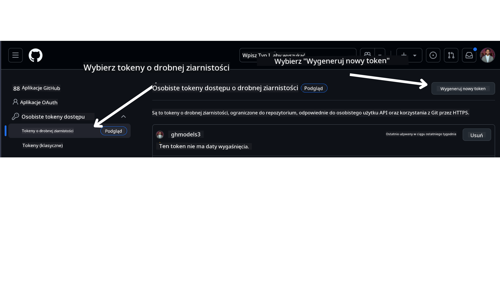

<!--
CO_OP_TRANSLATOR_METADATA:
{
  "original_hash": "76945069b52a49cd0432ae3e0b0ba22e",
  "translation_date": "2025-07-12T07:49:34+00:00",
  "source_file": "00-course-setup/README.md",
  "language_code": "pl"
}
-->
w swoim koncie GitHub.

Wybierz opcję `Fine-grained tokens` po lewej stronie ekranu.

Następnie wybierz `Generate new token`.



Zostaniesz poproszony o podanie nazwy tokenu, wybranie daty wygaśnięcia (zalecane: 30 dni) oraz zakresów dla tokenu (Public Repositories).

Należy również edytować uprawnienia tego tokenu: Permissions -> Models -> Pozwala na dostęp do GitHub Models

Skopiuj nowo utworzony token. Teraz dodasz go do pliku `.env` dołączonego do tego kursu.

### Krok 2: Utwórz plik `.env`

Aby utworzyć plik `.env`, uruchom następujące polecenie w terminalu.

```bash
cp .env.example .env
```

Spowoduje to skopiowanie pliku przykładowego i utworzenie pliku `.env` w Twoim katalogu, gdzie wypełnisz wartości zmiennych środowiskowych.

Po skopiowaniu tokenu, otwórz plik `.env` w ulubionym edytorze tekstu i wklej token w pole `GITHUB_TOKEN`.

Teraz powinieneś być w stanie uruchomić przykłady kodu z tego kursu.

## Konfiguracja dla przykładów korzystających z Azure AI Foundry i Azure AI Agent Service

### Krok 1: Pobierz punkt końcowy projektu Azure

Postępuj zgodnie z instrukcjami tworzenia huba i projektu w Azure AI Foundry dostępnymi tutaj: [Hub resources overview](https://learn.microsoft.com/en-us/azure/ai-foundry/concepts/ai-resources)

Po utworzeniu projektu, musisz pobrać łańcuch połączenia dla swojego projektu.

Można to zrobić, przechodząc do strony **Overview** swojego projektu w portalu Azure AI Foundry.


### Krok 2: Utwórz plik `.env`

Aby utworzyć plik `.env`, uruchom następujące polecenie w terminalu.

```bash
cp .env.example .env
```

Spowoduje to skopiowanie pliku przykładowego i utworzenie pliku `.env` w Twoim katalogu, gdzie wypełnisz wartości zmiennych środowiskowych.

Po skopiowaniu tokenu, otwórz plik `.env` w ulubionym edytorze tekstu i wklej token w pole `PROJECT_ENDPOINT`.

### Krok 3: Zaloguj się do Azure

Zgodnie z najlepszymi praktykami bezpieczeństwa, użyjemy [uwierzytelniania bezkluczowego](https://learn.microsoft.com/azure/developer/ai/keyless-connections?tabs=csharp%2Cazure-cli?WT.mc_id=academic-105485-koreyst) do uwierzytelnienia w Azure OpenAI za pomocą Microsoft Entra ID. Zanim to zrobisz, musisz najpierw zainstalować **Azure CLI** zgodnie z [instrukcjami instalacji](https://learn.microsoft.com/cli/azure/install-azure-cli?WT.mc_id=academic-105485-koreyst) dla Twojego systemu operacyjnego.

Następnie otwórz terminal i uruchom `az login --use-device-code`, aby zalogować się na swoje konto Azure.

Po zalogowaniu wybierz subskrypcję w terminalu.

## Dodatkowe zmienne środowiskowe - Azure Search i Azure OpenAI

W lekcji Agentic RAG - Lekcja 5 - znajdują się przykłady korzystające z Azure Search i Azure OpenAI.

Jeśli chcesz uruchomić te przykłady, musisz dodać następujące zmienne środowiskowe do pliku `.env`:

### Strona przeglądu (Projekt)

- `AZURE_SUBSCRIPTION_ID` - Sprawdź **Szczegóły projektu** na stronie **Overview** swojego projektu.

- `AZURE_AI_PROJECT_NAME` - Znajdziesz na górze strony **Overview** swojego projektu.

- `AZURE_OPENAI_SERVICE` - Znajdziesz w zakładce **Included capabilities** dla **Azure OpenAI Service** na stronie **Overview**.

### Centrum zarządzania

- `AZURE_OPENAI_RESOURCE_GROUP` - Przejdź do **Właściwości projektu** na stronie **Overview** w **Centrum zarządzania**.

- `GLOBAL_LLM_SERVICE` - W sekcji **Connected resources** znajdź nazwę połączenia **Azure AI Services**. Jeśli nie jest widoczna, sprawdź w **Azure portal** w grupie zasobów nazwę zasobu AI Services.

### Strona modeli i punktów końcowych

- `AZURE_OPENAI_EMBEDDING_DEPLOYMENT_NAME` - Wybierz swój model embeddingu (np. `text-embedding-ada-002`) i zanotuj **Deployment name** z danych modelu.

- `AZURE_OPENAI_CHAT_DEPLOYMENT_NAME` - Wybierz swój model czatu (np. `gpt-4o-mini`) i zanotuj **Deployment name** z danych modelu.

### Portal Azure

- `AZURE_OPENAI_ENDPOINT` - Znajdź **Azure AI services**, kliknij, przejdź do **Resource Management**, **Keys and Endpoint**, przewiń do "Azure OpenAI endpoints" i skopiuj ten oznaczony jako "Language APIs".

- `AZURE_OPENAI_API_KEY` - Z tego samego ekranu skopiuj KLUCZ 1 lub KLUCZ 2.

- `AZURE_SEARCH_SERVICE_ENDPOINT` - Znajdź swój zasób **Azure AI Search**, kliknij i przejdź do **Overview**.

- `AZURE_SEARCH_API_KEY` - Następnie przejdź do **Settings**, a potem **Keys**, aby skopiować klucz administratora podstawowego lub zapasowego.

### Strona zewnętrzna

- `AZURE_OPENAI_API_VERSION` - Odwiedź stronę [API version lifecycle](https://learn.microsoft.com/en-us/azure/ai-services/openai/api-version-deprecation#latest-ga-api-release) pod sekcją **Latest GA API release**.

### Konfiguracja uwierzytelniania bezkluczowego

Zamiast wpisywać dane uwierzytelniające na stałe, użyjemy połączenia bezkluczowego z Azure OpenAI. W tym celu zaimportujemy `DefaultAzureCredential` i później wywołamy funkcję `DefaultAzureCredential`, aby uzyskać poświadczenia.

```python
from azure.identity import DefaultAzureCredential, InteractiveBrowserCredential
```

## Utknąłeś gdzieś?

Jeśli masz jakiekolwiek problemy z uruchomieniem tej konfiguracji, dołącz do naszej

lub

.

## Następna lekcja

Jesteś teraz gotowy, aby uruchomić kod z tego kursu. Życzymy owocnej nauki i poznawania świata Agentów AI!

[Wprowadzenie do Agentów AI i przypadków użycia agentów](../01-intro-to-ai-agents/README.md)

**Zastrzeżenie**:  
Niniejszy dokument został przetłumaczony za pomocą usługi tłumaczenia AI [Co-op Translator](https://github.com/Azure/co-op-translator). Mimo że dążymy do dokładności, prosimy mieć na uwadze, że tłumaczenia automatyczne mogą zawierać błędy lub nieścisłości. Oryginalny dokument w języku źródłowym powinien być uznawany za źródło autorytatywne. W przypadku informacji o kluczowym znaczeniu zalecane jest skorzystanie z profesjonalnego tłumaczenia wykonanego przez człowieka. Nie ponosimy odpowiedzialności za jakiekolwiek nieporozumienia lub błędne interpretacje wynikające z korzystania z tego tłumaczenia.