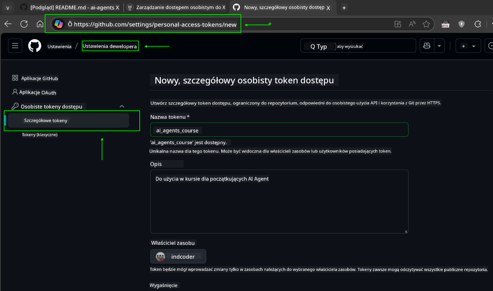
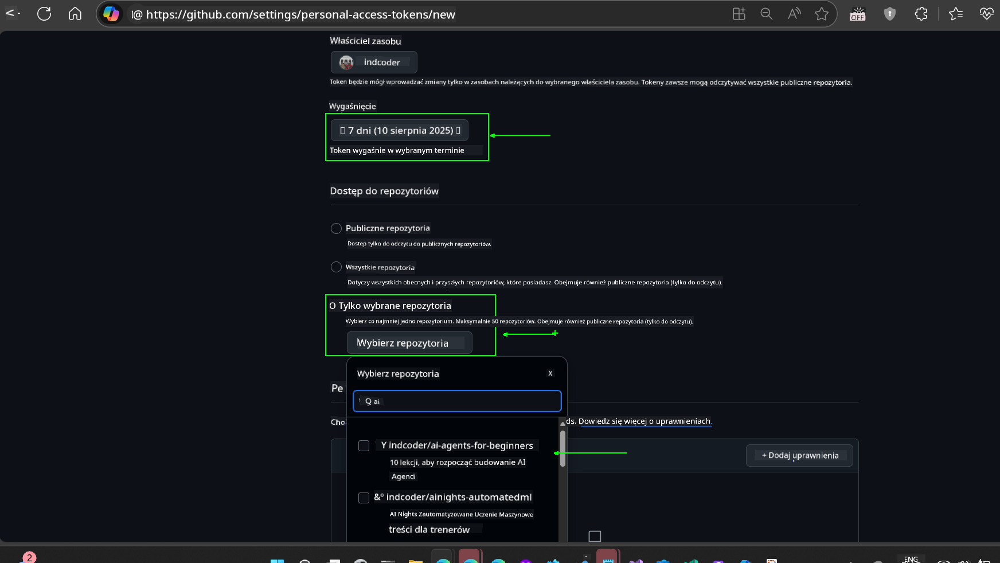
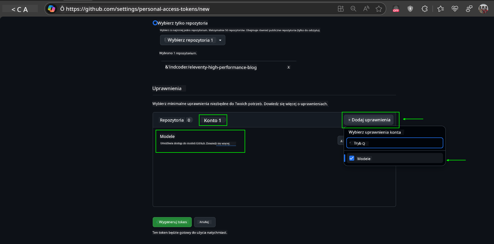
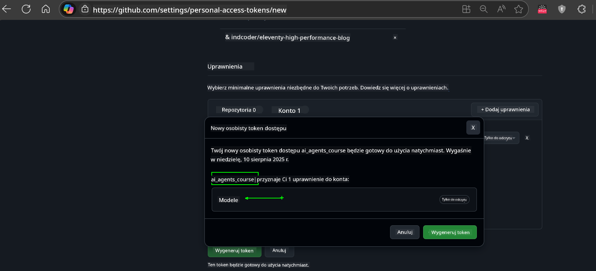
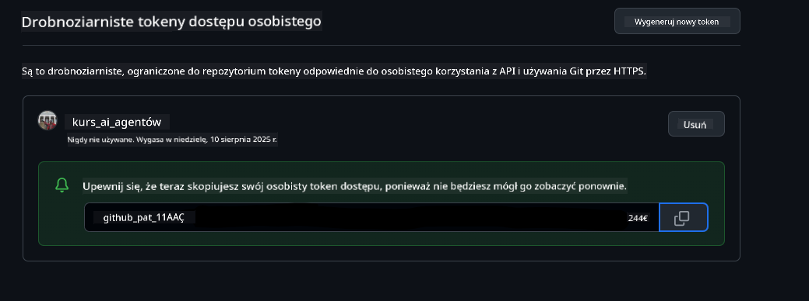
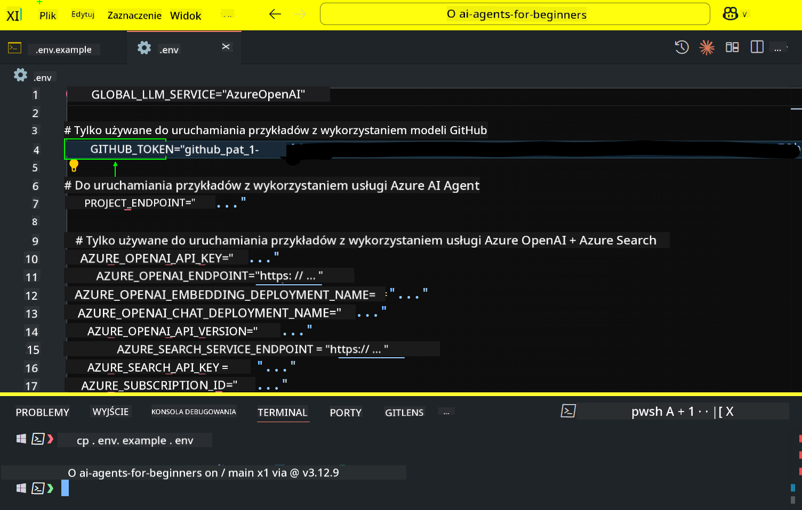

<!--
CO_OP_TRANSLATOR_METADATA:
{
  "original_hash": "8693a24942b670e3cb8def77f92513f9",
  "translation_date": "2025-08-21T13:00:53+00:00",
  "source_file": "00-course-setup/README.md",
  "language_code": "pl"
}
-->
# Konfiguracja Kursu

## Wprowadzenie

W tej lekcji dowiesz się, jak uruchamiać przykłady kodu z tego kursu.

## Sklonuj lub zrób fork tego repozytorium

Na początek sklonuj lub zrób fork repozytorium GitHub. Dzięki temu będziesz mieć własną wersję materiałów kursowych, które możesz uruchamiać, testować i modyfikować!

Możesz to zrobić, klikając link do

Powinieneś teraz mieć swoją własną wersję tego kursu w poniższym linku:


## Uruchamianie kodu

Ten kurs oferuje serię notatników Jupyter, które możesz uruchamiać, aby zdobyć praktyczne doświadczenie w budowaniu agentów AI.

Przykłady kodu korzystają z:

**Wymaga konta GitHub - Bezpłatne**:

1) Semantic Kernel Agent Framework + GitHub Models Marketplace. Oznaczone jako (semantic-kernel.ipynb)  
2) AutoGen Framework + GitHub Models Marketplace. Oznaczone jako (autogen.ipynb)  

**Wymaga subskrypcji Azure**:  
3) Azure AI Foundry + Azure AI Agent Service. Oznaczone jako (azureaiagent.ipynb)  

Zachęcamy do wypróbowania wszystkich trzech typów przykładów, aby zobaczyć, który z nich najlepiej Ci odpowiada.

Wybór jednej z opcji określi, które kroki konfiguracji należy wykonać poniżej:

## Wymagania

- Python 3.12+  
  - **UWAGA**: Jeśli nie masz zainstalowanego Pythona 3.12, upewnij się, że go zainstalujesz. Następnie utwórz środowisko wirtualne (venv) za pomocą python3.12, aby upewnić się, że odpowiednie wersje zostaną zainstalowane z pliku requirements.txt.  
- Konto GitHub - Dostęp do GitHub Models Marketplace  
- Subskrypcja Azure - Dostęp do Azure AI Foundry  
- Konto Azure AI Foundry - Dostęp do Azure AI Agent Service  

Dołączono plik `requirements.txt` w katalogu głównym tego repozytorium, który zawiera wszystkie wymagane pakiety Pythona do uruchamiania przykładów kodu.

Możesz je zainstalować, uruchamiając następujące polecenie w terminalu w katalogu głównym repozytorium:

```bash
pip install -r requirements.txt
```  
Zalecamy utworzenie wirtualnego środowiska Pythona, aby uniknąć konfliktów i problemów.

## Konfiguracja VSCode

Upewnij się, że używasz odpowiedniej wersji Pythona w VSCode.


## Konfiguracja dla przykładów z użyciem GitHub Models

### Krok 1: Pobierz swój GitHub Personal Access Token (PAT)

Ten kurs korzysta z GitHub Models Marketplace, oferując bezpłatny dostęp do dużych modeli językowych (LLM), które wykorzystasz do budowy agentów AI.

Aby korzystać z GitHub Models, musisz utworzyć [GitHub Personal Access Token](https://docs.github.com/en/authentication/keeping-your-account-and-data-secure/managing-your-personal-access-tokens).

Możesz to zrobić, przechodząc do swojego

konta GitHub.

Postępuj zgodnie z zasadą [Minimalnych Uprawnień](https://docs.github.com/en/get-started/learning-to-code/storing-your-secrets-safely) podczas tworzenia tokena. Oznacza to, że powinieneś przyznać tokenowi tylko te uprawnienia, które są niezbędne do uruchamiania przykładów kodu w tym kursie.

1. Wybierz opcję `Fine-grained tokens` po lewej stronie ekranu, przechodząc do **Developer settings**  
   

   Następnie wybierz `Generate new token`.

   

2. Wprowadź opisową nazwę dla swojego tokena, która odzwierciedla jego przeznaczenie, aby łatwo go później zidentyfikować.

   🔐 Zalecenie dotyczące czasu ważności tokena

   Zalecany czas ważności: 30 dni  
   Dla większego bezpieczeństwa możesz wybrać krótszy okres, na przykład 7 dni 🛡️  
   To świetny sposób, aby wyznaczyć sobie cel i ukończyć kurs, gdy Twoja motywacja do nauki jest wysoka 🚀.

   

3. Ogranicz zakres tokena do swojego forka tego repozytorium.

   

4. Ogranicz uprawnienia tokena: W sekcji **Permissions** kliknij zakładkę **Account**, a następnie przycisk "+ Add permissions". Pojawi się rozwijane menu. Wyszukaj **Models** i zaznacz odpowiednie pole.  
   

5. Zweryfikuj wymagane uprawnienia przed wygenerowaniem tokena. 

6. Przed wygenerowaniem tokena upewnij się, że jesteś gotowy, aby przechowywać go w bezpiecznym miejscu, takim jak menedżer haseł, ponieważ nie będzie on ponownie wyświetlany po jego utworzeniu. 

Skopiuj nowo utworzony token. Teraz dodasz go do swojego pliku `.env` dołączonego do tego kursu.

### Krok 2: Utwórz plik `.env`

Aby utworzyć plik `.env`, uruchom następujące polecenie w terminalu:

```bash
cp .env.example .env
```

To polecenie skopiuje przykładowy plik i utworzy `.env` w Twoim katalogu, gdzie wypełnisz wartościami zmienne środowiskowe.

Po skopiowaniu tokena otwórz plik `.env` w swoim ulubionym edytorze tekstu i wklej token w polu `GITHUB_TOKEN`.  


Teraz powinieneś być w stanie uruchamiać przykłady kodu z tego kursu.

## Konfiguracja dla przykładów z użyciem Azure AI Foundry i Azure AI Agent Service

### Krok 1: Pobierz punkt końcowy swojego projektu Azure

Postępuj zgodnie z krokami tworzenia huba i projektu w Azure AI Foundry opisanymi tutaj: [Hub resources overview](https://learn.microsoft.com/en-us/azure/ai-foundry/concepts/ai-resources)

Po utworzeniu projektu musisz pobrać ciąg połączenia dla swojego projektu.

Możesz to zrobić, przechodząc do strony **Overview** swojego projektu w portalu Azure AI Foundry.


### Krok 2: Utwórz plik `.env`

Aby utworzyć plik `.env`, uruchom następujące polecenie w terminalu:

```bash
cp .env.example .env
```

To polecenie skopiuje przykładowy plik i utworzy `.env` w Twoim katalogu, gdzie wypełnisz wartościami zmienne środowiskowe.

Po skopiowaniu tokena otwórz plik `.env` w swoim ulubionym edytorze tekstu i wklej token w polu `PROJECT_ENDPOINT`.

### Krok 3: Zaloguj się do Azure

Jako najlepszą praktykę bezpieczeństwa użyjemy [uwierzytelniania bez klucza](https://learn.microsoft.com/azure/developer/ai/keyless-connections?tabs=csharp%2Cazure-cli?WT.mc_id=academic-105485-koreyst), aby uwierzytelnić się w Azure OpenAI za pomocą Microsoft Entra ID.

Następnie otwórz terminal i uruchom `az login --use-device-code`, aby zalogować się na swoje konto Azure.

Po zalogowaniu wybierz swoją subskrypcję w terminalu.

## Dodatkowe zmienne środowiskowe - Azure Search i Azure OpenAI

Dla lekcji Agentic RAG - Lekcja 5 - dostępne są przykłady korzystające z Azure Search i Azure OpenAI.

Jeśli chcesz uruchomić te przykłady, musisz dodać następujące zmienne środowiskowe do swojego pliku `.env`:

### Strona przeglądu (Projekt)

- `AZURE_SUBSCRIPTION_ID` - Sprawdź **Project details** na stronie **Overview** swojego projektu.  
- `AZURE_AI_PROJECT_NAME` - Spójrz na górę strony **Overview** swojego projektu.  
- `AZURE_OPENAI_SERVICE` - Znajdź to w zakładce **Included capabilities** dla **Azure OpenAI Service** na stronie **Overview**.  

### Centrum zarządzania

- `AZURE_OPENAI_RESOURCE_GROUP` - Przejdź do **Project properties** na stronie **Overview** w **Management Center**.  
- `GLOBAL_LLM_SERVICE` - W sekcji **Connected resources** znajdź nazwę połączenia **Azure AI Services**. Jeśli nie jest wymieniona, sprawdź **Azure portal** w swojej grupie zasobów dla nazwy zasobu AI Services.  

### Strona modeli i punktów końcowych

- `AZURE_OPENAI_EMBEDDING_DEPLOYMENT_NAME` - Wybierz swój model osadzania (np. `text-embedding-ada-002`) i zanotuj **Deployment name** z szczegółów modelu.  
- `AZURE_OPENAI_CHAT_DEPLOYMENT_NAME` - Wybierz swój model czatu (np. `gpt-4o-mini`) i zanotuj **Deployment name** z szczegółów modelu.  

### Portal Azure

- `AZURE_OPENAI_ENDPOINT` - Znajdź **Azure AI services**, kliknij na to, a następnie przejdź do **Resource Management**, **Keys and Endpoint**, przewiń w dół do "Azure OpenAI endpoints" i skopiuj ten, który mówi "Language APIs".  
- `AZURE_OPENAI_API_KEY` - Na tym samym ekranie skopiuj KLUCZ 1 lub KLUCZ 2.  
- `AZURE_SEARCH_SERVICE_ENDPOINT` - Znajdź swój zasób **Azure AI Search**, kliknij na niego i zobacz **Overview**.  
- `AZURE_SEARCH_API_KEY` - Następnie przejdź do **Settings**, a potem **Keys**, aby skopiować klucz administratora głównego lub drugorzędnego.  

### Zewnętrzna strona internetowa

- `AZURE_OPENAI_API_VERSION` - Odwiedź stronę [API version lifecycle](https://learn.microsoft.com/en-us/azure/ai-services/openai/api-version-deprecation#latest-ga-api-release) w sekcji **Latest GA API release**.  

### Konfiguracja uwierzytelniania bez klucza

Zamiast kodować swoje dane uwierzytelniające, użyjemy połączenia bez klucza z Azure OpenAI. Aby to zrobić, zaimportujemy `DefaultAzureCredential`, a następnie wywołamy funkcję `DefaultAzureCredential`, aby uzyskać dane uwierzytelniające.

```python
from azure.identity import DefaultAzureCredential, InteractiveBrowserCredential
```

## Masz problem?

Jeśli napotkasz jakiekolwiek problemy podczas tej konfiguracji, dołącz do naszego

lub

## Następna lekcja

Jesteś teraz gotowy, aby uruchamiać kod z tego kursu. Miłej nauki o świecie agentów AI!  

[Wprowadzenie do agentów AI i przypadków użycia agentów](../01-intro-to-ai-agents/README.md)

**Zastrzeżenie**:  
Ten dokument został przetłumaczony za pomocą usługi tłumaczeniowej AI [Co-op Translator](https://github.com/Azure/co-op-translator). Chociaż dokładamy wszelkich starań, aby zapewnić dokładność, prosimy pamiętać, że automatyczne tłumaczenia mogą zawierać błędy lub nieścisłości. Oryginalny dokument w jego rodzimym języku powinien być uznawany za wiarygodne źródło. W przypadku informacji krytycznych zaleca się skorzystanie z profesjonalnego tłumaczenia wykonanego przez człowieka. Nie ponosimy odpowiedzialności za jakiekolwiek nieporozumienia lub błędne interpretacje wynikające z korzystania z tego tłumaczenia.