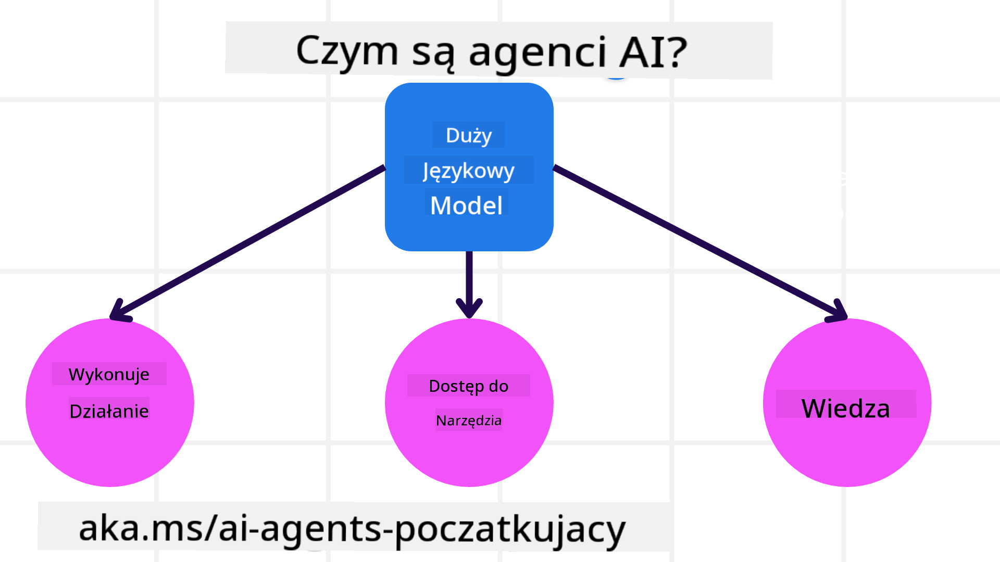
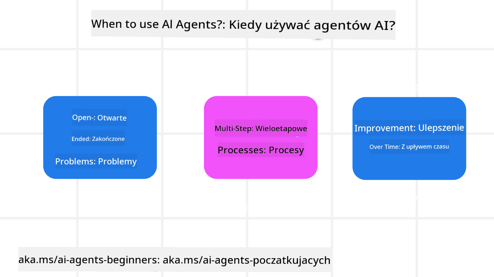

<!--
CO_OP_TRANSLATOR_METADATA:
{
  "original_hash": "d84943abc8f001ad4670418d32c2d899",
  "translation_date": "2025-07-12T08:06:24+00:00",
  "source_file": "01-intro-to-ai-agents/README.md",
  "language_code": "pl"
}
-->
aby spotkać się z innymi uczestnikami kursu i twórcami AI Agentów oraz zadać wszelkie pytania dotyczące tego kursu.

Aby rozpocząć ten kurs, zaczniemy od lepszego zrozumienia, czym są AI Agenci i jak możemy ich używać w aplikacjach i procesach, które tworzymy.

## Wprowadzenie

Ta lekcja obejmuje:

- Czym są AI Agenci i jakie są różne typy agentów?
- Do jakich zastosowań najlepiej nadają się AI Agenci i jak mogą nam pomóc?
- Jakie są podstawowe elementy budowy rozwiązań agentowych?

## Cele nauki
Po ukończeniu tej lekcji powinieneś być w stanie:

- Zrozumieć koncepcje AI Agentów i jak różnią się od innych rozwiązań AI.
- Efektywnie stosować AI Agentów.
- Projektować rozwiązania agentowe z korzyścią dla użytkowników i klientów.

## Definicja AI Agentów i typy AI Agentów

### Czym są AI Agenci?

AI Agenci to **systemy**, które umożliwiają **Large Language Models (LLM)** **wykonywanie działań** poprzez rozszerzenie ich możliwości, dając LLM dostęp do **narzędzi** i **wiedzy**.

Rozbijmy tę definicję na mniejsze części:

- **System** – ważne jest, aby myśleć o agentach nie jako o pojedynczym komponencie, lecz jako o systemie wielu komponentów. Na podstawowym poziomie składniki AI Agenta to:
  - **Środowisko** – określona przestrzeń, w której działa AI Agent. Na przykład, jeśli mielibyśmy AI Agenta do rezerwacji podróży, środowiskiem byłby system rezerwacji podróży, z którego agent korzysta, aby wykonać zadania.
  - **Czujniki** – środowiska zawierają informacje i dostarczają informacji zwrotnych. AI Agenci używają czujników do zbierania i interpretowania informacji o aktualnym stanie środowiska. W przykładzie agenta podróży system rezerwacji może dostarczać informacje takie jak dostępność hoteli czy ceny lotów.
  - **Wykonawcy (aktuatory)** – gdy AI Agent otrzyma aktualny stan środowiska, dla bieżącego zadania decyduje, jakie działanie wykonać, aby zmienić środowisko. W przypadku agenta podróży może to być zarezerwowanie dostępnego pokoju dla użytkownika.

**Large Language Models** – koncepcja agentów istniała jeszcze przed powstaniem LLM. Przewagą budowania AI Agentów z LLM jest ich zdolność do interpretacji języka ludzkiego i danych. Ta zdolność pozwala LLM interpretować informacje ze środowiska i opracować plan zmiany środowiska.

**Wykonywanie działań** – poza systemami AI Agentów, LLM są ograniczone do sytuacji, w których działaniem jest generowanie treści lub informacji na podstawie polecenia użytkownika. W systemach AI Agentów LLM mogą realizować zadania, interpretując prośbę użytkownika i korzystając z narzędzi dostępnych w ich środowisku.

**Dostęp do narzędzi** – do jakich narzędzi LLM ma dostęp, definiuje 1) środowisko, w którym działa, oraz 2) twórca AI Agenta. W naszym przykładzie agenta podróży narzędzia agenta są ograniczone przez operacje dostępne w systemie rezerwacji, a twórca może ograniczyć dostęp agenta do narzędzi dotyczących lotów.

**Pamięć i wiedza** – pamięć może być krótkoterminowa w kontekście rozmowy między użytkownikiem a agentem. Długoterminowo, poza informacjami dostarczanymi przez środowisko, AI Agenci mogą także pobierać wiedzę z innych systemów, usług, narzędzi, a nawet innych agentów. W przykładzie agenta podróży ta wiedza może obejmować informacje o preferencjach podróżnych użytkownika znajdujące się w bazie danych klientów.

### Różne typy agentów

Mając już ogólną definicję AI Agentów, przyjrzyjmy się konkretnym typom agentów i jak mogłyby być zastosowane w agencie do rezerwacji podróży.

| **Typ Agenta**                | **Opis**                                                                                                                           | **Przykład**                                                                                                                                                                                                                 |
| ----------------------------- | --------------------------------------------------------------------------------------------------------------------------------- | --------------------------------------------------------------------------------------------------------------------------------------------------------------------------------------------------------------------------- |
| **Proste Agenty Refleksyjne** | Wykonują natychmiastowe działania na podstawie zdefiniowanych reguł.                                                              | Agent podróży interpretuje kontekst e-maila i przekazuje skargi dotyczące podróży do obsługi klienta.                                                                                                                        |
| **Modelowe Agenty Refleksyjne** | Wykonują działania na podstawie modelu świata i zmian w tym modelu.                                                              | Agent podróży priorytetyzuje trasy z istotnymi zmianami cen na podstawie dostępu do historycznych danych cenowych.                                                                                                          |
| **Agenty Celowe**             | Tworzą plany osiągnięcia konkretnych celów, interpretując cel i określając działania do jego realizacji.                          | Agent podróży rezerwuje podróż, ustalając niezbędne środki transportu (samochód, transport publiczny, loty) z aktualnej lokalizacji do celu podróży.                                                                        |
| **Agenty Utylitarne**         | Uwzględniają preferencje i numerycznie oceniają kompromisy, aby określić, jak osiągnąć cele.                                      | Agent podróży maksymalizuje użyteczność, ważąc wygodę względem kosztów podczas rezerwacji podróży.                                                                                                                           |
| **Agenty Uczące się**         | Poprawiają się z czasem, reagując na informacje zwrotne i dostosowując działania.                                                 | Agent podróży poprawia swoje działanie, korzystając z opinii klientów z ankiet po podróży, aby wprowadzać zmiany w przyszłych rezerwacjach.                                                                                  |
| **Agenty Hierarchiczne**      | Składają się z wielu agentów w systemie warstwowym, gdzie agenty wyższego poziomu dzielą zadania na podzadania dla agentów niższego poziomu. | Agent podróży anuluje wycieczkę, dzieląc zadanie na podzadania (np. anulowanie konkretnych rezerwacji) i zlecając ich wykonanie agentom niższego poziomu, którzy raportują wyniki agentowi wyższego poziomu.                   |
| **Systemy Wieloagentowe (MAS)** | Agenty wykonują zadania niezależnie, współpracując lub konkurując ze sobą.                                                      | Współpraca: Wielu agentów rezerwuje konkretne usługi podróżne, takie jak hotele, loty i rozrywkę. Konkurencja: Wielu agentów zarządza i konkuruje o wspólny kalendarz rezerwacji hotelu, aby zakwaterować klientów w hotelu. |

## Kiedy używać AI Agentów

W poprzedniej sekcji użyliśmy przykładu agenta podróży, aby wyjaśnić, jak różne typy agentów mogą być stosowane w różnych scenariuszach rezerwacji podróży. Będziemy kontynuować korzystanie z tej aplikacji przez cały kurs.

Przyjrzyjmy się typom zastosowań, do których AI Agenci nadają się najlepiej:

- **Problemy otwarte** – pozwalając LLM określić potrzebne kroki do wykonania zadania, ponieważ nie zawsze można je zakodować na stałe w procesie.
- **Procesy wieloetapowe** – zadania wymagające złożoności, w których AI Agent musi korzystać z narzędzi lub informacji przez wiele kroków, a nie tylko jednorazowo.
- **Poprawa w czasie** – zadania, w których agent może się doskonalić, otrzymując informacje zwrotne ze środowiska lub od użytkowników, aby zapewnić lepszą użyteczność.

Więcej rozważań na temat używania AI Agentów omówimy w lekcji Budowanie Godnych Zaufania AI Agentów.

## Podstawy rozwiązań agentowych

### Tworzenie agentów

Pierwszym krokiem w projektowaniu systemu AI Agenta jest zdefiniowanie narzędzi, działań i zachowań. W tym kursie skupiamy się na użyciu **Azure AI Agent Service** do definiowania naszych agentów. Oferuje on funkcje takie jak:

- Wybór otwartych modeli, takich jak OpenAI, Mistral i Llama
- Korzystanie z licencjonowanych danych od dostawców, takich jak Tripadvisor
- Użycie standardowych narzędzi OpenAPI 3.0

### Wzorce agentowe

Komunikacja z LLM odbywa się za pomocą promptów. Ze względu na półautonomiczny charakter AI Agentów, nie zawsze jest możliwe lub konieczne ręczne ponowne wywołanie promptu po zmianie w środowisku. Używamy **wzorców agentowych**, które pozwalają na wieloetapowe promptowanie LLM w bardziej skalowalny sposób.

Ten kurs jest podzielony na niektóre z obecnie popularnych wzorców agentowych.

### Frameworki agentowe

Frameworki agentowe pozwalają programistom implementować wzorce agentowe za pomocą kodu. Te frameworki oferują szablony, wtyczki i narzędzia do lepszej współpracy AI Agentów. Dzięki nim możliwa jest lepsza obserwowalność i rozwiązywanie problemów w systemach AI Agentów.

W tym kursie zapoznamy się z badawczym frameworkiem AutoGen oraz produkcyjnym frameworkiem Agent od Semantic Kernel.

## Poprzednia lekcja

[Course Setup](../00-course-setup/README.md)

## Następna lekcja

[Exploring Agentic Frameworks](../02-explore-agentic-frameworks/README.md)

**Zastrzeżenie**:  
Niniejszy dokument został przetłumaczony za pomocą usługi tłumaczenia AI [Co-op Translator](https://github.com/Azure/co-op-translator). Mimo że dążymy do jak największej dokładności, prosimy mieć na uwadze, że tłumaczenia automatyczne mogą zawierać błędy lub nieścisłości. Oryginalny dokument w języku źródłowym powinien być uznawany za źródło autorytatywne. W przypadku informacji o kluczowym znaczeniu zalecane jest skorzystanie z profesjonalnego tłumaczenia wykonanego przez człowieka. Nie ponosimy odpowiedzialności za jakiekolwiek nieporozumienia lub błędne interpretacje wynikające z korzystania z tego tłumaczenia.