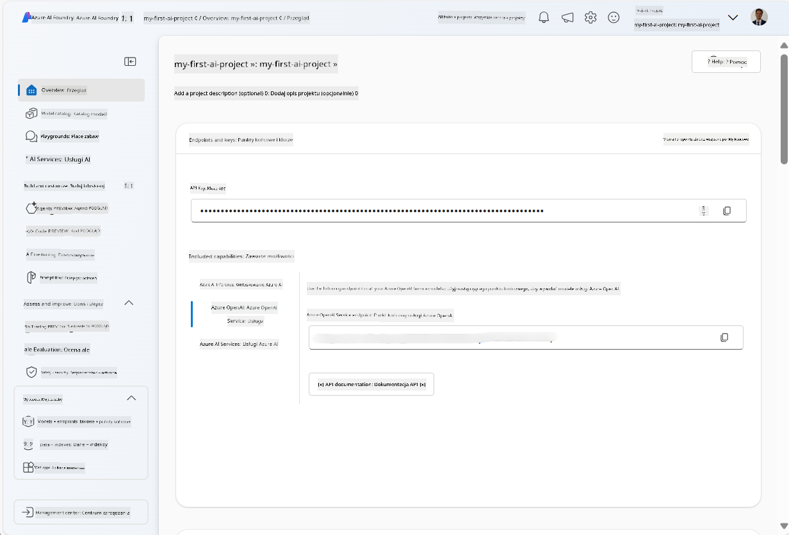
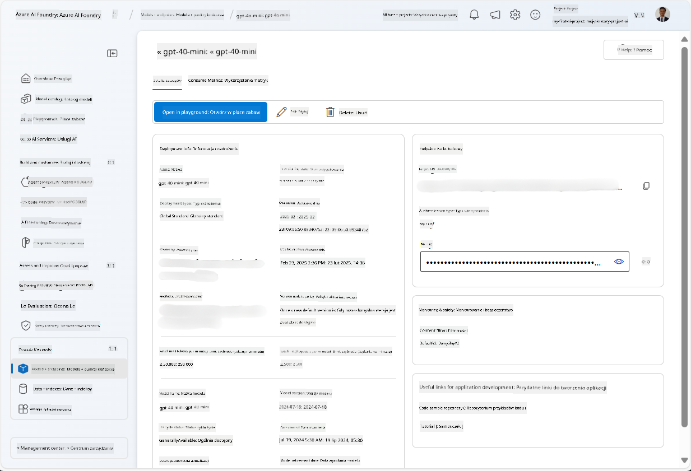
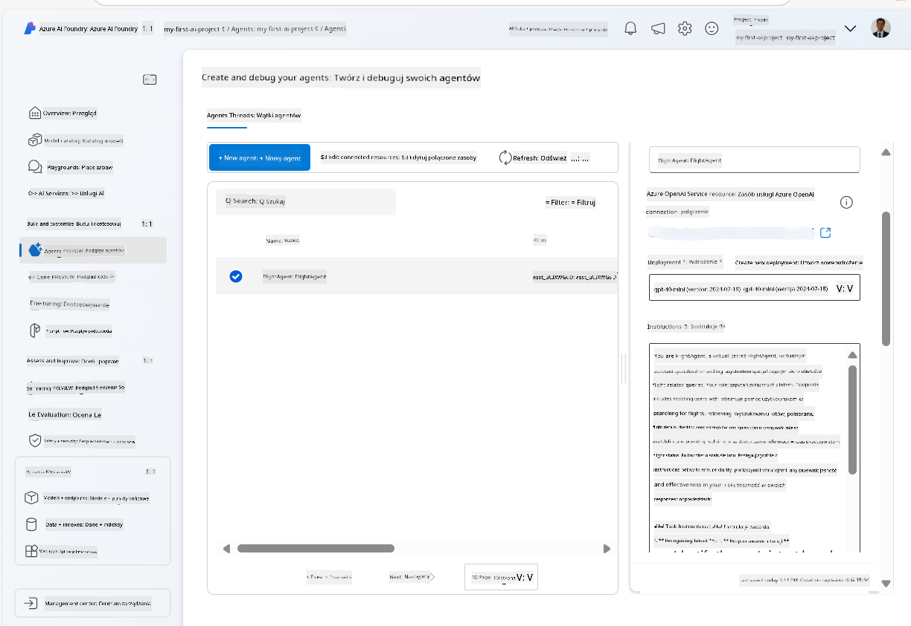
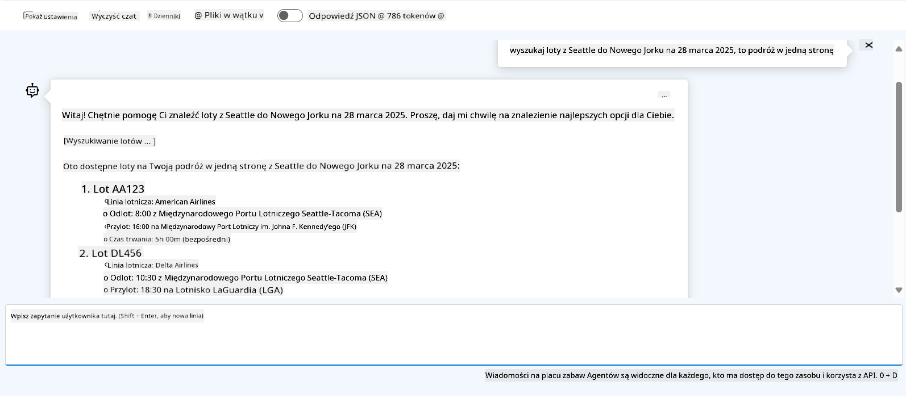

<!--
CO_OP_TRANSLATOR_METADATA:
{
  "original_hash": "7e92870dc0843e13d4dabc620c09d2d9",
  "translation_date": "2025-07-12T08:18:48+00:00",
  "source_file": "02-explore-agentic-frameworks/azure-ai-foundry-agent-creation.md",
  "language_code": "pl"
}
-->
# Azure AI Agent Service Development

W tym ćwiczeniu użyjesz narzędzi usługi Azure AI Agent w [portalu Azure AI Foundry](https://ai.azure.com/?WT.mc_id=academic-105485-koreyst), aby stworzyć agenta do rezerwacji lotów. Agent będzie mógł komunikować się z użytkownikami i udzielać informacji o lotach.

## Wymagania wstępne

Aby ukończyć to ćwiczenie, potrzebujesz:
1. Konta Azure z aktywną subskrypcją. [Utwórz konto za darmo](https://azure.microsoft.com/free/?WT.mc_id=academic-105485-koreyst).
2. Uprawnień do utworzenia huba Azure AI Foundry lub dostępu do już istniejącego.
    - Jeśli masz rolę Contributor lub Owner, możesz postępować zgodnie z krokami w tym samouczku.

## Utwórz hub Azure AI Foundry

> **Note:** Azure AI Foundry wcześniej nazywał się Azure AI Studio.

1. Postępuj zgodnie z wytycznymi z wpisu na blogu [Azure AI Foundry](https://learn.microsoft.com/en-us/azure/ai-studio/?WT.mc_id=academic-105485-koreyst) dotyczącymi tworzenia huba Azure AI Foundry.
2. Po utworzeniu projektu zamknij wszelkie wyświetlane wskazówki i przejrzyj stronę projektu w portalu Azure AI Foundry, która powinna wyglądać podobnie do poniższego obrazu:

    

## Wdróż model

1. W panelu po lewej stronie projektu, w sekcji **My assets**, wybierz stronę **Models + endpoints**.
2. Na stronie **Models + endpoints**, na karcie **Model deployments**, w menu **+ Deploy model** wybierz **Deploy base model**.
3. Wyszukaj model `gpt-4o-mini` na liście, a następnie wybierz go i potwierdź.

    > **Note**: Zmniejszenie TPM pomaga uniknąć nadmiernego wykorzystania dostępnego limitu w subskrypcji, której używasz.

    

## Utwórz agenta

Teraz, gdy wdrożyłeś model, możesz stworzyć agenta. Agent to konwersacyjny model AI, który może być używany do interakcji z użytkownikami.

1. W panelu po lewej stronie projektu, w sekcji **Build & Customize**, wybierz stronę **Agents**.
2. Kliknij **+ Create agent**, aby utworzyć nowego agenta. W oknie dialogowym **Agent Setup**:
    - Wprowadź nazwę agenta, na przykład `FlightAgent`.
    - Upewnij się, że wybrano wdrożenie modelu `gpt-4o-mini`, które utworzyłeś wcześniej.
    - Ustaw **Instructions** zgodnie z poleceniem, które chcesz, aby agent realizował. Oto przykład:
    ```
    You are FlightAgent, a virtual assistant specialized in handling flight-related queries. Your role includes assisting users with searching for flights, retrieving flight details, checking seat availability, and providing real-time flight status. Follow the instructions below to ensure clarity and effectiveness in your responses:

    ### Task Instructions:
    1. **Recognizing Intent**:
       - Identify the user's intent based on their request, focusing on one of the following categories:
         - Searching for flights
         - Retrieving flight details using a flight ID
         - Checking seat availability for a specified flight
         - Providing real-time flight status using a flight number
       - If the intent is unclear, politely ask users to clarify or provide more details.
        
    2. **Processing Requests**:
        - Depending on the identified intent, perform the required task:
        - For flight searches: Request details such as origin, destination, departure date, and optionally return date.
        - For flight details: Request a valid flight ID.
        - For seat availability: Request the flight ID and date and validate inputs.
        - For flight status: Request a valid flight number.
        - Perform validations on provided data (e.g., formats of dates, flight numbers, or IDs). If the information is incomplete or invalid, return a friendly request for clarification.

    3. **Generating Responses**:
    - Use a tone that is friendly, concise, and supportive.
    - Provide clear and actionable suggestions based on the output of each task.
    - If no data is found or an error occurs, explain it to the user gently and offer alternative actions (e.g., refine search, try another query).
    
    ```
> [!NOTE]
> Aby uzyskać szczegółowy prompt, możesz zajrzeć do [tego repozytorium](https://github.com/ShivamGoyal03/RoamMind) po więcej informacji.
    
> Ponadto możesz dodać **Knowledge Base** i **Actions**, aby rozszerzyć możliwości agenta o dostarczanie dodatkowych informacji i wykonywanie zautomatyzowanych zadań na podstawie żądań użytkownika. W tym ćwiczeniu możesz pominąć te kroki.
    


3. Aby utworzyć nowego agenta multi-AI, po prostu kliknij **New Agent**. Nowo utworzony agent pojawi się na stronie Agents.

## Przetestuj agenta

Po utworzeniu agenta możesz go przetestować, aby zobaczyć, jak odpowiada na zapytania użytkowników w środowisku playground portalu Azure AI Foundry.

1. U góry panelu **Setup** dla twojego agenta wybierz **Try in playground**.
2. W panelu **Playground** możesz rozmawiać z agentem, wpisując zapytania w oknie czatu. Na przykład możesz poprosić agenta o wyszukanie lotów z Seattle do Nowego Jorku na 28 dzień miesiąca.

    > **Note**: Agent może nie udzielać dokładnych odpowiedzi, ponieważ w tym ćwiczeniu nie korzysta się z danych w czasie rzeczywistym. Celem jest przetestowanie zdolności agenta do rozumienia i odpowiadania na zapytania użytkowników na podstawie podanych instrukcji.

    

3. Po przetestowaniu agenta możesz dalej go dostosowywać, dodając więcej intencji, danych treningowych i akcji, aby zwiększyć jego możliwości.

## Sprzątanie zasobów

Po zakończeniu testowania agenta możesz go usunąć, aby uniknąć dodatkowych kosztów.
1. Otwórz [portal Azure](https://portal.azure.com) i przejdź do grupy zasobów, w której wdrożyłeś zasoby huba używane w tym ćwiczeniu.
2. Na pasku narzędzi wybierz **Delete resource group**.
3. Wprowadź nazwę grupy zasobów i potwierdź chęć jej usunięcia.

## Zasoby

- [Dokumentacja Azure AI Foundry](https://learn.microsoft.com/en-us/azure/ai-studio/?WT.mc_id=academic-105485-koreyst)
- [Portal Azure AI Foundry](https://ai.azure.com/?WT.mc_id=academic-105485-koreyst)
- [Pierwsze kroki z Azure AI Studio](https://techcommunity.microsoft.com/blog/educatordeveloperblog/getting-started-with-azure-ai-studio/4095602?WT.mc_id=academic-105485-koreyst)
- [Podstawy agentów AI na Azure](https://learn.microsoft.com/en-us/training/modules/ai-agent-fundamentals/?WT.mc_id=academic-105485-koreyst)
- [Azure AI Discord](https://aka.ms/AzureAI/Discord)

**Zastrzeżenie**:  
Niniejszy dokument został przetłumaczony za pomocą usługi tłumaczenia AI [Co-op Translator](https://github.com/Azure/co-op-translator). Mimo że dążymy do dokładności, prosimy mieć na uwadze, że tłumaczenia automatyczne mogą zawierać błędy lub nieścisłości. Oryginalny dokument w języku źródłowym powinien być uznawany za źródło autorytatywne. W przypadku informacji krytycznych zalecane jest skorzystanie z profesjonalnego tłumaczenia wykonanego przez człowieka. Nie ponosimy odpowiedzialności za jakiekolwiek nieporozumienia lub błędne interpretacje wynikające z korzystania z tego tłumaczenia.