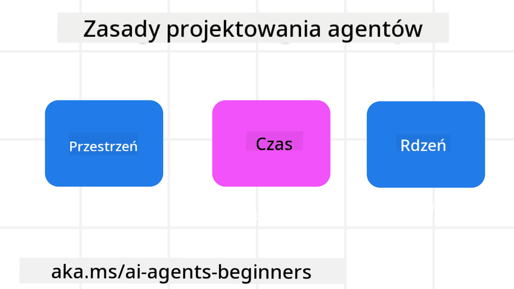

<!--
CO_OP_TRANSLATOR_METADATA:
{
  "original_hash": "4c46e4ff9e349c521e2b0b17f51afa64",
  "translation_date": "2025-08-30T14:30:36+00:00",
  "source_file": "03-agentic-design-patterns/README.md",
  "language_code": "pl"
}
-->

> _(Kliknij obrazek powyżej, aby obejrzeć wideo z tej lekcji)_
# Zasady projektowania agentów AI

## Wprowadzenie

Istnieje wiele sposobów myślenia o budowaniu systemów agentów AI. Biorąc pod uwagę, że niejednoznaczność jest cechą, a nie wadą w projektowaniu generatywnej AI, inżynierowie często mają trudności z ustaleniem, od czego zacząć. Stworzyliśmy zestaw zasad projektowania UX skoncentrowanych na człowieku, aby umożliwić programistom budowanie systemów agentów skoncentrowanych na klientach, które odpowiadają na ich potrzeby biznesowe. Te zasady projektowania nie są sztywną architekturą, lecz punktem wyjścia dla zespołów definiujących i budujących doświadczenia z agentami.

Ogólnie rzecz biorąc, agenci powinni:

- Poszerzać i skalować ludzkie możliwości (burza mózgów, rozwiązywanie problemów, automatyzacja itp.)
- Wypełniać luki w wiedzy (pomoc w zrozumieniu dziedzin wiedzy, tłumaczenie itp.)
- Ułatwiać i wspierać współpracę w sposób, w jaki preferujemy pracować z innymi
- Pomagać nam stawać się lepszymi wersjami siebie (np. trener życia/mistrz zadań, pomoc w nauce regulacji emocji i umiejętności uważności, budowanie odporności itp.)

## Ta lekcja obejmie

- Czym są zasady projektowania agentów
- Jakie wytyczne należy stosować podczas wdrażania tych zasad projektowania
- Przykłady zastosowania zasad projektowania

## Cele nauki

Po ukończeniu tej lekcji będziesz w stanie:

1. Wyjaśnić, czym są zasady projektowania agentów
2. Wyjaśnić wytyczne dotyczące stosowania zasad projektowania agentów
3. Zrozumieć, jak zbudować agenta, korzystając z zasad projektowania agentów

## Zasady projektowania agentów

### Agent (Przestrzeń)

To środowisko, w którym działa agent. Te zasady informują, jak projektować agentów do działania w fizycznym i cyfrowym świecie.

- **Łączenie, a nie zastępowanie** – pomagaj łączyć ludzi z innymi ludźmi, wydarzeniami i użyteczną wiedzą, aby umożliwić współpracę i budowanie relacji.
- Agenci pomagają łączyć wydarzenia, wiedzę i ludzi.
- Agenci zbliżają ludzi do siebie. Nie są zaprojektowani, aby zastępować lub umniejszać rolę ludzi.
- **Łatwo dostępni, ale czasami niewidoczni** – agent działa głównie w tle i interweniuje tylko wtedy, gdy jest to istotne i odpowiednie.
  - Agent jest łatwo dostępny dla autoryzowanych użytkowników na dowolnym urządzeniu lub platformie.
  - Agent obsługuje multimodalne wejścia i wyjścia (dźwięk, głos, tekst itp.).
  - Agent może płynnie przechodzić między pierwszym planem a tłem; między proaktywnym a reaktywnym działaniem, w zależności od potrzeb użytkownika.
  - Agent może działać w niewidocznej formie, ale jego procesy w tle i współpraca z innymi agentami są przejrzyste i kontrolowane przez użytkownika.

### Agent (Czas)

To sposób, w jaki agent działa w czasie. Te zasady informują, jak projektować agentów, którzy wchodzą w interakcje z przeszłością, teraźniejszością i przyszłością.

- **Przeszłość**: Refleksja nad historią, która obejmuje zarówno stan, jak i kontekst.
  - Agent dostarcza bardziej trafne wyniki na podstawie analizy bogatszych danych historycznych, nie tylko wydarzeń, ludzi czy stanów.
  - Agent tworzy połączenia z przeszłymi wydarzeniami i aktywnie odwołuje się do pamięci, aby angażować się w bieżące sytuacje.
- **Teraźniejszość**: Delikatne sugestie zamiast powiadomień.
  - Agent przyjmuje kompleksowe podejście do interakcji z ludźmi. Gdy wydarzenie ma miejsce, agent wykracza poza statyczne powiadomienia czy inne formalności. Może upraszczać procesy lub dynamicznie generować wskazówki, aby skierować uwagę użytkownika w odpowiednim momencie.
  - Agent dostarcza informacje w oparciu o kontekst środowiskowy, zmiany społeczne i kulturowe oraz dostosowuje je do intencji użytkownika.
  - Interakcja z agentem może być stopniowa, ewoluując i rosnąc w złożoności, aby wspierać użytkowników w dłuższej perspektywie.
- **Przyszłość**: Adaptacja i ewolucja.
  - Agent dostosowuje się do różnych urządzeń, platform i modalności.
  - Agent dostosowuje się do zachowań użytkownika, potrzeb w zakresie dostępności i jest w pełni konfigurowalny.
  - Agent jest kształtowany i ewoluuje poprzez ciągłą interakcję z użytkownikiem.

### Agent (Rdzeń)

To kluczowe elementy w rdzeniu projektu agenta.

- **Akceptuj niepewność, ale buduj zaufanie**.
  - Pewien poziom niepewności agenta jest oczekiwany. Niepewność jest kluczowym elementem projektowania agentów.
  - Zaufanie i przejrzystość są podstawowymi warstwami projektowania agentów.
  - Ludzie mają kontrolę nad tym, kiedy agent jest włączony/wyłączony, a status agenta jest zawsze widoczny.

## Wytyczne do wdrażania tych zasad

Podczas korzystania z powyższych zasad projektowania, stosuj następujące wytyczne:

1. **Przejrzystość**: Informuj użytkownika, że AI jest zaangażowane, jak działa (w tym wcześniejsze działania) oraz jak można przekazać opinię i modyfikować system.
2. **Kontrola**: Umożliwiaj użytkownikowi dostosowanie, określenie preferencji i personalizację oraz kontrolę nad systemem i jego atrybutami (w tym możliwość zapomnienia).
3. **Spójność**: Dąż do spójnych, multimodalnych doświadczeń na różnych urządzeniach i punktach końcowych. Korzystaj z znanych elementów UI/UX, gdzie to możliwe (np. ikona mikrofonu dla interakcji głosowej) i maksymalnie redukuj obciążenie poznawcze użytkownika (np. dąż do zwięzłych odpowiedzi, pomocy wizualnych i treści „Dowiedz się więcej”).

## Jak zaprojektować agenta podróży, korzystając z tych zasad i wytycznych

Wyobraź sobie, że projektujesz agenta podróży. Oto jak możesz zastosować zasady projektowania i wytyczne:

1. **Przejrzystość** – Poinformuj użytkownika, że agent podróży jest wspierany przez AI. Podaj podstawowe instrukcje, jak zacząć (np. wiadomość powitalna, przykładowe zapytania). Wyraźnie udokumentuj to na stronie produktu. Pokaż listę zapytań, które użytkownik zadał w przeszłości. Wyjaśnij, jak przekazać opinię (kciuki w górę i w dół, przycisk „Prześlij opinię” itp.). Jasno określ, czy agent ma ograniczenia w zakresie użytkowania lub tematów.
2. **Kontrola** – Upewnij się, że użytkownik wie, jak modyfikować agenta po jego utworzeniu, na przykład za pomocą System Prompt. Umożliwiaj użytkownikowi wybór, jak szczegółowy ma być agent, jego styl pisania oraz wszelkie ograniczenia dotyczące tematów, o których agent nie powinien mówić. Pozwól użytkownikowi przeglądać i usuwać powiązane pliki lub dane, zapytania i wcześniejsze rozmowy.
3. **Spójność** – Upewnij się, że ikony do udostępniania zapytań, dodawania plików lub zdjęć oraz oznaczania kogoś lub czegoś są standardowe i rozpoznawalne. Użyj ikony spinacza do papieru, aby wskazać przesyłanie/udostępnianie plików agentowi, oraz ikony obrazu, aby wskazać przesyłanie grafik.

### Masz więcej pytań dotyczących wzorców projektowania agentów AI?

Dołącz do [Azure AI Foundry Discord](https://aka.ms/ai-agents/discord), aby spotkać się z innymi uczącymi się, uczestniczyć w godzinach konsultacji i uzyskać odpowiedzi na pytania dotyczące agentów AI.

## Dodatkowe zasoby

## Poprzednia lekcja

[Badanie ram agentów](../02-explore-agentic-frameworks/README.md)

## Następna lekcja

[Wzorzec projektowania narzędzi](../04-tool-use/README.md)

---

**Zastrzeżenie**:  
Ten dokument został przetłumaczony za pomocą usługi tłumaczeniowej AI [Co-op Translator](https://github.com/Azure/co-op-translator). Chociaż dokładamy wszelkich starań, aby tłumaczenie było precyzyjne, prosimy pamiętać, że automatyczne tłumaczenia mogą zawierać błędy lub nieścisłości. Oryginalny dokument w jego rodzimym języku powinien być uznawany za wiarygodne źródło. W przypadku informacji krytycznych zaleca się skorzystanie z profesjonalnego tłumaczenia wykonanego przez człowieka. Nie ponosimy odpowiedzialności za jakiekolwiek nieporozumienia lub błędne interpretacje wynikające z korzystania z tego tłumaczenia.