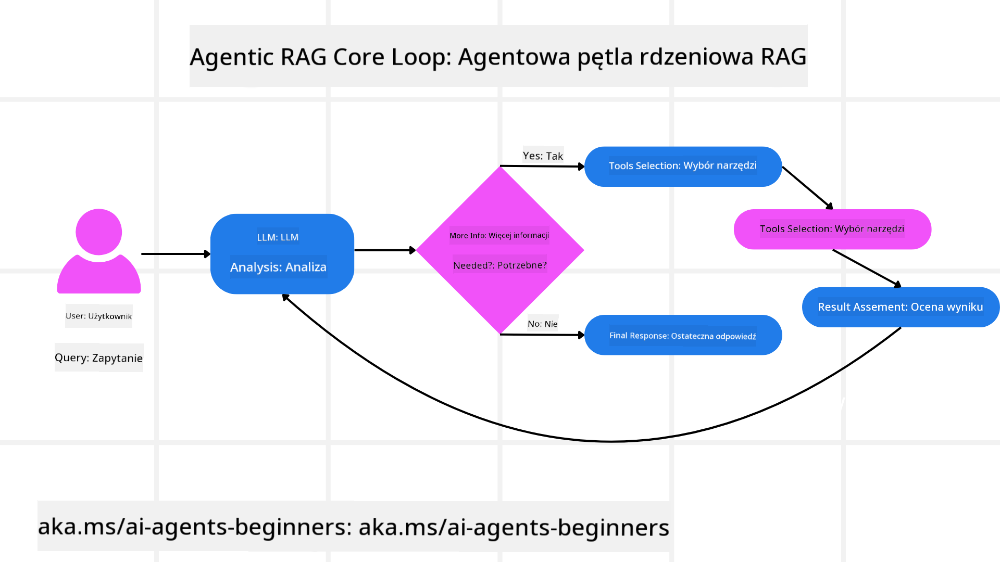
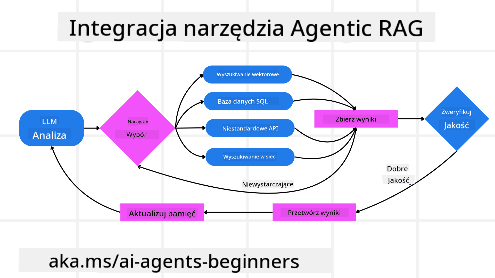
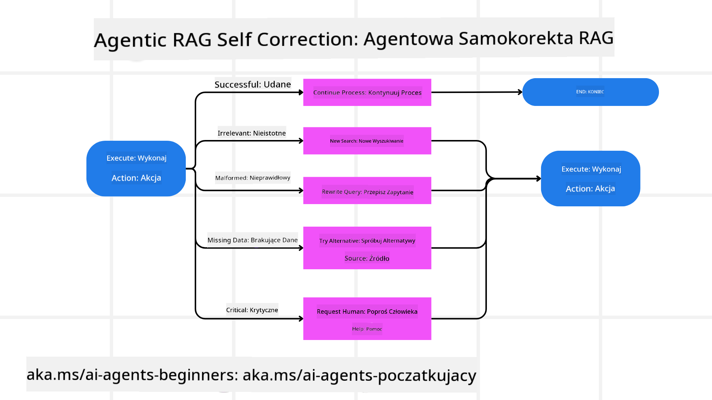
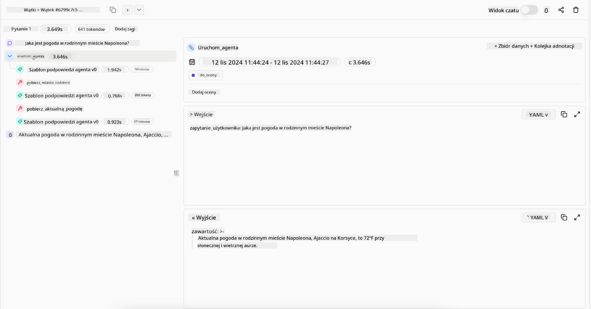
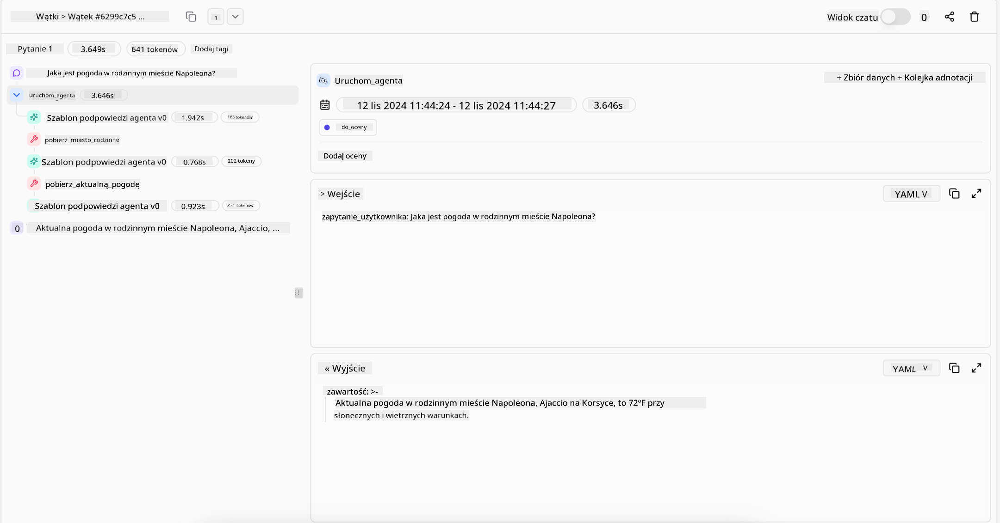

<!--
CO_OP_TRANSLATOR_METADATA:
{
  "original_hash": "7622aa72f9e676e593339f5f694ecd7d",
  "translation_date": "2025-07-12T10:01:19+00:00",
  "source_file": "05-agentic-rag/README.md",
  "language_code": "pl"
}
-->

> _(Kliknij powyższy obraz, aby obejrzeć wideo z tej lekcji)_

# Agentic RAG

Ta lekcja przedstawia kompleksowy przegląd Agentic Retrieval-Augmented Generation (Agentic RAG), nowego paradygmatu AI, w którym duże modele językowe (LLM) samodzielnie planują kolejne kroki, jednocześnie pobierając informacje z zewnętrznych źródeł. W przeciwieństwie do statycznych wzorców „pobierz, a potem przeczytaj”, Agentic RAG obejmuje iteracyjne wywołania LLM, przeplatane wywołaniami narzędzi lub funkcji oraz strukturalnymi wynikami. System ocenia rezultaty, udoskonala zapytania, w razie potrzeby wywołuje dodatkowe narzędzia i kontynuuje ten cykl, aż osiągnie satysfakcjonujące rozwiązanie.

## Wprowadzenie

W tej lekcji omówimy:

- **Zrozumienie Agentic RAG:** Poznasz nowy paradygmat AI, w którym duże modele językowe (LLM) samodzielnie planują kolejne kroki, pobierając informacje z zewnętrznych źródeł danych.
- **Pojęcie iteracyjnego stylu Maker-Checker:** Zrozumiesz pętlę iteracyjnych wywołań LLM, przeplatanych wywołaniami narzędzi lub funkcji oraz strukturalnymi wynikami, zaprojektowaną w celu poprawy poprawności i obsługi błędnych zapytań.
- **Praktyczne zastosowania:** Poznasz scenariusze, w których Agentic RAG sprawdza się najlepiej, takie jak środowiska wymagające poprawności, złożone interakcje z bazami danych oraz rozbudowane przepływy pracy.

## Cele nauki

Po ukończeniu tej lekcji będziesz potrafił/zrozumiesz:

- **Zrozumienie Agentic RAG:** Poznasz nowy paradygmat AI, w którym duże modele językowe (LLM) samodzielnie planują kolejne kroki, pobierając informacje z zewnętrznych źródeł danych.
- **Iteracyjny styl Maker-Checker:** Pojmiesz koncepcję pętli iteracyjnych wywołań LLM, przeplatanych wywołaniami narzędzi lub funkcji oraz strukturalnymi wynikami, mającą na celu poprawę poprawności i obsługę błędnych zapytań.
- **Przejęcie procesu rozumowania:** Zrozumiesz, jak system samodzielnie zarządza swoim procesem rozumowania, podejmując decyzje o podejściu do problemów bez polegania na z góry ustalonych ścieżkach.
- **Przepływ pracy:** Poznasz, jak model agentowy samodzielnie decyduje o pobraniu raportów o trendach rynkowych, identyfikacji danych konkurencji, korelacji wewnętrznych metryk sprzedaży, syntezie wyników i ocenie strategii.
- **Iteracyjne pętle, integracja narzędzi i pamięć:** Dowiesz się, jak system opiera się na wzorcu interakcji w pętli, utrzymując stan i pamięć między krokami, aby unikać powtarzających się pętli i podejmować świadome decyzje.
- **Radzenie sobie z błędami i samokorekta:** Poznasz mechanizmy samokorekty systemu, w tym iteracje i ponowne zapytania, korzystanie z narzędzi diagnostycznych oraz wsparcie nadzoru ludzkiego.
- **Granice autonomii:** Zrozumiesz ograniczenia Agentic RAG, skupiając się na autonomii specyficznej dla domeny, zależności od infrastruktury oraz przestrzeganiu zasad bezpieczeństwa.
- **Praktyczne zastosowania i wartość:** Poznasz scenariusze, w których Agentic RAG sprawdza się najlepiej, takie jak środowiska wymagające poprawności, złożone interakcje z bazami danych oraz rozbudowane przepływy pracy.
- **Zarządzanie, przejrzystość i zaufanie:** Dowiesz się o znaczeniu zarządzania i przejrzystości, w tym wyjaśnialnego rozumowania, kontroli uprzedzeń i nadzoru ludzkiego.

## Czym jest Agentic RAG?

Agentic Retrieval-Augmented Generation (Agentic RAG) to nowy paradygmat AI, w którym duże modele językowe (LLM) samodzielnie planują kolejne kroki, jednocześnie pobierając informacje z zewnętrznych źródeł. W przeciwieństwie do statycznych wzorców „pobierz, a potem przeczytaj”, Agentic RAG obejmuje iteracyjne wywołania LLM, przeplatane wywołaniami narzędzi lub funkcji oraz strukturalnymi wynikami. System ocenia rezultaty, udoskonala zapytania, w razie potrzeby wywołuje dodatkowe narzędzia i kontynuuje ten cykl, aż osiągnie satysfakcjonujące rozwiązanie. Ten iteracyjny styl „maker-checker” poprawia poprawność, obsługuje błędne zapytania i zapewnia wysoką jakość wyników.

System aktywnie zarządza swoim procesem rozumowania, przepisując nieudane zapytania, wybierając różne metody wyszukiwania i integrując wiele narzędzi — takich jak wyszukiwanie wektorowe w Azure AI Search, bazy danych SQL czy niestandardowe API — zanim sfinalizuje odpowiedź. Cechą wyróżniającą system agentowy jest jego zdolność do samodzielnego zarządzania procesem rozumowania. Tradycyjne implementacje RAG opierają się na z góry ustalonych ścieżkach, podczas gdy system agentowy autonomicznie ustala kolejność kroków na podstawie jakości znalezionych informacji.

## Definicja Agentic Retrieval-Augmented Generation (Agentic RAG)

Agentic Retrieval-Augmented Generation (Agentic RAG) to nowy paradygmat w rozwoju AI, w którym LLM nie tylko pobierają informacje z zewnętrznych źródeł danych, ale także samodzielnie planują kolejne kroki. W przeciwieństwie do statycznych wzorców „pobierz, a potem przeczytaj” lub starannie zaplanowanych sekwencji promptów, Agentic RAG obejmuje pętlę iteracyjnych wywołań LLM, przeplatanych wywołaniami narzędzi lub funkcji oraz strukturalnymi wynikami. Za każdym razem system ocenia uzyskane wyniki, decyduje, czy udoskonalić zapytania, wywołuje dodatkowe narzędzia, jeśli to konieczne, i kontynuuje ten cykl, aż osiągnie satysfakcjonujące rozwiązanie.

Ten iteracyjny styl działania „maker-checker” ma na celu poprawę poprawności, obsługę błędnych zapytań do ustrukturyzowanych baz danych (np. NL2SQL) oraz zapewnienie zrównoważonych, wysokiej jakości wyników. Zamiast polegać wyłącznie na starannie zaprojektowanych łańcuchach promptów, system aktywnie zarządza swoim procesem rozumowania. Może przepisywać nieudane zapytania, wybierać różne metody wyszukiwania i integrować wiele narzędzi — takich jak wyszukiwanie wektorowe w Azure AI Search, bazy danych SQL czy niestandardowe API — zanim sfinalizuje odpowiedź. Dzięki temu nie jest potrzebne stosowanie zbyt skomplikowanych frameworków orkiestracji. Zamiast tego stosunkowo prosta pętla „wywołanie LLM → użycie narzędzia → wywołanie LLM → …” może generować zaawansowane i dobrze ugruntowane wyniki.

## Przejęcie procesu rozumowania

Cechą wyróżniającą system „agentowy” jest jego zdolność do samodzielnego zarządzania procesem rozumowania. Tradycyjne implementacje RAG często polegają na tym, że ludzie z góry definiują ścieżkę dla modelu: łańcuch myślowy określający, co i kiedy pobierać.  
Ale gdy system jest naprawdę agentowy, samodzielnie decyduje, jak podejść do problemu. Nie wykonuje tylko skryptu; autonomicznie ustala kolejność kroków na podstawie jakości znalezionych informacji.  
Na przykład, jeśli zostanie poproszony o stworzenie strategii wprowadzenia produktu na rynek, nie polega wyłącznie na promptcie opisującym cały proces badawczy i decyzyjny. Zamiast tego model agentowy samodzielnie decyduje o:

1. Pobranie aktualnych raportów o trendach rynkowych za pomocą Bing Web Grounding  
2. Identyfikację istotnych danych konkurencji za pomocą Azure AI Search  
3. Korelację historycznych wewnętrznych metryk sprzedaży za pomocą Azure SQL Database  
4. Syntezę wyników w spójną strategię, koordynowaną przez Azure OpenAI Service  
5. Ocenę strategii pod kątem luk lub niespójności, w razie potrzeby inicjując kolejną rundę pobierania danych  

Wszystkie te kroki — udoskonalanie zapytań, wybór źródeł, iteracje aż do uzyskania satysfakcjonującej odpowiedzi — są podejmowane przez model, a nie zaprogramowane przez człowieka.

## Iteracyjne pętle, integracja narzędzi i pamięć

System agentowy opiera się na wzorcu interakcji w pętli:

- **Pierwsze wywołanie:** Cel użytkownika (czyli prompt) jest przekazywany do LLM.  
- **Wywołanie narzędzia:** Jeśli model wykryje brakujące informacje lub niejasne instrukcje, wybiera narzędzie lub metodę wyszukiwania — na przykład zapytanie do bazy wektorowej (np. Azure AI Search Hybrid search nad prywatnymi danymi) lub ustrukturyzowane zapytanie SQL — aby zebrać więcej kontekstu.  
- **Ocena i udoskonalenie:** Po przejrzeniu zwróconych danych model decyduje, czy informacje są wystarczające. Jeśli nie, udoskonala zapytanie, próbuje innego narzędzia lub zmienia podejście.  
- **Powtarzaj aż do satysfakcji:** Cykl ten trwa, aż model uzna, że ma wystarczającą jasność i dowody, by dostarczyć ostateczną, dobrze uzasadnioną odpowiedź.  
- **Pamięć i stan:** Ponieważ system utrzymuje stan i pamięć między krokami, może przypominać sobie wcześniejsze próby i ich wyniki, unikając powtarzających się pętli i podejmując bardziej świadome decyzje w trakcie działania.

Z czasem tworzy to poczucie rozwijającego się zrozumienia, umożliwiając modelowi radzenie sobie ze złożonymi, wieloetapowymi zadaniami bez konieczności ciągłej interwencji człowieka lub modyfikacji promptu.

## Radzenie sobie z błędami i samokorekta

Autonomia Agentic RAG obejmuje również solidne mechanizmy samokorekty. Gdy system napotyka ślepe zaułki — takie jak pobieranie nieistotnych dokumentów lub błędne zapytania — może:

- **Iterować i ponownie zapytywać:** Zamiast zwracać niskowartościowe odpowiedzi, model próbuje nowych strategii wyszukiwania, przepisuje zapytania do bazy danych lub analizuje alternatywne zestawy danych.  
- **Korzystać z narzędzi diagnostycznych:** System może wywoływać dodatkowe funkcje pomagające debugować kroki rozumowania lub potwierdzać poprawność pobranych danych. Narzędzia takie jak Azure AI Tracing będą ważne dla zapewnienia solidnej obserwowalności i monitoringu.  
- **Wspierać się nadzorem ludzkim:** W sytuacjach o wysokim ryzyku lub przy powtarzających się błędach model może zgłaszać niepewność i prosić o wskazówki od człowieka. Po otrzymaniu korekty model może uwzględnić tę lekcję w dalszej pracy.

To iteracyjne i dynamiczne podejście pozwala modelowi na ciągłe doskonalenie, zapewniając, że nie jest to system jednorazowy, lecz taki, który uczy się na własnych błędach podczas danej sesji.

## Granice autonomii

Pomimo autonomii w ramach zadania, Agentic RAG nie jest odpowiednikiem sztucznej inteligencji ogólnej (AGI). Jego „agentowe” możliwości są ograniczone do narzędzi, źródeł danych i zasad ustalonych przez ludzi. Nie potrafi wymyślać własnych narzędzi ani wychodzić poza ustalone granice domeny. Zamiast tego doskonale radzi sobie z dynamiczną orkiestracją dostępnych zasobów.  
Kluczowe różnice w porównaniu z bardziej zaawansowanymi formami AI to:

1. **Autonomia specyficzna dla domeny:** Systemy Agentic RAG skupiają się na realizacji celów zdefiniowanych przez użytkownika w znanej domenie, stosując strategie takie jak przepisywanie zapytań czy wybór narzędzi w celu poprawy wyników.  
2. **Zależność od infrastruktury:** Możliwości systemu zależą od narzędzi i danych zintegrowanych przez deweloperów. Nie może przekroczyć tych granic bez interwencji człowieka.  
3. **Poszanowanie zasad bezpieczeństwa:** Wytyczne etyczne, reguły zgodności i polityki biznesowe pozostają bardzo ważne. Wolność agenta jest zawsze ograniczona przez środki bezpieczeństwa i mechanizmy nadzoru (miejmy nadzieję).

## Praktyczne zastosowania i wartość

Agentic RAG sprawdza się w scenariuszach wymagających iteracyjnego udoskonalania i precyzji:

1. **Środowiska wymagające poprawności:** W kontrolach zgodności, analizach regulacyjnych czy badaniach prawnych model agentowy może wielokrotnie weryfikować fakty, konsultować wiele źródeł i przepisywać zapytania, aż wygeneruje w pełni zweryfikowaną odpowiedź.  
2. **Złożone interakcje z bazami danych:** Przy pracy z danymi ustrukturyzowanymi, gdzie zapytania często mogą się nie powieść lub wymagać korekty, system może samodzielnie udoskonalać zapytania za pomocą Azure SQL lub Microsoft Fabric OneLake, zapewniając, że ostateczne pobranie danych odpowiada intencjom użytkownika.  
3. **Rozbudowane przepływy pracy:** Dłuższe sesje mogą ewoluować wraz z pojawianiem się nowych informacji. Agentic RAG może nieustannie integrować nowe dane, zmieniając strategie w miarę zdobywania wiedzy o problemie.

## Zarządzanie, przejrzystość i zaufanie

W miarę jak systemy te stają się bardziej autonomiczne w rozumowaniu, zarządzanie i przejrzystość są kluczowe:

- **Wyjaśnialne rozumowanie:** Model może dostarczyć ścieżkę audytu zapytań, źródeł, które konsultował, oraz kroków rozumowania, które podjął, aby dojść do wniosku. Narzędzia takie jak Azure AI Content Safety oraz Azure AI Tracing / GenAIOps pomagają utrzymać przejrzystość i ograniczać ryzyko.  
- **Kontrola uprzedzeń i zrównoważone pobieranie danych:** Deweloperzy mogą dostosowywać strategie wyszukiwania, aby uwzględniać zrównoważone i reprezentatywne źródła danych oraz regularnie audytować wyniki pod kątem uprzedzeń lub zniekształceń, korzystając z niestandardowych modeli dla zaawansowanych organizacji data science wykorzystujących Azure Machine Learning.  
- **Nadzór ludzki i zgodność:** W zadaniach wrażliwych przegląd ludzki pozostaje niezbędny. Agentic RAG nie zastępuje ludzkiego osądu w decyzjach o wysokiej stawce — wspiera go, dostarczając bardziej dokładnie zweryfikowane opcje.

Posiadanie narzędzi zapewniających jasny zapis działań jest niezbędne. Bez nich debugowanie wieloetapowego procesu może być bardzo trudne. Zobacz poniższy przykład z Literal AI (firma stojąca za Chainlit) dla przebiegu agenta:

## Podsumowanie

Agentic RAG to naturalna ewolucja sposobu, w jaki systemy AI radzą sobie ze złożonymi, wymagającymi danych zadaniami. Przyjmując wzorzec interakcji w pętli, autonomicznie wybierając narzędzia i udoskonalając zapytania aż do uzyskania wysokiej

- <a href="https://learn.microsoft.com/azure/ai-studio/concepts/evaluation-approach-gen-ai" target="_blank">Ocena aplikacji generatywnej AI z Azure AI Foundry: Ten artykuł omawia ocenę i porównanie modeli na publicznie dostępnych zbiorach danych, w tym aplikacji Agentic AI oraz architektur RAG</a>
- <a href="https://weaviate.io/blog/what-is-agentic-rag" target="_blank">Czym jest Agentic RAG | Weaviate</a>
- <a href="https://ragaboutit.com/agentic-rag-a-complete-guide-to-agent-based-retrieval-augmented-generation/" target="_blank">Agentic RAG: Kompletny przewodnik po agentowej generacji wspomaganej wyszukiwaniem – Aktualności z generacji RAG</a>
- <a href="https://huggingface.co/learn/cookbook/agent_rag" target="_blank">Agentic RAG: przyspiesz swój RAG dzięki reformulacji zapytań i samodzielnemu zapytaniu! Hugging Face Open-Source AI Cookbook</a>
- <a href="https://youtu.be/aQ4yQXeB1Ss?si=2HUqBzHoeB5tR04U" target="_blank">Dodawanie warstw Agentic do RAG</a>
- <a href="https://www.youtube.com/watch?v=zeAyuLc_f3Q&t=244s" target="_blank">Przyszłość asystentów wiedzy: Jerry Liu</a>
- <a href="https://www.youtube.com/watch?v=AOSjiXP1jmQ" target="_blank">Jak zbudować systemy Agentic RAG</a>
- <a href="https://ignite.microsoft.com/sessions/BRK102?source=sessions" target="_blank">Wykorzystanie Azure AI Foundry Agent Service do skalowania agentów AI</a>

### Artykuły naukowe

- <a href="https://arxiv.org/abs/2303.17651" target="_blank">2303.17651 Self-Refine: Iteracyjne udoskonalanie z samodzielną informacją zwrotną</a>
- <a href="https://arxiv.org/abs/2303.11366" target="_blank">2303.11366 Reflexion: Agenci językowi z werbalnym uczeniem przez wzmocnienie</a>
- <a href="https://arxiv.org/abs/2305.11738" target="_blank">2305.11738 CRITIC: Duże modele językowe mogą się samokorygować dzięki interaktywnemu krytykowaniu narzędziami</a>
- <a href="https://arxiv.org/abs/2501.09136" target="_blank">2501.09136 Agentic Retrieval-Augmented Generation: Przegląd Agentic RAG</a>

## Poprzednia lekcja

[Wzorzec projektowy użycia narzędzi](../04-tool-use/README.md)

## Następna lekcja

[Budowanie godnych zaufania agentów AI](../06-building-trustworthy-agents/README.md)

**Zastrzeżenie**:  
Niniejszy dokument został przetłumaczony przy użyciu usługi tłumaczenia AI [Co-op Translator](https://github.com/Azure/co-op-translator). Mimo że dążymy do dokładności, prosimy mieć na uwadze, że automatyczne tłumaczenia mogą zawierać błędy lub nieścisłości. Oryginalny dokument w języku źródłowym powinien być uznawany za źródło autorytatywne. W przypadku informacji o kluczowym znaczeniu zalecane jest skorzystanie z profesjonalnego tłumaczenia wykonanego przez człowieka. Nie ponosimy odpowiedzialności za jakiekolwiek nieporozumienia lub błędne interpretacje wynikające z korzystania z tego tłumaczenia.