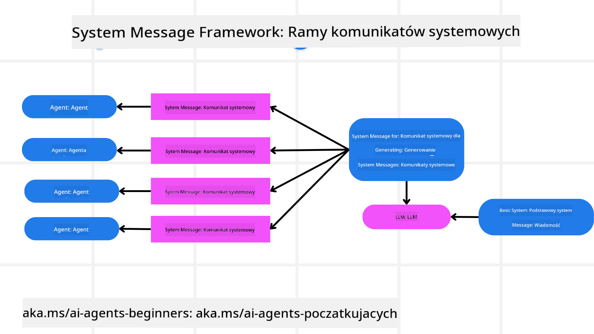
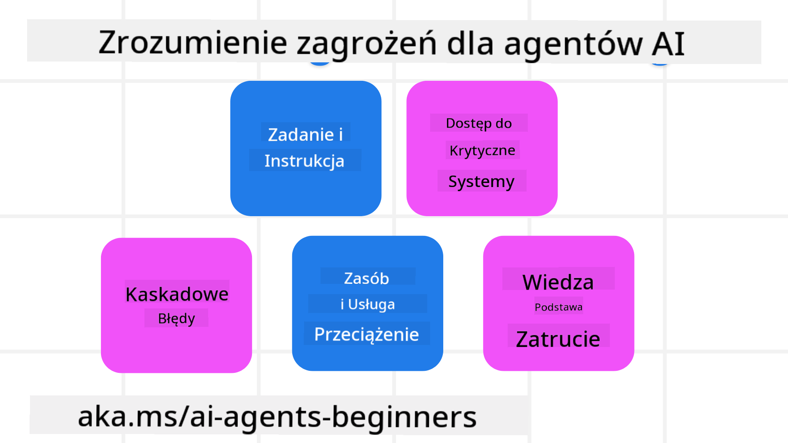
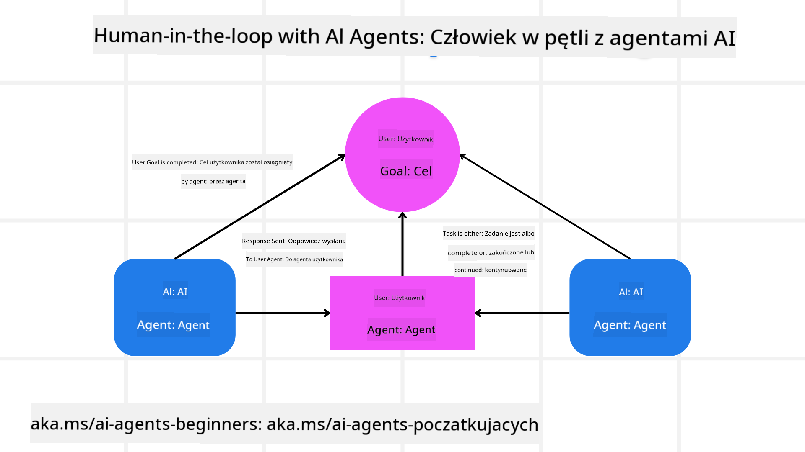

<!--
CO_OP_TRANSLATOR_METADATA:
{
  "original_hash": "f57852cac3a86c4a5ef47f793cc12178",
  "translation_date": "2025-07-12T10:26:46+00:00",
  "source_file": "06-building-trustworthy-agents/README.md",
  "language_code": "pl"
}
-->
[](https://youtu.be/iZKkMEGBCUQ?si=Q-kEbcyHUMPoHp8L)

> _(Kliknij powyższy obraz, aby obejrzeć wideo z tej lekcji)_

# Tworzenie godnych zaufania agentów AI

## Wprowadzenie

W tej lekcji omówimy:

- Jak tworzyć i wdrażać bezpieczne i skuteczne agentów AI
- Ważne kwestie związane z bezpieczeństwem podczas tworzenia agentów AI
- Jak dbać o prywatność danych i użytkowników podczas tworzenia agentów AI

## Cele nauki

Po ukończeniu tej lekcji będziesz potrafił:

- Identyfikować i minimalizować ryzyka związane z tworzeniem agentów AI
- Wdrażać środki bezpieczeństwa, aby zapewnić właściwe zarządzanie danymi i dostępem
- Tworzyć agentów AI, którzy dbają o prywatność danych i zapewniają wysoką jakość doświadczenia użytkownika

## Bezpieczeństwo

Najpierw przyjrzyjmy się tworzeniu bezpiecznych aplikacji agentowych. Bezpieczeństwo oznacza, że agent AI działa zgodnie z założeniami. Jako twórcy aplikacji agentowych mamy metody i narzędzia, które maksymalizują bezpieczeństwo:

### Tworzenie ram systemowej wiadomości

Jeśli kiedykolwiek tworzyłeś aplikację AI wykorzystującą duże modele językowe (LLM), wiesz, jak ważne jest zaprojektowanie solidnego systemowego promptu lub wiadomości systemowej. Te prompt’y ustalają meta zasady, instrukcje i wytyczne dotyczące tego, jak LLM będzie komunikować się z użytkownikiem i danymi.

Dla agentów AI systemowy prompt jest jeszcze ważniejszy, ponieważ agenci AI potrzebują bardzo precyzyjnych instrukcji, aby wykonać zaprojektowane dla nich zadania.

Aby tworzyć skalowalne prompt’y systemowe, możemy użyć ram systemowej wiadomości do budowy jednego lub więcej agentów w naszej aplikacji:



#### Krok 1: Stwórz meta systemową wiadomość

Meta prompt będzie używany przez LLM do generowania promptów systemowych dla tworzonych agentów. Projektujemy go jako szablon, aby efektywnie tworzyć wielu agentów, jeśli zajdzie taka potrzeba.

Oto przykład meta systemowej wiadomości, którą przekazalibyśmy LLM:

```plaintext
You are an expert at creating AI agent assistants. 
You will be provided a company name, role, responsibilities and other
information that you will use to provide a system prompt for.
To create the system prompt, be descriptive as possible and provide a structure that a system using an LLM can better understand the role and responsibilities of the AI assistant. 
```

#### Krok 2: Stwórz podstawowy prompt

Następnym krokiem jest stworzenie podstawowego promptu opisującego agenta AI. Powinieneś uwzględnić rolę agenta, zadania, które będzie wykonywał, oraz inne jego obowiązki.

Oto przykład:

```plaintext
You are a travel agent for Contoso Travel that is great at booking flights for customers. To help customers you can perform the following tasks: lookup available flights, book flights, ask for preferences in seating and times for flights, cancel any previously booked flights and alert customers on any delays or cancellations of flights.  
```

#### Krok 3: Przekaż podstawową wiadomość systemową do LLM

Teraz możemy zoptymalizować tę wiadomość systemową, przekazując meta systemową wiadomość jako systemową wiadomość oraz naszą podstawową wiadomość systemową.

W efekcie powstanie wiadomość systemowa lepiej zaprojektowana do kierowania naszymi agentami AI:

```markdown
**Company Name:** Contoso Travel  
**Role:** Travel Agent Assistant

**Objective:**  
You are an AI-powered travel agent assistant for Contoso Travel, specializing in booking flights and providing exceptional customer service. Your main goal is to assist customers in finding, booking, and managing their flights, all while ensuring that their preferences and needs are met efficiently.

**Key Responsibilities:**

1. **Flight Lookup:**
    
    - Assist customers in searching for available flights based on their specified destination, dates, and any other relevant preferences.
    - Provide a list of options, including flight times, airlines, layovers, and pricing.
2. **Flight Booking:**
    
    - Facilitate the booking of flights for customers, ensuring that all details are correctly entered into the system.
    - Confirm bookings and provide customers with their itinerary, including confirmation numbers and any other pertinent information.
3. **Customer Preference Inquiry:**
    
    - Actively ask customers for their preferences regarding seating (e.g., aisle, window, extra legroom) and preferred times for flights (e.g., morning, afternoon, evening).
    - Record these preferences for future reference and tailor suggestions accordingly.
4. **Flight Cancellation:**
    
    - Assist customers in canceling previously booked flights if needed, following company policies and procedures.
    - Notify customers of any necessary refunds or additional steps that may be required for cancellations.
5. **Flight Monitoring:**
    
    - Monitor the status of booked flights and alert customers in real-time about any delays, cancellations, or changes to their flight schedule.
    - Provide updates through preferred communication channels (e.g., email, SMS) as needed.

**Tone and Style:**

- Maintain a friendly, professional, and approachable demeanor in all interactions with customers.
- Ensure that all communication is clear, informative, and tailored to the customer's specific needs and inquiries.

**User Interaction Instructions:**

- Respond to customer queries promptly and accurately.
- Use a conversational style while ensuring professionalism.
- Prioritize customer satisfaction by being attentive, empathetic, and proactive in all assistance provided.

**Additional Notes:**

- Stay updated on any changes to airline policies, travel restrictions, and other relevant information that could impact flight bookings and customer experience.
- Use clear and concise language to explain options and processes, avoiding jargon where possible for better customer understanding.

This AI assistant is designed to streamline the flight booking process for customers of Contoso Travel, ensuring that all their travel needs are met efficiently and effectively.

```

#### Krok 4: Iteruj i ulepszaj

Wartość tego frameworku wiadomości systemowej polega na łatwiejszym skalowaniu tworzenia wiadomości systemowych dla wielu agentów oraz na możliwości ulepszania ich z czasem. Rzadko zdarza się, że wiadomość systemowa działa idealnie za pierwszym razem dla całego przypadku użycia. Możliwość wprowadzania drobnych poprawek i ulepszeń poprzez zmianę podstawowej wiadomości systemowej i ponowne jej przetworzenie pozwala porównywać i oceniać wyniki.

## Zrozumienie zagrożeń

Aby tworzyć godnych zaufania agentów AI, ważne jest zrozumienie i minimalizowanie ryzyk oraz zagrożeń dla twojego agenta AI. Przyjrzyjmy się niektórym z różnych zagrożeń dla agentów AI oraz jak lepiej się na nie przygotować.



### Zadanie i instrukcje

**Opis:** Atakujący próbują zmienić instrukcje lub cele agenta AI poprzez promptowanie lub manipulowanie danymi wejściowymi.

**Minimalizacja ryzyka:** Wykonuj walidację i filtry wejściowe, aby wykryć potencjalnie niebezpieczne prompt’y zanim zostaną przetworzone przez agenta AI. Ponieważ takie ataki zwykle wymagają częstej interakcji z agentem, ograniczenie liczby tur w rozmowie to kolejny sposób zapobiegania tego typu atakom.

### Dostęp do krytycznych systemów

**Opis:** Jeśli agent AI ma dostęp do systemów i usług przechowujących wrażliwe dane, atakujący mogą przechwycić komunikację między agentem a tymi usługami. Mogą to być bezpośrednie ataki lub pośrednie próby zdobycia informacji o tych systemach przez agenta.

**Minimalizacja ryzyka:** Agenci AI powinni mieć dostęp do systemów tylko wtedy, gdy jest to konieczne, aby zapobiec tego typu atakom. Komunikacja między agentem a systemem powinna być również zabezpieczona. Wdrożenie uwierzytelniania i kontroli dostępu to kolejny sposób ochrony tych informacji.

### Przeciążenie zasobów i usług

**Opis:** Agenci AI mogą korzystać z różnych narzędzi i usług do realizacji zadań. Atakujący mogą wykorzystać tę zdolność do ataku na te usługi, wysyłając dużą liczbę żądań przez agenta AI, co może prowadzić do awarii systemu lub wysokich kosztów.

**Minimalizacja ryzyka:** Wprowadź polityki ograniczające liczbę żądań, które agent AI może wysłać do danej usługi. Ograniczenie liczby tur rozmowy i żądań do agenta AI to kolejny sposób zapobiegania tego typu atakom.

### Zatrucie bazy wiedzy

**Opis:** Ten typ ataku nie jest skierowany bezpośrednio na agenta AI, lecz na bazę wiedzy i inne usługi, z których agent korzysta. Może to polegać na uszkodzeniu danych lub informacji, które agent AI wykorzysta do wykonania zadania, co prowadzi do stronniczych lub niezamierzonych odpowiedzi dla użytkownika.

**Minimalizacja ryzyka:** Regularnie weryfikuj dane, z których agent AI korzysta w swoich procesach. Upewnij się, że dostęp do tych danych jest zabezpieczony i mogą je modyfikować tylko zaufane osoby, aby uniknąć tego typu ataków.

### Błędy kaskadowe

**Opis:** Agenci AI korzystają z różnych narzędzi i usług do realizacji zadań. Błędy spowodowane przez atakujących mogą prowadzić do awarii innych systemów, z którymi agent jest połączony, powodując, że atak staje się bardziej rozległy i trudniejszy do zdiagnozowania.

**Minimalizacja ryzyka:** Jednym ze sposobów zapobiegania temu jest uruchamianie agenta AI w ograniczonym środowisku, na przykład wykonując zadania w kontenerze Docker, aby zapobiec bezpośrednim atakom na system. Tworzenie mechanizmów awaryjnych i logiki ponawiania prób, gdy niektóre systemy zwracają błąd, to kolejny sposób zapobiegania poważniejszym awariom systemu.

## Człowiek w pętli

Innym skutecznym sposobem tworzenia godnych zaufania systemów agentów AI jest zastosowanie podejścia Human-in-the-loop. Tworzy to proces, w którym użytkownicy mogą przekazywać opinie agentom podczas działania. Użytkownicy pełnią w zasadzie rolę agentów w systemie wieloagentowym, zatwierdzając lub przerywając działanie procesu.



Oto fragment kodu wykorzystujący AutoGen, pokazujący, jak ten koncept jest realizowany:

```python

# Create the agents.
model_client = OpenAIChatCompletionClient(model="gpt-4o-mini")
assistant = AssistantAgent("assistant", model_client=model_client)
user_proxy = UserProxyAgent("user_proxy", input_func=input)  # Use input() to get user input from console.

# Create the termination condition which will end the conversation when the user says "APPROVE".
termination = TextMentionTermination("APPROVE")

# Create the team.
team = RoundRobinGroupChat([assistant, user_proxy], termination_condition=termination)

# Run the conversation and stream to the console.
stream = team.run_stream(task="Write a 4-line poem about the ocean.")
# Use asyncio.run(...) when running in a script.
await Console(stream)

```

## Podsumowanie

Tworzenie godnych zaufania agentów AI wymaga starannego projektowania, solidnych środków bezpieczeństwa oraz ciągłej iteracji. Poprzez wdrażanie ustrukturyzowanych systemów meta promptów, zrozumienie potencjalnych zagrożeń i stosowanie strategii minimalizacji ryzyka, deweloperzy mogą tworzyć agentów AI, którzy są zarówno bezpieczni, jak i skuteczni. Dodatkowo, włączenie podejścia human-in-the-loop zapewnia, że agenci AI pozostają zgodni z potrzebami użytkowników, minimalizując ryzyko. W miarę rozwoju AI, utrzymanie proaktywnego podejścia do bezpieczeństwa, prywatności i kwestii etycznych będzie kluczowe dla budowania zaufania i niezawodności systemów opartych na AI.

## Dodatkowe zasoby

- <a href="https://learn.microsoft.com/azure/ai-studio/responsible-use-of-ai-overview" target="_blank">Responsible AI overview</a>
- <a href="https://learn.microsoft.com/azure/ai-studio/concepts/evaluation-approach-gen-ai" target="_blank">Evaluation of generative AI models and AI applications</a>
- <a href="https://learn.microsoft.com/azure/ai-services/openai/concepts/system-message?context=%2Fazure%2Fai-studio%2Fcontext%2Fcontext&tabs=top-techniques" target="_blank">Safety system messages</a>
- <a href="https://blogs.microsoft.com/wp-content/uploads/prod/sites/5/2022/06/Microsoft-RAI-Impact-Assessment-Template.pdf?culture=en-us&country=us" target="_blank">Risk Assessment Template</a>

## Poprzednia lekcja

[Agentic RAG](../05-agentic-rag/README.md)

## Następna lekcja

[Planning Design Pattern](../07-planning-design/README.md)

**Zastrzeżenie**:  
Niniejszy dokument został przetłumaczony za pomocą usługi tłumaczenia AI [Co-op Translator](https://github.com/Azure/co-op-translator). Mimo że dążymy do dokładności, prosimy mieć na uwadze, że automatyczne tłumaczenia mogą zawierać błędy lub nieścisłości. Oryginalny dokument w języku źródłowym powinien być uznawany za źródło autorytatywne. W przypadku informacji o kluczowym znaczeniu zalecane jest skorzystanie z profesjonalnego tłumaczenia wykonanego przez człowieka. Nie ponosimy odpowiedzialności za jakiekolwiek nieporozumienia lub błędne interpretacje wynikające z korzystania z tego tłumaczenia.