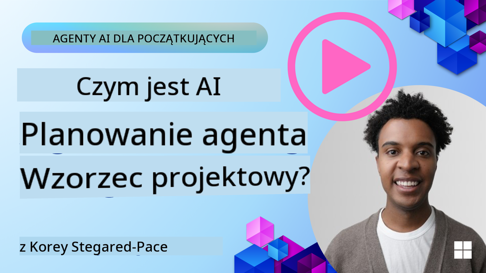
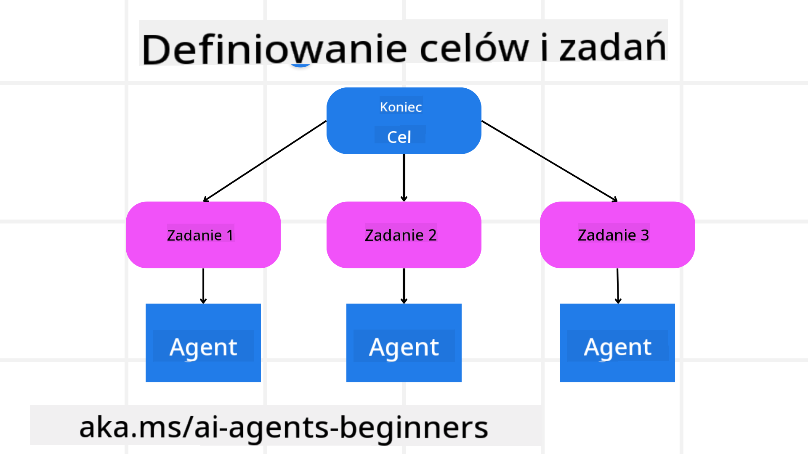

<!--
CO_OP_TRANSLATOR_METADATA:
{
  "original_hash": "a28d30590704ea13b6a08d4793cf9c2b",
  "translation_date": "2025-08-30T14:30:15+00:00",
  "source_file": "07-planning-design/README.md",
  "language_code": "pl"
}
-->
[](https://youtu.be/kPfJ2BrBCMY?si=9pYpPXp0sSbK91Dr)

> _(Kliknij obrazek powyżej, aby obejrzeć wideo z tej lekcji)_

# Projektowanie planowania

## Wprowadzenie

Ta lekcja obejmie:

* Definiowanie jasnego ogólnego celu i dzielenie złożonego zadania na mniejsze, łatwiejsze do zarządzania zadania.
* Wykorzystywanie strukturalnego wyjścia dla bardziej niezawodnych i czytelnych dla maszyn odpowiedzi.
* Zastosowanie podejścia opartego na zdarzeniach do obsługi dynamicznych zadań i nieoczekiwanych danych wejściowych.

## Cele nauki

Po ukończeniu tej lekcji będziesz rozumieć:

* Jak zidentyfikować i ustalić ogólny cel dla agenta AI, zapewniając, że jasno wie, co należy osiągnąć.
* Jak rozłożyć złożone zadanie na mniejsze podzadania i zorganizować je w logiczną sekwencję.
* Jak wyposażyć agentów w odpowiednie narzędzia (np. narzędzia wyszukiwania lub analizy danych), zdecydować, kiedy i jak ich używać, oraz radzić sobie z nieoczekiwanymi sytuacjami.
* Jak oceniać wyniki podzadań, mierzyć wydajność i iterować działania w celu poprawy końcowego wyniku.

## Definiowanie ogólnego celu i dzielenie zadania



Większość zadań w rzeczywistym świecie jest zbyt złożona, aby można je było rozwiązać w jednym kroku. Agent AI potrzebuje zwięzłego celu, który poprowadzi jego planowanie i działania. Na przykład, rozważ cel:

    "Stwórz 3-dniowy plan podróży."

Choć jest to proste do sformułowania, wymaga dalszego doprecyzowania. Im bardziej klarowny cel, tym lepiej agent (oraz wszyscy ludzie współpracujący) mogą skupić się na osiągnięciu właściwego wyniku, takiego jak stworzenie kompleksowego planu podróży z opcjami lotów, rekomendacjami hoteli i propozycjami aktywności.

### Rozkładanie zadania na części

Duże lub skomplikowane zadania stają się bardziej przystępne, gdy są podzielone na mniejsze, ukierunkowane podzadania. 
Dla przykładu planu podróży, można podzielić cel na:

* Rezerwacja lotów
* Rezerwacja hoteli
* Wynajem samochodu
* Personalizacja

Każde podzadanie może być realizowane przez dedykowanych agentów lub procesy. Jeden agent może specjalizować się w wyszukiwaniu najlepszych ofert lotów, inny w rezerwacji hoteli i tak dalej. Koordynujący lub „downstreamowy” agent może następnie skompilować te wyniki w jeden spójny plan podróży dla użytkownika końcowego.

Takie modułowe podejście pozwala również na stopniowe ulepszenia. Na przykład, można dodać wyspecjalizowanych agentów do rekomendacji kulinarnych lub lokalnych atrakcji i z czasem udoskonalić plan podróży.

### Strukturalne wyjście

Duże modele językowe (LLM) mogą generować strukturalne wyjście (np. JSON), które jest łatwiejsze do analizy i przetwarzania przez agentów lub usługi downstreamowe. Jest to szczególnie przydatne w kontekście wieloagentowym, gdzie można podjąć działania na podstawie wyników planowania. Zobacz poniżej dla szybkiego przeglądu.

Poniższy fragment kodu w Pythonie demonstruje prostego agenta planującego, który rozkłada cel na podzadania i generuje strukturalny plan:

```python
from pydantic import BaseModel
from enum import Enum
from typing import List, Optional, Union
import json
import os
from typing import Optional
from pprint import pprint
from autogen_core.models import UserMessage, SystemMessage, AssistantMessage
from autogen_ext.models.azure import AzureAIChatCompletionClient
from azure.core.credentials import AzureKeyCredential

class AgentEnum(str, Enum):
    FlightBooking = "flight_booking"
    HotelBooking = "hotel_booking"
    CarRental = "car_rental"
    ActivitiesBooking = "activities_booking"
    DestinationInfo = "destination_info"
    DefaultAgent = "default_agent"
    GroupChatManager = "group_chat_manager"

# Travel SubTask Model
class TravelSubTask(BaseModel):
    task_details: str
    assigned_agent: AgentEnum  # we want to assign the task to the agent

class TravelPlan(BaseModel):
    main_task: str
    subtasks: List[TravelSubTask]
    is_greeting: bool

client = AzureAIChatCompletionClient(
    model="gpt-4o-mini",
    endpoint="https://models.inference.ai.azure.com",
    # To authenticate with the model you will need to generate a personal access token (PAT) in your GitHub settings.
    # Create your PAT token by following instructions here: https://docs.github.com/en/authentication/keeping-your-account-and-data-secure/managing-your-personal-access-tokens
    credential=AzureKeyCredential(os.environ["GITHUB_TOKEN"]),
    model_info={
        "json_output": False,
        "function_calling": True,
        "vision": True,
        "family": "unknown",
    },
)

# Define the user message
messages = [
    SystemMessage(content="""You are an planner agent.
    Your job is to decide which agents to run based on the user's request.
                      Provide your response in JSON format with the following structure:
{'main_task': 'Plan a family trip from Singapore to Melbourne.',
 'subtasks': [{'assigned_agent': 'flight_booking',
               'task_details': 'Book round-trip flights from Singapore to '
                               'Melbourne.'}
    Below are the available agents specialised in different tasks:
    - FlightBooking: For booking flights and providing flight information
    - HotelBooking: For booking hotels and providing hotel information
    - CarRental: For booking cars and providing car rental information
    - ActivitiesBooking: For booking activities and providing activity information
    - DestinationInfo: For providing information about destinations
    - DefaultAgent: For handling general requests""", source="system"),
    UserMessage(
        content="Create a travel plan for a family of 2 kids from Singapore to Melboune", source="user"),
]

response = await client.create(messages=messages, extra_create_args={"response_format": 'json_object'})

response_content: Optional[str] = response.content if isinstance(
    response.content, str) else None
if response_content is None:
    raise ValueError("Response content is not a valid JSON string" )

pprint(json.loads(response_content))

# # Ensure the response content is a valid JSON string before loading it
# response_content: Optional[str] = response.content if isinstance(
#     response.content, str) else None
# if response_content is None:
#     raise ValueError("Response content is not a valid JSON string")

# # Print the response content after loading it as JSON
# pprint(json.loads(response_content))

# Validate the response content with the MathReasoning model
# TravelPlan.model_validate(json.loads(response_content))
```

### Agent planujący z wieloagentową orkiestracją

W tym przykładzie agent Semantic Router otrzymuje zapytanie użytkownika (np. "Potrzebuję planu hotelowego na moją podróż.").

Planista następnie:

* Otrzymuje plan hotelowy: Planista przyjmuje wiadomość użytkownika i, na podstawie systemowego promptu (zawierającego szczegóły dostępnych agentów), generuje strukturalny plan podróży.
* Wymienia agentów i ich narzędzia: Rejestr agentów zawiera listę agentów (np. do lotów, hoteli, wynajmu samochodów i aktywności) wraz z funkcjami lub narzędziami, które oferują.
* Przekazuje plan odpowiednim agentom: W zależności od liczby podzadań, planista albo wysyła wiadomość bezpośrednio do dedykowanego agenta (w przypadku scenariuszy jednozadaniowych), albo koordynuje za pomocą menedżera czatu grupowego dla współpracy wieloagentowej.
* Podsumowuje wynik: Na koniec planista podsumowuje wygenerowany plan dla przejrzystości.

Poniższy fragment kodu w Pythonie ilustruje te kroki:

```python

from pydantic import BaseModel

from enum import Enum
from typing import List, Optional, Union

class AgentEnum(str, Enum):
    FlightBooking = "flight_booking"
    HotelBooking = "hotel_booking"
    CarRental = "car_rental"
    ActivitiesBooking = "activities_booking"
    DestinationInfo = "destination_info"
    DefaultAgent = "default_agent"
    GroupChatManager = "group_chat_manager"

# Travel SubTask Model

class TravelSubTask(BaseModel):
    task_details: str
    assigned_agent: AgentEnum # we want to assign the task to the agent

class TravelPlan(BaseModel):
    main_task: str
    subtasks: List[TravelSubTask]
    is_greeting: bool
import json
import os
from typing import Optional

from autogen_core.models import UserMessage, SystemMessage, AssistantMessage
from autogen_ext.models.openai import AzureOpenAIChatCompletionClient

# Create the client with type-checked environment variables

client = AzureOpenAIChatCompletionClient(
    azure_deployment=os.getenv("AZURE_OPENAI_DEPLOYMENT_NAME"),
    model=os.getenv("AZURE_OPENAI_DEPLOYMENT_NAME"),
    api_version=os.getenv("AZURE_OPENAI_API_VERSION"),
    azure_endpoint=os.getenv("AZURE_OPENAI_ENDPOINT"),
    api_key=os.getenv("AZURE_OPENAI_API_KEY"),
)

from pprint import pprint

# Define the user message

messages = [
    SystemMessage(content="""You are an planner agent.
    Your job is to decide which agents to run based on the user's request.
    Below are the available agents specialized in different tasks:
    - FlightBooking: For booking flights and providing flight information
    - HotelBooking: For booking hotels and providing hotel information
    - CarRental: For booking cars and providing car rental information
    - ActivitiesBooking: For booking activities and providing activity information
    - DestinationInfo: For providing information about destinations
    - DefaultAgent: For handling general requests""", source="system"),
    UserMessage(content="Create a travel plan for a family of 2 kids from Singapore to Melbourne", source="user"),
]

response = await client.create(messages=messages, extra_create_args={"response_format": TravelPlan})

# Ensure the response content is a valid JSON string before loading it

response_content: Optional[str] = response.content if isinstance(response.content, str) else None
if response_content is None:
    raise ValueError("Response content is not a valid JSON string")

# Print the response content after loading it as JSON

pprint(json.loads(response_content))
```

Poniżej znajduje się wynik poprzedniego kodu, który można następnie wykorzystać do przekierowania do `assigned_agent` i podsumowania planu podróży dla użytkownika końcowego.

```json
{
    "is_greeting": "False",
    "main_task": "Plan a family trip from Singapore to Melbourne.",
    "subtasks": [
        {
            "assigned_agent": "flight_booking",
            "task_details": "Book round-trip flights from Singapore to Melbourne."
        },
        {
            "assigned_agent": "hotel_booking",
            "task_details": "Find family-friendly hotels in Melbourne."
        },
        {
            "assigned_agent": "car_rental",
            "task_details": "Arrange a car rental suitable for a family of four in Melbourne."
        },
        {
            "assigned_agent": "activities_booking",
            "task_details": "List family-friendly activities in Melbourne."
        },
        {
            "assigned_agent": "destination_info",
            "task_details": "Provide information about Melbourne as a travel destination."
        }
    ]
}
```

Przykładowy notebook z poprzednim fragmentem kodu jest dostępny [tutaj](07-autogen.ipynb).

### Iteracyjne planowanie

Niektóre zadania wymagają podejścia iteracyjnego, gdzie wynik jednego podzadania wpływa na kolejne. Na przykład, jeśli agent odkryje nieoczekiwany format danych podczas rezerwacji lotów, może być konieczne dostosowanie strategii przed przejściem do rezerwacji hoteli.

Dodatkowo, opinie użytkownika (np. decyzja człowieka o preferowaniu wcześniejszego lotu) mogą wywołać częściowe przeplanowanie. Takie dynamiczne, iteracyjne podejście zapewnia, że końcowe rozwiązanie odpowiada rzeczywistym ograniczeniom i zmieniającym się preferencjom użytkownika.

Przykładowy kod:

```python
from autogen_core.models import UserMessage, SystemMessage, AssistantMessage
#.. same as previous code and pass on the user history, current plan
messages = [
    SystemMessage(content="""You are a planner agent to optimize the
    Your job is to decide which agents to run based on the user's request.
    Below are the available agents specialized in different tasks:
    - FlightBooking: For booking flights and providing flight information
    - HotelBooking: For booking hotels and providing hotel information
    - CarRental: For booking cars and providing car rental information
    - ActivitiesBooking: For booking activities and providing activity information
    - DestinationInfo: For providing information about destinations
    - DefaultAgent: For handling general requests""", source="system"),
    UserMessage(content="Create a travel plan for a family of 2 kids from Singapore to Melbourne", source="user"),
    AssistantMessage(content=f"Previous travel plan - {TravelPlan}", source="assistant")
]
# .. re-plan and send the tasks to respective agents
```

Dla bardziej kompleksowego planowania sprawdź Magnetic One do rozwiązywania złożonych zadań.

## Podsumowanie

W tym artykule przyjrzeliśmy się przykładowi, jak można stworzyć planistę, który dynamicznie wybiera dostępnych agentów zdefiniowanych. Wyjście planisty rozkłada zadania i przypisuje agentów, aby mogły być wykonane. Zakłada się, że agenci mają dostęp do funkcji/narzędzi wymaganych do wykonania zadania. Oprócz agentów można uwzględnić inne wzorce, takie jak refleksja, podsumowanie i czat w trybie round robin, aby jeszcze bardziej dostosować proces.

## Dodatkowe zasoby

* AutoGen Magnetic One - Uniwersalny system wieloagentowy do rozwiązywania złożonych zadań, który osiągnął imponujące wyniki w wielu wymagających benchmarkach agentowych. Referencja: . W tej implementacji orkiestrator tworzy plan specyficzny dla zadania i deleguje te zadania dostępnym agentom. Oprócz planowania orkiestrator stosuje również mechanizm śledzenia, aby monitorować postęp zadania i przeplanowywać w razie potrzeby.

### Masz więcej pytań dotyczących wzorca projektowania planowania?

Dołącz do [Azure AI Foundry Discord](https://aka.ms/ai-agents/discord), aby spotkać się z innymi uczącymi się, uczestniczyć w godzinach konsultacji i uzyskać odpowiedzi na pytania dotyczące agentów AI.

## Poprzednia lekcja

[Budowanie wiarygodnych agentów AI](../06-building-trustworthy-agents/README.md)

## Następna lekcja

[Wzorzec projektowania wieloagentowego](../08-multi-agent/README.md)

---

**Zastrzeżenie**:  
Ten dokument został przetłumaczony za pomocą usługi tłumaczeniowej AI [Co-op Translator](https://github.com/Azure/co-op-translator). Chociaż dokładamy wszelkich starań, aby tłumaczenie było precyzyjne, prosimy pamiętać, że automatyczne tłumaczenia mogą zawierać błędy lub nieścisłości. Oryginalny dokument w jego rodzimym języku powinien być uznawany za wiarygodne źródło. W przypadku informacji krytycznych zaleca się skorzystanie z profesjonalnego tłumaczenia wykonanego przez człowieka. Nie ponosimy odpowiedzialności za jakiekolwiek nieporozumienia lub błędne interpretacje wynikające z korzystania z tego tłumaczenia.