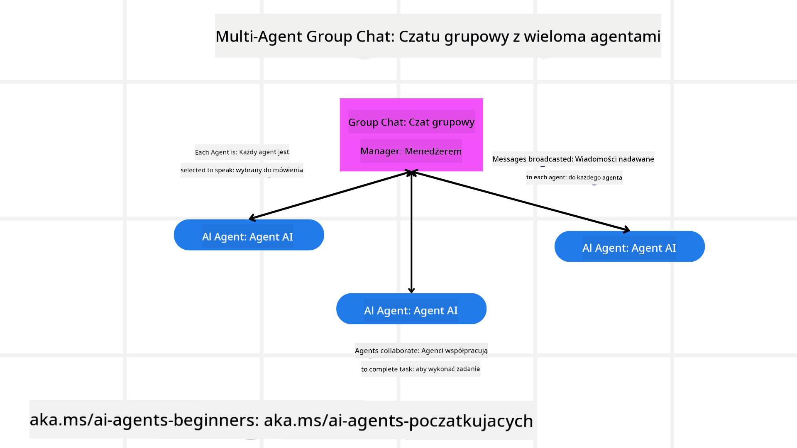
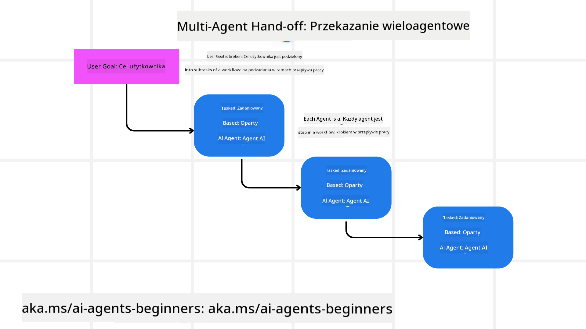
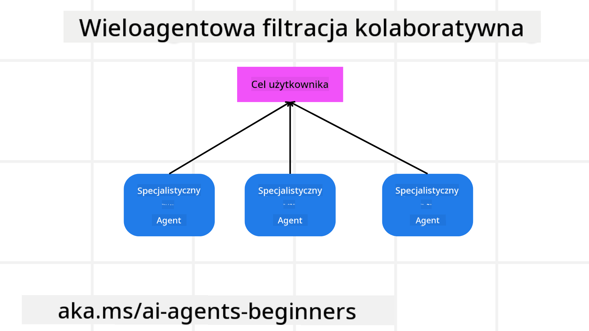

<!--
CO_OP_TRANSLATOR_METADATA:
{
  "original_hash": "c692a8975d7d5b99575a553de1c5e8a7",
  "translation_date": "2025-07-12T11:08:46+00:00",
  "source_file": "08-multi-agent/README.md",
  "language_code": "pl"
}
-->

> _(Kliknij powyższy obraz, aby obejrzeć wideo z tej lekcji)_

# Wzorce projektowe wieloagentowe

Gdy zaczniesz pracować nad projektem, który obejmuje wielu agentów, będziesz musiał rozważyć wzorzec projektowy wieloagentowy. Jednak nie zawsze jest od razu jasne, kiedy przejść do systemu wieloagentowego i jakie są jego zalety.

## Wprowadzenie

W tej lekcji postaramy się odpowiedzieć na następujące pytania:

- W jakich scenariuszach stosuje się systemy wieloagentowe?
- Jakie są zalety używania wielu agentów zamiast jednego agenta wykonującego wiele zadań?
- Jakie są podstawowe elementy implementacji wzorca projektowego wieloagentowego?
- Jak uzyskać wgląd w to, jak agenci współdziałają ze sobą?

## Cele nauki

Po tej lekcji powinieneś być w stanie:

- Zidentyfikować scenariusze, w których stosuje się systemy wieloagentowe
- Rozpoznać zalety używania wielu agentów zamiast pojedynczego agenta
- Zrozumieć podstawowe elementy implementacji wzorca projektowego wieloagentowego

Jaki jest szerszy kontekst?

*Systemy wieloagentowe to wzorzec projektowy, który pozwala wielu agentom współpracować, aby osiągnąć wspólny cel*.

Ten wzorzec jest szeroko stosowany w różnych dziedzinach, w tym w robotyce, systemach autonomicznych oraz przetwarzaniu rozproszonym.

## Scenariusze, w których stosuje się systemy wieloagentowe

W jakich sytuacjach warto zastosować systemy wieloagentowe? Odpowiedź brzmi: jest wiele scenariuszy, w których użycie wielu agentów jest korzystne, zwłaszcza w następujących przypadkach:

- **Duże obciążenia pracy**: Duże zadania można podzielić na mniejsze i przydzielić różnym agentom, co pozwala na równoległe przetwarzanie i szybsze wykonanie. Przykładem jest przetwarzanie dużych zbiorów danych.
- **Złożone zadania**: Podobnie jak w przypadku dużych obciążeń, złożone zadania można rozbić na mniejsze podzadania i przydzielić agentom specjalizującym się w konkretnych aspektach. Dobrym przykładem są pojazdy autonomiczne, gdzie różni agenci zarządzają nawigacją, wykrywaniem przeszkód i komunikacją z innymi pojazdami.
- **Różnorodne kompetencje**: Różni agenci mogą mieć różne specjalizacje, co pozwala im skuteczniej radzić sobie z różnymi aspektami zadania niż pojedynczy agent. Przykładem jest opieka zdrowotna, gdzie agenci mogą zajmować się diagnostyką, planami leczenia i monitorowaniem pacjenta.

## Zalety używania wielu agentów zamiast pojedynczego agenta

System z jednym agentem może dobrze działać przy prostych zadaniach, ale w przypadku bardziej złożonych zadań użycie wielu agentów przynosi kilka korzyści:

- **Specjalizacja**: Każdy agent może być wyspecjalizowany w konkretnym zadaniu. Brak specjalizacji w pojedynczym agencie oznacza, że agent może próbować robić wszystko, ale może mieć trudności z wyborem właściwego działania w złożonych sytuacjach. Na przykład może wykonywać zadanie, do którego nie jest najlepiej przystosowany.
- **Skalowalność**: Łatwiej jest skalować system, dodając kolejnych agentów, niż przeciążać jednego agenta.
- **Odporność na błędy**: Jeśli jeden agent zawiedzie, inni mogą kontynuować działanie, co zapewnia niezawodność systemu.

Weźmy przykład: rezerwacja wycieczki dla użytkownika. System z jednym agentem musiałby obsłużyć wszystkie aspekty procesu rezerwacji, od wyszukiwania lotów po rezerwację hoteli i samochodów. Aby to osiągnąć, agent musiałby mieć narzędzia do obsługi wszystkich tych zadań, co mogłoby prowadzić do skomplikowanego i monolitycznego systemu trudnego w utrzymaniu i skalowaniu. System wieloagentowy mógłby mieć natomiast różnych agentów specjalizujących się w wyszukiwaniu lotów, rezerwacji hoteli i samochodów. To uczyniłoby system bardziej modułowym, łatwiejszym w utrzymaniu i skalowalnym.

Porównaj to do biura podróży prowadzonego przez małą firmę rodzinną versus biura podróży działającego jako franczyza. Mała firma miałaby jednego agenta obsługującego cały proces rezerwacji, podczas gdy franczyza miałaby różnych agentów zajmujących się różnymi aspektami rezerwacji.

## Podstawowe elementy implementacji wzorca projektowego wieloagentowego

Zanim zaimplementujesz wzorzec wieloagentowy, musisz zrozumieć jego podstawowe elementy.

Uczyńmy to bardziej konkretnym, ponownie patrząc na przykład rezerwacji wycieczki dla użytkownika. W tym przypadku podstawowe elementy to:

- **Komunikacja agentów**: Agenci odpowiedzialni za wyszukiwanie lotów, rezerwację hoteli i samochodów muszą się komunikować i wymieniać informacje o preferencjach i ograniczeniach użytkownika. Musisz zdecydować, jakie protokoły i metody komunikacji będą stosowane. Konkretnie oznacza to, że agent wyszukujący loty musi komunikować się z agentem rezerwującym hotele, aby upewnić się, że hotel jest zarezerwowany na te same daty co lot. Oznacza to, że agenci muszą dzielić się informacjami o datach podróży użytkownika, co wymaga decyzji *którzy agenci wymieniają informacje i w jaki sposób*.
- **Mechanizmy koordynacji**: Agenci muszą koordynować swoje działania, aby spełnić preferencje i ograniczenia użytkownika. Na przykład użytkownik może preferować hotel blisko lotniska, a ograniczeniem może być dostępność samochodów tylko na lotnisku. Agent rezerwujący hotele musi więc koordynować się z agentem rezerwującym samochody, aby spełnić te wymagania. Musisz zdecydować *jak agenci koordynują swoje działania*.
- **Architektura agenta**: Agenci muszą mieć wewnętrzną strukturę pozwalającą na podejmowanie decyzji i uczenie się na podstawie interakcji z użytkownikiem. Na przykład agent wyszukujący loty musi mieć mechanizmy decyzyjne dotyczące rekomendacji lotów. Musisz zdecydować *jak agenci podejmują decyzje i uczą się na podstawie interakcji z użytkownikiem*. Przykładem może być użycie modelu uczenia maszynowego przez agenta wyszukującego loty, który rekomenduje loty na podstawie wcześniejszych preferencji użytkownika.
- **Wgląd w interakcje wieloagentowe**: Musisz mieć możliwość obserwowania, jak agenci współdziałają ze sobą. Wymaga to narzędzi i technik do śledzenia aktywności i interakcji agentów. Mogą to być narzędzia do logowania i monitorowania, wizualizacji oraz metryki wydajności.
- **Wzorce wieloagentowe**: Istnieją różne wzorce implementacji systemów wieloagentowych, takie jak architektury scentralizowane, zdecentralizowane i hybrydowe. Musisz wybrać wzorzec najlepiej dopasowany do Twojego przypadku użycia.
- **Człowiek w pętli**: W większości przypadków w systemie jest człowiek w pętli i musisz określić, kiedy agenci powinni prosić o interwencję człowieka. Może to być na przykład sytuacja, gdy użytkownik prosi o konkretny hotel lub lot, którego agenci nie zaproponowali, lub gdy wymagana jest potwierdzenie przed dokonaniem rezerwacji.

## Wgląd w interakcje wieloagentowe

Ważne jest, aby mieć wgląd w to, jak agenci współdziałają ze sobą. Taki wgląd jest niezbędny do debugowania, optymalizacji i zapewnienia skuteczności całego systemu. Aby to osiągnąć, potrzebujesz narzędzi i technik do śledzenia aktywności i interakcji agentów. Mogą to być narzędzia do logowania i monitorowania, wizualizacji oraz metryki wydajności.

Na przykład w przypadku rezerwacji wycieczki dla użytkownika możesz mieć pulpit nawigacyjny pokazujący status każdego agenta, preferencje i ograniczenia użytkownika oraz interakcje między agentami. Taki pulpit może pokazywać daty podróży użytkownika, loty rekomendowane przez agenta lotów, hotele rekomendowane przez agenta hotelowego oraz samochody rekomendowane przez agenta wynajmu. Dzięki temu uzyskasz jasny obraz, jak agenci współdziałają i czy spełniane są preferencje i ograniczenia użytkownika.

Przyjrzyjmy się bliżej poszczególnym aspektom.

- **Narzędzia do logowania i monitorowania**: Chcesz rejestrować każde działanie agenta. Wpis w logu może zawierać informacje o agencie wykonującym działanie, rodzaju działania, czasie jego wykonania oraz wyniku. Te dane mogą być wykorzystywane do debugowania, optymalizacji i innych celów.

- **Narzędzia wizualizacyjne**: Pomagają zobaczyć interakcje między agentami w bardziej intuicyjny sposób. Na przykład możesz mieć wykres pokazujący przepływ informacji między agentami. To może pomóc zidentyfikować wąskie gardła, nieefektywności i inne problemy w systemie.

- **Metryki wydajności**: Pomagają śledzić skuteczność systemu wieloagentowego. Możesz mierzyć czas potrzebny na wykonanie zadania, liczbę zadań wykonanych w jednostce czasu oraz dokładność rekomendacji agentów. Te dane pomagają wskazać obszary do poprawy i optymalizacji systemu.

## Wzorce wieloagentowe

Przyjrzyjmy się kilku konkretnym wzorcom, które można wykorzystać do tworzenia aplikacji wieloagentowych. Oto kilka interesujących wzorców wartych rozważenia:

### Czatu grupowego

Ten wzorzec jest przydatny, gdy chcesz stworzyć aplikację czatu grupowego, w której wielu agentów może się komunikować.

Typowe zastosowania to współpraca zespołowa, obsługa klienta i sieci społecznościowe.

W tym wzorcu każdy agent reprezentuje użytkownika w czacie grupowym, a wiadomości są wymieniane między agentami za pomocą protokołu komunikacyjnego. Agenci mogą wysyłać wiadomości do grupy, odbierać je i odpowiadać na wiadomości innych agentów.

Wzorzec ten można zaimplementować za pomocą architektury scentralizowanej, gdzie wszystkie wiadomości przechodzą przez centralny serwer, lub zdecentralizowanej, gdzie wiadomości są wymieniane bezpośrednio.

### Przekazywanie zadań (Hand-off)

Ten wzorzec jest przydatny, gdy chcesz stworzyć aplikację, w której agenci mogą przekazywać sobie zadania.

Typowe zastosowania to obsługa klienta, zarządzanie zadaniami i automatyzacja procesów.

W tym wzorcu każdy agent reprezentuje zadanie lub etap w procesie, a agenci mogą przekazywać zadania innym agentom na podstawie ustalonych reguł.

### Filtracja współpracująca (Collaborative filtering)

Ten wzorzec jest przydatny, gdy chcesz stworzyć aplikację, w której wielu agentów współpracuje, aby rekomendować użytkownikom.

Dlaczego warto, aby agenci współpracowali? Ponieważ każdy agent może mieć inną specjalizację i wnosić różne perspektywy do procesu rekomendacji.

Weźmy przykład, gdy użytkownik chce otrzymać rekomendację najlepszego akcji do kupienia na giełdzie.

- **Ekspert branżowy**: Jeden agent może być ekspertem w konkretnej branży.
- **Analiza techniczna**: Inny agent może specjalizować się w analizie technicznej.
- **Analiza fundamentalna**: Kolejny agent może być ekspertem w analizie fundamentalnej. Współpracując, agenci mogą dostarczyć użytkownikowi bardziej kompleksową rekomendację.

## Scenariusz: Proces zwrotu pieniędzy

Rozważ scenariusz, w którym klient próbuje uzyskać zwrot za produkt. W tym procesie może być zaangażowanych wielu agentów, ale podzielmy ich na agentów specyficznych dla tego procesu oraz agentów ogólnych, którzy mogą być wykorzystywani w innych procesach.

**Agenci specyficzni dla procesu zwrotu**:

Poniżej znajdują się agenci, którzy mogą być zaangażowani w proces zwrotu:

- **Agent klienta**: Reprezentuje klienta i odpowiada za inicjowanie procesu zwrotu.
- **Agent sprzedawcy**: Reprezentuje sprzedawcę i odpowiada za przetwarzanie zwrotu.
- **Agent płatności**: Reprezentuje proces płatności i odpowiada za zwrot środków klientowi.
- **Agent rozstrzygania**: Reprezentuje proces rozstrzygania i odpowiada za rozwiązywanie problemów pojawiających się podczas zwrotu.
- **Agent zgodności**: Reprezentuje proces zgodności i odpowiada za zapewnienie, że proces zwrotu jest zgodny z przepisami i politykami.

**Agenci ogólni**:

Ci agenci mogą być wykorzystywani w innych częściach Twojego biznesu.

- **Agent wysyłki**: Reprezentuje proces wysyłki i odpowiada za odesłanie produktu do sprzedawcy. Może być używany zarówno w procesie zwrotu, jak i przy ogólnej wysyłce produktu po zakupie.
- **Agent opinii**: Reprezentuje proces zbierania opinii i odpowiada za gromadzenie informacji zwrotnych od klienta. Opinie mogą być zbierane w dowolnym momencie, nie tylko podczas zwrotu.
- **Agent eskalacji**: Reprezentuje proces eskalacji i odpowiada za przekazywanie problemów do wyższego poziomu wsparcia. Możesz używać tego agenta w dowolnym procesie wymagającym eskalacji.
- **Agent powiadomień**: Reprezentuje proces powiadomień i odpowiada za wysyłanie informacji do klienta na różnych etapach procesu zwrotu.
- **Agent analityczny**: Reprezentuje proces analizy danych i odpowiada za analizę informacji związanych z procesem zwrotu.
- **Agent audytu**: Reprezentuje proces audytu i odpowiada za kontrolę poprawności przebiegu procesu zwrotu.
- **Agent raportowania**: Reprezentuje proces raportowania i odpowiada za generowanie raportów dotyczących procesu zwrotu.
- **Agent wiedzy**: Reprezentuje proces zarządzania wiedzą i odpowiada za utrzymanie bazy wiedzy związanej z procesem zwrotu. Może posiadać wiedzę zarówno o zwrotach, jak i innych obszarach Twojego biznesu.
- **Agent bezpieczeństwa**: Reprezentuje proces bezpieczeństwa i odpowiada za zapewnienie bezpieczeństwa procesu zwrotu.
- **Agent jakości**: Reprezentuje proces kontroli jakości i odpowiada za zapewnienie jakości procesu zwrotu.

Wymienionych jest całkiem sporo agentów, zarówno specyficznych dla procesu zwrotu, jak i ogólnych, które można wykorzystać w innych częściach biznesu. Mamy nadzieję, że daje to wyobrażenie, jak możesz zdecydować, których agentów użyć w swoim systemie wieloagentowym.

## Zadanie
## Poprzednia lekcja

[Planowanie projektowania](../07-planning-design/README.md)

## Następna lekcja

[Metapoznanie w agentach AI](../09-metacognition/README.md)

**Zastrzeżenie**:  
Niniejszy dokument został przetłumaczony za pomocą usługi tłumaczenia AI [Co-op Translator](https://github.com/Azure/co-op-translator). Mimo że dążymy do jak największej dokładności, prosimy mieć na uwadze, że tłumaczenia automatyczne mogą zawierać błędy lub nieścisłości. Oryginalny dokument w języku źródłowym powinien być uznawany za źródło autorytatywne. W przypadku informacji o kluczowym znaczeniu zalecane jest skorzystanie z profesjonalnego tłumaczenia wykonanego przez człowieka. Nie ponosimy odpowiedzialności za jakiekolwiek nieporozumienia lub błędne interpretacje wynikające z korzystania z tego tłumaczenia.