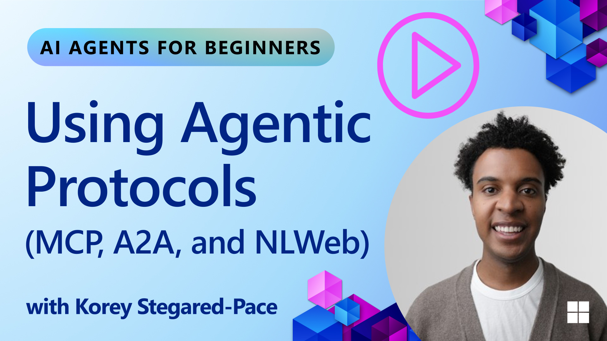
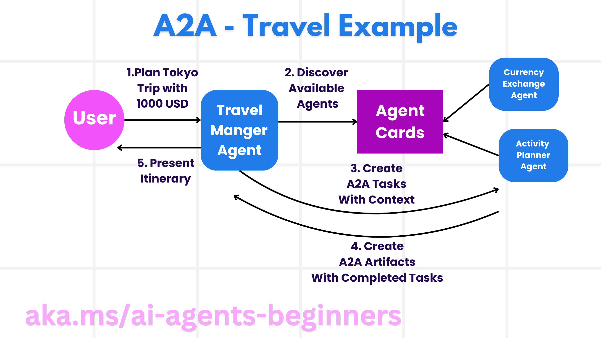

<!--
CO_OP_TRANSLATOR_METADATA:
{
  "original_hash": "5c05bcdfb163dfa2493db39dfb45ad9a",
  "translation_date": "2025-09-04T08:21:31+00:00",
  "source_file": "11-agentic-protocols/README.md",
  "language_code": "pl"
}
-->
# Korzystanie z protokołów agentowych (MCP, A2A i NLWeb)

Wraz z rosnącym wykorzystaniem agentów AI, rośnie potrzeba protokołów zapewniających standaryzację, bezpieczeństwo i wspierających otwartą innowację. W tej lekcji omówimy trzy protokoły, które mają na celu spełnienie tych potrzeb: Model Context Protocol (MCP), Agent to Agent (A2A) oraz Natural Language Web (NLWeb).

## Wprowadzenie

W tej lekcji omówimy:

• Jak **MCP** umożliwia agentom AI dostęp do zewnętrznych narzędzi i danych w celu realizacji zadań użytkownika.

• Jak **A2A** pozwala na komunikację i współpracę między różnymi agentami AI.

• Jak **NLWeb** wprowadza interfejsy w języku naturalnym na dowolnej stronie internetowej, umożliwiając agentom AI odkrywanie i interakcję z treściami.

## Cele nauki

• **Zidentyfikowanie** głównego celu i korzyści wynikających z MCP, A2A i NLWeb w kontekście agentów AI.

• **Wyjaśnienie**, jak każdy z protokołów ułatwia komunikację i interakcję między LLM, narzędziami i innymi agentami.

• **Rozpoznanie** odrębnych ról, jakie każdy protokół odgrywa w budowaniu złożonych systemów agentowych.

## Model Context Protocol

**Model Context Protocol (MCP)** to otwarty standard, który zapewnia ustandaryzowany sposób dostarczania kontekstu i narzędzi do LLM przez aplikacje. Umożliwia to stworzenie "uniwersalnego adaptera" do różnych źródeł danych i narzędzi, z którymi agenci AI mogą się łączyć w spójny sposób.

Przyjrzyjmy się komponentom MCP, korzyściom w porównaniu z bezpośrednim użyciem API oraz przykładowi, jak agenci AI mogą korzystać z serwera MCP.

### Główne komponenty MCP

MCP działa w oparciu o **architekturę klient-serwer**, a jego główne komponenty to:

• **Hosty** to aplikacje LLM (na przykład edytor kodu, taki jak VSCode), które inicjują połączenia z serwerem MCP.

• **Klienci** to komponenty w aplikacji hosta, które utrzymują połączenia jeden-do-jednego z serwerami.

• **Serwery** to lekkie programy udostępniające określone funkcje.

Protokół obejmuje trzy podstawowe prymitywy, które definiują możliwości serwera MCP:

• **Narzędzia**: Są to konkretne działania lub funkcje, które agent AI może wywołać, aby wykonać zadanie. Na przykład serwis pogodowy może udostępniać narzędzie "get weather", a serwer e-commerce narzędzie "purchase product". Serwery MCP reklamują nazwę, opis i schemat wejścia/wyjścia każdego narzędzia w swoim wykazie możliwości.

• **Zasoby**: Są to elementy danych lub dokumenty tylko do odczytu, które serwer MCP może udostępnić, a klienci mogą je pobierać na żądanie. Przykłady obejmują zawartość plików, rekordy baz danych lub pliki dziennika. Zasoby mogą być tekstowe (np. kod lub JSON) lub binarne (np. obrazy lub pliki PDF).

• **Szablony**: Są to predefiniowane wzorce, które sugerują podpowiedzi, umożliwiając bardziej złożone przepływy pracy.

### Korzyści z MCP

MCP oferuje znaczące korzyści dla agentów AI:

• **Dynamiczne odkrywanie narzędzi**: Agenci mogą dynamicznie otrzymywać listę dostępnych narzędzi z serwera wraz z ich opisami. W przeciwieństwie do tradycyjnych API, które często wymagają statycznego kodowania integracji, MCP oferuje podejście "zintegrować raz", co zwiększa elastyczność.

• **Interoperacyjność między LLM**: MCP działa z różnymi LLM, co daje możliwość zmiany modeli bazowych w celu oceny ich wydajności.

• **Standaryzowane bezpieczeństwo**: MCP zawiera standardową metodę uwierzytelniania, co ułatwia skalowanie przy dodawaniu dostępu do kolejnych serwerów MCP. Jest to prostsze niż zarządzanie różnymi kluczami i typami uwierzytelniania dla różnych tradycyjnych API.

### Przykład MCP

Wyobraź sobie, że użytkownik chce zarezerwować lot za pomocą asystenta AI obsługiwanego przez MCP.

1. **Połączenie**: Asystent AI (klient MCP) łączy się z serwerem MCP udostępnionym przez linię lotniczą.

2. **Odkrywanie narzędzi**: Klient pyta serwer MCP linii lotniczej: "Jakie narzędzia są dostępne?". Serwer odpowiada narzędziami, takimi jak "search flights" i "book flights".

3. **Wywołanie narzędzia**: Następnie prosisz asystenta AI: "Proszę wyszukać lot z Portland do Honolulu". Asystent AI, korzystając z LLM, identyfikuje, że musi wywołać narzędzie "search flights" i przekazuje odpowiednie parametry (miejsce wylotu, miejsce docelowe) do serwera MCP.

4. **Wykonanie i odpowiedź**: Serwer MCP, działając jako nakładka, wykonuje rzeczywiste wywołanie wewnętrznego API rezerwacji linii lotniczej. Otrzymuje informacje o locie (np. dane JSON) i przesyła je z powrotem do asystenta AI.

5. **Dalsza interakcja**: Asystent AI przedstawia opcje lotów. Po wybraniu lotu asystent może wywołać narzędzie "book flight" na tym samym serwerze MCP, finalizując rezerwację.

## Protokół Agent-to-Agent (A2A)

Podczas gdy MCP koncentruje się na łączeniu LLM z narzędziami, **protokół Agent-to-Agent (A2A)** idzie o krok dalej, umożliwiając komunikację i współpracę między różnymi agentami AI. A2A łączy agentów AI z różnych organizacji, środowisk i stosów technologicznych, aby wspólnie realizować zadanie.

Przyjrzymy się komponentom i korzyściom A2A oraz przykładowi jego zastosowania w naszej aplikacji podróżniczej.

### Główne komponenty A2A

A2A koncentruje się na umożliwieniu komunikacji między agentami i ich współpracy w realizacji podzadań użytkownika. Każdy komponent protokołu przyczynia się do tego:

#### Karta agenta

Podobnie jak serwer MCP udostępnia listę narzędzi, karta agenta zawiera:
- Nazwę agenta.
- **Opis ogólnych zadań**, które wykonuje.
- **Listę konkretnych umiejętności** z opisami, które pomagają innym agentom (lub nawet użytkownikom) zrozumieć, kiedy i dlaczego warto skorzystać z tego agenta.
- **Aktualny adres URL punktu końcowego** agenta.
- **Wersję** i **możliwości** agenta, takie jak odpowiedzi strumieniowe i powiadomienia push.

#### Wykonawca agenta

Wykonawca agenta odpowiada za **przekazywanie kontekstu rozmowy użytkownika do zdalnego agenta**, aby ten mógł zrozumieć zadanie do wykonania. W serwerze A2A agent korzysta z własnego modelu LLM do analizy przychodzących żądań i realizacji zadań za pomocą własnych narzędzi wewnętrznych.

#### Artefakt

Po zakończeniu zadania przez zdalnego agenta jego wynik jest tworzony jako artefakt. Artefakt **zawiera rezultat pracy agenta**, **opis tego, co zostało wykonane**, oraz **tekstowy kontekst**, który został przesłany przez protokół. Po przesłaniu artefaktu połączenie ze zdalnym agentem jest zamykane, dopóki nie będzie ponownie potrzebne.

#### Kolejka zdarzeń

Ten komponent służy do **obsługi aktualizacji i przekazywania wiadomości**. Jest szczególnie ważny w systemach produkcyjnych, aby zapobiec zamknięciu połączenia między agentami przed zakończeniem zadania, zwłaszcza gdy czas realizacji zadania może być dłuższy.

### Korzyści z A2A

• **Zwiększona współpraca**: Umożliwia agentom różnych dostawców i platform interakcję, dzielenie się kontekstem i współpracę, co ułatwia automatyzację w tradycyjnie odizolowanych systemach.

• **Elastyczność wyboru modelu**: Każdy agent A2A może samodzielnie decydować, który LLM wykorzysta do obsługi swoich żądań, co pozwala na optymalizację lub dostosowanie modeli do potrzeb agenta.

• **Wbudowane uwierzytelnianie**: Uwierzytelnianie jest zintegrowane bezpośrednio z protokołem A2A, zapewniając solidne ramy bezpieczeństwa dla interakcji agentów.

### Przykład A2A

Rozwińmy nasz scenariusz rezerwacji podróży, ale tym razem z wykorzystaniem A2A.

1. **Żądanie użytkownika do multi-agenta**: Użytkownik wchodzi w interakcję z "Agentem Podróży" (klientem/agentem A2A), na przykład mówiąc: "Proszę zarezerwować całą podróż do Honolulu na przyszły tydzień, w tym loty, hotel i wynajem samochodu".

2. **Orkiestracja przez Agenta Podróży**: Agent Podróży otrzymuje to złożone żądanie. Korzysta z własnego LLM, aby zrozumieć zadanie i określić, że musi skomunikować się z innymi wyspecjalizowanymi agentami.

3. **Komunikacja między agentami**: Agent Podróży korzysta z protokołu A2A, aby połączyć się z agentami podrzędnymi, takimi jak "Agent Linii Lotniczych", "Agent Hotelowy" i "Agent Wynajmu Samochodów", stworzonymi przez różne firmy.

4. **Delegowanie realizacji zadań**: Agent Podróży wysyła konkretne zadania do tych wyspecjalizowanych agentów (np. "Znajdź loty do Honolulu", "Zarezerwuj hotel", "Wynajmij samochód"). Każdy z tych wyspecjalizowanych agentów, korzystając z własnych LLM i narzędzi (które mogą być serwerami MCP), realizuje swoją część rezerwacji.

5. **Skonsolidowana odpowiedź**: Po zakończeniu zadań przez wszystkich agentów podrzędnych Agent Podróży kompiluje wyniki (szczegóły lotu, potwierdzenie hotelu, rezerwacja samochodu) i przesyła kompleksową odpowiedź w stylu czatu do użytkownika.

## Natural Language Web (NLWeb)

Strony internetowe od dawna są głównym sposobem dostępu użytkowników do informacji i danych w internecie.

Przyjrzyjmy się różnym komponentom NLWeb, korzyściom wynikającym z NLWeb oraz przykładowi działania NLWeb na podstawie naszej aplikacji podróżniczej.

### Komponenty NLWeb

- **Aplikacja NLWeb (kod podstawowy usługi)**: System przetwarzający pytania w języku naturalnym. Łączy różne części platformy, aby tworzyć odpowiedzi. Można go porównać do **silnika napędzającego funkcje języka naturalnego** na stronie internetowej.

- **Protokół NLWeb**: To **zestaw podstawowych zasad interakcji w języku naturalnym** ze stroną internetową. Zwraca odpowiedzi w formacie JSON (często korzystając z Schema.org). Jego celem jest stworzenie prostego fundamentu dla "AI Web", podobnie jak HTML umożliwił udostępnianie dokumentów online.

- **Serwer MCP (punkt końcowy Model Context Protocol)**: Każda konfiguracja NLWeb działa również jako **serwer MCP**. Oznacza to, że może **udostępniać narzędzia (np. metodę "ask") i dane** innym systemom AI. W praktyce sprawia to, że treści i możliwości strony internetowej stają się częścią szerszego "ekosystemu agentów".

- **Modele osadzania**: Modele te są używane do **konwersji treści strony internetowej na reprezentacje numeryczne zwane wektorami** (osadzenia). Wektory te przechwytują znaczenie w sposób, który umożliwia ich porównywanie i wyszukiwanie przez komputery. Są przechowywane w specjalnej bazie danych, a użytkownicy mogą wybrać, z którego modelu osadzania chcą korzystać.

- **Baza danych wektorów (mechanizm wyszukiwania)**: Ta baza danych **przechowuje osadzenia treści strony internetowej**. Gdy ktoś zada pytanie, NLWeb sprawdza bazę danych wektorów, aby szybko znaleźć najbardziej odpowiednie informacje. Zwraca szybką listę możliwych odpowiedzi, uporządkowaną według podobieństwa. NLWeb współpracuje z różnymi systemami przechowywania wektorów, takimi jak Qdrant, Snowflake, Milvus, Azure AI Search i Elasticsearch.

### NLWeb na przykładzie

Rozważmy naszą stronę internetową do rezerwacji podróży, ale tym razem zasilaną przez NLWeb.

1. **Pobieranie danych**: Istniejące katalogi produktów strony podróżniczej (np. listy lotów, opisy hoteli, pakiety wycieczek) są formatowane za pomocą Schema.org lub ładowane za pomocą kanałów RSS. Narzędzia NLWeb pobierają te dane strukturalne, tworzą osadzenia i przechowują je w lokalnej lub zdalnej bazie danych wektorów.

2. **Zapytanie w języku naturalnym (człowiek)**: Użytkownik odwiedza stronę i zamiast nawigować po menu, wpisuje w interfejsie czatu: "Znajdź mi hotel przyjazny rodzinom w Honolulu z basenem na przyszły tydzień".

3. **Przetwarzanie NLWeb**: Aplikacja NLWeb odbiera to zapytanie. Wysyła je do LLM w celu zrozumienia i jednocześnie przeszukuje bazę danych wektorów w poszukiwaniu odpowiednich ofert hotelowych.

4. **Dokładne wyniki**: LLM pomaga zinterpretować wyniki wyszukiwania z bazy danych, zidentyfikować najlepsze dopasowania na podstawie kryteriów "przyjazny rodzinom", "basen" i "Honolulu", a następnie formatuje odpowiedź w języku naturalnym. Kluczowe jest to, że odpowiedź odnosi się do rzeczywistych hoteli z katalogu strony, unikając wymyślonych informacji.

5. **Interakcja z agentem AI**: Ponieważ NLWeb działa jako serwer MCP, zewnętrzny agent podróżniczy AI mógłby również połączyć się z instancją NLWeb tej strony. Agent AI mógłby następnie użyć metody `ask` MCP, aby bezpośrednio zapytać stronę: `ask("Czy są jakieś restauracje przyjazne weganom w okolicy Honolulu polecane przez hotel?")`. Instancja NLWeb przetworzyłaby to, korzystając z bazy danych informacji o restauracjach (jeśli załadowana), i zwróciłaby odpowiedź w formacie JSON.

### Masz więcej pytań dotyczących MCP/A2A/NLWeb?

Dołącz do [Azure AI Foundry Discord](https://aka.ms/ai-agents/discord), aby spotkać się z innymi uczącymi się, uczestniczyć w godzinach konsultacji i uzyskać odpowiedzi na pytania dotyczące agentów AI.

## Zasoby

- [MCP dla początkujących](https://aka.ms/mcp-for-beginners)  
- [Dokumentacja MCP](https://github.com/microsoft/semantic-kernel/tree/main/python/semantic-kernel/semantic_kernel/connectors/mcp)
- [Repozytorium NLWeb](https://github.com/nlweb-ai/NLWeb)
- [Przewodniki Semantic Kernel](https://learn.microsoft.com/semantic-kernel/)

---

**Zastrzeżenie**:  
Ten dokument został przetłumaczony za pomocą usługi tłumaczeniowej AI [Co-op Translator](https://github.com/Azure/co-op-translator). Chociaż dokładamy wszelkich starań, aby tłumaczenie było precyzyjne, prosimy pamiętać, że automatyczne tłumaczenia mogą zawierać błędy lub nieścisłości. Oryginalny dokument w jego rodzimym języku powinien być uznawany za wiarygodne źródło. W przypadku informacji krytycznych zaleca się skorzystanie z profesjonalnego tłumaczenia wykonanego przez człowieka. Nie ponosimy odpowiedzialności za jakiekolwiek nieporozumienia lub błędne interpretacje wynikające z korzystania z tego tłumaczenia.