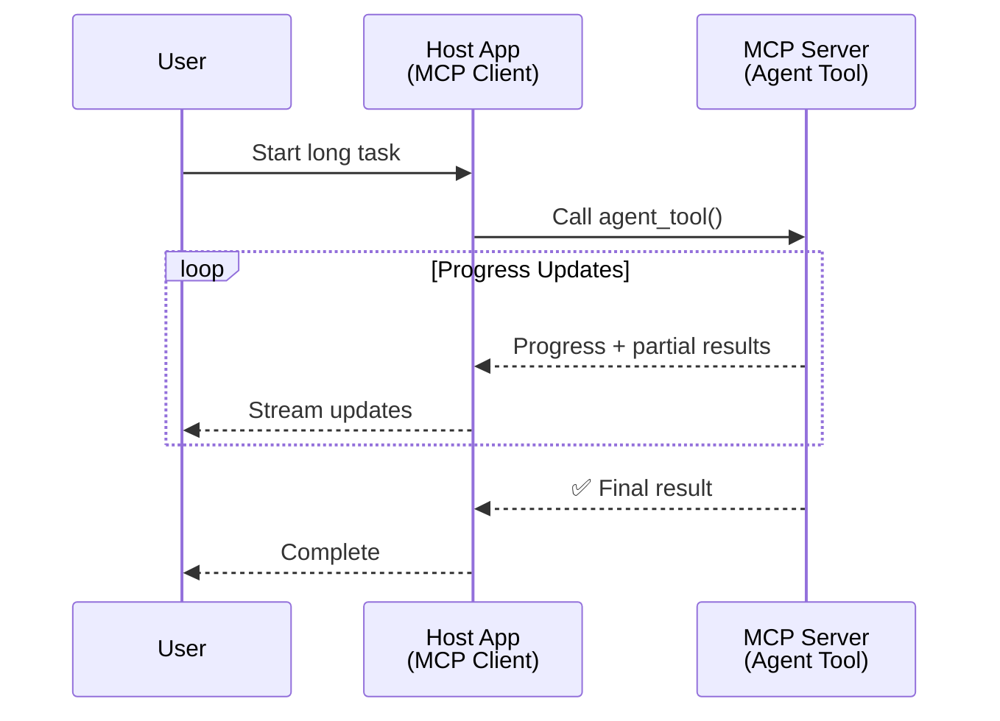
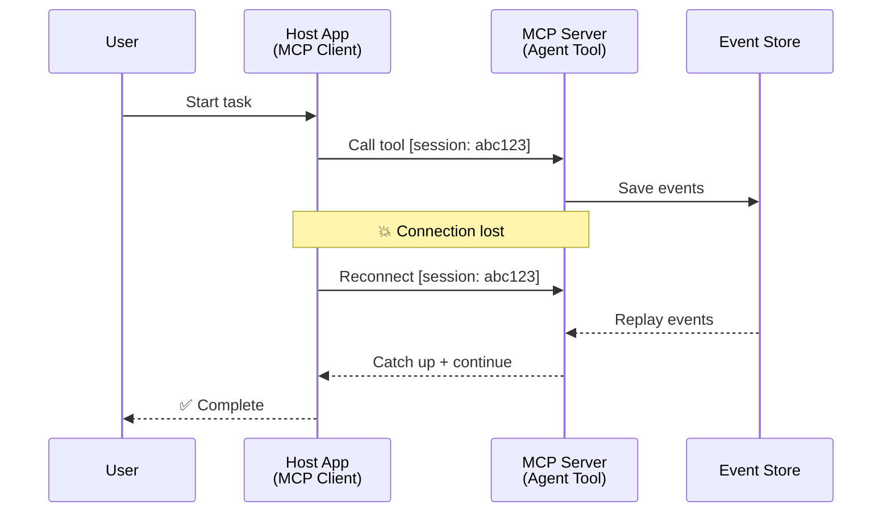
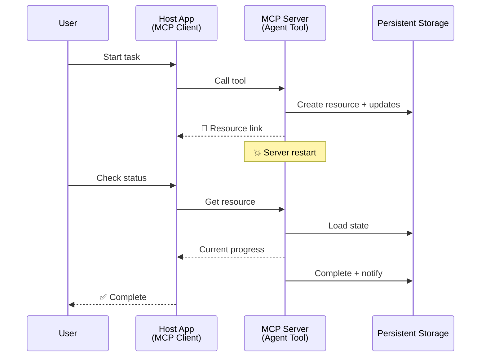
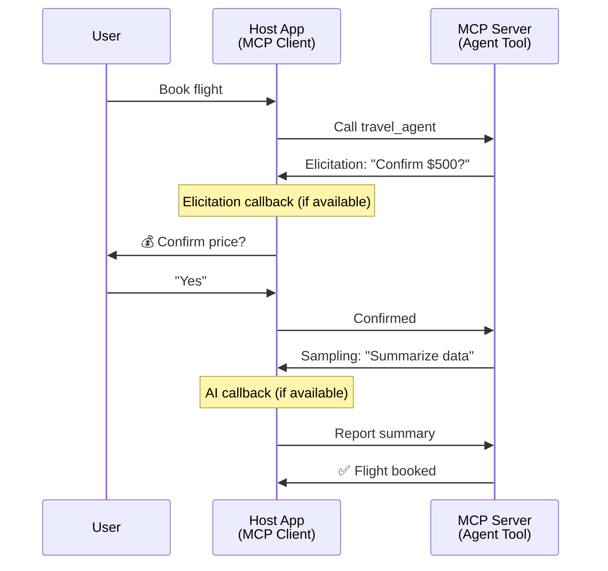
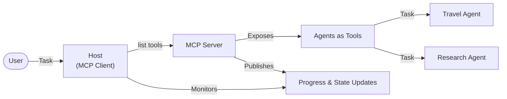

<!--
CO_OP_TRANSLATOR_METADATA:
{
  "original_hash": "5cc6836626047aa055e8960c8484a7d0",
  "translation_date": "2025-08-21T14:36:53+00:00",
  "source_file": "11-mcp/code_samples/mcp-agents/README.md",
  "language_code": "pl"
}
-->
# Budowanie Systemów Komunikacji Agent-Do-Agenta z MCP

> TL;DR - Czy można zbudować komunikację Agent2Agent na MCP? Tak!

MCP znacząco ewoluował poza swój pierwotny cel, jakim było "dostarczanie kontekstu dla LLM". Dzięki ostatnim ulepszeniom, takim jak [strumienie wznawialne](https://modelcontextprotocol.io/docs/concepts/transports#resumability-and-redelivery), [elicitation](https://modelcontextprotocol.io/specification/2025-06-18/client/elicitation), [sampling](https://modelcontextprotocol.io/specification/2025-06-18/client/sampling) oraz powiadomienia ([postęp](https://modelcontextprotocol.io/specification/2025-06-18/basic/utilities/progress) i [zasoby](https://modelcontextprotocol.io/specification/2025-06-18/schema#resourceupdatednotification)), MCP oferuje solidne podstawy do budowy złożonych systemów komunikacji agent-do-agenta.

## Nieporozumienie dotyczące Agenta/Narzędzia

W miarę jak coraz więcej programistów bada narzędzia z zachowaniami agentowymi (działają przez dłuższy czas, mogą wymagać dodatkowych danych w trakcie wykonywania itd.), pojawia się powszechne nieporozumienie, że MCP jest nieodpowiedni, głównie dlatego, że wczesne przykłady jego prymitywnego narzędzia koncentrowały się na prostych wzorcach żądanie-odpowiedź.

To postrzeganie jest już nieaktualne. Specyfikacja MCP została znacząco ulepszona w ciągu ostatnich kilku miesięcy, oferując funkcje, które zamykają lukę w budowie długotrwałych zachowań agentowych:

- **Strumieniowanie i Wyniki Cząstkowe**: Aktualizacje postępu w czasie rzeczywistym podczas wykonywania
- **Wznawialność**: Klienci mogą się ponownie połączyć i kontynuować po rozłączeniu
- **Trwałość**: Wyniki przetrwają restart serwera (np. za pomocą linków do zasobów)
- **Wieloturnowe**: Interaktywne wejście w trakcie wykonywania za pomocą elicitation i sampling

Te funkcje można komponować, aby umożliwić złożone aplikacje agentowe i wieloagentowe, wszystkie wdrożone na protokole MCP.

Dla odniesienia, będziemy nazywać agenta "narzędziem", które jest dostępne na serwerze MCP. To implikuje istnienie aplikacji hosta, która implementuje klienta MCP, ustanawia sesję z serwerem MCP i może wywoływać agenta.

## Co sprawia, że narzędzie MCP jest "agentowe"?

Zanim przejdziemy do implementacji, ustalmy, jakie możliwości infrastrukturalne są potrzebne do obsługi długotrwałych agentów.

> Zdefiniujemy agenta jako jednostkę, która może działać autonomicznie przez dłuższy czas, zdolną do obsługi złożonych zadań, które mogą wymagać wielu interakcji lub dostosowań na podstawie informacji zwrotnych w czasie rzeczywistym.

### 1. Strumieniowanie i Wyniki Cząstkowe

Tradycyjne wzorce żądanie-odpowiedź nie działają w przypadku długotrwałych zadań. Agenci muszą dostarczać:

- Aktualizacje postępu w czasie rzeczywistym
- Wyniki pośrednie

**Wsparcie MCP**: Powiadomienia o aktualizacji zasobów umożliwiają strumieniowanie wyników cząstkowych, choć wymaga to starannego projektowania, aby uniknąć konfliktów z modelem 1:1 żądanie/odpowiedź JSON-RPC.

| Funkcja                    | Przypadek użycia                                                                                                                                                                       | Wsparcie MCP                                                                                |
| -------------------------- | -------------------------------------------------------------------------------------------------------------------------------------------------------------------------------------- | ------------------------------------------------------------------------------------------ |
| Aktualizacje postępu w czasie rzeczywistym | Użytkownik zleca zadanie migracji kodu. Agent strumieniuje postęp: "10% - Analiza zależności... 25% - Konwersja plików TypeScript... 50% - Aktualizacja importów..."          | ✅ Powiadomienia o postępie                                                                  |
| Wyniki cząstkowe            | Zadanie "Generuj książkę" strumieniuje wyniki cząstkowe, np. 1) Zarys fabuły, 2) Lista rozdziałów, 3) Każdy rozdział po ukończeniu. Host może sprawdzić, anulować lub przekierować na każdym etapie. | ✅ Powiadomienia mogą być "rozszerzone", aby zawierać wyniki cząstkowe, patrz propozycje PR 383, 776 |

<div align="center" style="font-style: italic; font-size: 0.95em; margin-bottom: 0.5em;">
<strong>Rysunek 1:</strong> Ten diagram ilustruje, jak agent MCP strumieniuje aktualizacje postępu w czasie rzeczywistym i wyniki cząstkowe do aplikacji hosta podczas długotrwałego zadania, umożliwiając użytkownikowi monitorowanie wykonania w czasie rzeczywistym.
</div>



### 2. Wznawialność

Agenci muszą obsługiwać przerwy w sieci w sposób płynny:

- Ponowne połączenie po rozłączeniu klienta
- Kontynuacja od miejsca, w którym przerwano (ponowne dostarczenie wiadomości)

**Wsparcie MCP**: Transport StreamableHTTP MCP obecnie obsługuje wznawianie sesji i ponowne dostarczanie wiadomości za pomocą identyfikatorów sesji i identyfikatorów ostatnich zdarzeń. Ważne jest, aby serwer zaimplementował EventStore, który umożliwia odtwarzanie zdarzeń po ponownym połączeniu klienta.  
Warto zauważyć, że istnieje propozycja społeczności (PR #975), która bada transport-agnostyczne strumienie wznawialne.

| Funkcja      | Przypadek użycia                                                                                                                                                   | Wsparcie MCP                                                                |
| ------------ | ------------------------------------------------------------------------------------------------------------------------------------------------------------------ | -------------------------------------------------------------------------- |
| Wznawialność | Klient rozłącza się podczas długotrwałego zadania. Po ponownym połączeniu sesja wznawia się z odtworzonymi brakującymi zdarzeniami, kontynuując płynnie od miejsca, w którym przerwano. | ✅ Transport StreamableHTTP z identyfikatorami sesji, odtwarzaniem zdarzeń i EventStore |

<div align="center" style="font-style: italic; font-size: 0.95em; margin-bottom: 0.5em;">
<strong>Rysunek 2:</strong> Ten diagram pokazuje, jak transport StreamableHTTP MCP i EventStore umożliwiają płynne wznawianie sesji: jeśli klient rozłączy się, może się ponownie połączyć i odtworzyć brakujące zdarzenia, kontynuując zadanie bez utraty postępu.
</div>



### 3. Trwałość

Długotrwałe agenty potrzebują trwałego stanu:

- Wyniki przetrwają restart serwera
- Status można pobrać poza sesją
- Śledzenie postępu między sesjami

**Wsparcie MCP**: MCP obecnie obsługuje typ zwrotu linku do zasobu dla wywołań narzędzi. Dziś możliwym wzorcem jest zaprojektowanie narzędzia, które tworzy zasób i natychmiast zwraca link do zasobu. Narzędzie może kontynuować realizację zadania w tle i aktualizować zasób. Z kolei klient może wybrać opcję odpytywania stanu tego zasobu, aby uzyskać wyniki cząstkowe lub pełne (na podstawie aktualizacji zasobów dostarczanych przez serwer) lub subskrybować zasób, aby otrzymywać powiadomienia o aktualizacjach.

Jednym z ograniczeń tutaj jest to, że odpytywanie zasobów lub subskrybowanie aktualizacji może zużywać zasoby, co ma implikacje w skali. Istnieje otwarta propozycja społeczności (w tym #992), która bada możliwość włączenia webhooków lub wyzwalaczy, które serwer może wywołać, aby powiadomić klienta/aplikację hosta o aktualizacjach.

| Funkcja    | Przypadek użycia                                                                                                                                        | Wsparcie MCP                                                        |
| ---------- | ------------------------------------------------------------------------------------------------------------------------------------------------------- | ------------------------------------------------------------------ |
| Trwałość | Serwer ulega awarii podczas zadania migracji danych. Wyniki i postęp przetrwają restart, klient może sprawdzić status i kontynuować z trwałego zasobu. | ✅ Linki do zasobów z trwałym przechowywaniem i powiadomieniami o statusie |

Dziś powszechnym wzorcem jest zaprojektowanie narzędzia, które tworzy zasób i natychmiast zwraca link do zasobu. Narzędzie może w tle realizować zadanie, wydawać powiadomienia o zasobach, które służą jako aktualizacje postępu lub zawierać wyniki cząstkowe, i aktualizować zawartość w zasobie w razie potrzeby.

<div align="center" style="font-style: italic; font-size: 0.95em; margin-bottom: 0.5em;">
<strong>Rysunek 3:</strong> Ten diagram pokazuje, jak agenci MCP wykorzystują trwałe zasoby i powiadomienia o statusie, aby zapewnić, że długotrwałe zadania przetrwają restart serwera, umożliwiając klientom sprawdzanie postępu i pobieranie wyników nawet po awariach.
</div>



### 4. Wieloturnowe Interakcje

Agenci często potrzebują dodatkowych danych w trakcie wykonywania:

- Wyjaśnienia lub zatwierdzenia od człowieka
- Pomocy AI przy podejmowaniu złożonych decyzji
- Dynamicznego dostosowania parametrów

**Wsparcie MCP**: W pełni obsługiwane za pomocą sampling (dla danych AI) i elicitation (dla danych od człowieka).

| Funkcja                 | Przypadek użycia                                                                                                                                     | Wsparcie MCP                                           |
| ----------------------- | ---------------------------------------------------------------------------------------------------------------------------------------------------- | ----------------------------------------------------- |
| Wieloturnowe Interakcje | Agent rezerwacji podróży prosi o potwierdzenie ceny od użytkownika, a następnie prosi AI o podsumowanie danych podróży przed zakończeniem transakcji rezerwacji. | ✅ Elicitation dla danych od człowieka, sampling dla danych AI |

<div align="center" style="font-style: italic; font-size: 0.95em; margin-bottom: 0.5em;">
<strong>Rysunek 4:</strong> Ten diagram pokazuje, jak agenci MCP mogą interaktywnie pozyskiwać dane od człowieka lub prosić o pomoc AI w trakcie wykonywania, wspierając złożone, wieloturnowe przepływy pracy, takie jak potwierdzenia i dynamiczne podejmowanie decyzji.
</div>



## Implementacja Długotrwałych Agentów na MCP - Przegląd Kodów

W ramach tego artykułu udostępniamy [repozytorium kodu](https://github.com/victordibia/ai-tutorials/tree/main/MCP%20Agents), które zawiera kompletną implementację długotrwałych agentów za pomocą MCP Python SDK z transportem StreamableHTTP dla wznawiania sesji i ponownego dostarczania wiadomości. Implementacja pokazuje, jak możliwości MCP mogą być komponowane, aby umożliwić zaawansowane zachowania agentowe.

W szczególności implementujemy serwer z dwoma głównymi narzędziami agentowymi:

- **Agent Podróży** - Symuluje usługę rezerwacji podróży z potwierdzeniem ceny za pomocą elicitation
- **Agent Badawczy** - Wykonuje zadania badawcze z podsumowaniami wspomaganymi przez AI za pomocą sampling

Oba agenty demonstrują aktualizacje postępu w czasie rzeczywistym, interaktywne potwierdzenia i pełne możliwości wznawiania sesji.

### Kluczowe Koncepcje Implementacyjne

Poniższe sekcje pokazują implementację agenta po stronie serwera oraz obsługę hosta po stronie klienta dla każdej funkcji:

#### Strumieniowanie i Aktualizacje Postępu - Status Zadania w Czasie Rzeczywistym

Strumieniowanie umożliwia agentom dostarczanie aktualizacji postępu w czasie rzeczywistym podczas długotrwałych zadań, informując użytkowników o statusie zadania i wynikach pośrednich.

**Implementacja Serwera (agent wysyła powiadomienia o postępie):**

```python
# From server/server.py - Travel agent sending progress updates
for i, step in enumerate(steps):
    await ctx.session.send_progress_notification(
        progress_token=ctx.request_id,
        progress=i * 25,
        total=100,
        message=step,
        related_request_id=str(ctx.request_id)
    )
    await anyio.sleep(2)  # Simulate work

# Alternative: Log messages for detailed step-by-step updates
await ctx.session.send_log_message(
    level="info",
    data=f"Processing step {current_step}/{steps} ({progress_percent}%)",
    logger="long_running_agent",
    related_request_id=ctx.request_id,
)
```

**Implementacja Klienta (host odbiera aktualizacje postępu):**

```python
# From client/client.py - Client handling real-time notifications
async def message_handler(message) -> None:
    if isinstance(message, types.ServerNotification):
        if isinstance(message.root, types.LoggingMessageNotification):
            console.print(f"📡 [dim]{message.root.params.data}[/dim]")
        elif isinstance(message.root, types.ProgressNotification):
            progress = message.root.params
            console.print(f"🔄 [yellow]{progress.message} ({progress.progress}/{progress.total})[/yellow]")

# Register message handler when creating session
async with ClientSession(
    read_stream, write_stream,
    message_handler=message_handler
) as session:
```

#### Elicitation - Pozyskiwanie Danych od Użytkownika

Elicitation umożliwia agentom pozyskiwanie danych od użytkownika w trakcie wykonywania. Jest to niezbędne do potwierdzeń, wyjaśnień lub zatwierdzeń podczas długotrwałych zadań.

**Implementacja Serwera (agent prosi o potwierdzenie):**

```python
# From server/server.py - Travel agent requesting price confirmation
elicit_result = await ctx.session.elicit(
    message=f"Please confirm the estimated price of $1200 for your trip to {destination}",
    requestedSchema=PriceConfirmationSchema.model_json_schema(),
    related_request_id=ctx.request_id,
)

if elicit_result and elicit_result.action == "accept":
    # Continue with booking
    logger.info(f"User confirmed price: {elicit_result.content}")
elif elicit_result and elicit_result.action == "decline":
    # Cancel the booking
    booking_cancelled = True
```

**Implementacja Klienta (host dostarcza callback elicitation):**

```python
# From client/client.py - Client handling elicitation requests
async def elicitation_callback(context, params):
    console.print(f"💬 Server is asking for confirmation:")
    console.print(f"   {params.message}")

    response = console.input("Do you accept? (y/n): ").strip().lower()

    if response in ['y', 'yes']:
        return types.ElicitResult(
            action="accept",
            content={"confirm": True, "notes": "Confirmed by user"}
        )
    else:
        return types.ElicitResult(
            action="decline",
            content={"confirm": False, "notes": "Declined by user"}
        )

# Register the callback when creating the session
async with ClientSession(
    read_stream, write_stream,
    elicitation_callback=elicitation_callback
) as session:
```

#### Sampling - Pozyskiwanie Pomocy AI

Sampling pozwala agentom na pozyskiwanie pomocy LLM przy podejmowaniu złożonych decyzji lub generowaniu treści w trakcie wykonywania. Umożliwia to hybrydowe przepływy pracy człowiek-AI.

**Implementacja Serwera (agent prosi o pomoc AI):**

```python
# From server/server.py - Research agent requesting AI summary
sampling_result = await ctx.session.create_message(
    messages=[
        SamplingMessage(
            role="user",
            content=TextContent(type="text", text=f"Please summarize the key findings for research on: {topic}")
        )
    ],
    max_tokens=100,
    related_request_id=ctx.request_id,
)

if sampling_result and sampling_result.content:
    if sampling_result.content.type == "text":
        sampling_summary = sampling_result.content.text
        logger.info(f"Received sampling summary: {sampling_summary}")
```

**Implementacja Klienta (host dostarcza callback sampling):**

```python
# From client/client.py - Client handling sampling requests
async def sampling_callback(context, params):
    message_text = params.messages[0].content.text if params.messages else 'No message'
    console.print(f"🧠 Server requested sampling: {message_text}")

    # In a real application, this could call an LLM API
    # For demo purposes, we provide a mock response
    mock_response = "Based on current research, MCP has evolved significantly..."

    return types.CreateMessageResult(
        role="assistant",
        content=types.TextContent(type="text", text=mock_response),
        model="interactive-client",
        stopReason="endTurn"
    )

# Register the callback when creating the session
async with ClientSession(
    read_stream, write_stream,
    sampling_callback=sampling_callback,
    elicitation_callback=elicitation_callback
) as session:
```

#### Wznawialność - Ciągłość Sesji po Rozłączeniach

Wznawialność zapewnia, że długotrwałe zadania agentów mogą przetrwać rozłączenia klienta i kontynuować płynnie po ponownym połączeniu. Jest to zaimplementowane za pomocą EventStore i tokenów wznawiania.

**Implementacja EventStore (serwer przechowuje stan sesji):**

```python
# From server/event_store.py - Simple in-memory event store
class SimpleEventStore(EventStore):
    def __init__(self):
        self._events: list[tuple[StreamId, EventId, JSONRPCMessage]] = []
        self._event_id_counter = 0

    async def store_event(self, stream_id: StreamId, message: JSONRPCMessage) -> EventId:
        """Store an event and return its ID."""
        self._event_id_counter += 1
        event_id = str(self._event_id_counter)
        self._events.append((stream_id, event_id, message))
        return event_id

    async def replay_events_after(self, last_event_id: EventId, send_callback: EventCallback) -> StreamId | None:
        """Replay events after the specified ID for resumption."""
        # Find events after the last known event and replay them
        for _, event_id, message in self._events[start_index:]:
            await send_callback(EventMessage(message, event_id))

# From server/server.py - Passing event store to session manager
def create_server_app(event_store: Optional[EventStore] = None) -> Starlette:
    server = ResumableServer()

    # Create session manager with event store for resumption
    session_manager = StreamableHTTPSessionManager(
        app=server,
        event_store=event_store,  # Event store enables session resumption
        json_response=False,
        security_settings=security_settings,
    )

    return Starlette(routes=[Mount("/mcp", app=session_manager.handle_request)])

# Usage: Initialize with event store
event_store = SimpleEventStore()
app = create_server_app(event_store)
```

**Metadane Klienta z Tokenem Wznawiania (klient ponownie łączy się, używając przechowywanego stanu):**

```python
# From client/client.py - Client resumption with metadata
if existing_tokens and existing_tokens.get("resumption_token"):
    # Use existing resumption token to continue where we left off
    metadata = ClientMessageMetadata(
        resumption_token=existing_tokens["resumption_token"],
    )
else:
    # Create callback to save resumption token when received
    def enhanced_callback(token: str):
        protocol_version = getattr(session, 'protocol_version', None)
        token_manager.save_tokens(session_id, token, protocol_version, command, args)

    metadata = ClientMessageMetadata(
        on_resumption_token_update=enhanced_callback,
    )

# Send request with resumption metadata
result = await session.send_request(
    types.ClientRequest(
        types.CallToolRequest(
            method="tools/call",
            params=types.CallToolRequestParams(name=command, arguments=args)
        )
    ),
    types.CallToolResult,
    metadata=metadata,
)
```

Aplikacja hosta przechowuje lokalnie identyfikatory sesji i tokeny wznawiania, umożliwiając jej ponowne połączenie z istniejącymi sesjami bez utraty postępu lub stanu.

### Organizacja Kodów

<div align="center" style="font-style: italic; font-size: 0.95em; margin-bottom: 0.5em;">
<strong>Rysunek 5:</strong> Architektura systemu agentowego opartego na MCP
</div>



**Kluczowe Pliki:**

- **`server/server.py`** - Wznawialny serwer MCP z agentami podróży i badań, demonstrujący elicitation, sampling i aktualizacje postępu
- **`client/client.py`** - Interaktywna aplikacja hosta z obsługą wznawiania, handlerami callback i zarządzaniem tokenami
- **`server/event_store.py`** - Implementacja EventStore umożliwiająca wznawianie sesji i ponowne dostarczanie wiadomości

## Rozszerzenie na Komunikację Wieloagentową na MCP

Powyższa implementacja może być rozszerzona na systemy wieloagentowe poprzez zwiększenie inteligencji i zakresu aplikacji hosta:

- **Inteligentna Dekonstrukcja Zadań**: Host analizuje złożone żądania użytkownika i dzieli je na podzadania dla różnych wyspecjalizowanych agentów
- **Koordynacja Wieloserwerowa**: Host utrzymuje połączenia z wieloma serwerami MCP, z których każdy udostępnia różne możliwości agentów
- **Zarządzanie Stanem Zadań**: Host śledzi postęp w wielu równoczesnych zadaniach agentów, obsługując zależności i sekwencjonowanie
- **Odporność i Ponowne Próby**: Host zarządza awariami, implementuje logikę ponownych prób i przekierowuje zadania, gdy agenci stają się niedostępni
- **Synteza Wyników**: Host łączy wyniki od wielu agentów w spójne rezultaty końcowe

Host ewoluuje od prostego klienta do inteligentnego orkiestratora, koordynując rozproszone możliwości agentów przy zachowaniu tej samej podstawy protokołu MCP.

## Podsumowanie

Ulepszone możliwości MCP - powiadomienia o zasobach, elicitation/sampling, strumienie wznawialne i trwałe zasoby - umożliwiają złożone interakcje agent-do-agenta przy zachowaniu prostoty protokołu.

## Pierwsze Kroki

Gotowy, aby zbudować własny system agent2agent? Wykonaj te kroki:

### 1. Uruchom Demo

```bash
# Start the server with event store for resumption
python -m server.server --port 8006

# In another terminal, run the interactive client
python -m client.client --url http://127.0.0.1:8006/mcp
```

**Dostępne polecenia w trybie interaktywnym:**

- `travel_agent` - Rezerwuj podróż z potwierdzeniem ceny za pomocą elicitation
- `research_agent` - Badaj tematy z podsumowaniami wspomag

**Zastrzeżenie**:  
Ten dokument został przetłumaczony za pomocą usługi tłumaczeniowej AI [Co-op Translator](https://github.com/Azure/co-op-translator). Chociaż dokładamy wszelkich starań, aby zapewnić dokładność, prosimy pamiętać, że automatyczne tłumaczenia mogą zawierać błędy lub nieścisłości. Oryginalny dokument w jego rodzimym języku powinien być uznawany za wiarygodne źródło. W przypadku informacji krytycznych zaleca się skorzystanie z profesjonalnego tłumaczenia wykonanego przez człowieka. Nie ponosimy odpowiedzialności za jakiekolwiek nieporozumienia lub błędne interpretacje wynikające z korzystania z tego tłumaczenia.