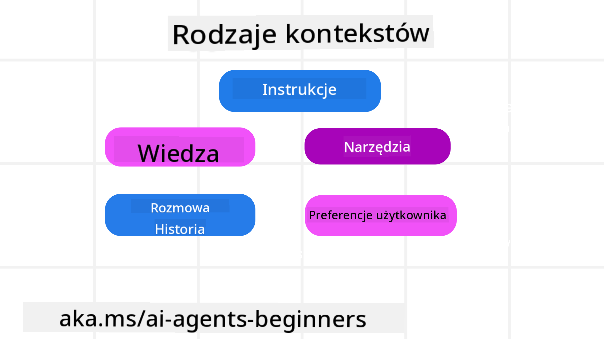
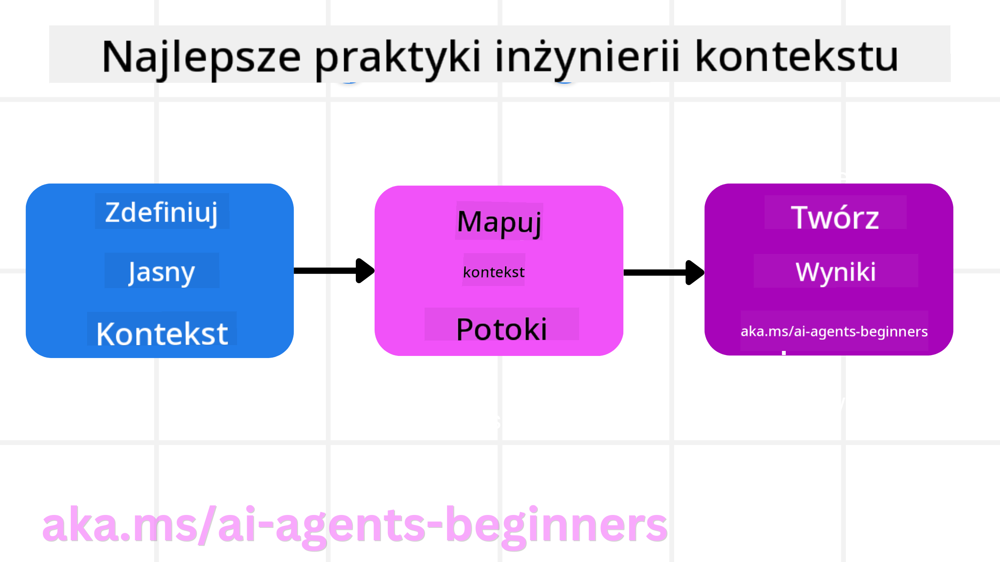

<!--
CO_OP_TRANSLATOR_METADATA:
{
  "original_hash": "cb7e50f471905ce6fdb92a30269a7a98",
  "translation_date": "2025-09-04T10:04:00+00:00",
  "source_file": "12-context-engineering/README.md",
  "language_code": "pl"
}
-->
# Inżynieria kontekstu dla agentów AI

> _(Kliknij obrazek powyżej, aby obejrzeć wideo z tej lekcji)_

Zrozumienie złożoności aplikacji, dla której budujesz agenta AI, jest kluczowe dla stworzenia niezawodnego rozwiązania. Musimy tworzyć agentów AI, którzy skutecznie zarządzają informacjami, aby sprostać złożonym potrzebom wykraczającym poza inżynierię promptów.

W tej lekcji przyjrzymy się, czym jest inżynieria kontekstu i jaka jest jej rola w budowaniu agentów AI.

## Wprowadzenie

Ta lekcja obejmuje:

• **Czym jest inżynieria kontekstu** i dlaczego różni się od inżynierii promptów.

• **Strategie skutecznej inżynierii kontekstu**, w tym jak pisać, wybierać, kompresować i izolować informacje.

• **Typowe błędy związane z kontekstem**, które mogą zakłócić działanie agenta AI, oraz sposoby ich naprawy.

## Cele nauki

Po ukończeniu tej lekcji będziesz wiedzieć, jak:

• **Zdefiniować inżynierię kontekstu** i odróżnić ją od inżynierii promptów.

• **Zidentyfikować kluczowe elementy kontekstu** w aplikacjach opartych na dużych modelach językowych (LLM).

• **Stosować strategie pisania, wybierania, kompresowania i izolowania kontekstu**, aby poprawić wydajność agenta.

• **Rozpoznawać typowe błędy związane z kontekstem**, takie jak zatruwanie, rozproszenie, zamieszanie i konflikt, oraz wdrażać techniki ich ograniczania.

## Czym jest inżynieria kontekstu?

Dla agentów AI kontekst jest tym, co kieruje planowaniem działań agenta AI w celu wykonania określonych zadań. Inżynieria kontekstu to praktyka zapewniania, że agent AI ma odpowiednie informacje, aby wykonać kolejny krok zadania. Okno kontekstu ma ograniczoną wielkość, więc jako twórcy agentów musimy budować systemy i procesy zarządzania dodawaniem, usuwaniem i kondensowaniem informacji w oknie kontekstu.

### Inżynieria promptów vs inżynieria kontekstu

Inżynieria promptów koncentruje się na jednym zestawie statycznych instrukcji, które skutecznie kierują agentami AI za pomocą zestawu reguł. Inżynieria kontekstu dotyczy zarządzania dynamicznym zestawem informacji, w tym początkowym promptem, aby zapewnić, że agent AI ma to, czego potrzebuje w czasie. Głównym celem inżynierii kontekstu jest uczynienie tego procesu powtarzalnym i niezawodnym.

### Rodzaje kontekstu

Warto pamiętać, że kontekst to nie tylko jedna rzecz. Informacje, których potrzebuje agent AI, mogą pochodzić z różnych źródeł, a naszym zadaniem jest zapewnienie, że agent ma dostęp do tych źródeł:

Rodzaje kontekstu, którymi agent AI może zarządzać, obejmują:

• **Instrukcje:** Są to "zasady" agenta – prompty, wiadomości systemowe, przykłady few-shot (pokazujące AI, jak coś zrobić) oraz opisy narzędzi, które może używać. Tutaj inżynieria promptów łączy się z inżynierią kontekstu.

• **Wiedza:** Obejmuje fakty, informacje pobrane z baz danych lub długoterminowe wspomnienia zgromadzone przez agenta. Obejmuje to integrację systemu Retrieval Augmented Generation (RAG), jeśli agent potrzebuje dostępu do różnych źródeł wiedzy i baz danych.

• **Narzędzia:** Są to definicje zewnętrznych funkcji, API i serwerów MCP, które agent może wywoływać, wraz z wynikami uzyskanymi z ich użycia.

• **Historia rozmowy:** Trwający dialog z użytkownikiem. Z czasem te rozmowy stają się dłuższe i bardziej złożone, co oznacza, że zajmują więcej miejsca w oknie kontekstu.

• **Preferencje użytkownika:** Informacje zdobyte na temat upodobań lub niechęci użytkownika w czasie. Mogą być przechowywane i wykorzystywane przy podejmowaniu kluczowych decyzji, aby pomóc użytkownikowi.

## Strategie skutecznej inżynierii kontekstu

### Strategie planowania

Dobra inżynieria kontekstu zaczyna się od dobrego planowania. Oto podejście, które pomoże Ci zacząć myśleć o zastosowaniu koncepcji inżynierii kontekstu:

1. **Zdefiniuj jasne rezultaty** - Rezultaty zadań przypisanych agentom AI powinny być jasno określone. Odpowiedz na pytanie - "Jak będzie wyglądał świat, gdy agent AI zakończy swoje zadanie?" Innymi słowy, jaka zmiana, informacja lub odpowiedź powinna być dostępna dla użytkownika po interakcji z agentem AI.

2. **Mapuj kontekst** - Po zdefiniowaniu rezultatów agenta AI musisz odpowiedzieć na pytanie "Jakie informacje są potrzebne agentowi AI, aby wykonać to zadanie?". W ten sposób możesz zacząć mapować kontekst, gdzie te informacje mogą być zlokalizowane.

3. **Twórz potoki kontekstu** - Teraz, gdy wiesz, gdzie znajdują się informacje, musisz odpowiedzieć na pytanie "Jak agent uzyska te informacje?". Można to zrobić na różne sposoby, w tym za pomocą RAG, serwerów MCP i innych narzędzi.

### Strategie praktyczne

Planowanie jest ważne, ale gdy informacje zaczynają napływać do okna kontekstu agenta, musimy mieć praktyczne strategie zarządzania nimi:

#### Zarządzanie kontekstem

Podczas gdy niektóre informacje będą automatycznie dodawane do okna kontekstu, inżynieria kontekstu polega na bardziej aktywnym zarządzaniu tymi informacjami, co można zrobić za pomocą kilku strategii:

1. **Notatnik agenta**  
Pozwala agentowi AI na robienie notatek o istotnych informacjach dotyczących bieżących zadań i interakcji z użytkownikiem podczas jednej sesji. Powinien istnieć poza oknem kontekstu w pliku lub obiekcie runtime, który agent może później odzyskać w tej sesji, jeśli zajdzie taka potrzeba.

2. **Wspomnienia**  
Notatniki są dobre do zarządzania informacjami poza oknem kontekstu jednej sesji. Wspomnienia umożliwiają agentom przechowywanie i odzyskiwanie istotnych informacji w wielu sesjach. Mogą obejmować podsumowania, preferencje użytkownika i opinie na temat przyszłych ulepszeń.

3. **Kompresowanie kontekstu**  
Gdy okno kontekstu rośnie i zbliża się do swojego limitu, można zastosować techniki takie jak podsumowanie i przycinanie. Obejmuje to zachowanie tylko najbardziej istotnych informacji lub usunięcie starszych wiadomości.

4. **Systemy wieloagentowe**  
Tworzenie systemów wieloagentowych jest formą inżynierii kontekstu, ponieważ każdy agent ma swoje własne okno kontekstu. To, jak ten kontekst jest udostępniany i przekazywany między agentami, jest kolejnym aspektem do zaplanowania podczas budowania tych systemów.

5. **Środowiska sandboxowe**  
Jeśli agent musi uruchomić jakiś kod lub przetworzyć dużą ilość informacji w dokumencie, może to wymagać dużej liczby tokenów do przetworzenia wyników. Zamiast przechowywać wszystko w oknie kontekstu, agent może użyć środowiska sandboxowego, które jest w stanie uruchomić ten kod i odczytać tylko wyniki oraz inne istotne informacje.

6. **Obiekty stanu runtime**  
Tworzenie kontenerów informacji do zarządzania sytuacjami, w których agent musi mieć dostęp do określonych danych. W przypadku złożonego zadania umożliwia to agentowi przechowywanie wyników każdego podzadania krok po kroku, pozwalając na utrzymanie kontekstu powiązanego tylko z tym konkretnym podzadaniem.

### Przykład inżynierii kontekstu

Załóżmy, że chcemy, aby agent AI **"Zarezerwował mi wycieczkę do Paryża."**

• Prosty agent korzystający tylko z inżynierii promptów może po prostu odpowiedzieć: **"Ok, kiedy chciałbyś polecieć do Paryża?"**. Przetwarza tylko Twoje bezpośrednie pytanie w momencie, gdy je zadajesz.

• Agent korzystający ze strategii inżynierii kontekstu omówionych powyżej zrobi znacznie więcej. Zanim nawet odpowie, jego system może:

  ◦ **Sprawdzić Twój kalendarz** w poszukiwaniu dostępnych terminów (pobierając dane w czasie rzeczywistym).

 ◦ **Przypomnieć sobie wcześniejsze preferencje podróży** (z pamięci długoterminowej), takie jak preferowana linia lotnicza, budżet czy preferencja lotów bezpośrednich.

 ◦ **Zidentyfikować dostępne narzędzia** do rezerwacji lotów i hoteli.

- Następnie przykładowa odpowiedź mogłaby brzmieć: **"Hej [Twoje imię]! Widzę, że masz wolny pierwszy tydzień października. Czy mam poszukać lotów bezpośrednich do Paryża na [Preferowana linia lotnicza] w Twoim zwykłym budżecie [Budżet]?"**. Ta bogatsza, świadoma kontekstu odpowiedź pokazuje siłę inżynierii kontekstu.

## Typowe błędy związane z kontekstem

### Zatruwanie kontekstu

**Co to jest:** Gdy halucynacja (fałszywa informacja wygenerowana przez LLM) lub błąd dostaje się do kontekstu i jest wielokrotnie przywoływany, powodując, że agent realizuje niemożliwe cele lub opracowuje bezsensowne strategie.

**Co robić:** Wdrożenie **walidacji kontekstu** i **kwarantanny**. Waliduj informacje przed ich dodaniem do pamięci długoterminowej. Jeśli wykryte zostanie potencjalne zatruwanie, rozpocznij nowe wątki kontekstu, aby zapobiec rozprzestrzenianiu się błędnych informacji.

**Przykład rezerwacji podróży:** Twój agent halucynuje **bezpośredni lot z małego lokalnego lotniska do odległego międzynarodowego miasta**, które nie oferuje lotów międzynarodowych. Ten nieistniejący szczegół lotu zostaje zapisany w kontekście. Później, gdy prosisz agenta o rezerwację, ciągle próbuje znaleźć bilety na tę niemożliwą trasę, co prowadzi do powtarzających się błędów.

**Rozwiązanie:** Wdrożenie kroku, który **waliduje istnienie lotu i trasy za pomocą API w czasie rzeczywistym** _przed_ dodaniem szczegółów lotu do roboczego kontekstu agenta. Jeśli walidacja się nie powiedzie, błędne informacje są "kwarantannowane" i nie są dalej używane.

### Rozproszenie kontekstu

**Co to jest:** Gdy kontekst staje się tak duży, że model zbytnio koncentruje się na zgromadzonej historii zamiast korzystać z tego, czego nauczył się podczas treningu, co prowadzi do powtarzalnych lub nieprzydatnych działań. Modele mogą zacząć popełniać błędy nawet zanim okno kontekstu się zapełni.

**Co robić:** Użyj **podsumowania kontekstu**. Okresowo kompresuj zgromadzone informacje w krótsze podsumowania, zachowując ważne szczegóły, jednocześnie usuwając zbędną historię. To pomaga "zresetować" skupienie.

**Przykład rezerwacji podróży:** Rozmawiasz o różnych wymarzonych destynacjach podróży przez długi czas, w tym szczegółowo opisujesz swoją wyprawę z plecakiem sprzed dwóch lat. Gdy w końcu prosisz o **"znalezienie taniego lotu na** **następny miesiąc****,"** agent gubi się w starych, nieistotnych szczegółach i ciągle pyta o Twój sprzęt turystyczny lub wcześniejsze trasy, zaniedbując Twoje bieżące zapytanie.

**Rozwiązanie:** Po określonej liczbie tur lub gdy kontekst staje się zbyt duży, agent powinien **podsumować najnowsze i najbardziej istotne części rozmowy** – koncentrując się na Twoich bieżących datach podróży i destynacji – i użyć tego skondensowanego podsumowania do następnego wywołania LLM, odrzucając mniej istotną historyczną rozmowę.

### Zamieszanie kontekstu

**Co to jest:** Gdy niepotrzebny kontekst, często w postaci zbyt wielu dostępnych narzędzi, powoduje, że model generuje błędne odpowiedzi lub wywołuje nieistotne narzędzia. Mniejsze modele są szczególnie podatne na to.

**Co robić:** Wdrożenie **zarządzania zestawem narzędzi** za pomocą technik RAG. Przechowuj opisy narzędzi w bazie danych wektorowej i wybieraj _tylko_ najbardziej istotne narzędzia dla każdego konkretnego zadania. Badania pokazują, że ograniczenie wyboru narzędzi do mniej niż 30 jest skuteczne.

**Przykład rezerwacji podróży:** Twój agent ma dostęp do dziesiątek narzędzi: `book_flight`, `book_hotel`, `rent_car`, `find_tours`, `currency_converter`, `weather_forecast`, `restaurant_reservations`, itd. Pytasz, **"Jaki jest najlepszy sposób poruszania się po Paryżu?"** Z powodu ogromnej liczby narzędzi agent gubi się i próbuje wywołać `book_flight` _w_ Paryżu lub `rent_car`, mimo że preferujesz transport publiczny, ponieważ opisy narzędzi mogą się pokrywać lub po prostu nie potrafi wybrać najlepszego.

**Rozwiązanie:** Użyj **RAG na opisach narzędzi**. Gdy pytasz o poruszanie się po Paryżu, system dynamicznie pobiera _tylko_ najbardziej istotne narzędzia, takie jak `rent_car` lub `public_transport_info`, na podstawie Twojego zapytania, prezentując skoncentrowany "zestaw narzędzi" dla LLM.

### Konflikt kontekstu

**Co to jest:** Gdy w kontekście istnieją sprzeczne informacje, prowadząc do niespójnego rozumowania lub błędnych końcowych odpowiedzi. Często zdarza się to, gdy informacje docierają etapami, a wcześniejsze, błędne założenia pozostają w kontekście.

**Co robić:** Użyj **przycinania kontekstu** i **offloadingu**. Przycinanie oznacza usuwanie przestarzałych lub sprzecznych informacji, gdy pojawiają się nowe szczegóły. Offloading daje modelowi oddzielne miejsce robocze "notatnik", aby przetwarzać informacje bez zaśmiecania głównego kontekstu.

**Przykład rezerwacji podróży:** Początkowo mówisz agentowi, **"Chcę lecieć klasą ekonomiczną."** Później w rozmowie zmieniasz zdanie i mówisz, **"Właściwie, na tę podróż wybierzmy klasę biznes."** Jeśli oba instrukcje pozostaną w kontekście, agent może otrzymać sprzeczne wyniki wyszukiwania lub zgubić się, które preferencje priorytetowo traktować.

**Rozwiązanie:** Wdrożenie **przycinania kontekstu**. Gdy nowa instrukcja przeczy starej, starsza instrukcja jest usuwana lub wyraźnie zastępowana w kontekście. Alternatywnie, agent może użyć **notatnika**, aby pogodzić sprzeczne preferencje przed podjęciem decyzji, zapewniając, że tylko ostateczna, spójna instrukcja kieruje jego działaniami.

## Masz więcej pytań dotyczących inżynierii kontekstu?

Dołącz do [Azure AI Foundry Discord](https://aka.ms/ai-agents/discord), aby spotkać się z innymi uczącymi się, uczest

---

**Zastrzeżenie**:  
Ten dokument został przetłumaczony za pomocą usługi tłumaczeniowej AI [Co-op Translator](https://github.com/Azure/co-op-translator). Chociaż dokładamy wszelkich starań, aby zapewnić dokładność, prosimy pamiętać, że automatyczne tłumaczenia mogą zawierać błędy lub nieścisłości. Oryginalny dokument w jego rodzimym języku powinien być uznawany za wiarygodne źródło. W przypadku informacji krytycznych zaleca się skorzystanie z profesjonalnego tłumaczenia wykonanego przez człowieka. Nie ponosimy odpowiedzialności za jakiekolwiek nieporozumienia lub błędne interpretacje wynikające z korzystania z tego tłumaczenia.