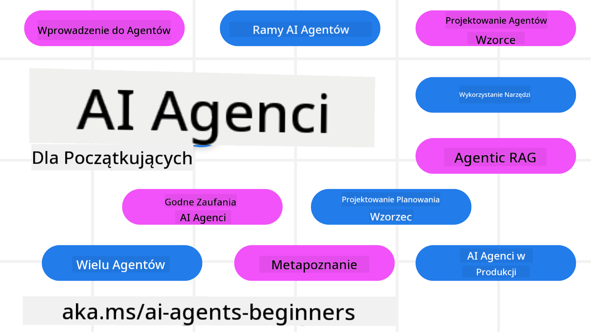

<!--
CO_OP_TRANSLATOR_METADATA:
{
  "original_hash": "9b4c2650691b24b20e0c912d01a466a2",
  "translation_date": "2025-08-21T12:58:50+00:00",
  "source_file": "README.md",
  "language_code": "pl"
}
-->
# AI Agenci dla Początkujących - Kurs

## 11 lekcji uczących wszystkiego, co musisz wiedzieć, aby zacząć budować AI Agenci

### 🌐 Obsługa wielu języków

#### Obsługiwane przez GitHub Action (Automatyczne i zawsze aktualne)

[French](../fr/README.md) | [Spanish](../es/README.md) | [German](../de/README.md) | [Russian](../ru/README.md) | [Arabic](../ar/README.md) | [Persian (Farsi)](../fa/README.md) | [Urdu](../ur/README.md) | [Chinese (Simplified)](../zh/README.md) | [Chinese (Traditional, Macau)](../mo/README.md) | [Chinese (Traditional, Hong Kong)](../hk/README.md) | [Chinese (Traditional, Taiwan)](../tw/README.md) | [Japanese](../ja/README.md) | [Korean](../ko/README.md) | [Hindi](../hi/README.md) | [Bengali](../bn/README.md) | [Marathi](../mr/README.md) | [Nepali](../ne/README.md) | [Punjabi (Gurmukhi)](../pa/README.md) | [Portuguese (Portugal)](../pt/README.md) | [Portuguese (Brazil)](../br/README.md) | [Italian](../it/README.md) | [Polish](./README.md) | [Turkish](../tr/README.md) | [Greek](../el/README.md) | [Thai](../th/README.md) | [Swedish](../sv/README.md) | [Danish](../da/README.md) | [Norwegian](../no/README.md) | [Finnish](../fi/README.md) | [Dutch](../nl/README.md) | [Hebrew](../he/README.md) | [Vietnamese](../vi/README.md) | [Indonesian](../id/README.md) | [Malay](../ms/README.md) | [Tagalog (Filipino)](../tl/README.md) | [Swahili](../sw/README.md) | [Hungarian](../hu/README.md) | [Czech](../cs/README.md) | [Slovak](../sk/README.md) | [Romanian](../ro/README.md) | [Bulgarian](../bg/README.md) | [Serbian (Cyrillic)](../sr/README.md) | [Croatian](../hr/README.md) | [Slovenian](../sl/README.md) | [Ukrainian](../uk/README.md) | [Burmese (Myanmar)](../my/README.md)

**Jeśli chcesz, aby obsługiwane były dodatkowe języki, lista dostępnych języków znajduje się [tutaj](https://github.com/Azure/co-op-translator/blob/main/getting_started/supported-languages.md)**

## 🌱 Pierwsze kroki

Ten kurs zawiera 11 lekcji obejmujących podstawy budowania AI Agenci. Każda lekcja dotyczy innego tematu, więc możesz zacząć od dowolnego miejsca!

Kurs obsługuje wiele języków. Przejdź do [dostępnych języków tutaj](../..). 

Jeśli po raz pierwszy budujesz modele Generative AI, sprawdź nasz kurs [Generative AI For Beginners](https://aka.ms/genai-beginners), który zawiera 21 lekcji na temat budowania z GenAI.

Nie zapomnij [dodać gwiazdki (🌟) do tego repozytorium](https://docs.github.com/en/get-started/exploring-projects-on-github/saving-repositories-with-stars?WT.mc_id=academic-105485-koreyst) i [zforkować to repozytorium](https://github.com/microsoft/ai-agents-for-beginners/fork), aby uruchomić kod.

### Co jest potrzebne

Każda lekcja w tym kursie zawiera przykłady kodu, które można znaleźć w folderze code_samples. Możesz [zforkować to repozytorium](https://github.com/microsoft/ai-agents-for-beginners/fork), aby stworzyć własną kopię.  

Przykłady kodu w tych ćwiczeniach wykorzystują Azure AI Foundry i GitHub Model Catalogs do interakcji z modelami językowymi:

- [Github Models](https://aka.ms/ai-agents-beginners/github-models) - Bezpłatne / Ograniczone
- [Azure AI Foundry](https://aka.ms/ai-agents-beginners/ai-foundry) - Wymagane konto Azure

Ten kurs korzysta również z następujących frameworków i usług AI Agent od Microsoft:

- [Azure AI Agent Service](https://aka.ms/ai-agents-beginners/ai-agent-service)
- [Semantic Kernel](https://aka.ms/ai-agents-beginners/semantic-kernel)
- [AutoGen](https://aka.ms/ai-agents/autogen)

Więcej informacji na temat uruchamiania kodu dla tego kursu znajdziesz w [Course Setup](./00-course-setup/README.md).

## 🙏 Chcesz pomóc?

Masz sugestie lub znalazłeś błędy w pisowni lub kodzie? [Zgłoś problem](https://github.com/microsoft/ai-agents-for-beginners/issues?WT.mc_id=academic-105485-koreyst) lub [Utwórz pull request](https://github.com/microsoft/ai-agents-for-beginners/pulls?WT.mc_id=academic-105485-koreyst)

Jeśli utkniesz lub masz pytania dotyczące budowania AI Agenci, dołącz do naszego [Azure AI Foundry Community Discord](https://discord.gg/kzRShWzttr) 

Jeśli masz uwagi dotyczące produktu lub napotkałeś błędy podczas budowania, odwiedź nasze [Azure AI Foundry Developer Forum](https://aka.ms/azureaifoundry/forum)

## 📂 Każda lekcja zawiera

- Pisemną lekcję znajdującą się w README oraz krótki film
- Przykłady kodu w Pythonie wspierające Azure AI Foundry i Github Models (bezpłatne)
- Linki do dodatkowych zasobów, aby kontynuować naukę

## 🗃️ Lekcje

| **Lekcja**                               | **Tekst i Kod**                                  | **Wideo**                                                  | **Dodatkowa Nauka**                                                                   |
|------------------------------------------|--------------------------------------------------|------------------------------------------------------------|---------------------------------------------------------------------------------------|
| Wprowadzenie do AI Agenci i ich zastosowań | [Link](./01-intro-to-ai-agents/README.md)        | [Video](https://youtu.be/3zgm60bXmQk?si=z8QygFvYQv-9WtO1)  | [Link](https://aka.ms/ai-agents-beginners/collection?WT.mc_id=academic-105485-koreyst) |
| Eksploracja frameworków AI Agentic        | [Link](./02-explore-agentic-frameworks/README.md)| [Video](https://youtu.be/ODwF-EZo_O8?si=Vawth4hzVaHv-u0H)  | [Link](https://aka.ms/ai-agents-beginners/collection?WT.mc_id=academic-105485-koreyst) |
| Zrozumienie wzorców projektowych Agentic  | [Link](./03-agentic-design-patterns/README.md)   | [Video](https://youtu.be/m9lM8qqoOEA?si=BIzHwzstTPL8o9GF)  | [Link](https://aka.ms/ai-agents-beginners/collection?WT.mc_id=academic-105485-koreyst) |
| Wzorzec projektowy użycia narzędzi        | [Link](./04-tool-use/README.md)                  | [Video](https://youtu.be/vieRiPRx-gI?si=2z6O2Xu2cu_Jz46N)  | [Link](https://aka.ms/ai-agents-beginners/collection?WT.mc_id=academic-105485-koreyst) |
| Agentic RAG                               | [Link](./05-agentic-rag/README.md)               | [Video](https://youtu.be/WcjAARvdL7I?si=gKPWsQpKiIlDH9A3)  | [Link](https://aka.ms/ai-agents-beginners/collection?WT.mc_id=academic-105485-koreyst) |
| Budowanie wiarygodnych AI Agenci          | [Link](./06-building-trustworthy-agents/README.md)| [Video](https://youtu.be/iZKkMEGBCUQ?si=jZjpiMnGFOE9L8OK ) | [Link](https://aka.ms/ai-agents-beginners/collection?WT.mc_id=academic-105485-koreyst) |
| Wzorzec projektowy planowania             | [Link](./07-planning-design/README.md)           | [Video](https://youtu.be/kPfJ2BrBCMY?si=6SC_iv_E5-mzucnC)  | [Link](https://aka.ms/ai-agents-beginners/collection?WT.mc_id=academic-105485-koreyst) |
| Wzorzec projektowy wieloagentowy          | [Link](./08-multi-agent/README.md)               | [Video](https://youtu.be/V6HpE9hZEx0?si=rMgDhEu7wXo2uo6g)  | [Link](https://aka.ms/ai-agents-beginners/collection?WT.mc_id=academic-105485-koreyst) |
| Wzorzec projektowy metapoznania           | [Link](./09-metacognition/README.md)             | [Video](https://youtu.be/His9R6gw6Ec?si=8gck6vvdSNCt6OcF)  | [Link](https://aka.ms/ai-agents-beginners/collection?WT.mc_id=academic-105485-koreyst) |
| AI Agenci w produkcji                     | [Link](./10-ai-agents-production/README.md)      | [Video](https://youtu.be/l4TP6IyJxmQ?si=31dnhexRo6yLRJDl)  | [Link](https://aka.ms/ai-agents-beginners/collection?WT.mc_id=academic-105485-koreyst) |
| AI Agenci z MCP                           | [Link](./11-mcp/README.md)                       |                                                            | [Link](https://aka.ms/mcp-for-beginners)                                               |

## 🎒 Inne kursy

Nasz zespół tworzy inne kursy! Sprawdź:
- [**NOWY** Protokół kontekstu modelu (MCP) dla początkujących](https://github.com/microsoft/mcp-for-beginners?WT.mc_id=academic-105485-koreyst)
- [Generatywna AI dla początkujących z użyciem .NET](https://github.com/microsoft/Generative-AI-for-beginners-dotnet?WT.mc_id=academic-105485-koreyst)
- [Generatywna AI dla początkujących](https://github.com/microsoft/generative-ai-for-beginners?WT.mc_id=academic-105485-koreyst)
- [Generatywna AI dla początkujących z użyciem Javy](https://github.com/microsoft/generative-ai-for-beginners-java?WT.mc_id=academic-105485-koreyst)
- [ML dla początkujących](https://aka.ms/ml-beginners?WT.mc_id=academic-105485-koreyst)
- [Data Science dla początkujących](https://aka.ms/datascience-beginners?WT.mc_id=academic-105485-koreyst)
- [AI dla początkujących](https://aka.ms/ai-beginners?WT.mc_id=academic-105485-koreyst)
- [Cyberbezpieczeństwo dla początkujących](https://github.com/microsoft/Security-101??WT.mc_id=academic-96948-sayoung)
- [Web Dev dla początkujących](https://aka.ms/webdev-beginners?WT.mc_id=academic-105485-koreyst)
- [IoT dla początkujących](https://aka.ms/iot-beginners?WT.mc_id=academic-105485-koreyst)
- [Rozwój XR dla początkujących](https://github.com/microsoft/xr-development-for-beginners?WT.mc_id=academic-105485-koreyst)
- [Opanowanie GitHub Copilot dla programowania w parach z AI](https://aka.ms/GitHubCopilotAI?WT.mc_id=academic-105485-koreyst)
- [Opanowanie GitHub Copilot dla programistów C#/.NET](https://github.com/microsoft/mastering-github-copilot-for-dotnet-csharp-developers?WT.mc_id=academic-105485-koreyst)
- [Wybierz swoją własną przygodę z Copilotem](https://github.com/microsoft/CopilotAdventures?WT.mc_id=academic-105485-koreyst)

## 🌟 Podziękowania dla społeczności

Podziękowania dla [Shivam Goyal](https://www.linkedin.com/in/shivam2003/) za wkład w ważne przykłady kodu demonstrujące Agentic RAG. 

## Wkład w projekt

Ten projekt przyjmuje wkłady i sugestie. Większość wkładów wymaga od Ciebie zgody na 
Umowę Licencyjną Współtwórcy (CLA), która potwierdza, że masz prawo do udzielenia nam 
praw do korzystania z Twojego wkładu. Szczegóły znajdziesz na 
<https://cla.opensource.microsoft.com>.

Gdy przesyłasz pull request, bot CLA automatycznie określi, czy musisz dostarczyć 
CLA i odpowiednio oznaczy PR (np. status check, komentarz). Po prostu postępuj zgodnie z instrukcjami 
podanymi przez bota. Musisz to zrobić tylko raz dla wszystkich repozytoriów korzystających z naszego CLA.

Ten projekt przyjął [Kodeks postępowania Microsoft Open Source](https://opensource.microsoft.com/codeofconduct/).
Więcej informacji znajdziesz w [FAQ dotyczących kodeksu postępowania](https://opensource.microsoft.com/codeofconduct/faq/) lub 
skontaktuj się z [opencode@microsoft.com](mailto:opencode@microsoft.com) w przypadku dodatkowych pytań lub uwag.

## Znaki towarowe

Ten projekt może zawierać znaki towarowe lub logotypy projektów, produktów lub usług. Autoryzowane użycie znaków towarowych 
lub logotypów Microsoft musi być zgodne z 
[Wytycznymi dotyczącymi znaków towarowych i marki Microsoft](https://www.microsoft.com/legal/intellectualproperty/trademarks/usage/general).
Użycie znaków towarowych lub logotypów Microsoft w zmodyfikowanych wersjach tego projektu nie może powodować zamieszania ani sugerować sponsorowania przez Microsoft.
Jakiekolwiek użycie znaków towarowych lub logotypów stron trzecich podlega politykom tych stron trzecich.

**Zastrzeżenie**:  
Ten dokument został przetłumaczony za pomocą usługi tłumaczenia AI [Co-op Translator](https://github.com/Azure/co-op-translator). Chociaż dokładamy wszelkich starań, aby tłumaczenie było precyzyjne, prosimy pamiętać, że automatyczne tłumaczenia mogą zawierać błędy lub nieścisłości. Oryginalny dokument w jego rodzimym języku powinien być uznawany za wiarygodne źródło. W przypadku informacji o kluczowym znaczeniu zaleca się skorzystanie z profesjonalnego tłumaczenia przez człowieka. Nie ponosimy odpowiedzialności za jakiekolwiek nieporozumienia lub błędne interpretacje wynikające z użycia tego tłumaczenia.