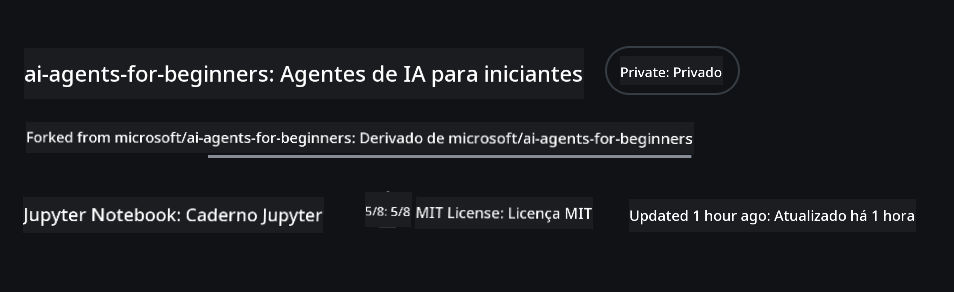
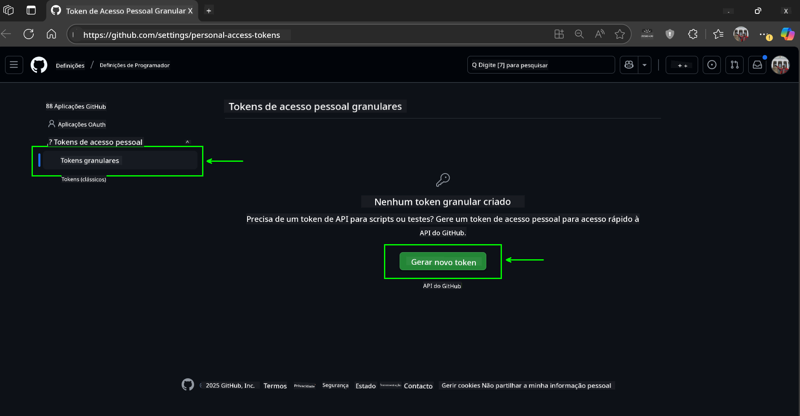
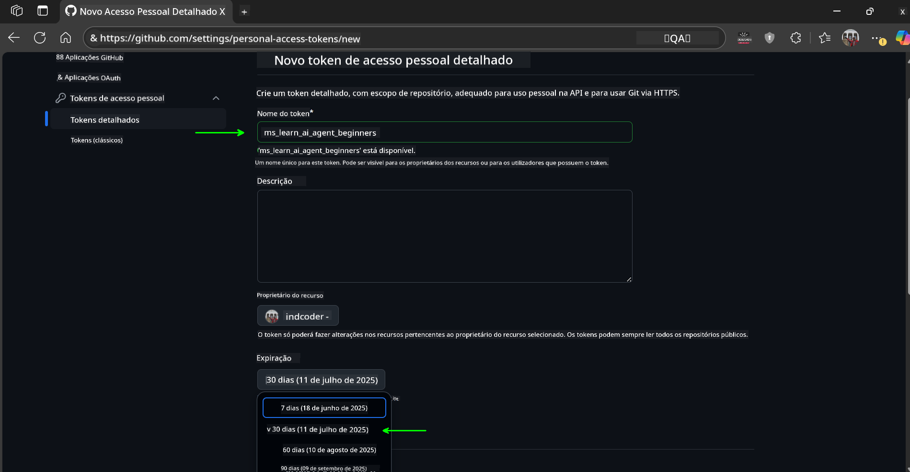
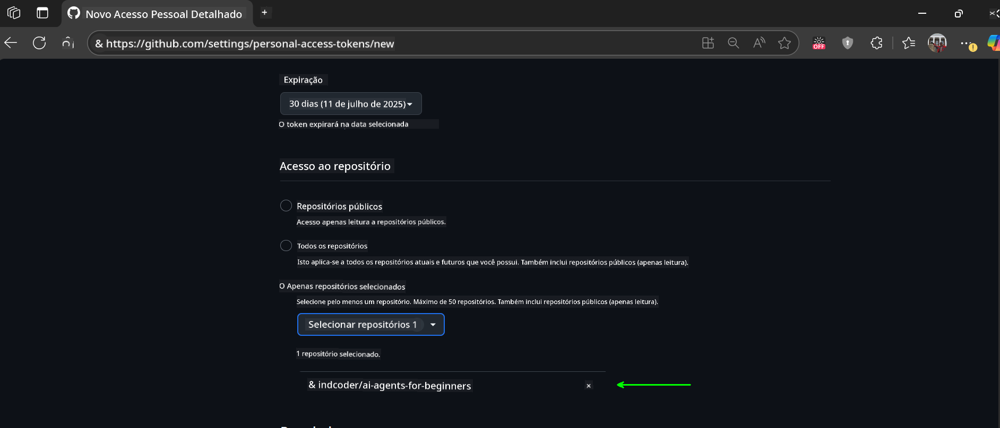
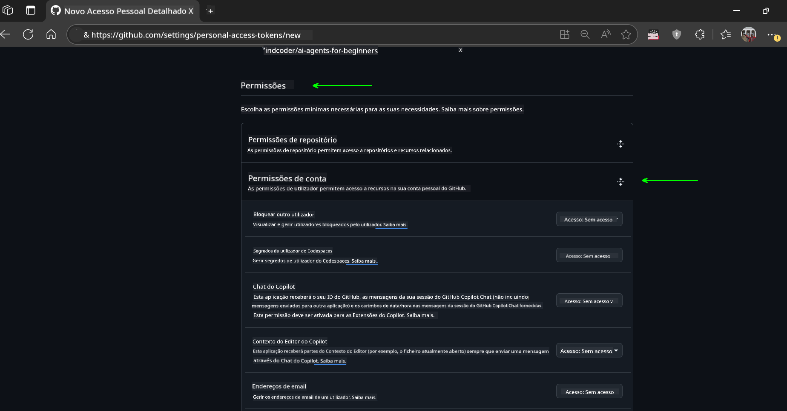
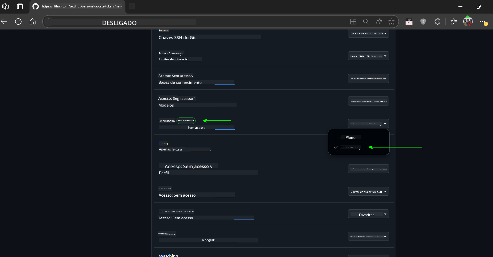
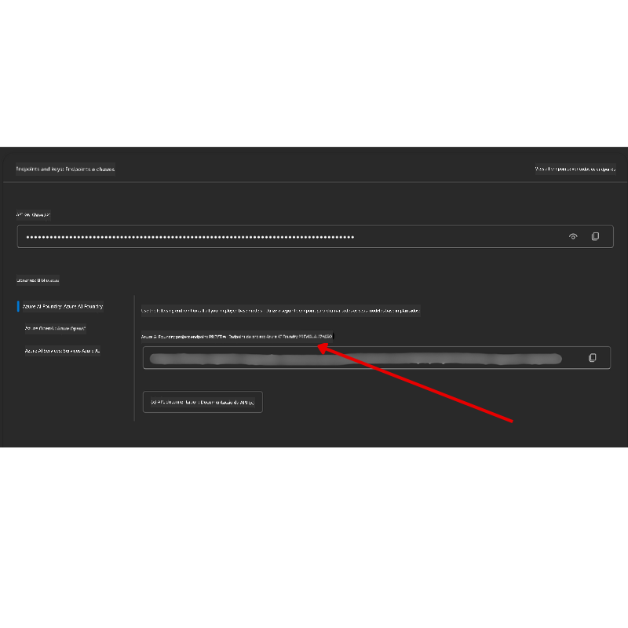

<!--
CO_OP_TRANSLATOR_METADATA:
{
  "original_hash": "c6a79c8f2b56a80370ff7e447765524f",
  "translation_date": "2025-07-23T08:36:21+00:00",
  "source_file": "00-course-setup/README.md",
  "language_code": "pt"
}
-->
# Configuração do Curso

## Introdução

Esta lição abordará como executar os exemplos de código deste curso.

## Clonar ou Fazer Fork deste Repositório

Para começar, clone ou faça um fork do repositório GitHub. Isso criará a sua própria versão do material do curso, permitindo que você execute, teste e ajuste o código!

Isso pode ser feito clicando no link para

Você deve agora ter a sua própria versão forkada deste curso no seguinte link:



## Executando o Código

Este curso oferece uma série de Jupyter Notebooks que você pode executar para obter experiência prática na construção de Agentes de IA.

Os exemplos de código utilizam:

**Requer Conta GitHub - Gratuita**:

1) Semantic Kernel Agent Framework + GitHub Models Marketplace. Identificado como (semantic-kernel.ipynb)  
2) AutoGen Framework + GitHub Models Marketplace. Identificado como (autogen.ipynb)  

**Requer Subscrição Azure**:  
3) Azure AI Foundry + Azure AI Agent Service. Identificado como (azureaiagent.ipynb)  

Recomendamos que experimente os três tipos de exemplos para ver qual funciona melhor para si.

A opção que escolher determinará quais os passos de configuração que precisará seguir abaixo:

## Requisitos

- Python 3.12+  
  - **NOTA**: Se não tiver o Python 3.12 instalado, certifique-se de instalá-lo. Depois, crie o seu ambiente virtual (venv) usando python3.12 para garantir que as versões corretas sejam instaladas a partir do ficheiro requirements.txt.  
- Conta GitHub - Para acesso ao GitHub Models Marketplace  
- Subscrição Azure - Para acesso ao Azure AI Foundry  
- Conta Azure AI Foundry - Para acesso ao Azure AI Agent Service  

Incluímos um ficheiro `requirements.txt` na raiz deste repositório que contém todos os pacotes Python necessários para executar os exemplos de código.

Pode instalá-los executando o seguinte comando no terminal na raiz do repositório:

```bash
pip install -r requirements.txt
```

Recomendamos criar um ambiente virtual Python para evitar conflitos e problemas.

## Configurar o VSCode

Certifique-se de que está a usar a versão correta do Python no VSCode.


## Configuração para Exemplos usando GitHub Models

### Passo 1: Obter o seu GitHub Personal Access Token (PAT)

Este curso utiliza o GitHub Models Marketplace, que fornece acesso gratuito a Modelos de Linguagem de Grande Escala (LLMs) que usará para construir Agentes de IA.

Para usar os GitHub Models, precisará criar um [GitHub Personal Access Token](https://docs.github.com/en/authentication/keeping-your-account-and-data-secure/managing-your-personal-access-tokens).

Isto pode ser feito acedendo à sua conta GitHub.

Por favor, siga o [Princípio do Menor Privilégio](https://docs.github.com/en/get-started/learning-to-code/storing-your-secrets-safely) ao criar o seu token. Isto significa que deve dar ao token apenas as permissões necessárias para executar os exemplos de código deste curso.

1. Selecione a opção `Fine-grained tokens` no lado esquerdo do ecrã.

    Depois, selecione `Generate new token`.

    

1. Insira um nome descritivo para o seu token que reflita o seu propósito, tornando-o fácil de identificar mais tarde. Defina uma data de expiração (recomendado: 30 dias; pode escolher um período mais curto, como 7 dias, se preferir uma postura mais segura).

    

1. Limite o escopo do token ao seu fork deste repositório.

    

1. Restrinja as permissões do token: Em **Permissions**, ative **Account Permissions**, navegue até **Models** e habilite apenas o acesso de leitura necessário para os GitHub Models.

    

    

Copie o novo token que acabou de criar. Agora, adicione-o ao ficheiro `.env` incluído neste curso.

### Passo 2: Criar o seu ficheiro `.env`

Para criar o seu ficheiro `.env`, execute o seguinte comando no terminal.

```bash
cp .env.example .env
```

Isto copiará o ficheiro de exemplo e criará um `.env` no seu diretório, onde preencherá os valores das variáveis de ambiente.

Com o token copiado, abra o ficheiro `.env` no seu editor de texto favorito e cole o token no campo `GITHUB_TOKEN`.

Agora deve conseguir executar os exemplos de código deste curso.

## Configuração para Exemplos usando Azure AI Foundry e Azure AI Agent Service

### Passo 1: Obter o Endpoint do seu Projeto Azure

Siga os passos para criar um hub e projeto no Azure AI Foundry descritos aqui: [Hub resources overview](https://learn.microsoft.com/en-us/azure/ai-foundry/concepts/ai-resources)

Depois de criar o seu projeto, precisará obter a string de conexão do projeto.

Isto pode ser feito acedendo à página **Overview** do seu projeto no portal Azure AI Foundry.



### Passo 2: Criar o seu ficheiro `.env`

Para criar o seu ficheiro `.env`, execute o seguinte comando no terminal.

```bash
cp .env.example .env
```

Isto copiará o ficheiro de exemplo e criará um `.env` no seu diretório, onde preencherá os valores das variáveis de ambiente.

Com o token copiado, abra o ficheiro `.env` no seu editor de texto favorito e cole o token no campo `PROJECT_ENDPOINT`.

### Passo 3: Iniciar sessão no Azure

Como uma prática recomendada de segurança, utilizaremos [autenticação sem chave](https://learn.microsoft.com/azure/developer/ai/keyless-connections?tabs=csharp%2Cazure-cli?WT.mc_id=academic-105485-koreyst) para autenticar no Azure OpenAI com o Microsoft Entra ID.

Em seguida, abra um terminal e execute `az login --use-device-code` para iniciar sessão na sua conta Azure.

Depois de iniciar sessão, selecione a sua subscrição no terminal.

## Variáveis de Ambiente Adicionais - Azure Search e Azure OpenAI

Para a lição Agentic RAG - Lição 5 - existem exemplos que utilizam Azure Search e Azure OpenAI.

Se quiser executar estes exemplos, precisará adicionar as seguintes variáveis de ambiente ao seu ficheiro `.env`:

### Página de Resumo (Projeto)

- `AZURE_SUBSCRIPTION_ID` - Verifique **Project details** na página **Overview** do seu projeto.

- `AZURE_AI_PROJECT_NAME` - Consulte o topo da página **Overview** do seu projeto.

- `AZURE_OPENAI_SERVICE` - Encontre isto no separador **Included capabilities** para **Azure OpenAI Service** na página **Overview**.

### Centro de Gestão

- `AZURE_OPENAI_RESOURCE_GROUP` - Aceda a **Project properties** na página **Overview** do **Management Center**.

- `GLOBAL_LLM_SERVICE` - Em **Connected resources**, encontre o nome da conexão **Azure AI Services**. Se não estiver listado, verifique o **Azure portal** no seu grupo de recursos para o nome do recurso AI Services.

### Página de Modelos + Endpoints

- `AZURE_OPENAI_EMBEDDING_DEPLOYMENT_NAME` - Selecione o seu modelo de embedding (por exemplo, `text-embedding-ada-002`) e anote o **Deployment name** nos detalhes do modelo.

- `AZURE_OPENAI_CHAT_DEPLOYMENT_NAME` - Selecione o seu modelo de chat (por exemplo, `gpt-4o-mini`) e anote o **Deployment name** nos detalhes do modelo.

### Portal Azure

- `AZURE_OPENAI_ENDPOINT` - Procure por **Azure AI services**, clique nele, depois vá para **Resource Management**, **Keys and Endpoint**, desça até "Azure OpenAI endpoints" e copie o que diz "Language APIs".

- `AZURE_OPENAI_API_KEY` - Na mesma tela, copie a CHAVE 1 ou CHAVE 2.

- `AZURE_SEARCH_SERVICE_ENDPOINT` - Encontre o seu recurso **Azure AI Search**, clique nele e veja **Overview**.

- `AZURE_SEARCH_API_KEY` - Depois vá para **Settings** e depois **Keys** para copiar a chave de administrador primária ou secundária.

### Página Externa

- `AZURE_OPENAI_API_VERSION` - Visite a página [API version lifecycle](https://learn.microsoft.com/en-us/azure/ai-services/openai/api-version-deprecation#latest-ga-api-release) em **Latest GA API release**.

### Configurar autenticação sem chave

Em vez de codificar as suas credenciais, utilizaremos uma conexão sem chave com o Azure OpenAI. Para isso, importaremos `DefaultAzureCredential` e mais tarde chamaremos a função `DefaultAzureCredential` para obter a credencial.

```python
from azure.identity import DefaultAzureCredential, InteractiveBrowserCredential
```

## Com Problemas?

Se tiver algum problema ao executar esta configuração, entre no nosso

## Próxima Lição

Agora está pronto para executar o código deste curso. Divirta-se aprendendo mais sobre o mundo dos Agentes de IA!

[Introdução aos Agentes de IA e Casos de Uso de Agentes](../01-intro-to-ai-agents/README.md)

**Aviso Legal**:  
Este documento foi traduzido utilizando o serviço de tradução por IA [Co-op Translator](https://github.com/Azure/co-op-translator). Embora nos esforcemos pela precisão, esteja ciente de que traduções automáticas podem conter erros ou imprecisões. O documento original na sua língua nativa deve ser considerado a fonte autoritária. Para informações críticas, recomenda-se a tradução profissional realizada por humanos. Não nos responsabilizamos por quaisquer mal-entendidos ou interpretações incorretas decorrentes do uso desta tradução.