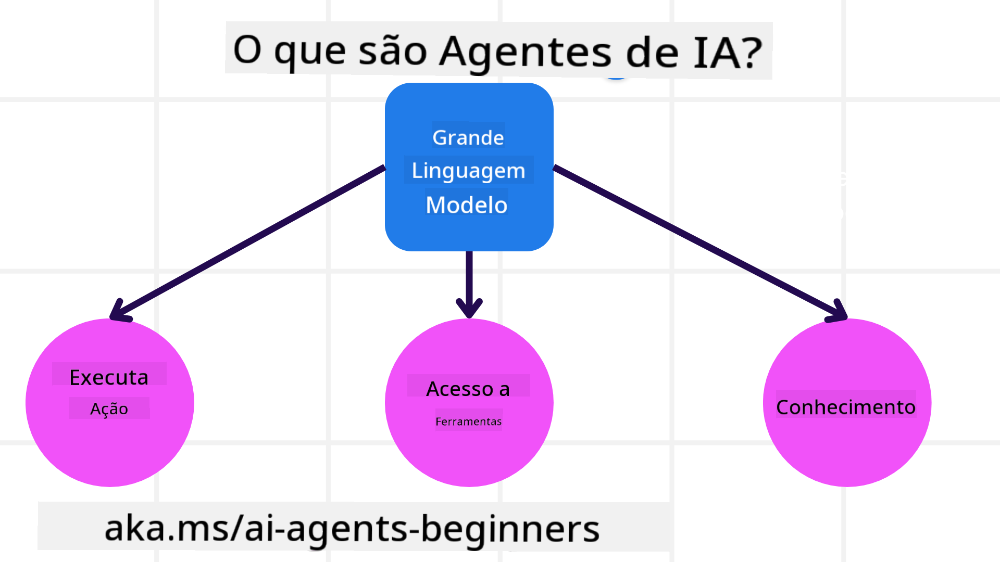
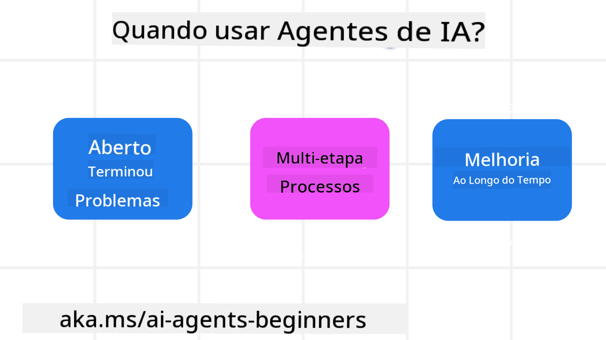

<!--
CO_OP_TRANSLATOR_METADATA:
{
  "original_hash": "d84943abc8f001ad4670418d32c2d899",
  "translation_date": "2025-07-12T08:05:35+00:00",
  "source_file": "01-intro-to-ai-agents/README.md",
  "language_code": "pt"
}
-->
para conhecer outros aprendizes e construtores de Agentes de IA e esclarecer quaisquer dúvidas que tenha sobre este curso.

Para começar este curso, iniciamos por compreender melhor o que são Agentes de IA e como podemos usá-los nas aplicações e fluxos de trabalho que construímos.

## Introdução

Esta lição aborda:

- O que são Agentes de IA e quais os diferentes tipos de agentes?
- Quais os casos de uso mais adequados para Agentes de IA e como podem ajudar-nos?
- Quais os blocos básicos na conceção de Soluções Agenticas?

## Objetivos de Aprendizagem
Após completar esta lição, deverá ser capaz de:

- Compreender os conceitos de Agentes de IA e como se diferenciam de outras soluções de IA.
- Aplicar Agentes de IA da forma mais eficiente.
- Projetar soluções Agenticas de forma produtiva para utilizadores e clientes.

## Definição de Agentes de IA e Tipos de Agentes de IA

### O que são Agentes de IA?

Agentes de IA são **sistemas** que permitem aos **Modelos de Linguagem de Grande Escala (LLMs)** **executar ações** ao expandir as suas capacidades, dando aos LLMs **acesso a ferramentas** e **conhecimento**.

Vamos decompor esta definição em partes menores:

- **Sistema** - É importante pensar nos agentes não como um único componente, mas como um sistema composto por vários componentes. Ao nível básico, os componentes de um Agente de IA são:
  - **Ambiente** - O espaço definido onde o Agente de IA opera. Por exemplo, se tivermos um agente de IA para reservas de viagens, o ambiente pode ser o sistema de reservas de viagens que o agente usa para completar tarefas.
  - **Sensores** - Os ambientes contêm informação e fornecem feedback. Os Agentes de IA usam sensores para recolher e interpretar esta informação sobre o estado atual do ambiente. No exemplo do agente de reservas, o sistema pode fornecer informações como a disponibilidade de hotéis ou preços de voos.
  - **Atuadores** - Depois de o agente receber o estado atual do ambiente, para a tarefa em curso, o agente determina que ação executar para alterar o ambiente. No caso do agente de reservas, pode ser reservar um quarto disponível para o utilizador.

**Modelos de Linguagem de Grande Escala** - O conceito de agentes existia antes da criação dos LLMs. A vantagem de construir Agentes de IA com LLMs é a sua capacidade de interpretar a linguagem humana e dados. Esta capacidade permite aos LLMs interpretar a informação do ambiente e definir um plano para alterar o ambiente.

**Executar Ações** - Fora dos sistemas de Agentes de IA, os LLMs estão limitados a situações onde a ação é gerar conteúdo ou informação com base no pedido do utilizador. Dentro dos sistemas de Agentes de IA, os LLMs podem realizar tarefas interpretando o pedido do utilizador e usando ferramentas disponíveis no seu ambiente.

**Acesso a Ferramentas** - As ferramentas a que o LLM tem acesso são definidas por 1) o ambiente onde opera e 2) o programador do Agente de IA. No exemplo do agente de viagens, as ferramentas do agente são limitadas pelas operações disponíveis no sistema de reservas, e/ou o programador pode restringir o acesso do agente a ferramentas relacionadas apenas com voos.

**Memória+Conhecimento** - A memória pode ser de curto prazo no contexto da conversa entre o utilizador e o agente. A longo prazo, para além da informação fornecida pelo ambiente, os Agentes de IA podem também recuperar conhecimento de outros sistemas, serviços, ferramentas e até outros agentes. No exemplo do agente de viagens, este conhecimento pode ser a informação sobre as preferências de viagem do utilizador armazenada numa base de dados de clientes.

### Os diferentes tipos de agentes

Agora que temos uma definição geral de Agentes de IA, vejamos alguns tipos específicos de agentes e como seriam aplicados a um agente de reservas de viagens.

| **Tipo de Agente**           | **Descrição**                                                                                                                       | **Exemplo**                                                                                                                                                                                                                   |
| ---------------------------- | --------------------------------------------------------------------------------------------------------------------------------- | ----------------------------------------------------------------------------------------------------------------------------------------------------------------------------------------------------------------------------- |
| **Agentes Reflexos Simples** | Executam ações imediatas baseadas em regras pré-definidas.                                                                         | O agente de viagens interpreta o contexto do email e encaminha reclamações de viagem para o serviço ao cliente.                                                                                                               |
| **Agentes Reflexos Baseados em Modelo** | Executam ações baseadas num modelo do mundo e nas alterações a esse modelo.                                                      | O agente de viagens prioriza rotas com alterações significativas de preço com base no acesso a dados históricos de preços.                                                                                                     |
| **Agentes Baseados em Objetivos** | Criam planos para atingir objetivos específicos, interpretando o objetivo e determinando ações para o alcançar.                  | O agente de viagens reserva uma viagem determinando os arranjos necessários (carro, transporte público, voos) desde a localização atual até ao destino.                                                                         |
| **Agentes Baseados em Utilidade** | Consideram preferências e ponderam compensações numericamente para determinar como atingir os objetivos.                        | O agente de viagens maximiza a utilidade ao ponderar conveniência versus custo ao reservar a viagem.                                                                                                                           |
| **Agentes de Aprendizagem**  | Melhoram ao longo do tempo respondendo a feedback e ajustando as ações em conformidade.                                            | O agente de viagens melhora usando o feedback dos clientes em inquéritos pós-viagem para ajustar futuras reservas.                                                                                                            |
| **Agentes Hierárquicos**     | Apresentam múltiplos agentes num sistema em camadas, com agentes de nível superior a dividir tarefas em subtarefas para agentes de nível inferior completarem. | O agente de viagens cancela uma viagem dividindo a tarefa em subtarefas (por exemplo, cancelar reservas específicas) e tendo agentes de nível inferior a completá-las, reportando ao agente de nível superior.                   |
| **Sistemas Multi-Agente (MAS)** | Agentes completam tarefas de forma independente, cooperativa ou competitiva.                                                     | Cooperativo: Vários agentes reservam serviços específicos como hotéis, voos e entretenimento. Competitivo: Vários agentes gerem e competem por um calendário partilhado de reservas de hotel para alojar clientes.               |

## Quando Usar Agentes de IA

Na secção anterior, usamos o caso de uso do agente de viagens para explicar como os diferentes tipos de agentes podem ser usados em diferentes cenários de reserva de viagens. Continuaremos a usar esta aplicação ao longo do curso.

Vamos ver os tipos de casos de uso para os quais os Agentes de IA são mais indicados:

- **Problemas Abertos** - permitindo que o LLM determine os passos necessários para completar uma tarefa, pois nem sempre pode ser codificado diretamente num fluxo de trabalho.
- **Processos em Várias Etapas** - tarefas que requerem um nível de complexidade em que o Agente de IA precisa usar ferramentas ou informação ao longo de várias interações, em vez de uma única consulta.
- **Melhoria ao Longo do Tempo** - tarefas onde o agente pode melhorar ao longo do tempo ao receber feedback do ambiente ou dos utilizadores para fornecer melhor utilidade.

Abordamos mais considerações sobre o uso de Agentes de IA na lição Construir Agentes de IA Confiáveis.

## Noções Básicas de Soluções Agenticas

### Desenvolvimento de Agentes

O primeiro passo na conceção de um sistema de Agente de IA é definir as ferramentas, ações e comportamentos. Neste curso, focamo-nos no uso do **Azure AI Agent Service** para definir os nossos Agentes. Este serviço oferece funcionalidades como:

- Seleção de Modelos Abertos como OpenAI, Mistral e Llama
- Uso de Dados Licenciados através de fornecedores como Tripadvisor
- Uso de ferramentas OpenAPI 3.0 padronizadas

### Padrões Agenticos

A comunicação com LLMs é feita através de prompts. Dada a natureza semi-autónoma dos Agentes de IA, nem sempre é possível ou necessário reemitir prompts manualmente ao LLM após uma alteração no ambiente. Usamos **Padrões Agenticos** que nos permitem promptar o LLM ao longo de múltiplas etapas de forma mais escalável.

Este curso está dividido em alguns dos padrões Agenticos mais populares atualmente.

### Frameworks Agenticos

Os Frameworks Agenticos permitem aos programadores implementar padrões agenticos através de código. Estes frameworks oferecem templates, plugins e ferramentas para melhor colaboração entre Agentes de IA. Estes benefícios proporcionam melhores capacidades de observação e resolução de problemas em sistemas de Agentes de IA.

Neste curso, exploraremos o framework AutoGen, orientado para investigação, e o framework Agent, pronto para produção, da Semantic Kernel.

## Lição Anterior

[Configuração do Curso](../00-course-setup/README.md)

## Próxima Lição

[Explorar Frameworks Agenticos](../02-explore-agentic-frameworks/README.md)

**Aviso Legal**:  
Este documento foi traduzido utilizando o serviço de tradução automática [Co-op Translator](https://github.com/Azure/co-op-translator). Embora nos esforcemos pela precisão, por favor tenha em conta que traduções automáticas podem conter erros ou imprecisões. O documento original na sua língua nativa deve ser considerado a fonte autorizada. Para informações críticas, recomenda-se tradução profissional humana. Não nos responsabilizamos por quaisquer mal-entendidos ou interpretações erradas decorrentes da utilização desta tradução.