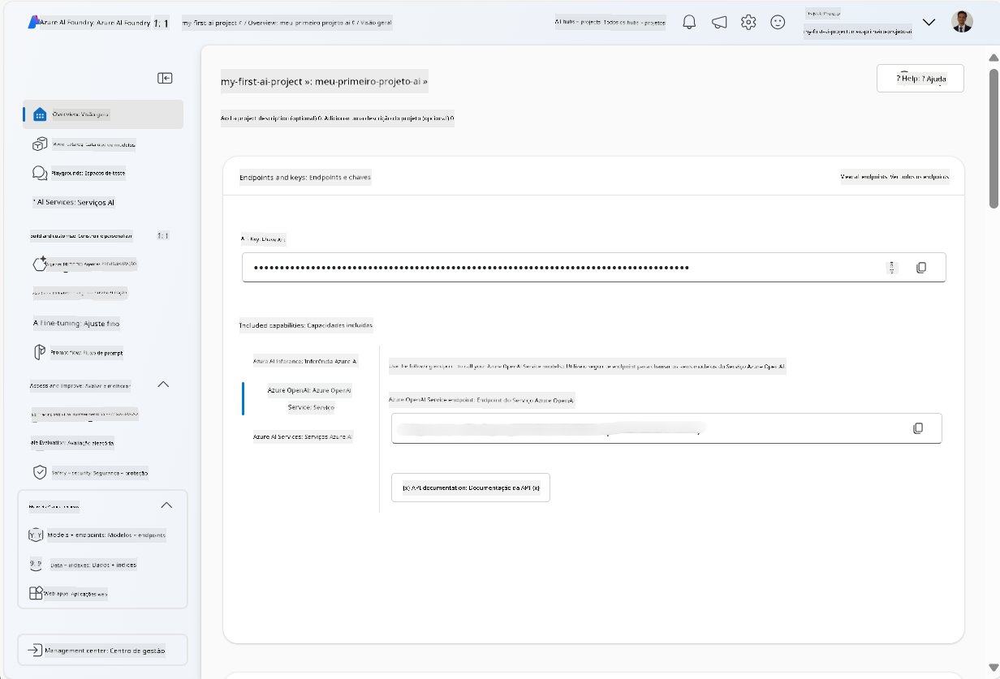
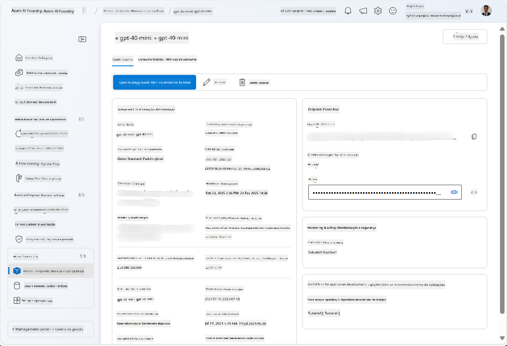
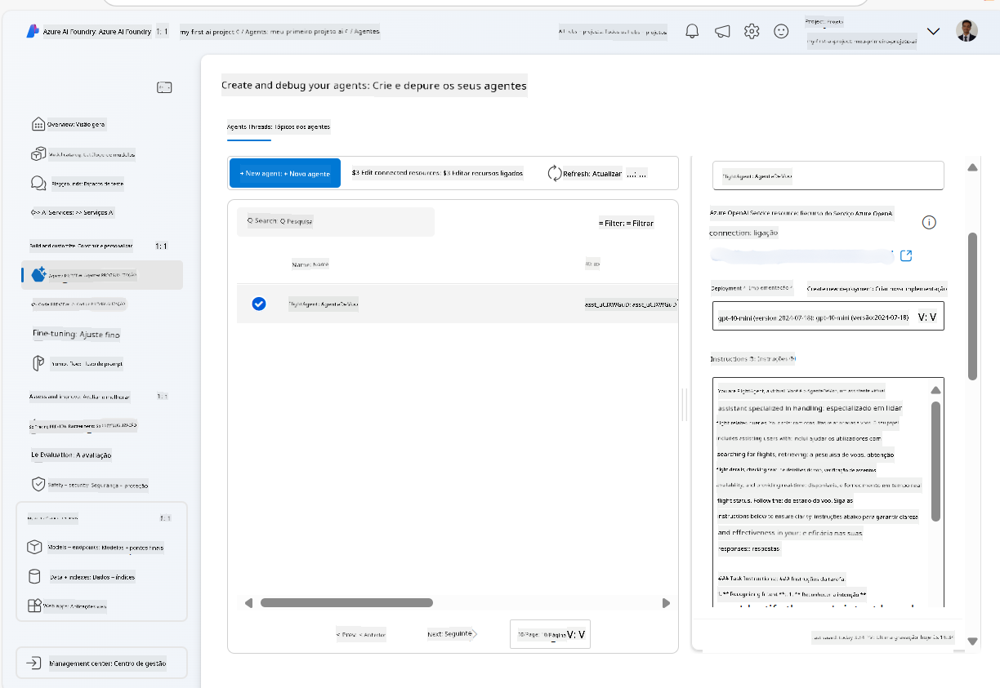
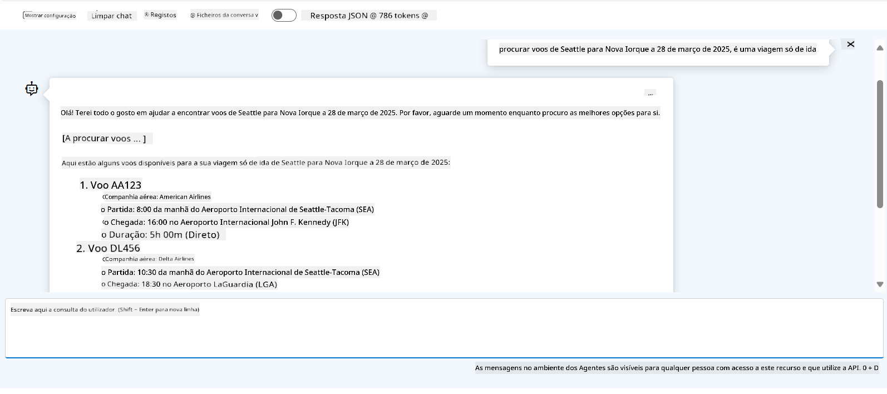

<!--
CO_OP_TRANSLATOR_METADATA:
{
  "original_hash": "7e92870dc0843e13d4dabc620c09d2d9",
  "translation_date": "2025-07-12T08:18:15+00:00",
  "source_file": "02-explore-agentic-frameworks/azure-ai-foundry-agent-creation.md",
  "language_code": "pt"
}
-->
# Desenvolvimento do Serviço Azure AI Agent

Neste exercício, irá utilizar as ferramentas do serviço Azure AI Agent no [portal Azure AI Foundry](https://ai.azure.com/?WT.mc_id=academic-105485-koreyst) para criar um agente para Reserva de Voos. O agente será capaz de interagir com os utilizadores e fornecer informações sobre voos.

## Pré-requisitos

Para completar este exercício, precisa do seguinte:
1. Uma conta Azure com uma subscrição ativa. [Crie uma conta gratuitamente](https://azure.microsoft.com/free/?WT.mc_id=academic-105485-koreyst).
2. Precisa de permissões para criar um hub Azure AI Foundry ou que um seja criado para si.
    - Se o seu papel for Contribuidor ou Proprietário, pode seguir os passos deste tutorial.

## Criar um hub Azure AI Foundry

> **Note:** O Azure AI Foundry era anteriormente conhecido como Azure AI Studio.

1. Siga estas orientações do [post do blog Azure AI Foundry](https://learn.microsoft.com/en-us/azure/ai-studio/?WT.mc_id=academic-105485-koreyst) para criar um hub Azure AI Foundry.
2. Quando o seu projeto for criado, feche quaisquer dicas que apareçam e reveja a página do projeto no portal Azure AI Foundry, que deverá ser semelhante à imagem seguinte:

    

## Implementar um modelo

1. No painel à esquerda do seu projeto, na secção **My assets**, selecione a página **Models + endpoints**.
2. Na página **Models + endpoints**, no separador **Model deployments**, no menu **+ Deploy model**, selecione **Deploy base model**.
3. Procure o modelo `gpt-4o-mini` na lista, selecione-o e confirme.

    > **Note**: Reduzir o TPM ajuda a evitar o uso excessivo da quota disponível na subscrição que está a utilizar.

    

## Criar um agente

Agora que implementou um modelo, pode criar um agente. Um agente é um modelo de IA conversacional que pode ser usado para interagir com os utilizadores.

1. No painel à esquerda do seu projeto, na secção **Build & Customize**, selecione a página **Agents**.
2. Clique em **+ Create agent** para criar um novo agente. Na caixa de diálogo **Agent Setup**:
    - Introduza um nome para o agente, como `FlightAgent`.
    - Certifique-se de que a implementação do modelo `gpt-4o-mini` que criou anteriormente está selecionada.
    - Defina as **Instructions** conforme o prompt que pretende que o agente siga. Aqui está um exemplo:
    ```
    You are FlightAgent, a virtual assistant specialized in handling flight-related queries. Your role includes assisting users with searching for flights, retrieving flight details, checking seat availability, and providing real-time flight status. Follow the instructions below to ensure clarity and effectiveness in your responses:

    ### Task Instructions:
    1. **Recognizing Intent**:
       - Identify the user's intent based on their request, focusing on one of the following categories:
         - Searching for flights
         - Retrieving flight details using a flight ID
         - Checking seat availability for a specified flight
         - Providing real-time flight status using a flight number
       - If the intent is unclear, politely ask users to clarify or provide more details.
        
    2. **Processing Requests**:
        - Depending on the identified intent, perform the required task:
        - For flight searches: Request details such as origin, destination, departure date, and optionally return date.
        - For flight details: Request a valid flight ID.
        - For seat availability: Request the flight ID and date and validate inputs.
        - For flight status: Request a valid flight number.
        - Perform validations on provided data (e.g., formats of dates, flight numbers, or IDs). If the information is incomplete or invalid, return a friendly request for clarification.

    3. **Generating Responses**:
    - Use a tone that is friendly, concise, and supportive.
    - Provide clear and actionable suggestions based on the output of each task.
    - If no data is found or an error occurs, explain it to the user gently and offer alternative actions (e.g., refine search, try another query).
    
    ```
> [!NOTE]
> Para um prompt mais detalhado, pode consultar [este repositório](https://github.com/ShivamGoyal03/RoamMind) para mais informações.
    
> Além disso, pode adicionar uma **Knowledge Base** e **Actions** para melhorar as capacidades do agente, permitindo fornecer mais informações e executar tarefas automatizadas com base nos pedidos dos utilizadores. Para este exercício, pode ignorar estes passos.
    


3. Para criar um novo agente multi-IA, basta clicar em **New Agent**. O agente recém-criado será então exibido na página Agents.

## Testar o agente

Depois de criar o agente, pode testá-lo para ver como responde às perguntas dos utilizadores no playground do portal Azure AI Foundry.

1. No topo do painel **Setup** do seu agente, selecione **Try in playground**.
2. No painel **Playground**, pode interagir com o agente escrevendo perguntas na janela de chat. Por exemplo, pode pedir ao agente para procurar voos de Seattle para Nova Iorque no dia 28.

    > **Note**: O agente pode não fornecer respostas precisas, pois não está a ser usado nenhum dado em tempo real neste exercício. O objetivo é testar a capacidade do agente de compreender e responder às perguntas dos utilizadores com base nas instruções fornecidas.

    

3. Após testar o agente, pode personalizá-lo ainda mais adicionando mais intenções, dados de treino e ações para melhorar as suas capacidades.

## Limpar recursos

Quando terminar de testar o agente, pode eliminá-lo para evitar custos adicionais.
1. Abra o [portal Azure](https://portal.azure.com) e visualize o conteúdo do grupo de recursos onde implementou os recursos do hub usados neste exercício.
2. Na barra de ferramentas, selecione **Delete resource group**.
3. Introduza o nome do grupo de recursos e confirme que pretende eliminá-lo.

## Recursos

- [Documentação Azure AI Foundry](https://learn.microsoft.com/en-us/azure/ai-studio/?WT.mc_id=academic-105485-koreyst)
- [Portal Azure AI Foundry](https://ai.azure.com/?WT.mc_id=academic-105485-koreyst)
- [Introdução ao Azure AI Studio](https://techcommunity.microsoft.com/blog/educatordeveloperblog/getting-started-with-azure-ai-studio/4095602?WT.mc_id=academic-105485-koreyst)
- [Fundamentos dos agentes de IA na Azure](https://learn.microsoft.com/en-us/training/modules/ai-agent-fundamentals/?WT.mc_id=academic-105485-koreyst)
- [Azure AI Discord](https://aka.ms/AzureAI/Discord)

**Aviso Legal**:  
Este documento foi traduzido utilizando o serviço de tradução automática [Co-op Translator](https://github.com/Azure/co-op-translator). Embora nos esforcemos pela precisão, por favor tenha em conta que traduções automáticas podem conter erros ou imprecisões. O documento original na sua língua nativa deve ser considerado a fonte autorizada. Para informações críticas, recomenda-se tradução profissional humana. Não nos responsabilizamos por quaisquer mal-entendidos ou interpretações incorretas decorrentes da utilização desta tradução.