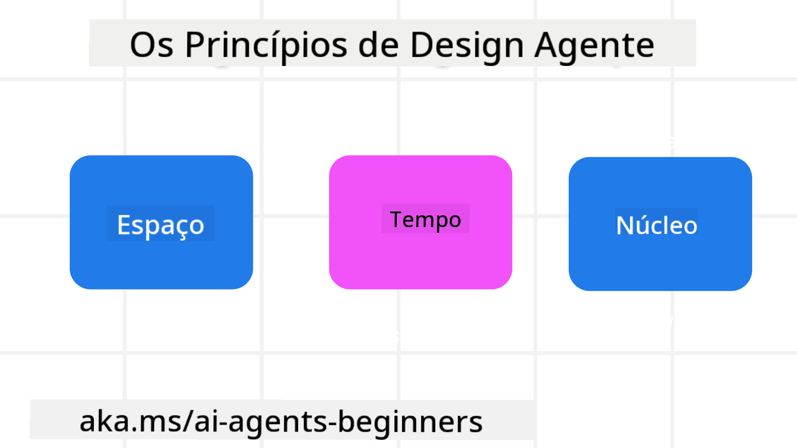

<!--
CO_OP_TRANSLATOR_METADATA:
{
  "original_hash": "4c46e4ff9e349c521e2b0b17f51afa64",
  "translation_date": "2025-08-30T14:16:00+00:00",
  "source_file": "03-agentic-design-patterns/README.md",
  "language_code": "pt"
}
-->

> _(Clique na imagem acima para ver o vídeo desta lição)_
# Princípios de Design de Agentes de IA

## Introdução

Existem várias formas de pensar na construção de Sistemas de Agentes de IA. Dado que a ambiguidade é uma característica e não um defeito no design de IA Generativa, por vezes é difícil para os engenheiros saberem por onde começar. Criámos um conjunto de Princípios de Design centrados no utilizador para permitir que os programadores construam sistemas de agentes centrados no cliente para responder às suas necessidades empresariais. Estes princípios de design não são uma arquitetura prescritiva, mas sim um ponto de partida para equipas que estão a definir e a construir experiências de agentes.

De forma geral, os agentes devem:

- Ampliar e escalar as capacidades humanas (brainstorming, resolução de problemas, automação, etc.)
- Preencher lacunas de conhecimento (atualizar-me sobre domínios de conhecimento, tradução, etc.)
- Facilitar e apoiar a colaboração nas formas como preferimos trabalhar com outros
- Tornar-nos melhores versões de nós mesmos (ex.: coach de vida/gestor de tarefas, ajudar-nos a aprender competências de regulação emocional e mindfulness, construir resiliência, etc.)

## Esta Lição Vai Abranger

- O que são os Princípios de Design de Agentes
- Quais são algumas diretrizes a seguir ao implementar estes princípios de design
- Exemplos de utilização dos princípios de design

## Objetivos de Aprendizagem

Após completar esta lição, será capaz de:

1. Explicar o que são os Princípios de Design de Agentes
2. Explicar as diretrizes para utilizar os Princípios de Design de Agentes
3. Compreender como construir um agente utilizando os Princípios de Design de Agentes

## Os Princípios de Design de Agentes

### Agente (Espaço)

Este é o ambiente no qual o agente opera. Estes princípios informam como concebemos agentes para interagir em mundos físicos e digitais.

- **Conectar, não substituir** – ajudar a conectar pessoas a outras pessoas, eventos e conhecimento acionável para permitir colaboração e conexão.
- Os agentes ajudam a conectar eventos, conhecimento e pessoas.
- Os agentes aproximam as pessoas. Não são concebidos para substituir ou diminuir as pessoas.
- **Facilmente acessível, mas ocasionalmente invisível** – o agente opera maioritariamente em segundo plano e só nos alerta quando é relevante e apropriado.
  - O agente é facilmente descoberto e acessível para utilizadores autorizados em qualquer dispositivo ou plataforma.
  - O agente suporta entradas e saídas multimodais (som, voz, texto, etc.).
  - O agente pode transitar sem problemas entre primeiro plano e segundo plano; entre proativo e reativo, dependendo da perceção das necessidades do utilizador.
  - O agente pode operar de forma invisível, mas o caminho do processo em segundo plano e a colaboração com outros agentes são transparentes e controláveis pelo utilizador.

### Agente (Tempo)

Este é o modo como o agente opera ao longo do tempo. Estes princípios informam como concebemos agentes que interagem entre passado, presente e futuro.

- **Passado**: Refletir sobre a história que inclui tanto estado como contexto.
  - O agente fornece resultados mais relevantes com base na análise de dados históricos mais ricos, para além do evento, pessoas ou estados.
  - O agente cria conexões a partir de eventos passados e reflete ativamente sobre a memória para interagir com situações atuais.
- **Agora**: Alertar mais do que notificar.
  - O agente incorpora uma abordagem abrangente para interagir com pessoas. Quando ocorre um evento, o agente vai além de notificações estáticas ou outras formalidades estáticas. O agente pode simplificar fluxos ou gerar dinamicamente pistas para direcionar a atenção do utilizador no momento certo.
  - O agente entrega informações com base no ambiente contextual, mudanças sociais e culturais e adaptadas à intenção do utilizador.
  - A interação com o agente pode ser gradual, evoluindo/crescendo em complexidade para capacitar os utilizadores a longo prazo.
- **Futuro**: Adaptar e evoluir.
  - O agente adapta-se a vários dispositivos, plataformas e modalidades.
  - O agente adapta-se ao comportamento do utilizador, às necessidades de acessibilidade e é livremente personalizável.
  - O agente é moldado e evolui através da interação contínua com o utilizador.

### Agente (Núcleo)

Estes são os elementos-chave no núcleo do design de um agente.

- **Aceitar a incerteza, mas estabelecer confiança**.
  - Um certo nível de incerteza do agente é esperado. A incerteza é um elemento-chave do design de agentes.
  - Confiança e transparência são camadas fundamentais do design de agentes.
  - Os humanos têm controlo sobre quando o agente está ligado/desligado e o estado do agente é claramente visível em todos os momentos.

## As Diretrizes para Implementar Estes Princípios

Ao utilizar os princípios de design anteriores, siga as seguintes diretrizes:

1. **Transparência**: Informe o utilizador que a IA está envolvida, como funciona (incluindo ações passadas) e como dar feedback e modificar o sistema.
2. **Controlo**: Permita que o utilizador personalize, especifique preferências e personalize, e tenha controlo sobre o sistema e os seus atributos (incluindo a capacidade de esquecer).
3. **Consistência**: Procure experiências consistentes e multimodais em dispositivos e pontos de acesso. Utilize elementos de UI/UX familiares sempre que possível (ex.: ícone de microfone para interação por voz) e reduza ao máximo a carga cognitiva do cliente (ex.: respostas concisas, ajudas visuais e conteúdo "Saiba Mais").

## Como Conceber um Agente de Viagens Utilizando Estes Princípios e Diretrizes

Imagine que está a conceber um Agente de Viagens, aqui está como poderia pensar em utilizar os Princípios de Design e Diretrizes:

1. **Transparência** – Informe o utilizador de que o Agente de Viagens é um agente habilitado por IA. Forneça algumas instruções básicas sobre como começar (ex.: uma mensagem de "Olá", exemplos de prompts). Documente claramente isto na página do produto. Mostre a lista de prompts que o utilizador pediu no passado. Torne claro como dar feedback (polegar para cima e para baixo, botão Enviar Feedback, etc.). Articule claramente se o agente tem restrições de uso ou de tópicos.
2. **Controlo** – Certifique-se de que é claro como o utilizador pode modificar o agente após este ter sido criado, com coisas como o Prompt do Sistema. Permita que o utilizador escolha o quão detalhado o agente é, o seu estilo de escrita e quaisquer restrições sobre o que o agente não deve falar. Permita que o utilizador visualize e elimine quaisquer ficheiros ou dados associados, prompts e conversas passadas.
3. **Consistência** – Certifique-se de que os ícones para Partilhar Prompt, adicionar um ficheiro ou foto e marcar alguém ou algo são padrão e reconhecíveis. Utilize o ícone de clip para indicar o upload/partilha de ficheiros com o agente e o ícone de imagem para indicar o upload de gráficos.

### Tem Mais Perguntas sobre Padrões de Design de Agentes de IA?

Junte-se ao [Azure AI Foundry Discord](https://aka.ms/ai-agents/discord) para interagir com outros aprendizes, participar em horas de atendimento e obter respostas às suas perguntas sobre Agentes de IA.

## Recursos Adicionais

## Lição Anterior

[Explorar Estruturas de Agentes](../02-explore-agentic-frameworks/README.md)

## Próxima Lição

[Padrão de Design de Utilização de Ferramentas](../04-tool-use/README.md)

---

**Aviso Legal**:  
Este documento foi traduzido utilizando o serviço de tradução por IA [Co-op Translator](https://github.com/Azure/co-op-translator). Embora nos esforcemos para garantir a precisão, esteja ciente de que traduções automáticas podem conter erros ou imprecisões. O documento original na sua língua nativa deve ser considerado a fonte oficial. Para informações críticas, recomenda-se uma tradução profissional realizada por humanos. Não nos responsabilizamos por quaisquer mal-entendidos ou interpretações incorretas resultantes do uso desta tradução.