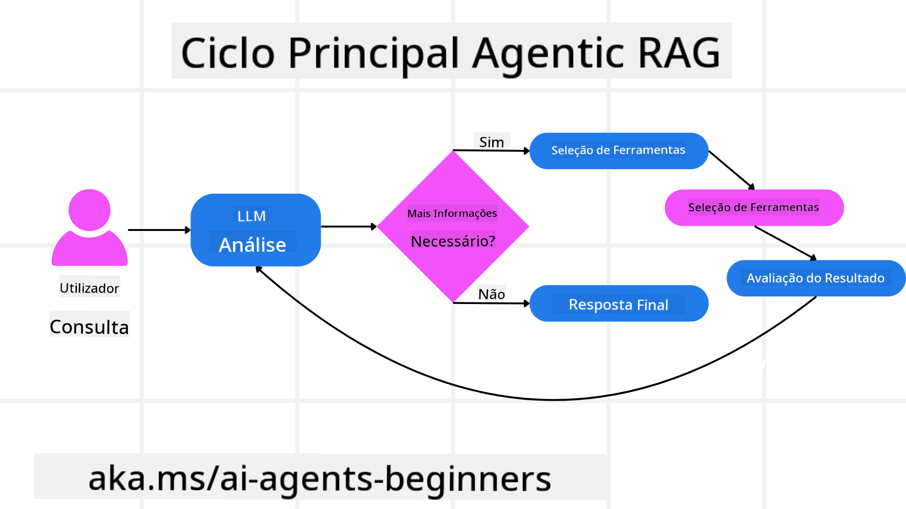
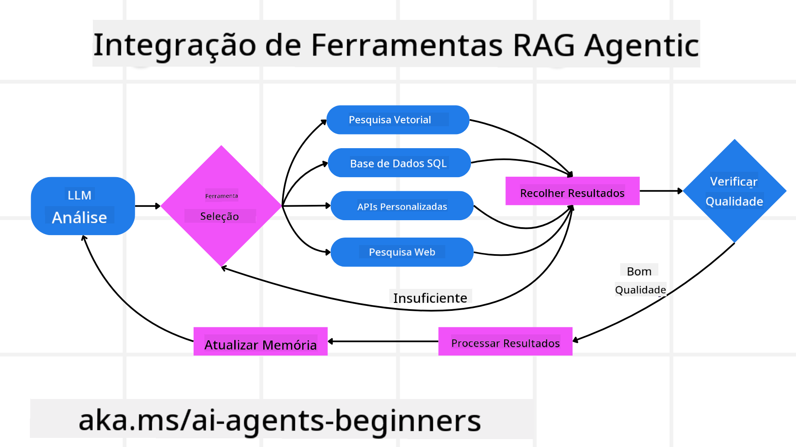
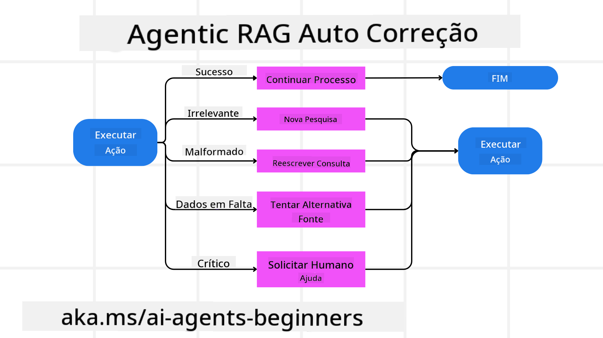
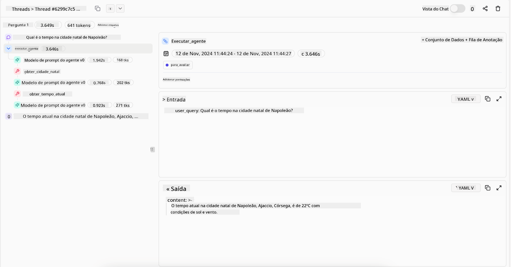
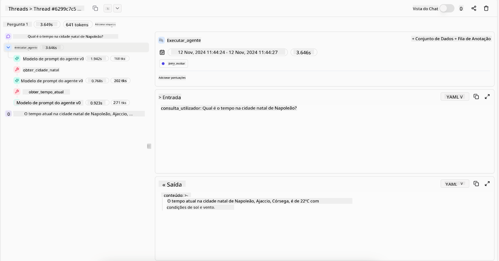

<!--
CO_OP_TRANSLATOR_METADATA:
{
  "original_hash": "7622aa72f9e676e593339f5f694ecd7d",
  "translation_date": "2025-07-12T09:59:51+00:00",
  "source_file": "05-agentic-rag/README.md",
  "language_code": "pt"
}
-->

> _(Clique na imagem acima para ver o vídeo desta lição)_

# Agentic RAG

Esta lição oferece uma visão abrangente sobre o Agentic Retrieval-Augmented Generation (Agentic RAG), um paradigma emergente de IA onde grandes modelos de linguagem (LLMs) planeiam autonomamente os seus próximos passos enquanto extraem informação de fontes externas. Ao contrário dos padrões estáticos de recuperação e leitura, o Agentic RAG envolve chamadas iterativas ao LLM, intercaladas com chamadas a ferramentas ou funções e outputs estruturados. O sistema avalia os resultados, refina as consultas, invoca ferramentas adicionais se necessário e continua este ciclo até alcançar uma solução satisfatória.

## Introdução

Esta lição irá abordar

- **Compreender o Agentic RAG:** Conhecer o paradigma emergente em IA onde grandes modelos de linguagem (LLMs) planeiam autonomamente os seus próximos passos enquanto extraem informação de fontes externas.
- **Entender o Estilo Iterativo Maker-Checker:** Compreender o ciclo de chamadas iterativas ao LLM, intercaladas com chamadas a ferramentas ou funções e outputs estruturados, desenhado para melhorar a correção e lidar com consultas malformadas.
- **Explorar Aplicações Práticas:** Identificar cenários onde o Agentic RAG se destaca, como ambientes que priorizam a correção, interações complexas com bases de dados e fluxos de trabalho prolongados.

## Objetivos de Aprendizagem

Após completar esta lição, irá saber/compreender:

- **Compreensão do Agentic RAG:** Conhecer o paradigma emergente em IA onde grandes modelos de linguagem (LLMs) planeiam autonomamente os seus próximos passos enquanto extraem informação de fontes externas.
- **Estilo Iterativo Maker-Checker:** Entender o conceito de um ciclo de chamadas iterativas ao LLM, intercaladas com chamadas a ferramentas ou funções e outputs estruturados, desenhado para melhorar a correção e lidar com consultas malformadas.
- **Assumir o Processo de Raciocínio:** Compreender a capacidade do sistema de assumir o seu processo de raciocínio, tomando decisões sobre como abordar problemas sem depender de caminhos pré-definidos.
- **Fluxo de Trabalho:** Entender como um modelo agentic decide de forma independente recuperar relatórios de tendências de mercado, identificar dados de concorrentes, correlacionar métricas internas de vendas, sintetizar conclusões e avaliar a estratégia.
- **Ciclos Iterativos, Integração de Ferramentas e Memória:** Conhecer a dependência do sistema num padrão de interação em loop, mantendo estado e memória ao longo dos passos para evitar repetições e tomar decisões informadas.
- **Gestão de Modos de Falha e Auto-Correção:** Explorar os mecanismos robustos de auto-correção do sistema, incluindo iteração e reconsulta, uso de ferramentas de diagnóstico e recurso à supervisão humana.
- **Limites da Agência:** Compreender as limitações do Agentic RAG, focando na autonomia específica do domínio, dependência da infraestrutura e respeito pelas regras de segurança.
- **Casos Práticos e Valor:** Identificar cenários onde o Agentic RAG se destaca, como ambientes que priorizam a correção, interações complexas com bases de dados e fluxos de trabalho prolongados.
- **Governança, Transparência e Confiança:** Conhecer a importância da governança e transparência, incluindo raciocínio explicável, controlo de viés e supervisão humana.

## O que é Agentic RAG?

Agentic Retrieval-Augmented Generation (Agentic RAG) é um paradigma emergente de IA onde grandes modelos de linguagem (LLMs) planeiam autonomamente os seus próximos passos enquanto extraem informação de fontes externas. Ao contrário dos padrões estáticos de recuperação e leitura, o Agentic RAG envolve chamadas iterativas ao LLM, intercaladas com chamadas a ferramentas ou funções e outputs estruturados. O sistema avalia os resultados, refina as consultas, invoca ferramentas adicionais se necessário e continua este ciclo até alcançar uma solução satisfatória. Este estilo iterativo “maker-checker” melhora a correção, lida com consultas malformadas e assegura resultados de alta qualidade.

O sistema assume ativamente o seu processo de raciocínio, reescrevendo consultas falhadas, escolhendo diferentes métodos de recuperação e integrando múltiplas ferramentas — como pesquisa vetorial no Azure AI Search, bases de dados SQL ou APIs personalizadas — antes de finalizar a resposta. A qualidade distintiva de um sistema agentic é a sua capacidade de assumir o seu processo de raciocínio. Implementações tradicionais de RAG dependem de caminhos pré-definidos, mas um sistema agentic determina autonomamente a sequência de passos com base na qualidade da informação que encontra.

## Definição de Agentic Retrieval-Augmented Generation (Agentic RAG)

Agentic Retrieval-Augmented Generation (Agentic RAG) é um paradigma emergente no desenvolvimento de IA onde os LLMs não só extraem informação de fontes externas, como também planeiam autonomamente os seus próximos passos. Ao contrário dos padrões estáticos de recuperação e leitura ou sequências cuidadosamente escritas de prompts, o Agentic RAG envolve um ciclo de chamadas iterativas ao LLM, intercaladas com chamadas a ferramentas ou funções e outputs estruturados. A cada passo, o sistema avalia os resultados obtidos, decide se deve refinar as consultas, invoca ferramentas adicionais se necessário e continua este ciclo até alcançar uma solução satisfatória.

Este estilo iterativo “maker-checker” é desenhado para melhorar a correção, lidar com consultas malformadas a bases de dados estruturadas (ex. NL2SQL) e garantir resultados equilibrados e de alta qualidade. Em vez de depender apenas de cadeias de prompts cuidadosamente elaboradas, o sistema assume ativamente o seu processo de raciocínio. Pode reescrever consultas que falham, escolher diferentes métodos de recuperação e integrar múltiplas ferramentas — como pesquisa vetorial no Azure AI Search, bases de dados SQL ou APIs personalizadas — antes de finalizar a resposta. Isto elimina a necessidade de frameworks de orquestração excessivamente complexos. Em vez disso, um ciclo relativamente simples de “chamada LLM → uso de ferramenta → chamada LLM → …” pode produzir outputs sofisticados e bem fundamentados.

## Assumir o Processo de Raciocínio

A qualidade distintiva que torna um sistema “agentic” é a sua capacidade de assumir o seu processo de raciocínio. Implementações tradicionais de RAG dependem frequentemente de humanos a pré-definir um caminho para o modelo: uma cadeia de pensamento que indica o que recuperar e quando.  
Mas quando um sistema é verdadeiramente agentic, decide internamente como abordar o problema. Não está apenas a executar um script; está a determinar autonomamente a sequência de passos com base na qualidade da informação que encontra.  
Por exemplo, se lhe for pedido para criar uma estratégia de lançamento de produto, não depende apenas de um prompt que descreva todo o fluxo de pesquisa e tomada de decisão. Em vez disso, o modelo agentic decide de forma independente:

1. Recuperar relatórios atuais de tendências de mercado usando Bing Web Grounding  
2. Identificar dados relevantes de concorrentes usando Azure AI Search  
3. Correlacionar métricas históricas internas de vendas usando Azure SQL Database  
4. Sintetizar as conclusões numa estratégia coesa orquestrada via Azure OpenAI Service  
5. Avaliar a estratégia para lacunas ou inconsistências, iniciando outra ronda de recuperação se necessário  

Todos estes passos — refinar consultas, escolher fontes, iterar até estar “satisfeito” com a resposta — são decididos pelo modelo, não pré-escritos por um humano.

## Ciclos Iterativos, Integração de Ferramentas e Memória

Um sistema agentic baseia-se num padrão de interação em loop:

- **Chamada Inicial:** O objetivo do utilizador (ou seja, o prompt do utilizador) é apresentado ao LLM.  
- **Invocação de Ferramenta:** Se o modelo identificar informação em falta ou instruções ambíguas, seleciona uma ferramenta ou método de recuperação — como uma consulta a base de dados vetorial (ex. pesquisa híbrida Azure AI Search sobre dados privados) ou uma chamada SQL estruturada — para obter mais contexto.  
- **Avaliação e Refinamento:** Após rever os dados retornados, o modelo decide se a informação é suficiente. Caso contrário, refina a consulta, tenta outra ferramenta ou ajusta a abordagem.  
- **Repetir Até Estar Satisfeito:** Este ciclo continua até o modelo determinar que tem clareza e evidência suficientes para fornecer uma resposta final bem fundamentada.  
- **Memória e Estado:** Como o sistema mantém estado e memória ao longo dos passos, pode recordar tentativas anteriores e seus resultados, evitando ciclos repetitivos e tomando decisões mais informadas à medida que avança.

Com o tempo, isto cria uma sensação de compreensão evolutiva, permitindo ao modelo navegar em tarefas complexas e multi-etapas sem necessidade de intervenção humana constante ou reformulação do prompt.

## Gestão de Modos de Falha e Auto-Correção

A autonomia do Agentic RAG envolve também mecanismos robustos de auto-correção. Quando o sistema encontra impasses — como recuperar documentos irrelevantes ou lidar com consultas malformadas — pode:

- **Iterar e Reconsultar:** Em vez de devolver respostas de baixo valor, o modelo tenta novas estratégias de pesquisa, reescreve consultas a bases de dados ou analisa conjuntos de dados alternativos.  
- **Usar Ferramentas de Diagnóstico:** O sistema pode invocar funções adicionais desenhadas para ajudar a depurar os seus passos de raciocínio ou confirmar a correção dos dados recuperados. Ferramentas como Azure AI Tracing serão importantes para permitir observabilidade e monitorização robustas.  
- **Recurso à Supervisão Humana:** Para cenários de alto risco ou falhas repetidas, o modelo pode sinalizar incerteza e solicitar orientação humana. Uma vez que o humano fornece feedback corretivo, o modelo pode incorporar essa aprendizagem para o futuro.

Esta abordagem iterativa e dinâmica permite ao modelo melhorar continuamente, garantindo que não é apenas um sistema de uma única tentativa, mas sim um que aprende com os seus erros durante uma sessão.

## Limites da Agência

Apesar da sua autonomia dentro de uma tarefa, o Agentic RAG não é análogo à Inteligência Artificial Geral. As suas capacidades “agentic” estão confinadas às ferramentas, fontes de dados e políticas fornecidas pelos desenvolvedores humanos. Não pode inventar as suas próprias ferramentas nem ultrapassar os limites do domínio definidos. Em vez disso, destaca-se na orquestração dinâmica dos recursos disponíveis.  
As principais diferenças em relação a formas mais avançadas de IA incluem:

1. **Autonomia Específica do Domínio:** Sistemas Agentic RAG focam-se em alcançar objetivos definidos pelo utilizador dentro de um domínio conhecido, empregando estratégias como reescrita de consultas ou seleção de ferramentas para melhorar os resultados.  
2. **Dependência da Infraestrutura:** As capacidades do sistema dependem das ferramentas e dados integrados pelos desenvolvedores. Não pode ultrapassar estes limites sem intervenção humana.  
3. **Respeito pelas Regras de Segurança:** Diretrizes éticas, regras de conformidade e políticas empresariais continuam a ser muito importantes. A liberdade do agente está sempre limitada por medidas de segurança e mecanismos de supervisão (esperemos).

## Casos Práticos e Valor

O Agentic RAG destaca-se em cenários que requerem refinamento iterativo e precisão:

1. **Ambientes que Prioritizam a Correção:** Em verificações de conformidade, análises regulatórias ou pesquisa jurídica, o modelo agentic pode verificar factos repetidamente, consultar múltiplas fontes e reescrever consultas até produzir uma resposta rigorosamente validada.  
2. **Interações Complexas com Bases de Dados:** Quando se lida com dados estruturados onde as consultas podem falhar ou precisar de ajuste, o sistema pode refinar autonomamente as consultas usando Azure SQL ou Microsoft Fabric OneLake, garantindo que a recuperação final está alinhada com a intenção do utilizador.  
3. **Fluxos de Trabalho Prolongados:** Sessões de maior duração podem evoluir à medida que surgem novas informações. O Agentic RAG pode incorporar continuamente novos dados, ajustando estratégias à medida que aprende mais sobre o problema.

## Governança, Transparência e Confiança

À medida que estes sistemas se tornam mais autónomos no seu raciocínio, a governança e transparência são cruciais:

- **Raciocínio Explicável:** O modelo pode fornecer um registo auditável das consultas feitas, das fontes consultadas e dos passos de raciocínio seguidos para chegar à conclusão. Ferramentas como Azure AI Content Safety e Azure AI Tracing / GenAIOps ajudam a manter a transparência e a mitigar riscos.  
- **Controlo de Viés e Recuperação Equilibrada:** Os desenvolvedores podem ajustar estratégias de recuperação para garantir que fontes de dados equilibradas e representativas são consideradas, e auditar regularmente os outputs para detetar viés ou padrões distorcidos, usando modelos personalizados para organizações avançadas de ciência de dados com Azure Machine Learning.  
- **Supervisão Humana e Conformidade:** Para tarefas sensíveis, a revisão humana continua essencial. O Agentic RAG não substitui o julgamento humano em decisões críticas — antes, complementa-o ao fornecer opções mais rigorosamente validadas.

Ter ferramentas que fornecem um registo claro das ações é essencial. Sem elas, depurar um processo multi-etapas pode ser muito difícil. Veja o exemplo seguinte da Literal AI (empresa por trás do Chainlit) para uma execução de agente:

## Conclusão

O Agentic RAG representa uma evolução natural na forma como os sistemas de IA lidam com tarefas complexas e intensivas em dados. Ao adotar um padrão de interação em loop, selecionar ferramentas autonomamente e refinar consultas até alcançar um resultado de alta qualidade, o sistema ultrapassa o simples seguimento de prompts estáticos para se tornar um decisor mais adaptativo e consciente do contexto. Embora ainda limitado por infraestruturas e diretrizes éticas definidas por humanos, estas capacidades agentic permitem interações de IA mais ricas, dinâmicas e, em última análise, mais úteis para empresas e utilizadores finais.

## Recursos Adicionais

- <a href="https://learn.microsoft.com/training/modules/use-own-data-azure-openai" target="_blank">Implementar Retrieval Augmented Generation (RAG) com Azure OpenAI Service: Aprenda a usar os seus próprios dados com o Azure OpenAI Service. Este módulo Microsoft Learn fornece um guia abrangente sobre a implementação de RAG</a>

- <a href="https://learn.microsoft.com/azure/ai-studio/concepts/evaluation-approach-gen-ai" target="_blank">Avaliação de aplicações de IA generativa com Azure AI Foundry: Este artigo aborda a avaliação e comparação de modelos em conjuntos de dados públicos, incluindo aplicações de IA Agentic e arquiteturas RAG</a>
- <a href="https://weaviate.io/blog/what-is-agentic-rag" target="_blank">O que é Agentic RAG | Weaviate</a>
- <a href="https://ragaboutit.com/agentic-rag-a-complete-guide-to-agent-based-retrieval-augmented-generation/" target="_blank">Agentic RAG: Um Guia Completo para Geração Aumentada por Recuperação Baseada em Agentes – Notícias da geração RAG</a>
- <a href="https://huggingface.co/learn/cookbook/agent_rag" target="_blank">Agentic RAG: potencie o seu RAG com reformulação de consultas e auto-consulta! Hugging Face Open-Source AI Cookbook</a>
- <a href="https://youtu.be/aQ4yQXeB1Ss?si=2HUqBzHoeB5tR04U" target="_blank">Adicionando Camadas Agentic ao RAG</a>
- <a href="https://www.youtube.com/watch?v=zeAyuLc_f3Q&t=244s" target="_blank">O Futuro dos Assistentes de Conhecimento: Jerry Liu</a>
- <a href="https://www.youtube.com/watch?v=AOSjiXP1jmQ" target="_blank">Como Construir Sistemas Agentic RAG</a>
- <a href="https://ignite.microsoft.com/sessions/BRK102?source=sessions" target="_blank">Utilizar o Azure AI Foundry Agent Service para escalar os seus agentes de IA</a>

### Artigos Académicos

- <a href="https://arxiv.org/abs/2303.17651" target="_blank">2303.17651 Self-Refine: Refinamento Iterativo com Auto-Feedback</a>
- <a href="https://arxiv.org/abs/2303.11366" target="_blank">2303.11366 Reflexion: Agentes Linguísticos com Aprendizagem por Reforço Verbal</a>
- <a href="https://arxiv.org/abs/2305.11738" target="_blank">2305.11738 CRITIC: Grandes Modelos de Linguagem Podem Auto-Corrigir-se com Críticas Interativas por Ferramentas</a>
- <a href="https://arxiv.org/abs/2501.09136" target="_blank">2501.09136 Agentic Retrieval-Augmented Generation: Um Estudo sobre Agentic RAG</a>

## Aula Anterior

[Tool Use Design Pattern](../04-tool-use/README.md)

## Próxima Aula

[Building Trustworthy AI Agents](../06-building-trustworthy-agents/README.md)

**Aviso Legal**:  
Este documento foi traduzido utilizando o serviço de tradução automática [Co-op Translator](https://github.com/Azure/co-op-translator). Embora nos esforcemos pela precisão, por favor tenha em atenção que traduções automáticas podem conter erros ou imprecisões. O documento original na sua língua nativa deve ser considerado a fonte autorizada. Para informações críticas, recomenda-se tradução profissional humana. Não nos responsabilizamos por quaisquer mal-entendidos ou interpretações incorretas decorrentes da utilização desta tradução.