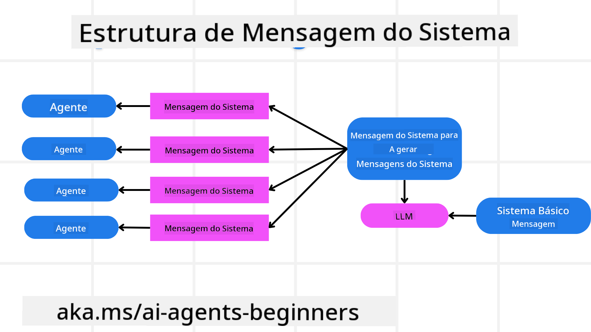
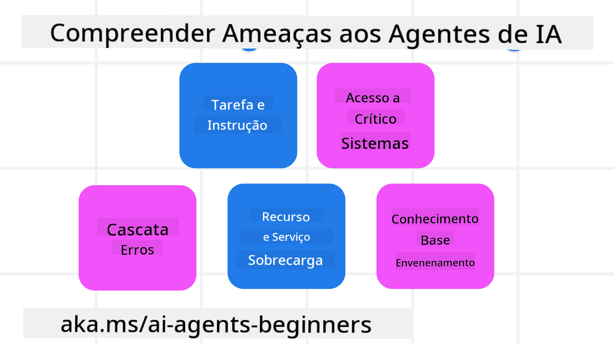
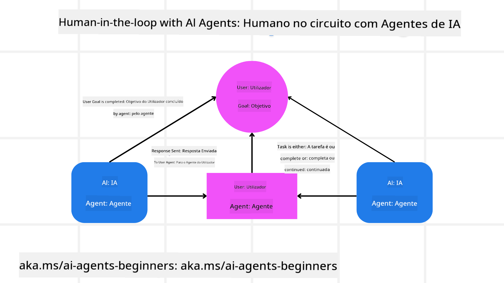

<!--
CO_OP_TRANSLATOR_METADATA:
{
  "original_hash": "f57852cac3a86c4a5ef47f793cc12178",
  "translation_date": "2025-07-12T10:25:58+00:00",
  "source_file": "06-building-trustworthy-agents/README.md",
  "language_code": "pt"
}
-->
[](https://youtu.be/iZKkMEGBCUQ?si=Q-kEbcyHUMPoHp8L)

> _(Clique na imagem acima para ver o vídeo desta lição)_

# Construir Agentes de IA Confiáveis

## Introdução

Esta lição irá abordar:

- Como construir e implementar Agentes de IA seguros e eficazes
- Considerações importantes de segurança ao desenvolver Agentes de IA
- Como manter a privacidade dos dados e dos utilizadores ao desenvolver Agentes de IA

## Objetivos de Aprendizagem

Após completar esta lição, saberá como:

- Identificar e mitigar riscos na criação de Agentes de IA
- Implementar medidas de segurança para garantir que os dados e o acesso são geridos corretamente
- Criar Agentes de IA que preservem a privacidade dos dados e proporcionem uma experiência de utilizador de qualidade

## Segurança

Vamos começar por analisar como construir aplicações agentic seguras. Segurança significa que o agente de IA funciona conforme planeado. Como construtores de aplicações agentic, dispomos de métodos e ferramentas para maximizar a segurança:

### Construir uma Estrutura de Mensagens do Sistema

Se alguma vez construiu uma aplicação de IA usando Large Language Models (LLMs), sabe a importância de desenhar um prompt ou mensagem de sistema robusta. Estes prompts estabelecem as regras meta, instruções e diretrizes sobre como o LLM irá interagir com o utilizador e os dados.

Para os Agentes de IA, o prompt do sistema é ainda mais importante, pois os Agentes de IA necessitam de instruções muito específicas para completar as tarefas que lhes atribuímos.

Para criar prompts de sistema escaláveis, podemos usar uma estrutura de mensagens do sistema para construir um ou mais agentes na nossa aplicação:



#### Passo 1: Criar uma Mensagem Meta do Sistema

O prompt meta será usado por um LLM para gerar os prompts do sistema para os agentes que criamos. Desenhamos este prompt como um modelo para que possamos criar múltiplos agentes de forma eficiente, se necessário.

Aqui está um exemplo de uma mensagem meta do sistema que daríamos ao LLM:

```plaintext
You are an expert at creating AI agent assistants. 
You will be provided a company name, role, responsibilities and other
information that you will use to provide a system prompt for.
To create the system prompt, be descriptive as possible and provide a structure that a system using an LLM can better understand the role and responsibilities of the AI assistant. 
```

#### Passo 2: Criar um prompt básico

O próximo passo é criar um prompt básico para descrever o Agente de IA. Deve incluir o papel do agente, as tarefas que o agente irá realizar e quaisquer outras responsabilidades do agente.

Aqui está um exemplo:

```plaintext
You are a travel agent for Contoso Travel that is great at booking flights for customers. To help customers you can perform the following tasks: lookup available flights, book flights, ask for preferences in seating and times for flights, cancel any previously booked flights and alert customers on any delays or cancellations of flights.  
```

#### Passo 3: Fornecer a Mensagem Básica do Sistema ao LLM

Agora podemos otimizar esta mensagem do sistema fornecendo a mensagem meta do sistema como mensagem do sistema juntamente com a nossa mensagem básica do sistema.

Isto irá produzir uma mensagem do sistema melhor desenhada para orientar os nossos agentes de IA:

```markdown
**Company Name:** Contoso Travel  
**Role:** Travel Agent Assistant

**Objective:**  
You are an AI-powered travel agent assistant for Contoso Travel, specializing in booking flights and providing exceptional customer service. Your main goal is to assist customers in finding, booking, and managing their flights, all while ensuring that their preferences and needs are met efficiently.

**Key Responsibilities:**

1. **Flight Lookup:**
    
    - Assist customers in searching for available flights based on their specified destination, dates, and any other relevant preferences.
    - Provide a list of options, including flight times, airlines, layovers, and pricing.
2. **Flight Booking:**
    
    - Facilitate the booking of flights for customers, ensuring that all details are correctly entered into the system.
    - Confirm bookings and provide customers with their itinerary, including confirmation numbers and any other pertinent information.
3. **Customer Preference Inquiry:**
    
    - Actively ask customers for their preferences regarding seating (e.g., aisle, window, extra legroom) and preferred times for flights (e.g., morning, afternoon, evening).
    - Record these preferences for future reference and tailor suggestions accordingly.
4. **Flight Cancellation:**
    
    - Assist customers in canceling previously booked flights if needed, following company policies and procedures.
    - Notify customers of any necessary refunds or additional steps that may be required for cancellations.
5. **Flight Monitoring:**
    
    - Monitor the status of booked flights and alert customers in real-time about any delays, cancellations, or changes to their flight schedule.
    - Provide updates through preferred communication channels (e.g., email, SMS) as needed.

**Tone and Style:**

- Maintain a friendly, professional, and approachable demeanor in all interactions with customers.
- Ensure that all communication is clear, informative, and tailored to the customer's specific needs and inquiries.

**User Interaction Instructions:**

- Respond to customer queries promptly and accurately.
- Use a conversational style while ensuring professionalism.
- Prioritize customer satisfaction by being attentive, empathetic, and proactive in all assistance provided.

**Additional Notes:**

- Stay updated on any changes to airline policies, travel restrictions, and other relevant information that could impact flight bookings and customer experience.
- Use clear and concise language to explain options and processes, avoiding jargon where possible for better customer understanding.

This AI assistant is designed to streamline the flight booking process for customers of Contoso Travel, ensuring that all their travel needs are met efficiently and effectively.

```

#### Passo 4: Iterar e Melhorar

O valor desta estrutura de mensagens do sistema é permitir escalar a criação de mensagens do sistema para múltiplos agentes de forma mais fácil, bem como melhorar as suas mensagens do sistema ao longo do tempo. É raro que tenha uma mensagem do sistema que funcione perfeitamente à primeira para o seu caso de uso completo. Poder fazer pequenos ajustes e melhorias alterando a mensagem básica do sistema e executando-a através do sistema permitirá comparar e avaliar os resultados.

## Compreender as Ameaças

Para construir agentes de IA confiáveis, é importante compreender e mitigar os riscos e ameaças ao seu agente de IA. Vamos analisar apenas algumas das diferentes ameaças aos agentes de IA e como pode planear e preparar-se melhor para elas.



### Tarefa e Instrução

**Descrição:** Os atacantes tentam alterar as instruções ou objetivos do agente de IA através de prompts ou manipulação das entradas.

**Mitigação:** Execute verificações de validação e filtros de entrada para detetar prompts potencialmente perigosos antes de serem processados pelo Agente de IA. Como estes ataques normalmente requerem interações frequentes com o Agente, limitar o número de turnos numa conversa é outra forma de prevenir este tipo de ataques.

### Acesso a Sistemas Críticos

**Descrição:** Se um agente de IA tem acesso a sistemas e serviços que armazenam dados sensíveis, os atacantes podem comprometer a comunicação entre o agente e esses serviços. Podem ser ataques diretos ou tentativas indiretas de obter informações sobre esses sistemas através do agente.

**Mitigação:** Os agentes de IA devem ter acesso aos sistemas apenas quando necessário para prevenir este tipo de ataques. A comunicação entre o agente e o sistema deve ser também segura. Implementar autenticação e controlo de acesso é outra forma de proteger esta informação.

### Sobrecarga de Recursos e Serviços

**Descrição:** Os agentes de IA podem aceder a diferentes ferramentas e serviços para completar tarefas. Os atacantes podem usar esta capacidade para atacar esses serviços enviando um elevado volume de pedidos através do Agente de IA, o que pode resultar em falhas do sistema ou custos elevados.

**Mitigação:** Implemente políticas para limitar o número de pedidos que um agente de IA pode fazer a um serviço. Limitar o número de turnos de conversa e pedidos ao seu agente de IA é outra forma de prevenir este tipo de ataques.

### Envenenamento da Base de Conhecimento

**Descrição:** Este tipo de ataque não visa diretamente o agente de IA, mas sim a base de conhecimento e outros serviços que o agente de IA irá usar. Pode envolver a corrupção dos dados ou informações que o agente de IA usará para completar uma tarefa, levando a respostas tendenciosas ou não intencionais ao utilizador.

**Mitigação:** Realize verificações regulares dos dados que o agente de IA irá usar nos seus fluxos de trabalho. Garanta que o acesso a estes dados é seguro e que só pode ser alterado por pessoas de confiança para evitar este tipo de ataque.

### Erros em Cascata

**Descrição:** Os agentes de IA acedem a várias ferramentas e serviços para completar tarefas. Erros causados por atacantes podem levar a falhas noutros sistemas aos quais o agente de IA está ligado, fazendo com que o ataque se torne mais alargado e difícil de resolver.

**Mitigação:** Uma forma de evitar isto é fazer com que o Agente de IA opere num ambiente limitado, como executar tarefas num contentor Docker, para prevenir ataques diretos ao sistema. Criar mecanismos de fallback e lógica de repetição quando certos sistemas respondem com erro é outra forma de evitar falhas maiores no sistema.

## Humano no Processo (Human-in-the-Loop)

Outra forma eficaz de construir sistemas de Agentes de IA confiáveis é usar um Humano no processo. Isto cria um fluxo onde os utilizadores podem fornecer feedback aos Agentes durante a execução. Os utilizadores atuam essencialmente como agentes num sistema multi-agente, aprovando ou terminando o processo em execução.



Aqui está um excerto de código usando AutoGen para mostrar como este conceito é implementado:

```python

# Create the agents.
model_client = OpenAIChatCompletionClient(model="gpt-4o-mini")
assistant = AssistantAgent("assistant", model_client=model_client)
user_proxy = UserProxyAgent("user_proxy", input_func=input)  # Use input() to get user input from console.

# Create the termination condition which will end the conversation when the user says "APPROVE".
termination = TextMentionTermination("APPROVE")

# Create the team.
team = RoundRobinGroupChat([assistant, user_proxy], termination_condition=termination)

# Run the conversation and stream to the console.
stream = team.run_stream(task="Write a 4-line poem about the ocean.")
# Use asyncio.run(...) when running in a script.
await Console(stream)

```

## Conclusão

Construir agentes de IA confiáveis requer um design cuidadoso, medidas de segurança robustas e iteração contínua. Ao implementar sistemas estruturados de meta prompting, compreender as ameaças potenciais e aplicar estratégias de mitigação, os desenvolvedores podem criar agentes de IA que sejam seguros e eficazes. Além disso, incorporar uma abordagem com humano no processo garante que os agentes de IA se mantenham alinhados com as necessidades dos utilizadores, minimizando riscos. À medida que a IA continua a evoluir, manter uma postura proativa em relação à segurança, privacidade e considerações éticas será fundamental para fomentar a confiança e a fiabilidade nos sistemas impulsionados por IA.

## Recursos Adicionais

- <a href="https://learn.microsoft.com/azure/ai-studio/responsible-use-of-ai-overview" target="_blank">Visão geral da IA responsável</a>
- <a href="https://learn.microsoft.com/azure/ai-studio/concepts/evaluation-approach-gen-ai" target="_blank">Avaliação de modelos de IA generativa e aplicações de IA</a>
- <a href="https://learn.microsoft.com/azure/ai-services/openai/concepts/system-message?context=%2Fazure%2Fai-studio%2Fcontext%2Fcontext&tabs=top-techniques" target="_blank">Mensagens de sistema para segurança</a>
- <a href="https://blogs.microsoft.com/wp-content/uploads/prod/sites/5/2022/06/Microsoft-RAI-Impact-Assessment-Template.pdf?culture=en-us&country=us" target="_blank">Modelo de Avaliação de Riscos</a>

## Lição Anterior

[Agentic RAG](../05-agentic-rag/README.md)

## Próxima Lição

[Planning Design Pattern](../07-planning-design/README.md)

**Aviso Legal**:  
Este documento foi traduzido utilizando o serviço de tradução automática [Co-op Translator](https://github.com/Azure/co-op-translator). Embora nos esforcemos para garantir a precisão, por favor tenha em conta que traduções automáticas podem conter erros ou imprecisões. O documento original na sua língua nativa deve ser considerado a fonte autorizada. Para informações críticas, recomenda-se a tradução profissional humana. Não nos responsabilizamos por quaisquer mal-entendidos ou interpretações incorretas decorrentes da utilização desta tradução.