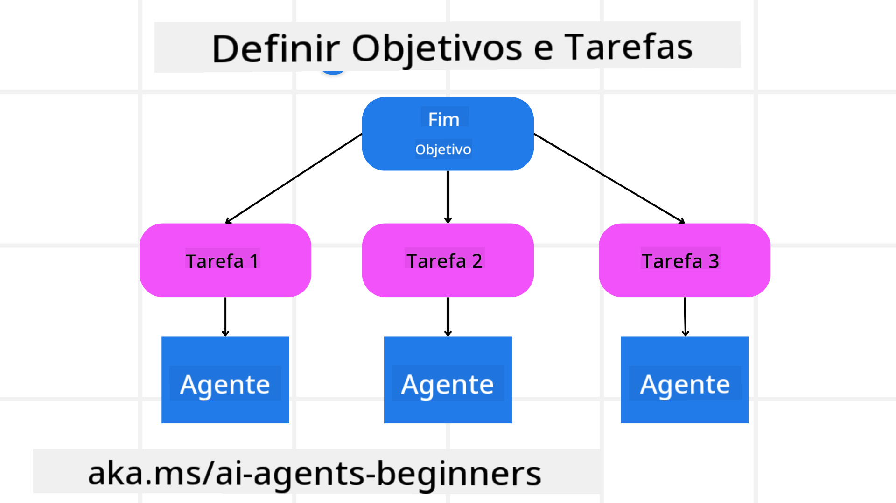

<!--
CO_OP_TRANSLATOR_METADATA:
{
  "original_hash": "a28d30590704ea13b6a08d4793cf9c2b",
  "translation_date": "2025-08-30T14:15:44+00:00",
  "source_file": "07-planning-design/README.md",
  "language_code": "pt"
}
-->
[](https://youtu.be/kPfJ2BrBCMY?si=9pYpPXp0sSbK91Dr)

> _(Clique na imagem acima para ver o vídeo desta lição)_

# Planeamento de Design

## Introdução

Esta lição irá abordar:

* Definir um objetivo geral claro e dividir uma tarefa complexa em tarefas mais geríveis.
* Utilizar saída estruturada para respostas mais fiáveis e legíveis por máquinas.
* Aplicar uma abordagem orientada a eventos para lidar com tarefas dinâmicas e entradas inesperadas.

## Objetivos de Aprendizagem

Após completar esta lição, terá uma compreensão sobre:

* Identificar e definir um objetivo geral para um agente de IA, garantindo que este saiba claramente o que precisa ser alcançado.
* Dividir uma tarefa complexa em subtarefas geríveis e organizá-las numa sequência lógica.
* Equipar agentes com as ferramentas certas (por exemplo, ferramentas de pesquisa ou análise de dados), decidir quando e como usá-las e lidar com situações inesperadas que surjam.
* Avaliar os resultados das subtarefas, medir o desempenho e iterar nas ações para melhorar o resultado final.

## Definir o Objetivo Geral e Dividir uma Tarefa



A maioria das tarefas do mundo real é demasiado complexa para ser resolvida num único passo. Um agente de IA precisa de um objetivo conciso para orientar o seu planeamento e ações. Por exemplo, considere o objetivo:

    "Gerar um itinerário de viagem de 3 dias."

Embora seja simples de enunciar, ainda precisa de refinamento. Quanto mais claro for o objetivo, melhor o agente (e quaisquer colaboradores humanos) poderá concentrar-se em alcançar o resultado certo, como criar um itinerário completo com opções de voo, recomendações de hotéis e sugestões de atividades.

### Decomposição de Tarefas

Tarefas grandes ou intrincadas tornam-se mais geríveis quando divididas em subtarefas menores e orientadas para objetivos.
Para o exemplo do itinerário de viagem, pode-se decompor o objetivo em:

* Reserva de Voos
* Reserva de Hotéis
* Aluguer de Carro
* Personalização

Cada subtarefa pode então ser tratada por agentes ou processos dedicados. Um agente pode especializar-se em procurar as melhores ofertas de voos, outro focar-se em reservas de hotéis, e assim por diante. Um agente coordenador ou “downstream” pode então compilar estes resultados num itinerário coeso para o utilizador final.

Esta abordagem modular também permite melhorias incrementais. Por exemplo, pode adicionar agentes especializados em Recomendações de Restaurantes ou Sugestões de Atividades Locais e refinar o itinerário ao longo do tempo.

### Saída Estruturada

Modelos de Linguagem de Grande Escala (LLMs) podem gerar saídas estruturadas (por exemplo, JSON) que são mais fáceis de analisar e processar por agentes ou serviços subsequentes. Isto é especialmente útil num contexto de multi-agentes, onde podemos executar estas tarefas após receber a saída do planeamento. Consulte isto para uma visão geral rápida.

O seguinte snippet de Python demonstra um agente de planeamento simples que decompõe um objetivo em subtarefas e gera um plano estruturado:

```python
from pydantic import BaseModel
from enum import Enum
from typing import List, Optional, Union
import json
import os
from typing import Optional
from pprint import pprint
from autogen_core.models import UserMessage, SystemMessage, AssistantMessage
from autogen_ext.models.azure import AzureAIChatCompletionClient
from azure.core.credentials import AzureKeyCredential

class AgentEnum(str, Enum):
    FlightBooking = "flight_booking"
    HotelBooking = "hotel_booking"
    CarRental = "car_rental"
    ActivitiesBooking = "activities_booking"
    DestinationInfo = "destination_info"
    DefaultAgent = "default_agent"
    GroupChatManager = "group_chat_manager"

# Travel SubTask Model
class TravelSubTask(BaseModel):
    task_details: str
    assigned_agent: AgentEnum  # we want to assign the task to the agent

class TravelPlan(BaseModel):
    main_task: str
    subtasks: List[TravelSubTask]
    is_greeting: bool

client = AzureAIChatCompletionClient(
    model="gpt-4o-mini",
    endpoint="https://models.inference.ai.azure.com",
    # To authenticate with the model you will need to generate a personal access token (PAT) in your GitHub settings.
    # Create your PAT token by following instructions here: https://docs.github.com/en/authentication/keeping-your-account-and-data-secure/managing-your-personal-access-tokens
    credential=AzureKeyCredential(os.environ["GITHUB_TOKEN"]),
    model_info={
        "json_output": False,
        "function_calling": True,
        "vision": True,
        "family": "unknown",
    },
)

# Define the user message
messages = [
    SystemMessage(content="""You are an planner agent.
    Your job is to decide which agents to run based on the user's request.
                      Provide your response in JSON format with the following structure:
{'main_task': 'Plan a family trip from Singapore to Melbourne.',
 'subtasks': [{'assigned_agent': 'flight_booking',
               'task_details': 'Book round-trip flights from Singapore to '
                               'Melbourne.'}
    Below are the available agents specialised in different tasks:
    - FlightBooking: For booking flights and providing flight information
    - HotelBooking: For booking hotels and providing hotel information
    - CarRental: For booking cars and providing car rental information
    - ActivitiesBooking: For booking activities and providing activity information
    - DestinationInfo: For providing information about destinations
    - DefaultAgent: For handling general requests""", source="system"),
    UserMessage(
        content="Create a travel plan for a family of 2 kids from Singapore to Melboune", source="user"),
]

response = await client.create(messages=messages, extra_create_args={"response_format": 'json_object'})

response_content: Optional[str] = response.content if isinstance(
    response.content, str) else None
if response_content is None:
    raise ValueError("Response content is not a valid JSON string" )

pprint(json.loads(response_content))

# # Ensure the response content is a valid JSON string before loading it
# response_content: Optional[str] = response.content if isinstance(
#     response.content, str) else None
# if response_content is None:
#     raise ValueError("Response content is not a valid JSON string")

# # Print the response content after loading it as JSON
# pprint(json.loads(response_content))

# Validate the response content with the MathReasoning model
# TravelPlan.model_validate(json.loads(response_content))
```

### Agente de Planeamento com Orquestração Multi-Agente

Neste exemplo, um Agente de Roteador Semântico recebe um pedido do utilizador (por exemplo, "Preciso de um plano de hotel para a minha viagem.").

O planeador então:

* Recebe o Plano de Hotel: O planeador pega na mensagem do utilizador e, com base num prompt de sistema (incluindo detalhes dos agentes disponíveis), gera um plano de viagem estruturado.
* Lista os Agentes e as Suas Ferramentas: O registo de agentes mantém uma lista de agentes (por exemplo, para voos, hotéis, aluguer de carros e atividades) juntamente com as funções ou ferramentas que oferecem.
* Encaminha o Plano para os Agentes Correspondentes: Dependendo do número de subtarefas, o planeador envia a mensagem diretamente para um agente dedicado (em cenários de tarefa única) ou coordena através de um gestor de chat em grupo para colaboração multi-agente.
* Resume o Resultado: Finalmente, o planeador resume o plano gerado para maior clareza.

O seguinte exemplo de código Python ilustra estes passos:

```python

from pydantic import BaseModel

from enum import Enum
from typing import List, Optional, Union

class AgentEnum(str, Enum):
    FlightBooking = "flight_booking"
    HotelBooking = "hotel_booking"
    CarRental = "car_rental"
    ActivitiesBooking = "activities_booking"
    DestinationInfo = "destination_info"
    DefaultAgent = "default_agent"
    GroupChatManager = "group_chat_manager"

# Travel SubTask Model

class TravelSubTask(BaseModel):
    task_details: str
    assigned_agent: AgentEnum # we want to assign the task to the agent

class TravelPlan(BaseModel):
    main_task: str
    subtasks: List[TravelSubTask]
    is_greeting: bool
import json
import os
from typing import Optional

from autogen_core.models import UserMessage, SystemMessage, AssistantMessage
from autogen_ext.models.openai import AzureOpenAIChatCompletionClient

# Create the client with type-checked environment variables

client = AzureOpenAIChatCompletionClient(
    azure_deployment=os.getenv("AZURE_OPENAI_DEPLOYMENT_NAME"),
    model=os.getenv("AZURE_OPENAI_DEPLOYMENT_NAME"),
    api_version=os.getenv("AZURE_OPENAI_API_VERSION"),
    azure_endpoint=os.getenv("AZURE_OPENAI_ENDPOINT"),
    api_key=os.getenv("AZURE_OPENAI_API_KEY"),
)

from pprint import pprint

# Define the user message

messages = [
    SystemMessage(content="""You are an planner agent.
    Your job is to decide which agents to run based on the user's request.
    Below are the available agents specialized in different tasks:
    - FlightBooking: For booking flights and providing flight information
    - HotelBooking: For booking hotels and providing hotel information
    - CarRental: For booking cars and providing car rental information
    - ActivitiesBooking: For booking activities and providing activity information
    - DestinationInfo: For providing information about destinations
    - DefaultAgent: For handling general requests""", source="system"),
    UserMessage(content="Create a travel plan for a family of 2 kids from Singapore to Melbourne", source="user"),
]

response = await client.create(messages=messages, extra_create_args={"response_format": TravelPlan})

# Ensure the response content is a valid JSON string before loading it

response_content: Optional[str] = response.content if isinstance(response.content, str) else None
if response_content is None:
    raise ValueError("Response content is not a valid JSON string")

# Print the response content after loading it as JSON

pprint(json.loads(response_content))
```

O que se segue é a saída do código anterior e pode então usar esta saída estruturada para encaminhar para `assigned_agent` e resumir o plano de viagem para o utilizador final.

```json
{
    "is_greeting": "False",
    "main_task": "Plan a family trip from Singapore to Melbourne.",
    "subtasks": [
        {
            "assigned_agent": "flight_booking",
            "task_details": "Book round-trip flights from Singapore to Melbourne."
        },
        {
            "assigned_agent": "hotel_booking",
            "task_details": "Find family-friendly hotels in Melbourne."
        },
        {
            "assigned_agent": "car_rental",
            "task_details": "Arrange a car rental suitable for a family of four in Melbourne."
        },
        {
            "assigned_agent": "activities_booking",
            "task_details": "List family-friendly activities in Melbourne."
        },
        {
            "assigned_agent": "destination_info",
            "task_details": "Provide information about Melbourne as a travel destination."
        }
    ]
}
```

Um notebook de exemplo com o código anterior está disponível [aqui](07-autogen.ipynb).

### Planeamento Iterativo

Algumas tarefas requerem um processo de ida e volta ou replaneamento, onde o resultado de uma subtarefa influencia a próxima. Por exemplo, se o agente descobrir um formato de dados inesperado ao reservar voos, pode precisar de adaptar a sua estratégia antes de avançar para as reservas de hotéis.

Além disso, o feedback do utilizador (por exemplo, um humano decidir que prefere um voo mais cedo) pode desencadear um replaneamento parcial. Esta abordagem dinâmica e iterativa garante que a solução final esteja alinhada com as restrições do mundo real e as preferências em evolução do utilizador.

Exemplo de código:

```python
from autogen_core.models import UserMessage, SystemMessage, AssistantMessage
#.. same as previous code and pass on the user history, current plan
messages = [
    SystemMessage(content="""You are a planner agent to optimize the
    Your job is to decide which agents to run based on the user's request.
    Below are the available agents specialized in different tasks:
    - FlightBooking: For booking flights and providing flight information
    - HotelBooking: For booking hotels and providing hotel information
    - CarRental: For booking cars and providing car rental information
    - ActivitiesBooking: For booking activities and providing activity information
    - DestinationInfo: For providing information about destinations
    - DefaultAgent: For handling general requests""", source="system"),
    UserMessage(content="Create a travel plan for a family of 2 kids from Singapore to Melbourne", source="user"),
    AssistantMessage(content=f"Previous travel plan - {TravelPlan}", source="assistant")
]
# .. re-plan and send the tasks to respective agents
```

Para um planeamento mais abrangente, consulte Magnetic One para resolver tarefas complexas.

## Resumo

Neste artigo, vimos um exemplo de como podemos criar um planeador que pode selecionar dinamicamente os agentes disponíveis definidos. A saída do Planeador decompõe as tarefas e atribui os agentes para que possam ser executadas. Assume-se que os agentes têm acesso às funções/ferramentas necessárias para realizar a tarefa. Além dos agentes, pode incluir outros padrões como reflexão, resumidor e chat em round robin para personalizar ainda mais.

## Recursos Adicionais

* AutoGen Magnetic One - Um sistema multi-agente generalista para resolver tarefas complexas e que alcançou resultados impressionantes em vários benchmarks desafiantes de agentes. Referência: . Nesta implementação, o orquestrador cria um plano específico para a tarefa e delega estas tarefas aos agentes disponíveis. Além do planeamento, o orquestrador também emprega um mecanismo de rastreamento para monitorizar o progresso da tarefa e replanejar conforme necessário.

### Tem Mais Perguntas sobre o Padrão de Design de Planeamento?

Junte-se ao [Discord do Azure AI Foundry](https://aka.ms/ai-agents/discord) para encontrar outros aprendizes, participar em horas de atendimento e obter respostas às suas perguntas sobre Agentes de IA.

## Lição Anterior

[Construir Agentes de IA Confiáveis](../06-building-trustworthy-agents/README.md)

## Próxima Lição

[Padrão de Design Multi-Agente](../08-multi-agent/README.md)

---

**Aviso Legal**:  
Este documento foi traduzido utilizando o serviço de tradução por IA [Co-op Translator](https://github.com/Azure/co-op-translator). Embora nos esforcemos para garantir a precisão, é importante notar que traduções automáticas podem conter erros ou imprecisões. O documento original na sua língua nativa deve ser considerado a fonte autoritária. Para informações críticas, recomenda-se a tradução profissional realizada por humanos. Não nos responsabilizamos por quaisquer mal-entendidos ou interpretações incorretas decorrentes da utilização desta tradução.