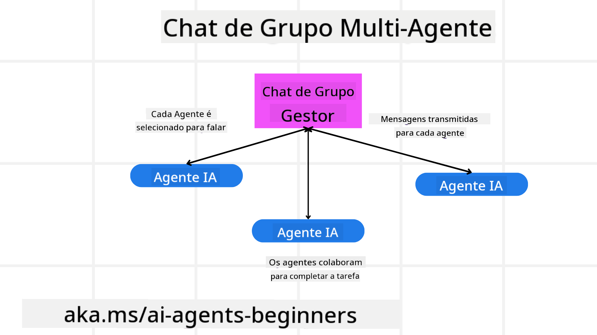
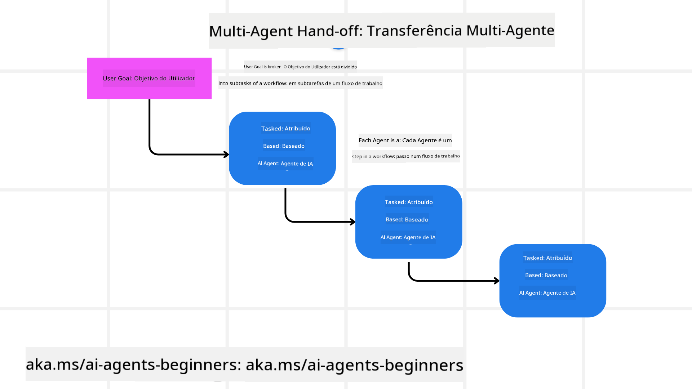
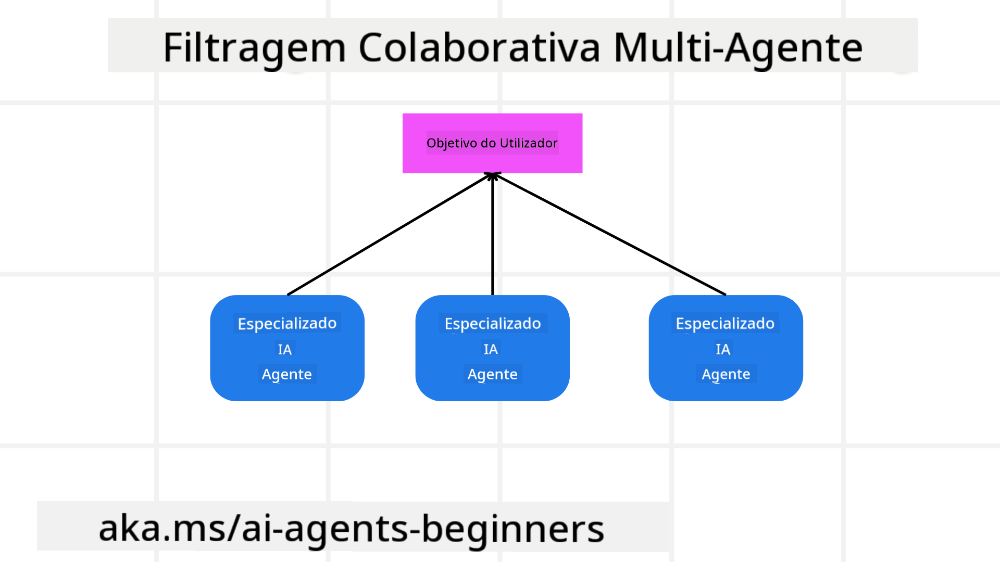

<!--
CO_OP_TRANSLATOR_METADATA:
{
  "original_hash": "c692a8975d7d5b99575a553de1c5e8a7",
  "translation_date": "2025-07-12T11:06:06+00:00",
  "source_file": "08-multi-agent/README.md",
  "language_code": "pt"
}
-->

> _(Clique na imagem acima para ver o vídeo desta lição)_

# Padrões de design multi-agente

Assim que começares a trabalhar num projeto que envolve múltiplos agentes, precisarás de considerar o padrão de design multi-agente. No entanto, pode não ser imediatamente claro quando mudar para múltiplos agentes e quais as vantagens.

## Introdução

Nesta lição, vamos responder às seguintes perguntas:

- Quais são os cenários onde os multi-agentes são aplicáveis?
- Quais as vantagens de usar multi-agentes em vez de um único agente a realizar várias tarefas?
- Quais são os blocos de construção para implementar o padrão de design multi-agente?
- Como podemos ter visibilidade sobre como os múltiplos agentes interagem entre si?

## Objetivos de Aprendizagem

Após esta lição, deverás ser capaz de:

- Identificar cenários onde os multi-agentes são aplicáveis
- Reconhecer as vantagens de usar multi-agentes em vez de um agente singular
- Compreender os blocos de construção para implementar o padrão de design multi-agente

Qual é a visão geral?

*Multi-agentes são um padrão de design que permite que múltiplos agentes trabalhem juntos para alcançar um objetivo comum*.

Este padrão é amplamente utilizado em várias áreas, incluindo robótica, sistemas autónomos e computação distribuída.

## Cenários Onde os Multi-Agentes São Aplicáveis

Então, em que cenários é vantajoso usar multi-agentes? A resposta é que existem muitos cenários onde empregar múltiplos agentes é benéfico, especialmente nos seguintes casos:

- **Grandes cargas de trabalho**: Grandes cargas de trabalho podem ser divididas em tarefas menores e atribuídas a diferentes agentes, permitindo processamento paralelo e conclusão mais rápida. Um exemplo disto é no caso de uma grande tarefa de processamento de dados.
- **Tarefas complexas**: Tarefas complexas, tal como grandes cargas de trabalho, podem ser divididas em subtarefas menores e atribuídas a diferentes agentes, cada um especializado num aspeto específico da tarefa. Um bom exemplo é no caso de veículos autónomos, onde diferentes agentes gerem a navegação, deteção de obstáculos e comunicação com outros veículos.
- **Diversidade de especialização**: Diferentes agentes podem ter especializações diversas, permitindo-lhes lidar com diferentes aspetos de uma tarefa de forma mais eficaz do que um único agente. Um bom exemplo é na área da saúde, onde agentes podem gerir diagnósticos, planos de tratamento e monitorização do paciente.

## Vantagens de Usar Multi-Agentes em Vez de um Agente Singular

Um sistema com um único agente pode funcionar bem para tarefas simples, mas para tarefas mais complexas, usar múltiplos agentes pode trazer várias vantagens:

- **Especialização**: Cada agente pode ser especializado numa tarefa específica. A falta de especialização num único agente significa que tens um agente que pode fazer tudo, mas que pode ficar confuso sobre o que fazer quando enfrenta uma tarefa complexa. Por exemplo, pode acabar por realizar uma tarefa para a qual não está melhor preparado.
- **Escalabilidade**: É mais fácil escalar sistemas adicionando mais agentes do que sobrecarregar um único agente.
- **Tolerância a falhas**: Se um agente falhar, os outros podem continuar a funcionar, garantindo a fiabilidade do sistema.

Vamos a um exemplo: vamos reservar uma viagem para um utilizador. Um sistema com um único agente teria de tratar todos os aspetos do processo de reserva, desde encontrar voos até reservar hotéis e carros de aluguer. Para conseguir isto com um único agente, este teria de ter ferramentas para lidar com todas estas tarefas. Isto poderia levar a um sistema complexo e monolítico, difícil de manter e escalar. Um sistema multi-agente, por outro lado, poderia ter diferentes agentes especializados em encontrar voos, reservar hotéis e carros de aluguer. Isto tornaria o sistema mais modular, mais fácil de manter e escalável.

Compara isto com uma agência de viagens gerida por um pequeno negócio familiar versus uma agência de viagens gerida como uma franquia. O pequeno negócio teria um único agente a tratar todos os aspetos do processo de reserva, enquanto a franquia teria diferentes agentes a tratar diferentes aspetos do processo.

## Blocos de Construção para Implementar o Padrão de Design Multi-Agente

Antes de poderes implementar o padrão de design multi-agente, precisas de compreender os blocos de construção que compõem o padrão.

Vamos tornar isto mais concreto, voltando ao exemplo da reserva de uma viagem para um utilizador. Neste caso, os blocos de construção incluiriam:

- **Comunicação entre agentes**: Os agentes para encontrar voos, reservar hotéis e carros de aluguer precisam de comunicar e partilhar informações sobre as preferências e restrições do utilizador. É necessário decidir os protocolos e métodos para esta comunicação. Concretamente, isto significa que o agente que encontra voos precisa de comunicar com o agente que reserva hotéis para garantir que o hotel é reservado para as mesmas datas do voo. Isso significa que os agentes precisam de partilhar informações sobre as datas da viagem do utilizador, ou seja, é necessário decidir *quais agentes partilham informação e como o fazem*.
- **Mecanismos de coordenação**: Os agentes precisam de coordenar as suas ações para garantir que as preferências e restrições do utilizador são cumpridas. Uma preferência do utilizador pode ser querer um hotel perto do aeroporto, enquanto uma restrição pode ser que os carros de aluguer só estão disponíveis no aeroporto. Isto significa que o agente que reserva hotéis precisa de coordenar-se com o agente que reserva carros para garantir que as preferências e restrições do utilizador são respeitadas. Ou seja, é necessário decidir *como os agentes coordenam as suas ações*.
- **Arquitetura do agente**: Os agentes precisam de ter uma estrutura interna para tomar decisões e aprender com as suas interações com o utilizador. Isto significa que o agente que encontra voos precisa de ter uma estrutura interna para decidir quais os voos a recomendar ao utilizador. Ou seja, é necessário decidir *como os agentes tomam decisões e aprendem com as suas interações com o utilizador*. Exemplos de como um agente aprende e melhora podem ser que o agente que encontra voos use um modelo de machine learning para recomendar voos ao utilizador com base nas suas preferências anteriores.
- **Visibilidade nas interações multi-agente**: É necessário ter visibilidade sobre como os múltiplos agentes interagem entre si. Isto significa que precisas de ferramentas e técnicas para acompanhar as atividades e interações dos agentes. Isto pode ser feito através de ferramentas de logging e monitorização, ferramentas de visualização e métricas de desempenho.
- **Padrões multi-agente**: Existem diferentes padrões para implementar sistemas multi-agente, como arquiteturas centralizadas, descentralizadas e híbridas. É necessário decidir qual o padrão que melhor se adapta ao teu caso de uso.
- **Humano no circuito**: Na maioria dos casos, haverá um humano no circuito e precisas de instruir os agentes sobre quando pedir intervenção humana. Isto pode ser na forma de um utilizador a pedir um hotel ou voo específico que os agentes não recomendaram ou a pedir confirmação antes de reservar um voo ou hotel.

## Visibilidade nas Interações Multi-Agente

É importante ter visibilidade sobre como os múltiplos agentes interagem entre si. Esta visibilidade é essencial para depurar, otimizar e garantir a eficácia geral do sistema. Para isso, precisas de ferramentas e técnicas para acompanhar as atividades e interações dos agentes. Isto pode ser feito através de ferramentas de logging e monitorização, ferramentas de visualização e métricas de desempenho.

Por exemplo, no caso de reservar uma viagem para um utilizador, poderias ter um painel que mostra o estado de cada agente, as preferências e restrições do utilizador, e as interações entre os agentes. Este painel poderia mostrar as datas da viagem do utilizador, os voos recomendados pelo agente de voos, os hotéis recomendados pelo agente de hotéis e os carros de aluguer recomendados pelo agente de carros. Isto daria uma visão clara de como os agentes estão a interagir entre si e se as preferências e restrições do utilizador estão a ser cumpridas.

Vamos analisar cada um destes aspetos com mais detalhe.

- **Ferramentas de logging e monitorização**: Queres ter registo de cada ação tomada por um agente. Uma entrada de log pode armazenar informação sobre o agente que tomou a ação, a ação realizada, a hora em que foi realizada e o resultado da ação. Esta informação pode depois ser usada para depuração, otimização e mais.
- **Ferramentas de visualização**: Ferramentas de visualização podem ajudar a ver as interações entre agentes de forma mais intuitiva. Por exemplo, poderias ter um gráfico que mostra o fluxo de informação entre agentes. Isto pode ajudar a identificar gargalos, ineficiências e outros problemas no sistema.
- **Métricas de desempenho**: Métricas de desempenho podem ajudar a acompanhar a eficácia do sistema multi-agente. Por exemplo, poderias acompanhar o tempo necessário para completar uma tarefa, o número de tarefas concluídas por unidade de tempo e a precisão das recomendações feitas pelos agentes. Esta informação pode ajudar a identificar áreas para melhoria e otimizar o sistema.

## Padrões Multi-Agente

Vamos explorar alguns padrões concretos que podemos usar para criar aplicações multi-agente. Aqui estão alguns padrões interessantes a considerar:

### Chat de grupo

Este padrão é útil quando queres criar uma aplicação de chat de grupo onde múltiplos agentes podem comunicar entre si. Casos típicos de uso incluem colaboração em equipa, suporte ao cliente e redes sociais.

Neste padrão, cada agente representa um utilizador no chat de grupo, e as mensagens são trocadas entre agentes usando um protocolo de mensagens. Os agentes podem enviar mensagens para o chat de grupo, receber mensagens do chat e responder a mensagens de outros agentes.

Este padrão pode ser implementado usando uma arquitetura centralizada, onde todas as mensagens passam por um servidor central, ou uma arquitetura descentralizada, onde as mensagens são trocadas diretamente.

### Transferência de tarefas

Este padrão é útil quando queres criar uma aplicação onde múltiplos agentes podem transferir tarefas entre si.

Casos típicos de uso incluem suporte ao cliente, gestão de tarefas e automação de fluxos de trabalho.

Neste padrão, cada agente representa uma tarefa ou um passo num fluxo de trabalho, e os agentes podem transferir tarefas para outros agentes com base em regras pré-definidas.

### Filtragem colaborativa

Este padrão é útil quando queres criar uma aplicação onde múltiplos agentes colaboram para fazer recomendações aos utilizadores.

A razão para quereres que múltiplos agentes colaborem é que cada agente pode ter uma especialização diferente e pode contribuir para o processo de recomendação de formas distintas.

Vamos a um exemplo onde um utilizador quer uma recomendação sobre a melhor ação para comprar no mercado bolsista.

- **Especialista na indústria**: Um agente pode ser especialista numa indústria específica.
- **Análise técnica**: Outro agente pode ser especialista em análise técnica.
- **Análise fundamental**: E outro agente pode ser especialista em análise fundamental. Ao colaborarem, estes agentes podem fornecer uma recomendação mais completa ao utilizador.

## Cenário: Processo de reembolso

Considera um cenário onde um cliente está a tentar obter um reembolso por um produto. Podem estar envolvidos vários agentes neste processo, mas vamos dividir entre agentes específicos para este processo e agentes gerais que podem ser usados noutros processos.

**Agentes específicos para o processo de reembolso**:

Segue uma lista de alguns agentes que podem estar envolvidos no processo de reembolso:

- **Agente do cliente**: Este agente representa o cliente e é responsável por iniciar o processo de reembolso.
- **Agente do vendedor**: Este agente representa o vendedor e é responsável por processar o reembolso.
- **Agente de pagamento**: Este agente representa o processo de pagamento e é responsável por reembolsar o pagamento do cliente.
- **Agente de resolução**: Este agente representa o processo de resolução e é responsável por resolver quaisquer problemas que surjam durante o processo de reembolso.
- **Agente de conformidade**: Este agente representa o processo de conformidade e é responsável por garantir que o processo de reembolso cumpre as regulamentações e políticas.

**Agentes gerais**:

Estes agentes podem ser usados noutras partes do teu negócio.

- **Agente de expedição**: Este agente representa o processo de expedição e é responsável por enviar o produto de volta ao vendedor. Este agente pode ser usado tanto no processo de reembolso como na expedição geral de um produto, por exemplo, numa compra.
- **Agente de feedback**: Este agente representa o processo de recolha de feedback e é responsável por recolher feedback do cliente. O feedback pode ser recolhido a qualquer momento e não apenas durante o processo de reembolso.
- **Agente de escalonamento**: Este agente representa o processo de escalonamento e é responsável por escalar problemas para um nível superior de suporte. Podes usar este tipo de agente para qualquer processo onde seja necessário escalar um problema.
- **Agente de notificações**: Este agente representa o processo de notificações e é responsável por enviar notificações ao cliente em várias fases do processo de reembolso.
- **Agente de análise**: Este agente representa o processo de análise e é responsável por analisar dados relacionados com o processo de reembolso.
- **Agente de auditoria**: Este agente representa o processo de auditoria e é responsável por auditar o processo de reembolso para garantir que está a ser realizado corretamente.
- **Agente de relatórios**: Este agente representa o processo de relatórios e é responsável por gerar relatórios sobre o processo de reembolso.
- **Agente de conhecimento**: Este agente representa o processo de conhecimento e é responsável por manter uma base de conhecimento de informações relacionadas com o processo de reembolso. Este agente pode ter conhecimento tanto sobre reembolsos como sobre outras partes do teu negócio.
- **Agente de segurança**: Este agente representa o processo de segurança e é responsável por garantir a segurança do processo de reembolso.
- **Agente de qualidade**: Este agente representa o processo de qualidade e é responsável por garantir a qualidade do processo de reembolso.

Há bastantes agentes listados anteriormente, tanto para o processo específico de reembolso como para os agentes gerais que podem ser usados noutras partes do teu negócio. Esperamos que isto te dê uma ideia de como podes decidir quais agentes usar no teu sistema multi-agente.

## Tarefa
## Aula Anterior

[Planeamento do Design](../07-planning-design/README.md)

## Próxima Aula

[Metacognição em Agentes de IA](../09-metacognition/README.md)

**Aviso Legal**:  
Este documento foi traduzido utilizando o serviço de tradução automática [Co-op Translator](https://github.com/Azure/co-op-translator). Embora nos esforcemos pela precisão, por favor tenha em conta que traduções automáticas podem conter erros ou imprecisões. O documento original na sua língua nativa deve ser considerado a fonte autorizada. Para informações críticas, recomenda-se tradução profissional humana. Não nos responsabilizamos por quaisquer mal-entendidos ou interpretações incorretas decorrentes da utilização desta tradução.