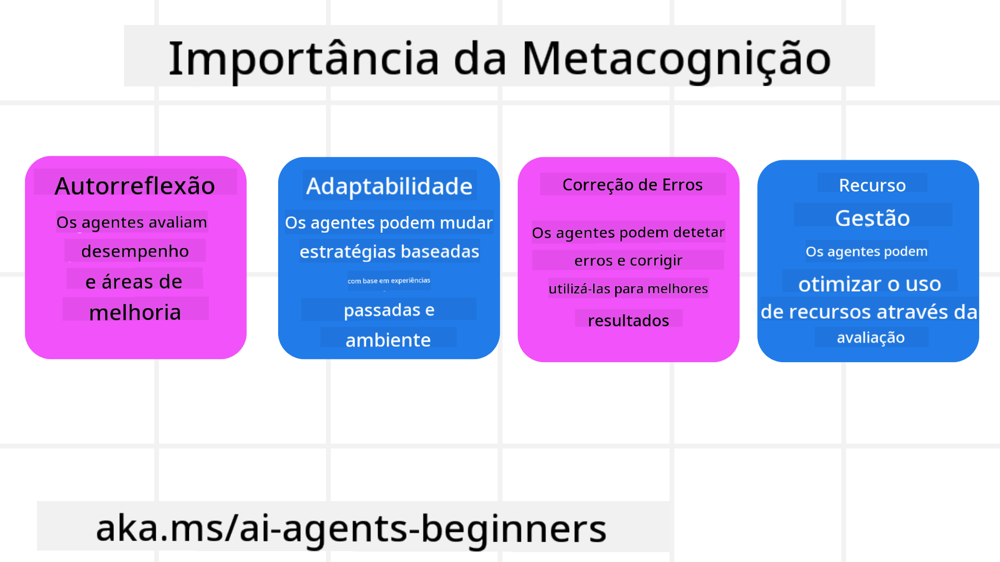
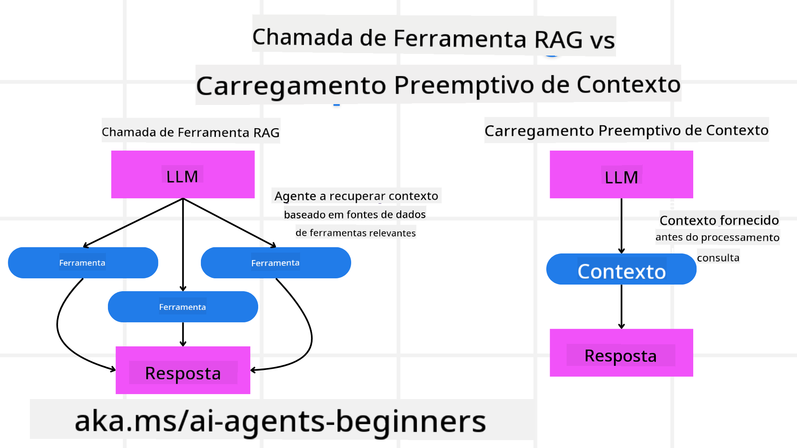

<!--
CO_OP_TRANSLATOR_METADATA:
{
  "original_hash": "5f0deef171fc3a68d5d3d770a8bfb03d",
  "translation_date": "2025-08-30T14:07:47+00:00",
  "source_file": "09-metacognition/README.md",
  "language_code": "pt"
}
-->
[](https://youtu.be/His9R6gw6Ec?si=3_RMb8VprNvdLRhX)

> _(Clique na imagem acima para ver o vídeo desta lição)_
# Metacognição em Agentes de IA

## Introdução

Bem-vindo à lição sobre metacognição em agentes de IA! Este capítulo foi criado para iniciantes curiosos sobre como os agentes de IA podem pensar sobre seus próprios processos de pensamento. Ao final desta lição, você compreenderá conceitos-chave e terá exemplos práticos para aplicar metacognição no design de agentes de IA.

## Objetivos de Aprendizagem

Após concluir esta lição, você será capaz de:

1. Compreender as implicações dos ciclos de raciocínio nas definições de agentes.
2. Utilizar técnicas de planeamento e avaliação para ajudar agentes a se autocorrigirem.
3. Criar seus próprios agentes capazes de manipular código para realizar tarefas.

## Introdução à Metacognição

Metacognição refere-se aos processos cognitivos de ordem superior que envolvem pensar sobre o próprio pensamento. Para agentes de IA, isso significa ser capaz de avaliar e ajustar suas ações com base na autoconsciência e em experiências passadas. Metacognição, ou "pensar sobre pensar", é um conceito importante no desenvolvimento de sistemas de IA com capacidade de agência. Envolve sistemas de IA que estão cientes de seus próprios processos internos e que podem monitorar, regular e adaptar seu comportamento de forma adequada. Assim como fazemos ao interpretar um ambiente ou analisar um problema. Essa autoconsciência pode ajudar os sistemas de IA a tomar melhores decisões, identificar erros e melhorar seu desempenho ao longo do tempo — novamente, remetendo ao teste de Turing e ao debate sobre se a IA vai dominar o mundo.

No contexto de sistemas de IA com capacidade de agência, a metacognição pode ajudar a resolver vários desafios, como:
- Transparência: Garantir que os sistemas de IA possam explicar seu raciocínio e decisões.
- Raciocínio: Melhorar a capacidade dos sistemas de IA de sintetizar informações e tomar decisões sólidas.
- Adaptação: Permitir que os sistemas de IA se ajustem a novos ambientes e condições em mudança.
- Perceção: Melhorar a precisão dos sistemas de IA ao reconhecer e interpretar dados do ambiente.

### O que é Metacognição?

Metacognição, ou "pensar sobre pensar", é um processo cognitivo de ordem superior que envolve autoconsciência e autorregulação dos próprios processos cognitivos. No domínio da IA, a metacognição capacita os agentes a avaliar e adaptar suas estratégias e ações, levando a capacidades aprimoradas de resolução de problemas e tomada de decisão. Ao compreender a metacognição, você pode projetar agentes de IA que não apenas sejam mais inteligentes, mas também mais adaptáveis e eficientes. Na verdadeira metacognição, veríamos a IA raciocinando explicitamente sobre seu próprio raciocínio.

Exemplo: “Priorizei voos mais baratos porque... posso estar a perder voos diretos, então vou verificar novamente.”
Manter o registo de como ou por que escolheu uma determinada rota.
- Notar que cometeu erros porque confiou excessivamente nas preferências do utilizador da última vez, então modifica sua estratégia de tomada de decisão, não apenas a recomendação final.
- Diagnosticar padrões como: “Sempre que vejo o utilizador mencionar ‘muito cheio’, devo não apenas remover certas atrações, mas também refletir que meu método de escolher ‘principais atrações’ está falhado se eu sempre classificar por popularidade.”

### Importância da Metacognição em Agentes de IA

A metacognição desempenha um papel crucial no design de agentes de IA por várias razões:



- Autorreflexão: Os agentes podem avaliar seu próprio desempenho e identificar áreas para melhoria.
- Adaptabilidade: Os agentes podem modificar suas estratégias com base em experiências passadas e ambientes em mudança.
- Correção de Erros: Os agentes podem detetar e corrigir erros autonomamente, levando a resultados mais precisos.
- Gestão de Recursos: Os agentes podem otimizar o uso de recursos, como tempo e poder computacional, ao planear e avaliar suas ações.

## Componentes de um Agente de IA

Antes de mergulhar nos processos metacognitivos, é essencial compreender os componentes básicos de um agente de IA. Um agente de IA geralmente consiste em:

- Persona: A personalidade e características do agente, que definem como ele interage com os utilizadores.
- Ferramentas: As capacidades e funções que o agente pode realizar.
- Competências: O conhecimento e a experiência que o agente possui.

Esses componentes trabalham juntos para criar uma "unidade de especialização" capaz de realizar tarefas específicas.

**Exemplo**:
Considere um agente de viagens, serviços de agente que não apenas planeia suas férias, mas também ajusta seu percurso com base em dados em tempo real e experiências de jornadas anteriores de clientes.

### Exemplo: Metacognição em um Serviço de Agente de Viagens

Imagine que está a projetar um serviço de agente de viagens alimentado por IA. Este agente, "Agente de Viagens", ajuda os utilizadores a planear suas férias. Para incorporar metacognição, o Agente de Viagens precisa avaliar e ajustar suas ações com base na autoconsciência e em experiências passadas. Eis como a metacognição poderia desempenhar um papel:

#### Tarefa Atual

A tarefa atual é ajudar um utilizador a planear uma viagem a Paris.

#### Passos para Concluir a Tarefa

1. **Recolher Preferências do Utilizador**: Perguntar ao utilizador sobre suas datas de viagem, orçamento, interesses (por exemplo, museus, gastronomia, compras) e quaisquer requisitos específicos.
2. **Recolher Informações**: Procurar opções de voos, acomodações, atrações e restaurantes que correspondam às preferências do utilizador.
3. **Gerar Recomendações**: Fornecer um itinerário personalizado com detalhes de voos, reservas de hotéis e atividades sugeridas.
4. **Ajustar com Base no Feedback**: Pedir ao utilizador feedback sobre as recomendações e fazer os ajustes necessários.

#### Recursos Necessários

- Acesso a bases de dados de reservas de voos e hotéis.
- Informações sobre atrações e restaurantes em Paris.
- Dados de feedback de utilizadores de interações anteriores.

#### Experiência e Autorreflexão

O Agente de Viagens usa metacognição para avaliar seu desempenho e aprender com experiências passadas. Por exemplo:

1. **Analisar Feedback do Utilizador**: O Agente de Viagens analisa o feedback do utilizador para determinar quais recomendações foram bem recebidas e quais não foram. Ajusta suas sugestões futuras de acordo.
2. **Adaptabilidade**: Se um utilizador mencionou anteriormente que não gosta de lugares cheios, o Agente de Viagens evitará recomendar pontos turísticos populares durante horários de pico no futuro.
3. **Correção de Erros**: Se o Agente de Viagens cometeu um erro numa reserva anterior, como sugerir um hotel que estava totalmente reservado, aprende a verificar a disponibilidade com mais rigor antes de fazer recomendações.

#### Exemplo Prático para Desenvolvedores

Aqui está um exemplo simplificado de como o código do Agente de Viagens poderia parecer ao incorporar metacognição:

```python
class Travel_Agent:
    def __init__(self):
        self.user_preferences = {}
        self.experience_data = []

    def gather_preferences(self, preferences):
        self.user_preferences = preferences

    def retrieve_information(self):
        # Search for flights, hotels, and attractions based on preferences
        flights = search_flights(self.user_preferences)
        hotels = search_hotels(self.user_preferences)
        attractions = search_attractions(self.user_preferences)
        return flights, hotels, attractions

    def generate_recommendations(self):
        flights, hotels, attractions = self.retrieve_information()
        itinerary = create_itinerary(flights, hotels, attractions)
        return itinerary

    def adjust_based_on_feedback(self, feedback):
        self.experience_data.append(feedback)
        # Analyze feedback and adjust future recommendations
        self.user_preferences = adjust_preferences(self.user_preferences, feedback)

# Example usage
travel_agent = Travel_Agent()
preferences = {
    "destination": "Paris",
    "dates": "2025-04-01 to 2025-04-10",
    "budget": "moderate",
    "interests": ["museums", "cuisine"]
}
travel_agent.gather_preferences(preferences)
itinerary = travel_agent.generate_recommendations()
print("Suggested Itinerary:", itinerary)
feedback = {"liked": ["Louvre Museum"], "disliked": ["Eiffel Tower (too crowded)"]}
travel_agent.adjust_based_on_feedback(feedback)
```

#### Por que a Metacognição é Importante

- **Autorreflexão**: Os agentes podem analisar seu desempenho e identificar áreas para melhoria.
- **Adaptabilidade**: Os agentes podem modificar estratégias com base em feedback e condições em mudança.
- **Correção de Erros**: Os agentes podem detetar e corrigir erros autonomamente.
- **Gestão de Recursos**: Os agentes podem otimizar o uso de recursos, como tempo e poder computacional.

Ao incorporar metacognição, o Agente de Viagens pode fornecer recomendações de viagem mais personalizadas e precisas, melhorando a experiência geral do utilizador.

---

## 2. Planeamento em Agentes

O planeamento é um componente crítico do comportamento de agentes de IA. Envolve delinear os passos necessários para alcançar um objetivo, considerando o estado atual, recursos e possíveis obstáculos.

### Elementos do Planeamento

- **Tarefa Atual**: Definir claramente a tarefa.
- **Passos para Concluir a Tarefa**: Dividir a tarefa em passos gerenciáveis.
- **Recursos Necessários**: Identificar os recursos necessários.
- **Experiência**: Utilizar experiências passadas para informar o planeamento.

**Exemplo**:
Aqui estão os passos que o Agente de Viagens precisa tomar para ajudar um utilizador a planear sua viagem de forma eficaz:

### Passos para o Agente de Viagens

1. **Recolher Preferências do Utilizador**
   - Perguntar ao utilizador detalhes sobre suas datas de viagem, orçamento, interesses e quaisquer requisitos específicos.
   - Exemplos: "Quando está a planear viajar?" "Qual é a sua faixa de orçamento?" "Que atividades gosta de fazer nas férias?"

2. **Recolher Informações**
   - Procurar opções de viagem relevantes com base nas preferências do utilizador.
   - **Voos**: Procurar voos disponíveis dentro do orçamento e datas de viagem preferidas do utilizador.
   - **Acomodações**: Encontrar hotéis ou propriedades de aluguer que correspondam às preferências do utilizador em termos de localização, preço e comodidades.
   - **Atrações e Restaurantes**: Identificar atrações populares, atividades e opções de refeições que se alinhem aos interesses do utilizador.

3. **Gerar Recomendações**
   - Compilar as informações recolhidas num itinerário personalizado.
   - Fornecer detalhes como opções de voos, reservas de hotéis e atividades sugeridas, garantindo que as recomendações sejam adaptadas às preferências do utilizador.

4. **Apresentar o Itinerário ao Utilizador**
   - Partilhar o itinerário proposto com o utilizador para revisão.
   - Exemplo: "Aqui está um itinerário sugerido para sua viagem a Paris. Inclui detalhes de voos, reservas de hotéis e uma lista de atividades e restaurantes recomendados. Diga-me o que acha!"

5. **Recolher Feedback**
   - Pedir ao utilizador feedback sobre o itinerário proposto.
   - Exemplos: "Gosta das opções de voos?" "O hotel é adequado às suas necessidades?" "Há alguma atividade que gostaria de adicionar ou remover?"

6. **Ajustar com Base no Feedback**
   - Modificar o itinerário com base no feedback do utilizador.
   - Fazer as alterações necessárias nas recomendações de voos, acomodações e atividades para melhor corresponder às preferências do utilizador.

7. **Confirmação Final**
   - Apresentar o itinerário atualizado ao utilizador para confirmação final.
   - Exemplo: "Fiz os ajustes com base no seu feedback. Aqui está o itinerário atualizado. Está tudo conforme o esperado?"

8. **Reservar e Confirmar**
   - Após a aprovação do utilizador, proceder com a reserva de voos, acomodações e quaisquer atividades pré-planeadas.
   - Enviar os detalhes de confirmação ao utilizador.

9. **Fornecer Suporte Contínuo**
   - Permanecer disponível para ajudar o utilizador com quaisquer alterações ou pedidos adicionais antes e durante a viagem.
   - Exemplo: "Se precisar de mais assistência durante a sua viagem, não hesite em entrar em contacto comigo a qualquer momento!"

### Exemplo de Interação

```python
class Travel_Agent:
    def __init__(self):
        self.user_preferences = {}
        self.experience_data = []

    def gather_preferences(self, preferences):
        self.user_preferences = preferences

    def retrieve_information(self):
        flights = search_flights(self.user_preferences)
        hotels = search_hotels(self.user_preferences)
        attractions = search_attractions(self.user_preferences)
        return flights, hotels, attractions

    def generate_recommendations(self):
        flights, hotels, attractions = self.retrieve_information()
        itinerary = create_itinerary(flights, hotels, attractions)
        return itinerary

    def adjust_based_on_feedback(self, feedback):
        self.experience_data.append(feedback)
        self.user_preferences = adjust_preferences(self.user_preferences, feedback)

# Example usage within a booing request
travel_agent = Travel_Agent()
preferences = {
    "destination": "Paris",
    "dates": "2025-04-01 to 2025-04-10",
    "budget": "moderate",
    "interests": ["museums", "cuisine"]
}
travel_agent.gather_preferences(preferences)
itinerary = travel_agent.generate_recommendations()
print("Suggested Itinerary:", itinerary)
feedback = {"liked": ["Louvre Museum"], "disliked": ["Eiffel Tower (too crowded)"]}
travel_agent.adjust_based_on_feedback(feedback)
```

## 3. Sistema RAG Corretivo

Primeiro, vamos começar por entender a diferença entre a Ferramenta RAG e o Carregamento de Contexto Preventivo.



### Geração com Recuperação de Dados (RAG)

RAG combina um sistema de recuperação com um modelo generativo. Quando uma consulta é feita, o sistema de recuperação obtém documentos ou dados relevantes de uma fonte externa, e essas informações recuperadas são usadas para aumentar a entrada no modelo generativo. Isso ajuda o modelo a gerar respostas mais precisas e contextualmente relevantes.

Num sistema RAG, o agente recupera informações relevantes de uma base de conhecimento e as utiliza para gerar respostas ou ações apropriadas.

### Abordagem RAG Corretiva

A abordagem RAG Corretiva foca em usar técnicas RAG para corrigir erros e melhorar a precisão dos agentes de IA. Isso envolve:

1. **Técnica de Prompting**: Usar prompts específicos para orientar o agente na recuperação de informações relevantes.
2. **Ferramenta**: Implementar algoritmos e mecanismos que permitam ao agente avaliar a relevância das informações recuperadas e gerar respostas precisas.
3. **Avaliação**: Avaliar continuamente o desempenho do agente e fazer ajustes para melhorar sua precisão e eficiência.

#### Exemplo: RAG Corretivo num Agente de Pesquisa

Considere um agente de pesquisa que recupera informações da web para responder às consultas dos utilizadores. A abordagem RAG Corretiva pode envolver:

1. **Técnica de Prompting**: Formular consultas de pesquisa com base na entrada do utilizador.
2. **Ferramenta**: Usar processamento de linguagem natural e algoritmos de aprendizagem de máquina para classificar e filtrar os resultados da pesquisa.
3. **Avaliação**: Analisar o feedback do utilizador para identificar e corrigir imprecisões nas informações recuperadas.

### RAG Corretivo no Agente de Viagens

RAG Corretivo (Geração com Recuperação de Dados) melhora a capacidade de uma IA de recuperar e gerar informações enquanto corrige quaisquer imprecisões. Vamos ver como o Agente de Viagens pode usar a abordagem RAG Corretiva para fornecer recomendações de viagem mais precisas e relevantes.

Isso envolve:

- **Técnica de Prompting:** Usar prompts específicos para orientar o agente na recuperação de informações relevantes.
- **Ferramenta:** Implementar algoritmos e mecanismos que permitam ao agente avaliar a relevância das informações recuperadas e gerar respostas precisas.
- **Avaliação:** Avaliar continuamente o desempenho do agente e fazer ajustes para melhorar sua precisão e eficiência.

#### Passos para Implementar RAG Corretivo no Agente de Viagens

1. **Interação Inicial com o Utilizador**
   - O Agente de Viagens recolhe preferências iniciais do utilizador, como destino, datas de viagem, orçamento e interesses.
   - Exemplo:

     ```python
     preferences = {
         "destination": "Paris",
         "dates": "2025-04-01 to 2025-04-10",
         "budget": "moderate",
         "interests": ["museums", "cuisine"]
     }
     ```

2. **Recuperação de Informações**
   - O Agente de Viagens recupera informações sobre voos, acomodações, atrações e restaurantes com base nas preferências do utilizador.
   - Exemplo:

     ```python
     flights = search_flights(preferences)
     hotels = search_hotels(preferences)
     attractions = search_attractions(preferences)
     ```

3. **Geração de Recomendações Iniciais**
   - O Agente de Viagens usa as informações recuperadas para gerar um itinerário personalizado.
   - Exemplo:

     ```python
     itinerary = create_itinerary(flights, hotels, attractions)
     print("Suggested Itinerary:", itinerary)
     ```

4. **Recolha de Feedback do Utilizador**
   - O Agente de Viagens pede ao utilizador feedback sobre as recomendações iniciais.
   - Exemplo:

     ```python
     feedback = {
         "liked": ["Louvre Museum"],
         "disliked": ["Eiffel Tower (too crowded)"]
     }
     ```

5. **Processo RAG Corretivo**
   - **Técnica de Prompting**: O Agente de Viagens formula novas consultas de pesquisa com base no feedback do utilizador.
     - Exemplo:

       ```python
       if "disliked" in feedback:
           preferences["avoid"] = feedback["disliked"]
       ```

   - **Ferramenta**: O Agente de Viagens usa algoritmos para classificar e filtrar novos resultados de pesquisa, enfatizando a relevância com base no feedback do utilizador.
     - Exemplo:

       ```python
       new_attractions = search_attractions(preferences)
       new_itinerary = create_itinerary(flights, hotels, new_attractions)
       print("Updated Itinerary:", new_itinerary)
       ```

   - **Avaliação**: O Agente de Viagens avalia continuamente a relevância e precisão de suas recomendações ao analisar o feedback do utilizador e fazer os ajustes necessários.
     - Exemplo:

       ```python
       def adjust_preferences(preferences, feedback):
           if "liked" in feedback:
               preferences["favorites"] = feedback["liked"]
           if "disliked" in feedback:
               preferences["avoid"] = feedback["disliked"]
           return preferences

       preferences = adjust_preferences(preferences, feedback)
       ```

#### Exemplo Prático

Aqui está um exemplo simplificado de código Python incorporando a abordagem RAG Corretiva no Agente de Viagens:
```python
class Travel_Agent:
    def __init__(self):
        self.user_preferences = {}
        self.experience_data = []

    def gather_preferences(self, preferences):
        self.user_preferences = preferences

    def retrieve_information(self):
        flights = search_flights(self.user_preferences)
        hotels = search_hotels(self.user_preferences)
        attractions = search_attractions(self.user_preferences)
        return flights, hotels, attractions

    def generate_recommendations(self):
        flights, hotels, attractions = self.retrieve_information()
        itinerary = create_itinerary(flights, hotels, attractions)
        return itinerary

    def adjust_based_on_feedback(self, feedback):
        self.experience_data.append(feedback)
        self.user_preferences = adjust_preferences(self.user_preferences, feedback)
        new_itinerary = self.generate_recommendations()
        return new_itinerary

# Example usage
travel_agent = Travel_Agent()
preferences = {
    "destination": "Paris",
    "dates": "2025-04-01 to 2025-04-10",
    "budget": "moderate",
    "interests": ["museums", "cuisine"]
}
travel_agent.gather_preferences(preferences)
itinerary = travel_agent.generate_recommendations()
print("Suggested Itinerary:", itinerary)
feedback = {"liked": ["Louvre Museum"], "disliked": ["Eiffel Tower (too crowded)"]}
new_itinerary = travel_agent.adjust_based_on_feedback(feedback)
print("Updated Itinerary:", new_itinerary)
```

### Carregamento Antecipado de Contexto

O Carregamento Antecipado de Contexto envolve carregar informações de contexto ou antecedentes relevantes no modelo antes de processar uma consulta. Isso significa que o modelo tem acesso a essas informações desde o início, o que pode ajudá-lo a gerar respostas mais informadas sem precisar recuperar dados adicionais durante o processo.

Aqui está um exemplo simplificado de como um carregamento antecipado de contexto pode ser implementado numa aplicação de agente de viagens em Python:

```python
class TravelAgent:
    def __init__(self):
        # Pre-load popular destinations and their information
        self.context = {
            "Paris": {"country": "France", "currency": "Euro", "language": "French", "attractions": ["Eiffel Tower", "Louvre Museum"]},
            "Tokyo": {"country": "Japan", "currency": "Yen", "language": "Japanese", "attractions": ["Tokyo Tower", "Shibuya Crossing"]},
            "New York": {"country": "USA", "currency": "Dollar", "language": "English", "attractions": ["Statue of Liberty", "Times Square"]},
            "Sydney": {"country": "Australia", "currency": "Dollar", "language": "English", "attractions": ["Sydney Opera House", "Bondi Beach"]}
        }

    def get_destination_info(self, destination):
        # Fetch destination information from pre-loaded context
        info = self.context.get(destination)
        if info:
            return f"{destination}:\nCountry: {info['country']}\nCurrency: {info['currency']}\nLanguage: {info['language']}\nAttractions: {', '.join(info['attractions'])}"
        else:
            return f"Sorry, we don't have information on {destination}."

# Example usage
travel_agent = TravelAgent()
print(travel_agent.get_destination_info("Paris"))
print(travel_agent.get_destination_info("Tokyo"))
```

#### Explicação

1. **Inicialização (método `__init__`)**: A classe `TravelAgent` pré-carrega um dicionário contendo informações sobre destinos populares como Paris, Tóquio, Nova Iorque e Sydney. Este dicionário inclui detalhes como país, moeda, idioma e principais atrações de cada destino.

2. **Recuperação de Informações (método `get_destination_info`)**: Quando um utilizador faz uma consulta sobre um destino específico, o método `get_destination_info` obtém as informações relevantes do dicionário de contexto pré-carregado.

Ao pré-carregar o contexto, a aplicação do agente de viagens pode responder rapidamente às consultas dos utilizadores sem precisar de recuperar essas informações de uma fonte externa em tempo real. Isso torna a aplicação mais eficiente e responsiva.

### Inicializar o Plano com um Objetivo Antes de Iterar

Inicializar um plano com um objetivo envolve começar com um resultado claro ou um objetivo definido. Ao definir este objetivo desde o início, o modelo pode usá-lo como um princípio orientador ao longo do processo iterativo. Isso ajuda a garantir que cada iteração se aproxime do resultado desejado, tornando o processo mais eficiente e focado.

Aqui está um exemplo de como pode ser feita a inicialização de um plano de viagem com um objetivo antes de iterar, para um agente de viagens em Python:

### Cenário

Um agente de viagens quer planear umas férias personalizadas para um cliente. O objetivo é criar um itinerário de viagem que maximize a satisfação do cliente com base nas suas preferências e orçamento.

### Passos

1. Definir as preferências e o orçamento do cliente.  
2. Inicializar o plano com base nessas preferências.  
3. Iterar para refinar o plano, otimizando para a satisfação do cliente.  

#### Código em Python

```python
class TravelAgent:
    def __init__(self, destinations):
        self.destinations = destinations

    def bootstrap_plan(self, preferences, budget):
        plan = []
        total_cost = 0

        for destination in self.destinations:
            if total_cost + destination['cost'] <= budget and self.match_preferences(destination, preferences):
                plan.append(destination)
                total_cost += destination['cost']

        return plan

    def match_preferences(self, destination, preferences):
        for key, value in preferences.items():
            if destination.get(key) != value:
                return False
        return True

    def iterate_plan(self, plan, preferences, budget):
        for i in range(len(plan)):
            for destination in self.destinations:
                if destination not in plan and self.match_preferences(destination, preferences) and self.calculate_cost(plan, destination) <= budget:
                    plan[i] = destination
                    break
        return plan

    def calculate_cost(self, plan, new_destination):
        return sum(destination['cost'] for destination in plan) + new_destination['cost']

# Example usage
destinations = [
    {"name": "Paris", "cost": 1000, "activity": "sightseeing"},
    {"name": "Tokyo", "cost": 1200, "activity": "shopping"},
    {"name": "New York", "cost": 900, "activity": "sightseeing"},
    {"name": "Sydney", "cost": 1100, "activity": "beach"},
]

preferences = {"activity": "sightseeing"}
budget = 2000

travel_agent = TravelAgent(destinations)
initial_plan = travel_agent.bootstrap_plan(preferences, budget)
print("Initial Plan:", initial_plan)

refined_plan = travel_agent.iterate_plan(initial_plan, preferences, budget)
print("Refined Plan:", refined_plan)
```

#### Explicação do Código

1. **Inicialização (método `__init__`)**: A classe `TravelAgent` é inicializada com uma lista de destinos potenciais, cada um com atributos como nome, custo e tipo de atividade.

2. **Inicializar o Plano (método `bootstrap_plan`)**: Este método cria um plano de viagem inicial com base nas preferências e orçamento do cliente. Ele percorre a lista de destinos e adiciona-os ao plano se corresponderem às preferências do cliente e estiverem dentro do orçamento.

3. **Correspondência de Preferências (método `match_preferences`)**: Este método verifica se um destino corresponde às preferências do cliente.

4. **Iterar o Plano (método `iterate_plan`)**: Este método refina o plano inicial, tentando substituir cada destino no plano por uma opção melhor, considerando as preferências e restrições orçamentais do cliente.

5. **Calcular Custo (método `calculate_cost`)**: Este método calcula o custo total do plano atual, incluindo um possível novo destino.

#### Exemplo de Utilização

- **Plano Inicial**: O agente de viagens cria um plano inicial com base nas preferências do cliente por visitas turísticas e um orçamento de $2000.  
- **Plano Refinado**: O agente de viagens itera o plano, otimizando para as preferências e orçamento do cliente.  

Ao inicializar o plano com um objetivo claro (por exemplo, maximizar a satisfação do cliente) e iterar para refinar o plano, o agente de viagens pode criar um itinerário de viagem personalizado e otimizado para o cliente. Esta abordagem garante que o plano de viagem esteja alinhado com as preferências e orçamento do cliente desde o início e melhore a cada iteração.

### Aproveitar LLM para Reclassificação e Pontuação

Os Modelos de Linguagem de Grande Escala (LLMs) podem ser usados para reclassificação e pontuação, avaliando a relevância e qualidade de documentos recuperados ou respostas geradas. Eis como funciona:

**Recuperação:** A etapa inicial de recuperação obtém um conjunto de documentos ou respostas candidatos com base na consulta.  

**Reclassificação:** O LLM avalia esses candidatos e reclassifica-os com base na sua relevância e qualidade. Esta etapa garante que as informações mais relevantes e de alta qualidade sejam apresentadas primeiro.  

**Pontuação:** O LLM atribui pontuações a cada candidato, refletindo a sua relevância e qualidade. Isso ajuda a selecionar a melhor resposta ou documento para o utilizador.  

Ao aproveitar os LLMs para reclassificação e pontuação, o sistema pode fornecer informações mais precisas e contextualmente relevantes, melhorando a experiência geral do utilizador.

Aqui está um exemplo de como um agente de viagens pode usar um Modelo de Linguagem de Grande Escala (LLM) para reclassificar e pontuar destinos de viagem com base nas preferências do utilizador em Python:

#### Cenário - Viagem com Base nas Preferências

Um agente de viagens quer recomendar os melhores destinos de viagem a um cliente com base nas suas preferências. O LLM ajudará a reclassificar e pontuar os destinos para garantir que as opções mais relevantes sejam apresentadas.

#### Passos:

1. Recolher as preferências do utilizador.  
2. Recuperar uma lista de potenciais destinos de viagem.  
3. Usar o LLM para reclassificar e pontuar os destinos com base nas preferências do utilizador.  

Aqui está como pode atualizar o exemplo anterior para usar os Serviços Azure OpenAI:

#### Requisitos

1. É necessário ter uma subscrição do Azure.  
2. Criar um recurso Azure OpenAI e obter a sua chave API.  

#### Exemplo de Código em Python

```python
import requests
import json

class TravelAgent:
    def __init__(self, destinations):
        self.destinations = destinations

    def get_recommendations(self, preferences, api_key, endpoint):
        # Generate a prompt for the Azure OpenAI
        prompt = self.generate_prompt(preferences)
        
        # Define headers and payload for the request
        headers = {
            'Content-Type': 'application/json',
            'Authorization': f'Bearer {api_key}'
        }
        payload = {
            "prompt": prompt,
            "max_tokens": 150,
            "temperature": 0.7
        }
        
        # Call the Azure OpenAI API to get the re-ranked and scored destinations
        response = requests.post(endpoint, headers=headers, json=payload)
        response_data = response.json()
        
        # Extract and return the recommendations
        recommendations = response_data['choices'][0]['text'].strip().split('\n')
        return recommendations

    def generate_prompt(self, preferences):
        prompt = "Here are the travel destinations ranked and scored based on the following user preferences:\n"
        for key, value in preferences.items():
            prompt += f"{key}: {value}\n"
        prompt += "\nDestinations:\n"
        for destination in self.destinations:
            prompt += f"- {destination['name']}: {destination['description']}\n"
        return prompt

# Example usage
destinations = [
    {"name": "Paris", "description": "City of lights, known for its art, fashion, and culture."},
    {"name": "Tokyo", "description": "Vibrant city, famous for its modernity and traditional temples."},
    {"name": "New York", "description": "The city that never sleeps, with iconic landmarks and diverse culture."},
    {"name": "Sydney", "description": "Beautiful harbour city, known for its opera house and stunning beaches."},
]

preferences = {"activity": "sightseeing", "culture": "diverse"}
api_key = 'your_azure_openai_api_key'
endpoint = 'https://your-endpoint.com/openai/deployments/your-deployment-name/completions?api-version=2022-12-01'

travel_agent = TravelAgent(destinations)
recommendations = travel_agent.get_recommendations(preferences, api_key, endpoint)
print("Recommended Destinations:")
for rec in recommendations:
    print(rec)
```

#### Explicação do Código - Preference Booker

1. **Inicialização**: A classe `TravelAgent` é inicializada com uma lista de potenciais destinos de viagem, cada um com atributos como nome e descrição.  

2. **Obter Recomendações (método `get_recommendations`)**: Este método gera um prompt para o serviço Azure OpenAI com base nas preferências do utilizador e faz uma solicitação HTTP POST à API Azure OpenAI para obter destinos reclassificados e pontuados.  

3. **Gerar Prompt (método `generate_prompt`)**: Este método constrói um prompt para o Azure OpenAI, incluindo as preferências do utilizador e a lista de destinos. O prompt orienta o modelo a reclassificar e pontuar os destinos com base nas preferências fornecidas.  

4. **Chamada à API**: A biblioteca `requests` é usada para fazer uma solicitação HTTP POST ao endpoint da API Azure OpenAI. A resposta contém os destinos reclassificados e pontuados.  

5. **Exemplo de Utilização**: O agente de viagens recolhe as preferências do utilizador (por exemplo, interesse em visitas turísticas e cultura diversificada) e usa o serviço Azure OpenAI para obter recomendações reclassificadas e pontuadas para destinos de viagem.  

Certifique-se de substituir `your_azure_openai_api_key` pela sua chave API Azure OpenAI real e `https://your-endpoint.com/...` pelo URL do endpoint real da sua implementação Azure OpenAI.

Ao aproveitar o LLM para reclassificação e pontuação, o agente de viagens pode fornecer recomendações de viagem mais personalizadas e relevantes aos clientes, melhorando a sua experiência geral.

### RAG: Técnica de Prompt vs Ferramenta

A Geração Aumentada por Recuperação (RAG) pode ser tanto uma técnica de prompt quanto uma ferramenta no desenvolvimento de agentes de IA. Compreender a distinção entre as duas pode ajudá-lo a aproveitar o RAG de forma mais eficaz nos seus projetos.

#### RAG como Técnica de Prompt

**O que é?**

- Como técnica de prompt, o RAG envolve a formulação de consultas ou prompts específicos para orientar a recuperação de informações relevantes de um grande corpus ou base de dados. Essas informações são então usadas para gerar respostas ou ações.  

**Como funciona:**

1. **Formular Prompts**: Criar prompts ou consultas bem estruturados com base na tarefa em questão ou na entrada do utilizador.  
2. **Recuperar Informações**: Usar os prompts para procurar dados relevantes numa base de conhecimento ou conjunto de dados pré-existente.  
3. **Gerar Resposta**: Combinar as informações recuperadas com modelos de IA generativa para produzir uma resposta abrangente e coerente.  

**Exemplo em Agente de Viagens**:

- Entrada do Utilizador: "Quero visitar museus em Paris."  
- Prompt: "Encontrar os principais museus em Paris."  
- Informações Recuperadas: Detalhes sobre o Museu do Louvre, Museu d'Orsay, etc.  
- Resposta Gerada: "Aqui estão alguns dos principais museus em Paris: Museu do Louvre, Museu d'Orsay e Centro Pompidou."  

#### RAG como Ferramenta

**O que é?**

- Como ferramenta, o RAG é um sistema integrado que automatiza o processo de recuperação e geração, tornando mais fácil para os programadores implementarem funcionalidades complexas de IA sem criar prompts manualmente para cada consulta.  

**Como funciona:**

1. **Integração**: Incorporar o RAG na arquitetura do agente de IA, permitindo que ele lide automaticamente com as tarefas de recuperação e geração.  
2. **Automação**: A ferramenta gere todo o processo, desde receber a entrada do utilizador até gerar a resposta final, sem necessidade de prompts explícitos para cada etapa.  
3. **Eficiência**: Melhora o desempenho do agente ao simplificar o processo de recuperação e geração, permitindo respostas mais rápidas e precisas.  

**Exemplo em Agente de Viagens**:

- Entrada do Utilizador: "Quero visitar museus em Paris."  
- Ferramenta RAG: Recupera automaticamente informações sobre museus e gera uma resposta.  
- Resposta Gerada: "Aqui estão alguns dos principais museus em Paris: Museu do Louvre, Museu d'Orsay e Centro Pompidou."  

### Comparação

| Aspeto                 | Técnica de Prompt                                        | Ferramenta                                              |
|------------------------|----------------------------------------------------------|---------------------------------------------------------|
| **Manual vs Automático**| Formulação manual de prompts para cada consulta.         | Processo automatizado para recuperação e geração.       |
| **Controlo**           | Oferece mais controlo sobre o processo de recuperação.    | Simplifica e automatiza a recuperação e geração.        |
| **Flexibilidade**      | Permite prompts personalizados com base em necessidades específicas. | Mais eficiente para implementações em larga escala.     |
| **Complexidade**       | Requer criação e ajuste de prompts.                       | Mais fácil de integrar na arquitetura de um agente de IA.|

### Exemplos Práticos

**Exemplo de Técnica de Prompt:**

```python
def search_museums_in_paris():
    prompt = "Find top museums in Paris"
    search_results = search_web(prompt)
    return search_results

museums = search_museums_in_paris()
print("Top Museums in Paris:", museums)
```

**Exemplo de Ferramenta:**

```python
class Travel_Agent:
    def __init__(self):
        self.rag_tool = RAGTool()

    def get_museums_in_paris(self):
        user_input = "I want to visit museums in Paris."
        response = self.rag_tool.retrieve_and_generate(user_input)
        return response

travel_agent = Travel_Agent()
museums = travel_agent.get_museums_in_paris()
print("Top Museums in Paris:", museums)
```

### Avaliação de Relevância

Avaliar a relevância é um aspeto crucial no desempenho de agentes de IA. Isso garante que as informações recuperadas e geradas pelo agente sejam apropriadas, precisas e úteis para o utilizador. Vamos explorar como avaliar a relevância em agentes de IA, incluindo exemplos práticos e técnicas.

#### Conceitos-Chave na Avaliação de Relevância

1. **Consciência de Contexto**:
   - O agente deve compreender o contexto da consulta do utilizador para recuperar e gerar informações relevantes.  
   - Exemplo: Se um utilizador perguntar pelos "melhores restaurantes em Paris", o agente deve considerar as preferências do utilizador, como tipo de cozinha e orçamento.  

2. **Precisão**:
   - As informações fornecidas pelo agente devem ser factualmente corretas e atualizadas.  
   - Exemplo: Recomendar restaurantes atualmente abertos com boas avaliações, em vez de opções desatualizadas ou encerradas.  

3. **Intenção do Utilizador**:
   - O agente deve inferir a intenção do utilizador por trás da consulta para fornecer as informações mais relevantes.  
   - Exemplo: Se um utilizador pedir "hotéis económicos", o agente deve priorizar opções acessíveis.  

4. **Ciclo de Feedback**:
   - Recolher e analisar continuamente o feedback dos utilizadores ajuda o agente a refinar o seu processo de avaliação de relevância.  
   - Exemplo: Incorporar classificações e feedback dos utilizadores sobre recomendações anteriores para melhorar respostas futuras.  

#### Técnicas Práticas para Avaliação de Relevância

1. **Pontuação de Relevância**:
   - Atribuir uma pontuação de relevância a cada item recuperado com base na correspondência com a consulta e preferências do utilizador.  
   - Exemplo:

     ```python
     def relevance_score(item, query):
         score = 0
         if item['category'] in query['interests']:
             score += 1
         if item['price'] <= query['budget']:
             score += 1
         if item['location'] == query['destination']:
             score += 1
         return score
     ```

2. **Filtragem e Classificação**:
   - Filtrar itens irrelevantes e classificar os restantes com base nas suas pontuações de relevância.  
   - Exemplo:

     ```python
     def filter_and_rank(items, query):
         ranked_items = sorted(items, key=lambda item: relevance_score(item, query), reverse=True)
         return ranked_items[:10]  # Return top 10 relevant items
     ```

3. **Processamento de Linguagem Natural (PLN)**:
   - Usar técnicas de PLN para compreender a consulta do utilizador e recuperar informações relevantes.  
   - Exemplo:

     ```python
     def process_query(query):
         # Use NLP to extract key information from the user's query
         processed_query = nlp(query)
         return processed_query
     ```

4. **Integração de Feedback do Utilizador**:
   - Recolher feedback dos utilizadores sobre as recomendações fornecidas e usá-lo para ajustar futuras avaliações de relevância.  
   - Exemplo:

     ```python
     def adjust_based_on_feedback(feedback, items):
         for item in items:
             if item['name'] in feedback['liked']:
                 item['relevance'] += 1
             if item['name'] in feedback['disliked']:
                 item['relevance'] -= 1
         return items
     ```

#### Exemplo: Avaliação de Relevância em Agente de Viagens

Aqui está um exemplo prático de como um Agente de Viagens pode avaliar a relevância de recomendações de viagem:

```python
class Travel_Agent:
    def __init__(self):
        self.user_preferences = {}
        self.experience_data = []

    def gather_preferences(self, preferences):
        self.user_preferences = preferences

    def retrieve_information(self):
        flights = search_flights(self.user_preferences)
        hotels = search_hotels(self.user_preferences)
        attractions = search_attractions(self.user_preferences)
        return flights, hotels, attractions

    def generate_recommendations(self):
        flights, hotels, attractions = self.retrieve_information()
        ranked_hotels = self.filter_and_rank(hotels, self.user_preferences)
        itinerary = create_itinerary(flights, ranked_hotels, attractions)
        return itinerary

    def filter_and_rank(self, items, query):
        ranked_items = sorted(items, key=lambda item: self.relevance_score(item, query), reverse=True)
        return ranked_items[:10]  # Return top 10 relevant items

    def relevance_score(self, item, query):
        score = 0
        if item['category'] in query['interests']:
            score += 1
        if item['price'] <= query['budget']:
            score += 1
        if item['location'] == query['destination']:
            score += 1
        return score

    def adjust_based_on_feedback(self, feedback, items):
        for item in items:
            if item['name'] in feedback['liked']:
                item['relevance'] += 1
            if item['name'] in feedback['disliked']:
                item['relevance'] -= 1
        return items

# Example usage
travel_agent = Travel_Agent()
preferences = {
    "destination": "Paris",
    "dates": "2025-04-01 to 2025-04-10",
    "budget": "moderate",
    "interests": ["museums", "cuisine"]
}
travel_agent.gather_preferences(preferences)
itinerary = travel_agent.generate_recommendations()
print("Suggested Itinerary:", itinerary)
feedback = {"liked": ["Louvre Museum"], "disliked": ["Eiffel Tower (too crowded)"]}
updated_items = travel_agent.adjust_based_on_feedback(feedback, itinerary['hotels'])
print("Updated Itinerary with Feedback:", updated_items)
```

### Pesquisa com Intenção

Pesquisar com intenção envolve compreender e interpretar o propósito ou objetivo subjacente à consulta de um utilizador para recuperar e gerar as informações mais relevantes e úteis. Esta abordagem vai além da simples correspondência de palavras-chave e foca-se em compreender as reais necessidades e contexto do utilizador.

#### Conceitos-Chave na Pesquisa com Intenção

1. **Compreensão da Intenção do Utilizador**:
   - A intenção do utilizador pode ser categorizada em três tipos principais: informacional, navegacional e transacional.  
     - **Intenção Informacional**: O utilizador procura informações sobre um tópico (ex.: "Quais são os melhores museus em Paris?").  
     - **Intenção Navegacional**: O utilizador quer navegar para um site ou página específica (ex.: "Site oficial do Museu do Louvre").  
     - **Intenção Transacional**: O utilizador pretende realizar uma transação, como reservar um voo ou fazer uma compra (ex.: "Reservar um voo para Paris").  

2. **Consciência de Contexto**:
   - Analisar o contexto da consulta do utilizador ajuda a identificar com precisão a sua intenção. Isso inclui considerar interações anteriores, preferências do utilizador e detalhes específicos da consulta atual.  

3. **Processamento de Linguagem Natural (PLN)**:
   - Técnicas de PLN são empregues para compreender e interpretar as consultas em linguagem natural fornecidas pelos utilizadores. Isso inclui tarefas como reconhecimento de entidades, análise de sentimentos e análise de consultas.  

4. **Personalização**:
   - Personalizar os resultados da pesquisa com base no histórico, preferências e feedback do utilizador melhora a relevância das informações recuperadas.  
#### Exemplo Prático: Pesquisa com Intenção no Agente de Viagens

Vamos usar o Agente de Viagens como exemplo para ver como a pesquisa com intenção pode ser implementada.

1. **Recolher Preferências do Utilizador**

   ```python
   class Travel_Agent:
       def __init__(self):
           self.user_preferences = {}

       def gather_preferences(self, preferences):
           self.user_preferences = preferences
   ```

2. **Compreender a Intenção do Utilizador**

   ```python
   def identify_intent(query):
       if "book" in query or "purchase" in query:
           return "transactional"
       elif "website" in query or "official" in query:
           return "navigational"
       else:
           return "informational"
   ```

3. **Consciência de Contexto**

   ```python
   def analyze_context(query, user_history):
       # Combine current query with user history to understand context
       context = {
           "current_query": query,
           "user_history": user_history
       }
       return context
   ```

4. **Pesquisar e Personalizar Resultados**

   ```python
   def search_with_intent(query, preferences, user_history):
       intent = identify_intent(query)
       context = analyze_context(query, user_history)
       if intent == "informational":
           search_results = search_information(query, preferences)
       elif intent == "navigational":
           search_results = search_navigation(query)
       elif intent == "transactional":
           search_results = search_transaction(query, preferences)
       personalized_results = personalize_results(search_results, user_history)
       return personalized_results

   def search_information(query, preferences):
       # Example search logic for informational intent
       results = search_web(f"best {preferences['interests']} in {preferences['destination']}")
       return results

   def search_navigation(query):
       # Example search logic for navigational intent
       results = search_web(query)
       return results

   def search_transaction(query, preferences):
       # Example search logic for transactional intent
       results = search_web(f"book {query} to {preferences['destination']}")
       return results

   def personalize_results(results, user_history):
       # Example personalization logic
       personalized = [result for result in results if result not in user_history]
       return personalized[:10]  # Return top 10 personalized results
   ```

5. **Exemplo de Utilização**

   ```python
   travel_agent = Travel_Agent()
   preferences = {
       "destination": "Paris",
       "interests": ["museums", "cuisine"]
   }
   travel_agent.gather_preferences(preferences)
   user_history = ["Louvre Museum website", "Book flight to Paris"]
   query = "best museums in Paris"
   results = search_with_intent(query, preferences, user_history)
   print("Search Results:", results)
   ```

---

## 4. Gerar Código como Ferramenta

Agentes geradores de código utilizam modelos de IA para escrever e executar código, resolvendo problemas complexos e automatizando tarefas.

### Agentes Geradores de Código

Agentes geradores de código utilizam modelos de IA generativa para escrever e executar código. Estes agentes podem resolver problemas complexos, automatizar tarefas e fornecer insights valiosos ao gerar e executar código em várias linguagens de programação.

#### Aplicações Práticas

1. **Geração Automática de Código**: Gerar trechos de código para tarefas específicas, como análise de dados, web scraping ou machine learning.
2. **SQL como RAG**: Utilizar consultas SQL para recuperar e manipular dados de bases de dados.
3. **Resolução de Problemas**: Criar e executar código para resolver problemas específicos, como otimizar algoritmos ou analisar dados.

#### Exemplo: Agente Gerador de Código para Análise de Dados

Imagine que está a projetar um agente gerador de código. Eis como ele pode funcionar:

1. **Tarefa**: Analisar um conjunto de dados para identificar tendências e padrões.
2. **Passos**:
   - Carregar o conjunto de dados numa ferramenta de análise.
   - Gerar consultas SQL para filtrar e agregar os dados.
   - Executar as consultas e recuperar os resultados.
   - Utilizar os resultados para gerar visualizações e insights.
3. **Recursos Necessários**: Acesso ao conjunto de dados, ferramentas de análise de dados e capacidades SQL.
4. **Experiência**: Utilizar resultados de análises anteriores para melhorar a precisão e relevância de análises futuras.

### Exemplo: Agente Gerador de Código para Agente de Viagens

Neste exemplo, vamos projetar um agente gerador de código, Agente de Viagens, para ajudar os utilizadores a planearem as suas viagens, gerando e executando código. Este agente pode lidar com tarefas como obter opções de viagem, filtrar resultados e compilar um itinerário utilizando IA generativa.

#### Visão Geral do Agente Gerador de Código

1. **Recolher Preferências do Utilizador**: Recolhe informações do utilizador, como destino, datas de viagem, orçamento e interesses.
2. **Gerar Código para Obter Dados**: Gera trechos de código para recuperar dados sobre voos, hotéis e atrações.
3. **Executar Código Gerado**: Executa o código gerado para obter informações em tempo real.
4. **Gerar Itinerário**: Compila os dados obtidos num plano de viagem personalizado.
5. **Ajustar com Base no Feedback**: Recebe feedback do utilizador e regenera o código, se necessário, para refinar os resultados.

#### Implementação Passo-a-Passo

1. **Recolher Preferências do Utilizador**

   ```python
   class Travel_Agent:
       def __init__(self):
           self.user_preferences = {}

       def gather_preferences(self, preferences):
           self.user_preferences = preferences
   ```

2. **Gerar Código para Obter Dados**

   ```python
   def generate_code_to_fetch_data(preferences):
       # Example: Generate code to search for flights based on user preferences
       code = f"""
       def search_flights():
           import requests
           response = requests.get('https://api.example.com/flights', params={preferences})
           return response.json()
       """
       return code

   def generate_code_to_fetch_hotels(preferences):
       # Example: Generate code to search for hotels
       code = f"""
       def search_hotels():
           import requests
           response = requests.get('https://api.example.com/hotels', params={preferences})
           return response.json()
       """
       return code
   ```

3. **Executar Código Gerado**

   ```python
   def execute_code(code):
       # Execute the generated code using exec
       exec(code)
       result = locals()
       return result

   travel_agent = Travel_Agent()
   preferences = {
       "destination": "Paris",
       "dates": "2025-04-01 to 2025-04-10",
       "budget": "moderate",
       "interests": ["museums", "cuisine"]
   }
   travel_agent.gather_preferences(preferences)
   
   flight_code = generate_code_to_fetch_data(preferences)
   hotel_code = generate_code_to_fetch_hotels(preferences)
   
   flights = execute_code(flight_code)
   hotels = execute_code(hotel_code)

   print("Flight Options:", flights)
   print("Hotel Options:", hotels)
   ```

4. **Gerar Itinerário**

   ```python
   def generate_itinerary(flights, hotels, attractions):
       itinerary = {
           "flights": flights,
           "hotels": hotels,
           "attractions": attractions
       }
       return itinerary

   attractions = search_attractions(preferences)
   itinerary = generate_itinerary(flights, hotels, attractions)
   print("Suggested Itinerary:", itinerary)
   ```

5. **Ajustar com Base no Feedback**

   ```python
   def adjust_based_on_feedback(feedback, preferences):
       # Adjust preferences based on user feedback
       if "liked" in feedback:
           preferences["favorites"] = feedback["liked"]
       if "disliked" in feedback:
           preferences["avoid"] = feedback["disliked"]
       return preferences

   feedback = {"liked": ["Louvre Museum"], "disliked": ["Eiffel Tower (too crowded)"]}
   updated_preferences = adjust_based_on_feedback(feedback, preferences)
   
   # Regenerate and execute code with updated preferences
   updated_flight_code = generate_code_to_fetch_data(updated_preferences)
   updated_hotel_code = generate_code_to_fetch_hotels(updated_preferences)
   
   updated_flights = execute_code(updated_flight_code)
   updated_hotels = execute_code(updated_hotel_code)
   
   updated_itinerary = generate_itinerary(updated_flights, updated_hotels, attractions)
   print("Updated Itinerary:", updated_itinerary)
   ```

### Aproveitar a Consciência Ambiental e o Raciocínio

Com base no esquema da tabela, é possível melhorar o processo de geração de consultas ao aproveitar a consciência ambiental e o raciocínio.

Aqui está um exemplo de como isso pode ser feito:

1. **Compreender o Esquema**: O sistema compreende o esquema da tabela e utiliza esta informação para fundamentar a geração de consultas.
2. **Ajustar com Base no Feedback**: O sistema ajusta as preferências do utilizador com base no feedback e raciocina sobre quais campos no esquema precisam de ser atualizados.
3. **Gerar e Executar Consultas**: O sistema gera e executa consultas para obter dados atualizados sobre voos e hotéis com base nas novas preferências.

Aqui está um exemplo atualizado de código Python que incorpora estes conceitos:

```python
def adjust_based_on_feedback(feedback, preferences, schema):
    # Adjust preferences based on user feedback
    if "liked" in feedback:
        preferences["favorites"] = feedback["liked"]
    if "disliked" in feedback:
        preferences["avoid"] = feedback["disliked"]
    # Reasoning based on schema to adjust other related preferences
    for field in schema:
        if field in preferences:
            preferences[field] = adjust_based_on_environment(feedback, field, schema)
    return preferences

def adjust_based_on_environment(feedback, field, schema):
    # Custom logic to adjust preferences based on schema and feedback
    if field in feedback["liked"]:
        return schema[field]["positive_adjustment"]
    elif field in feedback["disliked"]:
        return schema[field]["negative_adjustment"]
    return schema[field]["default"]

def generate_code_to_fetch_data(preferences):
    # Generate code to fetch flight data based on updated preferences
    return f"fetch_flights(preferences={preferences})"

def generate_code_to_fetch_hotels(preferences):
    # Generate code to fetch hotel data based on updated preferences
    return f"fetch_hotels(preferences={preferences})"

def execute_code(code):
    # Simulate execution of code and return mock data
    return {"data": f"Executed: {code}"}

def generate_itinerary(flights, hotels, attractions):
    # Generate itinerary based on flights, hotels, and attractions
    return {"flights": flights, "hotels": hotels, "attractions": attractions}

# Example schema
schema = {
    "favorites": {"positive_adjustment": "increase", "negative_adjustment": "decrease", "default": "neutral"},
    "avoid": {"positive_adjustment": "decrease", "negative_adjustment": "increase", "default": "neutral"}
}

# Example usage
preferences = {"favorites": "sightseeing", "avoid": "crowded places"}
feedback = {"liked": ["Louvre Museum"], "disliked": ["Eiffel Tower (too crowded)"]}
updated_preferences = adjust_based_on_feedback(feedback, preferences, schema)

# Regenerate and execute code with updated preferences
updated_flight_code = generate_code_to_fetch_data(updated_preferences)
updated_hotel_code = generate_code_to_fetch_hotels(updated_preferences)

updated_flights = execute_code(updated_flight_code)
updated_hotels = execute_code(updated_hotel_code)

updated_itinerary = generate_itinerary(updated_flights, updated_hotels, feedback["liked"])
print("Updated Itinerary:", updated_itinerary)
```

#### Explicação - Reserva com Base no Feedback

1. **Consciência do Esquema**: O dicionário `schema` define como as preferências devem ser ajustadas com base no feedback. Inclui campos como `favorites` e `avoid`, com ajustes correspondentes.
2. **Ajustar Preferências (método `adjust_based_on_feedback`)**: Este método ajusta as preferências com base no feedback do utilizador e no esquema.
3. **Ajustes Baseados no Ambiente (método `adjust_based_on_environment`)**: Este método personaliza os ajustes com base no esquema e no feedback.
4. **Gerar e Executar Consultas**: O sistema gera código para obter dados atualizados sobre voos e hotéis com base nas preferências ajustadas e simula a execução destas consultas.
5. **Gerar Itinerário**: O sistema cria um itinerário atualizado com base nos novos dados de voos, hotéis e atrações.

Ao tornar o sistema consciente do ambiente e raciocinar com base no esquema, é possível gerar consultas mais precisas e relevantes, resultando em melhores recomendações de viagem e numa experiência mais personalizada para o utilizador.

### Utilizar SQL como Técnica de Recuperação-Augmentada (RAG)

SQL (Structured Query Language) é uma ferramenta poderosa para interagir com bases de dados. Quando utilizada como parte de uma abordagem de Recuperação-Augmentada (RAG), SQL pode recuperar dados relevantes de bases de dados para informar e gerar respostas ou ações em agentes de IA. Vamos explorar como SQL pode ser utilizada como técnica RAG no contexto do Agente de Viagens.

#### Conceitos-Chave

1. **Interação com Bases de Dados**:
   - SQL é utilizada para consultar bases de dados, recuperar informações relevantes e manipular dados.
   - Exemplo: Obter detalhes de voos, informações de hotéis e atrações de uma base de dados de viagens.

2. **Integração com RAG**:
   - Consultas SQL são geradas com base nas entradas e preferências do utilizador.
   - Os dados recuperados são então utilizados para gerar recomendações ou ações personalizadas.

3. **Geração Dinâmica de Consultas**:
   - O agente de IA gera consultas SQL dinâmicas com base no contexto e nas necessidades do utilizador.
   - Exemplo: Personalizar consultas SQL para filtrar resultados com base no orçamento, datas e interesses.

#### Aplicações

- **Geração Automática de Código**: Gerar trechos de código para tarefas específicas.
- **SQL como RAG**: Utilizar consultas SQL para manipular dados.
- **Resolução de Problemas**: Criar e executar código para resolver problemas.

**Exemplo**:
Um agente de análise de dados:

1. **Tarefa**: Analisar um conjunto de dados para encontrar tendências.
2. **Passos**:
   - Carregar o conjunto de dados.
   - Gerar consultas SQL para filtrar dados.
   - Executar consultas e recuperar resultados.
   - Gerar visualizações e insights.
3. **Recursos**: Acesso ao conjunto de dados, capacidades SQL.
4. **Experiência**: Utilizar resultados anteriores para melhorar análises futuras.

#### Exemplo Prático: Utilizar SQL no Agente de Viagens

1. **Recolher Preferências do Utilizador**

   ```python
   class Travel_Agent:
       def __init__(self):
           self.user_preferences = {}

       def gather_preferences(self, preferences):
           self.user_preferences = preferences
   ```

2. **Gerar Consultas SQL**

   ```python
   def generate_sql_query(table, preferences):
       query = f"SELECT * FROM {table} WHERE "
       conditions = []
       for key, value in preferences.items():
           conditions.append(f"{key}='{value}'")
       query += " AND ".join(conditions)
       return query
   ```

3. **Executar Consultas SQL**

   ```python
   import sqlite3

   def execute_sql_query(query, database="travel.db"):
       connection = sqlite3.connect(database)
       cursor = connection.cursor()
       cursor.execute(query)
       results = cursor.fetchall()
       connection.close()
       return results
   ```

4. **Gerar Recomendações**

   ```python
   def generate_recommendations(preferences):
       flight_query = generate_sql_query("flights", preferences)
       hotel_query = generate_sql_query("hotels", preferences)
       attraction_query = generate_sql_query("attractions", preferences)
       
       flights = execute_sql_query(flight_query)
       hotels = execute_sql_query(hotel_query)
       attractions = execute_sql_query(attraction_query)
       
       itinerary = {
           "flights": flights,
           "hotels": hotels,
           "attractions": attractions
       }
       return itinerary

   travel_agent = Travel_Agent()
   preferences = {
       "destination": "Paris",
       "dates": "2025-04-01 to 2025-04-10",
       "budget": "moderate",
       "interests": ["museums", "cuisine"]
   }
   travel_agent.gather_preferences(preferences)
   itinerary = generate_recommendations(preferences)
   print("Suggested Itinerary:", itinerary)
   ```

#### Exemplos de Consultas SQL

1. **Consulta de Voos**

   ```sql
   SELECT * FROM flights WHERE destination='Paris' AND dates='2025-04-01 to 2025-04-10' AND budget='moderate';
   ```

2. **Consulta de Hotéis**

   ```sql
   SELECT * FROM hotels WHERE destination='Paris' AND budget='moderate';
   ```

3. **Consulta de Atrações**

   ```sql
   SELECT * FROM attractions WHERE destination='Paris' AND interests='museums, cuisine';
   ```

Ao utilizar SQL como parte da técnica de Recuperação-Augmentada (RAG), agentes de IA como o Agente de Viagens podem recuperar e utilizar dados relevantes dinamicamente para fornecer recomendações precisas e personalizadas.

### Exemplo de Metacognição

Para demonstrar uma implementação de metacognição, vamos criar um agente simples que *reflete sobre o seu processo de tomada de decisão* enquanto resolve um problema. Neste exemplo, construiremos um sistema onde um agente tenta otimizar a escolha de um hotel, mas avalia o seu próprio raciocínio e ajusta a sua estratégia quando comete erros ou faz escolhas subótimas.

Vamos simular isto com um exemplo básico onde o agente seleciona hotéis com base numa combinação de preço e qualidade, mas "reflete" sobre as suas decisões e ajusta conforme necessário.

#### Como isto ilustra a metacognição:

1. **Decisão Inicial**: O agente escolhe o hotel mais barato, sem considerar o impacto na qualidade.
2. **Reflexão e Avaliação**: Após a escolha inicial, o agente verifica se o hotel é uma escolha "má" com base no feedback do utilizador. Se descobrir que a qualidade do hotel foi muito baixa, reflete sobre o seu raciocínio.
3. **Ajustar Estratégia**: O agente ajusta a sua estratégia com base na reflexão, mudando de "mais barato" para "melhor qualidade", melhorando assim o seu processo de tomada de decisão em futuras iterações.

Aqui está um exemplo:

```python
class HotelRecommendationAgent:
    def __init__(self):
        self.previous_choices = []  # Stores the hotels chosen previously
        self.corrected_choices = []  # Stores the corrected choices
        self.recommendation_strategies = ['cheapest', 'highest_quality']  # Available strategies

    def recommend_hotel(self, hotels, strategy):
        """
        Recommend a hotel based on the chosen strategy.
        The strategy can either be 'cheapest' or 'highest_quality'.
        """
        if strategy == 'cheapest':
            recommended = min(hotels, key=lambda x: x['price'])
        elif strategy == 'highest_quality':
            recommended = max(hotels, key=lambda x: x['quality'])
        else:
            recommended = None
        self.previous_choices.append((strategy, recommended))
        return recommended

    def reflect_on_choice(self):
        """
        Reflect on the last choice made and decide if the agent should adjust its strategy.
        The agent considers if the previous choice led to a poor outcome.
        """
        if not self.previous_choices:
            return "No choices made yet."

        last_choice_strategy, last_choice = self.previous_choices[-1]
        # Let's assume we have some user feedback that tells us whether the last choice was good or not
        user_feedback = self.get_user_feedback(last_choice)

        if user_feedback == "bad":
            # Adjust strategy if the previous choice was unsatisfactory
            new_strategy = 'highest_quality' if last_choice_strategy == 'cheapest' else 'cheapest'
            self.corrected_choices.append((new_strategy, last_choice))
            return f"Reflecting on choice. Adjusting strategy to {new_strategy}."
        else:
            return "The choice was good. No need to adjust."

    def get_user_feedback(self, hotel):
        """
        Simulate user feedback based on hotel attributes.
        For simplicity, assume if the hotel is too cheap, the feedback is "bad".
        If the hotel has quality less than 7, feedback is "bad".
        """
        if hotel['price'] < 100 or hotel['quality'] < 7:
            return "bad"
        return "good"

# Simulate a list of hotels (price and quality)
hotels = [
    {'name': 'Budget Inn', 'price': 80, 'quality': 6},
    {'name': 'Comfort Suites', 'price': 120, 'quality': 8},
    {'name': 'Luxury Stay', 'price': 200, 'quality': 9}
]

# Create an agent
agent = HotelRecommendationAgent()

# Step 1: The agent recommends a hotel using the "cheapest" strategy
recommended_hotel = agent.recommend_hotel(hotels, 'cheapest')
print(f"Recommended hotel (cheapest): {recommended_hotel['name']}")

# Step 2: The agent reflects on the choice and adjusts strategy if necessary
reflection_result = agent.reflect_on_choice()
print(reflection_result)

# Step 3: The agent recommends again, this time using the adjusted strategy
adjusted_recommendation = agent.recommend_hotel(hotels, 'highest_quality')
print(f"Adjusted hotel recommendation (highest_quality): {adjusted_recommendation['name']}")
```

#### Capacidades de Metacognição dos Agentes

O ponto-chave aqui é a capacidade do agente de:
- Avaliar as suas escolhas anteriores e o processo de tomada de decisão.
- Ajustar a sua estratégia com base nessa reflexão, ou seja, metacognição em ação.

Este é um exemplo simples de metacognição, onde o sistema é capaz de ajustar o seu processo de raciocínio com base no feedback interno.

### Conclusão

A metacognição é uma ferramenta poderosa que pode melhorar significativamente as capacidades dos agentes de IA. Ao incorporar processos metacognitivos, é possível projetar agentes mais inteligentes, adaptáveis e eficientes. Utilize os recursos adicionais para explorar mais sobre o fascinante mundo da metacognição em agentes de IA.

### Tem Mais Perguntas sobre o Padrão de Design de Metacognição?

Junte-se ao [Discord do Azure AI Foundry](https://aka.ms/ai-agents/discord) para interagir com outros aprendizes, participar em sessões de esclarecimento e obter respostas às suas perguntas sobre Agentes de IA.

## Aula Anterior

[Padrão de Design Multi-Agente](../08-multi-agent/README.md)

## Próxima Aula

[Agentes de IA em Produção](../10-ai-agents-production/README.md)

---

**Aviso Legal**:  
Este documento foi traduzido utilizando o serviço de tradução por IA [Co-op Translator](https://github.com/Azure/co-op-translator). Embora nos esforcemos para garantir a precisão, esteja ciente de que traduções automáticas podem conter erros ou imprecisões. O documento original no seu idioma nativo deve ser considerado a fonte oficial. Para informações críticas, recomenda-se uma tradução profissional realizada por humanos. Não nos responsabilizamos por quaisquer mal-entendidos ou interpretações incorretas resultantes do uso desta tradução.