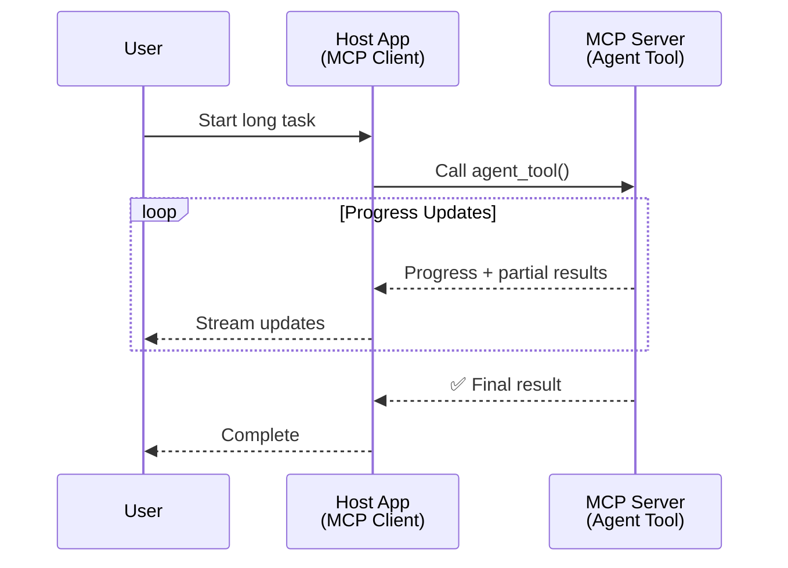
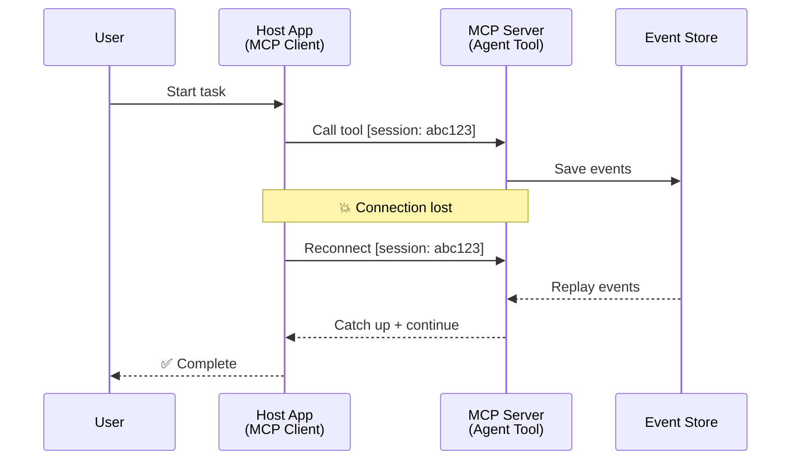
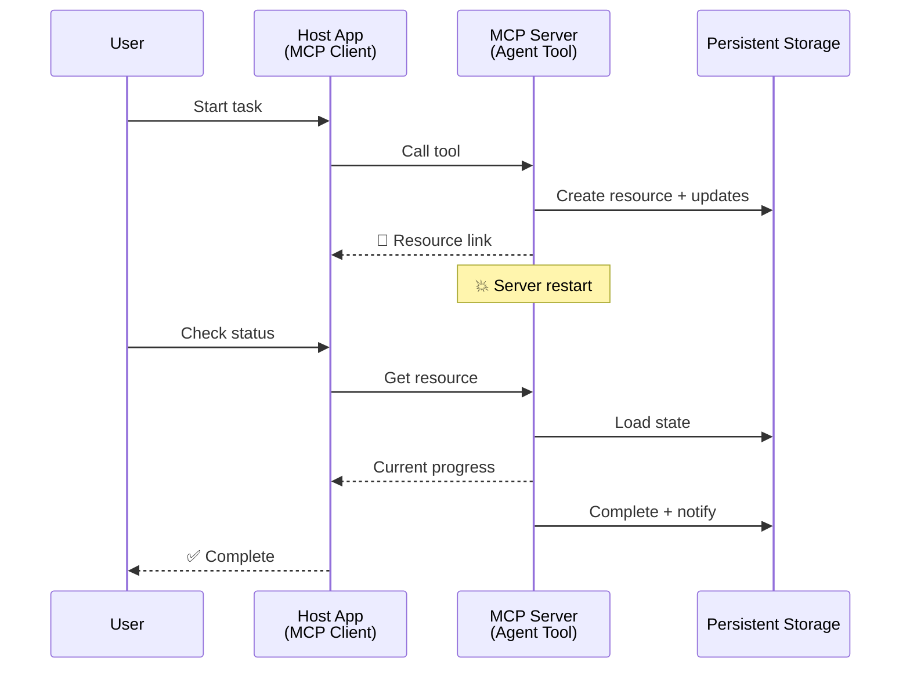
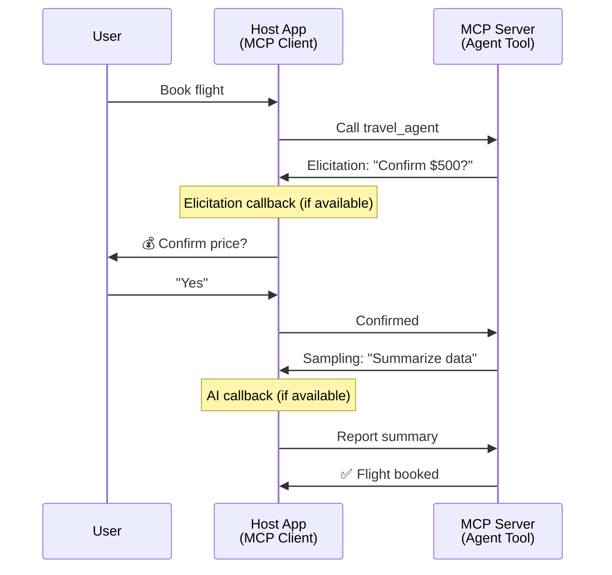
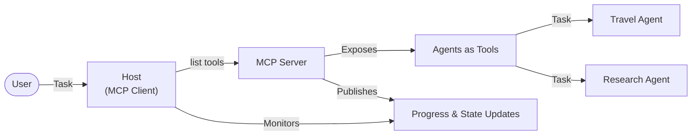

<!--
CO_OP_TRANSLATOR_METADATA:
{
  "original_hash": "5cc6836626047aa055e8960c8484a7d0",
  "translation_date": "2025-08-30T14:47:43+00:00",
  "source_file": "11-agentic-protocols/code_samples/mcp-agents/README.md",
  "language_code": "pt"
}
-->
# Construção de Sistemas de Comunicação entre Agentes com MCP

> Resumo - É possível construir comunicação entre agentes com MCP? Sim!

O MCP evoluiu significativamente além do seu objetivo original de "fornecer contexto para LLMs". Com melhorias recentes, incluindo [streams retomáveis](https://modelcontextprotocol.io/docs/concepts/transports#resumability-and-redelivery), [elicitação](https://modelcontextprotocol.io/specification/2025-06-18/client/elicitation), [amostragem](https://modelcontextprotocol.io/specification/2025-06-18/client/sampling) e notificações ([progresso](https://modelcontextprotocol.io/specification/2025-06-18/basic/utilities/progress) e [recursos](https://modelcontextprotocol.io/specification/2025-06-18/schema#resourceupdatednotification)), o MCP agora oferece uma base robusta para construir sistemas complexos de comunicação entre agentes.

## O Equívoco sobre Agentes/Ferramentas

À medida que mais desenvolvedores exploram ferramentas com comportamentos de agentes (executam por longos períodos, podem exigir entrada adicional durante a execução, etc.), um equívoco comum é que o MCP é inadequado, principalmente porque os primeiros exemplos de sua primitiva de ferramentas focavam em padrões simples de solicitação-resposta.

Essa percepção está desatualizada. A especificação do MCP foi significativamente aprimorada nos últimos meses com capacidades que preenchem a lacuna para construir comportamentos de agentes de longa duração:

- **Streaming e Resultados Parciais**: Atualizações de progresso em tempo real durante a execução
- **Retomabilidade**: Clientes podem se reconectar e continuar após desconexões
- **Durabilidade**: Resultados sobrevivem a reinícios do servidor (por exemplo, via links de recursos)
- **Interações Multi-turn**: Entrada interativa durante a execução via elicitação e amostragem

Esses recursos podem ser combinados para habilitar aplicações complexas de agentes e multi-agentes, todas implantadas no protocolo MCP.

Para referência, nos referiremos a um agente como uma "ferramenta" disponível em um servidor MCP. Isso implica a existência de uma aplicação host que implementa um cliente MCP que estabelece uma sessão com o servidor MCP e pode chamar o agente.

## O que Torna uma Ferramenta MCP "Agente"?

Antes de mergulhar na implementação, vamos estabelecer quais capacidades de infraestrutura são necessárias para suportar agentes de longa duração.

> Definiremos um agente como uma entidade capaz de operar autonomamente por períodos prolongados, capaz de lidar com tarefas complexas que podem exigir múltiplas interações ou ajustes com base em feedback em tempo real.

### 1. Streaming e Resultados Parciais

Padrões tradicionais de solicitação-resposta não funcionam para tarefas de longa duração. Agentes precisam fornecer:

- Atualizações de progresso em tempo real
- Resultados intermediários

**Suporte MCP**: Notificações de atualização de recursos permitem o streaming de resultados parciais, embora isso exija um design cuidadoso para evitar conflitos com o modelo de solicitação/resposta 1:1 do JSON-RPC.

| Recurso                     | Caso de Uso                                                                                                                                                                       | Suporte MCP                                                                                |
| --------------------------- | -------------------------------------------------------------------------------------------------------------------------------------------------------------------------------- | ------------------------------------------------------------------------------------------ |
| Atualizações de Progresso em Tempo Real | O usuário solicita uma tarefa de migração de código. O agente transmite o progresso: "10% - Analisando dependências... 25% - Convertendo arquivos TypeScript... 50% - Atualizando imports..."          | ✅ Notificações de progresso                                                                  |
| Resultados Parciais         | Tarefa "Gerar um livro" transmite resultados parciais, por exemplo, 1) Esboço do arco da história, 2) Lista de capítulos, 3) Cada capítulo conforme concluído. O host pode inspecionar, cancelar ou redirecionar em qualquer estágio. | ✅ Notificações podem ser "estendidas" para incluir resultados parciais, veja propostas nos PRs 383, 776 |

<div align="center" style="font-style: italic; font-size: 0.95em; margin-bottom: 0.5em;">
<strong>Figura 1:</strong> Este diagrama ilustra como um agente MCP transmite atualizações de progresso em tempo real e resultados parciais para a aplicação host durante uma tarefa de longa duração, permitindo que o usuário monitore a execução em tempo real.
</div>



### 2. Retomabilidade

Agentes devem lidar com interrupções de rede de forma eficiente:

- Reconectar após desconexão (do cliente)
- Continuar de onde pararam (retransmissão de mensagens)

**Suporte MCP**: O transporte StreamableHTTP do MCP atualmente suporta retomada de sessão e retransmissão de mensagens com IDs de sessão e IDs de último evento. O ponto importante aqui é que o servidor deve implementar um EventStore que permita replays de eventos na reconexão do cliente.  
Note que há uma proposta da comunidade (PR #975) que explora streams retomáveis independentes de transporte.

| Recurso      | Caso de Uso                                                                                                                                                   | Suporte MCP                                                                |
| ------------ | ---------------------------------------------------------------------------------------------------------------------------------------------------------- | -------------------------------------------------------------------------- |
| Retomabilidade | Cliente desconecta durante uma tarefa de longa duração. Após reconexão, a sessão é retomada com eventos perdidos retransmitidos, continuando sem interrupções. | ✅ Transporte StreamableHTTP com IDs de sessão, retransmissão de eventos e EventStore |

<div align="center" style="font-style: italic; font-size: 0.95em; margin-bottom: 0.5em;">
<strong>Figura 2:</strong> Este diagrama mostra como o transporte StreamableHTTP do MCP e o EventStore permitem retomada de sessão sem interrupções: se o cliente desconectar, ele pode se reconectar e retransmitir eventos perdidos, continuando a tarefa sem perda de progresso.
</div>



### 3. Durabilidade

Agentes de longa duração precisam de estado persistente:

- Resultados sobrevivem a reinícios do servidor
- Status pode ser recuperado fora da banda
- Rastreamento de progresso entre sessões

**Suporte MCP**: O MCP agora suporta um tipo de retorno de link de recurso para chamadas de ferramentas. Hoje, um padrão possível é projetar uma ferramenta que cria um recurso e retorna imediatamente um link de recurso. A ferramenta pode continuar a tratar a tarefa em segundo plano e atualizar o recurso. Por sua vez, o cliente pode optar por consultar o estado desse recurso para obter resultados parciais ou completos (com base nas atualizações de recursos que o servidor fornece) ou assinar o recurso para notificações de atualização.

Uma limitação aqui é que consultar recursos ou assinar atualizações pode consumir recursos com implicações em escala. Há uma proposta aberta da comunidade (incluindo #992) explorando a possibilidade de incluir webhooks ou gatilhos que o servidor pode chamar para notificar o cliente/aplicação host sobre atualizações.

| Recurso    | Caso de Uso                                                                                                                                        | Suporte MCP                                                        |
| ---------- | ----------------------------------------------------------------------------------------------------------------------------------------------- | ------------------------------------------------------------------ |
| Durabilidade | O servidor falha durante uma tarefa de migração de dados. Resultados e progresso sobrevivem ao reinício, o cliente pode verificar o status e continuar a partir do recurso persistente. | ✅ Links de recursos com armazenamento persistente e notificações de status |

Hoje, um padrão comum é projetar uma ferramenta que cria um recurso e retorna imediatamente um link de recurso. A ferramenta pode, em segundo plano, tratar a tarefa, emitir notificações de recursos que servem como atualizações de progresso ou incluir resultados parciais, e atualizar o conteúdo no recurso conforme necessário.

<div align="center" style="font-style: italic; font-size: 0.95em; margin-bottom: 0.5em;">
<strong>Figura 3:</strong> Este diagrama demonstra como agentes MCP usam recursos persistentes e notificações de status para garantir que tarefas de longa duração sobrevivam a reinícios do servidor, permitindo que os clientes verifiquem o progresso e recuperem resultados mesmo após falhas.
</div>



### 4. Interações Multi-turn

Agentes frequentemente precisam de entrada adicional durante a execução:

- Esclarecimento ou aprovação humana
- Assistência de IA para decisões complexas
- Ajuste dinâmico de parâmetros

**Suporte MCP**: Totalmente suportado via amostragem (para entrada de IA) e elicitação (para entrada humana).

| Recurso                 | Caso de Uso                                                                                                                                     | Suporte MCP                                           |
| ----------------------- | -------------------------------------------------------------------------------------------------------------------------------------------- | ----------------------------------------------------- |
| Interações Multi-turn | Agente de reserva de viagens solicita confirmação de preço ao usuário, depois pede à IA para resumir dados de viagem antes de concluir a transação de reserva. | ✅ Elicitação para entrada humana, amostragem para entrada de IA |

<div align="center" style="font-style: italic; font-size: 0.95em; margin-bottom: 0.5em;">
<strong>Figura 4:</strong> Este diagrama mostra como agentes MCP podem solicitar interativamente entrada humana ou assistência de IA durante a execução, suportando fluxos de trabalho complexos e interativos, como confirmações e tomada de decisões dinâmicas.
</div>



## Implementação de Agentes de Longa Duração no MCP - Visão Geral do Código

Como parte deste artigo, fornecemos um [repositório de código](https://github.com/victordibia/ai-tutorials/tree/main/MCP%20Agents) que contém uma implementação completa de agentes de longa duração usando o SDK Python do MCP com transporte StreamableHTTP para retomada de sessão e retransmissão de mensagens. A implementação demonstra como as capacidades do MCP podem ser combinadas para habilitar comportamentos sofisticados de agentes.

Especificamente, implementamos um servidor com duas ferramentas principais de agentes:

- **Agente de Viagens** - Simula um serviço de reserva de viagens com confirmação de preço via elicitação
- **Agente de Pesquisa** - Realiza tarefas de pesquisa com resumos assistidos por IA via amostragem

Ambos os agentes demonstram atualizações de progresso em tempo real, confirmações interativas e capacidades completas de retomada de sessão.

### Conceitos Principais de Implementação

As seções a seguir mostram a implementação do agente no lado do servidor e o tratamento do host no lado do cliente para cada capacidade:

#### Streaming e Atualizações de Progresso - Status da Tarefa em Tempo Real

O streaming permite que agentes forneçam atualizações de progresso em tempo real durante tarefas de longa duração, mantendo os usuários informados sobre o status da tarefa e resultados intermediários.

**Implementação no Servidor (agente envia notificações de progresso):**

```python
# From server/server.py - Travel agent sending progress updates
for i, step in enumerate(steps):
    await ctx.session.send_progress_notification(
        progress_token=ctx.request_id,
        progress=i * 25,
        total=100,
        message=step,
        related_request_id=str(ctx.request_id)
    )
    await anyio.sleep(2)  # Simulate work

# Alternative: Log messages for detailed step-by-step updates
await ctx.session.send_log_message(
    level="info",
    data=f"Processing step {current_step}/{steps} ({progress_percent}%)",
    logger="long_running_agent",
    related_request_id=ctx.request_id,
)
```

**Implementação no Cliente (host recebe atualizações de progresso):**

```python
# From client/client.py - Client handling real-time notifications
async def message_handler(message) -> None:
    if isinstance(message, types.ServerNotification):
        if isinstance(message.root, types.LoggingMessageNotification):
            console.print(f"📡 [dim]{message.root.params.data}[/dim]")
        elif isinstance(message.root, types.ProgressNotification):
            progress = message.root.params
            console.print(f"🔄 [yellow]{progress.message} ({progress.progress}/{progress.total})[/yellow]")

# Register message handler when creating session
async with ClientSession(
    read_stream, write_stream,
    message_handler=message_handler
) as session:
```

#### Elicitação - Solicitação de Entrada do Usuário

A elicitação permite que agentes solicitem entrada do usuário durante a execução. Isso é essencial para confirmações, esclarecimentos ou aprovações durante tarefas de longa duração.

**Implementação no Servidor (agente solicita confirmação):**

```python
# From server/server.py - Travel agent requesting price confirmation
elicit_result = await ctx.session.elicit(
    message=f"Please confirm the estimated price of $1200 for your trip to {destination}",
    requestedSchema=PriceConfirmationSchema.model_json_schema(),
    related_request_id=ctx.request_id,
)

if elicit_result and elicit_result.action == "accept":
    # Continue with booking
    logger.info(f"User confirmed price: {elicit_result.content}")
elif elicit_result and elicit_result.action == "decline":
    # Cancel the booking
    booking_cancelled = True
```

**Implementação no Cliente (host fornece callback de elicitação):**

```python
# From client/client.py - Client handling elicitation requests
async def elicitation_callback(context, params):
    console.print(f"💬 Server is asking for confirmation:")
    console.print(f"   {params.message}")

    response = console.input("Do you accept? (y/n): ").strip().lower()

    if response in ['y', 'yes']:
        return types.ElicitResult(
            action="accept",
            content={"confirm": True, "notes": "Confirmed by user"}
        )
    else:
        return types.ElicitResult(
            action="decline",
            content={"confirm": False, "notes": "Declined by user"}
        )

# Register the callback when creating the session
async with ClientSession(
    read_stream, write_stream,
    elicitation_callback=elicitation_callback
) as session:
```

#### Amostragem - Solicitação de Assistência de IA

A amostragem permite que agentes solicitem assistência de LLM para decisões complexas ou geração de conteúdo durante a execução. Isso habilita fluxos de trabalho híbridos humano-IA.

**Implementação no Servidor (agente solicita assistência de IA):**

```python
# From server/server.py - Research agent requesting AI summary
sampling_result = await ctx.session.create_message(
    messages=[
        SamplingMessage(
            role="user",
            content=TextContent(type="text", text=f"Please summarize the key findings for research on: {topic}")
        )
    ],
    max_tokens=100,
    related_request_id=ctx.request_id,
)

if sampling_result and sampling_result.content:
    if sampling_result.content.type == "text":
        sampling_summary = sampling_result.content.text
        logger.info(f"Received sampling summary: {sampling_summary}")
```

**Implementação no Cliente (host fornece callback de amostragem):**

```python
# From client/client.py - Client handling sampling requests
async def sampling_callback(context, params):
    message_text = params.messages[0].content.text if params.messages else 'No message'
    console.print(f"🧠 Server requested sampling: {message_text}")

    # In a real application, this could call an LLM API
    # For demo purposes, we provide a mock response
    mock_response = "Based on current research, MCP has evolved significantly..."

    return types.CreateMessageResult(
        role="assistant",
        content=types.TextContent(type="text", text=mock_response),
        model="interactive-client",
        stopReason="endTurn"
    )

# Register the callback when creating the session
async with ClientSession(
    read_stream, write_stream,
    sampling_callback=sampling_callback,
    elicitation_callback=elicitation_callback
) as session:
```

#### Retomabilidade - Continuidade de Sessão em Caso de Desconexões

A retomabilidade garante que tarefas de agentes de longa duração possam sobreviver a desconexões do cliente e continuar sem interrupções após reconexão. Isso é implementado por meio de event stores e tokens de retomada.

**Implementação do Event Store (servidor mantém estado da sessão):**

```python
# From server/event_store.py - Simple in-memory event store
class SimpleEventStore(EventStore):
    def __init__(self):
        self._events: list[tuple[StreamId, EventId, JSONRPCMessage]] = []
        self._event_id_counter = 0

    async def store_event(self, stream_id: StreamId, message: JSONRPCMessage) -> EventId:
        """Store an event and return its ID."""
        self._event_id_counter += 1
        event_id = str(self._event_id_counter)
        self._events.append((stream_id, event_id, message))
        return event_id

    async def replay_events_after(self, last_event_id: EventId, send_callback: EventCallback) -> StreamId | None:
        """Replay events after the specified ID for resumption."""
        # Find events after the last known event and replay them
        for _, event_id, message in self._events[start_index:]:
            await send_callback(EventMessage(message, event_id))

# From server/server.py - Passing event store to session manager
def create_server_app(event_store: Optional[EventStore] = None) -> Starlette:
    server = ResumableServer()

    # Create session manager with event store for resumption
    session_manager = StreamableHTTPSessionManager(
        app=server,
        event_store=event_store,  # Event store enables session resumption
        json_response=False,
        security_settings=security_settings,
    )

    return Starlette(routes=[Mount("/mcp", app=session_manager.handle_request)])

# Usage: Initialize with event store
event_store = SimpleEventStore()
app = create_server_app(event_store)
```

**Metadados do Cliente com Token de Retomada (cliente reconecta usando estado armazenado):**

```python
# From client/client.py - Client resumption with metadata
if existing_tokens and existing_tokens.get("resumption_token"):
    # Use existing resumption token to continue where we left off
    metadata = ClientMessageMetadata(
        resumption_token=existing_tokens["resumption_token"],
    )
else:
    # Create callback to save resumption token when received
    def enhanced_callback(token: str):
        protocol_version = getattr(session, 'protocol_version', None)
        token_manager.save_tokens(session_id, token, protocol_version, command, args)

    metadata = ClientMessageMetadata(
        on_resumption_token_update=enhanced_callback,
    )

# Send request with resumption metadata
result = await session.send_request(
    types.ClientRequest(
        types.CallToolRequest(
            method="tools/call",
            params=types.CallToolRequestParams(name=command, arguments=args)
        )
    ),
    types.CallToolResult,
    metadata=metadata,
)
```

A aplicação host mantém IDs de sessão e tokens de retomada localmente, permitindo que se reconecte a sessões existentes sem perder progresso ou estado.

### Organização do Código

<div align="center" style="font-style: italic; font-size: 0.95em; margin-bottom: 0.5em;">
<strong>Figura 5:</strong> Arquitetura do sistema de agentes baseado em MCP
</div>



**Arquivos Principais:**

- **`server/server.py`** - Servidor MCP retomável com agentes de viagens e pesquisa que demonstram elicitação, amostragem e atualizações de progresso
- **`client/client.py`** - Aplicação host interativa com suporte a retomada, manipuladores de callback e gerenciamento de tokens
- **`server/event_store.py`** - Implementação de Event Store que habilita retomada de sessão e retransmissão de mensagens

## Extensão para Comunicação Multi-Agente no MCP

A implementação acima pode ser estendida para sistemas multi-agentes ao aprimorar a inteligência e o escopo da aplicação host:

- **Decomposição Inteligente de Tarefas**: O host analisa solicitações complexas do usuário e as divide em subtarefas para diferentes agentes especializados
- **Coordenação Multi-Servidor**: O host mantém conexões com múltiplos servidores MCP, cada um expondo diferentes capacidades de agentes
- **Gerenciamento de Estado de Tarefas**: O host rastreia progresso em múltiplas tarefas de agentes concorrentes, lidando com dependências e sequenciamento
- **Resiliência e Repetições**: O host gerencia falhas, implementa lógica de repetição e redireciona tarefas quando agentes ficam indisponíveis
- **Síntese de Resultados**: O host combina saídas de múltiplos agentes em resultados finais coerentes

O host evolui de um cliente simples para um orquestrador inteligente, coordenando capacidades distribuídas de agentes enquanto mantém a mesma base do protocolo MCP.

## Conclusão

As capacidades aprimoradas do MCP - notificações de recursos, elicitação/amostragem, streams retomáveis e recursos persistentes - habilitam interações complexas entre agentes enquanto mantêm a simplicidade do protocolo.

## Começando

Pronto para construir seu próprio sistema de comunicação entre agentes? Siga estes passos:

### 1. Execute a Demonstração

```bash
# Start the server with event store for resumption
python -m server.server --port 8006

# In another terminal, run the interactive client
python -m client.client --url http://127.0.0.1:8006/mcp
```

**Comandos disponíveis no modo interativo:**

- `travel_agent` - Reserve viagens com confirmação de preço via elicitação
- `research_agent` - Pesquise tópicos com resumos assistidos por IA via amostragem
- `list` - Mostre todas as ferramentas disponíveis
- `clean-tokens` - Limpe tokens de retomada
- `help` - Mostre ajuda detalhada sobre comandos
- `quit` - Saia do cliente

### 2. Teste as Capacidades de Retomada

- Inicie um agente de longa duração (por exemplo, `travel_agent`)
- Interrompa o cliente durante a execução (Ctrl+C)
- Reinicie o cliente - ele retomará automaticamente de onde parou

### 3. Explore e Expanda

- **Explore os exemplos**: Confira este [mcp-agents](https://github.com/victordibia/ai-tutorials/tree/main/MCP%20Agents)
- **Participe da comunidade**: Participe das discussões sobre MCP no GitHub
- **Experimente**: Comece com uma tarefa simples de longa duração e adicione gradualmente streaming, retomabilidade e coordenação multi-agente

Isso demonstra como o MCP habilita comportamentos inteligentes de agentes enquanto mantém a simplicidade baseada em ferramentas.

No geral, a especificação do protocolo MCP está evoluindo rapidamente; o leitor é encorajado a revisar o site oficial de documentação para as atualizações mais recentes - https://modelcontextprotocol.io/introduction

---

**Aviso Legal**:  
Este documento foi traduzido utilizando o serviço de tradução por IA [Co-op Translator](https://github.com/Azure/co-op-translator). Embora nos esforcemos para garantir a precisão, esteja ciente de que traduções automáticas podem conter erros ou imprecisões. O documento original na sua língua nativa deve ser considerado a fonte oficial. Para informações críticas, recomenda-se uma tradução profissional realizada por humanos. Não nos responsabilizamos por quaisquer mal-entendidos ou interpretações incorretas resultantes do uso desta tradução.