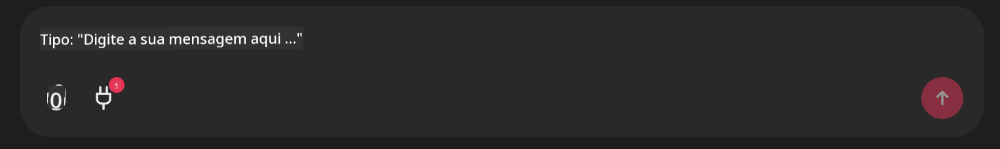

<!--
CO_OP_TRANSLATOR_METADATA:
{
  "original_hash": "9bf0395cbc541ce8db2a9699c8678dfc",
  "translation_date": "2025-07-12T14:21:53+00:00",
  "source_file": "11-mcp/code_samples/github-mcp/README.md",
  "language_code": "pt"
}
-->
# Exemplo de Servidor Github MCP

## Descrição

Esta foi uma demonstração criada para o AI Agents Hackathon organizado pelo Microsoft Reactor.

A ferramenta é usada para recomendar projetos de hackathon com base nos repositórios Github de um utilizador.  
Isto é feito através de:

1. **Github Agent** - Utiliza o Github MCP Server para obter repositórios e informações sobre esses repositórios.  
2. **Hackathon Agent** - Usa os dados do Github Agent para criar ideias criativas de projetos para hackathon, baseando-se nos projetos, linguagens usadas pelo utilizador e nas categorias do AI Agents hackathon.  
3. **Events Agent** - Com base na sugestão do hackathon agent, o events agent recomenda eventos relevantes da série AI Agent Hackathon.

## Executar o código

### Variáveis de Ambiente

Esta demo utiliza o Azure Open AI Service, Semantic Kernel, o Github MCP Server e o Azure AI Search.

Certifique-se de que tem as variáveis de ambiente corretas definidas para usar estas ferramentas:

```python
AZURE_OPENAI_CHAT_DEPLOYMENT_NAME=""
AZURE_OPENAI_EMBEDDING_DEPLOYMENT_NAME=""
AZURE_OPENAI_ENDPOINT=""
AZURE_OPENAI_API_KEY=""
AZURE_OPENAI_API_VERSION=""
AZURE_SEARCH_SERVICE_ENDPOINT=""
AZURE_SEARCH_API_KEY=""
```

## Executar o Servidor Chainlit

Para ligar ao MCP server, esta demo usa o Chainlit como interface de chat.

Para iniciar o servidor, use o seguinte comando no seu terminal:

```bash
chainlit run app.py -w
```

Isto deverá iniciar o seu servidor Chainlit em `localhost:8000` e também preencher o seu Azure AI Search Index com o conteúdo do `event-descriptions.md`.

## Ligar ao MCP Server

Para ligar ao Github MCP Server, selecione o ícone de "plug" por baixo da caixa de chat "Type your message here..":



A partir daí, pode clicar em "Connect an MCP" para adicionar o comando que liga ao Github MCP Server:

```bash
npx -y @modelcontextprotocol/server-github --env GITHUB_PERSONAL_ACCESS_TOKEN=[YOUR PERSONAL ACCESS TOKEN]
```

Substitua "[YOUR PERSONAL ACCESS TOKEN]" pelo seu Token de Acesso Pessoal real.

Depois de ligado, deverá ver um (1) ao lado do ícone do plug para confirmar que está ligado. Caso contrário, tente reiniciar o servidor chainlit com `chainlit run app.py -w`.

## Usar a Demo

Para iniciar o fluxo de trabalho do agente que recomenda projetos para hackathon, pode escrever uma mensagem como:

"Recommend hackathon projects for the Github user koreyspace"

O Router Agent irá analisar o seu pedido e determinar qual a combinação de agentes (GitHub, Hackathon e Events) mais adequada para tratar da sua consulta. Os agentes trabalham em conjunto para fornecer recomendações completas baseadas na análise dos repositórios do GitHub, ideação de projetos e eventos tecnológicos relevantes.

**Aviso Legal**:  
Este documento foi traduzido utilizando o serviço de tradução automática [Co-op Translator](https://github.com/Azure/co-op-translator). Embora nos esforcemos pela precisão, por favor tenha em conta que traduções automáticas podem conter erros ou imprecisões. O documento original na sua língua nativa deve ser considerado a fonte autorizada. Para informações críticas, recomenda-se tradução profissional humana. Não nos responsabilizamos por quaisquer mal-entendidos ou interpretações incorretas decorrentes da utilização desta tradução.