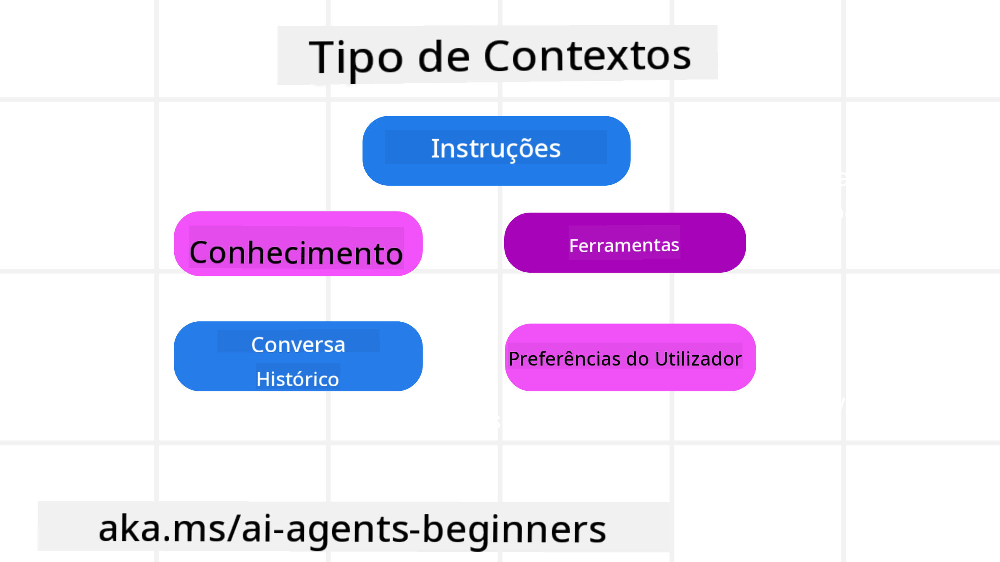
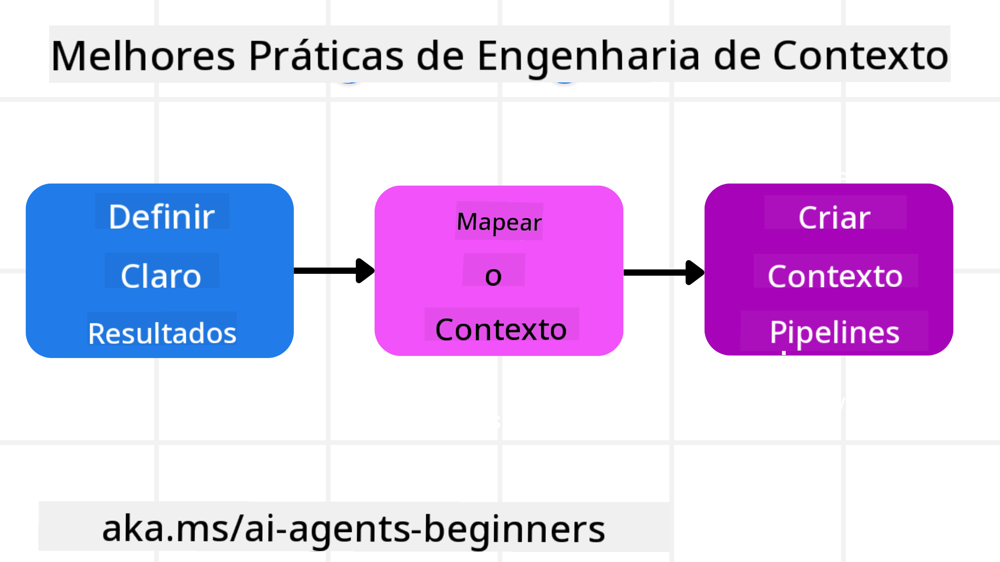

<!--
CO_OP_TRANSLATOR_METADATA:
{
  "original_hash": "cb7e50f471905ce6fdb92a30269a7a98",
  "translation_date": "2025-09-04T10:00:31+00:00",
  "source_file": "12-context-engineering/README.md",
  "language_code": "pt"
}
-->
# Engenharia de Contexto para Agentes de IA

> _(Clique na imagem acima para assistir ao vídeo desta lição)_

Compreender a complexidade da aplicação para a qual está a construir um agente de IA é essencial para criar um agente fiável. Precisamos de desenvolver agentes de IA que gerem informações de forma eficaz para responder a necessidades complexas, indo além da engenharia de prompts.

Nesta lição, vamos explorar o que é a engenharia de contexto e o seu papel na construção de agentes de IA.

## Introdução

Esta lição abordará:

• **O que é Engenharia de Contexto** e por que é diferente da engenharia de prompts.

• **Estratégias para uma Engenharia de Contexto eficaz**, incluindo como escrever, selecionar, comprimir e isolar informações.

• **Falhas Comuns de Contexto** que podem prejudicar o desempenho do seu agente de IA e como corrigi-las.

## Objetivos de Aprendizagem

Após completar esta lição, saberá como:

• **Definir engenharia de contexto** e diferenciá-la da engenharia de prompts.

• **Identificar os componentes-chave do contexto** em aplicações de Modelos de Linguagem de Grande Escala (LLM).

• **Aplicar estratégias para escrever, selecionar, comprimir e isolar o contexto** para melhorar o desempenho do agente.

• **Reconhecer falhas comuns de contexto**, como envenenamento, distração, confusão e conflito, e implementar técnicas de mitigação.

## O que é Engenharia de Contexto?

Para agentes de IA, o contexto é o que orienta o planeamento do agente para tomar determinadas ações. Engenharia de Contexto é a prática de garantir que o agente de IA tenha as informações certas para completar o próximo passo da tarefa. A janela de contexto tem um tamanho limitado, por isso, como criadores de agentes, precisamos de construir sistemas e processos para gerir a adição, remoção e condensação das informações na janela de contexto.

### Engenharia de Prompts vs Engenharia de Contexto

A engenharia de prompts foca-se num conjunto único de instruções estáticas para orientar eficazmente os agentes de IA com um conjunto de regras. A engenharia de contexto trata de gerir um conjunto dinâmico de informações, incluindo o prompt inicial, para garantir que o agente de IA tenha o que precisa ao longo do tempo. A ideia principal da engenharia de contexto é tornar este processo repetível e fiável.

### Tipos de Contexto

É importante lembrar que o contexto não é apenas uma coisa. As informações de que o agente de IA necessita podem vir de várias fontes diferentes, e cabe a nós garantir que o agente tenha acesso a essas fontes:

Os tipos de contexto que um agente de IA pode precisar de gerir incluem:

• **Instruções:** São como as "regras" do agente – prompts, mensagens do sistema, exemplos few-shot (mostrando ao agente como fazer algo) e descrições de ferramentas que pode usar. Aqui é onde a engenharia de prompts se combina com a engenharia de contexto.

• **Conhecimento:** Abrange factos, informações recuperadas de bases de dados ou memórias de longo prazo acumuladas pelo agente. Inclui a integração de um sistema de Geração com Recuperação Aumentada (RAG) se o agente precisar de acesso a diferentes repositórios de conhecimento e bases de dados.

• **Ferramentas:** São as definições de funções externas, APIs e servidores MCP que o agente pode chamar, juntamente com o feedback (resultados) que obtém ao utilizá-las.

• **Histórico de Conversação:** O diálogo contínuo com um utilizador. Com o tempo, essas conversas tornam-se mais longas e complexas, ocupando espaço na janela de contexto.

• **Preferências do Utilizador:** Informações aprendidas sobre os gostos ou desgostos de um utilizador ao longo do tempo. Podem ser armazenadas e utilizadas para tomar decisões importantes que ajudem o utilizador.

## Estratégias para uma Engenharia de Contexto Eficaz

### Estratégias de Planeamento

Uma boa engenharia de contexto começa com um bom planeamento. Aqui está uma abordagem que o ajudará a começar a aplicar o conceito de engenharia de contexto:

1. **Definir Resultados Claros** - Os resultados das tarefas atribuídas aos agentes de IA devem ser claramente definidos. Responda à pergunta: "Como será o mundo quando o agente de IA terminar a sua tarefa?" Ou seja, que mudança, informação ou resposta o utilizador deve ter após interagir com o agente de IA.

2. **Mapear o Contexto** - Depois de definir os resultados do agente de IA, deve responder à pergunta: "Que informações o agente de IA precisa para completar esta tarefa?" Assim, pode começar a mapear o contexto de onde essas informações podem ser localizadas.

3. **Criar Pipelines de Contexto** - Agora que sabe onde estão as informações, deve responder à pergunta: "Como o agente obterá essas informações?" Isto pode ser feito de várias formas, incluindo RAG, uso de servidores MCP e outras ferramentas.

### Estratégias Práticas

O planeamento é importante, mas uma vez que as informações começam a fluir para a janela de contexto do agente, precisamos de ter estratégias práticas para geri-las:

#### Gerir o Contexto

Embora algumas informações sejam adicionadas automaticamente à janela de contexto, a engenharia de contexto trata de assumir um papel mais ativo na gestão dessas informações, o que pode ser feito através de algumas estratégias:

1. **Bloco de Notas do Agente**  
Permite que o agente de IA tome notas sobre informações relevantes relacionadas com as tarefas atuais e interações com o utilizador durante uma única sessão. Estas notas devem existir fora da janela de contexto, num ficheiro ou objeto de runtime que o agente possa recuperar mais tarde, se necessário.

2. **Memórias**  
Os blocos de notas são úteis para gerir informações fora da janela de contexto de uma única sessão. As memórias permitem que os agentes armazenem e recuperem informações relevantes ao longo de várias sessões. Isto pode incluir resumos, preferências do utilizador e feedback para melhorias futuras.

3. **Compressão de Contexto**  
Quando a janela de contexto cresce e se aproxima do limite, podem ser utilizadas técnicas como sumarização e corte. Isto inclui manter apenas as informações mais relevantes ou remover mensagens mais antigas.

4. **Sistemas Multi-Agente**  
Desenvolver sistemas multi-agente é uma forma de engenharia de contexto, pois cada agente tem a sua própria janela de contexto. Como esse contexto é partilhado e passado entre diferentes agentes é algo a planear ao construir esses sistemas.

5. **Ambientes de Sandbox**  
Se um agente precisar de executar algum código ou processar grandes quantidades de informações num documento, isso pode consumir muitos tokens para processar os resultados. Em vez de armazenar tudo na janela de contexto, o agente pode usar um ambiente de sandbox que execute o código e apenas leia os resultados e outras informações relevantes.

6. **Objetos de Estado de Runtime**  
Isto é feito criando contêineres de informações para gerir situações em que o agente precisa de ter acesso a determinadas informações. Para uma tarefa complexa, isto permitiria ao agente armazenar os resultados de cada subtarefa passo a passo, mantendo o contexto ligado apenas à subtarefa específica.

### Exemplo de Engenharia de Contexto

Imagine que queremos que um agente de IA **"Reserve-me uma viagem para Paris."**

• Um agente simples que utiliza apenas engenharia de prompts pode responder: **"Certo, quando gostaria de ir para Paris?"**. Ele apenas processou a sua pergunta direta no momento em que foi feita.

• Um agente que utiliza as estratégias de engenharia de contexto abordadas faria muito mais. Antes mesmo de responder, o seu sistema poderia:

  ◦ **Verificar o seu calendário** para datas disponíveis (recuperando dados em tempo real).

 ◦ **Recordar preferências de viagens anteriores** (a partir de memórias de longo prazo), como a sua companhia aérea preferida, orçamento ou se prefere voos diretos.

 ◦ **Identificar ferramentas disponíveis** para reserva de voos e hotéis.

- Então, uma resposta de exemplo poderia ser: **"Olá [Seu Nome]! Vejo que está livre na primeira semana de outubro. Posso procurar voos diretos para Paris na [Companhia Aérea Preferida] dentro do seu orçamento habitual de [Orçamento]?"**. Esta resposta mais rica e consciente do contexto demonstra o poder da engenharia de contexto.

## Falhas Comuns de Contexto

### Envenenamento de Contexto

**O que é:** Quando uma alucinação (informação falsa gerada pelo LLM) ou um erro entra no contexto e é repetidamente referenciado, levando o agente a perseguir objetivos impossíveis ou desenvolver estratégias sem sentido.

**O que fazer:** Implementar **validação de contexto** e **quarentena**. Validar informações antes de adicioná-las à memória de longo prazo. Se for detetado um possível envenenamento, iniciar novos threads de contexto para evitar que a informação errada se espalhe.

**Exemplo de Reserva de Viagem:** O seu agente alucina um **voo direto de um pequeno aeroporto local para uma cidade internacional distante** que não oferece voos internacionais. Este detalhe inexistente é guardado no contexto. Mais tarde, quando pede ao agente para reservar, ele continua a tentar encontrar bilhetes para esta rota impossível, levando a erros repetidos.

**Solução:** Implementar um passo que **valide a existência de voos e rotas com uma API em tempo real** _antes_ de adicionar o detalhe do voo ao contexto de trabalho do agente. Se a validação falhar, a informação errada é "quarentenada" e não é usada novamente.

### Distração de Contexto

**O que é:** Quando o contexto se torna tão grande que o modelo foca-se demasiado na história acumulada, em vez de usar o que aprendeu durante o treino, levando a ações repetitivas ou inúteis. Os modelos podem começar a cometer erros mesmo antes da janela de contexto estar cheia.

**O que fazer:** Usar **sumarização de contexto**. Periodicamente comprimir informações acumuladas em resumos mais curtos, mantendo detalhes importantes enquanto remove o histórico redundante. Isto ajuda a "reiniciar" o foco.

**Exemplo de Reserva de Viagem:** Tem discutido vários destinos de sonho durante muito tempo, incluindo um relato detalhado da sua viagem de mochila há dois anos. Quando finalmente pede para **"encontrar-me um voo barato para o próximo mês"**, o agente fica preso nos detalhes antigos e irrelevantes, perguntando sobre o seu equipamento de mochila ou itinerários passados, negligenciando o pedido atual.

**Solução:** Após um certo número de interações ou quando o contexto cresce demasiado, o agente deve **resumir as partes mais recentes e relevantes da conversa** – focando-se nas suas datas e destino atuais – e usar esse resumo condensado para a próxima chamada ao LLM, descartando o histórico menos relevante.

### Confusão de Contexto

**O que é:** Quando o contexto desnecessário, frequentemente na forma de muitas ferramentas disponíveis, faz com que o modelo gere respostas erradas ou chame ferramentas irrelevantes. Modelos menores são especialmente propensos a isso.

**O que fazer:** Implementar **gestão de ferramentas** usando técnicas RAG. Armazenar descrições de ferramentas numa base de dados vetorial e selecionar _apenas_ as ferramentas mais relevantes para cada tarefa específica. Pesquisas mostram que limitar as seleções de ferramentas a menos de 30 é eficaz.

**Exemplo de Reserva de Viagem:** O seu agente tem acesso a dezenas de ferramentas: `book_flight`, `book_hotel`, `rent_car`, `find_tours`, `currency_converter`, `weather_forecast`, `restaurant_reservations`, etc. Pergunta, **"Qual é a melhor forma de se deslocar em Paris?"** Devido ao grande número de ferramentas, o agente fica confuso e tenta chamar `book_flight` _dentro_ de Paris ou `rent_car`, mesmo sabendo que prefere transporte público, porque as descrições das ferramentas podem sobrepor-se ou ele simplesmente não consegue discernir a melhor opção.

**Solução:** Usar **RAG sobre descrições de ferramentas**. Quando pergunta sobre deslocações em Paris, o sistema recupera dinamicamente _apenas_ as ferramentas mais relevantes, como `rent_car` ou `public_transport_info`, com base na sua consulta, apresentando um conjunto focado de ferramentas ao LLM.

### Conflito de Contexto

**O que é:** Quando informações contraditórias existem dentro do contexto, levando a raciocínios inconsistentes ou respostas finais erradas. Isto frequentemente acontece quando as informações chegam em etapas e suposições iniciais incorretas permanecem no contexto.

**O que fazer:** Usar **poda de contexto** e **descarte de informações**. A poda remove informações desatualizadas ou contraditórias à medida que novos detalhes chegam. O descarte permite ao modelo um espaço de trabalho separado para processar informações sem sobrecarregar o contexto principal.

**Exemplo de Reserva de Viagem:** Inicialmente diz ao seu agente, **"Quero voar em classe económica."** Mais tarde na conversa, muda de ideia e diz, **"Na verdade, para esta viagem, vamos de classe executiva."** Se ambas as instruções permanecerem no contexto, o agente pode receber resultados de pesquisa contraditórios ou ficar confuso sobre qual preferência priorizar.

**Solução:** Implementar **poda de contexto**. Quando uma nova instrução contradiz uma antiga, a instrução mais antiga é removida ou explicitamente substituída no contexto. Alternativamente, o agente pode usar um **bloco de notas** para reconciliar preferências contraditórias antes de decidir, garantindo que apenas a instrução final e consistente guie as suas ações.

## Tem Mais Perguntas Sobre Engenharia de Contexto?

Junte-se ao [Discord do Azure AI Foundry](https://aka.ms/ai-agents/discord) para interagir com outros aprendizes, participar em sessões de esclarecimento e obter respostas às suas perguntas sobre agentes de IA.

---

**Aviso Legal**:  
Este documento foi traduzido utilizando o serviço de tradução automática [Co-op Translator](https://github.com/Azure/co-op-translator). Embora nos esforcemos para garantir a precisão, esteja ciente de que traduções automáticas podem conter erros ou imprecisões. O documento original na sua língua nativa deve ser considerado a fonte oficial. Para informações críticas, recomenda-se uma tradução profissional realizada por humanos. Não nos responsabilizamos por quaisquer mal-entendidos ou interpretações incorretas resultantes do uso desta tradução.