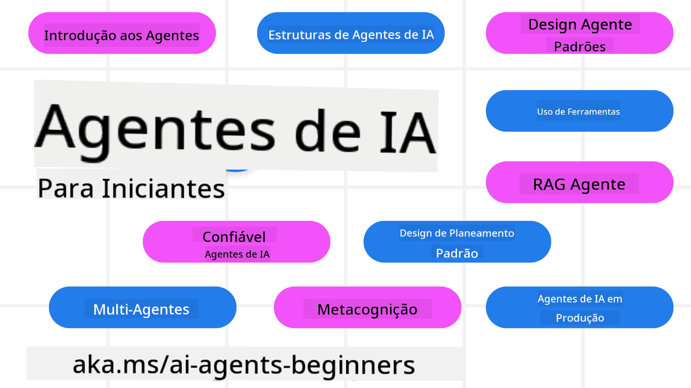

<!--
CO_OP_TRANSLATOR_METADATA:
{
  "original_hash": "6b07046397366e6f6f4524c9ddeba1e1",
  "translation_date": "2025-07-12T14:48:48+00:00",
  "source_file": "README.md",
  "language_code": "pt"
}
-->
# Agentes de IA para Iniciantes - Um Curso

## 11 Lições que ensinam tudo o que precisa de saber para começar a criar Agentes de IA

### 🌐 Suporte Multilíngue

#### Suportado via GitHub Action (Automatizado e Sempre Atualizado)

[Francês](../fr/README.md) | [Espanhol](../es/README.md) | [Alemão](../de/README.md) | [Russo](../ru/README.md) | [Árabe](../ar/README.md) | [Persa (Farsi)](../fa/README.md) | [Urdu](../ur/README.md) | [Chinês (Simplificado)](../zh/README.md) | [Chinês (Tradicional, Macau)](../mo/README.md) | [Chinês (Tradicional, Hong Kong)](../hk/README.md) | [Chinês (Tradicional, Taiwan)](../tw/README.md) | [Japonês](../ja/README.md) | [Coreano](../ko/README.md) | [Hindi](../hi/README.md) | [Bengali](../bn/README.md) | [Marathi](../mr/README.md) | [Nepali](../ne/README.md) | [Punjabi (Gurmukhi)](../pa/README.md) | [Português (Portugal)](./README.md) | [Português (Brasil)](../br/README.md) | [Italiano](../it/README.md) | [Polaco](../pl/README.md) | [Turco](../tr/README.md) | [Grego](../el/README.md) | [Tailandês](../th/README.md) | [Sueco](../sv/README.md) | [Dinamarquês](../da/README.md) | [Norueguês](../no/README.md) | [Finlandês](../fi/README.md) | [Holandês](../nl/README.md) | [Hebraico](../he/README.md) | [Vietnamita](../vi/README.md) | [Indonésio](../id/README.md) | [Malaio](../ms/README.md) | [Tagalog (Filipino)](../tl/README.md) | [Suaíli](../sw/README.md) | [Húngaro](../hu/README.md) | [Checo](../cs/README.md) | [Eslovaco](../sk/README.md) | [Romeno](../ro/README.md) | [Búlgaro](../bg/README.md) | [Sérvio (Cirílico)](../sr/README.md) | [Croata](../hr/README.md) | [Esloveno](../sl/README.md) | [Ucraniano](../uk/README.md) | [Birmanês (Myanmar)](../my/README.md)

**Se desejar que sejam suportados idiomas adicionais, estão listados [aqui](https://github.com/Azure/co-op-translator/blob/main/getting_started/supported-languages.md)**

## 🌱 Começar

Este curso tem 11 lições que cobrem os fundamentos para criar Agentes de IA. Cada lição aborda um tema específico, por isso comece onde quiser!

Este curso tem suporte multilíngue. Consulte os [idiomas disponíveis aqui](../..).

Se é a sua primeira vez a trabalhar com modelos de IA Generativa, veja o nosso curso [Generative AI For Beginners](https://aka.ms/genai-beginners), que inclui 21 lições sobre como construir com GenAI.

Não se esqueça de [dar uma estrela (🌟) a este repositório](https://docs.github.com/en/get-started/exploring-projects-on-github/saving-repositories-with-stars?WT.mc_id=academic-105485-koreyst) e [fazer um fork deste repositório](https://github.com/microsoft/ai-agents-for-beginners/fork) para executar o código.

### O que precisa

Cada lição deste curso inclui exemplos de código, que pode encontrar na pasta code_samples. Pode [fazer um fork deste repositório](https://github.com/microsoft/ai-agents-for-beginners/fork) para criar a sua própria cópia.

Os exemplos de código nestes exercícios utilizam Azure AI Foundry e GitHub Model Catalogs para interagir com Modelos de Linguagem:

- [Github Models](https://aka.ms/ai-agents-beginners/github-models) - Gratuito / Limitado
- [Azure AI Foundry](https://aka.ms/ai-agents-beginners/ai-foundry) - Requer Conta Azure

Este curso também usa os seguintes frameworks e serviços de Agentes de IA da Microsoft:

- [Azure AI Agent Service](https://aka.ms/ai-agents-beginners/ai-agent-service)
- [Semantic Kernel](https://aka.ms/ai-agents-beginners/semantic-kernel)
- [AutoGen](https://aka.ms/ai-agents/autogen)

Para mais informações sobre como executar o código deste curso, consulte a [Configuração do Curso](./00-course-setup/README.md).

## 🙏 Quer ajudar?

Tem sugestões ou encontrou erros de ortografia ou código? [Abra uma issue](https://github.com/microsoft/ai-agents-for-beginners/issues?WT.mc_id=academic-105485-koreyst) ou [crie um pull request](https://github.com/microsoft/ai-agents-for-beginners/pulls?WT.mc_id=academic-105485-koreyst)

Se ficar bloqueado ou tiver dúvidas sobre como criar Agentes de IA, junte-se à nossa [Comunidade Azure AI Foundry no Discord](https://discord.gg/kzRShWzttr)

Se tiver feedback sobre o produto ou encontrar erros durante a construção, visite o nosso [Fórum de Desenvolvedores Azure AI Foundry](https://aka.ms/azureaifoundry/forum)

## 📂 Cada lição inclui

- Uma lição escrita no README e um vídeo curto
- Exemplos de código Python que suportam Azure AI Foundry e Github Models (Gratuito)
- Links para recursos adicionais para continuar a sua aprendizagem

## 🗃️ Lições

| **Lição**                                | **Texto & Código**                                  | **Vídeo**                                                  | **Aprendizagem Extra**                                                                 |
|------------------------------------------|----------------------------------------------------|------------------------------------------------------------|----------------------------------------------------------------------------------------|
| Introdução a Agentes de IA e Casos de Uso | [Link](./01-intro-to-ai-agents/README.md)          | [Vídeo](https://youtu.be/3zgm60bXmQk?si=z8QygFvYQv-9WtO1)  | [Link](https://aka.ms/ai-agents-beginners/collection?WT.mc_id=academic-105485-koreyst) |
| Explorar Frameworks Agentic               | [Link](./02-explore-agentic-frameworks/README.md)  | [Vídeo](https://youtu.be/ODwF-EZo_O8?si=Vawth4hzVaHv-u0H)  | [Link](https://aka.ms/ai-agents-beginners/collection?WT.mc_id=academic-105485-koreyst) |
| Compreender Padrões de Design Agentic    | [Link](./03-agentic-design-patterns/README.md)     | [Vídeo](https://youtu.be/m9lM8qqoOEA?si=BIzHwzstTPL8o9GF)  | [Link](https://aka.ms/ai-agents-beginners/collection?WT.mc_id=academic-105485-koreyst) |
| Padrão de Design de Uso de Ferramentas   | [Link](./04-tool-use/README.md)                    | [Vídeo](https://youtu.be/vieRiPRx-gI?si=2z6O2Xu2cu_Jz46N)  | [Link](https://aka.ms/ai-agents-beginners/collection?WT.mc_id=academic-105485-koreyst) |
| Agentic RAG                             | [Link](./05-agentic-rag/README.md)                 | [Vídeo](https://youtu.be/WcjAARvdL7I?si=gKPWsQpKiIlDH9A3)  | [Link](https://aka.ms/ai-agents-beginners/collection?WT.mc_id=academic-105485-koreyst) |
| Construir Agentes de IA Confiáveis       | [Link](./06-building-trustworthy-agents/README.md) | [Vídeo](https://youtu.be/iZKkMEGBCUQ?si=jZjpiMnGFOE9L8OK ) | [Link](https://aka.ms/ai-agents-beginners/collection?WT.mc_id=academic-105485-koreyst) |
| Padrão de Design de Planeamento           | [Link](./07-planning-design/README.md)             | [Vídeo](https://youtu.be/kPfJ2BrBCMY?si=6SC_iv_E5-mzucnC)  | [Link](https://aka.ms/ai-agents-beginners/collection?WT.mc_id=academic-105485-koreyst) |
| Padrão de Design Multi-Agente             | [Link](./08-multi-agent/README.md)                 | [Vídeo](https://youtu.be/V6HpE9hZEx0?si=rMgDhEu7wXo2uo6g)  | [Link](https://aka.ms/ai-agents-beginners/collection?WT.mc_id=academic-105485-koreyst) |
| Padrão de Design de Metacognição          | [Link](./09-metacognition/README.md)               | [Vídeo](https://youtu.be/His9R6gw6Ec?si=8gck6vvdSNCt6OcF)  | [Link](https://aka.ms/ai-agents-beginners/collection?WT.mc_id=academic-105485-koreyst) |
| Agentes de IA em Produção                  | [Link](./10-ai-agents-production/README.md)        | [Vídeo](https://youtu.be/l4TP6IyJxmQ?si=31dnhexRo6yLRJDl)  | [Link](https://aka.ms/ai-agents-beginners/collection?WT.mc_id=academic-105485-koreyst) |
| Agentes de IA com MCP                      | [Link](./11-mcp/README.md)                         |                                                            | [Link](https://aka.ms/mcp-for-beginners)                                               |

## 🎒 Outros Cursos

A nossa equipa produz outros cursos! Veja:
- [**NOVO** Protocolo de Contexto de Modelo (MCP) Para Iniciantes](https://github.com/microsoft/mcp-for-beginners?WT.mc_id=academic-105485-koreyst)
- [IA Generativa para Iniciantes usando .NET](https://github.com/microsoft/Generative-AI-for-beginners-dotnet?WT.mc_id=academic-105485-koreyst)
- [IA Generativa para Iniciantes](https://github.com/microsoft/generative-ai-for-beginners?WT.mc_id=academic-105485-koreyst)
- [ML para Iniciantes](https://aka.ms/ml-beginners?WT.mc_id=academic-105485-koreyst)
- [Ciência de Dados para Iniciantes](https://aka.ms/datascience-beginners?WT.mc_id=academic-105485-koreyst)
- [IA para Iniciantes](https://aka.ms/ai-beginners?WT.mc_id=academic-105485-koreyst)
- [Cibersegurança para Iniciantes](https://github.com/microsoft/Security-101??WT.mc_id=academic-96948-sayoung)
- [Desenvolvimento Web para Iniciantes](https://aka.ms/webdev-beginners?WT.mc_id=academic-105485-koreyst)
- [IoT para Iniciantes](https://aka.ms/iot-beginners?WT.mc_id=academic-105485-koreyst)
- [Desenvolvimento XR para Iniciantes](https://github.com/microsoft/xr-development-for-beginners?WT.mc_id=academic-105485-koreyst)
- [Dominar o GitHub Copilot para Programação em Par com IA](https://aka.ms/GitHubCopilotAI?WT.mc_id=academic-105485-koreyst)
- [Dominar o GitHub Copilot para Desenvolvedores C#/.NET](https://github.com/microsoft/mastering-github-copilot-for-dotnet-csharp-developers?WT.mc_id=academic-105485-koreyst)
- [Escolhe a Tua Própria Aventura com o Copilot](https://github.com/microsoft/CopilotAdventures?WT.mc_id=academic-105485-koreyst)

## 🌟 Agradecimentos à Comunidade

Obrigado a [Shivam Goyal](https://www.linkedin.com/in/shivam2003/) por contribuir com exemplos de código importantes que demonstram Agentic RAG.

## Contribuir

Este projeto aceita contribuições e sugestões. A maioria das contribuições exige que concordes com um
Acordo de Licença de Contribuidor (CLA) declarando que tens o direito e efetivamente nos concedeste
os direitos para usar a tua contribuição. Para mais detalhes, visita
<https://cla.opensource.microsoft.com>.

Quando submeteres um pull request, um bot CLA irá automaticamente determinar se precisas de fornecer
um CLA e irá marcar o PR adequadamente (por exemplo, verificação de estado, comentário). Basta seguir as instruções
fornecidas pelo bot. Só precisarás de fazer isto uma vez para todos os repositórios que usam o nosso CLA.

Este projeto adotou o [Código de Conduta de Código Aberto da Microsoft](https://opensource.microsoft.com/codeofconduct/).
Para mais informações, consulta as [Perguntas Frequentes sobre o Código de Conduta](https://opensource.microsoft.com/codeofconduct/faq/) ou
contacta [opencode@microsoft.com](mailto:opencode@microsoft.com) para quaisquer questões ou comentários adicionais.

## Marcas Registadas

Este projeto pode conter marcas registadas ou logótipos de projetos, produtos ou serviços. O uso autorizado das marcas registadas ou logótipos da Microsoft está sujeito e deve seguir
[as Diretrizes de Marcas e Identidade da Microsoft](https://www.microsoft.com/legal/intellectualproperty/trademarks/usage/general).
O uso das marcas registadas ou logótipos da Microsoft em versões modificadas deste projeto não deve causar confusão nem implicar patrocínio da Microsoft.
Qualquer uso de marcas registadas ou logótipos de terceiros está sujeito às políticas desses terceiros.

**Aviso Legal**:  
Este documento foi traduzido utilizando o serviço de tradução automática [Co-op Translator](https://github.com/Azure/co-op-translator). Embora nos esforcemos pela precisão, por favor tenha em atenção que traduções automáticas podem conter erros ou imprecisões. O documento original na sua língua nativa deve ser considerado a fonte autorizada. Para informações críticas, recomenda-se tradução profissional humana. Não nos responsabilizamos por quaisquer mal-entendidos ou interpretações incorretas decorrentes da utilização desta tradução.