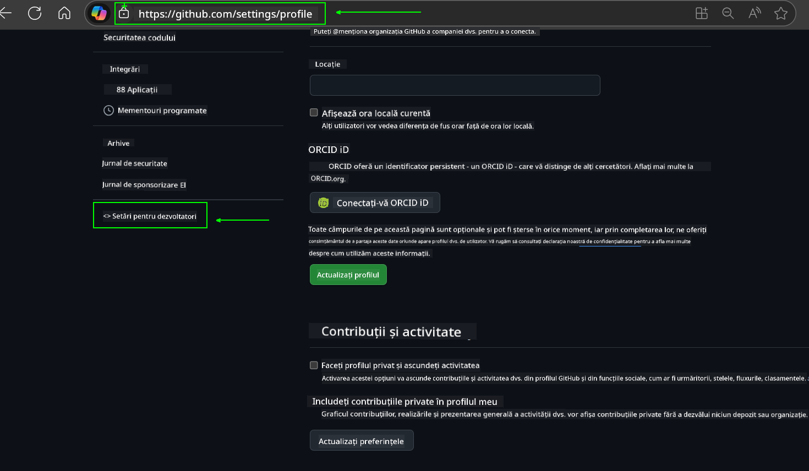
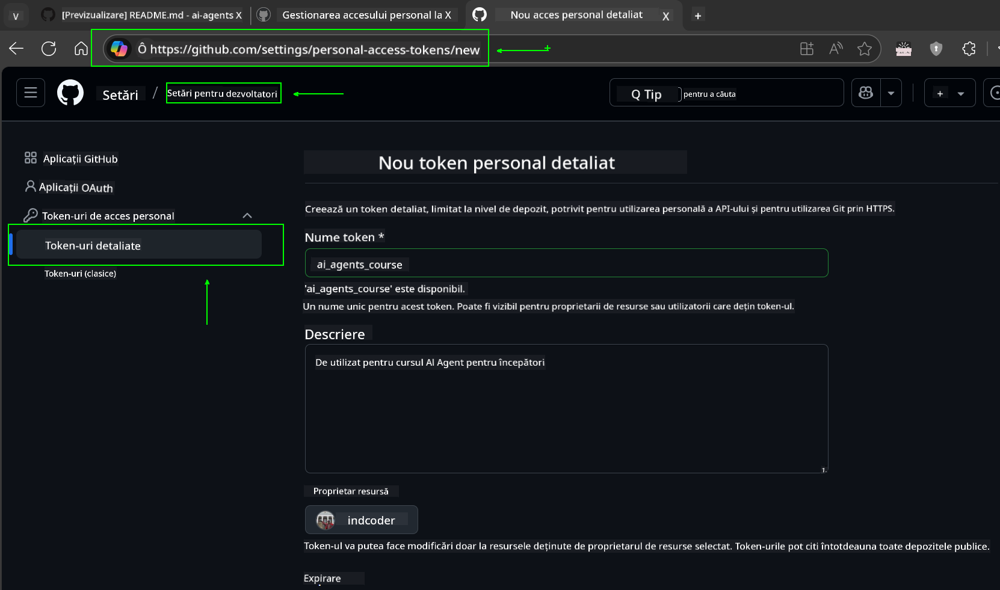
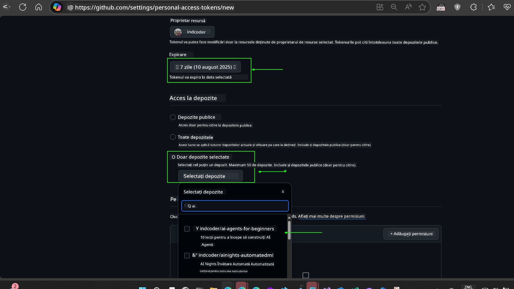
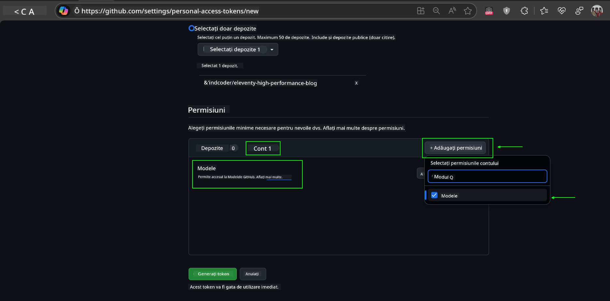
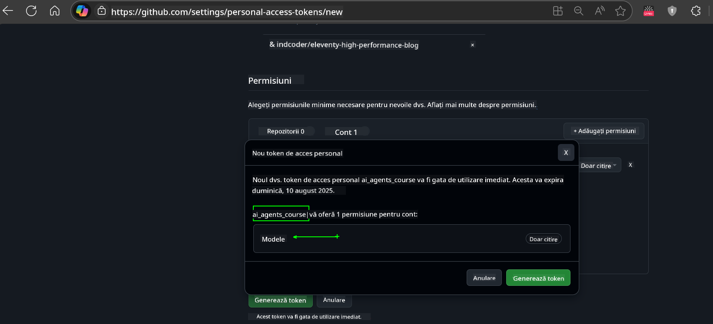
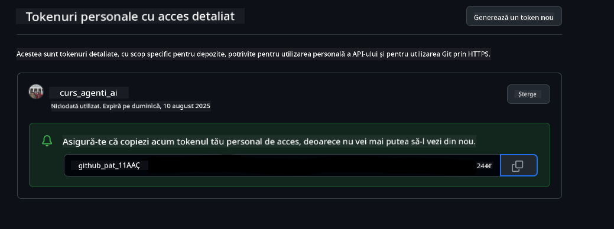
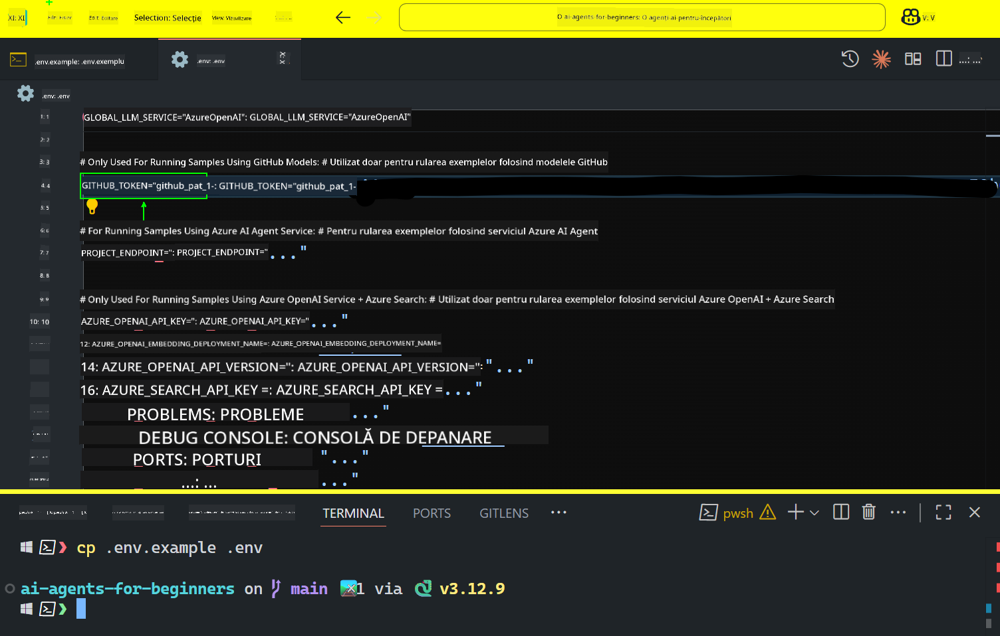

<!--
CO_OP_TRANSLATOR_METADATA:
{
  "original_hash": "c55b973b1562abf5aadf6a4028265ac5",
  "translation_date": "2025-08-29T20:53:02+00:00",
  "source_file": "00-course-setup/README.md",
  "language_code": "ro"
}
-->
# Configurarea Cursului

## Introducere

Această lecție va acoperi modul de rulare a exemplelor de cod din acest curs.

## Alătură-te altor cursanți și obține ajutor

Înainte de a începe clonarea depozitului, alătură-te canalului [AI Agents For Beginners Discord](https://aka.ms/ai-agents/discord) pentru a primi ajutor cu configurarea, pentru orice întrebări legate de curs sau pentru a te conecta cu alți cursanți.

## Clonează sau Fork-uiește acest depozit

Pentru a începe, te rugăm să clonezi sau să fork-uiești depozitul GitHub. Acest lucru va crea propria ta versiune a materialului de curs, astfel încât să poți rula, testa și ajusta codul!

Acest lucru poate fi realizat făcând clic pe linkul de mai jos:


## Rularea codului

Acest curs oferă o serie de Jupyter Notebooks pe care le poți rula pentru a obține experiență practică în construirea agenților AI.

Exemplele de cod utilizează fie:

**Necesită cont GitHub - Gratuit**:

1) Semantic Kernel Agent Framework + GitHub Models Marketplace. Etichetat ca (semantic-kernel.ipynb)
2) AutoGen Framework + GitHub Models Marketplace. Etichetat ca (autogen.ipynb)

**Necesită abonament Azure**:
3) Azure AI Foundry + Azure AI Agent Service. Etichetat ca (azureaiagent.ipynb)

Te încurajăm să încerci toate cele trei tipuri de exemple pentru a vedea care funcționează cel mai bine pentru tine.

Oricare opțiune alegi, aceasta va determina pașii de configurare pe care trebuie să îi urmezi mai jos:

## Cerințe

- Python 3.12+
  - **NOTE**: Dacă nu ai instalat Python 3.12, asigură-te că îl instalezi. Apoi creează mediul virtual folosind python3.12 pentru a te asigura că versiunile corecte sunt instalate din fișierul requirements.txt.
- Un cont GitHub - Pentru acces la GitHub Models Marketplace
- Abonament Azure - Pentru acces la Azure AI Foundry
- Cont Azure AI Foundry - Pentru acces la Azure AI Agent Service

Am inclus un fișier `requirements.txt` în rădăcina acestui depozit care conține toate pachetele Python necesare pentru a rula exemplele de cod.

Le poți instala rulând următoarea comandă în terminalul tău, la rădăcina depozitului:

```bash
pip install -r requirements.txt
```
Recomandăm crearea unui mediu virtual Python pentru a evita conflictele și problemele.

## Configurarea VSCode
Asigură-te că folosești versiunea corectă de Python în VSCode.


## Configurare pentru exemplele care utilizează modelele GitHub

### Pasul 1: Obține token-ul personal de acces GitHub (PAT)

Acest curs utilizează GitHub Models Marketplace, oferind acces gratuit la modele de limbaj mare (LLMs) pe care le vei folosi pentru a construi agenți AI.

Pentru a utiliza modelele GitHub, va trebui să creezi un [GitHub Personal Access Token](https://docs.github.com/en/authentication/keeping-your-account-and-data-secure/managing-your-personal-access-tokens).

Acest lucru poate fi realizat accesând contul tău GitHub.

Te rugăm să urmezi [Principiul Privilegiului Minim](https://docs.github.com/en/get-started/learning-to-code/storing-your-secrets-safely) atunci când creezi token-ul. Acest lucru înseamnă că ar trebui să oferi token-ului doar permisiunile necesare pentru a rula exemplele de cod din acest curs.

1. Selectează opțiunea `Fine-grained tokens` din partea stângă a ecranului, navigând la **Developer settings**.
   

    Apoi selectează `Generate new token`.

    

2. Introdu un nume descriptiv pentru token-ul tău care reflectă scopul său, astfel încât să fie ușor de identificat mai târziu.

    🔐 Recomandare pentru durata token-ului

    Durată recomandată: 30 de zile  
    Pentru o securitate mai mare, poți opta pentru o perioadă mai scurtă—cum ar fi 7 zile 🛡️  
    Este o modalitate excelentă de a-ți seta un obiectiv personal și de a finaliza cursul în timp ce motivația ta de învățare este ridicată 🚀.

    

3. Limitează domeniul token-ului la fork-ul acestui depozit.

    

4. Restricționează permisiunile token-ului: Sub **Permissions**, fă clic pe fila **Account** și apasă butonul "+ Add permissions". Va apărea un meniu derulant. Caută **Models** și bifează caseta pentru aceasta.
    

5. Verifică permisiunile necesare înainte de a genera token-ul. 

6. Înainte de a genera token-ul, asigură-te că ești pregătit să stochezi token-ul într-un loc sigur, cum ar fi un manager de parole, deoarece nu va fi afișat din nou după ce îl creezi. 

Copiază noul token pe care tocmai l-ai creat. Acum îl vei adăuga în fișierul `.env` inclus în acest curs.

### Pasul 2: Creează fișierul `.env`

Pentru a crea fișierul `.env`, rulează următoarea comandă în terminalul tău.

```bash
cp .env.example .env
```

Aceasta va copia fișierul exemplu și va crea un `.env` în directorul tău, unde vei completa valorile pentru variabilele de mediu.

Cu token-ul copiat, deschide fișierul `.env` în editorul tău de text preferat și lipește token-ul în câmpul `GITHUB_TOKEN`.  


Acum ar trebui să poți rula exemplele de cod din acest curs.

## Configurare pentru exemplele care utilizează Azure AI Foundry și Azure AI Agent Service

### Pasul 1: Obține endpoint-ul proiectului Azure

Urmează pașii pentru crearea unui hub și proiect în Azure AI Foundry, găsiți aici: [Hub resources overview](https://learn.microsoft.com/en-us/azure/ai-foundry/concepts/ai-resources)

După ce ai creat proiectul, va trebui să obții string-ul de conexiune pentru proiectul tău.

Acest lucru poate fi realizat accesând pagina **Overview** a proiectului tău în portalul Azure AI Foundry.


### Pasul 2: Creează fișierul `.env`

Pentru a crea fișierul `.env`, rulează următoarea comandă în terminalul tău.

```bash
cp .env.example .env
```

Aceasta va copia fișierul exemplu și va crea un `.env` în directorul tău, unde vei completa valorile pentru variabilele de mediu.

Cu token-ul copiat, deschide fișierul `.env` în editorul tău de text preferat și lipește token-ul în câmpul `PROJECT_ENDPOINT`.

### Pasul 3: Autentifică-te în Azure

Ca o bună practică de securitate, vom utiliza [autentificarea fără cheie](https://learn.microsoft.com/azure/developer/ai/keyless-connections?tabs=csharp%2Cazure-cli?WT.mc_id=academic-105485-koreyst) pentru a ne autentifica în Azure OpenAI cu Microsoft Entra ID.

Apoi, deschide un terminal și rulează `az login --use-device-code` pentru a te autentifica în contul tău Azure.

După ce te-ai autentificat, selectează abonamentul tău în terminal.

## Variabile suplimentare de mediu - Azure Search și Azure OpenAI

Pentru lecția Agentic RAG - Lecția 5 - există exemple care utilizează Azure Search și Azure OpenAI.

Dacă dorești să rulezi aceste exemple, va trebui să adaugi următoarele variabile de mediu în fișierul `.env`:

### Pagina Overview (Proiect)

- `AZURE_SUBSCRIPTION_ID` - Verifică **Project details** pe pagina **Overview** a proiectului tău.

- `AZURE_AI_PROJECT_NAME` - Uită-te în partea de sus a paginii **Overview** pentru proiectul tău.

- `AZURE_OPENAI_SERVICE` - Găsește acest lucru în fila **Included capabilities** pentru **Azure OpenAI Service** pe pagina **Overview**.

### Management Center

- `AZURE_OPENAI_RESOURCE_GROUP` - Accesează **Project properties** pe pagina **Overview** din **Management Center**.

- `GLOBAL_LLM_SERVICE` - Sub **Connected resources**, găsește numele conexiunii **Azure AI Services**. Dacă nu este listat, verifică **Azure portal** sub grupul tău de resurse pentru numele resursei AI Services.

### Pagina Models + Endpoints

- `AZURE_OPENAI_EMBEDDING_DEPLOYMENT_NAME` - Selectează modelul de embedding (de exemplu, `text-embedding-ada-002`) și notează **Deployment name** din detaliile modelului.

- `AZURE_OPENAI_CHAT_DEPLOYMENT_NAME` - Selectează modelul de chat (de exemplu, `gpt-4o-mini`) și notează **Deployment name** din detaliile modelului.

### Portalul Azure

- `AZURE_OPENAI_ENDPOINT` - Caută **Azure AI services**, fă clic pe acesta, apoi accesează **Resource Management**, **Keys and Endpoint**, derulează în jos la "Azure OpenAI endpoints" și copiază cel care spune "Language APIs".

- `AZURE_OPENAI_API_KEY` - De pe același ecran, copiază KEY 1 sau KEY 2.

- `AZURE_SEARCH_SERVICE_ENDPOINT` - Găsește resursa **Azure AI Search**, fă clic pe aceasta și vezi **Overview**.

- `AZURE_SEARCH_API_KEY` - Apoi accesează **Settings** și apoi **Keys** pentru a copia cheia principală sau secundară de administrare.

### Pagină externă

- `AZURE_OPENAI_API_VERSION` - Vizitează pagina [API version lifecycle](https://learn.microsoft.com/en-us/azure/ai-services/openai/api-version-deprecation#latest-ga-api-release) sub **Latest GA API release**.

### Configurare autentificare fără cheie

În loc să codificăm credențialele, vom utiliza o conexiune fără cheie cu Azure OpenAI. Pentru a face acest lucru, vom importa `DefaultAzureCredential` și ulterior vom apela funcția `DefaultAzureCredential` pentru a obține credențialul.

```python
from azure.identity import DefaultAzureCredential, InteractiveBrowserCredential
```

## Probleme?

Dacă întâmpini probleme în rularea acestei configurări, intră pe canalul nostru de Discord pentru ajutor.

## Lecția următoare

Acum ești pregătit să rulezi codul pentru acest curs. Îți dorim succes în explorarea fascinantei lumi a agenților AI!

[Introducere în agenții AI și utilizările acestora](../01-intro-to-ai-agents/README.md)

---

**Declinare de responsabilitate**:  
Acest document a fost tradus folosind serviciul de traducere AI [Co-op Translator](https://github.com/Azure/co-op-translator). Deși ne străduim să asigurăm acuratețea, vă rugăm să rețineți că traducerile automate pot conține erori sau inexactități. Documentul original în limba sa natală ar trebui considerat sursa autoritară. Pentru informații critice, se recomandă traducerea profesională realizată de un specialist uman. Nu ne asumăm responsabilitatea pentru eventualele neînțelegeri sau interpretări greșite care pot apărea din utilizarea acestei traduceri.