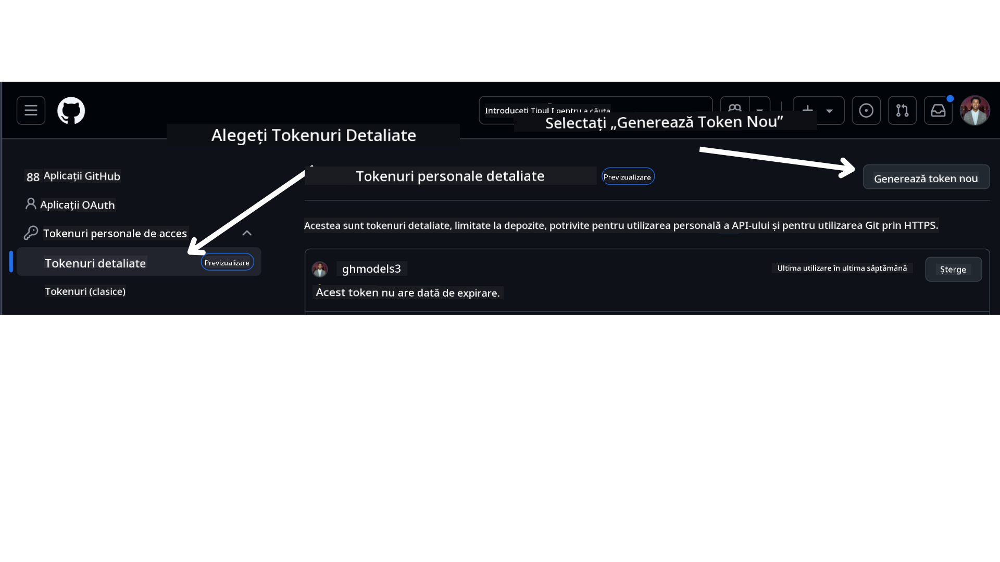

<!--
CO_OP_TRANSLATOR_METADATA:
{
  "original_hash": "76945069b52a49cd0432ae3e0b0ba22e",
  "translation_date": "2025-07-12T07:57:04+00:00",
  "source_file": "00-course-setup/README.md",
  "language_code": "ro"
}
-->
ar trebui să ai acum propria ta versiune fork-uită a acestui curs la următorul link:


## Rularea Codului

Acest curs oferă o serie de Jupyter Notebooks pe care le poți rula pentru a obține experiență practică în construirea de Agenți AI.

Exemplele de cod folosesc fie:

**Necesită Cont GitHub - Gratuit**:

1) Semantic Kernel Agent Framework + GitHub Models Marketplace. Etichetat ca (semantic-kernel.ipynb)  
2) AutoGen Framework + GitHub Models Marketplace. Etichetat ca (autogen.ipynb)

**Necesită Abonament Azure**:  
3) Azure AI Foundry + Azure AI Agent Service. Etichetat ca (azureaiagent.ipynb)

Te încurajăm să încerci toate cele trei tipuri de exemple pentru a vedea care funcționează cel mai bine pentru tine.

Oricare opțiune alegi, aceasta va determina pașii de configurare pe care trebuie să îi urmezi mai jos:

## Cerințe

- Python 3.12+  
  - **NOTE**: Dacă nu ai instalat Python 3.12, asigură-te că îl instalezi. Apoi creează-ți mediul virtual folosind python3.12 pentru a te asigura că se instalează versiunile corecte din fișierul requirements.txt.  
- Un cont GitHub - Pentru acces la GitHub Models Marketplace  
- Abonament Azure - Pentru acces la Azure AI Foundry  
- Cont Azure AI Foundry - Pentru acces la Azure AI Agent Service  

Am inclus un fișier `requirements.txt` în rădăcina acestui depozit care conține toate pachetele Python necesare pentru a rula exemplele de cod.

Le poți instala rulând următoarea comandă în terminal, în rădăcina depozitului:

```bash
pip install -r requirements.txt
```  
Recomandăm crearea unui mediu virtual Python pentru a evita conflictele și problemele.

## Configurare VSCode  
Asigură-te că folosești versiunea corectă de Python în VSCode.


## Configurare pentru Exemplele care folosesc GitHub Models

### Pasul 1: Obține Token-ul Personal de Acces GitHub (PAT)

În prezent, acest curs folosește GitHub Models Marketplace pentru a oferi acces gratuit la Modele de Limbaj Mari (LLMs) care vor fi folosite pentru a crea Agenți AI.

Pentru a accesa acest serviciu, va trebui să creezi un Token Personal de Acces GitHub.

Acest lucru se face accesând contul tău GitHub.

Selectează opțiunea `Fine-grained tokens` din partea stângă a ecranului.

Apoi selectează `Generate new token`.



Ți se va cere să introduci un nume pentru token, să selectezi data de expirare (Recomandat: 30 de zile) și să selectezi permisiunile pentru token (Public Repositories).

Este necesar să editezi și permisiunile acestui token: Permissions -> Models -> Permite accesul la GitHub Models

Copiază noul token pe care tocmai l-ai creat. Acum îl vei adăuga în fișierul tău `.env` inclus în acest curs.

### Pasul 2: Creează fișierul tău `.env`

Pentru a crea fișierul `.env`, rulează următoarea comandă în terminal:

```bash
cp .env.example .env
```

Aceasta va copia fișierul exemplu și va crea un `.env` în directorul tău, unde vei completa valorile pentru variabilele de mediu.

Cu token-ul copiat, deschide fișierul `.env` în editorul tău preferat și lipește token-ul în câmpul `GITHUB_TOKEN`.

Acum ar trebui să poți rula exemplele de cod din acest curs.

## Configurare pentru Exemplele care folosesc Azure AI Foundry și Azure AI Agent Service

### Pasul 1: Obține Endpoint-ul Proiectului Azure

Urmează pașii pentru crearea unui hub și a unui proiect în Azure AI Foundry găsiți aici: [Hub resources overview](https://learn.microsoft.com/en-us/azure/ai-foundry/concepts/ai-resources)

După ce ai creat proiectul, va trebui să obții șirul de conexiune pentru proiectul tău.

Acest lucru se face accesând pagina **Overview** a proiectului în portalul Azure AI Foundry.


### Pasul 2: Creează fișierul tău `.env`

Pentru a crea fișierul `.env`, rulează următoarea comandă în terminal:

```bash
cp .env.example .env
```

Aceasta va copia fișierul exemplu și va crea un `.env` în directorul tău, unde vei completa valorile pentru variabilele de mediu.

Cu șirul de conexiune copiat, deschide fișierul `.env` în editorul tău preferat și lipește-l în câmpul `PROJECT_ENDPOINT`.

### Pasul 3: Autentificare în Azure

Ca bună practică de securitate, vom folosi [autentificare fără cheie](https://learn.microsoft.com/azure/developer/ai/keyless-connections?tabs=csharp%2Cazure-cli?WT.mc_id=academic-105485-koreyst) pentru a ne autentifica în Azure OpenAI cu Microsoft Entra ID. Înainte de asta, trebuie să instalezi **Azure CLI** conform [instrucțiunilor de instalare](https://learn.microsoft.com/cli/azure/install-azure-cli?WT.mc_id=academic-105485-koreyst) pentru sistemul tău de operare.

Apoi, deschide un terminal și rulează `az login --use-device-code` pentru a te autentifica în contul tău Azure.

După autentificare, selectează abonamentul în terminal.

## Variabile de Mediu Suplimentare - Azure Search și Azure OpenAI

Pentru Lecția Agentic RAG - Lecția 5 - există exemple care folosesc Azure Search și Azure OpenAI.

Dacă vrei să rulezi aceste exemple, va trebui să adaugi următoarele variabile de mediu în fișierul tău `.env`:

### Pagina Overview (Proiect)

- `AZURE_SUBSCRIPTION_ID` - Verifică **Detalii proiect** pe pagina **Overview** a proiectului tău.

- `AZURE_AI_PROJECT_NAME` - Vezi în partea de sus a paginii **Overview** a proiectului.

- `AZURE_OPENAI_SERVICE` - Găsește în fila **Included capabilities** pentru **Azure OpenAI Service** pe pagina **Overview**.

### Centrul de Management

- `AZURE_OPENAI_RESOURCE_GROUP` - Accesează **Proprietăți proiect** pe pagina **Overview** din **Management Center**.

- `GLOBAL_LLM_SERVICE` - Sub **Connected resources**, găsește numele conexiunii pentru **Azure AI Services**. Dacă nu este listat, verifică în **Azure portal** în grupul tău de resurse pentru numele resursei AI Services.

### Pagina Modele + Endpoint-uri

- `AZURE_OPENAI_EMBEDDING_DEPLOYMENT_NAME` - Selectează modelul de embedding (ex: `text-embedding-ada-002`) și notează **Deployment name** din detaliile modelului.

- `AZURE_OPENAI_CHAT_DEPLOYMENT_NAME` - Selectează modelul de chat (ex: `gpt-4o-mini`) și notează **Deployment name** din detaliile modelului.

### Portal Azure

- `AZURE_OPENAI_ENDPOINT` - Caută **Azure AI services**, dă click pe el, apoi accesează **Resource Management**, **Keys and Endpoint**, derulează până la "Azure OpenAI endpoints" și copiază endpoint-ul care spune "Language APIs".

- `AZURE_OPENAI_API_KEY` - Din aceeași pagină, copiază KEY 1 sau KEY 2.

- `AZURE_SEARCH_SERVICE_ENDPOINT` - Găsește resursa ta **Azure AI Search**, dă click pe ea și vezi pagina **Overview**.

- `AZURE_SEARCH_API_KEY` - Apoi accesează **Settings** și apoi **Keys** pentru a copia cheia principală sau secundară de administrator.

### Pagină Web Externă

- `AZURE_OPENAI_API_VERSION` - Vizitează pagina [API version lifecycle](https://learn.microsoft.com/en-us/azure/ai-services/openai/api-version-deprecation#latest-ga-api-release) la secțiunea **Latest GA API release**.

### Configurare autentificare fără cheie

În loc să introducem direct credențialele, vom folosi o conexiune fără cheie cu Azure OpenAI. Pentru asta, vom importa `DefaultAzureCredential` și apoi vom apela funcția `DefaultAzureCredential` pentru a obține credențialele.

```python
from azure.identity import DefaultAzureCredential, InteractiveBrowserCredential
```

## Ai blocaje?

Dacă întâmpini probleme în rularea acestei configurări, intră în comunitatea noastră

sau

.

## Lecția Următoare

Acum ești gata să rulezi codul pentru acest curs. Spor la învățat mai multe despre lumea Agenților AI!

[Introduction to AI Agents and Agent Use Cases](../01-intro-to-ai-agents/README.md)

**Declinare de responsabilitate**:  
Acest document a fost tradus folosind serviciul de traducere AI [Co-op Translator](https://github.com/Azure/co-op-translator). Deși ne străduim pentru acuratețe, vă rugăm să rețineți că traducerile automate pot conține erori sau inexactități. Documentul original în limba sa nativă trebuie considerat sursa autorizată. Pentru informații critice, se recomandă traducerea profesională realizată de un specialist uman. Nu ne asumăm răspunderea pentru eventualele neînțelegeri sau interpretări greșite rezultate din utilizarea acestei traduceri.