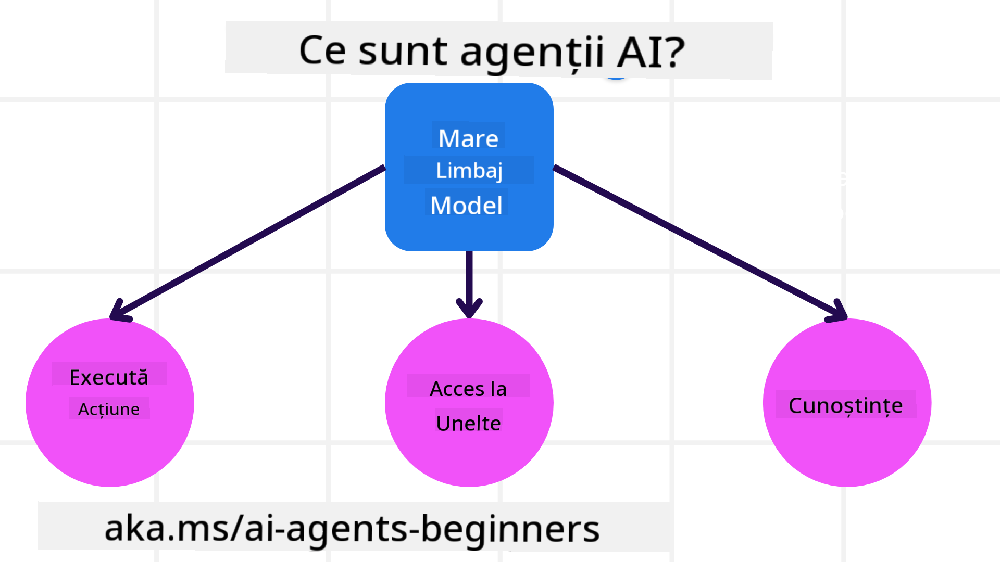
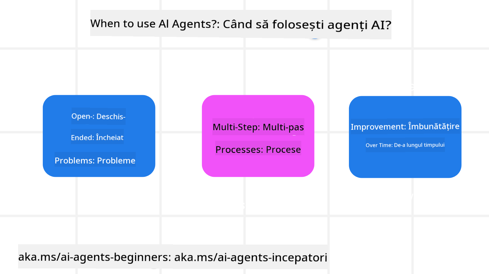

<!--
CO_OP_TRANSLATOR_METADATA:
{
  "original_hash": "d84943abc8f001ad4670418d32c2d899",
  "translation_date": "2025-07-12T08:12:05+00:00",
  "source_file": "01-intro-to-ai-agents/README.md",
  "language_code": "ro"
}
-->
pentru a întâlni alți cursanți și dezvoltatori de AI Agents și pentru a pune orice întrebări aveți despre acest curs.

Pentru a începe acest curs, începem prin a înțelege mai bine ce sunt AI Agents și cum le putem folosi în aplicațiile și fluxurile de lucru pe care le construim.

## Introducere

Această lecție acoperă:

- Ce sunt AI Agents și care sunt diferitele tipuri de agenți?
- Pentru ce cazuri de utilizare sunt cei mai potriviți AI Agents și cum ne pot ajuta?
- Care sunt unele dintre elementele de bază în proiectarea soluțiilor agentice?

## Obiective de învățare
După finalizarea acestei lecții, ar trebui să puteți:

- Înțelege conceptele AI Agent și cum se diferențiază de alte soluții AI.
- Aplica AI Agents în mod eficient.
- Proiecta soluții agentice productiv pentru utilizatori și clienți.

## Definirea AI Agents și tipurile de AI Agents

### Ce sunt AI Agents?

AI Agents sunt **sisteme** care permit **Large Language Models (LLMs)** să **efectueze acțiuni** prin extinderea capacităților lor, oferind LLM-urilor **acces la unelte** și **cunoștințe**.

Să descompunem această definiție în părți mai mici:

- **Sistem** - Este important să gândim agenții nu doar ca un singur component, ci ca un sistem format din mai multe componente. La nivel de bază, componentele unui AI Agent sunt:
  - **Mediul** - Spațiul definit în care AI Agent operează. De exemplu, dacă avem un AI Agent pentru rezervări de călătorii, mediul ar putea fi sistemul de rezervări de călătorii pe care agentul îl folosește pentru a îndeplini sarcini.
  - **Senzori** - Mediile au informații și oferă feedback. AI Agents folosesc senzori pentru a colecta și interpreta aceste informații despre starea curentă a mediului. În exemplul agentului de rezervări, sistemul de rezervări poate furniza informații precum disponibilitatea hotelurilor sau prețurile zborurilor.
  - **Actuatori** - Odată ce AI Agent primește starea curentă a mediului, pentru sarcina curentă agentul determină ce acțiune să efectueze pentru a schimba mediul. Pentru agentul de rezervări, aceasta ar putea fi rezervarea unei camere disponibile pentru utilizator.

**Large Language Models** - Conceptul de agenți a existat înainte de crearea LLM-urilor. Avantajul construirii AI Agents cu LLM-uri este capacitatea lor de a interpreta limbajul uman și datele. Această abilitate permite LLM-urilor să interpreteze informațiile din mediu și să definească un plan pentru a schimba mediul.

**Efectuarea de acțiuni** - În afara sistemelor AI Agent, LLM-urile sunt limitate la situații în care acțiunea este generarea de conținut sau informații pe baza unui prompt al utilizatorului. În interiorul sistemelor AI Agent, LLM-urile pot îndeplini sarcini interpretând cererea utilizatorului și folosind uneltele disponibile în mediul lor.

**Acces la unelte** - La ce unelte are acces LLM-ul este definit de 1) mediul în care operează și 2) dezvoltatorul AI Agent. În exemplul agentului de călătorii, uneltele agentului sunt limitate de operațiunile disponibile în sistemul de rezervări și/sau dezvoltatorul poate limita accesul agentului la unelte pentru zboruri.

**Memorie + Cunoștințe** - Memoria poate fi pe termen scurt în contextul conversației dintre utilizator și agent. Pe termen lung, în afara informațiilor oferite de mediu, AI Agents pot de asemenea să recupereze cunoștințe din alte sisteme, servicii, unelte și chiar alți agenți. În exemplul agentului de călătorii, aceste cunoștințe ar putea fi informațiile despre preferințele de călătorie ale utilizatorului stocate într-o bază de date a clienților.

### Diferitele tipuri de agenți

Acum că avem o definiție generală a AI Agents, să analizăm câteva tipuri specifice de agenți și cum ar fi aplicați la un agent AI pentru rezervări de călătorii.

| **Tip Agent**                 | **Descriere**                                                                                                                       | **Exemplu**                                                                                                                                                                                                                   |
| ---------------------------- | --------------------------------------------------------------------------------------------------------------------------------- | ----------------------------------------------------------------------------------------------------------------------------------------------------------------------------------------------------------------------------- |
| **Simple Reflex Agents**      | Efectuează acțiuni imediate bazate pe reguli predefinite.                                                                          | Agentul de călătorii interpretează contextul unui email și redirecționează reclamațiile de călătorie către serviciul clienți.                                                                                                  |
| **Model-Based Reflex Agents** | Efectuează acțiuni bazate pe un model al lumii și modificările acestui model.                                                      | Agentul de călătorii prioritizează rutele cu schimbări semnificative de preț bazându-se pe accesul la date istorice de prețuri.                                                                                                |
| **Goal-Based Agents**         | Creează planuri pentru a atinge obiective specifice interpretând obiectivul și determinând acțiunile necesare.                    | Agentul de călătorii rezervă o călătorie determinând aranjamentele necesare (mașină, transport public, zboruri) de la locația curentă la destinație.                                                                             |
| **Utility-Based Agents**      | Ia în considerare preferințele și cântărește compromisurile numeric pentru a determina cum să atingă obiectivele.                  | Agentul de călătorii maximizează utilitatea cântărind comoditatea versus costul la rezervarea călătoriei.                                                                                                                     |
| **Learning Agents**           | Se îmbunătățesc în timp răspunzând la feedback și ajustând acțiunile în consecință.                                               | Agentul de călătorii se îmbunătățește folosind feedback-ul clienților din sondajele post-călătorie pentru a face ajustări la rezervările viitoare.                                                                             |
| **Hierarchical Agents**       | Au mai mulți agenți într-un sistem ierarhic, agenții de nivel superior împart sarcinile în sub-sarcini pentru agenții de nivel inferior. | Agentul de călătorii anulează o călătorie împărțind sarcina în sub-sarcini (de exemplu, anularea rezervărilor specifice) și agenții de nivel inferior le îndeplinesc, raportând înapoi agentului de nivel superior.                  |
| **Multi-Agent Systems (MAS)** | Agenții îndeplinesc sarcini independent, fie cooperativ, fie competitiv.                                                           | Cooperativ: Mai mulți agenți rezervă servicii specifice de călătorie precum hoteluri, zboruri și divertisment. Competitiv: Mai mulți agenți gestionează și concurează pentru un calendar comun de rezervări hotel pentru clienți. |

## Când să folosim AI Agents

În secțiunea anterioară, am folosit exemplul agentului de călătorii pentru a explica cum pot fi folosite diferitele tipuri de agenți în diverse scenarii de rezervare. Vom continua să folosim această aplicație pe tot parcursul cursului.

Să vedem tipurile de cazuri de utilizare pentru care AI Agents sunt cei mai potriviți:

- **Probleme deschise** - permițând LLM-ului să determine pașii necesari pentru a finaliza o sarcină, deoarece nu pot fi întotdeauna codificate rigid într-un flux de lucru.
- **Procese cu mai mulți pași** - sarcini care necesită un nivel de complexitate în care AI Agent trebuie să folosească unelte sau informații pe parcursul mai multor interacțiuni, nu doar o singură extragere.
- **Îmbunătățire în timp** - sarcini în care agentul se poate îmbunătăți în timp primind feedback fie din mediu, fie de la utilizatori pentru a oferi o utilitate mai bună.

Acoperim mai multe considerații privind utilizarea AI Agents în lecția Building Trustworthy AI Agents.

## Bazele soluțiilor agentice

### Dezvoltarea agentului

Primul pas în proiectarea unui sistem AI Agent este definirea uneltelor, acțiunilor și comportamentelor. În acest curs, ne concentrăm pe utilizarea **Azure AI Agent Service** pentru a defini agenții noștri. Acesta oferă caracteristici precum:

- Selectarea modelelor deschise precum OpenAI, Mistral și Llama
- Utilizarea datelor licențiate prin furnizori precum Tripadvisor
- Utilizarea uneltelor standardizate OpenAPI 3.0

### Modele agentice

Comunicarea cu LLM-urile se face prin prompturi. Având în vedere natura semi-autonomă a AI Agents, nu este întotdeauna posibil sau necesar să repromptăm manual LLM-ul după o schimbare în mediu. Folosim **modele agentice** care ne permit să promptăm LLM-ul pe mai mulți pași într-un mod mai scalabil.

Acest curs este împărțit în unele dintre modelele agentice populare în prezent.

### Framework-uri agentice

Framework-urile agentice permit dezvoltatorilor să implementeze modelele agentice prin cod. Aceste framework-uri oferă șabloane, pluginuri și unelte pentru o colaborare mai bună între AI Agents. Aceste beneficii oferă capacități mai bune de observabilitate și depanare a sistemelor AI Agent.

În acest curs, vom explora framework-ul AutoGen, bazat pe cercetare, și framework-ul Agent, pregătit pentru producție, de la Semantic Kernel.

## Lecția anterioară

[Course Setup](../00-course-setup/README.md)

## Lecția următoare

[Exploring Agentic Frameworks](../02-explore-agentic-frameworks/README.md)

**Declinare de responsabilitate**:  
Acest document a fost tradus folosind serviciul de traducere AI [Co-op Translator](https://github.com/Azure/co-op-translator). Deși ne străduim pentru acuratețe, vă rugăm să rețineți că traducerile automate pot conține erori sau inexactități. Documentul original în limba sa nativă trebuie considerat sursa autorizată. Pentru informații critice, se recomandă traducerea profesională realizată de un specialist uman. Nu ne asumăm răspunderea pentru eventualele neînțelegeri sau interpretări greșite rezultate din utilizarea acestei traduceri.