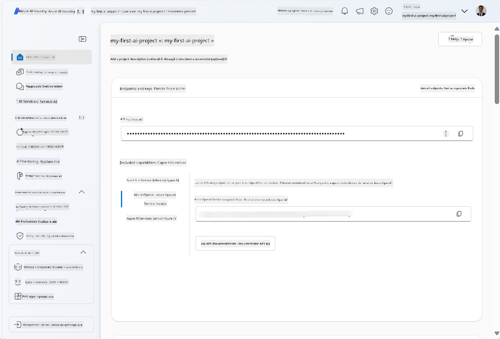
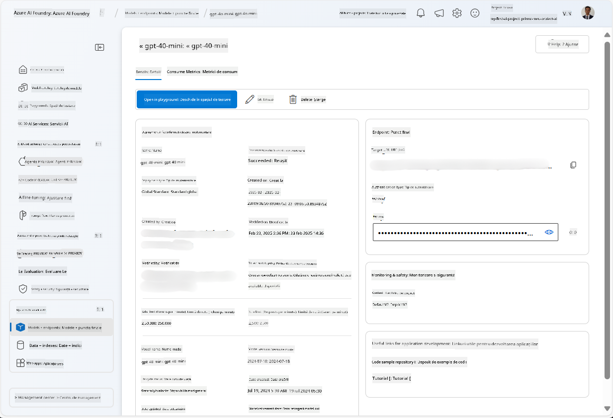
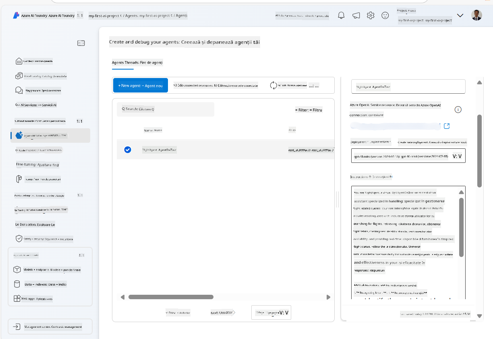
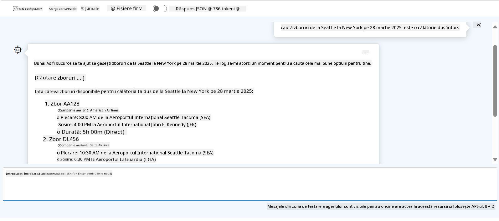

<!--
CO_OP_TRANSLATOR_METADATA:
{
  "original_hash": "7e92870dc0843e13d4dabc620c09d2d9",
  "translation_date": "2025-07-12T08:22:25+00:00",
  "source_file": "02-explore-agentic-frameworks/azure-ai-foundry-agent-creation.md",
  "language_code": "ro"
}
-->
# Dezvoltarea serviciului Azure AI Agent

În acest exercițiu, vei folosi instrumentele serviciului Azure AI Agent din [portalul Azure AI Foundry](https://ai.azure.com/?WT.mc_id=academic-105485-koreyst) pentru a crea un agent pentru rezervarea zborurilor. Agentul va putea interacționa cu utilizatorii și va oferi informații despre zboruri.

## Cerințe preliminare

Pentru a finaliza acest exercițiu, ai nevoie de următoarele:
1. Un cont Azure cu un abonament activ. [Creează un cont gratuit](https://azure.microsoft.com/free/?WT.mc_id=academic-105485-koreyst).
2. Ai nevoie de permisiuni pentru a crea un hub Azure AI Foundry sau să ai unul creat pentru tine.
    - Dacă rolul tău este Contributor sau Owner, poți urma pașii din acest tutorial.

## Creează un hub Azure AI Foundry

> **Note:** Azure AI Foundry a fost cunoscut anterior ca Azure AI Studio.

1. Urmează aceste recomandări din postarea de pe blogul [Azure AI Foundry](https://learn.microsoft.com/en-us/azure/ai-studio/?WT.mc_id=academic-105485-koreyst) pentru a crea un hub Azure AI Foundry.
2. Când proiectul tău este creat, închide orice sfaturi afișate și verifică pagina proiectului în portalul Azure AI Foundry, care ar trebui să arate similar cu imaginea de mai jos:

    

## Desfășoară un model

1. În panoul din stânga al proiectului tău, în secțiunea **My assets**, selectează pagina **Models + endpoints**.
2. În pagina **Models + endpoints**, în fila **Model deployments**, din meniul **+ Deploy model**, selectează **Deploy base model**.
3. Caută modelul `gpt-4o-mini` în listă, apoi selectează-l și confirmă alegerea.

    > **Note**: Reducerea TPM ajută la evitarea utilizării excesive a cotei disponibile în abonamentul pe care îl folosești.

    

## Creează un agent

Acum că ai desfășurat un model, poți crea un agent. Un agent este un model AI conversațional care poate fi folosit pentru a interacționa cu utilizatorii.

1. În panoul din stânga al proiectului tău, în secțiunea **Build & Customize**, selectează pagina **Agents**.
2. Apasă pe **+ Create agent** pentru a crea un agent nou. În dialogul **Agent Setup**:
    - Introdu un nume pentru agent, de exemplu `FlightAgent`.
    - Asigură-te că este selectată implementarea modelului `gpt-4o-mini` creată anterior.
    - Setează **Instructions** conform promptului pe care vrei ca agentul să îl urmeze. Iată un exemplu:
    ```
    You are FlightAgent, a virtual assistant specialized in handling flight-related queries. Your role includes assisting users with searching for flights, retrieving flight details, checking seat availability, and providing real-time flight status. Follow the instructions below to ensure clarity and effectiveness in your responses:

    ### Task Instructions:
    1. **Recognizing Intent**:
       - Identify the user's intent based on their request, focusing on one of the following categories:
         - Searching for flights
         - Retrieving flight details using a flight ID
         - Checking seat availability for a specified flight
         - Providing real-time flight status using a flight number
       - If the intent is unclear, politely ask users to clarify or provide more details.
        
    2. **Processing Requests**:
        - Depending on the identified intent, perform the required task:
        - For flight searches: Request details such as origin, destination, departure date, and optionally return date.
        - For flight details: Request a valid flight ID.
        - For seat availability: Request the flight ID and date and validate inputs.
        - For flight status: Request a valid flight number.
        - Perform validations on provided data (e.g., formats of dates, flight numbers, or IDs). If the information is incomplete or invalid, return a friendly request for clarification.

    3. **Generating Responses**:
    - Use a tone that is friendly, concise, and supportive.
    - Provide clear and actionable suggestions based on the output of each task.
    - If no data is found or an error occurs, explain it to the user gently and offer alternative actions (e.g., refine search, try another query).
    
    ```
> [!NOTE]
> Pentru un prompt detaliat, poți consulta [acest repository](https://github.com/ShivamGoyal03/RoamMind) pentru mai multe informații.
    
> În plus, poți adăuga **Knowledge Base** și **Actions** pentru a îmbunătăți capacitățile agentului de a oferi mai multe informații și de a efectua sarcini automate pe baza cererilor utilizatorilor. Pentru acest exercițiu, poți sări peste acești pași.
    


3. Pentru a crea un agent multi-AI nou, apasă pur și simplu pe **New Agent**. Agentul nou creat va fi afișat apoi pe pagina Agents.

## Testează agentul

După ce ai creat agentul, îl poți testa pentru a vedea cum răspunde la întrebările utilizatorilor în playground-ul portalului Azure AI Foundry.

1. În partea de sus a panoului **Setup** pentru agentul tău, selectează **Try in playground**.
2. În panoul **Playground**, poți interacționa cu agentul tastând întrebări în fereastra de chat. De exemplu, poți cere agentului să caute zboruri de la Seattle la New York pe data de 28.

    > **Note**: Agentul poate să nu ofere răspunsuri exacte, deoarece nu se folosesc date în timp real în acest exercițiu. Scopul este să testezi capacitatea agentului de a înțelege și răspunde la întrebările utilizatorilor pe baza instrucțiunilor primite.

    

3. După testarea agentului, îl poți personaliza în continuare adăugând mai multe intenții, date de antrenament și acțiuni pentru a-i îmbunătăți capacitățile.

## Curățarea resurselor

După ce ai terminat testarea agentului, îl poți șterge pentru a evita costuri suplimentare.
1. Deschide [portalul Azure](https://portal.azure.com) și vizualizează conținutul grupului de resurse unde ai desfășurat resursele hub-ului folosite în acest exercițiu.
2. În bara de instrumente, selectează **Delete resource group**.
3. Introdu numele grupului de resurse și confirmă că dorești să îl ștergi.

## Resurse

- [Documentația Azure AI Foundry](https://learn.microsoft.com/en-us/azure/ai-studio/?WT.mc_id=academic-105485-koreyst)
- [Portalul Azure AI Foundry](https://ai.azure.com/?WT.mc_id=academic-105485-koreyst)
- [Început cu Azure AI Studio](https://techcommunity.microsoft.com/blog/educatordeveloperblog/getting-started-with-azure-ai-studio/4095602?WT.mc_id=academic-105485-koreyst)
- [Fundamentele agenților AI pe Azure](https://learn.microsoft.com/en-us/training/modules/ai-agent-fundamentals/?WT.mc_id=academic-105485-koreyst)
- [Azure AI Discord](https://aka.ms/AzureAI/Discord)

**Declinare de responsabilitate**:  
Acest document a fost tradus folosind serviciul de traducere AI [Co-op Translator](https://github.com/Azure/co-op-translator). Deși ne străduim pentru acuratețe, vă rugăm să rețineți că traducerile automate pot conține erori sau inexactități. Documentul original în limba sa nativă trebuie considerat sursa autorizată. Pentru informații critice, se recomandă traducerea profesională realizată de un specialist uman. Nu ne asumăm răspunderea pentru eventualele neînțelegeri sau interpretări greșite rezultate din utilizarea acestei traduceri.