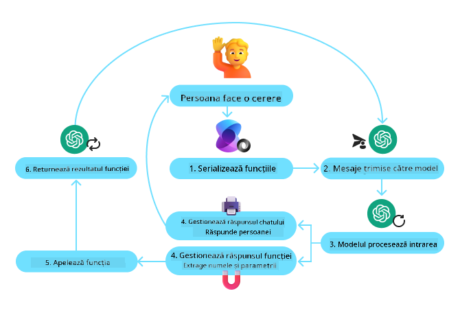
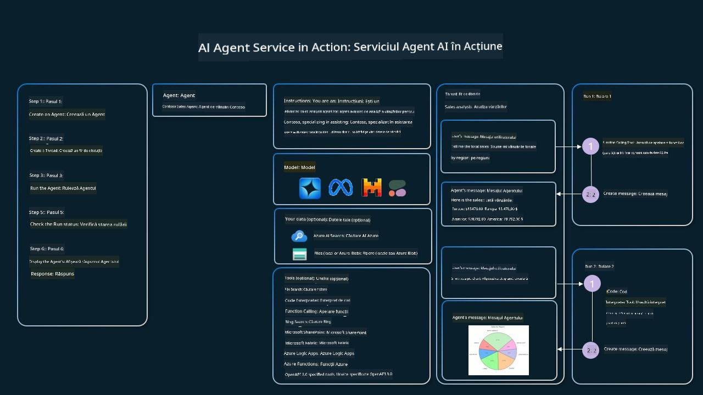

<!--
CO_OP_TRANSLATOR_METADATA:
{
  "original_hash": "88258b03f2893aa2e69eb8fb24baabbc",
  "translation_date": "2025-07-12T09:44:03+00:00",
  "source_file": "04-tool-use/README.md",
  "language_code": "ro"
}
-->
[](https://youtu.be/vieRiPRx-gI?si=cEZ8ApnT6Sus9rhn)

> _(Click pe imaginea de mai sus pentru a viziona videoclipul acestei lecții)_

# Pattern-ul de Design pentru Utilizarea Uneltelor

Uneltele sunt interesante deoarece permit agenților AI să aibă o gamă mai largă de capabilități. În loc ca agentul să aibă un set limitat de acțiuni pe care le poate efectua, prin adăugarea unei unelte, agentul poate acum să realizeze o varietate largă de acțiuni. În acest capitol, vom analiza Pattern-ul de Design pentru Utilizarea Uneltelor, care descrie cum agenții AI pot folosi unelte specifice pentru a-și atinge obiectivele.

## Introducere

În această lecție, ne propunem să răspundem la următoarele întrebări:

- Ce este pattern-ul de design pentru utilizarea uneltelor?
- În ce cazuri de utilizare poate fi aplicat?
- Care sunt elementele/blocurile de construcție necesare pentru implementarea pattern-ului de design?
- Care sunt considerațiile speciale pentru utilizarea Pattern-ului de Design pentru Utilizarea Uneltelor în construirea agenților AI de încredere?

## Obiective de Învățare

După finalizarea acestei lecții, vei putea:

- Defini Pattern-ul de Design pentru Utilizarea Uneltelor și scopul său.
- Identifica cazurile de utilizare în care pattern-ul este aplicabil.
- Înțelege elementele cheie necesare pentru implementarea pattern-ului.
- Recunoaște considerațiile pentru asigurarea încrederii în agenții AI care folosesc acest pattern.

## Ce este Pattern-ul de Design pentru Utilizarea Uneltelor?

**Pattern-ul de Design pentru Utilizarea Uneltelor** se concentrează pe oferirea LLM-urilor (modelelor lingvistice mari) a capacității de a interacționa cu unelte externe pentru a atinge obiective specifice. Uneltele sunt cod care poate fi executat de un agent pentru a efectua acțiuni. O unealtă poate fi o funcție simplă, cum ar fi un calculator, sau un apel API către un serviciu terț, cum ar fi consultarea prețurilor acțiunilor sau prognoza meteo. În contextul agenților AI, uneltele sunt concepute să fie executate de agenți ca răspuns la **apeluri de funcții generate de model**.

## În ce cazuri de utilizare poate fi aplicat?

Agenții AI pot folosi unelte pentru a finaliza sarcini complexe, a recupera informații sau a lua decizii. Pattern-ul de design pentru utilizarea uneltelor este adesea folosit în scenarii care necesită interacțiune dinamică cu sisteme externe, cum ar fi baze de date, servicii web sau interpretoare de cod. Această capacitate este utilă pentru o serie de cazuri de utilizare, inclusiv:

- **Recuperare Dinamică a Informațiilor:** Agenții pot interoga API-uri externe sau baze de date pentru a obține date actualizate (de exemplu, interogarea unei baze de date SQLite pentru analiză de date, obținerea prețurilor acțiunilor sau informații meteo).
- **Executarea și Interpretarea Codului:** Agenții pot executa cod sau scripturi pentru a rezolva probleme matematice, a genera rapoarte sau a efectua simulări.
- **Automatizarea Fluxurilor de Lucru:** Automatizarea fluxurilor repetitive sau cu mai mulți pași prin integrarea uneltelor precum programatoare de sarcini, servicii de email sau pipeline-uri de date.
- **Suport Clienți:** Agenții pot interacționa cu sisteme CRM, platforme de ticketing sau baze de cunoștințe pentru a rezolva întrebările utilizatorilor.
- **Generare și Editare de Conținut:** Agenții pot folosi unelte precum verificatoare gramaticale, rezumatori de text sau evaluatori de siguranță a conținutului pentru a ajuta la sarcini de creare a conținutului.

## Care sunt elementele/blocurile de construcție necesare pentru implementarea pattern-ului de utilizare a uneltelor?

Aceste blocuri de construcție permit agentului AI să realizeze o gamă largă de sarcini. Să analizăm elementele cheie necesare pentru implementarea Pattern-ului de Design pentru Utilizarea Uneltelor:

- **Schemele Funcțiilor/Uneltelor**: Definiții detaliate ale uneltelor disponibile, inclusiv numele funcției, scopul, parametrii necesari și rezultatele așteptate. Aceste scheme permit LLM-ului să înțeleagă ce unelte sunt disponibile și cum să construiască cereri valide.

- **Logica de Executare a Funcțiilor**: Guvernează modul și momentul în care uneltele sunt invocate, bazat pe intenția utilizatorului și contextul conversației. Aceasta poate include module de planificare, mecanisme de rutare sau fluxuri condiționale care determină utilizarea uneltelor dinamic.

- **Sistemul de Gestionare a Mesajelor**: Componente care gestionează fluxul conversațional între inputurile utilizatorului, răspunsurile LLM, apelurile către unelte și rezultatele acestora.

- **Framework-ul de Integrare a Uneltelor**: Infrastructura care conectează agentul la diverse unelte, fie că sunt funcții simple sau servicii externe complexe.

- **Gestionarea Erorilor și Validarea**: Mecanisme pentru a gestiona eșecurile în execuția uneltelor, a valida parametrii și a administra răspunsurile neașteptate.

- **Gestionarea Stării**: Urmărește contextul conversației, interacțiunile anterioare cu uneltele și datele persistente pentru a asigura consistența în interacțiunile pe mai multe runde.

În continuare, să analizăm mai detaliat Apelarea Funcțiilor/Uneltelor.

### Apelarea Funcțiilor/Uneltelor

Apelarea funcțiilor este modalitatea principală prin care permitem modelelor lingvistice mari (LLM) să interacționeze cu uneltele. Vei vedea adesea termenii „Funcție” și „Unealtă” folosiți interschimbabil deoarece „funcțiile” (blocuri de cod reutilizabile) sunt „uneltele” pe care agenții le folosesc pentru a îndeplini sarcini. Pentru ca codul unei funcții să fie invocat, un LLM trebuie să compare cererea utilizatorului cu descrierea funcției. Pentru aceasta, o schemă care conține descrierile tuturor funcțiilor disponibile este trimisă către LLM. LLM selectează apoi funcția cea mai potrivită pentru sarcină și returnează numele și argumentele acesteia. Funcția selectată este invocată, răspunsul său este trimis înapoi la LLM, care folosește informația pentru a răspunde cererii utilizatorului.

Pentru dezvoltatori, implementarea apelării funcțiilor pentru agenți necesită:

1. Un model LLM care suportă apelarea funcțiilor
2. O schemă care conține descrierile funcțiilor
3. Codul pentru fiecare funcție descrisă

Să folosim exemplul obținerii orei curente într-un oraș pentru a ilustra:

1. **Inițializează un LLM care suportă apelarea funcțiilor:**

    Nu toate modelele suportă apelarea funcțiilor, așa că este important să verifici dacă modelul LLM pe care îl folosești o face. <a href="https://learn.microsoft.com/azure/ai-services/openai/how-to/function-calling" target="_blank">Azure OpenAI</a> suportă apelarea funcțiilor. Putem începe prin inițializarea clientului Azure OpenAI.

    ```python
    # Initialize the Azure OpenAI client
    client = AzureOpenAI(
        azure_endpoint = os.getenv("AZURE_OPENAI_ENDPOINT"), 
        api_key=os.getenv("AZURE_OPENAI_API_KEY"),  
        api_version="2024-05-01-preview"
    )
    ```

1. **Creează o Schelă pentru Funcție:**

    Următorul pas este să definim o schemă JSON care conține numele funcției, descrierea a ceea ce face funcția și numele și descrierile parametrilor funcției. Apoi vom transmite această schemă clientului creat anterior, împreună cu cererea utilizatorului de a afla ora în San Francisco. Ce este important de reținut este că se returnează un **apel de unealtă**, **nu** răspunsul final la întrebare. După cum am menționat mai devreme, LLM returnează numele funcției pe care a selectat-o pentru sarcină și argumentele care vor fi transmise acesteia.

    ```python
    # Function description for the model to read
    tools = [
        {
            "type": "function",
            "function": {
                "name": "get_current_time",
                "description": "Get the current time in a given location",
                "parameters": {
                    "type": "object",
                    "properties": {
                        "location": {
                            "type": "string",
                            "description": "The city name, e.g. San Francisco",
                        },
                    },
                    "required": ["location"],
                },
            }
        }
    ]
    ```
   
    ```python
  
    # Initial user message
    messages = [{"role": "user", "content": "What's the current time in San Francisco"}] 
  
    # First API call: Ask the model to use the function
      response = client.chat.completions.create(
          model=deployment_name,
          messages=messages,
          tools=tools,
          tool_choice="auto",
      )
  
      # Process the model's response
      response_message = response.choices[0].message
      messages.append(response_message)
  
      print("Model's response:")  

      print(response_message)
  
    ```

    ```bash
    Model's response:
    ChatCompletionMessage(content=None, role='assistant', function_call=None, tool_calls=[ChatCompletionMessageToolCall(id='call_pOsKdUlqvdyttYB67MOj434b', function=Function(arguments='{"location":"San Francisco"}', name='get_current_time'), type='function')])
    ```
  
1. **Codul funcției necesar pentru a îndeplini sarcina:**

    Acum că LLM a ales funcția care trebuie rulată, codul care realizează sarcina trebuie implementat și executat. Putem implementa codul pentru a obține ora curentă în Python. De asemenea, va trebui să scriem codul pentru a extrage numele și argumentele din response_message pentru a obține rezultatul final.

    ```python
      def get_current_time(location):
        """Get the current time for a given location"""
        print(f"get_current_time called with location: {location}")  
        location_lower = location.lower()
        
        for key, timezone in TIMEZONE_DATA.items():
            if key in location_lower:
                print(f"Timezone found for {key}")  
                current_time = datetime.now(ZoneInfo(timezone)).strftime("%I:%M %p")
                return json.dumps({
                    "location": location,
                    "current_time": current_time
                })
      
        print(f"No timezone data found for {location_lower}")  
        return json.dumps({"location": location, "current_time": "unknown"})
    ```

    ```python
     # Handle function calls
      if response_message.tool_calls:
          for tool_call in response_message.tool_calls:
              if tool_call.function.name == "get_current_time":
     
                  function_args = json.loads(tool_call.function.arguments)
     
                  time_response = get_current_time(
                      location=function_args.get("location")
                  )
     
                  messages.append({
                      "tool_call_id": tool_call.id,
                      "role": "tool",
                      "name": "get_current_time",
                      "content": time_response,
                  })
      else:
          print("No tool calls were made by the model.")  
  
      # Second API call: Get the final response from the model
      final_response = client.chat.completions.create(
          model=deployment_name,
          messages=messages,
      )
  
      return final_response.choices[0].message.content
     ```

    ```bash
      get_current_time called with location: San Francisco
      Timezone found for san francisco
      The current time in San Francisco is 09:24 AM.
     ```

Apelarea Funcțiilor este în centrul majorității, dacă nu chiar tuturor, design-urilor de utilizare a uneltelor pentru agenți, însă implementarea de la zero poate fi uneori provocatoare. Așa cum am învățat în [Lecția 2](../../../02-explore-agentic-frameworks), framework-urile agentice ne oferă blocuri de construcție predefinite pentru a implementa utilizarea uneltelor.

## Exemple de Utilizare a Uneltelor cu Framework-uri Agentice

Iată câteva exemple despre cum poți implementa Pattern-ul de Design pentru Utilizarea Uneltelor folosind diferite framework-uri agentice:

### Semantic Kernel

<a href="https://learn.microsoft.com/azure/ai-services/agents/overview" target="_blank">Semantic Kernel</a> este un framework AI open-source pentru dezvoltatorii .NET, Python și Java care lucrează cu modele lingvistice mari (LLM). Simplifică procesul de utilizare a apelării funcțiilor prin descrierea automată a funcțiilor și parametrilor acestora către model printr-un proces numit <a href="https://learn.microsoft.com/semantic-kernel/concepts/ai-services/chat-completion/function-calling/?pivots=programming-language-python#1-serializing-the-functions" target="_blank">serializare</a>. De asemenea, gestionează comunicarea bidirecțională între model și codul tău. Un alt avantaj al utilizării unui framework agentic precum Semantic Kernel este că îți permite să accesezi unelte predefinite precum <a href="https://github.com/microsoft/semantic-kernel/blob/main/python/samples/getting_started_with_agents/openai_assistant/step4_assistant_tool_file_search.py" target="_blank">Căutare de Fișiere</a> și <a href="https://github.com/microsoft/semantic-kernel/blob/main/python/samples/getting_started_with_agents/openai_assistant/step3_assistant_tool_code_interpreter.py" target="_blank">Interpreter de Cod</a>.

Diagrama următoare ilustrează procesul de apelare a funcțiilor cu Semantic Kernel:



În Semantic Kernel, funcțiile/uneltele sunt numite <a href="https://learn.microsoft.com/semantic-kernel/concepts/plugins/?pivots=programming-language-python" target="_blank">Plugin-uri</a>. Putem transforma funcția `get_current_time` pe care am văzut-o mai devreme într-un plugin, transformând-o într-o clasă care conține funcția. De asemenea, putem importa decoratorul `kernel_function`, care primește descrierea funcției. Când creezi un kernel cu GetCurrentTimePlugin, kernel-ul va serializa automat funcția și parametrii săi, creând schema care va fi trimisă către LLM în acest proces.

```python
from semantic_kernel.functions import kernel_function

class GetCurrentTimePlugin:
    async def __init__(self, location):
        self.location = location

    @kernel_function(
        description="Get the current time for a given location"
    )
    def get_current_time(location: str = ""):
        ...

```

```python 
from semantic_kernel import Kernel

# Create the kernel
kernel = Kernel()

# Create the plugin
get_current_time_plugin = GetCurrentTimePlugin(location)

# Add the plugin to the kernel
kernel.add_plugin(get_current_time_plugin)
```
  
### Azure AI Agent Service

<a href="https://learn.microsoft.com/azure/ai-services/agents/overview" target="_blank">Azure AI Agent Service</a> este un framework agentic mai nou, conceput pentru a permite dezvoltatorilor să construiască, să implementeze și să scaleze în mod securizat agenți AI de înaltă calitate și extensibili, fără a fi nevoie să gestioneze resursele de calcul și stocare subiacente. Este deosebit de util pentru aplicații enterprise, deoarece este un serviciu complet gestionat, cu securitate de nivel enterprise.

Comparativ cu dezvoltarea directă cu API-ul LLM, Azure AI Agent Service oferă câteva avantaje, inclusiv:

- Apelare automată a uneltelor – nu mai este nevoie să parsezi un apel de unealtă, să invoci unealta și să gestionezi răspunsul; toate acestea se fac acum pe server
- Date gestionate securizat – în loc să gestionezi propria stare a conversației, poți folosi firele (threads) pentru a stoca toate informațiile necesare
- Unelte gata de utilizare – unelte pe care le poți folosi pentru a interacționa cu sursele tale de date, cum ar fi Bing, Azure AI Search și Azure Functions.

Uneltele disponibile în Azure AI Agent Service pot fi împărțite în două categorii:

1. Unelte de Cunoaștere:
    - <a href="https://learn.microsoft.com/azure/ai-services/agents/how-to/tools/bing-grounding?tabs=python&pivots=overview" target="_blank">Ancorare cu Bing Search</a>
    - <a href="https://learn.microsoft.com/azure/ai-services/agents/how-to/tools/file-search?tabs=python&pivots=overview" target="_blank">Căutare de Fișiere</a>
    - <a href="https://learn.microsoft.com/azure/ai-services/agents/how-to/tools/azure-ai-search?tabs=azurecli%2Cpython&pivots=overview-azure-ai-search" target="_blank">Azure AI Search</a>

2. Unelte de Acțiune:
    - <a href="https://learn.microsoft.com/azure/ai-services/agents/how-to/tools/function-calling?tabs=python&pivots=overview" target="_blank">Apelare Funcții</a>
    - <a href="https://learn.microsoft.com/azure/ai-services/agents/how-to/tools/code-interpreter?tabs=python&pivots=overview" target="_blank">Interpreter de Cod</a>
    - <a href="https://learn.microsoft.com/azure/ai-services/agents/how-to/tools/openapi-spec?tabs=python&pivots=overview" target="_blank">Unelte definite de OpenAI</a>
    - <a href="https://learn.microsoft.com/azure/ai-services/agents/how-to/tools/azure-functions?pivots=overview" target="_blank">Azure Functions</a>

Agent Service ne permite să folosim aceste unelte împreună ca un `toolset`. De asemenea, utilizează `threads` care țin evidența istoricului mesajelor dintr-o conversație anume.

Imaginează-ți că ești agent de vânzări la o companie numită Contoso. Vrei să dezvolți un agent conversațional care să poată răspunde la întrebări despre datele tale de vânzări.

Imaginea următoare ilustrează cum ai putea folosi Azure AI Agent Service pentru a analiza datele tale de vânzări:



Pentru a folosi oricare dintre aceste unelte cu serviciul, putem crea un client și defini o unealtă sau un set de unelte. Pentru a implementa acest lucru practic, putem folosi următorul cod Python. LLM va putea analiza toolset-ul și decide dacă să folosească funcția creată de utilizator, `fetch_sales_data_using_sqlite_query`, sau Interpreterul de Cod predefinit, în funcție de cererea utilizatorului.

```python 
import os
from azure.ai.projects import AIProjectClient
from azure.identity import DefaultAzureCredential
from fecth_sales_data_functions import fetch_sales_data_using_sqlite_query # fetch_sales_data_using_sqlite_query function which can be found in a fetch_sales_data_functions.py file.
from azure.ai.projects.models import ToolSet, FunctionTool, CodeInterpreterTool

project_client = AIProjectClient.from_connection_string(
    credential=DefaultAzureCredential(),
    conn_str=os.environ["PROJECT_CONNECTION_STRING"],
)

# Initialize function calling agent with the fetch_sales_data_using_sqlite_query function and adding it to the toolset
fetch_data_function = FunctionTool(fetch_sales_data_using_sqlite_query)
toolset = ToolSet()
toolset.add(fetch_data_function)

# Initialize Code Interpreter tool and adding it to the toolset. 
code_interpreter = code_interpreter = CodeInterpreterTool()
toolset = ToolSet()
toolset.add(code_interpreter)

agent = project_client.agents.create_agent(
    model="gpt-4o-mini", name="my-agent", instructions="You are helpful agent", 
    toolset=toolset
)
```

## Care sunt considerațiile speciale pentru utilizarea Pattern-ului de Design pentru Utilizarea Uneltelor în construirea agenților AI de încredere?

O preocupare comună legată de SQL-ul generat dinamic de LLM-uri este securitatea, în special riscul de injecție SQL sau acțiuni malițioase, cum ar fi ștergerea sau modificarea bazei de date. Deși aceste preocupări sunt valide, ele pot fi gestionate eficient prin configurarea corectă a permisiunilor de acces la baza de date. Pentru majoritatea bazelor de date, acest lucru implică configurarea bazei de date ca fiind doar în citire. Pentru servicii de baze de date precum PostgreSQL sau Azure SQL, aplicația ar trebui să aibă un rol doar în citire (SELECT).

Executarea aplicației într-un mediu securizat sporește și mai mult protecția. În scenarii enterprise, datele sunt de obicei extrase și transformate din sistemele operaționale într-o bază de date sau depozit de date doar în citire, cu o schemă prietenoasă pentru utilizator. Această abordare asigură că datele sunt securizate, optimizate pentru performanță și accesibilitate, iar aplicația are acces restricționat, doar în citire.

## Resurse Suplimentare

-

Azure AI Agents Service Workshop</a>
- <a href="https://github.com/Azure-Samples/contoso-creative-writer/tree/main/docs/workshop" target="_blank">Atelierul Multi-Agent Contoso Creative Writer</a>
- <a href="https://learn.microsoft.com/semantic-kernel/concepts/ai-services/chat-completion/function-calling/?pivots=programming-language-python#1-serializing-the-functions" target="_blank">Tutorial pentru Apelarea Funcțiilor în Semantic Kernel</a>
- <a href="https://github.com/microsoft/semantic-kernel/blob/main/python/samples/getting_started_with_agents/openai_assistant/step3_assistant_tool_code_interpreter.py" target="_blank">Interpreter de Cod Semantic Kernel</a>
- <a href="https://microsoft.github.io/autogen/dev/user-guide/core-user-guide/components/tools.html" target="_blank">Unelte Autogen</a>

## Lecția Anterioară

[Înțelegerea Pattern-urilor de Design Agentic](../03-agentic-design-patterns/README.md)

## Lecția Următoare

[Agentic RAG](../05-agentic-rag/README.md)

**Declinare de responsabilitate**:  
Acest document a fost tradus folosind serviciul de traducere AI [Co-op Translator](https://github.com/Azure/co-op-translator). Deși ne străduim pentru acuratețe, vă rugăm să rețineți că traducerile automate pot conține erori sau inexactități. Documentul original în limba sa nativă trebuie considerat sursa autorizată. Pentru informații critice, se recomandă traducerea profesională realizată de un specialist uman. Nu ne asumăm răspunderea pentru eventualele neînțelegeri sau interpretări greșite rezultate din utilizarea acestei traduceri.