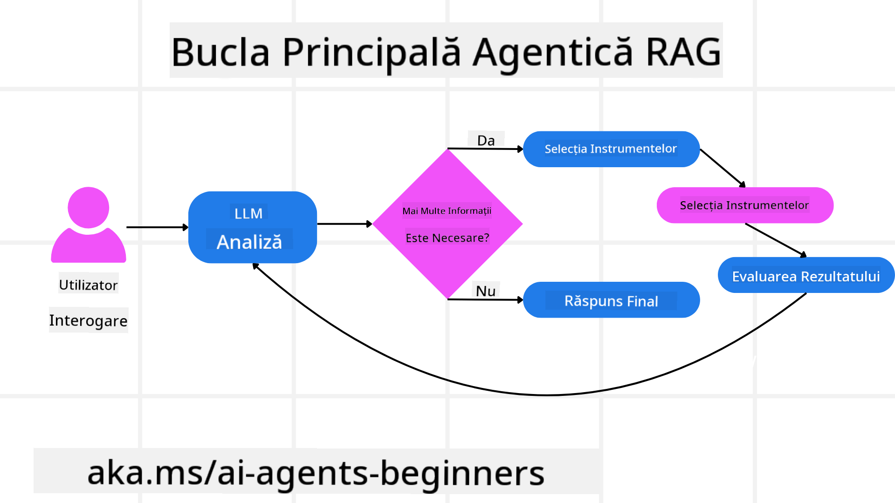
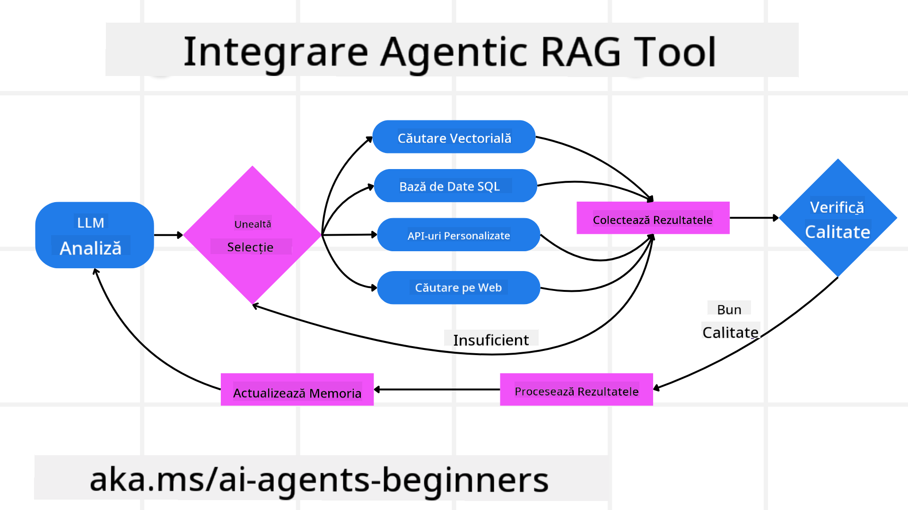
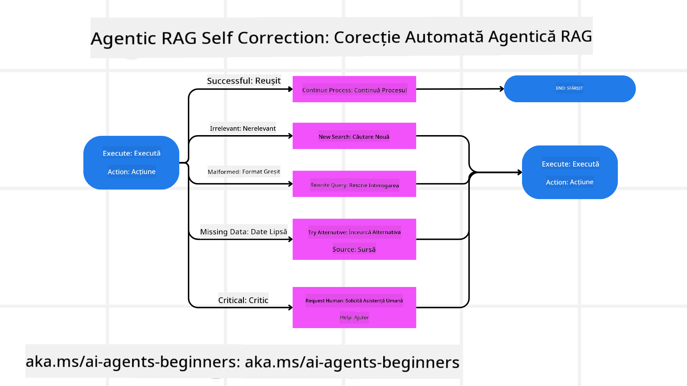
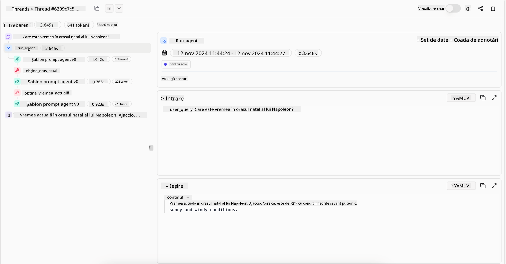
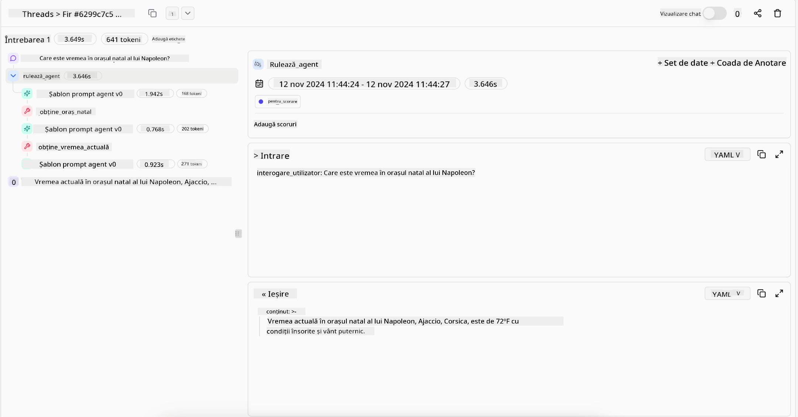

<!--
CO_OP_TRANSLATOR_METADATA:
{
  "original_hash": "7622aa72f9e676e593339f5f694ecd7d",
  "translation_date": "2025-07-12T10:12:16+00:00",
  "source_file": "05-agentic-rag/README.md",
  "language_code": "ro"
}
-->

> _(Click pe imaginea de mai sus pentru a viziona videoclipul acestei lecții)_

# Agentic RAG

Această lecție oferă o prezentare detaliată a Agentic Retrieval-Augmented Generation (Agentic RAG), un nou paradigm AI în care modelele mari de limbaj (LLM) își planifică în mod autonom pașii următori în timp ce extrag informații din surse externe. Spre deosebire de modelele statice de tip „recuperare-și-lectură”, Agentic RAG implică apeluri iterative către LLM, intercalate cu apeluri către unelte sau funcții și rezultate structurate. Sistemul evaluează rezultatele, rafinează interogările, apelează unelte suplimentare dacă este necesar și continuă acest ciclu până când se obține o soluție satisfăcătoare.

## Introducere

Această lecție va acoperi

- **Înțelegerea Agentic RAG:** Află despre noul paradigm AI în care modelele mari de limbaj (LLM) își planifică în mod autonom pașii următori în timp ce extrag informații din surse externe de date.
- **Înțelegerea stilului iterativ Maker-Checker:** Înțelege ciclul de apeluri iterative către LLM, intercalate cu apeluri către unelte sau funcții și rezultate structurate, conceput pentru a îmbunătăți corectitudinea și a gestiona interogările incorecte.
- **Explorarea aplicațiilor practice:** Identifică scenarii în care Agentic RAG excelează, cum ar fi mediile în care corectitudinea este prioritară, interacțiunile complexe cu baze de date și fluxurile de lucru extinse.

## Obiective de învățare

După finalizarea acestei lecții, vei ști să/vei înțelege:

- **Înțelegerea Agentic RAG:** Află despre noul paradigm AI în care modelele mari de limbaj (LLM) își planifică în mod autonom pașii următori în timp ce extrag informații din surse externe de date.
- **Stilul iterativ Maker-Checker:** Înțelege conceptul unui ciclu de apeluri iterative către LLM, intercalate cu apeluri către unelte sau funcții și rezultate structurate, conceput pentru a îmbunătăți corectitudinea și a gestiona interogările incorecte.
- **Deținerea procesului de raționament:** Înțelege capacitatea sistemului de a-și asuma procesul de raționament, luând decizii despre cum să abordeze problemele fără a se baza pe căi predefinite.
- **Fluxul de lucru:** Înțelege cum un model agentic decide independent să recupereze rapoarte despre tendințele pieței, să identifice date despre concurenți, să coreleze metrici interne de vânzări, să sintetizeze concluziile și să evalueze strategia.
- **Bucle iterative, integrarea uneltelor și memorie:** Află despre dependența sistemului de un model de interacțiune în buclă, menținând starea și memoria pe parcursul pașilor pentru a evita bucle repetitive și a lua decizii informate.
- **Gestionarea modurilor de eșec și autocorecția:** Explorează mecanismele robuste de autocorecție ale sistemului, inclusiv iterarea și reinterogarea, utilizarea uneltelor de diagnostic și apelarea la supravegherea umană.
- **Limitele agenției:** Înțelege limitările Agentic RAG, concentrându-se pe autonomia specifică domeniului, dependența de infrastructură și respectul pentru limitele impuse.
- **Cazuri practice și valoare:** Identifică scenarii în care Agentic RAG excelează, cum ar fi mediile în care corectitudinea este prioritară, interacțiunile complexe cu baze de date și fluxurile de lucru extinse.
- **Guvernanță, transparență și încredere:** Află despre importanța guvernanței și transparenței, inclusiv raționamentul explicabil, controlul biasului și supravegherea umană.

## Ce este Agentic RAG?

Agentic Retrieval-Augmented Generation (Agentic RAG) este un nou paradigm AI în care modelele mari de limbaj (LLM) își planifică în mod autonom pașii următori în timp ce extrag informații din surse externe. Spre deosebire de modelele statice de tip „recuperare-și-lectură”, Agentic RAG implică apeluri iterative către LLM, intercalate cu apeluri către unelte sau funcții și rezultate structurate. Sistemul evaluează rezultatele, rafinează interogările, apelează unelte suplimentare dacă este necesar și continuă acest ciclu până când se obține o soluție satisfăcătoare. Acest stil iterativ „maker-checker” îmbunătățește corectitudinea, gestionează interogările incorecte și asigură rezultate de înaltă calitate.

Sistemul își asumă activ procesul de raționament, rescriind interogările eșuate, alegând metode diferite de recuperare și integrând mai multe unelte — cum ar fi căutarea vectorială în Azure AI Search, baze de date SQL sau API-uri personalizate — înainte de a finaliza răspunsul. Calitatea distinctivă a unui sistem agentic este capacitatea sa de a-și asuma procesul de raționament. Implementările tradiționale RAG se bazează pe căi predefinite, dar un sistem agentic determină în mod autonom secvența pașilor în funcție de calitatea informațiilor găsite.

## Definirea Agentic Retrieval-Augmented Generation (Agentic RAG)

Agentic Retrieval-Augmented Generation (Agentic RAG) este un nou paradigm în dezvoltarea AI în care LLM-urile nu doar extrag informații din surse externe de date, ci și își planifică în mod autonom pașii următori. Spre deosebire de modelele statice de tip „recuperare-și-lectură” sau secvențele atent scriptate de prompturi, Agentic RAG implică un ciclu de apeluri iterative către LLM, intercalate cu apeluri către unelte sau funcții și rezultate structurate. La fiecare pas, sistemul evaluează rezultatele obținute, decide dacă trebuie să rafineze interogările, apelează unelte suplimentare dacă este necesar și continuă acest ciclu până când obține o soluție satisfăcătoare.

Acest stil iterativ „maker-checker” este conceput pentru a îmbunătăți corectitudinea, a gestiona interogările incorecte către baze de date structurate (de ex. NL2SQL) și a asigura rezultate echilibrate și de înaltă calitate. În loc să se bazeze exclusiv pe lanțuri de prompturi atent proiectate, sistemul își asumă activ procesul de raționament. Poate rescrie interogările care eșuează, alege metode diferite de recuperare și integrează mai multe unelte — cum ar fi căutarea vectorială în Azure AI Search, baze de date SQL sau API-uri personalizate — înainte de a finaliza răspunsul. Aceasta elimină necesitatea unor cadre de orchestrare excesiv de complexe. În schimb, un ciclu relativ simplu de „apel LLM → utilizare unealtă → apel LLM → …” poate genera rezultate sofisticate și bine fundamentate.

## Deținerea procesului de raționament

Calitatea distinctivă care face un sistem „agentic” este capacitatea sa de a-și asuma procesul de raționament. Implementările tradiționale RAG depind adesea de faptul că oamenii definesc în prealabil o cale pentru model: un lanț de gândire care indică ce să recupereze și când.
Dar când un sistem este cu adevărat agentic, el decide intern cum să abordeze problema. Nu execută doar un script; determină în mod autonom secvența pașilor în funcție de calitatea informațiilor găsite.
De exemplu, dacă i se cere să creeze o strategie de lansare a unui produs, nu se bazează doar pe un prompt care descrie întregul flux de cercetare și luare a deciziilor. În schimb, modelul agentic decide independent să:

1. Recupereze rapoarte actuale despre tendințele pieței folosind Bing Web Grounding
2. Identifice date relevante despre concurenți folosind Azure AI Search.
3. Coreleze metrici istorici interni de vânzări folosind Azure SQL Database.
4. Sintetizeze concluziile într-o strategie coerentă orchestrat prin Azure OpenAI Service.
5. Evalueze strategia pentru lacune sau inconsecvențe, declanșând o nouă rundă de recuperare dacă este necesar.
Toți acești pași — rafinarea interogărilor, alegerea surselor, iterarea până când este „mulțumit” de răspuns — sunt deciși de model, nu pre-scriptate de un om.

## Bucle iterative, integrarea uneltelor și memorie

Un sistem agentic se bazează pe un model de interacțiune în buclă:

- **Apel inițial:** Obiectivul utilizatorului (adică promptul utilizatorului) este prezentat LLM-ului.
- **Invocarea uneltei:** Dacă modelul identifică informații lipsă sau instrucțiuni ambigue, selectează o unealtă sau o metodă de recuperare — cum ar fi o interogare într-o bază de date vectorială (de ex. căutare hibridă Azure AI Search peste date private) sau un apel SQL structurat — pentru a aduna mai mult context.
- **Evaluare și rafinare:** După ce analizează datele returnate, modelul decide dacă informațiile sunt suficiente. Dacă nu, rafinează interogarea, încearcă o unealtă diferită sau își ajustează abordarea.
- **Repetă până este mulțumit:** Acest ciclu continuă până când modelul consideră că are suficientă claritate și dovezi pentru a oferi un răspuns final bine argumentat.
- **Memorie și stare:** Deoarece sistemul menține starea și memoria pe parcursul pașilor, poate reține încercările anterioare și rezultatele lor, evitând bucle repetitive și luând decizii mai bine informate pe măsură ce avansează.

În timp, acest lucru creează un sentiment de înțelegere evolutivă, permițând modelului să navigheze sarcini complexe, cu mai mulți pași, fără a necesita intervenția constantă a unui om sau remodelarea promptului.

## Gestionarea modurilor de eșec și autocorecția

Autonomia Agentic RAG implică și mecanisme robuste de autocorecție. Când sistemul întâlnește blocaje — cum ar fi recuperarea de documente irelevante sau interogări incorecte — poate:

- **Itera și reinteroga:** În loc să returneze răspunsuri cu valoare scăzută, modelul încearcă strategii noi de căutare, rescrie interogările către baze de date sau analizează seturi alternative de date.
- **Folosi unelte de diagnostic:** Sistemul poate invoca funcții suplimentare concepute să-l ajute să depaneze pașii de raționament sau să confirme corectitudinea datelor recuperate. Unelte precum Azure AI Tracing vor fi importante pentru a asigura observabilitate și monitorizare robuste.
- **Apela la supravegherea umană:** Pentru scenarii cu miză mare sau eșecuri repetate, modelul poate semnala incertitudinea și solicita ghidare umană. Odată ce omul oferă feedback corectiv, modelul poate încorpora această lecție pe viitor.

Această abordare iterativă și dinamică permite modelului să se îmbunătățească continuu, asigurând că nu este doar un sistem „one-shot”, ci unul care învață din greșelile sale în timpul unei sesiuni date.

## Limitele agenției

În ciuda autonomiei sale în cadrul unei sarcini, Agentic RAG nu este echivalent cu Inteligența Artificială Generală. Capacitățile sale „agentice” sunt limitate la uneltele, sursele de date și politicile furnizate de dezvoltatorii umani. Nu poate inventa propriile unelte sau ieși din limitele domeniului stabilite. În schimb, excelează în orchestrarea dinamică a resurselor disponibile.
Diferențele cheie față de formele mai avansate de AI includ:

1. **Autonomie specifică domeniului:** Sistemele Agentic RAG se concentrează pe atingerea obiectivelor definite de utilizator într-un domeniu cunoscut, folosind strategii precum rescrierea interogărilor sau selecția uneltelor pentru a îmbunătăți rezultatele.
2. **Dependență de infrastructură:** Capacitățile sistemului depind de uneltele și datele integrate de dezvoltatori. Nu poate depăși aceste limite fără intervenție umană.
3. **Respectarea limitelor:** Ghidurile etice, regulile de conformitate și politicile de afaceri rămân foarte importante. Libertatea agentului este întotdeauna restricționată de măsuri de siguranță și mecanisme de supraveghere (sperăm?).

## Cazuri practice și valoare

Agentic RAG strălucește în scenarii care necesită rafinare iterativă și precizie:

1. **Mediile în care corectitudinea este prioritară:** În verificări de conformitate, analize reglementare sau cercetare juridică, modelul agentic poate verifica repetat faptele, consulta multiple surse și rescrie interogările până produce un răspuns bine verificat.
2. **Interacțiuni complexe cu baze de date:** Când se lucrează cu date structurate unde interogările pot eșua frecvent sau trebuie ajustate, sistemul poate rafina autonom interogările folosind Azure SQL sau Microsoft Fabric OneLake, asigurând că recuperarea finală corespunde intenției utilizatorului.
3. **Fluxuri de lucru extinse:** Sesiunile de durată mai lungă pot evolua pe măsură ce apar informații noi. Agentic RAG poate încorpora continuu date noi, schimbând strategiile pe măsură ce învață mai multe despre domeniul problemei.

## Guvernanță, transparență și încredere

Pe măsură ce aceste sisteme devin mai autonome în raționamentul lor, guvernanța și transparența devin cruciale:

- **Raționament explicabil:** Modelul poate oferi o pistă de audit a interogărilor făcute, a surselor consultate și a pașilor de raționament urmați pentru a ajunge la concluzie. Unelte precum Azure AI Content Safety și Azure AI Tracing / GenAIOps pot ajuta la menținerea transparenței și reducerea riscurilor.
- **Controlul biasului și recuperare echilibrată:** Dezvoltatorii pot ajusta strategiile de recuperare pentru a asigura că sunt luate în considerare surse de date echilibrate și reprezentative și pot audita periodic rezultatele pentru a detecta biasuri sau modele distorsionate folosind modele personalizate pentru organizații avansate de știință a datelor care utilizează Azure Machine Learning.
- **Supravegherea umană și conformitatea:** Pentru sarcini sensibile, revizuirea umană rămâne esențială. Agentic RAG nu înlocuiește judecata umană în deciziile cu miză mare — o completează prin oferirea unor opțiuni mai bine verificate.

Este esențial să existe unelte care să ofere un istoric clar al acțiunilor. Fără acestea, depanarea unui proces cu mai mulți pași poate fi foarte dificilă. Vezi exemplul următor de la Literal AI (compania din spatele Chainlit) pentru o rulare Agent:

## Concluzie

Agentic RAG reprezintă o evoluție naturală în modul în care sistemele AI gestionează sarcini complexe, intensive în date. Prin adoptarea unui model de interacțiune în buclă, selectarea autonomă a uneltelor și rafinarea interogărilor până la obținerea unui rezultat de înaltă calitate, sistemul depășește simpla urmărire a prompturilor statice, devenind un factor decizional mai adaptiv și conștient de context. Deși este încă limitat de infrastructurile și ghidurile etice definite de oameni, aceste capacități agentice permit interacțiuni AI mai bogate, mai dinamice și, în cele din urmă, mai utile atât pentru companii, cât și pentru utilizatorii finali.

## Resurse suplimentare

- <a href="https://learn.microsoft.com/training/modules/use-own-data-azure-openai" target="_blank">Implementarea Retrieval Augmented Generation (RAG) cu Azure OpenAI Service: Află cum să folosești propriile date cu Azure OpenAI Service. Acest modul Microsoft Learn oferă

- <a href="https://learn.microsoft.com/azure/ai-studio/concepts/evaluation-approach-gen-ai" target="_blank">Evaluarea aplicațiilor AI generative cu Azure AI Foundry: Acest articol tratează evaluarea și compararea modelelor pe seturi de date publice, inclusiv aplicații Agentic AI și arhitecturi RAG</a>
- <a href="https://weaviate.io/blog/what-is-agentic-rag" target="_blank">Ce este Agentic RAG | Weaviate</a>
- <a href="https://ragaboutit.com/agentic-rag-a-complete-guide-to-agent-based-retrieval-augmented-generation/" target="_blank">Agentic RAG: Ghid complet pentru generarea augmentată prin recuperare bazată pe agenți – Noutăți din generația RAG</a>
- <a href="https://huggingface.co/learn/cookbook/agent_rag" target="_blank">Agentic RAG: accelerează-ți RAG cu reformularea interogărilor și auto-interogarea! Cookbook AI Open-Source de la Hugging Face</a>
- <a href="https://youtu.be/aQ4yQXeB1Ss?si=2HUqBzHoeB5tR04U" target="_blank">Adăugarea straturilor Agentic la RAG</a>
- <a href="https://www.youtube.com/watch?v=zeAyuLc_f3Q&t=244s" target="_blank">Viitorul asistenților de cunoștințe: Jerry Liu</a>
- <a href="https://www.youtube.com/watch?v=AOSjiXP1jmQ" target="_blank">Cum să construiești sisteme Agentic RAG</a>
- <a href="https://ignite.microsoft.com/sessions/BRK102?source=sessions" target="_blank">Folosirea serviciului Azure AI Foundry Agent pentru a scala agenții tăi AI</a>

### Articole academice

- <a href="https://arxiv.org/abs/2303.17651" target="_blank">2303.17651 Self-Refine: Îmbunătățire iterativă cu feedback propriu</a>
- <a href="https://arxiv.org/abs/2303.11366" target="_blank">2303.11366 Reflexion: Agenți lingvistici cu învățare prin întărire verbală</a>
- <a href="https://arxiv.org/abs/2305.11738" target="_blank">2305.11738 CRITIC: Modelele mari de limbaj se pot autocorecta prin critică interactivă cu unelte</a>
- <a href="https://arxiv.org/abs/2501.09136" target="_blank">2501.09136 Agentic Retrieval-Augmented Generation: O privire de ansamblu asupra Agentic RAG</a>

## Lecția anterioară

[Tipar de proiectare pentru utilizarea uneltelor](../04-tool-use/README.md)

## Lecția următoare

[Construirea agenților AI de încredere](../06-building-trustworthy-agents/README.md)

**Declinare de responsabilitate**:  
Acest document a fost tradus folosind serviciul de traducere AI [Co-op Translator](https://github.com/Azure/co-op-translator). Deși ne străduim pentru acuratețe, vă rugăm să rețineți că traducerile automate pot conține erori sau inexactități. Documentul original în limba sa nativă trebuie considerat sursa autorizată. Pentru informații critice, se recomandă traducerea profesională realizată de un specialist uman. Nu ne asumăm răspunderea pentru eventualele neînțelegeri sau interpretări greșite rezultate din utilizarea acestei traduceri.