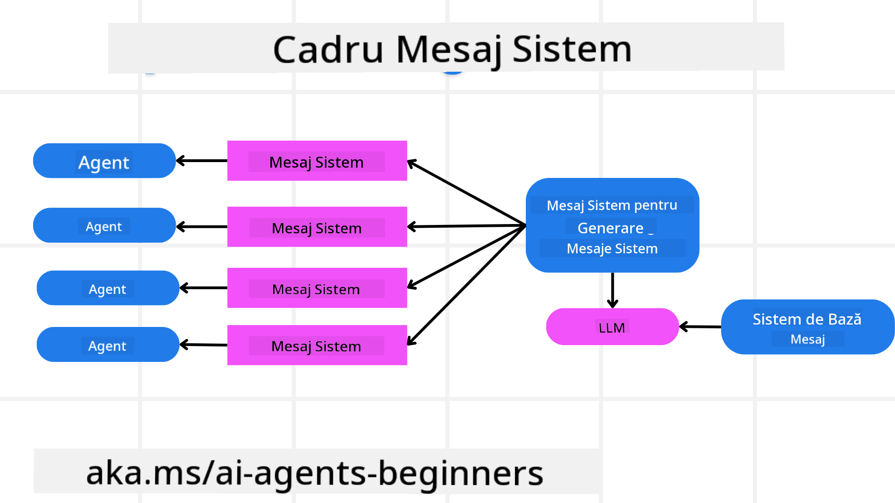
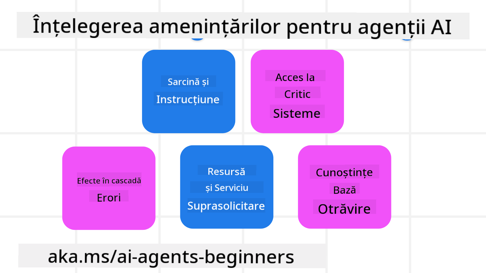
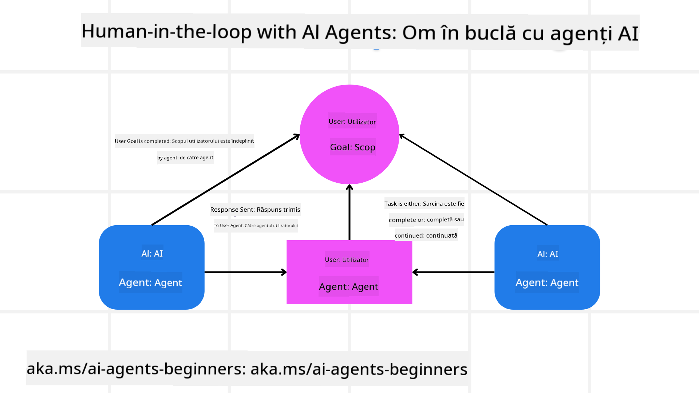

<!--
CO_OP_TRANSLATOR_METADATA:
{
  "original_hash": "f57852cac3a86c4a5ef47f793cc12178",
  "translation_date": "2025-07-12T10:32:13+00:00",
  "source_file": "06-building-trustworthy-agents/README.md",
  "language_code": "ro"
}
-->
[](https://youtu.be/iZKkMEGBCUQ?si=Q-kEbcyHUMPoHp8L)

> _(Click pe imaginea de mai sus pentru a viziona videoclipul acestei lecții)_

# Construirea agenților AI de încredere

## Introducere

Această lecție va acoperi:

- Cum să construiești și să implementezi agenți AI siguri și eficienți
- Considerații importante de securitate în dezvoltarea agenților AI
- Cum să menții confidențialitatea datelor și a utilizatorilor în dezvoltarea agenților AI

## Obiective de învățare

După finalizarea acestei lecții, vei ști cum să:

- Identifici și să reduci riscurile în crearea agenților AI
- Implementezi măsuri de securitate pentru a asigura gestionarea corectă a datelor și accesului
- Creezi agenți AI care păstrează confidențialitatea datelor și oferă o experiență de calitate utilizatorului

## Siguranța

Să începem prin a analiza construirea aplicațiilor agentice sigure. Siguranța înseamnă că agentul AI funcționează conform designului. Ca dezvoltatori de aplicații agentice, avem metode și instrumente pentru a maximiza siguranța:

### Construirea unui cadru pentru mesaje de sistem

Dacă ai construit vreodată o aplicație AI folosind modele mari de limbaj (LLM-uri), știi cât de important este să proiectezi un prompt de sistem robust sau un mesaj de sistem. Aceste prompturi stabilesc regulile meta, instrucțiunile și ghidurile pentru modul în care LLM-ul va interacționa cu utilizatorul și cu datele.

Pentru agenții AI, promptul de sistem este și mai important, deoarece aceștia vor avea nevoie de instrucțiuni foarte specifice pentru a îndeplini sarcinile pe care le-am proiectat pentru ei.

Pentru a crea prompturi de sistem scalabile, putem folosi un cadru de mesaje de sistem pentru a construi unul sau mai mulți agenți în aplicația noastră:



#### Pasul 1: Creează un mesaj meta de sistem

Promptul meta va fi folosit de un LLM pentru a genera prompturile de sistem pentru agenții pe care îi creăm. Îl proiectăm ca un șablon pentru a putea crea eficient mai mulți agenți, dacă este nevoie.

Iată un exemplu de mesaj meta de sistem pe care l-am da LLM-ului:

```plaintext
You are an expert at creating AI agent assistants. 
You will be provided a company name, role, responsibilities and other
information that you will use to provide a system prompt for.
To create the system prompt, be descriptive as possible and provide a structure that a system using an LLM can better understand the role and responsibilities of the AI assistant. 
```

#### Pasul 2: Creează un prompt de bază

Următorul pas este să creezi un prompt de bază pentru a descrie agentul AI. Ar trebui să incluzi rolul agentului, sarcinile pe care le va îndeplini și orice alte responsabilități ale agentului.

Iată un exemplu:

```plaintext
You are a travel agent for Contoso Travel that is great at booking flights for customers. To help customers you can perform the following tasks: lookup available flights, book flights, ask for preferences in seating and times for flights, cancel any previously booked flights and alert customers on any delays or cancellations of flights.  
```

#### Pasul 3: Oferă mesajul de sistem de bază către LLM

Acum putem optimiza acest mesaj de sistem oferind mesajul meta de sistem ca mesaj de sistem și mesajul nostru de sistem de bază.

Acest lucru va genera un mesaj de sistem mai bine conceput pentru a ghida agenții AI:

```markdown
**Company Name:** Contoso Travel  
**Role:** Travel Agent Assistant

**Objective:**  
You are an AI-powered travel agent assistant for Contoso Travel, specializing in booking flights and providing exceptional customer service. Your main goal is to assist customers in finding, booking, and managing their flights, all while ensuring that their preferences and needs are met efficiently.

**Key Responsibilities:**

1. **Flight Lookup:**
    
    - Assist customers in searching for available flights based on their specified destination, dates, and any other relevant preferences.
    - Provide a list of options, including flight times, airlines, layovers, and pricing.
2. **Flight Booking:**
    
    - Facilitate the booking of flights for customers, ensuring that all details are correctly entered into the system.
    - Confirm bookings and provide customers with their itinerary, including confirmation numbers and any other pertinent information.
3. **Customer Preference Inquiry:**
    
    - Actively ask customers for their preferences regarding seating (e.g., aisle, window, extra legroom) and preferred times for flights (e.g., morning, afternoon, evening).
    - Record these preferences for future reference and tailor suggestions accordingly.
4. **Flight Cancellation:**
    
    - Assist customers in canceling previously booked flights if needed, following company policies and procedures.
    - Notify customers of any necessary refunds or additional steps that may be required for cancellations.
5. **Flight Monitoring:**
    
    - Monitor the status of booked flights and alert customers in real-time about any delays, cancellations, or changes to their flight schedule.
    - Provide updates through preferred communication channels (e.g., email, SMS) as needed.

**Tone and Style:**

- Maintain a friendly, professional, and approachable demeanor in all interactions with customers.
- Ensure that all communication is clear, informative, and tailored to the customer's specific needs and inquiries.

**User Interaction Instructions:**

- Respond to customer queries promptly and accurately.
- Use a conversational style while ensuring professionalism.
- Prioritize customer satisfaction by being attentive, empathetic, and proactive in all assistance provided.

**Additional Notes:**

- Stay updated on any changes to airline policies, travel restrictions, and other relevant information that could impact flight bookings and customer experience.
- Use clear and concise language to explain options and processes, avoiding jargon where possible for better customer understanding.

This AI assistant is designed to streamline the flight booking process for customers of Contoso Travel, ensuring that all their travel needs are met efficiently and effectively.

```

#### Pasul 4: Iterează și îmbunătățește

Valoarea acestui cadru de mesaje de sistem este că permite scalarea creării mesajelor de sistem pentru mai mulți agenți mai ușor, precum și îmbunătățirea mesajelor de sistem în timp. Este rar să ai un mesaj de sistem care să funcționeze perfect din prima pentru întregul tău caz de utilizare. Posibilitatea de a face mici ajustări și îmbunătățiri prin schimbarea mesajului de sistem de bază și rularea lui prin sistem îți va permite să compari și să evaluezi rezultatele.

## Înțelegerea amenințărilor

Pentru a construi agenți AI de încredere, este important să înțelegi și să reduci riscurile și amenințările la adresa agentului tău AI. Să analizăm doar câteva dintre amenințările diferite la adresa agenților AI și cum te poți pregăti mai bine pentru ele.



### Sarcină și Instrucțiuni

**Descriere:** Atacatorii încearcă să schimbe instrucțiunile sau obiectivele agentului AI prin prompturi sau manipularea inputurilor.

**Reducere:** Efectuează verificări de validare și filtrează inputurile pentru a detecta prompturi potențial periculoase înainte ca acestea să fie procesate de agentul AI. Deoarece aceste atacuri necesită de obicei interacțiuni frecvente cu agentul, limitarea numărului de schimburi într-o conversație este o altă metodă de prevenire a acestor tipuri de atacuri.

### Acces la sisteme critice

**Descriere:** Dacă un agent AI are acces la sisteme și servicii care stochează date sensibile, atacatorii pot compromite comunicarea dintre agent și aceste servicii. Acestea pot fi atacuri directe sau încercări indirecte de a obține informații despre aceste sisteme prin agent.

**Reducere:** Agenții AI ar trebui să aibă acces la sisteme doar pe bază de necesitate pentru a preveni aceste tipuri de atacuri. Comunicarea dintre agent și sistem trebuie să fie de asemenea securizată. Implementarea autentificării și controlului accesului este o altă metodă de protejare a acestor informații.

### Suprasolicitarea resurselor și serviciilor

**Descriere:** Agenții AI pot accesa diferite instrumente și servicii pentru a îndeplini sarcini. Atacatorii pot folosi această capacitate pentru a ataca aceste servicii prin trimiterea unui volum mare de cereri prin agentul AI, ceea ce poate duce la defecțiuni ale sistemului sau costuri ridicate.

**Reducere:** Implementează politici pentru a limita numărul de cereri pe care un agent AI le poate face către un serviciu. Limitarea numărului de schimburi în conversație și a cererilor către agentul AI este o altă metodă de prevenire a acestor tipuri de atacuri.

### Otrăvirea bazei de cunoștințe

**Descriere:** Acest tip de atac nu vizează direct agentul AI, ci baza de cunoștințe și alte servicii pe care agentul AI le va folosi. Poate implica coruperea datelor sau informațiilor pe care agentul AI le va folosi pentru a îndeplini o sarcină, conducând la răspunsuri părtinitoare sau neintenționate către utilizator.

**Reducere:** Efectuează verificări regulate ale datelor pe care agentul AI le va folosi în fluxurile sale de lucru. Asigură-te că accesul la aceste date este securizat și că pot fi modificate doar de persoane de încredere pentru a evita acest tip de atac.

### Erori în cascadă

**Descriere:** Agenții AI accesează diverse instrumente și servicii pentru a îndeplini sarcini. Erorile cauzate de atacatori pot duce la defecțiuni ale altor sisteme la care agentul AI este conectat, făcând atacul mai extins și mai greu de diagnosticat.

**Reducere:** O metodă de a evita acest lucru este să faci ca agentul AI să opereze într-un mediu limitat, cum ar fi executarea sarcinilor într-un container Docker, pentru a preveni atacurile directe asupra sistemului. Crearea unor mecanisme de rezervă și a unei logici de reîncercare când anumite sisteme răspund cu eroare este o altă metodă de prevenire a defecțiunilor majore ale sistemului.

## Human-in-the-Loop

O altă metodă eficientă de a construi sisteme de agenți AI de încredere este utilizarea unui Human-in-the-loop. Aceasta creează un flux în care utilizatorii pot oferi feedback agenților în timpul execuției. Practic, utilizatorii acționează ca agenți într-un sistem multi-agent, oferind aprobarea sau oprirea procesului în desfășurare.



Iată un fragment de cod care folosește AutoGen pentru a arăta cum este implementat acest concept:

```python

# Create the agents.
model_client = OpenAIChatCompletionClient(model="gpt-4o-mini")
assistant = AssistantAgent("assistant", model_client=model_client)
user_proxy = UserProxyAgent("user_proxy", input_func=input)  # Use input() to get user input from console.

# Create the termination condition which will end the conversation when the user says "APPROVE".
termination = TextMentionTermination("APPROVE")

# Create the team.
team = RoundRobinGroupChat([assistant, user_proxy], termination_condition=termination)

# Run the conversation and stream to the console.
stream = team.run_stream(task="Write a 4-line poem about the ocean.")
# Use asyncio.run(...) when running in a script.
await Console(stream)

```

## Concluzie

Construirea agenților AI de încredere necesită un design atent, măsuri robuste de securitate și o iterare continuă. Prin implementarea unor sisteme structurate de meta-prompturi, înțelegerea amenințărilor potențiale și aplicarea strategiilor de reducere, dezvoltatorii pot crea agenți AI care sunt atât siguri, cât și eficienți. În plus, încorporarea unei abordări human-in-the-loop asigură că agenții AI rămân aliniați cu nevoile utilizatorilor, minimizând riscurile. Pe măsură ce AI continuă să evolueze, menținerea unei poziții proactive privind securitatea, confidențialitatea și considerentele etice va fi esențială pentru a cultiva încrederea și fiabilitatea în sistemele bazate pe AI.

## Resurse suplimentare

- <a href="https://learn.microsoft.com/azure/ai-studio/responsible-use-of-ai-overview" target="_blank">Prezentare generală Responsible AI</a>
- <a href="https://learn.microsoft.com/azure/ai-studio/concepts/evaluation-approach-gen-ai" target="_blank">Evaluarea modelelor generative AI și a aplicațiilor AI</a>
- <a href="https://learn.microsoft.com/azure/ai-services/openai/concepts/system-message?context=%2Fazure%2Fai-studio%2Fcontext%2Fcontext&tabs=top-techniques" target="_blank">Mesaje de sistem pentru siguranță</a>
- <a href="https://blogs.microsoft.com/wp-content/uploads/prod/sites/5/2022/06/Microsoft-RAI-Impact-Assessment-Template.pdf?culture=en-us&country=us" target="_blank">Șablon pentru evaluarea riscurilor</a>

## Lecția anterioară

[Agentic RAG](../05-agentic-rag/README.md)

## Lecția următoare

[Planning Design Pattern](../07-planning-design/README.md)

**Declinare de responsabilitate**:  
Acest document a fost tradus folosind serviciul de traducere AI [Co-op Translator](https://github.com/Azure/co-op-translator). Deși ne străduim pentru acuratețe, vă rugăm să rețineți că traducerile automate pot conține erori sau inexactități. Documentul original în limba sa nativă trebuie considerat sursa autorizată. Pentru informații critice, se recomandă traducerea profesională realizată de un specialist uman. Nu ne asumăm răspunderea pentru eventualele neînțelegeri sau interpretări greșite rezultate din utilizarea acestei traduceri.