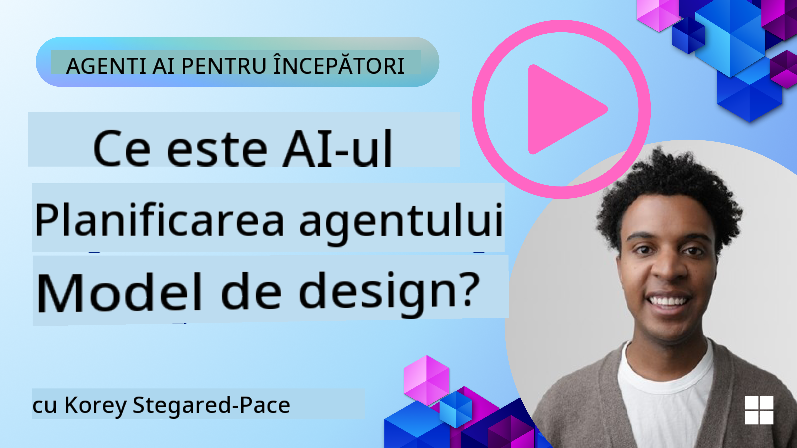
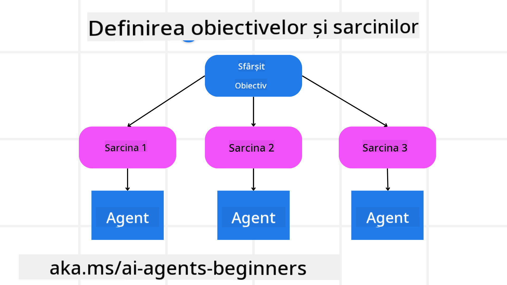

<!--
CO_OP_TRANSLATOR_METADATA:
{
  "original_hash": "a28d30590704ea13b6a08d4793cf9c2b",
  "translation_date": "2025-08-29T20:56:39+00:00",
  "source_file": "07-planning-design/README.md",
  "language_code": "ro"
}
-->
[](https://youtu.be/kPfJ2BrBCMY?si=9pYpPXp0sSbK91Dr)

> _(Faceți clic pe imaginea de mai sus pentru a viziona videoclipul acestei lecții)_

# Planificarea Designului

## Introducere

Această lecție va acoperi:

* Definirea unui obiectiv general clar și împărțirea unei sarcini complexe în sarcini gestionabile.
* Utilizarea unui output structurat pentru răspunsuri mai fiabile și ușor de citit de mașini.
* Aplicarea unei abordări bazate pe evenimente pentru a gestiona sarcini dinamice și intrări neașteptate.

## Obiective de Învățare

După finalizarea acestei lecții, veți înțelege:

* Cum să identificați și să stabiliți un obiectiv general pentru un agent AI, asigurându-vă că știe clar ce trebuie realizat.
* Cum să descompuneți o sarcină complexă în subtasks gestionabile și să le organizați într-o secvență logică.
* Cum să echipați agenții cu instrumentele potrivite (de exemplu, instrumente de căutare sau analiză de date), să decideți când și cum să le utilizați și să gestionați situațiile neașteptate care apar.
* Cum să evaluați rezultatele subtasks, să măsurați performanța și să iterați acțiunile pentru a îmbunătăți rezultatul final.

## Definirea Obiectivului General și Descompunerea unei Sarcini



Cele mai multe sarcini din lumea reală sunt prea complexe pentru a fi abordate într-un singur pas. Un agent AI are nevoie de un obiectiv concis pentru a-și ghida planificarea și acțiunile. De exemplu, luați în considerare obiectivul:

    "Generează un itinerar de călătorie pentru 3 zile."

Deși este simplu de formulat, necesită totuși rafinare. Cu cât obiectivul este mai clar, cu atât agentul (și orice colaboratori umani) se pot concentra mai bine pe obținerea rezultatului dorit, cum ar fi crearea unui itinerar cu opțiuni de zbor, recomandări de hoteluri și sugestii de activități.

### Descompunerea Sarcinilor

Sarcinile mari sau complexe devin mai gestionabile atunci când sunt împărțite în subtasks mai mici, orientate spre obiective.
Pentru exemplul itinerarului de călătorie, puteți descompune obiectivul în:

* Rezervarea Zborurilor
* Rezervarea Hotelurilor
* Închirierea Mașinilor
* Personalizare

Fiecare subtask poate fi abordată de agenți sau procese dedicate. Un agent ar putea fi specializat în căutarea celor mai bune oferte de zboruri, altul în rezervarea hotelurilor și așa mai departe. Un agent coordonator sau „downstream” poate apoi să compileze aceste rezultate într-un itinerar coerent pentru utilizatorul final.

Această abordare modulară permite, de asemenea, îmbunătățiri incrementale. De exemplu, puteți adăuga agenți specializați pentru Recomandări de Restaurante sau Sugestii de Activități Locale și să rafinați itinerarul în timp.

### Output Structurat

Modelele de Limbaj de Dimensiuni Mari (LLMs) pot genera output structurat (de exemplu, JSON) care este mai ușor de analizat și procesat de agenți sau servicii downstream. Acest lucru este deosebit de util într-un context multi-agent, unde putem acționa asupra acestor sarcini după ce output-ul de planificare este primit. Consultați acest lucru pentru o privire rapidă.

Următorul fragment de cod Python demonstrează un agent de planificare simplu care descompune un obiectiv în subtasks și generează un plan structurat:

```python
from pydantic import BaseModel
from enum import Enum
from typing import List, Optional, Union
import json
import os
from typing import Optional
from pprint import pprint
from autogen_core.models import UserMessage, SystemMessage, AssistantMessage
from autogen_ext.models.azure import AzureAIChatCompletionClient
from azure.core.credentials import AzureKeyCredential

class AgentEnum(str, Enum):
    FlightBooking = "flight_booking"
    HotelBooking = "hotel_booking"
    CarRental = "car_rental"
    ActivitiesBooking = "activities_booking"
    DestinationInfo = "destination_info"
    DefaultAgent = "default_agent"
    GroupChatManager = "group_chat_manager"

# Travel SubTask Model
class TravelSubTask(BaseModel):
    task_details: str
    assigned_agent: AgentEnum  # we want to assign the task to the agent

class TravelPlan(BaseModel):
    main_task: str
    subtasks: List[TravelSubTask]
    is_greeting: bool

client = AzureAIChatCompletionClient(
    model="gpt-4o-mini",
    endpoint="https://models.inference.ai.azure.com",
    # To authenticate with the model you will need to generate a personal access token (PAT) in your GitHub settings.
    # Create your PAT token by following instructions here: https://docs.github.com/en/authentication/keeping-your-account-and-data-secure/managing-your-personal-access-tokens
    credential=AzureKeyCredential(os.environ["GITHUB_TOKEN"]),
    model_info={
        "json_output": False,
        "function_calling": True,
        "vision": True,
        "family": "unknown",
    },
)

# Define the user message
messages = [
    SystemMessage(content="""You are an planner agent.
    Your job is to decide which agents to run based on the user's request.
                      Provide your response in JSON format with the following structure:
{'main_task': 'Plan a family trip from Singapore to Melbourne.',
 'subtasks': [{'assigned_agent': 'flight_booking',
               'task_details': 'Book round-trip flights from Singapore to '
                               'Melbourne.'}
    Below are the available agents specialised in different tasks:
    - FlightBooking: For booking flights and providing flight information
    - HotelBooking: For booking hotels and providing hotel information
    - CarRental: For booking cars and providing car rental information
    - ActivitiesBooking: For booking activities and providing activity information
    - DestinationInfo: For providing information about destinations
    - DefaultAgent: For handling general requests""", source="system"),
    UserMessage(
        content="Create a travel plan for a family of 2 kids from Singapore to Melboune", source="user"),
]

response = await client.create(messages=messages, extra_create_args={"response_format": 'json_object'})

response_content: Optional[str] = response.content if isinstance(
    response.content, str) else None
if response_content is None:
    raise ValueError("Response content is not a valid JSON string" )

pprint(json.loads(response_content))

# # Ensure the response content is a valid JSON string before loading it
# response_content: Optional[str] = response.content if isinstance(
#     response.content, str) else None
# if response_content is None:
#     raise ValueError("Response content is not a valid JSON string")

# # Print the response content after loading it as JSON
# pprint(json.loads(response_content))

# Validate the response content with the MathReasoning model
# TravelPlan.model_validate(json.loads(response_content))
```

### Agent de Planificare cu Orchestrare Multi-Agent

În acest exemplu, un Semantic Router Agent primește o cerere de la utilizator (de exemplu, "Am nevoie de un plan de hotel pentru călătoria mea.").

Planificatorul apoi:

* Primește Planul de Hotel: Planificatorul preia mesajul utilizatorului și, pe baza unui prompt de sistem (inclusiv detalii despre agenții disponibili), generează un plan de călătorie structurat.
* Listează Agenții și Instrumentele Lor: Registrul de agenți conține o listă de agenți (de exemplu, pentru zboruri, hoteluri, închirieri de mașini și activități) împreună cu funcțiile sau instrumentele pe care le oferă.
* Direcționează Planul către Agenții Relevanți: În funcție de numărul de subtasks, planificatorul trimite fie mesajul direct unui agent dedicat (pentru scenarii cu o singură sarcină), fie coordonează printr-un manager de chat de grup pentru colaborare multi-agent.
* Rezumă Rezultatul: În cele din urmă, planificatorul rezumă planul generat pentru claritate.
Următorul exemplu de cod Python ilustrează acești pași:

```python

from pydantic import BaseModel

from enum import Enum
from typing import List, Optional, Union

class AgentEnum(str, Enum):
    FlightBooking = "flight_booking"
    HotelBooking = "hotel_booking"
    CarRental = "car_rental"
    ActivitiesBooking = "activities_booking"
    DestinationInfo = "destination_info"
    DefaultAgent = "default_agent"
    GroupChatManager = "group_chat_manager"

# Travel SubTask Model

class TravelSubTask(BaseModel):
    task_details: str
    assigned_agent: AgentEnum # we want to assign the task to the agent

class TravelPlan(BaseModel):
    main_task: str
    subtasks: List[TravelSubTask]
    is_greeting: bool
import json
import os
from typing import Optional

from autogen_core.models import UserMessage, SystemMessage, AssistantMessage
from autogen_ext.models.openai import AzureOpenAIChatCompletionClient

# Create the client with type-checked environment variables

client = AzureOpenAIChatCompletionClient(
    azure_deployment=os.getenv("AZURE_OPENAI_DEPLOYMENT_NAME"),
    model=os.getenv("AZURE_OPENAI_DEPLOYMENT_NAME"),
    api_version=os.getenv("AZURE_OPENAI_API_VERSION"),
    azure_endpoint=os.getenv("AZURE_OPENAI_ENDPOINT"),
    api_key=os.getenv("AZURE_OPENAI_API_KEY"),
)

from pprint import pprint

# Define the user message

messages = [
    SystemMessage(content="""You are an planner agent.
    Your job is to decide which agents to run based on the user's request.
    Below are the available agents specialized in different tasks:
    - FlightBooking: For booking flights and providing flight information
    - HotelBooking: For booking hotels and providing hotel information
    - CarRental: For booking cars and providing car rental information
    - ActivitiesBooking: For booking activities and providing activity information
    - DestinationInfo: For providing information about destinations
    - DefaultAgent: For handling general requests""", source="system"),
    UserMessage(content="Create a travel plan for a family of 2 kids from Singapore to Melbourne", source="user"),
]

response = await client.create(messages=messages, extra_create_args={"response_format": TravelPlan})

# Ensure the response content is a valid JSON string before loading it

response_content: Optional[str] = response.content if isinstance(response.content, str) else None
if response_content is None:
    raise ValueError("Response content is not a valid JSON string")

# Print the response content after loading it as JSON

pprint(json.loads(response_content))
```

Ce urmează este output-ul din codul anterior, iar apoi puteți utiliza acest output structurat pentru a direcționa către `assigned_agent` și a rezuma planul de călătorie pentru utilizatorul final.

```json
{
    "is_greeting": "False",
    "main_task": "Plan a family trip from Singapore to Melbourne.",
    "subtasks": [
        {
            "assigned_agent": "flight_booking",
            "task_details": "Book round-trip flights from Singapore to Melbourne."
        },
        {
            "assigned_agent": "hotel_booking",
            "task_details": "Find family-friendly hotels in Melbourne."
        },
        {
            "assigned_agent": "car_rental",
            "task_details": "Arrange a car rental suitable for a family of four in Melbourne."
        },
        {
            "assigned_agent": "activities_booking",
            "task_details": "List family-friendly activities in Melbourne."
        },
        {
            "assigned_agent": "destination_info",
            "task_details": "Provide information about Melbourne as a travel destination."
        }
    ]
}
```

Un notebook de exemplu cu codul anterior este disponibil [aici](07-autogen.ipynb).

### Planificare Iterativă

Unele sarcini necesită un proces iterativ sau de re-planificare, unde rezultatul unui subtask influențează următorul. De exemplu, dacă agentul descoperă un format de date neașteptat în timp ce rezervă zboruri, ar putea fi necesar să-și adapteze strategia înainte de a trece la rezervarea hotelurilor.

În plus, feedback-ul utilizatorului (de exemplu, un utilizator care decide că preferă un zbor mai devreme) poate declanșa o re-planificare parțială. Această abordare dinamică, iterativă, asigură că soluția finală se aliniază cu constrângerile din lumea reală și preferințele utilizatorului în evoluție.

Exemplu de cod:

```python
from autogen_core.models import UserMessage, SystemMessage, AssistantMessage
#.. same as previous code and pass on the user history, current plan
messages = [
    SystemMessage(content="""You are a planner agent to optimize the
    Your job is to decide which agents to run based on the user's request.
    Below are the available agents specialized in different tasks:
    - FlightBooking: For booking flights and providing flight information
    - HotelBooking: For booking hotels and providing hotel information
    - CarRental: For booking cars and providing car rental information
    - ActivitiesBooking: For booking activities and providing activity information
    - DestinationInfo: For providing information about destinations
    - DefaultAgent: For handling general requests""", source="system"),
    UserMessage(content="Create a travel plan for a family of 2 kids from Singapore to Melbourne", source="user"),
    AssistantMessage(content=f"Previous travel plan - {TravelPlan}", source="assistant")
]
# .. re-plan and send the tasks to respective agents
```

Pentru o planificare mai cuprinzătoare, consultați Magnetic One pentru rezolvarea sarcinilor complexe.

## Rezumat

În acest articol, am analizat un exemplu despre cum putem crea un planificator care poate selecta dinamic agenții disponibili definiți. Output-ul Planificatorului descompune sarcinile și atribuie agenții astfel încât acestea să poată fi executate. Se presupune că agenții au acces la funcțiile/instrumentele necesare pentru a îndeplini sarcina. În plus față de agenți, puteți include alte modele precum reflecția, sumarizatorul și chat-ul round robin pentru a personaliza și mai mult.

## Resurse Suplimentare

* AutoGen Magnetic One - Un sistem multi-agent generalist pentru rezolvarea sarcinilor complexe, care a obținut rezultate impresionante pe mai multe benchmark-uri agentice provocatoare. Referință:

. În această implementare, orchestratorul creează un plan specific sarcinii și deleagă aceste sarcini agenților disponibili. În plus față de planificare, orchestratorul utilizează și un mecanism de urmărire pentru a monitoriza progresul sarcinii și a re-planifica, dacă este necesar.

### Aveți Mai Multe Întrebări despre Modelul de Design al Planificării?

Alăturați-vă [Discordului Azure AI Foundry](https://aka.ms/ai-agents/discord) pentru a vă întâlni cu alți cursanți, a participa la ore de consultanță și a obține răspunsuri la întrebările dvs. despre Agenții AI.

## Lecția Anterioară

[Construirea Agenților AI de Încredere](../06-building-trustworthy-agents/README.md)

## Lecția Următoare

[Modelul de Design Multi-Agent](../08-multi-agent/README.md)

---

**Declinare de responsabilitate**:  
Acest document a fost tradus folosind serviciul de traducere AI [Co-op Translator](https://github.com/Azure/co-op-translator). Deși ne străduim să asigurăm acuratețea, vă rugăm să fiți conștienți că traducerile automate pot conține erori sau inexactități. Documentul original în limba sa natală ar trebui considerat sursa autoritară. Pentru informații critice, se recomandă traducerea profesională realizată de un specialist uman. Nu ne asumăm responsabilitatea pentru eventualele neînțelegeri sau interpretări greșite care pot apărea din utilizarea acestei traduceri.