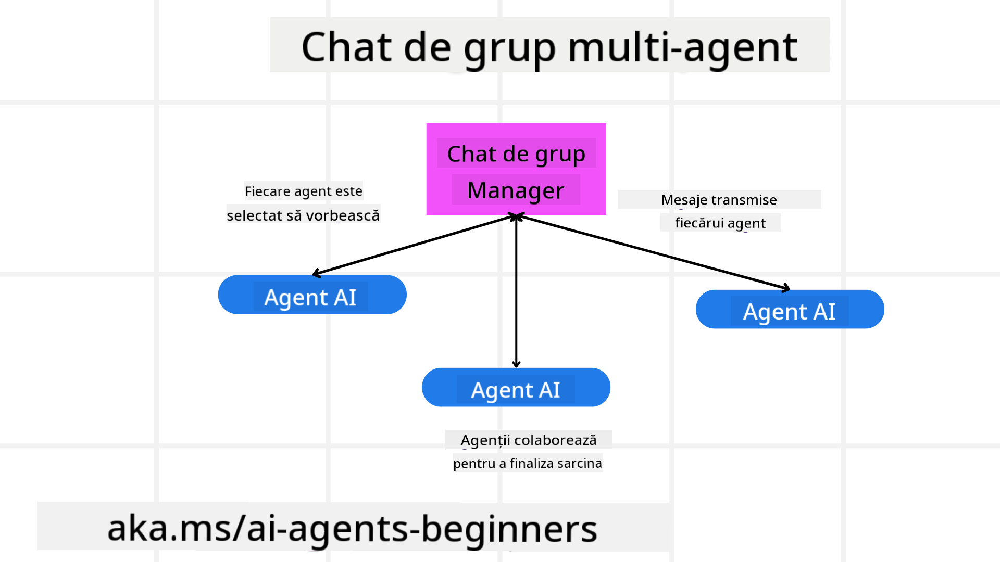
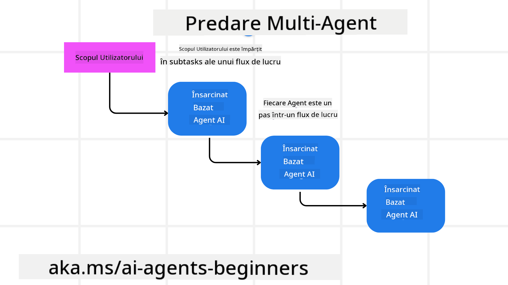
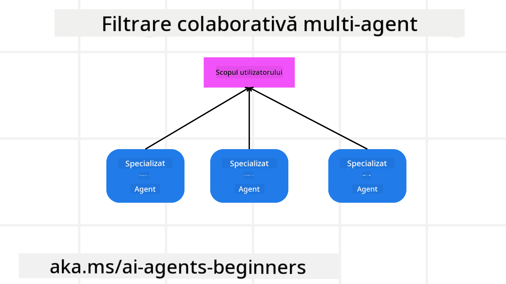

<!--
CO_OP_TRANSLATOR_METADATA:
{
  "original_hash": "c692a8975d7d5b99575a553de1c5e8a7",
  "translation_date": "2025-07-12T11:26:21+00:00",
  "source_file": "08-multi-agent/README.md",
  "language_code": "ro"
}
-->

> _(Click pe imaginea de mai sus pentru a viziona videoclipul acestei lecții)_

# Modele de design multi-agent

De îndată ce începi să lucrezi la un proiect care implică mai mulți agenți, va trebui să iei în considerare modelul de design multi-agent. Totuși, s-ar putea să nu fie imediat clar când să treci la multi-agenti și care sunt avantajele.

## Introducere

În această lecție, ne propunem să răspundem la următoarele întrebări:

- Care sunt scenariile în care se aplică multi-agenti?
- Care sunt avantajele utilizării mai multor agenți în locul unui singur agent care face mai multe sarcini?
- Care sunt elementele de bază pentru implementarea modelului de design multi-agent?
- Cum putem avea vizibilitate asupra modului în care mai mulți agenți interacționează între ei?

## Obiective de învățare

După această lecție, ar trebui să poți:

- Identifica scenariile în care se aplică multi-agenti
- Recunoaște avantajele utilizării mai multor agenți față de un agent singular
- Înțelege elementele de bază pentru implementarea modelului de design multi-agent

Care este imaginea de ansamblu?

*Multi-agenti este un model de design care permite mai multor agenți să lucreze împreună pentru a atinge un scop comun*.

Acest model este folosit pe scară largă în diverse domenii, inclusiv robotică, sisteme autonome și calcul distribuit.

## Scenarii în care se aplică multi-agenti

Deci, în ce scenarii este util să folosești multi-agenti? Răspunsul este că există multe situații în care utilizarea mai multor agenți este benefică, în special în următoarele cazuri:

- **Sarcini mari**: Sarcinile mari pot fi împărțite în sarcini mai mici și atribuite diferiților agenți, permițând procesarea paralelă și finalizarea mai rapidă. Un exemplu este procesarea unui volum mare de date.
- **Sarcini complexe**: Sarcinile complexe, la fel ca cele mari, pot fi împărțite în sub-sarcini mai mici și atribuite agenților specializați pe anumite aspecte ale sarcinii. Un exemplu bun este cazul vehiculelor autonome, unde diferiți agenți gestionează navigația, detectarea obstacolelor și comunicarea cu alte vehicule.
- **Expertiză diversă**: Agenții pot avea expertize diferite, ceea ce le permite să gestioneze mai eficient diferite aspecte ale unei sarcini decât un singur agent. Un exemplu bun este în domeniul sănătății, unde agenții pot gestiona diagnosticul, planurile de tratament și monitorizarea pacienților.

## Avantajele utilizării multi-agenti față de un agent singular

Un sistem cu un singur agent poate funcționa bine pentru sarcini simple, dar pentru sarcini mai complexe, utilizarea mai multor agenți oferă mai multe avantaje:

- **Specializare**: Fiecare agent poate fi specializat pentru o sarcină anume. Lipsa specializării într-un singur agent înseamnă că acesta poate face de toate, dar se poate confunda când se confruntă cu o sarcină complexă. De exemplu, ar putea ajunge să facă o sarcină pentru care nu este cel mai potrivit.
- **Scalabilitate**: Este mai ușor să scalezi sistemele adăugând mai mulți agenți decât să suprasoliciți un singur agent.
- **Toleranță la erori**: Dacă un agent eșuează, ceilalți pot continua să funcționeze, asigurând fiabilitatea sistemului.

Să luăm un exemplu: să rezervăm o călătorie pentru un utilizator. Un sistem cu un singur agent ar trebui să gestioneze toate aspectele procesului de rezervare, de la găsirea zborurilor până la rezervarea hotelurilor și a mașinilor de închiriat. Pentru a realiza asta cu un singur agent, acesta ar trebui să aibă instrumente pentru toate aceste sarcini. Acest lucru ar putea duce la un sistem complex și monolitic, greu de întreținut și scalat. Un sistem multi-agent, pe de altă parte, ar putea avea agenți diferiți specializați în găsirea zborurilor, rezervarea hotelurilor și a mașinilor de închiriat. Astfel, sistemul devine mai modular, mai ușor de întreținut și scalabil.

Compară asta cu o agenție de turism condusă ca un magazin de familie versus o agenție de turism condusă ca o franciză. Magazinul de familie ar avea un singur agent care gestionează toate aspectele rezervării, în timp ce franciza ar avea agenți diferiți care se ocupă de diferite aspecte ale procesului.

## Elementele de bază pentru implementarea modelului de design multi-agent

Înainte să poți implementa modelul de design multi-agent, trebuie să înțelegi elementele care compun acest model.

Să facem acest lucru mai concret, uitându-ne din nou la exemplul rezervării unei călătorii pentru un utilizator. În acest caz, elementele de bază ar include:

- **Comunicarea între agenți**: Agenții pentru găsirea zborurilor, rezervarea hotelurilor și a mașinilor trebuie să comunice și să împărtășească informații despre preferințele și constrângerile utilizatorului. Trebuie să decizi protocoalele și metodele pentru această comunicare. Concret, agentul pentru găsirea zborurilor trebuie să comunice cu agentul pentru rezervarea hotelurilor pentru a se asigura că hotelul este rezervat pentru aceleași date ca zborul. Asta înseamnă că agenții trebuie să împărtășească informații despre datele de călătorie ale utilizatorului, deci trebuie să decizi *care agenți împărtășesc informații și cum o fac*.
- **Mecanisme de coordonare**: Agenții trebuie să-și coordoneze acțiunile pentru a se asigura că preferințele și constrângerile utilizatorului sunt respectate. O preferință a utilizatorului ar putea fi un hotel aproape de aeroport, în timp ce o constrângere ar putea fi că mașinile de închiriat sunt disponibile doar la aeroport. Asta înseamnă că agentul pentru rezervarea hotelurilor trebuie să se coordoneze cu agentul pentru rezervarea mașinilor pentru a respecta preferințele și constrângerile utilizatorului. Trebuie să decizi *cum se coordonează agenții*.
- **Arhitectura agentului**: Agenții trebuie să aibă o structură internă care să le permită să ia decizii și să învețe din interacțiunile cu utilizatorul. Asta înseamnă că agentul pentru găsirea zborurilor trebuie să aibă o structură internă care să-i permită să decidă ce zboruri să recomande utilizatorului. Trebuie să decizi *cum iau decizii agenții și cum învață din interacțiunile cu utilizatorul*. Un exemplu ar fi ca agentul pentru găsirea zborurilor să folosească un model de învățare automată pentru a recomanda zboruri bazate pe preferințele anterioare ale utilizatorului.
- **Vizibilitate asupra interacțiunilor multi-agent**: Trebuie să ai vizibilitate asupra modului în care mai mulți agenți interacționează între ei. Asta înseamnă că ai nevoie de instrumente și tehnici pentru urmărirea activităților și interacțiunilor agenților. Acestea pot fi sub formă de instrumente de logare și monitorizare, instrumente de vizualizare și metrici de performanță.
- **Modele multi-agent**: Există diferite modele pentru implementarea sistemelor multi-agent, cum ar fi arhitecturi centralizate, descentralizate și hibride. Trebuie să alegi modelul care se potrivește cel mai bine cazului tău de utilizare.
- **Omul în buclă**: În majoritatea cazurilor, vei avea un om în buclă și trebuie să instrui agenții când să ceară intervenția umană. Acest lucru poate fi sub forma unui utilizator care solicită un hotel sau zbor specific pe care agenții nu l-au recomandat sau cere confirmare înainte de a face o rezervare.

## Vizibilitate asupra interacțiunilor multi-agent

Este important să ai vizibilitate asupra modului în care mai mulți agenți interacționează între ei. Această vizibilitate este esențială pentru depanare, optimizare și asigurarea eficienței generale a sistemului. Pentru a realiza acest lucru, ai nevoie de instrumente și tehnici pentru urmărirea activităților și interacțiunilor agenților. Acestea pot fi sub formă de instrumente de logare și monitorizare, instrumente de vizualizare și metrici de performanță.

De exemplu, în cazul rezervării unei călătorii pentru un utilizator, ai putea avea un panou de control care arată starea fiecărui agent, preferințele și constrângerile utilizatorului și interacțiunile dintre agenți. Acest panou ar putea afișa datele de călătorie ale utilizatorului, zborurile recomandate de agentul de zbor, hotelurile recomandate de agentul de hotel și mașinile recomandate de agentul de închiriere. Astfel, ai o imagine clară despre cum interacționează agenții și dacă preferințele și constrângerile utilizatorului sunt respectate.

Să analizăm fiecare aspect în detaliu.

- **Instrumente de logare și monitorizare**: Vrei să ai logare pentru fiecare acțiune făcută de un agent. O intrare în jurnal poate stoca informații despre agentul care a făcut acțiunea, acțiunea efectuată, momentul când a fost făcută și rezultatul acesteia. Aceste informații pot fi folosite pentru depanare, optimizare și altele.

- **Instrumente de vizualizare**: Instrumentele de vizualizare te pot ajuta să vezi interacțiunile dintre agenți într-un mod mai intuitiv. De exemplu, ai putea avea un grafic care arată fluxul de informații între agenți. Acest lucru te poate ajuta să identifici blocaje, ineficiențe și alte probleme în sistem.

- **Metrici de performanță**: Metricile de performanță te pot ajuta să urmărești eficiența sistemului multi-agent. De exemplu, poți urmări timpul necesar pentru finalizarea unei sarcini, numărul de sarcini finalizate pe unitate de timp și acuratețea recomandărilor făcute de agenți. Aceste informații te pot ajuta să identifici zonele care necesită îmbunătățiri și să optimizezi sistemul.

## Modele multi-agent

Să explorăm câteva modele concrete pe care le putem folosi pentru a crea aplicații multi-agent. Iată câteva modele interesante de luat în considerare:

### Chat de grup

Acest model este util când vrei să creezi o aplicație de chat de grup în care mai mulți agenți pot comunica între ei. Cazurile tipice de utilizare includ colaborarea în echipă, suportul clienți și rețelele sociale.

În acest model, fiecare agent reprezintă un utilizator în chat-ul de grup, iar mesajele sunt schimbate între agenți folosind un protocol de mesagerie. Agenții pot trimite mesaje în chat-ul de grup, pot primi mesaje și pot răspunde la mesajele altor agenți.

Acest model poate fi implementat folosind o arhitectură centralizată, unde toate mesajele sunt rutate printr-un server central, sau o arhitectură descentralizată, unde mesajele sunt schimbate direct.

### Transfer de sarcini

Acest model este util când vrei să creezi o aplicație în care mai mulți agenți pot transfera sarcini între ei.

Cazurile tipice de utilizare includ suportul clienți, managementul sarcinilor și automatizarea fluxurilor de lucru.

În acest model, fiecare agent reprezintă o sarcină sau un pas într-un flux de lucru, iar agenții pot transfera sarcini altor agenți pe baza unor reguli prestabilite.

### Filtrare colaborativă

Acest model este util când vrei să creezi o aplicație în care mai mulți agenți pot colabora pentru a face recomandări utilizatorilor.

Motivul pentru care ai vrea ca mai mulți agenți să colaboreze este că fiecare agent poate avea expertiză diferită și poate contribui în moduri diferite la procesul de recomandare.

Să luăm un exemplu în care un utilizator dorește o recomandare pentru cea mai bună acțiune de cumpărat pe piața bursieră.

- **Expert în industrie**: Un agent ar putea fi expert într-un anumit domeniu industrial.
- **Analiză tehnică**: Un alt agent ar putea fi expert în analiza tehnică.
- **Analiză fundamentală**: Un alt agent ar putea fi expert în analiza fundamentală. Colaborând, acești agenți pot oferi o recomandare mai completă utilizatorului.

## Scenariu: Procesul de rambursare

Să luăm în considerare un scenariu în care un client încearcă să obțină o rambursare pentru un produs. Pot fi implicați destul de mulți agenți în acest proces, dar să-i împărțim între agenți specifici acestui proces și agenți generali care pot fi folosiți în alte procese.

**Agenți specifici procesului de rambursare**:

Următorii agenți ar putea fi implicați în procesul de rambursare:

- **Agent client**: Acest agent reprezintă clientul și este responsabil pentru inițierea procesului de rambursare.
- **Agent vânzător**: Acest agent reprezintă vânzătorul și este responsabil pentru procesarea rambursării.
- **Agent de plată**: Acest agent reprezintă procesul de plată și este responsabil pentru returnarea banilor clientului.
- **Agent de rezolvare**: Acest agent reprezintă procesul de rezolvare și este responsabil pentru soluționarea oricăror probleme apărute în timpul procesului de rambursare.
- **Agent de conformitate**: Acest agent reprezintă procesul de conformitate și este responsabil pentru asigurarea că procesul de rambursare respectă reglementările și politicile.

**Agenți generali**:

Acești agenți pot fi folosiți în alte părți ale afacerii tale.

- **Agent de livrare**: Acest agent reprezintă procesul de livrare și este responsabil pentru returnarea produsului către vânzător. Poate fi folosit atât în procesul de rambursare, cât și pentru livrări generale, de exemplu în cazul unei achiziții.
- **Agent de feedback**: Acest agent reprezintă procesul de colectare a feedback-ului și este responsabil pentru colectarea opiniilor clienților. Feedback-ul poate fi colectat oricând, nu doar în timpul procesului de rambursare.
- **Agent de escaladare**: Acest agent reprezintă procesul de escaladare și este responsabil pentru escaladarea problemelor către un nivel superior de suport. Poate fi folosit în orice proces în care este nevoie să escaladezi o problemă.
- **Agent de notificare**: Acest agent reprezintă procesul de notificare și este responsabil pentru trimiterea notificărilor către client în diferite etape ale procesului de rambursare.
- **Agent de analiză**: Acest agent reprezintă procesul de analiză și este responsabil pentru analiza datelor legate de procesul de rambursare.
- **Agent de audit**: Acest agent reprezintă procesul de audit și este responsabil pentru verificarea corectitudinii procesului de rambursare.
- **Agent de raportare**: Acest agent reprezintă procesul de raportare și este responsabil pentru generarea rapoartelor privind procesul de rambursare.
- **Agent de cunoștințe**: Acest agent reprezintă procesul de gestionare a cunoștințelor și este responsabil pentru menținerea unei baze de date cu informații legate de procesul de rambursare. Acest agent poate avea cunoștințe atât despre rambursări, cât și despre alte părți ale afacerii tale.
- **Agent de securitate**: Acest agent reprezintă procesul de securitate și este responsabil pentru asigurarea securității procesului de rambursare.
- **Agent de calitate**: Acest agent reprezintă procesul de asigurare a calității și este responsabil pentru menținerea calității procesului de rambursare.

Există destul de mulți agenți enumerați mai sus, atât pentru procesul specific de rambursare, cât și pentru agenții generali care pot fi folosiți în alte părți ale afacerii tale. Sperăm că acest lucru îți oferă o idee despre cum poți decide ce agenți să folosești în sistemul tău multi-agent.

## Tema
## Lecția Anterioară

[Planificarea Designului](../07-planning-design/README.md)

## Lecția Următoare

[Metacogniția în Agenții AI](../09-metacognition/README.md)

**Declinare de responsabilitate**:  
Acest document a fost tradus folosind serviciul de traducere AI [Co-op Translator](https://github.com/Azure/co-op-translator). Deși ne străduim pentru acuratețe, vă rugăm să rețineți că traducerile automate pot conține erori sau inexactități. Documentul original în limba sa nativă trebuie considerat sursa autorizată. Pentru informații critice, se recomandă traducerea profesională realizată de un specialist uman. Nu ne asumăm răspunderea pentru eventualele neînțelegeri sau interpretări greșite rezultate din utilizarea acestei traduceri.