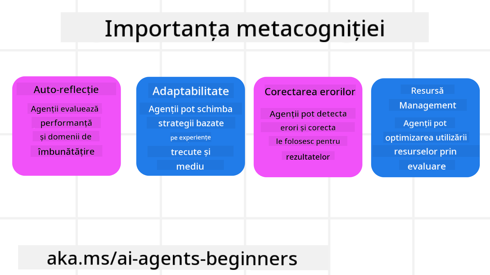
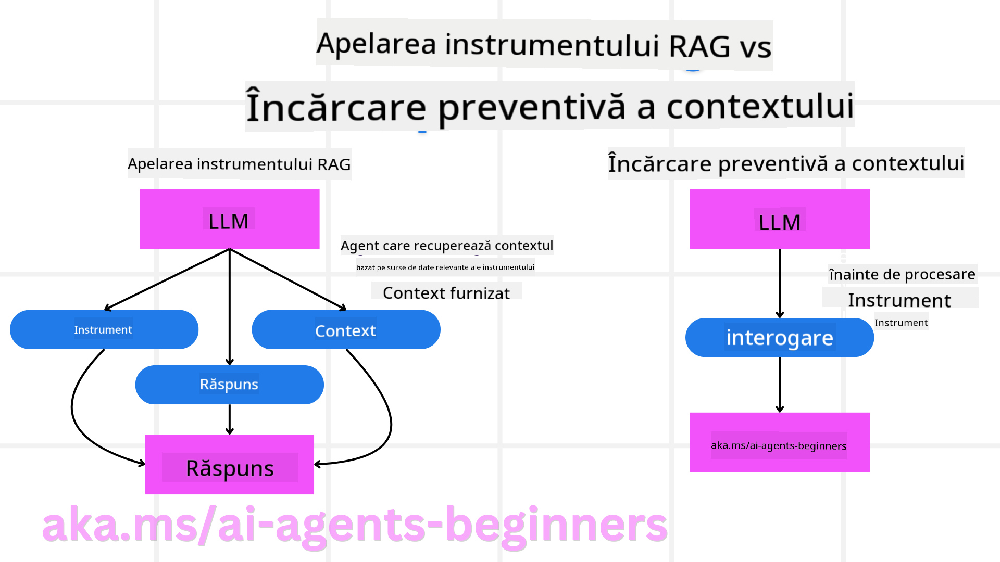

<!--
CO_OP_TRANSLATOR_METADATA:
{
  "original_hash": "8cbf460468c802c7994aa62e0e0779c9",
  "translation_date": "2025-07-12T13:16:53+00:00",
  "source_file": "09-metacognition/README.md",
  "language_code": "ro"
}
-->
[](https://youtu.be/His9R6gw6Ec?si=3_RMb8VprNvdLRhX)

> _(Click pe imaginea de mai sus pentru a viziona videoclipul acestei lecții)_
# Metacogniția în Agenții AI

## Introducere

Bine ai venit la lecția despre metacogniția în agenții AI! Acest capitol este conceput pentru începători curioși să afle cum pot agenții AI să reflecteze asupra propriilor procese de gândire. La finalul acestei lecții, vei înțelege conceptele cheie și vei avea exemple practice pentru a aplica metacogniția în proiectarea agenților AI.

## Obiective de Învățare

După parcurgerea acestei lecții, vei putea:

1. Să înțelegi implicațiile buclelor de raționament în definițiile agenților.
2. Să folosești tehnici de planificare și evaluare pentru a ajuta agenții să se autocorecteze.
3. Să creezi proprii agenți capabili să manipuleze cod pentru a îndeplini sarcini.

## Introducere în Metacogniție

Metacogniția se referă la procesele cognitive de ordin superior care implică gândirea despre propria gândire. Pentru agenții AI, asta înseamnă capacitatea de a evalua și ajusta acțiunile pe baza conștientizării de sine și a experiențelor anterioare. Metacogniția, sau „gândirea despre gândire”, este un concept important în dezvoltarea sistemelor AI agentice. Aceasta implică faptul că sistemele AI sunt conștiente de propriile procese interne și pot monitoriza, regla și adapta comportamentul în consecință. La fel cum facem noi când „citim” atmosfera sau analizăm o problemă. Această conștientizare de sine poate ajuta sistemele AI să ia decizii mai bune, să identifice erori și să-și îmbunătățească performanța în timp – revenind astfel la testul Turing și la dezbaterea dacă AI va prelua controlul.

În contextul sistemelor AI agentice, metacogniția poate ajuta la rezolvarea mai multor provocări, cum ar fi:
- Transparența: Asigurarea că sistemele AI pot explica raționamentul și deciziile lor.
- Raționamentul: Îmbunătățirea capacității sistemelor AI de a sintetiza informații și de a lua decizii corecte.
- Adaptarea: Permițând sistemelor AI să se ajusteze la medii noi și condiții în schimbare.
- Percepția: Creșterea acurateței sistemelor AI în recunoașterea și interpretarea datelor din mediul înconjurător.

### Ce este Metacogniția?

Metacogniția, sau „gândirea despre gândire”, este un proces cognitiv de ordin superior care implică conștientizarea și autoreglarea propriilor procese cognitive. În domeniul AI, metacogniția oferă agenților puterea de a evalua și adapta strategiile și acțiunile lor, conducând la o mai bună rezolvare a problemelor și luare a deciziilor. Înțelegând metacogniția, poți proiecta agenți AI care nu sunt doar mai inteligenți, ci și mai adaptabili și eficienți. În metacogniția autentică, AI-ul ar raționa explicit despre propriul său raționament.

Exemplu: „Am prioritizat zborurile mai ieftine pentru că... s-ar putea să ratez zboruri directe, așa că o să verific din nou.”  
Ținând evidența modului sau motivului pentru care a ales o anumită rută.  
- Observând că a făcut greșeli pentru că s-a bazat prea mult pe preferințele utilizatorului din ultima dată, așa că își modifică strategia de luare a deciziilor, nu doar recomandarea finală.  
- Diagnosticând tipare precum: „Ori de câte ori văd că utilizatorul menționează ‘prea aglomerat’, nu ar trebui doar să elimin anumite atracții, ci să reflectez că metoda mea de alegere a ‘atracțiilor de top’ este defectuoasă dacă întotdeauna le clasific după popularitate.”

### Importanța Metacogniției în Agenții AI

Metacogniția joacă un rol crucial în proiectarea agenților AI din mai multe motive:



- Auto-reflecție: Agenții pot evalua propria performanță și identifica zone de îmbunătățire.
- Adaptabilitate: Agenții pot modifica strategiile bazându-se pe experiențe anterioare și medii în schimbare.
- Corectarea erorilor: Agenții pot detecta și corecta erori în mod autonom, conducând la rezultate mai precise.
- Gestionarea resurselor: Agenții pot optimiza utilizarea resurselor, cum ar fi timpul și puterea de calcul, prin planificarea și evaluarea acțiunilor.

## Componentele unui Agent AI

Înainte de a intra în procesele metacognitive, este esențial să înțelegem componentele de bază ale unui agent AI. Un agent AI este format, de obicei, din:

- Persona: Personalitatea și caracteristicile agentului, care definesc modul în care interacționează cu utilizatorii.
- Unelte: Capacitățile și funcțiile pe care agentul le poate executa.
- Abilități: Cunoștințele și expertiza pe care agentul le posedă.

Aceste componente lucrează împreună pentru a crea o „unitate de expertiză” capabilă să îndeplinească sarcini specifice.

**Exemplu**:  
Gândește-te la un agent de turism, un serviciu care nu doar planifică vacanța ta, ci își ajustează traseul pe baza datelor în timp real și a experiențelor anterioare ale clienților.

### Exemplu: Metacogniția într-un Serviciu de Agent de Turism

Imaginează-ți că proiectezi un serviciu de agent de turism alimentat de AI. Acest agent, „Travel Agent”, ajută utilizatorii să-și planifice vacanțele. Pentru a integra metacogniția, Travel Agent trebuie să evalueze și să-și ajusteze acțiunile pe baza conștientizării de sine și a experiențelor anterioare. Iată cum ar putea juca un rol metacogniția:

#### Sarcina Curentă

Sarcina curentă este să ajuți un utilizator să planifice o călătorie la Paris.

#### Pașii pentru Finalizarea Sarcinii

1. **Colectarea Preferințelor Utilizatorului**: Întreabă utilizatorul despre datele de călătorie, buget, interese (ex: muzee, gastronomie, cumpărături) și orice cerințe speciale.
2. **Recuperarea Informațiilor**: Caută opțiuni de zbor, cazare, atracții și restaurante care se potrivesc preferințelor utilizatorului.
3. **Generarea Recomandărilor**: Oferă un itinerar personalizat cu detalii despre zboruri, rezervări la hotel și activități sugerate.
4. **Ajustarea pe Baza Feedback-ului**: Cere utilizatorului păreri despre recomandări și fă ajustările necesare.

#### Resurse Necesare

- Acces la baze de date pentru rezervări de zboruri și hoteluri.
- Informații despre atracțiile și restaurantele pariziene.
- Date de feedback de la utilizatori din interacțiunile anterioare.

#### Experiență și Auto-reflecție

Travel Agent folosește metacogniția pentru a-și evalua performanța și a învăța din experiențele trecute. De exemplu:

1. **Analiza Feedback-ului Utilizatorului**: Travel Agent revizuiește feedback-ul pentru a determina care recomandări au fost bine primite și care nu. Ajustează sugestiile viitoare în consecință.
2. **Adaptabilitate**: Dacă un utilizator a menționat anterior că nu-i plac locurile aglomerate, Travel Agent va evita să recomande atracții turistice populare în orele de vârf.
3. **Corectarea Erorilor**: Dacă Travel Agent a făcut o greșeală într-o rezervare anterioară, cum ar fi recomandarea unui hotel complet ocupat, învață să verifice disponibilitatea mai riguros înainte de a face recomandări.

#### Exemplu Practic pentru Dezvoltatori

Iată un exemplu simplificat de cod pentru Travel Agent care încorporează metacogniția:

```python
class Travel_Agent:
    def __init__(self):
        self.user_preferences = {}
        self.experience_data = []

    def gather_preferences(self, preferences):
        self.user_preferences = preferences

    def retrieve_information(self):
        # Search for flights, hotels, and attractions based on preferences
        flights = search_flights(self.user_preferences)
        hotels = search_hotels(self.user_preferences)
        attractions = search_attractions(self.user_preferences)
        return flights, hotels, attractions

    def generate_recommendations(self):
        flights, hotels, attractions = self.retrieve_information()
        itinerary = create_itinerary(flights, hotels, attractions)
        return itinerary

    def adjust_based_on_feedback(self, feedback):
        self.experience_data.append(feedback)
        # Analyze feedback and adjust future recommendations
        self.user_preferences = adjust_preferences(self.user_preferences, feedback)

# Example usage
travel_agent = Travel_Agent()
preferences = {
    "destination": "Paris",
    "dates": "2025-04-01 to 2025-04-10",
    "budget": "moderate",
    "interests": ["museums", "cuisine"]
}
travel_agent.gather_preferences(preferences)
itinerary = travel_agent.generate_recommendations()
print("Suggested Itinerary:", itinerary)
feedback = {"liked": ["Louvre Museum"], "disliked": ["Eiffel Tower (too crowded)"]}
travel_agent.adjust_based_on_feedback(feedback)
```

#### De ce este Importantă Metacogniția

- **Auto-reflecție**: Agenții pot analiza performanța și identifica zone de îmbunătățire.
- **Adaptabilitate**: Agenții pot modifica strategiile pe baza feedback-ului și a condițiilor în schimbare.
- **Corectarea Erorilor**: Agenții pot detecta și corecta greșelile în mod autonom.
- **Gestionarea Resurselor**: Agenții pot optimiza utilizarea resurselor, cum ar fi timpul și puterea de calcul.

Prin integrarea metacogniției, Travel Agent poate oferi recomandări de călătorie mai personalizate și mai precise, îmbunătățind experiența generală a utilizatorului.

---

## 2. Planificarea în Agenți

Planificarea este o componentă esențială a comportamentului agenților AI. Aceasta implică conturarea pașilor necesari pentru atingerea unui scop, ținând cont de starea curentă, resurse și posibile obstacole.

### Elemente ale Planificării

- **Sarcina Curentă**: Definirea clară a sarcinii.
- **Pașii pentru Finalizarea Sarcinii**: Împărțirea sarcinii în pași gestionabili.
- **Resurse Necesare**: Identificarea resurselor necesare.
- **Experiență**: Folosirea experiențelor anterioare pentru a informa planificarea.

**Exemplu**:  
Iată pașii pe care Travel Agent trebuie să îi urmeze pentru a ajuta eficient un utilizator să-și planifice călătoria:

### Pași pentru Travel Agent

1. **Colectarea Preferințelor Utilizatorului**  
   - Întreabă utilizatorul despre datele de călătorie, buget, interese și cerințe speciale.  
   - Exemple: „Când plănuiești să călătorești?” „Care este bugetul tău?” „Ce activități îți plac în vacanță?”

2. **Recuperarea Informațiilor**  
   - Caută opțiuni relevante de călătorie bazate pe preferințele utilizatorului.  
   - **Zboruri**: Găsește zboruri disponibile în limita bugetului și a datelor preferate.  
   - **Cazare**: Caută hoteluri sau proprietăți de închiriat care corespund preferințelor privind locația, prețul și facilitățile.  
   - **Atracții și Restaurante**: Identifică atracții populare, activități și opțiuni culinare care se potrivesc intereselor utilizatorului.

3. **Generarea Recomandărilor**  
   - Compilează informațiile într-un itinerar personalizat.  
   - Oferă detalii precum opțiuni de zbor, rezervări la hotel și activități sugerate, adaptând recomandările la preferințele utilizatorului.

4. **Prezentarea Itinerarului Utilizatorului**  
   - Împărtășește itinerarul propus pentru revizuire.  
   - Exemplu: „Iată un itinerar sugerat pentru călătoria ta la Paris. Include detalii despre zbor, rezervări la hotel și o listă de activități și restaurante recomandate. Spune-mi ce părere ai!”

5. **Colectarea Feedback-ului**  
   - Cere utilizatorului păreri despre itinerarul propus.  
   - Exemple: „Îți plac opțiunile de zbor?” „Hotelul este potrivit pentru nevoile tale?” „Vrei să adaugi sau să elimini vreo activitate?”

6. **Ajustarea pe Baza Feedback-ului**  
   - Modifică itinerarul în funcție de feedback-ul utilizatorului.  
   - Fă schimbările necesare la recomandările de zbor, cazare și activități pentru a se potrivi mai bine preferințelor.

7. **Confirmarea Finală**  
   - Prezintă itinerarul actualizat pentru confirmare finală.  
   - Exemplu: „Am făcut ajustările pe baza feedback-ului tău. Iată itinerarul actualizat. Totul este în regulă?”

8. **Rezervarea și Confirmarea**  
   - După aprobarea utilizatorului, efectuează rezervările pentru zboruri, cazare și activități planificate.  
   - Trimite detaliile de confirmare utilizatorului.

9. **Oferirea Suportului Continu**  
   - Rămâi disponibil pentru a ajuta utilizatorul cu orice modificări sau cereri suplimentare înainte și în timpul călătoriei.  
   - Exemplu: „Dacă ai nevoie de ajutor suplimentar în timpul călătoriei, nu ezita să mă contactezi oricând!”

### Exemplu de Interacțiune

```python
class Travel_Agent:
    def __init__(self):
        self.user_preferences = {}
        self.experience_data = []

    def gather_preferences(self, preferences):
        self.user_preferences = preferences

    def retrieve_information(self):
        flights = search_flights(self.user_preferences)
        hotels = search_hotels(self.user_preferences)
        attractions = search_attractions(self.user_preferences)
        return flights, hotels, attractions

    def generate_recommendations(self):
        flights, hotels, attractions = self.retrieve_information()
        itinerary = create_itinerary(flights, hotels, attractions)
        return itinerary

    def adjust_based_on_feedback(self, feedback):
        self.experience_data.append(feedback)
        self.user_preferences = adjust_preferences(self.user_preferences, feedback)

# Example usage within a booing request
travel_agent = Travel_Agent()
preferences = {
    "destination": "Paris",
    "dates": "2025-04-01 to 2025-04-10",
    "budget": "moderate",
    "interests": ["museums", "cuisine"]
}
travel_agent.gather_preferences(preferences)
itinerary = travel_agent.generate_recommendations()
print("Suggested Itinerary:", itinerary)
feedback = {"liked": ["Louvre Museum"], "disliked": ["Eiffel Tower (too crowded)"]}
travel_agent.adjust_based_on_feedback(feedback)
```

## 3. Sistemul Corectiv RAG

În primul rând, să înțelegem diferența dintre RAG Tool și Pre-emptive Context Load



### Retrieval-Augmented Generation (RAG)

RAG combină un sistem de recuperare cu un model generativ. Când se face o interogare, sistemul de recuperare aduce documente sau date relevante dintr-o sursă externă, iar aceste informații sunt folosite pentru a completa inputul modelului generativ. Acest lucru ajută modelul să genereze răspunsuri mai precise și contextuale.

Într-un sistem RAG, agentul recuperează informații relevante dintr-o bază de cunoștințe și le folosește pentru a genera răspunsuri sau acțiuni adecvate.

### Abordarea Corectivă RAG

Abordarea Corectivă RAG se concentrează pe utilizarea tehnicilor RAG pentru a corecta erorile și a îmbunătăți acuratețea agenților AI. Aceasta implică:

1. **Tehnica de Promptare**: Folosirea unor prompturi specifice pentru a ghida agentul în recuperarea informațiilor relevante.
2. **Unealtă**: Implementarea algoritmilor și mecanismelor care permit agentului să evalueze relevanța informațiilor recuperate și să genereze răspunsuri corecte.
3. **Evaluare**: Evaluarea continuă a performanței agentului și ajustarea pentru a-i îmbunătăți acuratețea și eficiența.

#### Exemplu: Corectiv RAG într-un Agent de Căutare

Gândește-te la un agent de căutare care recuperează informații de pe web pentru a răspunde întrebărilor utilizatorilor. Abordarea Corectivă RAG ar putea implica:

1. **Tehnica de Promptare**: Formularea interogărilor de căutare pe baza inputului utilizatorului.
2. **Unealtă**: Folosirea procesării limbajului natural și a algoritmilor de învățare automată pentru a clasifica și filtra rezultatele căutării.
3. **Evaluare**: Analiza feedback-ului utilizatorului pentru a identifica și corecta inexactitățile din informațiile recuperate.

### Corectiv RAG în Travel Agent

Corectiv RAG (Retrieval-Augmented Generation) îmbunătățește capacitatea AI-ului de a recupera și genera informații, corectând orice inexactități. Să vedem cum Travel Agent poate folosi abordarea Corectiv RAG pentru a oferi recomandări de călătorie mai precise și relevante.

Aceasta implică:

- **Tehnica de Promptare:** Folosirea unor prompturi specifice pentru a ghida agentul în recuperarea informațiilor relevante.
- **Unealtă:** Implementarea algoritmilor și mecanismelor care permit agentului să evalueze relevanța informațiilor recuperate și să genereze răspunsuri corecte.
- **Evaluare:** Evaluarea continuă a performanței agentului și ajustarea pentru a-i îmbunătăți acuratețea și eficiența.

#### Pași pentru Implementarea Corectiv RAG în Travel Agent

1. **Interacțiunea Inițială cu Utilizatorul**  
   - Travel Agent colectează preferințele inițiale ale utilizatorului, cum ar fi destinația, datele de călătorie, bugetul și interesele.  
   - Exemplu:

     ```python
     preferences = {
         "destination": "Paris",
         "dates": "2025-04-01 to 2025-04-10",
         "budget": "moderate",
         "interests": ["museums", "cuisine"]
     }
     ```

2. **Recuperarea Informațiilor**  
   - Travel Agent recuperează informații despre zboruri, cazare, atracții și restaurante pe baza preferințelor utilizatorului.  
   - Exemplu:

     ```python
     flights = search_flights(preferences)
     hotels = search_hotels(preferences)
     attractions = search_attractions(preferences)
     ```

3. **Generarea Recomandărilor Inițiale**  
   - Travel Agent folosește informațiile recuperate pentru a genera un itinerar personalizat.  
   - Exemplu:

     @@
### Încărcarea Contextului în Avans

Încărcarea contextului în avans presupune încărcarea informațiilor relevante sau a contextului de fundal în model înainte de a procesa o interogare. Astfel, modelul are acces la aceste informații încă de la început, ceea ce îl ajută să genereze răspunsuri mai bine informate, fără a fi nevoie să recupereze date suplimentare în timpul procesului.

Iată un exemplu simplificat despre cum ar putea arăta o încărcare a contextului în avans pentru o aplicație de agent de turism în Python:

```python
class TravelAgent:
    def __init__(self):
        # Pre-load popular destinations and their information
        self.context = {
            "Paris": {"country": "France", "currency": "Euro", "language": "French", "attractions": ["Eiffel Tower", "Louvre Museum"]},
            "Tokyo": {"country": "Japan", "currency": "Yen", "language": "Japanese", "attractions": ["Tokyo Tower", "Shibuya Crossing"]},
            "New York": {"country": "USA", "currency": "Dollar", "language": "English", "attractions": ["Statue of Liberty", "Times Square"]},
            "Sydney": {"country": "Australia", "currency": "Dollar", "language": "English", "attractions": ["Sydney Opera House", "Bondi Beach"]}
        }

    def get_destination_info(self, destination):
        # Fetch destination information from pre-loaded context
        info = self.context.get(destination)
        if info:
            return f"{destination}:\nCountry: {info['country']}\nCurrency: {info['currency']}\nLanguage: {info['language']}\nAttractions: {', '.join(info['attractions'])}"
        else:
            return f"Sorry, we don't have information on {destination}."

# Example usage
travel_agent = TravelAgent()
print(travel_agent.get_destination_info("Paris"))
print(travel_agent.get_destination_info("Tokyo"))
```

#### Explicație

1. **Inițializare (`__init__` method)**: Clasa `TravelAgent` încarcă în prealabil un dicționar care conține informații despre destinații populare precum Paris, Tokyo, New York și Sydney. Acest dicționar include detalii precum țara, moneda, limba și principalele atracții pentru fiecare destinație.

2. **Recuperarea Informațiilor (`get_destination_info` method)**: Când un utilizator întreabă despre o destinație specifică, metoda `get_destination_info` preia informațiile relevante din dicționarul încărcat anterior.

Prin încărcarea contextului în avans, aplicația agentului de turism poate răspunde rapid la întrebările utilizatorilor fără a fi nevoie să recupereze aceste informații dintr-o sursă externă în timp real. Acest lucru face aplicația mai eficientă și mai receptivă.

### Inițializarea Planului cu un Obiectiv înainte de Iterare

Inițializarea unui plan cu un obiectiv presupune pornirea de la un scop clar sau un rezultat țintă. Definind acest obiectiv de la început, modelul îl poate folosi ca principiu călăuzitor pe parcursul procesului iterativ. Acest lucru ajută la asigurarea faptului că fiecare iterație se apropie de realizarea rezultatului dorit, făcând procesul mai eficient și concentrat.

Iată un exemplu despre cum ai putea inițializa un plan de călătorie cu un obiectiv înainte de a itera, pentru un agent de turism în Python:

### Scenariu

Un agent de turism dorește să planifice o vacanță personalizată pentru un client. Obiectivul este să creeze un itinerar de călătorie care să maximizeze satisfacția clientului, ținând cont de preferințele și bugetul acestuia.

### Pași

1. Definirea preferințelor și bugetului clientului.
2. Inițializarea planului inițial pe baza acestor preferințe.
3. Iterarea pentru a rafina planul, optimizând satisfacția clientului.

#### Cod Python

```python
class TravelAgent:
    def __init__(self, destinations):
        self.destinations = destinations

    def bootstrap_plan(self, preferences, budget):
        plan = []
        total_cost = 0

        for destination in self.destinations:
            if total_cost + destination['cost'] <= budget and self.match_preferences(destination, preferences):
                plan.append(destination)
                total_cost += destination['cost']

        return plan

    def match_preferences(self, destination, preferences):
        for key, value in preferences.items():
            if destination.get(key) != value:
                return False
        return True

    def iterate_plan(self, plan, preferences, budget):
        for i in range(len(plan)):
            for destination in self.destinations:
                if destination not in plan and self.match_preferences(destination, preferences) and self.calculate_cost(plan, destination) <= budget:
                    plan[i] = destination
                    break
        return plan

    def calculate_cost(self, plan, new_destination):
        return sum(destination['cost'] for destination in plan) + new_destination['cost']

# Example usage
destinations = [
    {"name": "Paris", "cost": 1000, "activity": "sightseeing"},
    {"name": "Tokyo", "cost": 1200, "activity": "shopping"},
    {"name": "New York", "cost": 900, "activity": "sightseeing"},
    {"name": "Sydney", "cost": 1100, "activity": "beach"},
]

preferences = {"activity": "sightseeing"}
budget = 2000

travel_agent = TravelAgent(destinations)
initial_plan = travel_agent.bootstrap_plan(preferences, budget)
print("Initial Plan:", initial_plan)

refined_plan = travel_agent.iterate_plan(initial_plan, preferences, budget)
print("Refined Plan:", refined_plan)
```

#### Explicația Codului

1. **Inițializare (`__init__` method)**: Clasa `TravelAgent` este inițializată cu o listă de destinații potențiale, fiecare având atribute precum nume, cost și tip de activitate.

2. **Inițializarea Planului (`bootstrap_plan` method)**: Această metodă creează un plan inițial de călătorie pe baza preferințelor și bugetului clientului. Parcurge lista de destinații și le adaugă în plan dacă se potrivesc cu preferințele clientului și se încadrează în buget.

3. **Potrivirea Preferințelor (`match_preferences` method)**: Această metodă verifică dacă o destinație corespunde preferințelor clientului.

4. **Iterarea Planului (`iterate_plan` method)**: Această metodă rafinează planul inițial încercând să înlocuiască fiecare destinație din plan cu o opțiune mai potrivită, ținând cont de preferințele clientului și constrângerile bugetare.

5. **Calcularea Costului (`calculate_cost` method)**: Această metodă calculează costul total al planului curent, inclusiv o eventuală destinație nouă.

#### Exemplu de Utilizare

- **Plan Inițial**: Agentul de turism creează un plan inițial bazat pe preferințele clientului pentru obiective turistice și un buget de 2000$.
- **Plan Rafinată**: Agentul iterează planul, optimizându-l în funcție de preferințele și bugetul clientului.

Prin inițializarea planului cu un obiectiv clar (de exemplu, maximizarea satisfacției clientului) și iterarea pentru rafinare, agentul de turism poate crea un itinerar personalizat și optimizat pentru client. Această abordare asigură că planul de călătorie este aliniat cu preferințele și bugetul clientului încă de la început și se îmbunătățește cu fiecare iterație.

### Folosirea LLM pentru Re-rangare și Scorare

Modelele Mari de Limbaj (LLM) pot fi folosite pentru re-rangare și scorare prin evaluarea relevanței și calității documentelor recuperate sau a răspunsurilor generate. Iată cum funcționează:

**Recuperare:** Pasul inițial de recuperare aduce un set de documente sau răspunsuri candidate pe baza interogării.

**Re-rangare:** LLM evaluează aceste opțiuni și le re-ranghează în funcție de relevanță și calitate. Acest pas asigură că cele mai relevante și de calitate informații sunt prezentate primele.

**Scorare:** LLM atribuie scoruri fiecărui candidat, reflectând relevanța și calitatea acestuia. Acest lucru ajută la selectarea celui mai bun răspuns sau document pentru utilizator.

Prin utilizarea LLM pentru re-rangare și scorare, sistemul poate oferi informații mai precise și contextuale, îmbunătățind experiența generală a utilizatorului.

Iată un exemplu despre cum un agent de turism ar putea folosi un Model Mare de Limbaj (LLM) pentru re-rangare și scorare a destinațiilor de călătorie pe baza preferințelor utilizatorului în Python:

#### Scenariu - Călătorie pe baza Preferințelor

Un agent de turism dorește să recomande cele mai bune destinații de călătorie unui client pe baza preferințelor acestuia. LLM va ajuta la re-rangarea și scorarea destinațiilor pentru a asigura că cele mai relevante opțiuni sunt prezentate.

#### Pași:

1. Colectarea preferințelor utilizatorului.
2. Recuperarea unei liste de destinații potențiale.
3. Folosirea LLM pentru re-rangare și scorare a destinațiilor pe baza preferințelor utilizatorului.

Iată cum poți actualiza exemplul anterior pentru a folosi Azure OpenAI Services:

#### Cerințe

1. Trebuie să ai un abonament Azure.
2. Creează o resursă Azure OpenAI și obține cheia API.

#### Exemplu Cod Python

```python
import requests
import json

class TravelAgent:
    def __init__(self, destinations):
        self.destinations = destinations

    def get_recommendations(self, preferences, api_key, endpoint):
        # Generate a prompt for the Azure OpenAI
        prompt = self.generate_prompt(preferences)
        
        # Define headers and payload for the request
        headers = {
            'Content-Type': 'application/json',
            'Authorization': f'Bearer {api_key}'
        }
        payload = {
            "prompt": prompt,
            "max_tokens": 150,
            "temperature": 0.7
        }
        
        # Call the Azure OpenAI API to get the re-ranked and scored destinations
        response = requests.post(endpoint, headers=headers, json=payload)
        response_data = response.json()
        
        # Extract and return the recommendations
        recommendations = response_data['choices'][0]['text'].strip().split('\n')
        return recommendations

    def generate_prompt(self, preferences):
        prompt = "Here are the travel destinations ranked and scored based on the following user preferences:\n"
        for key, value in preferences.items():
            prompt += f"{key}: {value}\n"
        prompt += "\nDestinations:\n"
        for destination in self.destinations:
            prompt += f"- {destination['name']}: {destination['description']}\n"
        return prompt

# Example usage
destinations = [
    {"name": "Paris", "description": "City of lights, known for its art, fashion, and culture."},
    {"name": "Tokyo", "description": "Vibrant city, famous for its modernity and traditional temples."},
    {"name": "New York", "description": "The city that never sleeps, with iconic landmarks and diverse culture."},
    {"name": "Sydney", "description": "Beautiful harbour city, known for its opera house and stunning beaches."},
]

preferences = {"activity": "sightseeing", "culture": "diverse"}
api_key = 'your_azure_openai_api_key'
endpoint = 'https://your-endpoint.com/openai/deployments/your-deployment-name/completions?api-version=2022-12-01'

travel_agent = TravelAgent(destinations)
recommendations = travel_agent.get_recommendations(preferences, api_key, endpoint)
print("Recommended Destinations:")
for rec in recommendations:
    print(rec)
```

#### Explicația Codului - Preference Booker

1. **Inițializare**: Clasa `TravelAgent` este inițializată cu o listă de destinații potențiale, fiecare având atribute precum nume și descriere.

2. **Obținerea Recomandărilor (`get_recommendations` method)**: Această metodă generează un prompt pentru serviciul Azure OpenAI pe baza preferințelor utilizatorului și face o cerere HTTP POST către API-ul Azure OpenAI pentru a obține destinații re-rangate și scorate.

3. **Generarea Promptului (`generate_prompt` method)**: Această metodă construiește un prompt pentru Azure OpenAI, incluzând preferințele utilizatorului și lista de destinații. Promptul ghidează modelul să re-rangheze și să scoreze destinațiile pe baza preferințelor furnizate.

4. **Apel API**: Biblioteca `requests` este folosită pentru a face o cerere HTTP POST către endpoint-ul API Azure OpenAI. Răspunsul conține destinațiile re-rangate și scorate.

5. **Exemplu de Utilizare**: Agentul de turism colectează preferințele utilizatorului (de exemplu, interes pentru obiective turistice și cultură diversă) și folosește serviciul Azure OpenAI pentru a obține recomandări re-rangate și scorate pentru destinații de călătorie.

Asigură-te că înlocuiești `your_azure_openai_api_key` cu cheia ta reală Azure OpenAI și `https://your-endpoint.com/...` cu URL-ul real al endpoint-ului din implementarea ta Azure OpenAI.

Prin folosirea LLM pentru re-rangare și scorare, agentul de turism poate oferi recomandări de călătorie mai personalizate și relevante clienților, îmbunătățindu-le experiența generală.

### RAG: Tehnică de Promptare vs Unealtă

Retrieval-Augmented Generation (RAG) poate fi atât o tehnică de promptare, cât și o unealtă în dezvoltarea agenților AI. Înțelegerea diferenței dintre cele două te poate ajuta să folosești RAG mai eficient în proiectele tale.

#### RAG ca Tehnică de Promptare

**Ce este?**

- Ca tehnică de promptare, RAG implică formularea unor interogări sau prompturi specifice pentru a ghida recuperarea informațiilor relevante dintr-un corpus mare sau o bază de date. Aceste informații sunt apoi folosite pentru a genera răspunsuri sau acțiuni.

**Cum funcționează:**

1. **Formularea Prompturilor**: Creează prompturi sau interogări bine structurate pe baza sarcinii sau a inputului utilizatorului.
2. **Recuperarea Informațiilor**: Folosește prompturile pentru a căuta date relevante dintr-o bază de cunoștințe sau set de date preexistent.
3. **Generarea Răspunsului**: Combină informațiile recuperate cu modele generative AI pentru a produce un răspuns cuprinzător și coerent.

**Exemplu în Agentul de Turism**:

- Input Utilizator: „Vreau să vizitez muzee în Paris.”
- Prompt: „Găsește cele mai bune muzee din Paris.”
- Informații Recuperate: Detalii despre Muzeul Louvre, Musée d'Orsay etc.
- Răspuns Generat: „Iată câteva muzee de top în Paris: Muzeul Louvre, Musée d'Orsay și Centre Pompidou.”

#### RAG ca Unealtă

**Ce este?**

- Ca unealtă, RAG este un sistem integrat care automatizează procesul de recuperare și generare, facilitând dezvoltatorilor implementarea funcționalităților AI complexe fără a crea manual prompturi pentru fiecare interogare.

**Cum funcționează:**

1. **Integrare**: Încorporează RAG în arhitectura agentului AI, permițându-i să gestioneze automat sarcinile de recuperare și generare.
2. **Automatizare**: Unealta gestionează întregul proces, de la primirea inputului utilizatorului până la generarea răspunsului final, fără a necesita prompturi explicite pentru fiecare pas.
3. **Eficiență**: Îmbunătățește performanța agentului prin simplificarea procesului de recuperare și generare, oferind răspunsuri mai rapide și mai precise.

**Exemplu în Agentul de Turism**:

- Input Utilizator: „Vreau să vizitez muzee în Paris.”
- Unealta RAG: Recuperează automat informații despre muzee și generează un răspuns.
- Răspuns Generat: „Iată câteva muzee de top în Paris: Muzeul Louvre, Musée d'Orsay și Centre Pompidou.”

### Comparație

| Aspect                 | Tehnică de Promptare                                      | Unealtă                                               |
|------------------------|-----------------------------------------------------------|------------------------------------------------------|
| **Manual vs Automat**  | Formulare manuală a prompturilor pentru fiecare interogare.| Proces automatizat pentru recuperare și generare.    |
| **Control**            | Oferă mai mult control asupra procesului de recuperare.   | Simplifică și automatizează procesul de recuperare și generare. |
| **Flexibilitate**      | Permite prompturi personalizate în funcție de nevoi specifice.| Mai eficient pentru implementări la scară largă.     |
| **Complexitate**       | Necesită crearea și ajustarea prompturilor.                | Mai ușor de integrat în arhitectura unui agent AI.   |

### Exemple Practice

**Exemplu Tehnică de Promptare:**

```python
def search_museums_in_paris():
    prompt = "Find top museums in Paris"
    search_results = search_web(prompt)
    return search_results

museums = search_museums_in_paris()
print("Top Museums in Paris:", museums)
```

**Exemplu Unealtă:**

```python
class Travel_Agent:
    def __init__(self):
        self.rag_tool = RAGTool()

    def get_museums_in_paris(self):
        user_input = "I want to visit museums in Paris."
        response = self.rag_tool.retrieve_and_generate(user_input)
        return response

travel_agent = Travel_Agent()
museums = travel_agent.get_museums_in_paris()
print("Top Museums in Paris:", museums)
```

### Evaluarea Relevanței

Evaluarea relevanței este un aspect esențial al performanței unui agent AI. Aceasta asigură că informațiile recuperate și generate de agent sunt adecvate, corecte și utile pentru utilizator. Să explorăm cum se evaluează relevanța în agenții AI, inclusiv exemple practice și tehnici.

#### Concepte Cheie în Evaluarea Relevanței

1. **Conștientizarea Contextului**:
   - Agentul trebuie să înțeleagă contextul interogării utilizatorului pentru a recupera și genera informații relevante.
   - Exemplu: Dacă un utilizator întreabă „cele mai bune restaurante din Paris”, agentul ar trebui să ia în considerare preferințele utilizatorului, cum ar fi tipul de bucătărie și bugetul.

2. **Acuratețe**:
   - Informațiile oferite de agent trebuie să fie corecte din punct de vedere factual și actualizate.
   - Exemplu: Recomandarea restaurantelor deschise în prezent și cu recenzii bune, nu opțiuni învechite sau închise.

3. **Intenția Utilizatorului**:
   - Agentul trebuie să deducă intenția utilizatorului din spatele interogării pentru a oferi cele mai relevante informații.
   - Exemplu: Dacă un utilizator cere „hoteluri accesibile ca preț”, agentul ar trebui să prioritizeze opțiunile cu prețuri rezonabile.

4. **Buclă de Feedback**:
   - Colectarea și analiza continuă a feedback-ului utilizatorilor ajută agentul să își rafineze procesul de evaluare a relevanței.
   - Exemplu: Încorporarea evaluărilor și feedback-ului utilizatorilor despre recomandările anterioare pentru a îmbunătăți răspunsurile viitoare.

#### Tehnici Practice pentru Evaluarea Relevanței

1. **Scorarea Relevanței**:
   - Atribuie un scor de relevanță fiecărui element recuperat, în funcție de cât de bine se potrivește cu interogarea și preferințele utilizatorului.
   - Exemplu:

     ```python
     def relevance_score(item, query):
         score = 0
         if item['category'] in query['interests']:
             score += 1
         if item['price'] <= query['budget']:
             score += 1
         if item['location'] == query['destination']:
             score += 1
         return score
     ```

2. **Filtrare și Clasare**:
   - Filtrează elementele irelevante și clasifică pe cele rămase în funcție de scorurile de relevanță.
   - Exemplu:

     ```python
     def filter_and_rank(items, query):
         ranked_items = sorted(items, key=lambda item: relevance_score(item, query), reverse=True)
         return ranked_items[:10]  # Return top 10 relevant items
     ```

3. **Procesare a Limbajului Natural (NLP)**:
   - Folosește tehnici NLP pentru a înțelege interogarea utilizatorului și a recupera informații relevante.
   - Exemplu:

     ```python
     def process_query(query):
         # Use NLP to extract key information from the user's query
         processed_query = nlp(query)
         return processed_query
     ```

4. **Integrarea Feedback-ului Utilizatorului**:
   - Colectează feedback-ul utilizatorilor asupra recomandărilor oferite și îl folosește pentru a ajusta evaluările viitoare ale relevanței.
   - Exemplu:

     ```python
     def adjust_based_on_feedback(feedback, items):
         for item in items:
             if item['name'] in feedback['liked']:
                 item['relevance'] += 1
             if item['name'] in feedback['disliked']:
                 item['relevance'] -= 1
         return items
     ```

#### Exemplu: Evaluarea Relevanței în Agentul de Turism

Iată un exemplu practic despre cum Travel Agent poate evalua relevanța recomandărilor de călătorie:

```python
class Travel_Agent:
    def __init__(self):
        self.user_preferences = {}
        self.experience_data = []

    def gather_preferences(self, preferences):
        self.user_preferences = preferences

    def retrieve_information(self):
        flights = search_flights(self.user_preferences)
        hotels = search_hotels(self.user_preferences)
        attractions = search_attractions(self.user_preferences)
        return flights, hotels, attractions

    def generate_recommendations(self):
        flights, hotels, attractions = self.retrieve_information()
        ranked_hotels = self.filter_and_rank(hotels, self.user_preferences)
        itinerary = create_itinerary(flights, ranked_hotels, attractions)
        return itinerary

    def filter_and_rank(self, items, query):
        ranked_items = sorted(items, key=lambda item: self.relevance_score(item, query), reverse=True)
        return ranked_items[:10]  # Return top 10 relevant items

    def relevance_score(self, item, query):
        score = 0
        if item['category'] in query['interests']:
            score += 1
        if item['price'] <= query['budget']:
            score += 1
        if item['location'] == query['destination']:
            score += 1
        return score

    def adjust_based_on_feedback(self, feedback, items):
        for item in items:
            if item['name'] in feedback['liked']:
                item['relevance'] += 1
            if item['name'] in feedback['disliked']:
                item['relevance'] -= 1
        return items

# Example usage
travel_agent = Travel_Agent()
preferences = {
    "destination": "Paris",
    "dates": "2025-04-01 to 2025-04-10",
    "budget": "moderate",
    "interests": ["museums", "cuisine"]
}
travel_agent.gather_preferences(preferences)
itinerary = travel_agent.generate_recommendations()
print("Suggested Itinerary:", itinerary)
feedback = {"liked": ["Louvre Museum"], "disliked": ["Eiffel Tower (too crowded)"]}
updated_items = travel_agent.adjust_based_on_feedback(feedback, itinerary['hotels'])
print("Updated Itinerary with Feedback:", updated_items)
```

### Căutare cu Intenție

Căutarea cu intenție implică înțelegerea și interpretarea scopului sau obiectivului din spatele interogării unui utilizator pentru a recupera și genera cele mai relevante și utile informații. Această abordare depășește simpla potrivire a cuvintelor cheie și se concentrează pe înțelegerea nevoilor reale și a contextului utilizatorului.

#### Concepte Cheie în Căutarea cu Intenție

1. **Înțelegerea Intenției Utilizatorului**:
   - Intenția utilizatorului poate fi clasificată în trei tipuri principale: informațională, navigațională și tranzacțională.
     - **Intenție Informațională**: Utilizatorul caută informații despre un subiect (ex: „Care sunt cele mai bune muzee din Paris?”).
     - **Intenție Navigațională**: Utilizatorul dorește să acceseze un site sau o pagină specifică (ex: „Site oficial Muzeul Louvre”).
     - **Intenție Tranzacțională**: Utilizatorul vrea să efectueze o tranzacție, cum ar fi rezervarea unui zbor sau efectuarea unei achiziții (ex: „Rezervă un zbor către Paris”).

2. **Conștientizarea Contextului**:
   - Analiza contextului interogării utilizatorului ajută la identificarea corectă a intenției. Aceasta include luarea în considerare a interacțiunilor anterioare, preferințelor utilizatorului și detaliilor specifice ale interogării curente.

3. **Procesare a Limbajului Natural (NLP)**:
   - Tehnicile NLP sunt folosite pentru a înțelege și
#### Exemplu practic: Căutare cu intenție în Travel Agent

Să luăm Travel Agent ca exemplu pentru a vedea cum poate fi implementată căutarea cu intenție.

1. **Colectarea preferințelor utilizatorului**

   ```python
   class Travel_Agent:
       def __init__(self):
           self.user_preferences = {}

       def gather_preferences(self, preferences):
           self.user_preferences = preferences
   ```

2. **Înțelegerea intenției utilizatorului**

   ```python
   def identify_intent(query):
       if "book" in query or "purchase" in query:
           return "transactional"
       elif "website" in query or "official" in query:
           return "navigational"
       else:
           return "informational"
   ```

3. **Conștientizarea contextului**

   ```python
   def analyze_context(query, user_history):
       # Combine current query with user history to understand context
       context = {
           "current_query": query,
           "user_history": user_history
       }
       return context
   ```

4. **Căutare și personalizare a rezultatelor**

   ```python
   def search_with_intent(query, preferences, user_history):
       intent = identify_intent(query)
       context = analyze_context(query, user_history)
       if intent == "informational":
           search_results = search_information(query, preferences)
       elif intent == "navigational":
           search_results = search_navigation(query)
       elif intent == "transactional":
           search_results = search_transaction(query, preferences)
       personalized_results = personalize_results(search_results, user_history)
       return personalized_results

   def search_information(query, preferences):
       # Example search logic for informational intent
       results = search_web(f"best {preferences['interests']} in {preferences['destination']}")
       return results

   def search_navigation(query):
       # Example search logic for navigational intent
       results = search_web(query)
       return results

   def search_transaction(query, preferences):
       # Example search logic for transactional intent
       results = search_web(f"book {query} to {preferences['destination']}")
       return results

   def personalize_results(results, user_history):
       # Example personalization logic
       personalized = [result for result in results if result not in user_history]
       return personalized[:10]  # Return top 10 personalized results
   ```

5. **Exemplu de utilizare**

   ```python
   travel_agent = Travel_Agent()
   preferences = {
       "destination": "Paris",
       "interests": ["museums", "cuisine"]
   }
   travel_agent.gather_preferences(preferences)
   user_history = ["Louvre Museum website", "Book flight to Paris"]
   query = "best museums in Paris"
   results = search_with_intent(query, preferences, user_history)
   print("Search Results:", results)
   ```

---

## 4. Generarea codului ca instrument

Agenții generativi de cod folosesc modele AI pentru a scrie și executa cod, rezolvând probleme complexe și automatizând sarcini.

### Agenți generativi de cod

Agenții generativi de cod utilizează modele AI generative pentru a scrie și executa cod. Acești agenți pot rezolva probleme complexe, automatiza sarcini și oferi informații valoroase prin generarea și rularea codului în diverse limbaje de programare.

#### Aplicații practice

1. **Generare automată de cod**: Generarea de fragmente de cod pentru sarcini specifice, cum ar fi analiza datelor, web scraping sau machine learning.
2. **SQL ca RAG**: Folosirea interogărilor SQL pentru a extrage și manipula date din baze de date.
3. **Rezolvarea problemelor**: Crearea și executarea de cod pentru a rezolva probleme specifice, cum ar fi optimizarea algoritmilor sau analiza datelor.

#### Exemplu: Agent generativ de cod pentru analiza datelor

Imaginează-ți că proiectezi un agent generativ de cod. Iată cum ar putea funcționa:

1. **Sarcină**: Analiza unui set de date pentru identificarea tendințelor și tiparelor.
2. **Pași**:
   - Încarcă setul de date într-un instrument de analiză a datelor.
   - Generează interogări SQL pentru filtrarea și agregarea datelor.
   - Execută interogările și preia rezultatele.
   - Folosește rezultatele pentru a genera vizualizări și insight-uri.
3. **Resurse necesare**: Acces la setul de date, instrumente de analiză a datelor și capabilități SQL.
4. **Experiență**: Folosește rezultatele analizelor anterioare pentru a îmbunătăți acuratețea și relevanța analizelor viitoare.

### Exemplu: Agent generativ de cod pentru Travel Agent

În acest exemplu, vom proiecta un agent generativ de cod, Travel Agent, care să ajute utilizatorii în planificarea călătoriilor prin generarea și executarea de cod. Acest agent poate gestiona sarcini precum obținerea opțiunilor de călătorie, filtrarea rezultatelor și compilarea unui itinerar folosind AI generativ.

#### Prezentare generală a agentului generativ de cod

1. **Colectarea preferințelor utilizatorului**: Colectează input-ul utilizatorului, cum ar fi destinația, datele de călătorie, bugetul și interesele.
2. **Generarea codului pentru preluarea datelor**: Generează fragmente de cod pentru a prelua informații despre zboruri, hoteluri și atracții.
3. **Executarea codului generat**: Rulează codul generat pentru a obține informații în timp real.
4. **Generarea itinerarului**: Compilează datele preluate într-un plan de călătorie personalizat.
5. **Ajustarea pe baza feedback-ului**: Primește feedback de la utilizator și regenerează codul dacă este necesar pentru a rafina rezultatele.

#### Implementare pas cu pas

1. **Colectarea preferințelor utilizatorului**

   ```python
   class Travel_Agent:
       def __init__(self):
           self.user_preferences = {}

       def gather_preferences(self, preferences):
           self.user_preferences = preferences
   ```

2. **Generarea codului pentru preluarea datelor**

   ```python
   def generate_code_to_fetch_data(preferences):
       # Example: Generate code to search for flights based on user preferences
       code = f"""
       def search_flights():
           import requests
           response = requests.get('https://api.example.com/flights', params={preferences})
           return response.json()
       """
       return code

   def generate_code_to_fetch_hotels(preferences):
       # Example: Generate code to search for hotels
       code = f"""
       def search_hotels():
           import requests
           response = requests.get('https://api.example.com/hotels', params={preferences})
           return response.json()
       """
       return code
   ```

3. **Executarea codului generat**

   ```python
   def execute_code(code):
       # Execute the generated code using exec
       exec(code)
       result = locals()
       return result

   travel_agent = Travel_Agent()
   preferences = {
       "destination": "Paris",
       "dates": "2025-04-01 to 2025-04-10",
       "budget": "moderate",
       "interests": ["museums", "cuisine"]
   }
   travel_agent.gather_preferences(preferences)
   
   flight_code = generate_code_to_fetch_data(preferences)
   hotel_code = generate_code_to_fetch_hotels(preferences)
   
   flights = execute_code(flight_code)
   hotels = execute_code(hotel_code)

   print("Flight Options:", flights)
   print("Hotel Options:", hotels)
   ```

4. **Generarea itinerarului**

   ```python
   def generate_itinerary(flights, hotels, attractions):
       itinerary = {
           "flights": flights,
           "hotels": hotels,
           "attractions": attractions
       }
       return itinerary

   attractions = search_attractions(preferences)
   itinerary = generate_itinerary(flights, hotels, attractions)
   print("Suggested Itinerary:", itinerary)
   ```

5. **Ajustarea pe baza feedback-ului**

   ```python
   def adjust_based_on_feedback(feedback, preferences):
       # Adjust preferences based on user feedback
       if "liked" in feedback:
           preferences["favorites"] = feedback["liked"]
       if "disliked" in feedback:
           preferences["avoid"] = feedback["disliked"]
       return preferences

   feedback = {"liked": ["Louvre Museum"], "disliked": ["Eiffel Tower (too crowded)"]}
   updated_preferences = adjust_based_on_feedback(feedback, preferences)
   
   # Regenerate and execute code with updated preferences
   updated_flight_code = generate_code_to_fetch_data(updated_preferences)
   updated_hotel_code = generate_code_to_fetch_hotels(updated_preferences)
   
   updated_flights = execute_code(updated_flight_code)
   updated_hotels = execute_code(updated_hotel_code)
   
   updated_itinerary = generate_itinerary(updated_flights, updated_hotels, attractions)
   print("Updated Itinerary:", updated_itinerary)
   ```

### Folosirea conștientizării mediului și a raționamentului

Bazarea pe schema tabelului poate îmbunătăți procesul de generare a interogărilor prin valorificarea conștientizării mediului și a raționamentului.

Iată un exemplu despre cum se poate face acest lucru:

1. **Înțelegerea schemei**: Sistemul va înțelege schema tabelului și va folosi aceste informații pentru a fundamenta generarea interogărilor.
2. **Ajustarea pe baza feedback-ului**: Sistemul va ajusta preferințele utilizatorului în funcție de feedback și va raționa asupra câmpurilor din schemă care trebuie actualizate.
3. **Generarea și executarea interogărilor**: Sistemul va genera și executa interogări pentru a prelua date actualizate despre zboruri și hoteluri, pe baza noilor preferințe.

Iată un exemplu actualizat de cod Python care încorporează aceste concepte:

```python
def adjust_based_on_feedback(feedback, preferences, schema):
    # Adjust preferences based on user feedback
    if "liked" in feedback:
        preferences["favorites"] = feedback["liked"]
    if "disliked" in feedback:
        preferences["avoid"] = feedback["disliked"]
    # Reasoning based on schema to adjust other related preferences
    for field in schema:
        if field in preferences:
            preferences[field] = adjust_based_on_environment(feedback, field, schema)
    return preferences

def adjust_based_on_environment(feedback, field, schema):
    # Custom logic to adjust preferences based on schema and feedback
    if field in feedback["liked"]:
        return schema[field]["positive_adjustment"]
    elif field in feedback["disliked"]:
        return schema[field]["negative_adjustment"]
    return schema[field]["default"]

def generate_code_to_fetch_data(preferences):
    # Generate code to fetch flight data based on updated preferences
    return f"fetch_flights(preferences={preferences})"

def generate_code_to_fetch_hotels(preferences):
    # Generate code to fetch hotel data based on updated preferences
    return f"fetch_hotels(preferences={preferences})"

def execute_code(code):
    # Simulate execution of code and return mock data
    return {"data": f"Executed: {code}"}

def generate_itinerary(flights, hotels, attractions):
    # Generate itinerary based on flights, hotels, and attractions
    return {"flights": flights, "hotels": hotels, "attractions": attractions}

# Example schema
schema = {
    "favorites": {"positive_adjustment": "increase", "negative_adjustment": "decrease", "default": "neutral"},
    "avoid": {"positive_adjustment": "decrease", "negative_adjustment": "increase", "default": "neutral"}
}

# Example usage
preferences = {"favorites": "sightseeing", "avoid": "crowded places"}
feedback = {"liked": ["Louvre Museum"], "disliked": ["Eiffel Tower (too crowded)"]}
updated_preferences = adjust_based_on_feedback(feedback, preferences, schema)

# Regenerate and execute code with updated preferences
updated_flight_code = generate_code_to_fetch_data(updated_preferences)
updated_hotel_code = generate_code_to_fetch_hotels(updated_preferences)

updated_flights = execute_code(updated_flight_code)
updated_hotels = execute_code(updated_hotel_code)

updated_itinerary = generate_itinerary(updated_flights, updated_hotels, feedback["liked"])
print("Updated Itinerary:", updated_itinerary)
```

#### Explicație - Rezervare bazată pe feedback

1. **Conștientizarea schemei**: Dicționarul `schema` definește cum trebuie ajustate preferințele pe baza feedback-ului. Include câmpuri precum `favorites` și `avoid`, cu ajustările corespunzătoare.
2. **Ajustarea preferințelor (metoda `adjust_based_on_feedback`)**: Această metodă ajustează preferințele în funcție de feedback-ul utilizatorului și schema.
3. **Ajustări bazate pe mediu (metoda `adjust_based_on_environment`)**: Această metodă personalizează ajustările pe baza schemei și feedback-ului.
4. **Generarea și executarea interogărilor**: Sistemul generează cod pentru a prelua date actualizate despre zboruri și hoteluri, pe baza preferințelor ajustate, și simulează execuția acestor interogări.
5. **Generarea itinerarului**: Sistemul creează un itinerar actualizat pe baza noilor date despre zboruri, hoteluri și atracții.

Prin dotarea sistemului cu conștientizare a mediului și raționament bazat pe schemă, acesta poate genera interogări mai precise și relevante, conducând la recomandări de călătorie mai bune și o experiență mai personalizată pentru utilizator.

### Folosirea SQL ca tehnică Retrieval-Augmented Generation (RAG)

SQL (Structured Query Language) este un instrument puternic pentru interacțiunea cu bazele de date. Folosit ca parte a unei abordări Retrieval-Augmented Generation (RAG), SQL poate extrage date relevante din baze de date pentru a informa și genera răspunsuri sau acțiuni în agenții AI. Să explorăm cum poate fi folosit SQL ca tehnică RAG în contextul Travel Agent.

#### Concepte cheie

1. **Interacțiunea cu baza de date**:
   - SQL este folosit pentru a interoga baze de date, a prelua informații relevante și a manipula date.
   - Exemplu: Obținerea detaliilor despre zboruri, hoteluri și atracții dintr-o bază de date de călătorii.

2. **Integrarea cu RAG**:
   - Interogările SQL sunt generate pe baza input-ului și preferințelor utilizatorului.
   - Datele preluate sunt apoi folosite pentru a genera recomandări sau acțiuni personalizate.

3. **Generarea dinamică a interogărilor**:
   - Agentul AI generează interogări SQL dinamice în funcție de context și nevoile utilizatorului.
   - Exemplu: Personalizarea interogărilor SQL pentru a filtra rezultatele în funcție de buget, date și interese.

#### Aplicații

- **Generare automată de cod**: Generarea de fragmente de cod pentru sarcini specifice.
- **SQL ca RAG**: Folosirea interogărilor SQL pentru manipularea datelor.
- **Rezolvarea problemelor**: Crearea și executarea de cod pentru rezolvarea problemelor.

**Exemplu**: Agent de analiză a datelor:

1. **Sarcină**: Analiza unui set de date pentru a identifica tendințe.
2. **Pași**:
   - Încarcă setul de date.
   - Generează interogări SQL pentru filtrarea datelor.
   - Execută interogările și preia rezultatele.
   - Generează vizualizări și insight-uri.
3. **Resurse**: Acces la setul de date, capabilități SQL.
4. **Experiență**: Folosește rezultatele anterioare pentru a îmbunătăți analizele viitoare.

#### Exemplu practic: Folosirea SQL în Travel Agent

1. **Colectarea preferințelor utilizatorului**

   ```python
   class Travel_Agent:
       def __init__(self):
           self.user_preferences = {}

       def gather_preferences(self, preferences):
           self.user_preferences = preferences
   ```

2. **Generarea interogărilor SQL**

   ```python
   def generate_sql_query(table, preferences):
       query = f"SELECT * FROM {table} WHERE "
       conditions = []
       for key, value in preferences.items():
           conditions.append(f"{key}='{value}'")
       query += " AND ".join(conditions)
       return query
   ```

3. **Executarea interogărilor SQL**

   ```python
   import sqlite3

   def execute_sql_query(query, database="travel.db"):
       connection = sqlite3.connect(database)
       cursor = connection.cursor()
       cursor.execute(query)
       results = cursor.fetchall()
       connection.close()
       return results
   ```

4. **Generarea recomandărilor**

   ```python
   def generate_recommendations(preferences):
       flight_query = generate_sql_query("flights", preferences)
       hotel_query = generate_sql_query("hotels", preferences)
       attraction_query = generate_sql_query("attractions", preferences)
       
       flights = execute_sql_query(flight_query)
       hotels = execute_sql_query(hotel_query)
       attractions = execute_sql_query(attraction_query)
       
       itinerary = {
           "flights": flights,
           "hotels": hotels,
           "attractions": attractions
       }
       return itinerary

   travel_agent = Travel_Agent()
   preferences = {
       "destination": "Paris",
       "dates": "2025-04-01 to 2025-04-10",
       "budget": "moderate",
       "interests": ["museums", "cuisine"]
   }
   travel_agent.gather_preferences(preferences)
   itinerary = generate_recommendations(preferences)
   print("Suggested Itinerary:", itinerary)
   ```

#### Exemple de interogări SQL

1. **Interogare zbor**

   ```sql
   SELECT * FROM flights WHERE destination='Paris' AND dates='2025-04-01 to 2025-04-10' AND budget='moderate';
   ```

2. **Interogare hotel**

   ```sql
   SELECT * FROM hotels WHERE destination='Paris' AND budget='moderate';
   ```

3. **Interogare atracție**

   ```sql
   SELECT * FROM attractions WHERE destination='Paris' AND interests='museums, cuisine';
   ```

Prin utilizarea SQL ca parte a tehnicii Retrieval-Augmented Generation (RAG), agenți AI precum Travel Agent pot prelua și folosi dinamic date relevante pentru a oferi recomandări precise și personalizate.

### Exemplu de metacogniție

Pentru a demonstra o implementare a metacogniției, să creăm un agent simplu care *reflectă asupra procesului său decizional* în timp ce rezolvă o problemă. În acest exemplu, vom construi un sistem în care un agent încearcă să optimizeze alegerea unui hotel, dar apoi evaluează propriul raționament și își ajustează strategia când face greșeli sau alegeri suboptime.

Vom simula acest lucru folosind un exemplu simplu în care agentul selectează hoteluri pe baza unei combinații între preț și calitate, dar va „reflecta” asupra deciziilor sale și se va ajusta corespunzător.

#### Cum ilustrează acest lucru metacogniția:

1. **Decizia inițială**: Agentul va alege cel mai ieftin hotel, fără să înțeleagă impactul calității.
2. **Reflecție și evaluare**: După alegerea inițială, agentul verifică dacă hotelul este o alegere „rea” folosind feedback-ul utilizatorului. Dacă constată că calitatea hotelului a fost prea scăzută, reflectă asupra raționamentului său.
3. **Ajustarea strategiei**: Agentul își ajustează strategia pe baza reflecției, trecând de la „cel mai ieftin” la „cea mai bună calitate”, îmbunătățindu-și astfel procesul decizional în iterațiile viitoare.

Iată un exemplu:

```python
class HotelRecommendationAgent:
    def __init__(self):
        self.previous_choices = []  # Stores the hotels chosen previously
        self.corrected_choices = []  # Stores the corrected choices
        self.recommendation_strategies = ['cheapest', 'highest_quality']  # Available strategies

    def recommend_hotel(self, hotels, strategy):
        """
        Recommend a hotel based on the chosen strategy.
        The strategy can either be 'cheapest' or 'highest_quality'.
        """
        if strategy == 'cheapest':
            recommended = min(hotels, key=lambda x: x['price'])
        elif strategy == 'highest_quality':
            recommended = max(hotels, key=lambda x: x['quality'])
        else:
            recommended = None
        self.previous_choices.append((strategy, recommended))
        return recommended

    def reflect_on_choice(self):
        """
        Reflect on the last choice made and decide if the agent should adjust its strategy.
        The agent considers if the previous choice led to a poor outcome.
        """
        if not self.previous_choices:
            return "No choices made yet."

        last_choice_strategy, last_choice = self.previous_choices[-1]
        # Let's assume we have some user feedback that tells us whether the last choice was good or not
        user_feedback = self.get_user_feedback(last_choice)

        if user_feedback == "bad":
            # Adjust strategy if the previous choice was unsatisfactory
            new_strategy = 'highest_quality' if last_choice_strategy == 'cheapest' else 'cheapest'
            self.corrected_choices.append((new_strategy, last_choice))
            return f"Reflecting on choice. Adjusting strategy to {new_strategy}."
        else:
            return "The choice was good. No need to adjust."

    def get_user_feedback(self, hotel):
        """
        Simulate user feedback based on hotel attributes.
        For simplicity, assume if the hotel is too cheap, the feedback is "bad".
        If the hotel has quality less than 7, feedback is "bad".
        """
        if hotel['price'] < 100 or hotel['quality'] < 7:
            return "bad"
        return "good"

# Simulate a list of hotels (price and quality)
hotels = [
    {'name': 'Budget Inn', 'price': 80, 'quality': 6},
    {'name': 'Comfort Suites', 'price': 120, 'quality': 8},
    {'name': 'Luxury Stay', 'price': 200, 'quality': 9}
]

# Create an agent
agent = HotelRecommendationAgent()

# Step 1: The agent recommends a hotel using the "cheapest" strategy
recommended_hotel = agent.recommend_hotel(hotels, 'cheapest')
print(f"Recommended hotel (cheapest): {recommended_hotel['name']}")

# Step 2: The agent reflects on the choice and adjusts strategy if necessary
reflection_result = agent.reflect_on_choice()
print(reflection_result)

# Step 3: The agent recommends again, this time using the adjusted strategy
adjusted_recommendation = agent.recommend_hotel(hotels, 'highest_quality')
print(f"Adjusted hotel recommendation (highest_quality): {adjusted_recommendation['name']}")
```

#### Abilitățile metacognitive ale agenților

Elementul cheie aici este capacitatea agentului de a:
- Evalua alegerile și procesul decizional anterior.
- Ajusta strategia pe baza acelei reflecții, adică metacogniția în acțiune.

Aceasta este o formă simplă de metacogniție în care sistemul este capabil să-și ajusteze procesul de raționament pe baza feedback-ului intern.

### Concluzie

Metacogniția este un instrument puternic care poate îmbunătăți semnificativ capacitățile agenților AI. Prin încorporarea proceselor metacognitive, poți proiecta agenți mai inteligenți, adaptabili și eficienți. Folosește resursele suplimentare pentru a explora mai departe fascinanta lume a metacogniției în agenții AI.

## Lecția anterioară

[Multi-Agent Design Pattern](../08-multi-agent/README.md)

## Lecția următoare

[AI Agents in Production](../10-ai-agents-production/README.md)

**Declinare de responsabilitate**:  
Acest document a fost tradus folosind serviciul de traducere AI [Co-op Translator](https://github.com/Azure/co-op-translator). Deși ne străduim pentru acuratețe, vă rugăm să rețineți că traducerile automate pot conține erori sau inexactități. Documentul original în limba sa nativă trebuie considerat sursa autorizată. Pentru informații critice, se recomandă traducerea profesională realizată de un specialist uman. Nu ne asumăm răspunderea pentru eventualele neînțelegeri sau interpretări greșite rezultate din utilizarea acestei traduceri.