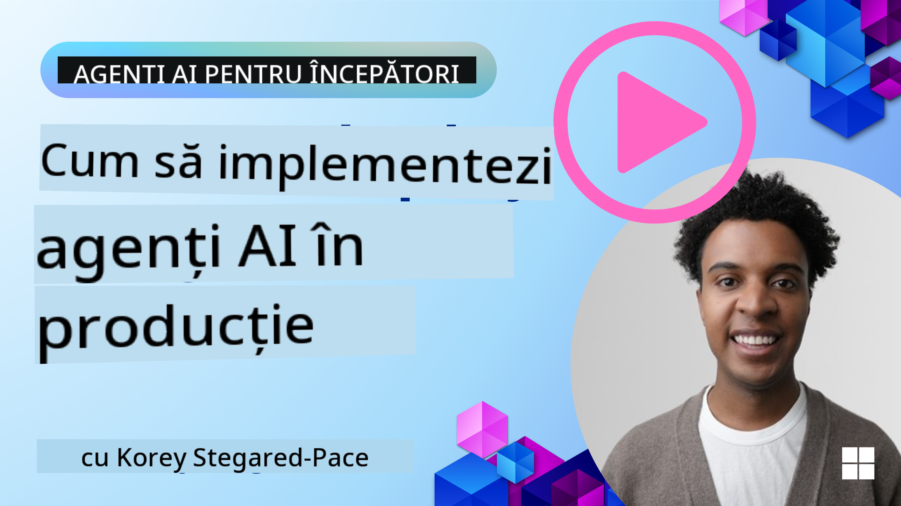

<!--
CO_OP_TRANSLATOR_METADATA:
{
  "original_hash": "1ad5de6a6388d02c145a92dd04358bab",
  "translation_date": "2025-07-12T13:42:01+00:00",
  "source_file": "10-ai-agents-production/README.md",
  "language_code": "ro"
}
-->

> _(Click pe imaginea de mai sus pentru a viziona videoclipul acestei lecții)_
# Agenți AI în Producție

## Introducere

Această lecție va acoperi:

- Cum să planifici eficient implementarea agentului tău AI în producție.
- Greșelile și problemele comune cu care te poți confrunta atunci când implementezi un agent AI în producție.
- Cum să gestionezi costurile păstrând în același timp performanța agentului tău AI.

## Obiective de Învățare

După ce vei parcurge această lecție, vei ști să/vei înțelege:

- Tehnici pentru îmbunătățirea performanței, costurilor și eficienței unui sistem de agenți AI în producție.
- Ce și cum să evaluezi agenții tăi AI.
- Cum să controlezi costurile atunci când implementezi agenți AI în producție.

Este important să implementezi agenți AI de încredere. Consultă și lecția „Building Trustworthy AI Agents”.

## Evaluarea Agenților AI

Înainte, în timpul și după implementarea agenților AI, este esențial să ai un sistem adecvat pentru evaluarea acestora. Acest lucru asigură că sistemul tău este aliniat cu obiectivele tale și ale utilizatorilor.

Pentru a evalua un agent AI, este important să poți evalua nu doar rezultatul agentului, ci întregul sistem în care acesta operează. Acest lucru include, dar nu se limitează la:

- Cererea inițială către model.
- Capacitatea agentului de a identifica intenția utilizatorului.
- Capacitatea agentului de a alege instrumentul potrivit pentru a îndeplini sarcina.
- Răspunsul instrumentului la cererea agentului.
- Capacitatea agentului de a interpreta răspunsul instrumentului.
- Feedback-ul utilizatorului asupra răspunsului agentului.

Acest lucru îți permite să identifici zonele care necesită îmbunătățiri într-un mod mai modular. Astfel, poți monitoriza mai eficient efectul modificărilor aduse modelelor, prompturilor, instrumentelor și altor componente.

## Probleme Comune și Soluții Potențiale cu Agenții AI

| **Problemă**                                   | **Soluție Potențială**                                                                                                                                                                                                    |
| ---------------------------------------------- | -------------------------------------------------------------------------------------------------------------------------------------------------------------------------------------------------------------------------- |
| Agentul AI nu execută sarcinile constant       | - Perfecționează promptul oferit agentului AI; fii clar în privința obiectivelor. - Identifică unde împărțirea sarcinilor în sub-sarcini și gestionarea lor de către mai mulți agenți poate ajuta.                        |
| Agentul AI intră în bucle continue              | - Asigură-te că ai termeni și condiții clare de terminare, astfel încât agentul să știe când să oprească procesul. - Pentru sarcini complexe care necesită raționament și planificare, folosește un model mai mare specializat. |
| Apelurile către instrumentele agentului nu funcționează bine | - Testează și validează rezultatul instrumentului în afara sistemului agent. - Perfecționează parametrii definiți, prompturile și denumirile instrumentelor.                                                             |
| Sistemul Multi-Agent nu funcționează constant  | - Perfecționează prompturile oferite fiecărui agent pentru a te asigura că sunt specifice și distincte. - Construiește un sistem ierarhic folosind un agent „router” sau controller pentru a determina agentul potrivit.     |

## Gestionarea Costurilor

Iată câteva strategii pentru a gestiona costurile implementării agenților AI în producție:

- **Cache-ul răspunsurilor** – Identificarea cererilor și sarcinilor comune și oferirea răspunsurilor înainte ca acestea să treacă prin sistemul tău agentic este o metodă bună de a reduce volumul cererilor similare. Poți chiar implementa un flux pentru a determina cât de asemănătoare este o cerere cu cele din cache folosind modele AI mai simple.

- **Folosirea modelelor mai mici** – Modelele de limbaj mici (SLM) pot performa bine în anumite cazuri de utilizare agentică și vor reduce semnificativ costurile. Așa cum am menționat anterior, construirea unui sistem de evaluare pentru a determina și compara performanța față de modelele mai mari este cea mai bună metodă de a înțelege cât de bine va funcționa un SLM în cazul tău.

- **Folosirea unui model router** – O strategie similară este utilizarea unei diversități de modele și dimensiuni. Poți folosi un LLM/SLM sau o funcție serverless pentru a direcționa cererile în funcție de complexitate către modelele cele mai potrivite. Acest lucru ajută la reducerea costurilor și asigură performanța pe sarcinile potrivite.

## Felicitări

Aceasta este în prezent ultima lecție din „AI Agents for Beginners”.

Plănuim să adăugăm lecții noi pe baza feedback-ului și a schimbărilor din această industrie în continuă creștere, așa că revino în curând.

Dacă vrei să continui să înveți și să construiești cu agenți AI, alătură-te comunității <a href="https://discord.gg/kzRShWzttr" target="_blank">Azure AI Community Discord</a>.

Acolo organizăm ateliere, mese rotunde comunitare și sesiuni „ask me anything”.

De asemenea, avem o colecție Learn cu materiale suplimentare care te pot ajuta să începi să construiești agenți AI în producție.

## Lecția Anterioară

[Metacognition Design Pattern](../09-metacognition/README.md)

**Declinare de responsabilitate**:  
Acest document a fost tradus folosind serviciul de traducere AI [Co-op Translator](https://github.com/Azure/co-op-translator). Deși ne străduim pentru acuratețe, vă rugăm să rețineți că traducerile automate pot conține erori sau inexactități. Documentul original în limba sa nativă trebuie considerat sursa autorizată. Pentru informații critice, se recomandă traducerea profesională realizată de un specialist uman. Nu ne asumăm răspunderea pentru eventualele neînțelegeri sau interpretări greșite rezultate din utilizarea acestei traduceri.