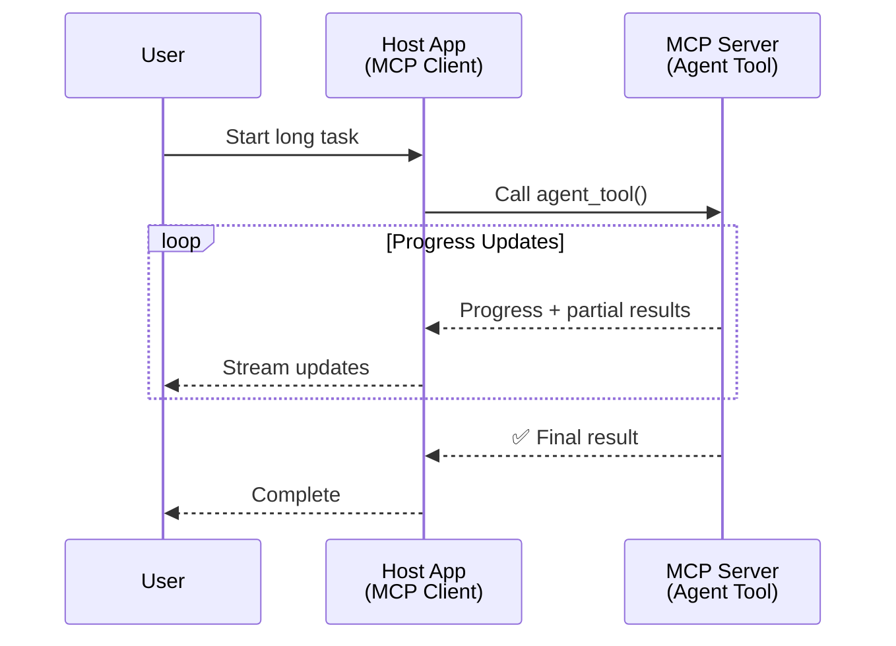
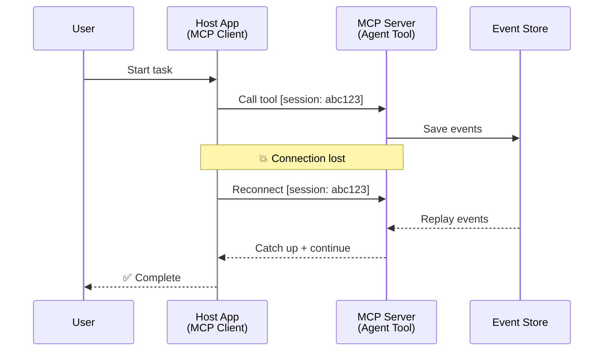
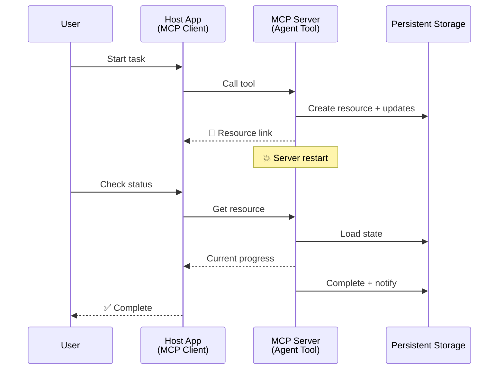
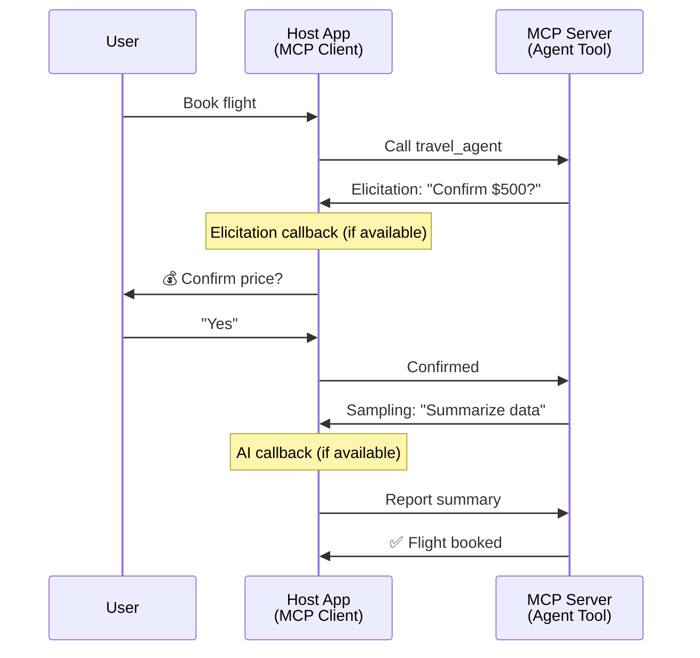
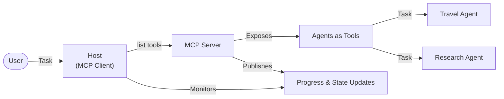

<!--
CO_OP_TRANSLATOR_METADATA:
{
  "original_hash": "5cc6836626047aa055e8960c8484a7d0",
  "translation_date": "2025-08-29T21:20:35+00:00",
  "source_file": "11-agentic-protocols/code_samples/mcp-agents/README.md",
  "language_code": "ro"
}
-->
# Construirea Sistemelor de Comunicare Agent-Agent cu MCP

> TL;DR - Poți construi comunicare Agent2Agent pe MCP? Da!

MCP a evoluat semnificativ dincolo de scopul său inițial de "oferire de context pentru LLM-uri". Cu îmbunătățiri recente, inclusiv [fluxuri reluabile](https://modelcontextprotocol.io/docs/concepts/transports#resumability-and-redelivery), [elicitație](https://modelcontextprotocol.io/specification/2025-06-18/client/elicitation), [eșantionare](https://modelcontextprotocol.io/specification/2025-06-18/client/sampling) și notificări ([progres](https://modelcontextprotocol.io/specification/2025-06-18/basic/utilities/progress) și [resurse](https://modelcontextprotocol.io/specification/2025-06-18/schema#resourceupdatednotification)), MCP oferă acum o fundație robustă pentru construirea sistemelor complexe de comunicare între agenți.

## Concepția Greșită despre Agent/Instrument

Pe măsură ce tot mai mulți dezvoltatori explorează instrumente cu comportamente agentice (rulează pentru perioade lungi, pot necesita input suplimentar în timpul execuției etc.), o concepție greșită comună este că MCP nu este potrivit, în principal deoarece exemplele timpurii ale primitivului său de instrumente s-au concentrat pe modele simple de cerere-răspuns.

Această percepție este depășită. Specificația MCP a fost semnificativ îmbunătățită în ultimele luni cu capabilități care închid golul pentru construirea comportamentului agentic pe termen lung:

- **Streaming & Rezultate Parțiale**: Actualizări de progres în timp real în timpul execuției
- **Reluabilitate**: Clienții se pot reconecta și continua după deconectare
- **Durabilitate**: Rezultatele supraviețuiesc restarturilor serverului (de exemplu, prin linkuri de resurse)
- **Multi-turn**: Input interactiv în timpul execuției prin elicitație și eșantionare

Aceste funcționalități pot fi compuse pentru a permite aplicații complexe agentice și multi-agent, toate implementate pe protocolul MCP.

Pentru referință, vom numi un agent "instrument" disponibil pe un server MCP. Aceasta implică existența unei aplicații gazdă care implementează un client MCP ce stabilește o sesiune cu serverul MCP și poate apela agentul.

## Ce Face ca un Instrument MCP să Fie "Agentic"?

Înainte de a intra în implementare, să stabilim ce capabilități de infrastructură sunt necesare pentru a susține agenți pe termen lung.

> Vom defini un agent ca o entitate care poate opera autonom pe perioade extinse, capabilă să gestioneze sarcini complexe care pot necesita multiple interacțiuni sau ajustări bazate pe feedback în timp real.

### 1. Streaming & Rezultate Parțiale

Modelele tradiționale de cerere-răspuns nu funcționează pentru sarcini pe termen lung. Agenții trebuie să ofere:

- Actualizări de progres în timp real
- Rezultate intermediare

**Suport MCP**: Notificările de actualizare a resurselor permit streamingul rezultatelor parțiale, deși acest lucru necesită un design atent pentru a evita conflictele cu modelul 1:1 cerere/răspuns al JSON-RPC.

| Funcționalitate            | Caz de Utilizare                                                                                                                                                                       | Suport MCP                                                                                  |
| -------------------------- | ------------------------------------------------------------------------------------------------------------------------------------------------------------------------------------- | ------------------------------------------------------------------------------------------ |
| Actualizări de Progres în Timp Real | Utilizatorul solicită o sarcină de migrare a codului. Agentul transmite progresul: "10% - Analizând dependențele... 25% - Convertind fișierele TypeScript... 50% - Actualizând importurile..." | ✅ Notificări de progres                                                                    |
| Rezultate Parțiale         | Sarcina "Generare carte" transmite rezultate parțiale, de exemplu, 1) Schița arcului narativ, 2) Lista capitolelor, 3) Fiecare capitol pe măsură ce este finalizat. Gazda poate inspecta, anula sau redirecționa în orice etapă. | ✅ Notificările pot fi "extinse" pentru a include rezultate parțiale, vezi propunerile PR 383, 776 |

<div align="center" style="font-style: italic; font-size: 0.95em; margin-bottom: 0.5em;">
<strong>Figura 1:</strong> Acest diagramă ilustrează cum un agent MCP transmite actualizări de progres în timp real și rezultate parțiale către aplicația gazdă în timpul unei sarcini pe termen lung, permițând utilizatorului să monitorizeze execuția în timp real.
</div>



### 2. Reluabilitate

Agenții trebuie să gestioneze întreruperile de rețea cu grație:

- Reconectare după deconectarea clientului
- Continuare de unde au rămas (redelivery mesaje)

**Suport MCP**: Transportul StreamableHTTP al MCP suportă astăzi reluarea sesiunii și redelivery-ul mesajelor cu ID-uri de sesiune și ID-uri de ultim eveniment. Nota importantă aici este că serverul trebuie să implementeze un EventStore care permite reluarea evenimentelor la reconectarea clientului.  
Există o propunere comunitară (PR #975) care explorează fluxuri reluabile independente de transport.

| Funcționalitate | Caz de Utilizare                                                                                                                                                   | Suport MCP                                                                |
| --------------- | ------------------------------------------------------------------------------------------------------------------------------------------------------------------ | -------------------------------------------------------------------------- |
| Reluabilitate   | Clientul se deconectează în timpul unei sarcini pe termen lung. La reconectare, sesiunea se reia cu evenimentele pierdute reluate, continuând fără probleme de unde a rămas. | ✅ Transport StreamableHTTP cu ID-uri de sesiune, reluare evenimente și EventStore |

<div align="center" style="font-style: italic; font-size: 0.95em; margin-bottom: 0.5em;">
<strong>Figura 2:</strong> Acest diagramă arată cum transportul StreamableHTTP al MCP și EventStore permit reluarea fără probleme a sesiunii: dacă clientul se deconectează, se poate reconecta și relua evenimentele pierdute, continuând sarcina fără pierderi de progres.
</div>



### 3. Durabilitate

Agenții pe termen lung au nevoie de stare persistentă:

- Rezultatele supraviețuiesc restarturilor serverului
- Starea poate fi recuperată în afara benzii
- Urmărirea progresului între sesiuni

**Suport MCP**: MCP suportă acum un tip de returnare Resource link pentru apelurile instrumentelor. Astăzi, un model posibil este să proiectezi un instrument care creează o resursă și returnează imediat un link de resursă. Instrumentul poate continua să abordeze sarcina în fundal și să actualizeze resursa. La rândul său, clientul poate alege să interogheze starea acestei resurse pentru a obține rezultate parțiale sau complete (bazate pe actualizările de resurse pe care le oferă serverul) sau să se aboneze la resursă pentru notificări de actualizare.

O limitare aici este că interogarea resurselor sau abonarea la actualizări poate consuma resurse cu implicații la scară. Există o propunere comunitară deschisă (inclusiv #992) care explorează posibilitatea includerii webhook-urilor sau triggerelor pe care serverul le poate apela pentru a notifica aplicația gazdă/clientul despre actualizări.

| Funcționalitate | Caz de Utilizare                                                                                                                                        | Suport MCP                                                        |
| --------------- | ------------------------------------------------------------------------------------------------------------------------------------------------------ | ------------------------------------------------------------------ |
| Durabilitate    | Serverul se prăbușește în timpul unei sarcini de migrare a datelor. Rezultatele și progresul supraviețuiesc restartului, clientul poate verifica starea și continua din resursa persistentă. | ✅ Linkuri de resurse cu stocare persistentă și notificări de stare |

Astăzi, un model comun este să proiectezi un instrument care creează o resursă și returnează imediat un link de resursă. Instrumentul poate aborda sarcina în fundal, emite notificări de resurse care servesc ca actualizări de progres sau includ rezultate parțiale și actualizează conținutul în resursă după cum este necesar.

<div align="center" style="font-style: italic; font-size: 0.95em; margin-bottom: 0.5em;">
<strong>Figura 3:</strong> Acest diagramă demonstrează cum agenții MCP folosesc resurse persistente și notificări de stare pentru a se asigura că sarcinile pe termen lung supraviețuiesc restarturilor serverului, permițând clienților să verifice progresul și să recupereze rezultatele chiar și după eșecuri.
</div>



### 4. Interacțiuni Multi-Turn

Agenții au nevoie adesea de input suplimentar în timpul execuției:

- Clarificare sau aprobare umană
- Asistență AI pentru decizii complexe
- Ajustarea dinamică a parametrilor

**Suport MCP**: Complet suportat prin eșantionare (pentru input AI) și elicitație (pentru input uman).

| Funcționalitate            | Caz de Utilizare                                                                                                                                     | Suport MCP                                           |
| -------------------------- | ---------------------------------------------------------------------------------------------------------------------------------------------------- | ----------------------------------------------------- |
| Interacțiuni Multi-Turn    | Agentul de rezervare călătorii solicită confirmarea prețului de la utilizator, apoi cere AI să rezume datele de călătorie înainte de finalizarea tranzacției de rezervare. | ✅ Elicitație pentru input uman, eșantionare pentru input AI |

<div align="center" style="font-style: italic; font-size: 0.95em; margin-bottom: 0.5em;">
<strong>Figura 4:</strong> Acest diagramă descrie cum agenții MCP pot solicita interactiv input uman sau asistență AI în timpul execuției, susținând fluxuri de lucru complexe, multi-turn, cum ar fi confirmări și luarea deciziilor dinamice.
</div>



## Implementarea Agenților pe Termen Lung pe MCP - Prezentare Generală a Codului

Ca parte a acestui articol, oferim un [repository de cod](https://github.com/victordibia/ai-tutorials/tree/main/MCP%20Agents) care conține o implementare completă a agenților pe termen lung folosind MCP Python SDK cu transport StreamableHTTP pentru reluarea sesiunii și redelivery-ul mesajelor. Implementarea demonstrează cum capabilitățile MCP pot fi compuse pentru a permite comportamente sofisticate de tip agent.

Specifica, implementăm un server cu două instrumente principale de agent:

- **Agent de Călătorii** - Simulează un serviciu de rezervare călătorii cu confirmarea prețului prin elicitație
- **Agent de Cercetare** - Realizează sarcini de cercetare cu rezumate asistate de AI prin eșantionare

Ambii agenți demonstrează actualizări de progres în timp real, confirmări interactive și capabilități complete de reluare a sesiunii.

### Concepte Cheie de Implementare

Secțiunile următoare arată implementarea agentului pe partea serverului și gestionarea gazdei pe partea clientului pentru fiecare capabilitate:

#### Streaming & Actualizări de Progres - Starea Sarcinii în Timp Real

Streamingul permite agenților să ofere actualizări de progres în timp real în timpul sarcinilor pe termen lung, menținând utilizatorii informați despre starea sarcinii și rezultatele intermediare.

**Implementare Server (agentul trimite notificări de progres):**

```python
# From server/server.py - Travel agent sending progress updates
for i, step in enumerate(steps):
    await ctx.session.send_progress_notification(
        progress_token=ctx.request_id,
        progress=i * 25,
        total=100,
        message=step,
        related_request_id=str(ctx.request_id)
    )
    await anyio.sleep(2)  # Simulate work

# Alternative: Log messages for detailed step-by-step updates
await ctx.session.send_log_message(
    level="info",
    data=f"Processing step {current_step}/{steps} ({progress_percent}%)",
    logger="long_running_agent",
    related_request_id=ctx.request_id,
)
```

**Implementare Client (gazda primește actualizări de progres):**

```python
# From client/client.py - Client handling real-time notifications
async def message_handler(message) -> None:
    if isinstance(message, types.ServerNotification):
        if isinstance(message.root, types.LoggingMessageNotification):
            console.print(f"📡 [dim]{message.root.params.data}[/dim]")
        elif isinstance(message.root, types.ProgressNotification):
            progress = message.root.params
            console.print(f"🔄 [yellow]{progress.message} ({progress.progress}/{progress.total})[/yellow]")

# Register message handler when creating session
async with ClientSession(
    read_stream, write_stream,
    message_handler=message_handler
) as session:
```

#### Elicitație - Solicitarea Inputului Utilizatorului

Elicitația permite agenților să solicite inputul utilizatorului în timpul execuției. Acest lucru este esențial pentru confirmări, clarificări sau aprobări în timpul sarcinilor pe termen lung.

**Implementare Server (agentul solicită confirmare):**

```python
# From server/server.py - Travel agent requesting price confirmation
elicit_result = await ctx.session.elicit(
    message=f"Please confirm the estimated price of $1200 for your trip to {destination}",
    requestedSchema=PriceConfirmationSchema.model_json_schema(),
    related_request_id=ctx.request_id,
)

if elicit_result and elicit_result.action == "accept":
    # Continue with booking
    logger.info(f"User confirmed price: {elicit_result.content}")
elif elicit_result and elicit_result.action == "decline":
    # Cancel the booking
    booking_cancelled = True
```

**Implementare Client (gazda oferă callback pentru elicitație):**

```python
# From client/client.py - Client handling elicitation requests
async def elicitation_callback(context, params):
    console.print(f"💬 Server is asking for confirmation:")
    console.print(f"   {params.message}")

    response = console.input("Do you accept? (y/n): ").strip().lower()

    if response in ['y', 'yes']:
        return types.ElicitResult(
            action="accept",
            content={"confirm": True, "notes": "Confirmed by user"}
        )
    else:
        return types.ElicitResult(
            action="decline",
            content={"confirm": False, "notes": "Declined by user"}
        )

# Register the callback when creating the session
async with ClientSession(
    read_stream, write_stream,
    elicitation_callback=elicitation_callback
) as session:
```

#### Eșantionare - Solicitarea Asistenței AI

Eșantionarea permite agenților să solicite asistență LLM pentru decizii complexe sau generarea de conținut în timpul execuției. Acest lucru permite fluxuri de lucru hibride om-AI.

**Implementare Server (agentul solicită asistență AI):**

```python
# From server/server.py - Research agent requesting AI summary
sampling_result = await ctx.session.create_message(
    messages=[
        SamplingMessage(
            role="user",
            content=TextContent(type="text", text=f"Please summarize the key findings for research on: {topic}")
        )
    ],
    max_tokens=100,
    related_request_id=ctx.request_id,
)

if sampling_result and sampling_result.content:
    if sampling_result.content.type == "text":
        sampling_summary = sampling_result.content.text
        logger.info(f"Received sampling summary: {sampling_summary}")
```

**Implementare Client (gazda oferă callback pentru eșantionare):**

```python
# From client/client.py - Client handling sampling requests
async def sampling_callback(context, params):
    message_text = params.messages[0].content.text if params.messages else 'No message'
    console.print(f"🧠 Server requested sampling: {message_text}")

    # In a real application, this could call an LLM API
    # For demo purposes, we provide a mock response
    mock_response = "Based on current research, MCP has evolved significantly..."

    return types.CreateMessageResult(
        role="assistant",
        content=types.TextContent(type="text", text=mock_response),
        model="interactive-client",
        stopReason="endTurn"
    )

# Register the callback when creating the session
async with ClientSession(
    read_stream, write_stream,
    sampling_callback=sampling_callback,
    elicitation_callback=elicitation_callback
) as session:
```

#### Reluabilitate - Continuitatea Sesiunii în Cazul Deconectărilor

Reluabilitatea asigură că sarcinile agentului pe termen lung pot supraviețui deconectărilor clientului și pot continua fără probleme la reconectare. Acest lucru este implementat prin stocarea evenimentelor și tokenuri de reluare.

**Implementare Event Store (serverul păstrează starea sesiunii):**

```python
# From server/event_store.py - Simple in-memory event store
class SimpleEventStore(EventStore):
    def __init__(self):
        self._events: list[tuple[StreamId, EventId, JSONRPCMessage]] = []
        self._event_id_counter = 0

    async def store_event(self, stream_id: StreamId, message: JSONRPCMessage) -> EventId:
        """Store an event and return its ID."""
        self._event_id_counter += 1
        event_id = str(self._event_id_counter)
        self._events.append((stream_id, event_id, message))
        return event_id

    async def replay_events_after(self, last_event_id: EventId, send_callback: EventCallback) -> StreamId | None:
        """Replay events after the specified ID for resumption."""
        # Find events after the last known event and replay them
        for _, event_id, message in self._events[start_index:]:
            await send_callback(EventMessage(message, event_id))

# From server/server.py - Passing event store to session manager
def create_server_app(event_store: Optional[EventStore] = None) -> Starlette:
    server = ResumableServer()

    # Create session manager with event store for resumption
    session_manager = StreamableHTTPSessionManager(
        app=server,
        event_store=event_store,  # Event store enables session resumption
        json_response=False,
        security_settings=security_settings,
    )

    return Starlette(routes=[Mount("/mcp", app=session_manager.handle_request)])

# Usage: Initialize with event store
event_store = SimpleEventStore()
app = create_server_app(event_store)
```

**Metadate Client cu Token de Reluare (clientul se reconectează folosind starea stocată):**

```python
# From client/client.py - Client resumption with metadata
if existing_tokens and existing_tokens.get("resumption_token"):
    # Use existing resumption token to continue where we left off
    metadata = ClientMessageMetadata(
        resumption_token=existing_tokens["resumption_token"],
    )
else:
    # Create callback to save resumption token when received
    def enhanced_callback(token: str):
        protocol_version = getattr(session, 'protocol_version', None)
        token_manager.save_tokens(session_id, token, protocol_version, command, args)

    metadata = ClientMessageMetadata(
        on_resumption_token_update=enhanced_callback,
    )

# Send request with resumption metadata
result = await session.send_request(
    types.ClientRequest(
        types.CallToolRequest(
            method="tools/call",
            params=types.CallToolRequestParams(name=command, arguments=args)
        )
    ),
    types.CallToolResult,
    metadata=metadata,
)
```

Aplicația gazdă menține ID-uri de sesiune și tokenuri de reluare local, permițându-i să se reconecteze la sesiunile existente fără pierderi de progres sau stare.

### Organizarea Codului

<div align="center" style="font-style: italic; font-size: 0.95em; margin-bottom: 0.5em;">
<strong>Figura 5:</strong> Arhitectura sistemului de agenți bazat pe MCP
</div>



**Fișiere Cheie:**

- **`server/server.py`** - Server MCP reluabil cu agenți de călătorii și cercetare care demonstrează elicitație, eșantionare și actualizări de progres
- **`client/client.py`** - Aplicație gazdă interactivă cu suport pentru reluare, gestionare callback-uri și administrare tokenuri
- **`server/event_store.py`** - Implementare Event Store care permite reluarea sesiunii și redelivery-ul mesajelor

## Extinderea la Comunicare Multi-Agent pe MCP

Implementarea de mai sus poate fi extinsă la sisteme multi-agent prin îmbunătățirea inteligenței și domeniului aplicației gazdă:

- **Decompoziția Inteligentă a Sarcinilor**: Gazda analizează cererile complexe ale utilizatorului și le împarte în subtasks pentru diferiți agenți specializați
- **Coordonarea Multi-Server**: Gazda menține conexiuni la mai multe servere MCP, fiecare expunând capabilități diferite ale agenților
- **Gestionarea Stării Sarcinilor**: Gazda urmărește progresul între multiple sarcini concurente ale agenților, gestionând dependențele și secvențierea
- **Reziliență & Retries**: Gazda gestionează eșecurile, implementează logica de retry și redirecționează sarcinile când agenții devin indisponibili
- **Sinteză Rezultate**: Gazda combină outputurile de la mai mulți agenți în rezultate finale coerente

Gazda evoluează de la un client simplu la un orchestrator inteligent, coordonând capabilitățile distribuite ale agenților, menținând în același timp fundația protocolului MCP.

## Concluzie

Capabilitățile îmbunătățite ale MCP - notificări de resurse, elicitație/eșantionare, fluxuri reluabile și resurse persistente - permit interacțiuni complexe între agenți, menținând în același timp simplitatea protocolului.

## Începeți

Gata să construiți propriul sistem agent2agent? Urmați acești pași:

### 1. Rulați Demo-ul

```bash
# Start the server with event store for resumption
python -m server.server --port 8006

# In another terminal, run the interactive client
python -m client.client --url http://127.0.0.1:8006/mcp
```

**Comenzi disponibile în modul interactiv:**

- `travel_agent` - Rezervă călătorii cu confirmarea prețului prin elicitație
- `research_agent` - Cercetează subiecte cu rezumate asistate de AI prin eșantionare
- `list` - Afișează toate instrumentele disponibile
- `clean-tokens` - Șterge tokenurile de reluare
- `help` - Afișează ajutor detaliat pentru comenzi
- `quit` - Ieșire din client

### 2. Testați Capabilitățile de Reluare

- Porniți un agent pe termen lung (de exemplu, `travel_agent`)
- Întrerupeți clientul în timpul execuției (Ctrl+C)
- Reporniți clientul - acesta va relua automat de unde a rămas

### 3. Explorați și Extindeți

- **Explorați exemplele**: Verificați acest [mcp-agents](https://github.com/victordibia/ai-tutorials/tree/main/MCP%20Agents)
- **Alăturați-vă comunității**: Participați la discuțiile MCP pe GitHub
- **Experimentați**: Începeți cu o sarcină simplă pe termen lung și adăugați

---

**Declinare de responsabilitate**:  
Acest document a fost tradus folosind serviciul de traducere AI [Co-op Translator](https://github.com/Azure/co-op-translator). Deși ne străduim să asigurăm acuratețea, vă rugăm să rețineți că traducerile automate pot conține erori sau inexactități. Documentul original în limba sa natală ar trebui considerat sursa autoritară. Pentru informații critice, se recomandă traducerea profesională realizată de un specialist uman. Nu ne asumăm responsabilitatea pentru eventualele neînțelegeri sau interpretări greșite care pot apărea din utilizarea acestei traduceri.