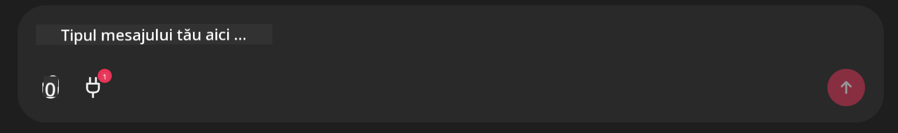

<!--
CO_OP_TRANSLATOR_METADATA:
{
  "original_hash": "9bf0395cbc541ce8db2a9699c8678dfc",
  "translation_date": "2025-07-12T14:24:40+00:00",
  "source_file": "11-mcp/code_samples/github-mcp/README.md",
  "language_code": "ro"
}
-->
# Exemplu Server Github MCP

## Descriere

Acesta a fost un demo creat pentru AI Agents Hackathon organizat prin Microsoft Reactor.

Instrumentul este folosit pentru a recomanda proiecte pentru hackathon bazate pe repo-urile Github ale unui utilizator.  
Acest lucru se realizează prin:

1. **Github Agent** - Folosind Github MCP Server pentru a prelua repo-urile și informații despre acestea.  
2. **Hackathon Agent** - Preia datele de la Github Agent și generează idei creative de proiecte pentru hackathon, bazate pe proiectele, limbajele folosite de utilizator și categoriile proiectelor pentru AI Agents hackathon.  
3. **Events Agent** - Pe baza sugestiilor Hackathon Agent, Events Agent recomandă evenimente relevante din seria AI Agent Hackathon.  

## Rularea codului

### Variabile de mediu

Acest demo folosește Azure Open AI Service, Semantic Kernel, Github MCP Server și Azure AI Search.

Asigură-te că ai setat corect variabilele de mediu necesare pentru a folosi aceste instrumente:

```python
AZURE_OPENAI_CHAT_DEPLOYMENT_NAME=""
AZURE_OPENAI_EMBEDDING_DEPLOYMENT_NAME=""
AZURE_OPENAI_ENDPOINT=""
AZURE_OPENAI_API_KEY=""
AZURE_OPENAI_API_VERSION=""
AZURE_SEARCH_SERVICE_ENDPOINT=""
AZURE_SEARCH_API_KEY=""
```

## Rularea serverului Chainlit

Pentru a te conecta la MCP server, acest demo folosește Chainlit ca interfață de chat.

Pentru a porni serverul, folosește următoarea comandă în terminal:

```bash
chainlit run app.py -w
```

Aceasta va porni serverul Chainlit pe `localhost:8000` și va popula indexul Azure AI Search cu conținutul din `event-descriptions.md`.

## Conectarea la MCP Server

Pentru a te conecta la Github MCP Server, selectează pictograma „plug” de sub caseta de chat „Type your message here..”:



De acolo, poți da click pe „Connect an MCP” pentru a adăuga comanda de conectare la Github MCP Server:

```bash
npx -y @modelcontextprotocol/server-github --env GITHUB_PERSONAL_ACCESS_TOKEN=[YOUR PERSONAL ACCESS TOKEN]
```

Înlocuiește „[YOUR PERSONAL ACCESS TOKEN]” cu token-ul tău personal de acces.

După conectare, ar trebui să vezi un (1) lângă pictograma plug pentru a confirma conexiunea. Dacă nu, încearcă să repornești serverul chainlit cu `chainlit run app.py -w`.

## Folosirea demo-ului

Pentru a porni fluxul de lucru al agentului care recomandă proiecte pentru hackathon, poți scrie un mesaj de genul:

„Recommend hackathon projects for the Github user koreyspace”

Router Agent va analiza cererea ta și va determina ce combinație de agenți (GitHub, Hackathon și Events) este cea mai potrivită pentru a răspunde solicitării tale. Agenții colaborează pentru a oferi recomandări complete bazate pe analiza repo-urilor GitHub, generarea de idei de proiect și evenimente tech relevante.

**Declinare de responsabilitate**:  
Acest document a fost tradus folosind serviciul de traducere AI [Co-op Translator](https://github.com/Azure/co-op-translator). Deși ne străduim pentru acuratețe, vă rugăm să rețineți că traducerile automate pot conține erori sau inexactități. Documentul original în limba sa nativă trebuie considerat sursa autorizată. Pentru informații critice, se recomandă traducerea profesională realizată de un specialist uman. Nu ne asumăm răspunderea pentru eventualele neînțelegeri sau interpretări greșite rezultate din utilizarea acestei traduceri.