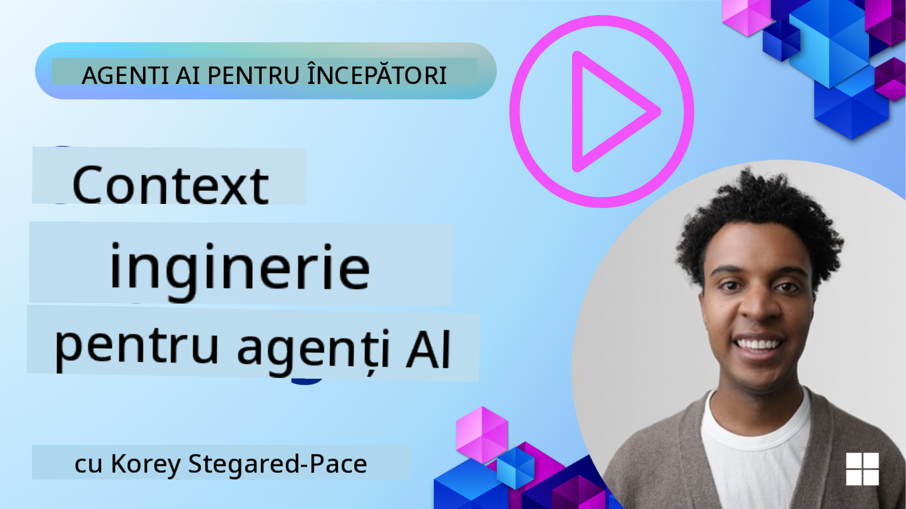
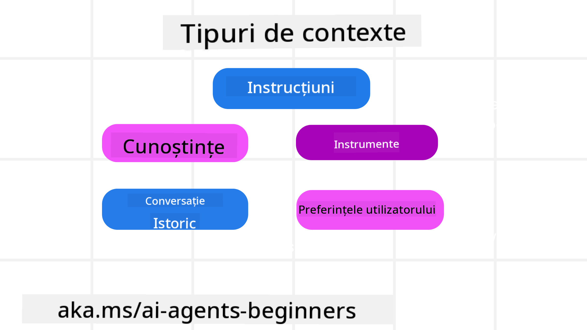
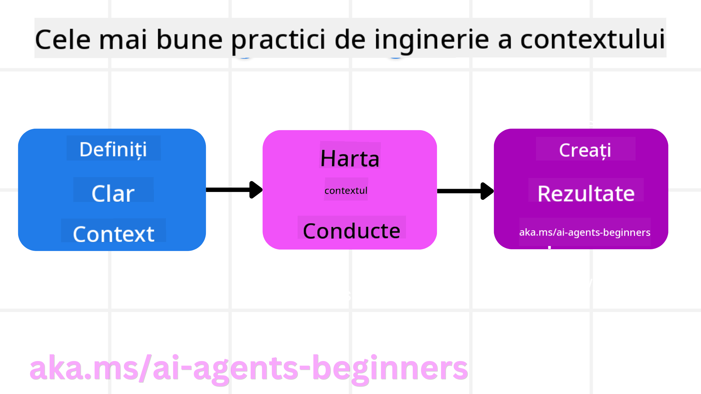

<!--
CO_OP_TRANSLATOR_METADATA:
{
  "original_hash": "cb7e50f471905ce6fdb92a30269a7a98",
  "translation_date": "2025-09-04T10:27:21+00:00",
  "source_file": "12-context-engineering/README.md",
  "language_code": "ro"
}
-->
# Ingineria Contextului pentru Agenți AI

> _(Click pe imaginea de mai sus pentru a viziona videoclipul lecției)_

Înțelegerea complexității aplicației pentru care construiești un agent AI este esențială pentru a crea unul fiabil. Trebuie să construim agenți AI care gestionează eficient informațiile pentru a răspunde nevoilor complexe, dincolo de simpla inginerie a prompturilor.

În această lecție, vom analiza ce este ingineria contextului și rolul său în construirea agenților AI.

## Introducere

Această lecție va acoperi:

• **Ce este Ingineria Contextului** și de ce este diferită de ingineria prompturilor.

• **Strategii pentru o Inginerie a Contextului eficientă**, inclusiv cum să scrii, selectezi, comprimi și izolezi informațiile.

• **Eșecuri comune ale contextului** care pot deraia un agent AI și cum să le remediezi.

## Obiective de Învățare

După finalizarea acestei lecții, vei înțelege cum să:

• **Definiți ingineria contextului** și să o diferențiezi de ingineria prompturilor.

• **Identifici componentele cheie ale contextului** în aplicațiile bazate pe modele de limbaj mari (LLM).

• **Aplici strategii pentru scrierea, selectarea, comprimarea și izolarea contextului** pentru a îmbunătăți performanța agentului.

• **Recunoști eșecurile comune ale contextului** precum otrăvirea, distragerea, confuzia și conflictul, și să implementezi tehnici de atenuare.

## Ce este Ingineria Contextului?

Pentru agenții AI, contextul este ceea ce determină planificarea unui agent AI pentru a lua anumite acțiuni. Ingineria contextului este practica de a te asigura că agentul AI are informațiile corecte pentru a finaliza următorul pas al sarcinii. Fereastra de context este limitată ca dimensiune, așa că, în calitate de constructori de agenți, trebuie să creăm sisteme și procese pentru a gestiona adăugarea, eliminarea și condensarea informațiilor din fereastra de context.

### Ingineria Prompturilor vs Ingineria Contextului

Ingineria prompturilor se concentrează pe un set unic de instrucțiuni statice pentru a ghida eficient agenții AI cu un set de reguli. Ingineria contextului se referă la gestionarea unui set dinamic de informații, inclusiv promptul inițial, pentru a te asigura că agentul AI are ceea ce îi trebuie în timp. Ideea principală a ingineriei contextului este de a face acest proces repetabil și fiabil.

### Tipuri de Context

Este important să ne amintim că contextul nu este doar un singur lucru. Informațiile de care agentul AI are nevoie pot proveni dintr-o varietate de surse diferite, iar noi trebuie să ne asigurăm că agentul are acces la aceste surse:

Tipurile de context pe care un agent AI ar putea să le gestioneze includ:

• **Instrucțiuni:** Acestea sunt ca "regulile" agentului – prompturi, mesaje de sistem, exemple few-shot (care arată AI-ului cum să facă ceva) și descrieri ale instrumentelor pe care le poate folosi. Aici se combină focalizarea ingineriei prompturilor cu ingineria contextului.

• **Cunoștințe:** Acestea includ fapte, informații recuperate din baze de date sau amintiri pe termen lung pe care agentul le-a acumulat. Acest lucru include integrarea unui sistem de Generare Augmentată prin Recuperare (RAG) dacă un agent are nevoie de acces la diferite depozite de cunoștințe și baze de date.

• **Instrumente:** Acestea sunt definițiile funcțiilor externe, API-urilor și serverelor MCP pe care agentul le poate apela, împreună cu feedback-ul (rezultatele) pe care le obține din utilizarea lor.

• **Istoricul conversației:** Dialogul continuu cu un utilizator. Pe măsură ce timpul trece, aceste conversații devin mai lungi și mai complexe, ceea ce înseamnă că ocupă spațiu în fereastra de context.

• **Preferințele utilizatorului:** Informații învățate despre preferințele sau antipatiile unui utilizator de-a lungul timpului. Acestea ar putea fi stocate și utilizate atunci când se iau decizii cheie pentru a ajuta utilizatorul.

## Strategii pentru o Inginerie a Contextului Eficientă

### Strategii de Planificare

O bună inginerie a contextului începe cu o bună planificare. Iată o abordare care te va ajuta să începi să aplici conceptul de inginerie a contextului:

1. **Definește Rezultate Clare** - Rezultatele sarcinilor pe care agenții AI le vor primi ar trebui să fie clar definite. Răspunde la întrebarea - "Cum va arăta lumea când agentul AI își va termina sarcina?" Cu alte cuvinte, ce schimbare, informație sau răspuns ar trebui să aibă utilizatorul după interacțiunea cu agentul AI.

2. **Mapează Contextul** - După ce ai definit rezultatele agentului AI, trebuie să răspunzi la întrebarea "Ce informații are nevoie agentul AI pentru a finaliza această sarcină?". În acest fel, poți începe să mapezi contextul de unde pot fi localizate aceste informații.

3. **Creează Conducte de Context** - Acum că știi unde se află informațiile, trebuie să răspunzi la întrebarea "Cum va obține agentul aceste informații?". Acest lucru poate fi realizat în diverse moduri, inclusiv RAG, utilizarea serverelor MCP și alte instrumente.

### Strategii Practice

Planificarea este importantă, dar odată ce informațiile încep să curgă în fereastra de context a agentului, trebuie să avem strategii practice pentru a le gestiona:

#### Gestionarea Contextului

Deși unele informații vor fi adăugate automat în fereastra de context, ingineria contextului presupune un rol mai activ în gestionarea acestor informații, care poate fi realizat prin câteva strategii:

1. **Carnet de Note al Agentului**  
Permite agentului AI să ia notițe despre informațiile relevante legate de sarcinile curente și interacțiunile cu utilizatorul în timpul unei singure sesiuni. Acestea ar trebui să existe în afara ferestrei de context, într-un fișier sau obiect runtime pe care agentul îl poate recupera ulterior în această sesiune, dacă este necesar.

2. **Amintiri**  
Carnetele de note sunt bune pentru gestionarea informațiilor în afara ferestrei de context a unei singure sesiuni. Amintirile permit agenților să stocheze și să recupereze informații relevante pe parcursul mai multor sesiuni. Acestea ar putea include rezumate, preferințe ale utilizatorului și feedback pentru îmbunătățiri viitoare.

3. **Comprimarea Contextului**  
Odată ce fereastra de context crește și se apropie de limită, pot fi utilizate tehnici precum rezumarea și tăierea. Acestea includ păstrarea doar a informațiilor cele mai relevante sau eliminarea mesajelor mai vechi.

4. **Sisteme Multi-Agent**  
Dezvoltarea unui sistem multi-agent este o formă de inginerie a contextului, deoarece fiecare agent are propria fereastră de context. Modul în care acest context este partajat și transmis între agenți este un alt aspect de planificat atunci când construiești aceste sisteme.

5. **Mediu de Testare**  
Dacă un agent trebuie să ruleze un cod sau să proceseze cantități mari de informații dintr-un document, acest lucru poate consuma un număr mare de tokeni pentru procesarea rezultatelor. În loc să stocheze toate acestea în fereastra de context, agentul poate utiliza un mediu de testare care poate rula acest cod și să citească doar rezultatele și alte informații relevante.

6. **Obiecte de Stare Runtime**  
Acest lucru se realizează prin crearea de containere de informații pentru a gestiona situațiile în care agentul trebuie să aibă acces la anumite informații. Pentru o sarcină complexă, acest lucru ar permite agentului să stocheze rezultatele fiecărui subtask pas cu pas, permițând contextului să rămână conectat doar la subtask-ul specific.

### Exemplu de Inginerie a Contextului

Să presupunem că dorim ca un agent AI să **"Îmi rezervi o călătorie la Paris."**

• Un agent simplu care folosește doar ingineria prompturilor ar putea răspunde: **"Bine, când ai vrea să mergi la Paris?"**. Acesta procesează doar întrebarea directă a utilizatorului în momentul în care este întrebat.

• Un agent care folosește strategiile de inginerie a contextului acoperite ar face mult mai mult. Înainte de a răspunde, sistemul său ar putea:

  ◦ **Verifica calendarul tău** pentru date disponibile (recuperând date în timp real).

 ◦ **Aminti preferințele tale de călătorie anterioare** (din memoria pe termen lung), cum ar fi compania aeriană preferată, bugetul sau dacă preferi zboruri directe.

 ◦ **Identifica instrumentele disponibile** pentru rezervarea zborurilor și hotelurilor.

- Apoi, un exemplu de răspuns ar putea fi: "Salut [Numele Tău]! Văd că ești liber în prima săptămână din octombrie. Să caut zboruri directe către Paris cu [Compania Aeriană Preferată] în limita bugetului tău obișnuit de [Buget]?". Acest răspuns mai bogat, conștient de context, demonstrează puterea ingineriei contextului.

## Eșecuri Comune ale Contextului

### Otrăvirea Contextului

**Ce este:** Când o halucinație (informație falsă generată de LLM) sau o eroare intră în context și este referită repetat, determinând agentul să urmărească obiective imposibile sau să dezvolte strategii absurde.

**Ce să faci:** Implementați **validarea contextului** și **carantina**. Validați informațiile înainte de a fi adăugate în memoria pe termen lung. Dacă se detectează o posibilă otrăvire, începeți fire de context noi pentru a preveni răspândirea informațiilor eronate.

**Exemplu de Rezervare:** Agentul tău halucinează un **zbor direct de la un mic aeroport local către un oraș internațional îndepărtat** care nu oferă de fapt zboruri internaționale. Acest detaliu inexistent al zborului este salvat în context. Mai târziu, când îi ceri agentului să rezerve, acesta continuă să încerce să găsească bilete pentru această rută imposibilă, ducând la erori repetate.

**Soluție:** Implementați un pas care **validează existența zborului și rutele cu un API în timp real** _înainte_ de a adăuga detaliile zborului în contextul de lucru al agentului. Dacă validarea eșuează, informațiile eronate sunt "carantinate" și nu sunt utilizate mai departe.

### Distragerea Contextului

**Ce este:** Când contextul devine atât de mare încât modelul se concentrează prea mult pe istoricul acumulat în loc să folosească ceea ce a învățat în timpul antrenamentului, ducând la acțiuni repetitive sau inutile. Modelele pot începe să facă greșeli chiar înainte ca fereastra de context să fie plină.

**Ce să faci:** Folosiți **rezumarea contextului**. Comprimați periodic informațiile acumulate în rezumate mai scurte, păstrând detaliile importante și eliminând istoricul redundant. Acest lucru ajută la "resetarea" focalizării.

**Exemplu de Rezervare:** Ai discutat despre diverse destinații de vis pentru o perioadă lungă de timp, inclusiv o relatare detaliată a excursiei tale de backpacking de acum doi ani. Când în cele din urmă ceri **"găsește-mi un zbor ieftin pentru luna viitoare"**, agentul se pierde în detaliile vechi și irelevante și continuă să întrebe despre echipamentul tău de backpacking sau itinerariile anterioare, neglijând cererea ta actuală.

**Soluție:** După un anumit număr de interacțiuni sau când contextul devine prea mare, agentul ar trebui să **rezume cele mai recente și relevante părți ale conversației** – concentrându-se pe datele și destinația ta actuală – și să folosească acel rezumat condensat pentru următorul apel LLM, eliminând chat-ul istoric mai puțin relevant.

### Confuzia Contextului

**Ce este:** Când contextul inutil, adesea sub forma prea multor instrumente disponibile, determină modelul să genereze răspunsuri proaste sau să apeleze instrumente irelevante. Modelele mai mici sunt deosebit de predispuse la acest lucru.

**Ce să faci:** Implementați **gestionarea încărcării instrumentelor** folosind tehnici RAG. Stocați descrierile instrumentelor într-o bază de date vectorială și selectați _doar_ cele mai relevante instrumente pentru fiecare sarcină specifică. Cercetările arată că limitarea selecțiilor de instrumente la mai puțin de 30 este eficientă.

**Exemplu de Rezervare:** Agentul tău are acces la zeci de instrumente: `book_flight`, `book_hotel`, `rent_car`, `find_tours`, `currency_converter`, `weather_forecast`, `restaurant_reservations`, etc. Îi ceri, **"Care este cea mai bună modalitate de a te deplasa prin Paris?"** Din cauza numărului mare de instrumente, agentul se confuzează și încearcă să apeleze `book_flight` _în_ Paris sau `rent_car`, deși preferi transportul public, deoarece descrierile instrumentelor pot fi suprapuse sau pur și simplu nu poate discerne cel mai bun instrument.

**Soluție:** Folosiți **RAG peste descrierile instrumentelor**. Când întrebi despre deplasarea prin Paris, sistemul recuperează dinamic _doar_ cele mai relevante instrumente, cum ar fi `rent_car` sau `public_transport_info`, pe baza întrebării tale, prezentând un "set de instrumente" concentrat pentru LLM.

### Conflictul Contextului

**Ce este:** Când informațiile conflictuale există în context, ducând la raționamente inconsistente sau răspunsuri finale proaste. Acest lucru se întâmplă adesea când informațiile sosesc în etape, iar presupunerile incorecte inițiale rămân în context.

**Ce să faci:** Folosiți **curățarea contextului** și **descărcarea**. Curățarea înseamnă eliminarea informațiilor învechite sau conflictuale pe măsură ce apar detalii noi. Descărcarea oferă modelului un "carnet de note" separat pentru a procesa informațiile fără a aglomera contextul principal.

**Exemplu de Rezervare:** Inițial îi spui agentului, **"Vreau să zbor la clasa economică."** Mai târziu în conversație, te răzgândești și spui, **"De fapt, pentru această călătorie, să mergem la clasa business."** Dacă ambele instrucțiuni rămân în context, agentul ar putea primi rezultate de căutare conflictuale sau să se confuzeze cu privire la preferința pe care să o prioritizeze.

**Soluție:** Implementați **curățarea contextului**. Când o nouă instrucțiune contrazice una veche, instrucțiunea mai veche este eliminată sau explicit suprascrisă în context. Alternativ, agentul poate folosi un **carnet de note** pentru a reconcilia preferințele conflictuale înainte de a decide, asigurându-se că doar instrucțiunea finală și consistentă ghidează acțiunile sale.

## Ai Mai Multe Întrebări Despre Ingineria Contextului?

Alătură-te [Discordului Azure AI Foundry](https://aka.ms/ai-agents/discord) pentru a te întâlni cu alți cursanți, a participa la ore de consultanță și a obține răspunsuri la întrebările tale despre agenții AI.

---

**Declinare de responsabilitate**:  
Acest document a fost tradus folosind serviciul de traducere AI [Co-op Translator](https://github.com/Azure/co-op-translator). Deși ne străduim să asigurăm acuratețea, vă rugăm să rețineți că traducerile automate pot conține erori sau inexactități. Documentul original în limba sa natală ar trebui considerat sursa autoritară. Pentru informații critice, se recomandă traducerea profesională realizată de un specialist uman. Nu ne asumăm responsabilitatea pentru eventualele neînțelegeri sau interpretări greșite care pot apărea din utilizarea acestei traduceri.