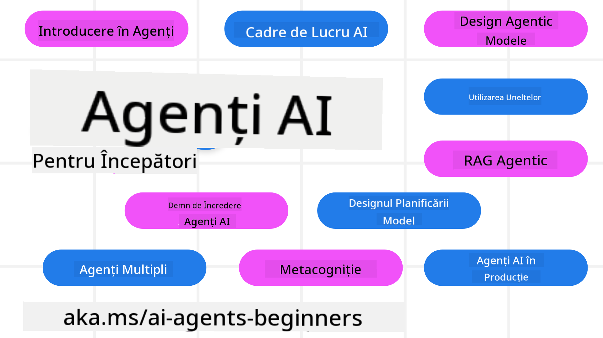

<!--
CO_OP_TRANSLATOR_METADATA:
{
  "original_hash": "6b07046397366e6f6f4524c9ddeba1e1",
  "translation_date": "2025-07-12T14:59:49+00:00",
  "source_file": "README.md",
  "language_code": "ro"
}
-->
# Agenți AI pentru Începători - Un Curs

## 11 Lecții care te învață tot ce trebuie să știi pentru a începe să construiești Agenți AI

### 🌐 Suport Multilingv

#### Suportat prin GitHub Action (Automatizat și Întotdeauna Actualizat)

[Franceză](../fr/README.md) | [Spaniolă](../es/README.md) | [Germană](../de/README.md) | [Rusă](../ru/README.md) | [Arabă](../ar/README.md) | [Persană (Farsi)](../fa/README.md) | [Urdu](../ur/README.md) | [Chineză (Simplificată)](../zh/README.md) | [Chineză (Tradițională, Macau)](../mo/README.md) | [Chineză (Tradițională, Hong Kong)](../hk/README.md) | [Chineză (Tradițională, Taiwan)](../tw/README.md) | [Japoneză](../ja/README.md) | [Coreeană](../ko/README.md) | [Hindi](../hi/README.md) | [Bengali](../bn/README.md) | [Marathi](../mr/README.md) | [Nepaleză](../ne/README.md) | [Punjabi (Gurmukhi)](../pa/README.md) | [Portugheză (Portugalia)](../pt/README.md) | [Portugheză (Brazilia)](../br/README.md) | [Italiană](../it/README.md) | [Poloneză](../pl/README.md) | [Turcă](../tr/README.md) | [Greacă](../el/README.md) | [Thailandeză](../th/README.md) | [Suedeză](../sv/README.md) | [Daneză](../da/README.md) | [Norvegiană](../no/README.md) | [Finlandeză](../fi/README.md) | [Olandeză](../nl/README.md) | [Ebraică](../he/README.md) | [Vietnameză](../vi/README.md) | [Indoneziană](../id/README.md) | [Malay](../ms/README.md) | [Tagalog (Filipineză)](../tl/README.md) | [Swahili](../sw/README.md) | [Maghiară](../hu/README.md) | [Cehă](../cs/README.md) | [Slovacă](../sk/README.md) | [Română](./README.md) | [Bulgară](../bg/README.md) | [Sârbă (Chirilică)](../sr/README.md) | [Croată](../hr/README.md) | [Slovenă](../sl/README.md) | [Ucraineană](../uk/README.md) | [Burmese (Myanmar)](../my/README.md)

**Dacă dorești să adaugi alte limbi de traducere, acestea sunt listate [aici](https://github.com/Azure/co-op-translator/blob/main/getting_started/supported-languages.md)**

## 🌱 Începutul

Acest curs are 11 lecții care acoperă elementele de bază pentru construirea Agenților AI. Fiecare lecție tratează un subiect diferit, așa că poți începe de unde dorești!

Există suport multilingv pentru acest curs. Vezi [limbile disponibile aici](../..).

Dacă este prima dată când lucrezi cu modele Generative AI, consultă cursul nostru [Generative AI For Beginners](https://aka.ms/genai-beginners), care include 21 de lecții despre construirea cu GenAI.

Nu uita să [acordezi o stea (🌟) acestui repo](https://docs.github.com/en/get-started/exploring-projects-on-github/saving-repositories-with-stars?WT.mc_id=academic-105485-koreyst) și să [faci fork la acest repo](https://github.com/microsoft/ai-agents-for-beginners/fork) pentru a rula codul.

### Ce Ai Nevoie

Fiecare lecție din acest curs include exemple de cod, care pot fi găsite în folderul code_samples. Poți [face fork la acest repo](https://github.com/microsoft/ai-agents-for-beginners/fork) pentru a-ți crea propria copie.

Exemplele de cod din aceste exerciții folosesc Azure AI Foundry și GitHub Model Catalogs pentru interacțiunea cu Modelele de Limbaj:

- [Github Models](https://aka.ms/ai-agents-beginners/github-models) - Gratuit / Limitat
- [Azure AI Foundry](https://aka.ms/ai-agents-beginners/ai-foundry) - Necesită cont Azure

Acest curs folosește, de asemenea, următoarele framework-uri și servicii AI Agent de la Microsoft:

- [Azure AI Agent Service](https://aka.ms/ai-agents-beginners/ai-agent-service)
- [Semantic Kernel](https://aka.ms/ai-agents-beginners/semantic-kernel)
- [AutoGen](https://aka.ms/ai-agents/autogen)

Pentru mai multe informații despre rularea codului pentru acest curs, accesează [Course Setup](./00-course-setup/README.md).

## 🙏 Vrei să ajuți?

Ai sugestii sau ai găsit greșeli de ortografie ori în cod? [Deschide un issue](https://github.com/microsoft/ai-agents-for-beginners/issues?WT.mc_id=academic-105485-koreyst) sau [creează un pull request](https://github.com/microsoft/ai-agents-for-beginners/pulls?WT.mc_id=academic-105485-koreyst)

Dacă întâmpini dificultăți sau ai întrebări despre construirea Agenților AI, alătură-te comunității noastre pe [Azure AI Foundry Community Discord](https://discord.gg/kzRShWzttr)

Dacă ai feedback despre produs sau erori în timpul construirii, vizitează [Azure AI Foundry Developer Forum](https://aka.ms/azureaifoundry/forum)

## 📂 Fiecare lecție include

- O lecție scrisă în README și un videoclip scurt
- Exemple de cod Python care susțin Azure AI Foundry și Github Models (Gratuit)
- Linkuri către resurse suplimentare pentru a-ți continua învățarea

## 🗃️ Lecții

| **Lecție**                               | **Text & Cod**                                    | **Video**                                                  | **Resurse Suplimentare**                                                                     |
|------------------------------------------|----------------------------------------------------|------------------------------------------------------------|----------------------------------------------------------------------------------------------|
| Introducere în Agenții AI și Cazuri de Utilizare | [Link](./01-intro-to-ai-agents/README.md)          | [Video](https://youtu.be/3zgm60bXmQk?si=z8QygFvYQv-9WtO1)  | [Link](https://aka.ms/ai-agents-beginners/collection?WT.mc_id=academic-105485-koreyst)       |
| Explorarea Framework-urilor Agentice     | [Link](./02-explore-agentic-frameworks/README.md)  | [Video](https://youtu.be/ODwF-EZo_O8?si=Vawth4hzVaHv-u0H)  | [Link](https://aka.ms/ai-agents-beginners/collection?WT.mc_id=academic-105485-koreyst)       |
| Înțelegerea Pattern-urilor de Design Agentic | [Link](./03-agentic-design-patterns/README.md)     | [Video](https://youtu.be/m9lM8qqoOEA?si=BIzHwzstTPL8o9GF)  | [Link](https://aka.ms/ai-agents-beginners/collection?WT.mc_id=academic-105485-koreyst)       |
| Pattern-ul de Design pentru Utilizarea Uneltelor | [Link](./04-tool-use/README.md)                    | [Video](https://youtu.be/vieRiPRx-gI?si=2z6O2Xu2cu_Jz46N)  | [Link](https://aka.ms/ai-agents-beginners/collection?WT.mc_id=academic-105485-koreyst)       |
| Agentic RAG                             | [Link](./05-agentic-rag/README.md)                 | [Video](https://youtu.be/WcjAARvdL7I?si=gKPWsQpKiIlDH9A3)  | [Link](https://aka.ms/ai-agents-beginners/collection?WT.mc_id=academic-105485-koreyst)       |
| Construirea Agenților AI de Încredere    | [Link](./06-building-trustworthy-agents/README.md) | [Video](https://youtu.be/iZKkMEGBCUQ?si=jZjpiMnGFOE9L8OK ) | [Link](https://aka.ms/ai-agents-beginners/collection?WT.mc_id=academic-105485-koreyst)       |
| Pattern-ul de Design pentru Planificare  | [Link](./07-planning-design/README.md)             | [Video](https://youtu.be/kPfJ2BrBCMY?si=6SC_iv_E5-mzucnC)  | [Link](https://aka.ms/ai-agents-beginners/collection?WT.mc_id=academic-105485-koreyst)       |
| Pattern-ul de Design Multi-Agent         | [Link](./08-multi-agent/README.md)                 | [Video](https://youtu.be/V6HpE9hZEx0?si=rMgDhEu7wXo2uo6g)  | [Link](https://aka.ms/ai-agents-beginners/collection?WT.mc_id=academic-105485-koreyst)       |
| Pattern-ul de Design Metacogniție        | [Link](./09-metacognition/README.md)               | [Video](https://youtu.be/His9R6gw6Ec?si=8gck6vvdSNCt6OcF)  | [Link](https://aka.ms/ai-agents-beginners/collection?WT.mc_id=academic-105485-koreyst)       |
| Agenți AI în Producție                   | [Link](./10-ai-agents-production/README.md)        | [Video](https://youtu.be/l4TP6IyJxmQ?si=31dnhexRo6yLRJDl)  | [Link](https://aka.ms/ai-agents-beginners/collection?WT.mc_id=academic-105485-koreyst)       |
| Agenți AI cu MCP                        | [Link](./11-mcp/README.md)                         |                                                            | [Link](https://aka.ms/mcp-for-beginners)                                                     |

## 🎒 Alte Cursuri

Echipa noastră produce și alte cursuri! Vezi:
- [**NOU** Protocolul Model Context (MCP) pentru Începători](https://github.com/microsoft/mcp-for-beginners?WT.mc_id=academic-105485-koreyst)
- [Inteligență Artificială Generativă pentru Începători folosind .NET](https://github.com/microsoft/Generative-AI-for-beginners-dotnet?WT.mc_id=academic-105485-koreyst)
- [Inteligență Artificială Generativă pentru Începători](https://github.com/microsoft/generative-ai-for-beginners?WT.mc_id=academic-105485-koreyst)
- [ML pentru Începători](https://aka.ms/ml-beginners?WT.mc_id=academic-105485-koreyst)
- [Data Science pentru Începători](https://aka.ms/datascience-beginners?WT.mc_id=academic-105485-koreyst)
- [AI pentru Începători](https://aka.ms/ai-beginners?WT.mc_id=academic-105485-koreyst)
- [Securitate Cibernetică pentru Începători](https://github.com/microsoft/Security-101??WT.mc_id=academic-96948-sayoung)
- [Dezvoltare Web pentru Începători](https://aka.ms/webdev-beginners?WT.mc_id=academic-105485-koreyst)
- [IoT pentru Începători](https://aka.ms/iot-beginners?WT.mc_id=academic-105485-koreyst)
- [Dezvoltare XR pentru Începători](https://github.com/microsoft/xr-development-for-beginners?WT.mc_id=academic-105485-koreyst)
- [Stăpânirea GitHub Copilot pentru Programare AI în Pereche](https://aka.ms/GitHubCopilotAI?WT.mc_id=academic-105485-koreyst)
- [Stăpânirea GitHub Copilot pentru Dezvoltatori C#/.NET](https://github.com/microsoft/mastering-github-copilot-for-dotnet-csharp-developers?WT.mc_id=academic-105485-koreyst)
- [Alege-ți propria Aventură Copilot](https://github.com/microsoft/CopilotAdventures?WT.mc_id=academic-105485-koreyst)

## 🌟 Mulțumiri Comunității

Mulțumiri lui [Shivam Goyal](https://www.linkedin.com/in/shivam2003/) pentru contribuirea unor exemple importante de cod care demonstrează Agentic RAG.

## Contribuții

Acest proiect primește cu plăcere contribuții și sugestii. Majoritatea contribuțiilor necesită să fii de acord cu un
Acord de Licență pentru Contribuitori (CLA) prin care declari că ai dreptul și chiar acorzi
drepturile de a folosi contribuția ta. Pentru detalii, vizitează
<https://cla.opensource.microsoft.com>.

Când trimiți un pull request, un bot CLA va determina automat dacă trebuie să furnizezi
un CLA și va marca PR-ul corespunzător (de exemplu, verificare de stare, comentariu). Urmează pur și simplu instrucțiunile
date de bot. Va trebui să faci acest lucru o singură dată pentru toate repo-urile care folosesc CLA-ul nostru.

Acest proiect a adoptat [Codul de Conduită Open Source Microsoft](https://opensource.microsoft.com/codeofconduct/).
Pentru mai multe informații vezi [Întrebări frecvente despre Codul de Conduită](https://opensource.microsoft.com/codeofconduct/faq/) sau
contactează [opencode@microsoft.com](mailto:opencode@microsoft.com) pentru întrebări sau comentarii suplimentare.

## Mărci Comerciale

Acest proiect poate conține mărci comerciale sau logo-uri pentru proiecte, produse sau servicii. Utilizarea autorizată a mărcilor comerciale sau logo-urilor Microsoft este supusă și trebuie să respecte
[Regulile Microsoft privind Mărcile Comerciale și Brandul](https://www.microsoft.com/legal/intellectualproperty/trademarks/usage/general).
Utilizarea mărcilor comerciale sau logo-urilor Microsoft în versiuni modificate ale acestui proiect nu trebuie să creeze confuzie sau să sugereze sponsorizarea de către Microsoft.
Orice utilizare a mărcilor comerciale sau logo-urilor terților este supusă politicilor acelor terți.

**Declinare de responsabilitate**:  
Acest document a fost tradus folosind serviciul de traducere AI [Co-op Translator](https://github.com/Azure/co-op-translator). Deși ne străduim pentru acuratețe, vă rugăm să rețineți că traducerile automate pot conține erori sau inexactități. Documentul original în limba sa nativă trebuie considerat sursa autorizată. Pentru informații critice, se recomandă traducerea profesională realizată de un specialist uman. Nu ne asumăm răspunderea pentru eventualele neînțelegeri sau interpretări greșite rezultate din utilizarea acestei traduceri.