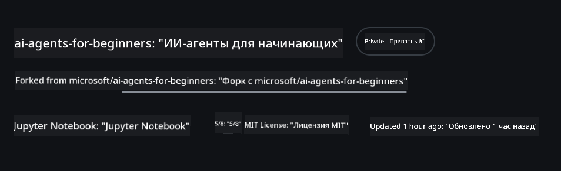
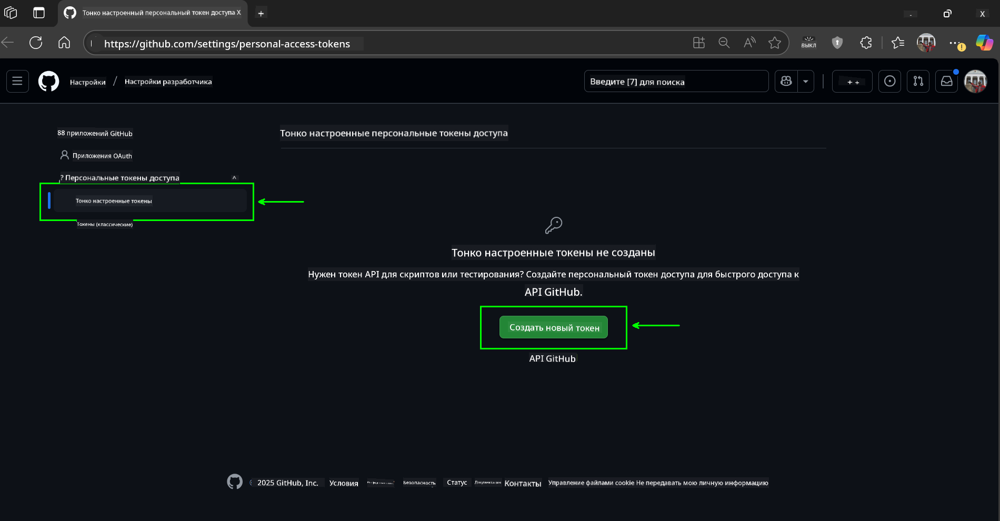
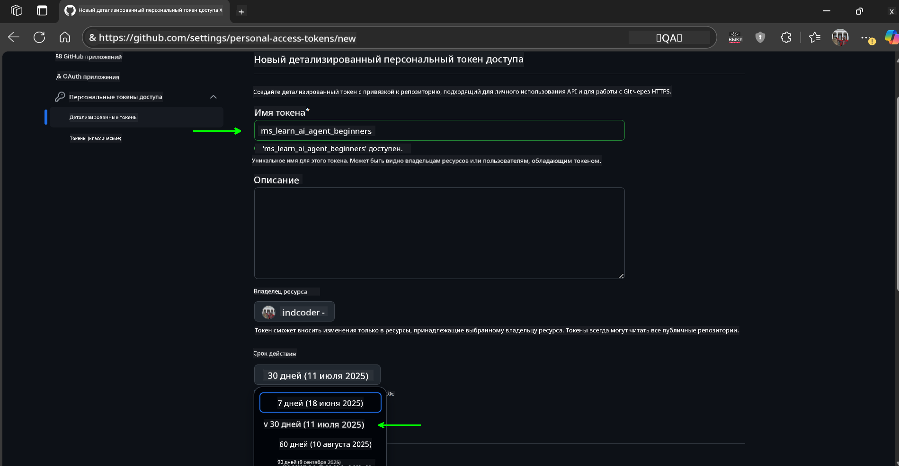
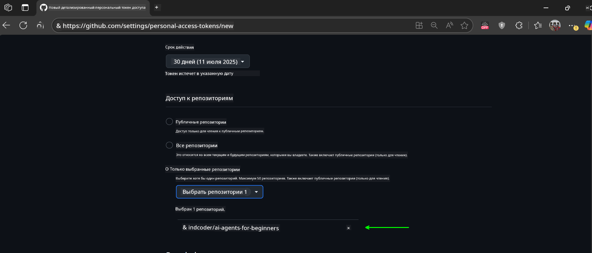
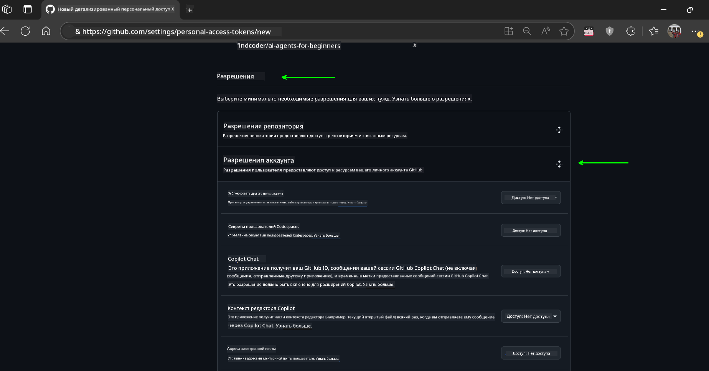
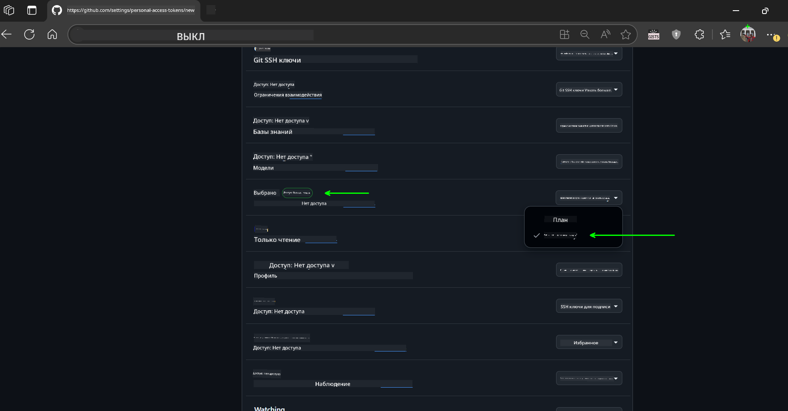
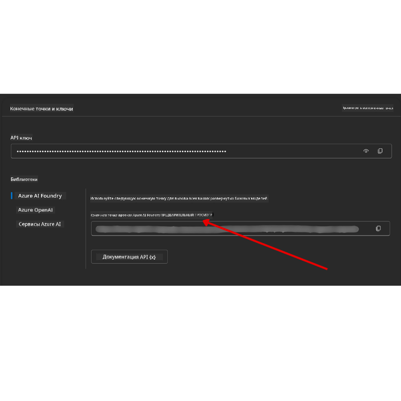

<!--
CO_OP_TRANSLATOR_METADATA:
{
  "original_hash": "c6a79c8f2b56a80370ff7e447765524f",
  "translation_date": "2025-07-23T08:09:37+00:00",
  "source_file": "00-course-setup/README.md",
  "language_code": "ru"
}
-->
# Настройка курса

## Введение

В этом уроке мы рассмотрим, как запускать примеры кода из данного курса.

## Клонируйте или форкните этот репозиторий

Для начала клонируйте или форкните репозиторий на GitHub. Это создаст вашу собственную версию материалов курса, чтобы вы могли запускать, тестировать и изменять код!

Это можно сделать, перейдя по ссылке:



## Запуск кода

В этом курсе представлены серии Jupyter Notebook, которые вы можете запускать, чтобы получить практический опыт в создании AI-агентов.

Примеры кода используют следующие варианты:

**Требуется аккаунт GitHub — бесплатно**:

1) Semantic Kernel Agent Framework + GitHub Models Marketplace. Обозначено как (semantic-kernel.ipynb)  
2) AutoGen Framework + GitHub Models Marketplace. Обозначено как (autogen.ipynb)  

**Требуется подписка Azure**:  
3) Azure AI Foundry + Azure AI Agent Service. Обозначено как (azureaiagent.ipynb)  

Мы рекомендуем попробовать все три типа примеров, чтобы понять, какой из них лучше всего подходит для вас.

Выбранный вами вариант определит, какие шаги настройки вам нужно будет выполнить ниже:

## Требования

- Python 3.12+  
  - **NOTE**: Если у вас не установлен Python 3.12, установите его. Затем создайте виртуальную среду (venv) с использованием python3.12, чтобы гарантировать установку правильных версий из файла requirements.txt.  
- Аккаунт GitHub — для доступа к GitHub Models Marketplace  
- Подписка Azure — для доступа к Azure AI Foundry  
- Аккаунт Azure AI Foundry — для доступа к Azure AI Agent Service  

В корне этого репозитория мы включили файл `requirements.txt`, который содержит все необходимые Python-библиотеки для запуска примеров кода.

Вы можете установить их, выполнив следующую команду в терминале в корневой папке репозитория:

```bash
pip install -r requirements.txt
```  
Мы рекомендуем создать виртуальную среду Python, чтобы избежать конфликтов и проблем.

## Настройка VSCode

Убедитесь, что вы используете правильную версию Python в VSCode.


## Настройка для примеров с использованием GitHub Models

### Шаг 1: Получите ваш персональный токен доступа (PAT) GitHub

Этот курс использует GitHub Models Marketplace, предоставляющий бесплатный доступ к большим языковым моделям (LLM), которые вы будете использовать для создания AI-агентов.

Чтобы использовать GitHub Models, вам нужно создать [персональный токен доступа GitHub](https://docs.github.com/en/authentication/keeping-your-account-and-data-secure/managing-your-personal-access-tokens).

Это можно сделать, перейдя в ваш аккаунт GitHub.

Пожалуйста, следуйте [принципу минимальных привилегий](https://docs.github.com/en/get-started/learning-to-code/storing-your-secrets-safely) при создании токена. Это означает, что вы должны предоставить токену только те разрешения, которые необходимы для выполнения примеров кода в этом курсе.

1. Выберите опцию `Fine-grained tokens` в левой части экрана.

    Затем выберите `Generate new token`.

    

1. Введите описательное имя для вашего токена, которое отражает его назначение, чтобы его было легко идентифицировать позже. Установите срок действия (рекомендуется: 30 дней; вы можете выбрать более короткий срок, например, 7 дней, для большей безопасности).

    

1. Ограничьте область действия токена вашим форком этого репозитория.

    

1. Ограничьте разрешения токена: в разделе **Permissions** включите **Account Permissions**, перейдите к **Models** и включите только доступ для чтения, необходимый для GitHub Models.

    

    

Скопируйте ваш новый токен. Теперь вы добавите его в файл `.env`, включенный в этот курс.

### Шаг 2: Создайте файл `.env`

Чтобы создать файл `.env`, выполните следующую команду в терминале.

```bash
cp .env.example .env
```

Эта команда скопирует пример файла и создаст `.env` в вашем каталоге, где вы заполните значения для переменных окружения.

Скопировав ваш токен, откройте файл `.env` в вашем любимом текстовом редакторе и вставьте токен в поле `GITHUB_TOKEN`.

Теперь вы сможете запускать примеры кода из этого курса.

## Настройка для примеров с использованием Azure AI Foundry и Azure AI Agent Service

### Шаг 1: Получите конечную точку вашего проекта Azure

Следуйте шагам по созданию хаба и проекта в Azure AI Foundry, описанным здесь: [Обзор ресурсов хаба](https://learn.microsoft.com/en-us/azure/ai-foundry/concepts/ai-resources)

После создания проекта вам нужно будет получить строку подключения для вашего проекта.

Это можно сделать, перейдя на страницу **Overview** вашего проекта в портале Azure AI Foundry.



### Шаг 2: Создайте файл `.env`

Чтобы создать файл `.env`, выполните следующую команду в терминале.

```bash
cp .env.example .env
```

Эта команда скопирует пример файла и создаст `.env` в вашем каталоге, где вы заполните значения для переменных окружения.

Скопировав ваш токен, откройте файл `.env` в вашем любимом текстовом редакторе и вставьте токен в поле `PROJECT_ENDPOINT`.

### Шаг 3: Войдите в Azure

В качестве лучшей практики безопасности мы будем использовать [аутентификацию без ключей](https://learn.microsoft.com/azure/developer/ai/keyless-connections?tabs=csharp%2Cazure-cli?WT.mc_id=academic-105485-koreyst) для аутентификации в Azure OpenAI с помощью Microsoft Entra ID.

Откройте терминал и выполните команду `az login --use-device-code`, чтобы войти в ваш аккаунт Azure.

После входа выберите вашу подписку в терминале.

## Дополнительные переменные окружения — Azure Search и Azure OpenAI

Для урока Agentic RAG (Урок 5) есть примеры, использующие Azure Search и Azure OpenAI.

Если вы хотите запустить эти примеры, вам нужно будет добавить следующие переменные окружения в ваш файл `.env`:

### Страница Overview (Проект)

- `AZURE_SUBSCRIPTION_ID` — Проверьте **Project details** на странице **Overview** вашего проекта.

- `AZURE_AI_PROJECT_NAME` — Посмотрите в верхней части страницы **Overview** вашего проекта.

- `AZURE_OPENAI_SERVICE` — Найдите это на вкладке **Included capabilities** для **Azure OpenAI Service** на странице **Overview**.

### Центр управления

- `AZURE_OPENAI_RESOURCE_GROUP` — Перейдите в **Project properties** на странице **Overview** в **Management Center**.

- `GLOBAL_LLM_SERVICE` — В разделе **Connected resources** найдите имя подключения **Azure AI Services**. Если не указано, проверьте **Azure portal** в вашей группе ресурсов для имени ресурса AI Services.

### Страница Models + Endpoints

- `AZURE_OPENAI_EMBEDDING_DEPLOYMENT_NAME` — Выберите вашу модель встраивания (например, `text-embedding-ada-002`) и запишите **Deployment name** из деталей модели.

- `AZURE_OPENAI_CHAT_DEPLOYMENT_NAME` — Выберите вашу модель чата (например, `gpt-4o-mini`) и запишите **Deployment name** из деталей модели.

### Портал Azure

- `AZURE_OPENAI_ENDPOINT` — Найдите **Azure AI services**, нажмите на него, затем перейдите в **Resource Management**, **Keys and Endpoint**, прокрутите вниз до "Azure OpenAI endpoints" и скопируйте тот, который указан как "Language APIs".

- `AZURE_OPENAI_API_KEY` — На той же странице скопируйте KEY 1 или KEY 2.

- `AZURE_SEARCH_SERVICE_ENDPOINT` — Найдите ваш ресурс **Azure AI Search**, нажмите на него и посмотрите **Overview**.

- `AZURE_SEARCH_API_KEY` — Затем перейдите в **Settings**, затем **Keys**, чтобы скопировать основной или вторичный ключ администратора.

### Внешняя страница

- `AZURE_OPENAI_API_VERSION` — Посетите страницу [API version lifecycle](https://learn.microsoft.com/en-us/azure/ai-services/openai/api-version-deprecation#latest-ga-api-release) в разделе **Latest GA API release**.

### Настройка аутентификации без ключей

Вместо того чтобы жестко кодировать ваши учетные данные, мы будем использовать подключение без ключей с Azure OpenAI. Для этого мы импортируем `DefaultAzureCredential` и позже вызовем функцию `DefaultAzureCredential`, чтобы получить учетные данные.

```python
from azure.identity import DefaultAzureCredential, InteractiveBrowserCredential
```

## Застряли?

Если у вас возникли проблемы с настройкой, присоединяйтесь к нашему

## Следующий урок

Теперь вы готовы запускать код для этого курса. Удачи в изучении мира AI-агентов!

[Введение в AI-агентов и их применение](../01-intro-to-ai-agents/README.md)

**Отказ от ответственности**:  
Этот документ был переведен с использованием сервиса автоматического перевода [Co-op Translator](https://github.com/Azure/co-op-translator). Несмотря на наши усилия обеспечить точность, автоматические переводы могут содержать ошибки или неточности. Оригинальный документ на его родном языке следует считать авторитетным источником. Для получения критически важной информации рекомендуется профессиональный перевод человеком. Мы не несем ответственности за любые недоразумения или неправильные интерпретации, возникшие в результате использования данного перевода.