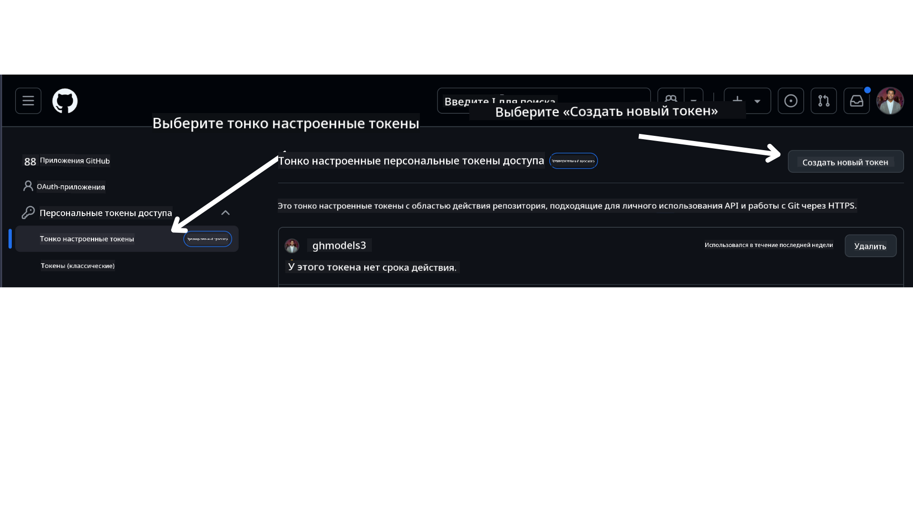

<!--
CO_OP_TRANSLATOR_METADATA:
{
  "original_hash": "76945069b52a49cd0432ae3e0b0ba22e",
  "translation_date": "2025-07-12T07:43:04+00:00",
  "source_file": "00-course-setup/README.md",
  "language_code": "ru"
}
-->
в вашем аккаунте GitHub.

Выберите опцию `Fine-grained tokens` в левой части экрана.

Затем нажмите `Generate new token`.



Вам будет предложено ввести имя для вашего токена, выбрать срок его действия (рекомендуется: 30 дней) и указать области доступа для токена (Public Repositories).

Также необходимо отредактировать разрешения для этого токена: Permissions -> Models -> Разрешить доступ к GitHub Models.

Скопируйте созданный токен. Теперь добавьте его в файл `.env`, который входит в состав этого курса.

### Шаг 2: Создайте файл `.env`

Для создания файла `.env` выполните следующую команду в терминале.

```bash
cp .env.example .env
```

Это скопирует пример файла и создаст `.env` в вашей директории, где вы сможете заполнить значения переменных окружения.

Скопировав токен, откройте файл `.env` в любимом текстовом редакторе и вставьте токен в поле `GITHUB_TOKEN`.

Теперь вы можете запускать примеры кода из этого курса.

## Настройка для примеров с использованием Azure AI Foundry и Azure AI Agent Service

### Шаг 1: Получите конечную точку вашего проекта Azure

Следуйте инструкциям по созданию хаба и проекта в Azure AI Foundry, описанным здесь: [Обзор ресурсов хаба](https://learn.microsoft.com/en-us/azure/ai-foundry/concepts/ai-resources)

После создания проекта вам нужно получить строку подключения к проекту.

Это можно сделать на странице **Overview** вашего проекта в портале Azure AI Foundry.


### Шаг 2: Создайте файл `.env`

Для создания файла `.env` выполните следующую команду в терминале.

```bash
cp .env.example .env
```

Это скопирует пример файла и создаст `.env` в вашей директории, где вы сможете заполнить значения переменных окружения.

Скопировав строку подключения, откройте файл `.env` в любимом текстовом редакторе и вставьте её в поле `PROJECT_ENDPOINT`.

### Шаг 3: Войдите в Azure

В целях безопасности мы будем использовать [аутентификацию без ключей](https://learn.microsoft.com/azure/developer/ai/keyless-connections?tabs=csharp%2Cazure-cli?WT.mc_id=academic-105485-koreyst) для подключения к Azure OpenAI через Microsoft Entra ID. Для этого сначала установите **Azure CLI** согласно [инструкциям по установке](https://learn.microsoft.com/cli/azure/install-azure-cli?WT.mc_id=academic-105485-koreyst) для вашей операционной системы.

Затем откройте терминал и выполните команду `az login --use-device-code` для входа в ваш аккаунт Azure.

После входа выберите вашу подписку в терминале.

## Дополнительные переменные окружения — Azure Search и Azure OpenAI

Для урока Agentic RAG — Урок 5 — есть примеры, использующие Azure Search и Azure OpenAI.

Если вы хотите запускать эти примеры, добавьте следующие переменные окружения в ваш файл `.env`:

### Страница обзора (проект)

- `AZURE_SUBSCRIPTION_ID` — смотрите **Project details** на странице **Overview** вашего проекта.

- `AZURE_AI_PROJECT_NAME` — находится в верхней части страницы **Overview** вашего проекта.

- `AZURE_OPENAI_SERVICE` — найдите во вкладке **Included capabilities** для **Azure OpenAI Service** на странице **Overview**.

### Центр управления

- `AZURE_OPENAI_RESOURCE_GROUP` — смотрите **Project properties** на странице **Overview** в **Management Center**.

- `GLOBAL_LLM_SERVICE` — в разделе **Connected resources** найдите имя подключения **Azure AI Services**. Если не указано, проверьте в **Azure portal** в вашей группе ресурсов имя ресурса AI Services.

### Страница моделей и конечных точек

- `AZURE_OPENAI_EMBEDDING_DEPLOYMENT_NAME` — выберите модель для встраивания (например, `text-embedding-ada-002`) и запомните **Deployment name** из деталей модели.

- `AZURE_OPENAI_CHAT_DEPLOYMENT_NAME` — выберите чат-модель (например, `gpt-4o-mini`) и запомните **Deployment name** из деталей модели.

### Портал Azure

- `AZURE_OPENAI_ENDPOINT` — найдите **Azure AI services**, кликните по нему, затем перейдите в **Resource Management**, **Keys and Endpoint**, прокрутите вниз до раздела "Azure OpenAI endpoints" и скопируйте адрес, указанный как "Language APIs".

- `AZURE_OPENAI_API_KEY` — на той же странице скопируйте KEY 1 или KEY 2.

- `AZURE_SEARCH_SERVICE_ENDPOINT` — найдите ресурс **Azure AI Search**, кликните по нему и перейдите в раздел **Overview**.

- `AZURE_SEARCH_API_KEY` — затем перейдите в **Settings**, затем **Keys** и скопируйте основной или дополнительный ключ администратора.

### Внешняя веб-страница

- `AZURE_OPENAI_API_VERSION` — посетите страницу [API version lifecycle](https://learn.microsoft.com/en-us/azure/ai-services/openai/api-version-deprecation#latest-ga-api-release) в разделе **Latest GA API release**.

### Настройка аутентификации без ключей

Вместо того чтобы жестко прописывать ваши учетные данные, мы будем использовать подключение без ключей с Azure OpenAI. Для этого импортируем `DefaultAzureCredential` и позже вызовем функцию `DefaultAzureCredential` для получения учетных данных.

```python
from azure.identity import DefaultAzureCredential, InteractiveBrowserCredential
```

## Застряли?

Если у вас возникли проблемы с настройкой, присоединяйтесь к нашему

или

.

## Следующий урок

Теперь вы готовы запускать код этого курса. Желаем успехов в изучении мира AI-агентов!

[Введение в AI-агентов и примеры использования агентов](../01-intro-to-ai-agents/README.md)

**Отказ от ответственности**:  
Этот документ был переведен с помощью сервиса автоматического перевода [Co-op Translator](https://github.com/Azure/co-op-translator). Несмотря на наши усилия по обеспечению точности, просим учитывать, что автоматический перевод может содержать ошибки или неточности. Оригинальный документ на его исходном языке следует считать авторитетным источником. Для получения критически важной информации рекомендуется обращаться к профессиональному переводу, выполненному человеком. Мы не несем ответственности за любые недоразумения или неправильные толкования, возникшие в результате использования данного перевода.