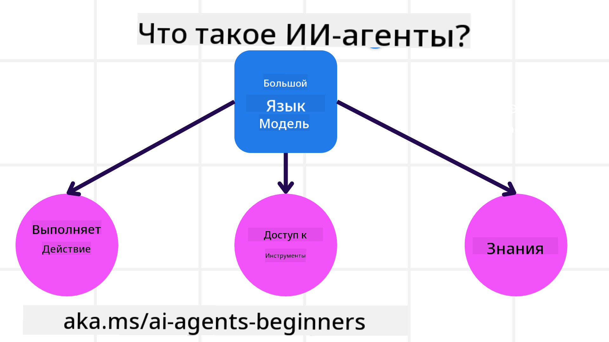
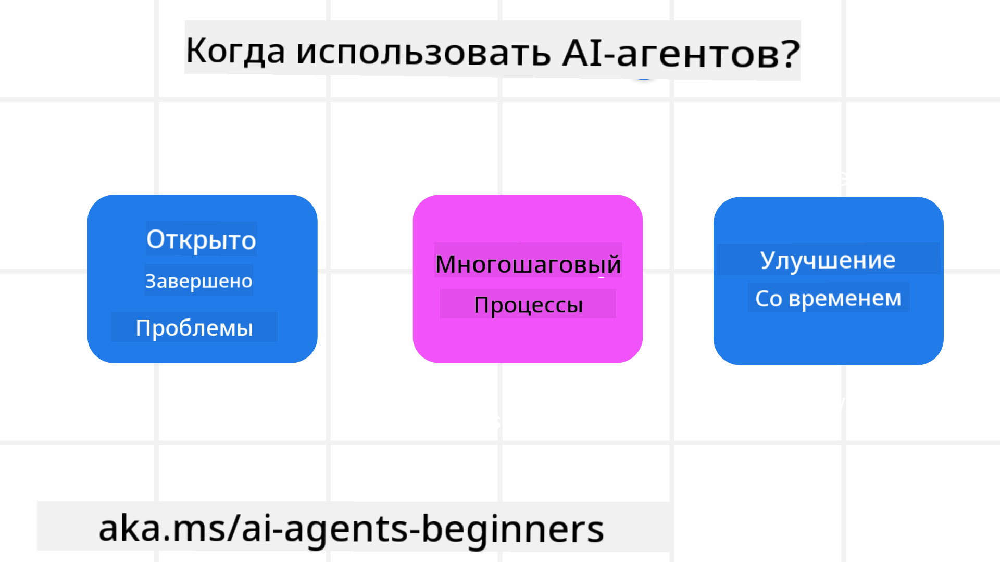

<!--
CO_OP_TRANSLATOR_METADATA:
{
  "original_hash": "d84943abc8f001ad4670418d32c2d899",
  "translation_date": "2025-07-12T08:01:00+00:00",
  "source_file": "01-intro-to-ai-agents/README.md",
  "language_code": "ru"
}
-->
встретиться с другими учащимися и разработчиками AI-агентов, а также задать любые вопросы по этому курсу.

Для начала курса мы сначала лучше разберёмся, что такое AI-агенты и как мы можем использовать их в приложениях и рабочих процессах, которые создаём.

## Введение

В этом уроке рассматриваются:

- Что такое AI-агенты и какие бывают типы агентов?
- Для каких задач AI-агенты подходят лучше всего и как они могут нам помочь?
- Какие базовые компоненты используются при проектировании агентных решений?

## Цели обучения
После прохождения этого урока вы сможете:

- Понимать концепции AI-агентов и чем они отличаются от других AI-решений.
- Эффективно применять AI-агентов.
- Продуктивно проектировать агентные решения как для пользователей, так и для клиентов.

## Определение AI-агентов и типы AI-агентов

### Что такое AI-агенты?

AI-агенты — это **системы**, которые позволяют **Большим Языковым Моделям (LLM)** **выполнять действия**, расширяя их возможности за счёт предоставления LLM **доступа к инструментам** и **знаниям**.

Давайте разберём это определение на части:

- **Система** — важно рассматривать агентов не как отдельный компонент, а как систему из множества компонентов. На базовом уровне компоненты AI-агента включают:
  - **Окружение** — определённое пространство, в котором работает AI-агент. Например, если у нас есть AI-агент для бронирования путешествий, окружением может быть система бронирования, которую агент использует для выполнения задач.
  - **Датчики** — окружение содержит информацию и предоставляет обратную связь. AI-агенты используют датчики для сбора и интерпретации информации о текущем состоянии окружения. В примере с агентом по бронированию путешествий система бронирования может предоставлять данные о доступности отелей или ценах на авиабилеты.
  - **Исполнители (актуаторы)** — получив текущее состояние окружения, агент определяет, какое действие нужно выполнить для изменения окружения. Для агента по бронированию путешествий это может быть бронирование доступного номера для пользователя.

**Большие Языковые Модели** — концепция агентов существовала и до появления LLM. Преимущество создания AI-агентов с помощью LLM — их способность интерпретировать человеческий язык и данные. Это позволяет LLM анализировать информацию об окружении и формировать план для изменения окружения.

**Выполнение действий** — вне систем AI-агентов LLM ограничены задачами генерации контента или информации на основе запроса пользователя. В системах AI-агентов LLM могут выполнять задачи, интерпретируя запрос пользователя и используя доступные в окружении инструменты.

**Доступ к инструментам** — инструменты, к которым имеет доступ LLM, определяются 1) окружением, в котором он работает, и 2) разработчиком AI-агента. В примере с агентом по путешествиям инструменты агента ограничены операциями, доступными в системе бронирования, и/или разработчик может ограничить доступ агента только к бронированию авиабилетов.

**Память и знания** — память может быть кратковременной в контексте диалога между пользователем и агентом. В долгосрочной перспективе, помимо информации из окружения, AI-агенты могут получать знания из других систем, сервисов, инструментов и даже других агентов. В примере с агентом по путешествиям это могут быть данные о предпочтениях пользователя, хранящиеся в базе клиентов.

### Различные типы агентов

Теперь, когда у нас есть общее определение AI-агентов, рассмотрим конкретные типы агентов и как они применяются на примере агента по бронированию путешествий.

| **Тип агента**                | **Описание**                                                                                                                       | **Пример**                                                                                                                                                                                                                   |
| ----------------------------- | ------------------------------------------------------------------------------------------------------------------------------------- | ----------------------------------------------------------------------------------------------------------------------------------------------------------------------------------------------------------------------------- |
| **Простые рефлексные агенты**      | Выполняют немедленные действия на основе заранее заданных правил.                                                                                  | Агент по путешествиям интерпретирует контекст письма и перенаправляет жалобы по путешествиям в службу поддержки.                                                                                                                          |
| **Модельно-рефлексные агенты** | Выполняют действия на основе модели мира и изменений в этой модели.                                                              | Агент по путешествиям приоритизирует маршруты с существенными изменениями цен, используя доступ к историческим данным о ценах.                                                                                                             |
| **Агенты, ориентированные на цель**         | Создают планы для достижения конкретных целей, интерпретируя цель и определяя действия для её достижения.                                  | Агент по путешествиям бронирует поездку, определяя необходимые транспортные средства (автомобиль, общественный транспорт, авиарейсы) от текущего местоположения до пункта назначения.                                                                                |
| **Агенты, ориентированные на полезность**      | Учитывают предпочтения и численно оценивают компромиссы для достижения целей.                                               | Агент по путешествиям максимизирует полезность, взвешивая удобство и стоимость при бронировании.                                                                                                                                          |
| **Обучающиеся агенты**           | Улучшаются со временем, реагируя на обратную связь и корректируя действия.                                                        | Агент по путешествиям совершенствуется, используя отзывы клиентов из опросов после поездок для улучшения будущих бронирований.                                                                                                               |
| **Иерархические агенты**       | Включают несколько агентов в многоуровневой системе, где агенты высокого уровня разбивают задачи на подзадачи для агентов низкого уровня. | Агент по путешествиям отменяет поездку, разбивая задачу на подзадачи (например, отмена конкретных бронирований) и поручая их выполнение агентам низкого уровня с последующим отчётом агенту высокого уровня.                                     |
| **Многоагентные системы (MAS)** | Агенты выполняют задачи независимо, сотрудничая или конкурируя.                                                           | Сотрудничество: несколько агентов бронируют разные услуги — отели, авиабилеты, развлечения. Конкуренция: несколько агентов управляют и конкурируют за бронирование в общем календаре отеля. |

## Когда использовать AI-агентов

В предыдущем разделе мы использовали пример агента по бронированию путешествий, чтобы показать, как разные типы агентов применяются в различных сценариях бронирования. Мы продолжим использовать этот пример на протяжении всего курса.

Рассмотрим типы задач, для которых AI-агенты подходят лучше всего:

- **Задачи с открытым исходом** — когда LLM самостоятельно определяет необходимые шаги для выполнения задачи, так как их нельзя заранее жёстко запрограммировать в рабочем процессе.
- **Многошаговые процессы** — задачи, требующие определённой сложности, когда агенту нужно использовать инструменты или информацию на протяжении нескольких шагов, а не получать всё сразу.
- **Улучшение со временем** — задачи, где агент может совершенствоваться, получая обратную связь от окружения или пользователей для повышения полезности.

Более подробно о нюансах использования AI-агентов мы расскажем в уроке «Создание надёжных AI-агентов».

## Основы агентных решений

### Разработка агента

Первый шаг в проектировании системы AI-агента — определить инструменты, действия и поведение. В этом курсе мы сосредоточимся на использовании **Azure AI Agent Service** для определения наших агентов. Он предлагает такие возможности, как:

- Выбор открытых моделей, например OpenAI, Mistral и Llama
- Использование лицензированных данных от провайдеров, таких как Tripadvisor
- Использование стандартизированных инструментов OpenAPI 3.0

### Агентные паттерны

Взаимодействие с LLM происходит через подсказки (prompts). Из-за полуавтономного характера AI-агентов не всегда возможно или нужно вручную повторно отправлять подсказки после изменения окружения. Мы используем **агентные паттерны**, которые позволяют более масштабируемо направлять LLM через несколько шагов.

Этот курс разделён на несколько популярных на сегодняшний день агентных паттернов.

### Агентные фреймворки

Агентные фреймворки позволяют разработчикам реализовывать агентные паттерны через код. Эти фреймворки предлагают шаблоны, плагины и инструменты для улучшения взаимодействия AI-агентов. Это даёт возможности для лучшей наблюдаемости и отладки систем AI-агентов.

В этом курсе мы изучим исследовательский фреймворк AutoGen и готовый к производству Agent framework от Semantic Kernel.

## Предыдущий урок

[Настройка курса](../00-course-setup/README.md)

## Следующий урок

[Изучение агентных фреймворков](../02-explore-agentic-frameworks/README.md)

**Отказ от ответственности**:  
Этот документ был переведен с помощью сервиса автоматического перевода [Co-op Translator](https://github.com/Azure/co-op-translator). Несмотря на наши усилия по обеспечению точности, просим учитывать, что автоматический перевод может содержать ошибки или неточности. Оригинальный документ на его исходном языке следует считать авторитетным источником. Для получения критически важной информации рекомендуется обращаться к профессиональному переводу, выполненному человеком. Мы не несем ответственности за любые недоразумения или неправильные толкования, возникшие в результате использования данного перевода.