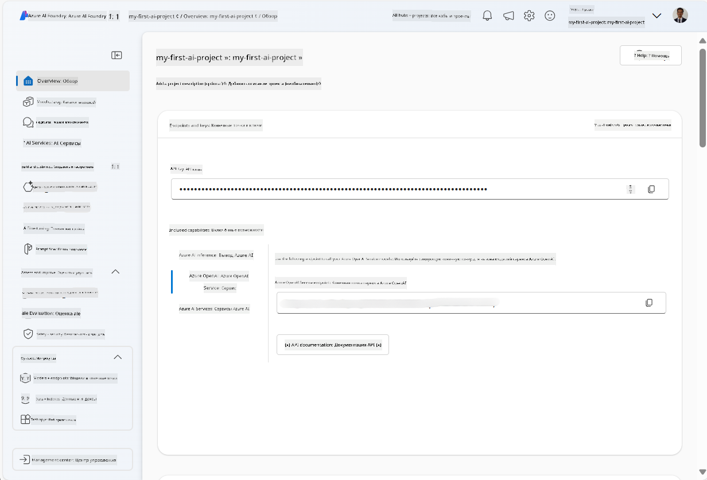
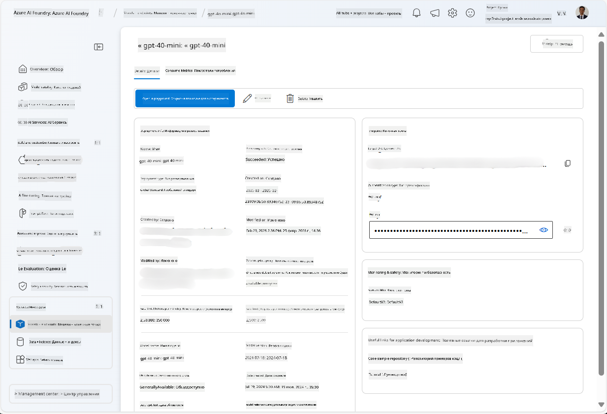
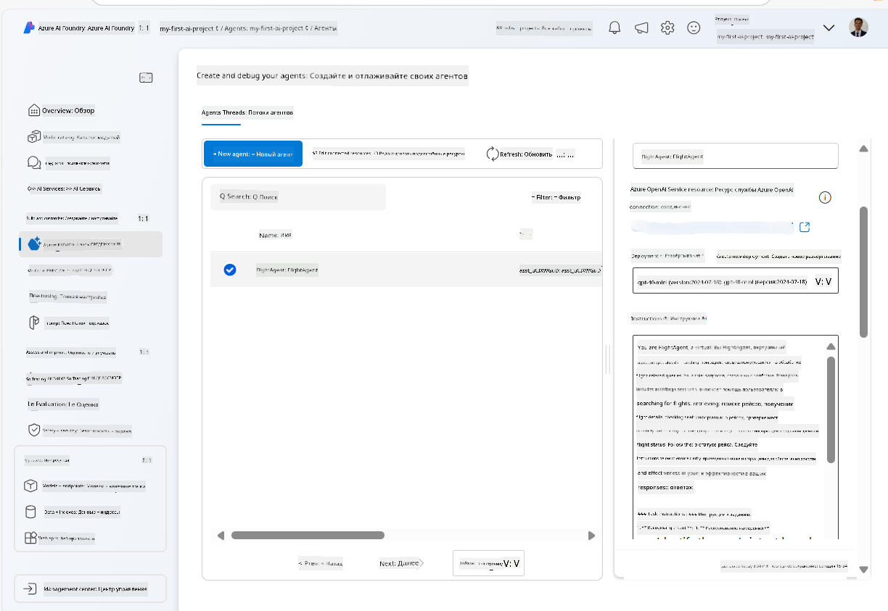
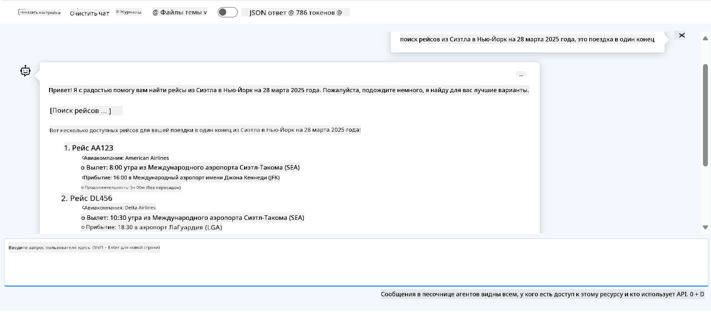

<!--
CO_OP_TRANSLATOR_METADATA:
{
  "original_hash": "7e92870dc0843e13d4dabc620c09d2d9",
  "translation_date": "2025-07-12T08:15:09+00:00",
  "source_file": "02-explore-agentic-frameworks/azure-ai-foundry-agent-creation.md",
  "language_code": "ru"
}
-->
# Разработка сервиса Azure AI Agent

В этом упражнении вы используете инструменты сервиса Azure AI Agent в [портале Azure AI Foundry](https://ai.azure.com/?WT.mc_id=academic-105485-koreyst) для создания агента для бронирования авиабилетов. Агент сможет взаимодействовать с пользователями и предоставлять информацию о рейсах.

## Требования

Для выполнения этого упражнения вам потребуется:
1. Аккаунт Azure с активной подпиской. [Создать аккаунт бесплатно](https://azure.microsoft.com/free/?WT.mc_id=academic-105485-koreyst).
2. Права на создание хаба Azure AI Foundry или уже созданный для вас хаб.
    - Если ваша роль — Contributor или Owner, вы можете следовать шагам этого руководства.

## Создание хаба Azure AI Foundry

> **Note:** Ранее Azure AI Foundry назывался Azure AI Studio.

1. Следуйте инструкциям из [блога Azure AI Foundry](https://learn.microsoft.com/en-us/azure/ai-studio/?WT.mc_id=academic-105485-koreyst) по созданию хаба Azure AI Foundry.
2. После создания проекта закройте все подсказки и ознакомьтесь со страницей проекта в портале Azure AI Foundry, которая должна выглядеть примерно так:

    

## Развертывание модели

1. В левой панели вашего проекта в разделе **My assets** выберите страницу **Models + endpoints**.
2. На странице **Models + endpoints** во вкладке **Model deployments** в меню **+ Deploy model** выберите **Deploy base model**.
3. Найдите модель `gpt-4o-mini` в списке, выберите её и подтвердите развертывание.

    > **Note**: Снижение TPM помогает избежать чрезмерного использования квоты в вашей подписке.

    

## Создание агента

Теперь, когда модель развернута, можно создать агента. Агент — это модель разговорного ИИ, которая может взаимодействовать с пользователями.

1. В левой панели вашего проекта в разделе **Build & Customize** выберите страницу **Agents**.
2. Нажмите **+ Create agent** для создания нового агента. В диалоговом окне **Agent Setup**:
    - Введите имя агента, например `FlightAgent`.
    - Убедитесь, что выбрана модель `gpt-4o-mini`, которую вы развернули ранее.
    - Установите **Instructions** согласно тому, как вы хотите, чтобы агент работал. Вот пример:
    ```
    You are FlightAgent, a virtual assistant specialized in handling flight-related queries. Your role includes assisting users with searching for flights, retrieving flight details, checking seat availability, and providing real-time flight status. Follow the instructions below to ensure clarity and effectiveness in your responses:

    ### Task Instructions:
    1. **Recognizing Intent**:
       - Identify the user's intent based on their request, focusing on one of the following categories:
         - Searching for flights
         - Retrieving flight details using a flight ID
         - Checking seat availability for a specified flight
         - Providing real-time flight status using a flight number
       - If the intent is unclear, politely ask users to clarify or provide more details.
        
    2. **Processing Requests**:
        - Depending on the identified intent, perform the required task:
        - For flight searches: Request details such as origin, destination, departure date, and optionally return date.
        - For flight details: Request a valid flight ID.
        - For seat availability: Request the flight ID and date and validate inputs.
        - For flight status: Request a valid flight number.
        - Perform validations on provided data (e.g., formats of dates, flight numbers, or IDs). If the information is incomplete or invalid, return a friendly request for clarification.

    3. **Generating Responses**:
    - Use a tone that is friendly, concise, and supportive.
    - Provide clear and actionable suggestions based on the output of each task.
    - If no data is found or an error occurs, explain it to the user gently and offer alternative actions (e.g., refine search, try another query).
    
    ```
> [!NOTE]
> Для подробного промпта вы можете ознакомиться с [этим репозиторием](https://github.com/ShivamGoyal03/RoamMind) для дополнительной информации.
    
> Кроме того, вы можете добавить **Knowledge Base** и **Actions**, чтобы расширить возможности агента, позволяя ему предоставлять больше информации и выполнять автоматические задачи по запросам пользователей. Для этого упражнения эти шаги можно пропустить.
    


3. Чтобы создать нового мульти-ИИ агента, просто нажмите **New Agent**. Новый агент появится на странице Agents.

## Тестирование агента

После создания агента вы можете проверить, как он отвечает на запросы пользователей в песочнице портала Azure AI Foundry.

1. В верхней части панели **Setup** вашего агента выберите **Try in playground**.
2. В панели **Playground** вы можете взаимодействовать с агентом, вводя запросы в чат. Например, попросите агента найти рейсы из Сиэтла в Нью-Йорк на 28-е число.

    > **Note**: Агент может не давать точных ответов, так как в этом упражнении не используется актуальная информация в реальном времени. Цель — проверить способность агента понимать и отвечать на запросы на основе заданных инструкций.

    

3. После тестирования агента вы можете дополнительно настроить его, добавив больше интентов, обучающих данных и действий для расширения его возможностей.

## Очистка ресурсов

После завершения тестирования агента вы можете удалить его, чтобы избежать дополнительных затрат.
1. Откройте [Azure портал](https://portal.azure.com) и перейдите к группе ресурсов, где вы развернули хаб, используемый в этом упражнении.
2. На панели инструментов выберите **Delete resource group**.
3. Введите имя группы ресурсов и подтвердите удаление.

## Ресурсы

- [Документация Azure AI Foundry](https://learn.microsoft.com/en-us/azure/ai-studio/?WT.mc_id=academic-105485-koreyst)
- [Портал Azure AI Foundry](https://ai.azure.com/?WT.mc_id=academic-105485-koreyst)
- [Начало работы с Azure AI Studio](https://techcommunity.microsoft.com/blog/educatordeveloperblog/getting-started-with-azure-ai-studio/4095602?WT.mc_id=academic-105485-koreyst)
- [Основы агентов ИИ в Azure](https://learn.microsoft.com/en-us/training/modules/ai-agent-fundamentals/?WT.mc_id=academic-105485-koreyst)
- [Azure AI Discord](https://aka.ms/AzureAI/Discord)

**Отказ от ответственности**:  
Этот документ был переведен с помощью сервиса автоматического перевода [Co-op Translator](https://github.com/Azure/co-op-translator). Несмотря на наши усилия по обеспечению точности, просим учитывать, что автоматический перевод может содержать ошибки или неточности. Оригинальный документ на его исходном языке следует считать авторитетным источником. Для получения критически важной информации рекомендуется обращаться к профессиональному переводу, выполненному человеком. Мы не несем ответственности за любые недоразумения или неправильные толкования, возникшие в результате использования данного перевода.