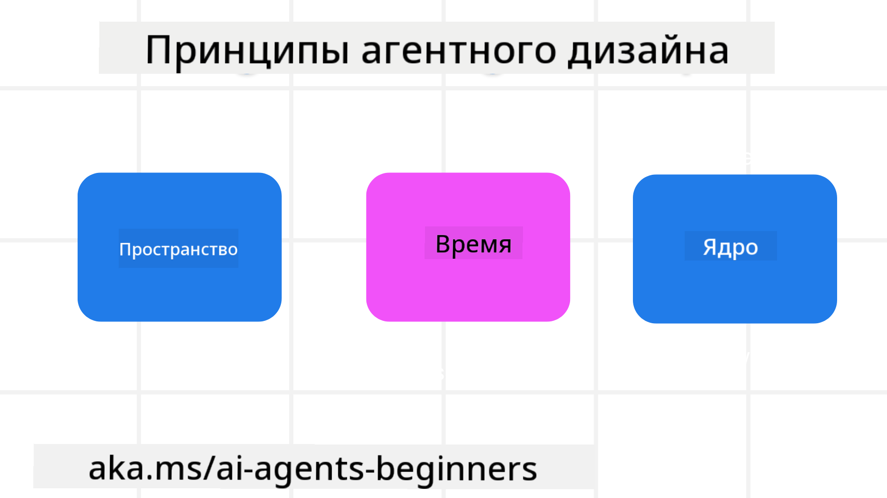

<!--
CO_OP_TRANSLATOR_METADATA:
{
  "original_hash": "4c46e4ff9e349c521e2b0b17f51afa64",
  "translation_date": "2025-08-29T12:31:23+00:00",
  "source_file": "03-agentic-design-patterns/README.md",
  "language_code": "ru"
}
-->

> _(Нажмите на изображение выше, чтобы посмотреть видео к этому уроку)_
# Принципы проектирования агентных систем ИИ

## Введение

Существует множество подходов к созданию агентных систем ИИ. Учитывая, что неоднозначность является особенностью, а не ошибкой в дизайне генеративного ИИ, инженерам иногда сложно понять, с чего начать. Мы разработали набор принципов проектирования UX, ориентированных на человека, чтобы помочь разработчикам создавать агентные системы, ориентированные на клиентов, для решения их бизнес-задач. Эти принципы проектирования не являются строгой архитектурой, а скорее отправной точкой для команд, которые определяют и разрабатывают агентные взаимодействия.

В общем, агенты должны:

- Расширять и масштабировать человеческие возможности (мозговой штурм, решение проблем, автоматизация и т. д.)
- Заполнять пробелы в знаниях (помогать быстро освоить новые области знаний, перевод и т. д.)
- Способствовать и поддерживать сотрудничество так, как нам, как индивидуумам, удобно работать с другими
- Делать нас лучшими версиями самих себя (например, коуч по жизни/организатор задач, помощь в освоении навыков эмоциональной регуляции и осознанности, развитие устойчивости и т. д.)

## В этом уроке мы рассмотрим

- Что такое принципы проектирования агентных систем
- Какие рекомендации следует учитывать при реализации этих принципов
- Примеры использования принципов проектирования

## Цели обучения

После завершения этого урока вы сможете:

1. Объяснить, что такое принципы проектирования агентных систем
2. Объяснить рекомендации по использованию принципов проектирования агентных систем
3. Понять, как создать агента, используя принципы проектирования агентных систем

## Принципы проектирования агентных систем

### Агент (Пространство)

Это среда, в которой действует агент. Эти принципы определяют, как мы проектируем агентов для взаимодействия в физическом и цифровом мирах.

- **Соединять, а не разъединять** – помогать людям находить связь с другими людьми, событиями и полезной информацией для содействия сотрудничеству и взаимодействию.
- Агенты помогают соединять события, знания и людей.
- Агенты сближают людей. Они не предназначены для замены или принижения людей.
- **Легкодоступный, но иногда невидимый** – агент в основном работает в фоновом режиме и вмешивается только тогда, когда это уместно и необходимо.
  - Агент легко обнаруживается и доступен для авторизованных пользователей на любом устройстве или платформе.
  - Агент поддерживает мультимодальные входные и выходные данные (звук, голос, текст и т. д.).
  - Агент может бесшовно переключаться между передним и фоновым режимами; между проактивным и реактивным поведением в зависимости от потребностей пользователя.
  - Агент может работать в невидимой форме, но его процесс в фоновом режиме и взаимодействие с другими агентами прозрачны и контролируемы пользователем.

### Агент (Время)

Это то, как агент действует во времени. Эти принципы определяют, как мы проектируем агентов для взаимодействия с прошлым, настоящим и будущим.

- **Прошлое**: Анализ истории, включая состояние и контекст.
  - Агент предоставляет более релевантные результаты на основе анализа более богатых исторических данных, а не только событий, людей или состояний.
  - Агент создает связи с прошлыми событиями и активно использует память для взаимодействия с текущими ситуациями.
- **Настоящее**: Подталкивать, а не просто уведомлять.
  - Агент использует комплексный подход к взаимодействию с людьми. Когда происходит событие, агент выходит за рамки статического уведомления или формальности. Он может упрощать процессы или динамически генерировать подсказки, чтобы привлечь внимание пользователя в нужный момент.
  - Агент предоставляет информацию, учитывая контекст, социальные и культурные изменения, а также намерения пользователя.
  - Взаимодействие с агентом может быть постепенным, развивающимся и усложняющимся со временем, чтобы дать пользователю больше возможностей.
- **Будущее**: Адаптация и эволюция.
  - Агент адаптируется к различным устройствам, платформам и способам взаимодействия.
  - Агент подстраивается под поведение пользователя, его потребности в доступности и свободно настраивается.
  - Агент формируется и развивается через постоянное взаимодействие с пользователем.

### Агент (Ядро)

Это ключевые элементы в основе дизайна агента.

- **Принимать неопределенность, но устанавливать доверие**.
  - Определенный уровень неопределенности агента ожидаем. Неопределенность – это ключевой элемент дизайна агента.
  - Доверие и прозрачность – это фундаментальные слои дизайна агента.
  - Пользователь контролирует, когда агент включен/выключен, и статус агента всегда четко виден.

## Рекомендации по реализации этих принципов

При использовании вышеуказанных принципов проектирования следуйте следующим рекомендациям:

1. **Прозрачность**: Информируйте пользователя о том, что используется ИИ, как он работает (включая прошлые действия), и как давать обратную связь и изменять систему.
2. **Контроль**: Позвольте пользователю настраивать, задавать предпочтения и персонализировать систему, а также контролировать ее атрибуты (включая возможность забывать данные).
3. **Последовательность**: Стремитесь к последовательному мультимодальному опыту на всех устройствах и точках взаимодействия. Используйте знакомые элементы интерфейса, где это возможно (например, значок микрофона для голосового взаимодействия), и минимизируйте когнитивную нагрузку пользователя (например, предоставляйте лаконичные ответы, визуальные подсказки и контент «Узнать больше»).

## Как разработать туристического агента, используя эти принципы и рекомендации

Представьте, что вы разрабатываете туристического агента. Вот как можно использовать принципы проектирования и рекомендации:

1. **Прозрачность** – Сообщите пользователю, что туристический агент работает на основе ИИ. Предоставьте базовые инструкции по началу работы (например, сообщение «Привет», примеры запросов). Четко укажите это на странице продукта. Покажите список запросов, которые пользователь задавал ранее. Объясните, как оставить отзыв (например, кнопки «палец вверх» и «палец вниз», кнопка «Отправить отзыв»). Уточните, если у агента есть ограничения по использованию или темам.
2. **Контроль** – Убедитесь, что пользователю понятно, как можно изменить агента после его создания, например, с помощью системного запроса. Позвольте пользователю выбирать, насколько подробным должен быть агент, его стиль письма и темы, которых агент должен избегать. Дайте возможность просматривать и удалять связанные файлы, данные, запросы и прошлые беседы.
3. **Последовательность** – Убедитесь, что значки для функций, таких как «Поделиться запросом», добавление файла или фото, а также упоминание кого-либо или чего-либо, стандартны и узнаваемы. Используйте значок скрепки для обозначения загрузки/обмена файлами с агентом и значок изображения для загрузки графики.

### Есть вопросы о шаблонах проектирования агентных систем ИИ?

Присоединяйтесь к [Azure AI Foundry Discord](https://aka.ms/ai-agents/discord), чтобы встретиться с другими учащимися, посетить часы консультаций и получить ответы на свои вопросы о агентных системах ИИ.

## Дополнительные ресурсы

## Предыдущий урок

[Изучение агентных фреймворков](../02-explore-agentic-frameworks/README.md)

## Следующий урок

[Шаблон проектирования использования инструментов](../04-tool-use/README.md)

---

**Отказ от ответственности**:  
Этот документ был переведен с помощью сервиса автоматического перевода [Co-op Translator](https://github.com/Azure/co-op-translator). Несмотря на наши усилия обеспечить точность, автоматические переводы могут содержать ошибки или неточности. Оригинальный документ на его родном языке следует считать авторитетным источником. Для получения критически важной информации рекомендуется профессиональный перевод человеком. Мы не несем ответственности за любые недоразумения или неправильные интерпретации, возникшие в результате использования данного перевода.