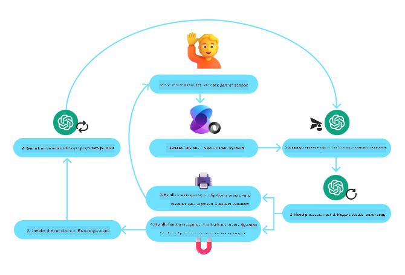
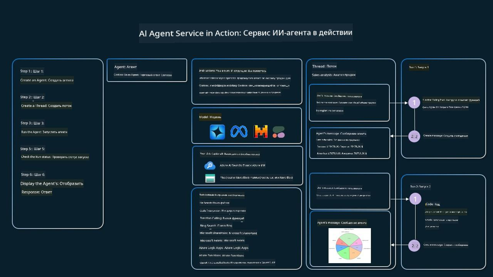

<!--
CO_OP_TRANSLATOR_METADATA:
{
  "original_hash": "88258b03f2893aa2e69eb8fb24baabbc",
  "translation_date": "2025-07-12T09:23:33+00:00",
  "source_file": "04-tool-use/README.md",
  "language_code": "ru"
}
-->
[](https://youtu.be/vieRiPRx-gI?si=cEZ8ApnT6Sus9rhn)

> _(Нажмите на изображение выше, чтобы посмотреть видео этого урока)_

# Паттерн проектирования использования инструментов

Инструменты интересны тем, что позволяют AI-агентам расширить свои возможности. Вместо того чтобы агент имел ограниченный набор действий, добавление инструмента позволяет выполнять гораздо более широкий спектр задач. В этой главе мы рассмотрим паттерн проектирования использования инструментов, который описывает, как AI-агенты могут применять конкретные инструменты для достижения своих целей.

## Введение

В этом уроке мы постараемся ответить на следующие вопросы:

- Что такое паттерн проектирования использования инструментов?
- В каких случаях его можно применять?
- Какие элементы/строительные блоки необходимы для реализации этого паттерна?
- Какие особенности нужно учитывать при использовании паттерна для создания надежных AI-агентов?

## Цели обучения

После прохождения этого урока вы сможете:

- Определить паттерн проектирования использования инструментов и его назначение.
- Выявлять случаи, в которых применим этот паттерн.
- Понимать ключевые элементы, необходимые для реализации паттерна.
- Учитывать особенности, обеспечивающие надежность AI-агентов, использующих этот паттерн.

## Что такое паттерн проектирования использования инструментов?

**Паттерн проектирования использования инструментов** направлен на предоставление LLM возможности взаимодействовать с внешними инструментами для достижения конкретных целей. Инструменты — это код, который агент может выполнять для совершения действий. Инструментом может быть простая функция, например калькулятор, или вызов API стороннего сервиса, например, для получения котировок акций или прогноза погоды. В контексте AI-агентов инструменты предназначены для выполнения агентами в ответ на **вызовы функций, сгенерированные моделью**.

## В каких случаях его можно применять?

AI-агенты могут использовать инструменты для выполнения сложных задач, получения информации или принятия решений. Паттерн проектирования использования инструментов часто применяется в сценариях, требующих динамического взаимодействия с внешними системами, такими как базы данных, веб-сервисы или интерпретаторы кода. Эта возможность полезна для различных задач, включая:

- **Динамический поиск информации:** агенты могут обращаться к внешним API или базам данных для получения актуальных данных (например, запросы к базе SQLite для анализа данных, получение котировок акций или прогноза погоды).
- **Выполнение и интерпретация кода:** агенты могут запускать код или скрипты для решения математических задач, генерации отчетов или проведения симуляций.
- **Автоматизация рабочих процессов:** автоматизация повторяющихся или многоэтапных процессов с помощью интеграции инструментов, таких как планировщики задач, почтовые сервисы или конвейеры обработки данных.
- **Поддержка клиентов:** агенты могут взаимодействовать с CRM-системами, платформами для обработки заявок или базами знаний для решения пользовательских запросов.
- **Создание и редактирование контента:** агенты могут использовать инструменты, такие как проверка грамматики, суммирование текста или оценка безопасности контента, чтобы помочь в создании материалов.

## Какие элементы/строительные блоки нужны для реализации паттерна использования инструментов?

Эти блоки позволяют AI-агенту выполнять широкий спектр задач. Рассмотрим ключевые элементы, необходимые для реализации паттерна:

- **Схемы функций/инструментов**: подробные описания доступных инструментов, включая имя функции, назначение, необходимые параметры и ожидаемые результаты. Эти схемы позволяют LLM понимать, какие инструменты доступны и как формировать корректные запросы.

- **Логика вызова функций**: определяет, как и когда инструменты вызываются на основе намерений пользователя и контекста диалога. Это может включать модули планирования, маршрутизации или условные переходы, которые динамически определяют использование инструментов.

- **Система обработки сообщений**: компоненты, управляющие потоком общения между пользовательскими запросами, ответами LLM, вызовами инструментов и их результатами.

- **Фреймворк интеграции инструментов**: инфраструктура, которая связывает агента с различными инструментами, будь то простые функции или сложные внешние сервисы.

- **Обработка ошибок и валидация**: механизмы для обработки сбоев при выполнении инструментов, проверки параметров и управления неожиданными ответами.

- **Управление состоянием**: отслеживание контекста диалога, предыдущих взаимодействий с инструментами и постоянных данных для обеспечения согласованности в многошаговых взаимодействиях.

Далее рассмотрим вызов функций/инструментов более подробно.

### Вызов функций/инструментов

Вызов функций — основной способ, с помощью которого мы даем LLM возможность взаимодействовать с инструментами. Часто термины «функция» и «инструмент» используются взаимозаменяемо, поскольку «функции» (блоки переиспользуемого кода) и есть те самые «инструменты», которые агенты используют для выполнения задач. Чтобы вызвать код функции, LLM должен сопоставить запрос пользователя с описанием функций. Для этого LLM передается схема, содержащая описания всех доступных функций. Затем LLM выбирает наиболее подходящую функцию для задачи и возвращает её имя и аргументы. Выбранная функция вызывается, её ответ отправляется обратно LLM, который использует эту информацию для ответа пользователю.

Для реализации вызова функций в агентах разработчику потребуется:

1. Модель LLM, поддерживающая вызов функций
2. Схема с описаниями функций
3. Код для каждой описанной функции

Рассмотрим пример получения текущего времени в городе:

1. **Инициализация LLM с поддержкой вызова функций:**

    Не все модели поддерживают вызов функций, поэтому важно убедиться, что используемая модель это умеет. <a href="https://learn.microsoft.com/azure/ai-services/openai/how-to/function-calling" target="_blank">Azure OpenAI</a> поддерживает вызов функций. Начнем с инициализации клиента Azure OpenAI.

    ```python
    # Initialize the Azure OpenAI client
    client = AzureOpenAI(
        azure_endpoint = os.getenv("AZURE_OPENAI_ENDPOINT"), 
        api_key=os.getenv("AZURE_OPENAI_API_KEY"),  
        api_version="2024-05-01-preview"
    )
    ```

1. **Создание схемы функции:**

    Далее определим JSON-схему, которая содержит имя функции, описание её назначения, а также имена и описания параметров. Затем передадим эту схему клиенту вместе с запросом пользователя на получение времени в Сан-Франциско. Важно отметить, что возвращается **вызов инструмента**, а **не** окончательный ответ на вопрос. Как уже упоминалось, LLM возвращает имя выбранной функции и аргументы, которые будут ей переданы.

    ```python
    # Function description for the model to read
    tools = [
        {
            "type": "function",
            "function": {
                "name": "get_current_time",
                "description": "Get the current time in a given location",
                "parameters": {
                    "type": "object",
                    "properties": {
                        "location": {
                            "type": "string",
                            "description": "The city name, e.g. San Francisco",
                        },
                    },
                    "required": ["location"],
                },
            }
        }
    ]
    ```
   
    ```python
  
    # Initial user message
    messages = [{"role": "user", "content": "What's the current time in San Francisco"}] 
  
    # First API call: Ask the model to use the function
      response = client.chat.completions.create(
          model=deployment_name,
          messages=messages,
          tools=tools,
          tool_choice="auto",
      )
  
      # Process the model's response
      response_message = response.choices[0].message
      messages.append(response_message)
  
      print("Model's response:")  

      print(response_message)
  
    ```

    ```bash
    Model's response:
    ChatCompletionMessage(content=None, role='assistant', function_call=None, tool_calls=[ChatCompletionMessageToolCall(id='call_pOsKdUlqvdyttYB67MOj434b', function=Function(arguments='{"location":"San Francisco"}', name='get_current_time'), type='function')])
    ```
  
1. **Код функции для выполнения задачи:**

    После того как LLM выбрал функцию, необходимо реализовать и выполнить код, который выполнит задачу. Мы можем написать код на Python для получения текущего времени. Также потребуется код для извлечения имени функции и аргументов из response_message, чтобы получить окончательный результат.

    ```python
      def get_current_time(location):
        """Get the current time for a given location"""
        print(f"get_current_time called with location: {location}")  
        location_lower = location.lower()
        
        for key, timezone in TIMEZONE_DATA.items():
            if key in location_lower:
                print(f"Timezone found for {key}")  
                current_time = datetime.now(ZoneInfo(timezone)).strftime("%I:%M %p")
                return json.dumps({
                    "location": location,
                    "current_time": current_time
                })
      
        print(f"No timezone data found for {location_lower}")  
        return json.dumps({"location": location, "current_time": "unknown"})
    ```

    ```python
     # Handle function calls
      if response_message.tool_calls:
          for tool_call in response_message.tool_calls:
              if tool_call.function.name == "get_current_time":
     
                  function_args = json.loads(tool_call.function.arguments)
     
                  time_response = get_current_time(
                      location=function_args.get("location")
                  )
     
                  messages.append({
                      "tool_call_id": tool_call.id,
                      "role": "tool",
                      "name": "get_current_time",
                      "content": time_response,
                  })
      else:
          print("No tool calls were made by the model.")  
  
      # Second API call: Get the final response from the model
      final_response = client.chat.completions.create(
          model=deployment_name,
          messages=messages,
      )
  
      return final_response.choices[0].message.content
     ```

    ```bash
      get_current_time called with location: San Francisco
      Timezone found for san francisco
      The current time in San Francisco is 09:24 AM.
     ```

Вызов функций лежит в основе большинства, если не всех, реализаций паттерна использования инструментов, однако реализовать его с нуля иногда бывает непросто. Как мы узнали в [Уроке 2](../../../02-explore-agentic-frameworks), агентные фреймворки предоставляют готовые строительные блоки для реализации использования инструментов.

## Примеры использования инструментов с агентными фреймворками

Ниже приведены примеры реализации паттерна использования инструментов с помощью различных агентных фреймворков:

### Semantic Kernel

<a href="https://learn.microsoft.com/azure/ai-services/agents/overview" target="_blank">Semantic Kernel</a> — это открытый AI-фреймворк для разработчиков на .NET, Python и Java, работающих с LLM. Он упрощает процесс вызова функций, автоматически описывая ваши функции и их параметры модели через процесс, называемый <a href="https://learn.microsoft.com/semantic-kernel/concepts/ai-services/chat-completion/function-calling/?pivots=programming-language-python#1-serializing-the-functions" target="_blank">сериализацией</a>. Также он управляет двусторонним взаимодействием между моделью и вашим кодом. Еще одно преимущество использования агентного фреймворка, такого как Semantic Kernel, — возможность доступа к готовым инструментам, например, <a href="https://github.com/microsoft/semantic-kernel/blob/main/python/samples/getting_started_with_agents/openai_assistant/step4_assistant_tool_file_search.py" target="_blank">Поиск файлов</a> и <a href="https://github.com/microsoft/semantic-kernel/blob/main/python/samples/getting_started_with_agents/openai_assistant/step3_assistant_tool_code_interpreter.py" target="_blank">Интерпретатор кода</a>.

Следующая диаграмма иллюстрирует процесс вызова функций в Semantic Kernel:



В Semantic Kernel функции/инструменты называются <a href="https://learn.microsoft.com/semantic-kernel/concepts/plugins/?pivots=programming-language-python" target="_blank">плагинами</a>. Мы можем преобразовать функцию `get_current_time`, которую рассматривали ранее, в плагин, превратив её в класс с этой функцией внутри. Также можно импортировать декоратор `kernel_function`, который принимает описание функции. При создании ядра с GetCurrentTimePlugin ядро автоматически сериализует функцию и её параметры, создавая схему для передачи LLM.

```python
from semantic_kernel.functions import kernel_function

class GetCurrentTimePlugin:
    async def __init__(self, location):
        self.location = location

    @kernel_function(
        description="Get the current time for a given location"
    )
    def get_current_time(location: str = ""):
        ...

```

```python 
from semantic_kernel import Kernel

# Create the kernel
kernel = Kernel()

# Create the plugin
get_current_time_plugin = GetCurrentTimePlugin(location)

# Add the plugin to the kernel
kernel.add_plugin(get_current_time_plugin)
```
  
### Azure AI Agent Service

<a href="https://learn.microsoft.com/azure/ai-services/agents/overview" target="_blank">Azure AI Agent Service</a> — это новый агентный фреймворк, предназначенный для того, чтобы разработчики могли безопасно создавать, развертывать и масштабировать качественных и расширяемых AI-агентов без необходимости управлять вычислительными и хранилищными ресурсами. Особенно полезен для корпоративных приложений, так как является полностью управляемым сервисом с корпоративным уровнем безопасности.

По сравнению с прямой разработкой через API LLM, Azure AI Agent Service предлагает ряд преимуществ, включая:

- Автоматический вызов инструментов — нет необходимости самостоятельно разбирать вызов инструмента, запускать его и обрабатывать ответ; всё это происходит на сервере
- Безопасное управление данными — вместо управления состоянием диалога самостоятельно, можно полагаться на `threads`, которые хранят всю необходимую информацию
- Инструменты из коробки — инструменты для взаимодействия с источниками данных, такими как Bing, Azure AI Search и Azure Functions.

Инструменты в Azure AI Agent Service делятся на две категории:

1. Инструменты знаний:
    - <a href="https://learn.microsoft.com/azure/ai-services/agents/how-to/tools/bing-grounding?tabs=python&pivots=overview" target="_blank">Интеграция с Bing Search</a>
    - <a href="https://learn.microsoft.com/azure/ai-services/agents/how-to/tools/file-search?tabs=python&pivots=overview" target="_blank">Поиск файлов</a>
    - <a href="https://learn.microsoft.com/azure/ai-services/agents/how-to/tools/azure-ai-search?tabs=azurecli%2Cpython&pivots=overview-azure-ai-search" target="_blank">Azure AI Search</a>

2. Инструменты действий:
    - <a href="https://learn.microsoft.com/azure/ai-services/agents/how-to/tools/function-calling?tabs=python&pivots=overview" target="_blank">Вызов функций</a>
    - <a href="https://learn.microsoft.com/azure/ai-services/agents/how-to/tools/code-interpreter?tabs=python&pivots=overview" target="_blank">Интерпретатор кода</a>
    - <a href="https://learn.microsoft.com/azure/ai-services/agents/how-to/tools/openapi-spec?tabs=python&pivots=overview" target="_blank">Инструменты, определённые OpenAI</a>
    - <a href="https://learn.microsoft.com/azure/ai-services/agents/how-to/tools/azure-functions?pivots=overview" target="_blank">Azure Functions</a>

Agent Service позволяет использовать эти инструменты вместе как `toolset`. Также он использует `threads`, которые отслеживают историю сообщений конкретного диалога.

Представьте, что вы торговый агент в компании Contoso. Вы хотите создать разговорного агента, который сможет отвечать на вопросы о ваших продажах.

Следующее изображение показывает, как можно использовать Azure AI Agent Service для анализа данных о продажах:



Чтобы использовать любой из этих инструментов с сервисом, мы можем создать клиента и определить инструмент или набор инструментов. Для практической реализации можно использовать следующий код на Python. LLM сможет просмотреть набор инструментов и решить, использовать ли пользовательскую функцию `fetch_sales_data_using_sqlite_query` или встроенный Интерпретатор кода в зависимости от запроса пользователя.

```python 
import os
from azure.ai.projects import AIProjectClient
from azure.identity import DefaultAzureCredential
from fecth_sales_data_functions import fetch_sales_data_using_sqlite_query # fetch_sales_data_using_sqlite_query function which can be found in a fetch_sales_data_functions.py file.
from azure.ai.projects.models import ToolSet, FunctionTool, CodeInterpreterTool

project_client = AIProjectClient.from_connection_string(
    credential=DefaultAzureCredential(),
    conn_str=os.environ["PROJECT_CONNECTION_STRING"],
)

# Initialize function calling agent with the fetch_sales_data_using_sqlite_query function and adding it to the toolset
fetch_data_function = FunctionTool(fetch_sales_data_using_sqlite_query)
toolset = ToolSet()
toolset.add(fetch_data_function)

# Initialize Code Interpreter tool and adding it to the toolset. 
code_interpreter = code_interpreter = CodeInterpreterTool()
toolset = ToolSet()
toolset.add(code_interpreter)

agent = project_client.agents.create_agent(
    model="gpt-4o-mini", name="my-agent", instructions="You are helpful agent", 
    toolset=toolset
)
```

## Особые моменты при использовании паттерна для создания надежных AI-агентов

Распространённая проблема при динамическом формировании SQL-запросов LLM — безопасность, особенно риск SQL-инъекций или вредоносных действий, таких как удаление или изменение базы данных. Хотя эти опасения обоснованы, их можно эффективно минимизировать, правильно настроив права доступа к базе данных. Для большинства баз данных это означает настройку режима только для чтения. Для сервисов баз данных, таких как PostgreSQL или Azure SQL, приложению следует назначить роль с правами только на чтение (SELECT).

Запуск приложения в защищённой среде дополнительно повышает уровень безопасности. В корпоративных сценариях данные обычно извлекаются и преобразуются из операционных систем в базу данных или хранилище только для чтения с удобной схемой. Такой подход гарантирует безопасность данных, оптимизацию производительности и доступность, а также ограниченный доступ приложения только для чтения.

## Дополнительные ресурсы

-

Azure AI Agents Service Workshop</a>
- <a href="https://github.com/Azure-Samples/contoso-creative-writer/tree/main/docs/workshop" target="_blank">Мастерская Contoso Creative Writer с несколькими агентами</a>
- <a href="https://learn.microsoft.com/semantic-kernel/concepts/ai-services/chat-completion/function-calling/?pivots=programming-language-python#1-serializing-the-functions" target="_blank">Руководство по вызову функций в Semantic Kernel</a>
- <a href="https://github.com/microsoft/semantic-kernel/blob/main/python/samples/getting_started_with_agents/openai_assistant/step3_assistant_tool_code_interpreter.py" target="_blank">Интерпретатор кода Semantic Kernel</a>
- <a href="https://microsoft.github.io/autogen/dev/user-guide/core-user-guide/components/tools.html" target="_blank">Инструменты Autogen</a>

## Предыдущий урок

[Понимание агентных шаблонов проектирования](../03-agentic-design-patterns/README.md)

## Следующий урок

[Agentic RAG](../05-agentic-rag/README.md)

**Отказ от ответственности**:  
Этот документ был переведен с помощью сервиса автоматического перевода [Co-op Translator](https://github.com/Azure/co-op-translator). Несмотря на наши усилия по обеспечению точности, просим учитывать, что автоматический перевод может содержать ошибки или неточности. Оригинальный документ на его исходном языке следует считать авторитетным источником. Для получения критически важной информации рекомендуется обращаться к профессиональному переводу, выполненному человеком. Мы не несем ответственности за любые недоразумения или неправильные толкования, возникшие в результате использования данного перевода.