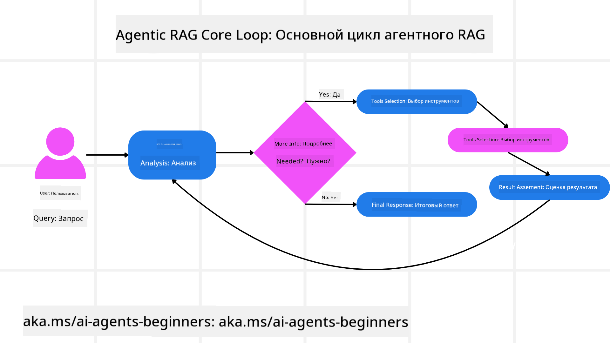
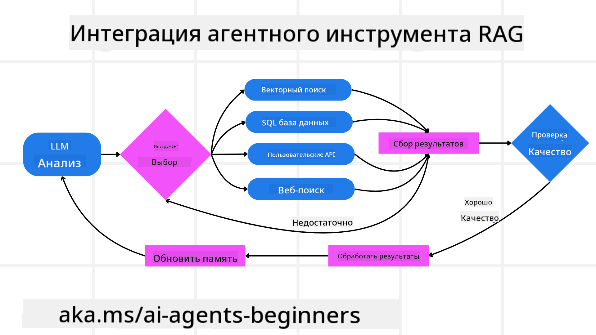
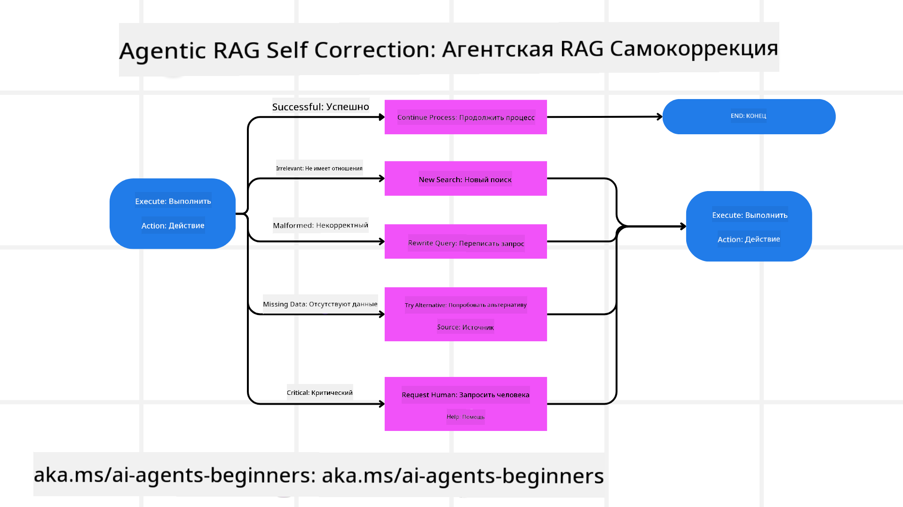
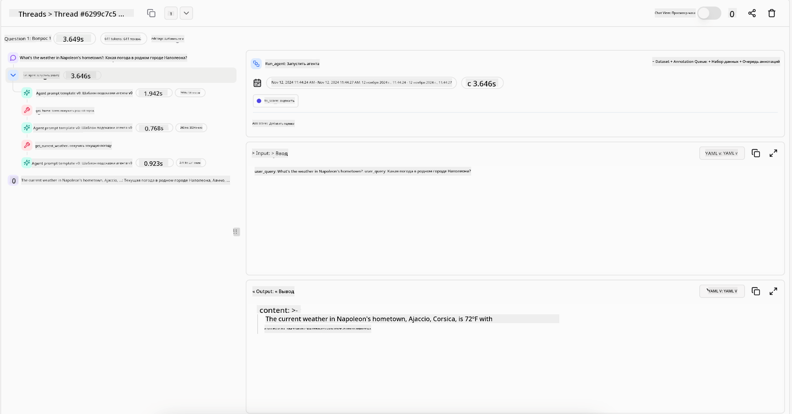
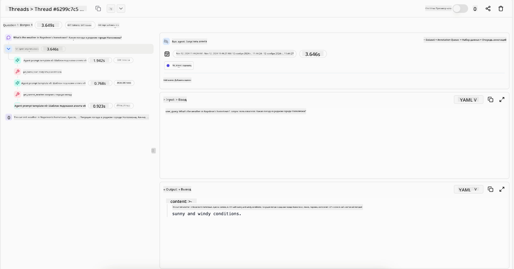

<!--
CO_OP_TRANSLATOR_METADATA:
{
  "original_hash": "7622aa72f9e676e593339f5f694ecd7d",
  "translation_date": "2025-07-12T09:50:36+00:00",
  "source_file": "05-agentic-rag/README.md",
  "language_code": "ru"
}
-->

> _(Нажмите на изображение выше, чтобы посмотреть видео этого урока)_

# Agentic RAG

В этом уроке представлен подробный обзор Agentic Retrieval-Augmented Generation (Agentic RAG) — новой парадигмы в области ИИ, где крупные языковые модели (LLM) самостоятельно планируют свои следующие шаги, извлекая информацию из внешних источников. В отличие от статичных схем «извлечь — прочитать», Agentic RAG предполагает итеративные вызовы LLM, чередующиеся с вызовами инструментов или функций и структурированными выводами. Система оценивает результаты, уточняет запросы, при необходимости подключает дополнительные инструменты и продолжает этот цикл до достижения удовлетворительного решения.

## Введение

В этом уроке вы узнаете:

- **Понимание Agentic RAG:** Ознакомитесь с новой парадигмой в ИИ, где крупные языковые модели (LLM) самостоятельно планируют свои действия, извлекая данные из внешних источников.
- **Освоение итеративного стиля Maker-Checker:** Поймёте цикл итеративных вызовов LLM, чередующихся с вызовами инструментов или функций и структурированными ответами, направленный на повышение точности и обработку некорректных запросов.
- **Изучение практических применений:** Определите ситуации, в которых Agentic RAG проявляет себя лучше всего, например, в средах с приоритетом на корректность, при работе со сложными базами данных и в длительных рабочих процессах.

## Цели обучения

После прохождения урока вы сможете/будете понимать:

- **Понимание Agentic RAG:** Узнаете о новой парадигме в ИИ, где крупные языковые модели (LLM) самостоятельно планируют свои действия, извлекая данные из внешних источников.
- **Итеративный стиль Maker-Checker:** Освоите концепцию цикла итеративных вызовов LLM, чередующихся с вызовами инструментов или функций и структурированными ответами, направленную на повышение точности и обработку некорректных запросов.
- **Владение процессом рассуждений:** Поймёте, как система самостоятельно управляет процессом рассуждений, принимая решения о подходе к решению задач без опоры на заранее заданные пути.
- **Рабочий процесс:** Узнаете, как агентная модель самостоятельно принимает решения о получении отчетов о рыночных тенденциях, выявлении данных конкурентов, корреляции внутренних метрик продаж, синтезе выводов и оценке стратегии.
- **Итеративные циклы, интеграция инструментов и память:** Познакомитесь с цикличным взаимодействием системы, поддержкой состояния и памяти между шагами, чтобы избежать повторений и принимать обоснованные решения.
- **Обработка ошибок и самокоррекция:** Изучите механизмы самокоррекции системы, включая повторные запросы, использование диагностических инструментов и привлечение человеческого контроля.
- **Границы агентности:** Поймёте ограничения Agentic RAG, связанные с автономией в рамках конкретной области, зависимостью от инфраструктуры и соблюдением ограничений.
- **Практические случаи и ценность:** Определите ситуации, в которых Agentic RAG наиболее эффективен, например, в средах с приоритетом на корректность, при работе со сложными базами данных и в длительных рабочих процессах.
- **Управление, прозрачность и доверие:** Узнаете о важности управления и прозрачности, включая объяснимость рассуждений, контроль предвзятости и человеческий надзор.

## Что такое Agentic RAG?

Agentic Retrieval-Augmented Generation (Agentic RAG) — это новая парадигма в области ИИ, где крупные языковые модели (LLM) самостоятельно планируют свои следующие шаги, извлекая информацию из внешних источников. В отличие от статичных схем «извлечь — прочитать», Agentic RAG предполагает итеративные вызовы LLM, чередующиеся с вызовами инструментов или функций и структурированными ответами. Система оценивает результаты, уточняет запросы, при необходимости подключает дополнительные инструменты и продолжает этот цикл до достижения удовлетворительного решения. Такой итеративный стиль «maker-checker» повышает точность, обрабатывает некорректные запросы и обеспечивает высокое качество результатов.

Система активно управляет процессом рассуждений, переписывая неудачные запросы, выбирая разные методы извлечения и интегрируя несколько инструментов — таких как векторный поиск в Azure AI Search, SQL-базы данных или кастомные API — прежде чем сформировать окончательный ответ. Главное отличие агентной системы — способность самостоятельно управлять процессом рассуждений. Традиционные реализации RAG опираются на заранее заданные пути, тогда как агентная система самостоятельно определяет последовательность шагов, исходя из качества найденной информации.

## Определение Agentic Retrieval-Augmented Generation (Agentic RAG)

Agentic Retrieval-Augmented Generation (Agentic RAG) — это новая парадигма в развитии ИИ, где LLM не только извлекают информацию из внешних источников, но и самостоятельно планируют свои следующие шаги. В отличие от статичных схем «извлечь — прочитать» или тщательно прописанных последовательностей подсказок, Agentic RAG представляет собой цикл итеративных вызовов LLM, чередующихся с вызовами инструментов или функций и структурированными ответами. На каждом этапе система оценивает полученные результаты, решает, нужно ли уточнить запросы, при необходимости подключает дополнительные инструменты и продолжает цикл до достижения удовлетворительного решения.

Этот итеративный стиль работы «maker-checker» направлен на повышение точности, обработку некорректных запросов к структурированным базам данных (например, NL2SQL) и обеспечение сбалансированных, качественных результатов. Вместо того чтобы полагаться только на тщательно продуманные цепочки подсказок, система активно управляет процессом рассуждений. Она может переписывать неудачные запросы, выбирать разные методы извлечения и интегрировать несколько инструментов — таких как векторный поиск в Azure AI Search, SQL-базы данных или кастомные API — прежде чем сформировать окончательный ответ. Это устраняет необходимость в сложных оркестрационных фреймворках. Вместо этого достаточно простого цикла «вызов LLM → использование инструмента → вызов LLM → …», который позволяет получать сложные и обоснованные результаты.

## Владение процессом рассуждений

Главное качество, которое делает систему «агентной», — это способность самостоятельно управлять процессом рассуждений. Традиционные реализации RAG часто зависят от заранее заданного человеком пути для модели: цепочки рассуждений, которая определяет, что и когда извлекать.  
Но когда система действительно агентная, она самостоятельно решает, как подойти к задаче. Это не просто выполнение скрипта, а автономное определение последовательности шагов на основе качества найденной информации.  
Например, если системе поручено создать стратегию запуска продукта, она не полагается только на подсказку, описывающую весь процесс исследования и принятия решений. Вместо этого агентная модель самостоятельно принимает решение:

1. Получить текущие отчёты о рыночных тенденциях с помощью Bing Web Grounding  
2. Выявить релевантные данные о конкурентах с помощью Azure AI Search  
3. Сопоставить исторические внутренние метрики продаж с помощью Azure SQL Database  
4. Синтезировать выводы в единую стратегию, координируемую через Azure OpenAI Service  
5. Оценить стратегию на предмет пробелов или несоответствий, при необходимости инициировать новый цикл извлечения  

Все эти шаги — уточнение запросов, выбор источников, итерации до достижения «удовлетворительного» ответа — принимаются моделью самостоятельно, а не прописываются заранее человеком.

## Итеративные циклы, интеграция инструментов и память

Агентная система опирается на цикличный паттерн взаимодействия:

- **Первичный вызов:** Цель пользователя (то есть пользовательская подсказка) передаётся LLM.  
- **Вызов инструмента:** Если модель обнаруживает недостаток информации или неоднозначные инструкции, она выбирает инструмент или метод извлечения — например, запрос к векторной базе данных (например, гибридный поиск Azure AI Search по приватным данным) или структурированный SQL-запрос — чтобы получить дополнительный контекст.  
- **Оценка и уточнение:** После анализа полученных данных модель решает, достаточно ли информации. Если нет, она уточняет запрос, пробует другой инструмент или меняет подход.  
- **Повтор до удовлетворения:** Цикл продолжается, пока модель не сочтёт, что имеет достаточно ясности и доказательств для предоставления окончательного, хорошо обоснованного ответа.  
- **Память и состояние:** Поскольку система сохраняет состояние и память между шагами, она может помнить предыдущие попытки и их результаты, избегая повторений и принимая более обоснованные решения по мере продвижения.

Со временем это создаёт ощущение развивающегося понимания, позволяя модели справляться со сложными многоэтапными задачами без постоянного вмешательства человека или необходимости менять подсказку.

## Обработка ошибок и самокоррекция

Автономность Agentic RAG также включает надёжные механизмы самокоррекции. Когда система сталкивается с тупиками — например, извлекает нерелевантные документы или получает некорректные запросы — она может:

- **Итерировать и повторно запрашивать:** Вместо того чтобы возвращать малоценные ответы, модель пробует новые стратегии поиска, переписывает запросы к базе данных или обращается к альтернативным наборам данных.  
- **Использовать диагностические инструменты:** Система может вызывать дополнительные функции, помогающие отладить шаги рассуждений или подтвердить корректность извлечённых данных. Инструменты вроде Azure AI Tracing важны для обеспечения надёжной наблюдаемости и мониторинга.  
- **Обращаться к человеческому контролю:** В критичных или повторяющихся ошибочных сценариях модель может сигнализировать о неуверенности и запрашивать помощь человека. После получения корректирующей обратной связи модель может учитывать её в дальнейшем.

Такой итеративный и динамичный подход позволяет модели постоянно совершенствоваться, обеспечивая не просто однократную работу, а обучение на ошибках в рамках одной сессии.

## Границы агентности

Несмотря на автономность в рамках задачи, Agentic RAG не является аналогом искусственного общего интеллекта. Его «агентные» возможности ограничены инструментами, источниками данных и политиками, предоставленными разработчиками. Он не может создавать собственные инструменты или выходить за пределы заданных доменных границ. Вместо этого он отлично справляется с динамической организацией имеющихся ресурсов.  
Ключевые отличия от более продвинутых форм ИИ включают:

1. **Доменно-специфичная автономия:** Системы Agentic RAG ориентированы на достижение целей пользователя в известной области, используя стратегии вроде переписывания запросов или выбора инструментов для улучшения результатов.  
2. **Зависимость от инфраструктуры:** Возможности системы зависят от инструментов и данных, интегрированных разработчиками. Она не может выйти за эти рамки без вмешательства человека.  
3. **Соблюдение ограничений:** Этические нормы, правила соответствия и бизнес-политики остаются крайне важными. Свобода агента всегда ограничена мерами безопасности и механизмами контроля (надеемся?).

## Практические случаи и ценность

Agentic RAG особенно эффективен в сценариях, требующих итеративного уточнения и точности:

1. **Среды с приоритетом на корректность:** В проверках соответствия, регуляторном анализе или юридических исследованиях агентная модель может многократно проверять факты, обращаться к разным источникам и переписывать запросы, пока не сформирует тщательно проверенный ответ.  
2. **Сложные взаимодействия с базами данных:** При работе со структурированными данными, где запросы часто могут не срабатывать или требовать корректировки, система самостоятельно уточняет запросы с помощью Azure SQL или Microsoft Fabric OneLake, обеспечивая соответствие итогового извлечения намерениям пользователя.  
3. **Длительные рабочие процессы:** Длительные сессии могут развиваться по мере появления новой информации. Agentic RAG способен постоянно интегрировать новые данные, меняя стратегии по мере углубления в проблему.

## Управление, прозрачность и доверие

По мере того как эти системы становятся более автономными в рассуждениях, управление и прозрачность приобретают ключевое значение:

- **Объяснимость рассуждений:** Модель может предоставить аудиторский след запросов, источников и шагов рассуждений, которые она использовала для вывода. Инструменты вроде Azure AI Content Safety и Azure AI Tracing / GenAIOps помогают поддерживать прозрачность и снижать риски.  
- **Контроль предвзятости и сбалансированное извлечение:** Разработчики могут настраивать стратегии извлечения, чтобы учитывать сбалансированные и репрезентативные источники данных, а также регулярно проверять результаты на наличие предвзятости или искажений с помощью кастомных моделей для продвинутых дата-сайенс организаций, использующих Azure Machine Learning.  
- **Человеческий надзор и соответствие:** Для чувствительных задач необходим человеческий контроль. Agentic RAG не заменяет человеческое суждение в критичных решениях — он дополняет его, предоставляя более тщательно проверенные варианты.

Наличие инструментов, обеспечивающих чёткий учёт действий, крайне важно. Без них отладка многоэтапного процесса может быть очень сложной. Ниже приведён пример из Literal AI (компания, стоящая за Chainlit) для запуска агента:

## Заключение

Agentic RAG представляет собой естественную эволюцию в том, как ИИ-системы справляются со сложными задачами, требующими интенсивной работы с данными. Применяя цикличный паттерн взаимодействия, самостоятельно выбирая инструменты и уточняя запросы до получения качественного результата, система выходит за рамки статичного следования подсказкам и становится более адаптивным, контекстно осведомлённым принимающим решения. Несмотря на ограничения, заданные инфраструктурой и этическими нормами, эти агентные возможности обеспечивают более богатое, динамичное и в конечном итоге более полезное взаимодействие с ИИ как для предприятий, так и для конечных пользователей.

## Дополнительные ресурсы

- <a href="https://learn.microsoft.com/training/modules/use-own-data-azure-openai" target="_blank">Реализация Retrieval Augmented Generation (RAG) с помощью Azure OpenAI Service: Узнайте, как использовать собственные данные с Azure OpenAI Service. Этот модуль Microsoft Learn предоставляет подробное руководство по реализации RAG</a>

- <a href="https://learn.microsoft.com/azure/ai-studio/concepts/evaluation-approach-gen-ai" target="_blank">Оценка приложений генеративного ИИ с помощью Azure AI Foundry: В этой статье рассматривается оценка и сравнение моделей на общедоступных наборах данных, включая Agentic AI приложения и архитектуры RAG</a>
- <a href="https://weaviate.io/blog/what-is-agentic-rag" target="_blank">Что такое Agentic RAG | Weaviate</a>
- <a href="https://ragaboutit.com/agentic-rag-a-complete-guide-to-agent-based-retrieval-augmented-generation/" target="_blank">Agentic RAG: Полное руководство по агентно-ориентированному Retrieval Augmented Generation – Новости от generation RAG</a>
- <a href="https://huggingface.co/learn/cookbook/agent_rag" target="_blank">Agentic RAG: ускорьте ваш RAG с помощью реформулировки запросов и самозапроса! Открытая книга рецептов ИИ от Hugging Face</a>
- <a href="https://youtu.be/aQ4yQXeB1Ss?si=2HUqBzHoeB5tR04U" target="_blank">Добавление агентных слоев в RAG</a>
- <a href="https://www.youtube.com/watch?v=zeAyuLc_f3Q&t=244s" target="_blank">Будущее помощников по знаниям: Джерри Лю</a>
- <a href="https://www.youtube.com/watch?v=AOSjiXP1jmQ" target="_blank">Как создавать агентные RAG-системы</a>
- <a href="https://ignite.microsoft.com/sessions/BRK102?source=sessions" target="_blank">Использование Azure AI Foundry Agent Service для масштабирования ваших ИИ-агентов</a>

### Научные статьи

- <a href="https://arxiv.org/abs/2303.17651" target="_blank">2303.17651 Self-Refine: Итеративное улучшение с помощью самоконтроля</a>
- <a href="https://arxiv.org/abs/2303.11366" target="_blank">2303.11366 Reflexion: Языковые агенты с вербальным обучением с подкреплением</a>
- <a href="https://arxiv.org/abs/2305.11738" target="_blank">2305.11738 CRITIC: Большие языковые модели могут самокорректироваться с помощью интерактивной критики инструментов</a>
- <a href="https://arxiv.org/abs/2501.09136" target="_blank">2501.09136 Agentic Retrieval-Augmented Generation: Обзор Agentic RAG</a>

## Предыдущий урок

[Паттерн использования инструментов](../04-tool-use/README.md)

## Следующий урок

[Создание надежных ИИ-агентов](../06-building-trustworthy-agents/README.md)

**Отказ от ответственности**:  
Этот документ был переведен с помощью сервиса автоматического перевода [Co-op Translator](https://github.com/Azure/co-op-translator). Несмотря на наши усилия по обеспечению точности, просим учитывать, что автоматические переводы могут содержать ошибки или неточности. Оригинальный документ на его исходном языке следует считать авторитетным источником. Для получения критически важной информации рекомендуется обращаться к профессиональному переводу, выполненному человеком. Мы не несем ответственности за любые недоразумения или неправильные толкования, возникшие в результате использования данного перевода.